# EA SRE 3 Interview Preparation Guide

## Table of Contents

- [Introduction](#introduction)
- [☁️ AWS Architecture](#aws-architecture)
- [🌐 Multi-Cloud](#multi-cloud)
- [🛡️ Reliability](#reliability)
- [📈 Scalability](#scalability)
- [👁️ Observability](#observability)
- [💰 Cost Optimization](#cost-optimization)
- [🗣️ Behavioral Questions](#behavioral-questions)
- [🚨 Incident and Problem Management](#incident-and-problem-management)
- [👨‍🏫 Leadership and Mentorship](#leadership-and-mentorship)
- [📊 Service Level Management](#service-level-management)
- [📚 Documentation and Knowledge Sharing](#documentation-and-knowledge-sharing)
- [🔧 Strategic Technology and Continuous Improvement](#strategic-technology-and-continuous-improvement)
- [🔒 Security and Compliance](#security-and-compliance)
- [🤝 Strategic Leadership and Stakeholder Management](#strategic-leadership-and-stakeholder-management)
- [🛠️ Technical Expertise Deep Dive](#technical-expertise-deep-dive)
- [⚙️ Operational Excellence](#operational-excellence)
- [🧠 Soft Skills and Experience](#soft-skills-and-experience)
- [☁️ Advanced AWS Scenarios](#advanced-aws-scenarios)
- [🌐 Multi-Cloud Advanced](#multi-cloud-advanced)
- [🛡️ Reliability Deep Dive](#reliability-deep-dive)
- [📈 Scalability Scenarios](#scalability-scenarios)
- [👁️ Observability Mastery](#observability-mastery)
- [💰 Cost Optimization Advanced](#cost-optimization-advanced)
- [🚨 Incident Management Scenarios](#incident-management-scenarios)
- [👨‍🏫 Leadership and Culture](#leadership-and-culture)
- [🔒 Security Integration](#security-integration)
- [🌐 Networking Expertise](#networking-expertise)

## Introduction

This guide prepares for **EA SRE 3** interviews, covering **AWS architecture**, multi-cloud, reliability, scalability, observability, and cost optimization. It includes 50+ scenario-based questions with detailed answers and examples.

**SREs** at this level design and maintain *highly reliable*, *scalable*, *cost-effective* systems, demonstrating expertise in cloud tech, automation, monitoring, and incident response.

**Think About:** What personal experiences from your SRE role align with these topics?

## ☁️ AWS Architecture

### 1. How would you design a highly available web application on AWS?

**Answer:**
- Use multi-AZ architecture with **Auto Scaling groups**, **Elastic Load Balancers (ELB)**, and **Amazon RDS** with Multi-AZ deployment.
  - **Why:** Ensures redundancy across isolated zones, preventing single points of failure and improving fault tolerance; benefits include higher availability and resilience against regional issues.
- Deploy **EC2 instances** in at least two **Availability Zones** behind an **Application Load Balancer (ALB)** to distribute traffic.
  - **Why:** Balances load evenly, handles traffic spikes, and routes around failed instances; rationale is to maintain performance and uptime during variable demand.
- Use **Auto Scaling** to adjust instance count based on CPU utilization or request count.
  - **Why:** Dynamically scales resources to match demand, optimizing costs and performance; prevents over-provisioning or under-provisioning.
- For the database, configure **Amazon RDS** with Multi-AZ for automatic failover.
  - **Why:** Provides synchronous replication and automatic failover, minimizing downtime; benefits database reliability and data consistency.
- Implement **Route 53** for DNS with health checks to route traffic away from unhealthy instances.
  - **Why:** Enables global DNS routing and failover, directing users to healthy endpoints; improves user experience by avoiding outages.

**Service Explanations:**

| Service | Description |
|---------|-------------|
| Auto Scaling groups | Automatically adjusts the number of EC2 instances in response to demand. |
| Elastic Load Balancers (ELB) | Distributes incoming traffic across multiple targets. |
| Amazon RDS | Managed relational database service for easy setup and scaling. |
| EC2 instances | Virtual servers in the cloud for running applications. |
| Application Load Balancer (ALB) | Layer 7 load balancer for HTTP/HTTPS traffic. |
| Route 53 | Scalable DNS web service. |

**Special Notes:**
- Multi-AZ: Deploy resources across multiple Availability Zones for high availability.
- Health checks: Periodic tests to verify resource health and trigger failovers.

*Example:* In a gaming application, if one AZ fails due to a power outage, the ALB automatically routes traffic to healthy instances in other AZs, and RDS fails over seamlessly, minimizing downtime.

**Diagram:**

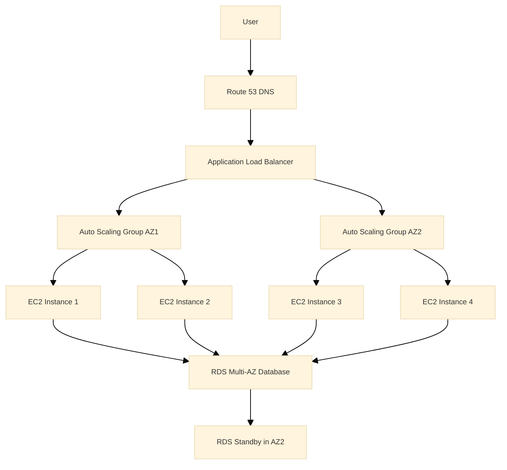

### 2. Explain how to architect a serverless application using AWS Lambda and API Gateway.

**Answer:**
- Use **AWS Lambda** for compute, **API Gateway** for API management, and **DynamoDB** for storage.
  - **Why:** Leverages managed services to reduce operational overhead; benefits include automatic scaling, cost-efficiency (pay-per-use), and faster development.
- **API Gateway** acts as the entry point, triggering **Lambda functions** based on HTTP requests.
  - **Why:** Provides secure, scalable API management with features like throttling; rationale is to handle client requests efficiently and securely.
- **Lambda functions** are stateless and scale automatically.
  - **Why:** Ensures no server management and instant scaling; improves reliability and reduces costs during idle periods.
- Use **CloudWatch** for monitoring and **X-Ray** for tracing.
  - **Why:** Enables real-time insights and debugging; benefits proactive issue detection and performance optimization.
- Implement **IAM roles** for least-privilege access.
  - **Why:** Enhances security by granting only necessary permissions; prevents unauthorized access and complies with best practices.

**Service Explanations:**
- **AWS Lambda:** Serverless compute service running code in response to events.
- **API Gateway:** Fully managed service for creating, publishing, and securing APIs.
- **DynamoDB:** NoSQL database for high-performance, scalable applications.
- **CloudWatch:** Monitoring and observability service for AWS resources.
- **X-Ray:** Distributed tracing service for analyzing application performance.
- **IAM roles:** Identities with permissions for AWS services.

**Special Notes:**
- Serverless: No server management; scales automatically.
- Least-privilege: Grant minimal permissions to reduce security risks.

*Example:* A mobile app backend where user authentication triggers a Lambda function to query DynamoDB for user data. If traffic spikes during a game launch, Lambda scales to handle thousands of concurrent requests without manual intervention.

**Diagram:**

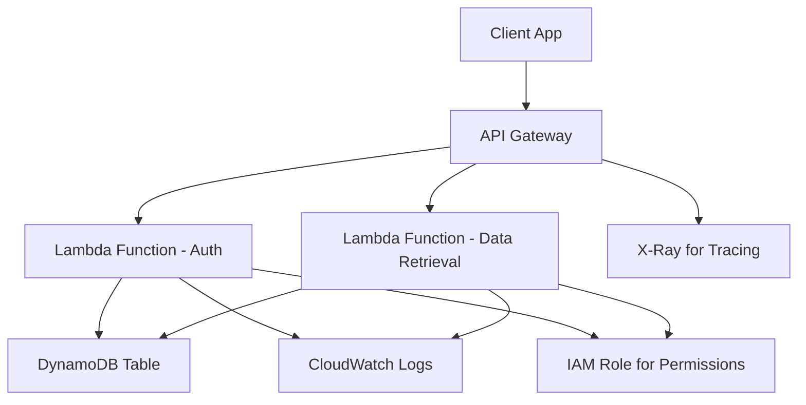

### 3. How do you handle data migration from on-premises to AWS?

**Answer:**
- Use **AWS Database Migration Service (DMS)** for homogeneous migrations or **AWS Snowball** for large datasets.
  - **Why:** DMS handles ongoing replication efficiently; Snowball speeds up large transfers; benefits include reduced downtime and secure data movement.
- Assess data dependencies, plan cutover windows, and perform dry runs.
  - **Why:** Identifies risks and ensures smooth transition; rationale is to avoid data loss or compatibility issues.
- For minimal downtime, use change data capture (CDC) in **DMS** to replicate ongoing changes.
  - **Why:** Captures real-time changes; minimizes service interruption during migration.

**Service Explanations:**
- **AWS Database Migration Service (DMS):** Managed service for migrating databases to AWS.
- **AWS Snowball:** Physical device for secure, high-speed data transfer.

**Special Notes:**
- Change Data Capture (CDC): Process to capture and replicate database changes in real-time.
- Dry runs: Test migrations without affecting production to validate processes.

*Example:* Migrating a 10TB database: Use Snowball to transfer initial data, then DMS with CDC to sync changes, ensuring the application switches to AWS with less than 1 hour downtime.

### 4. Describe architecting a microservices-based application on AWS.

**Answer:**
- Use **ECS** or **EKS** for container orchestration, **API Gateway** for service communication, and **EventBridge** for event-driven architecture.
  - **Why:** Orchestration manages scaling and deployment; API Gateway handles routing; EventBridge decouples services; benefits modularity, scalability, and fault isolation.
- Each microservice runs in its own container, with service discovery via **Cloud Map**.
  - **Why:** Isolates failures and enables independent scaling; Cloud Map automates discovery; improves maintainability and reliability.
- Implement circuit breakers with **AWS App Mesh** for resilience.
  - **Why:** Prevents cascading failures by stopping requests to failing services; enhances overall system stability.

**Service Explanations:**
- **ECS:** Container orchestration service for running Docker containers.
- **EKS:** Managed Kubernetes service for containerized applications.
- **API Gateway:** Manages APIs and routes requests to microservices.
- **EventBridge:** Serverless event bus for connecting applications.
- **Cloud Map:** Service discovery for microservices.
- **AWS App Mesh:** Service mesh for microservice communication and observability.

**Special Notes:**
- Circuit breakers: Pattern to stop failing service calls and allow recovery.
- Microservices: Architecture breaking apps into small, independent services.

*Example:* An e-commerce platform with separate services for user management, inventory, and payments. If the payment service fails, App Mesh routes traffic to a fallback, preventing full system outage.

**Diagram:**

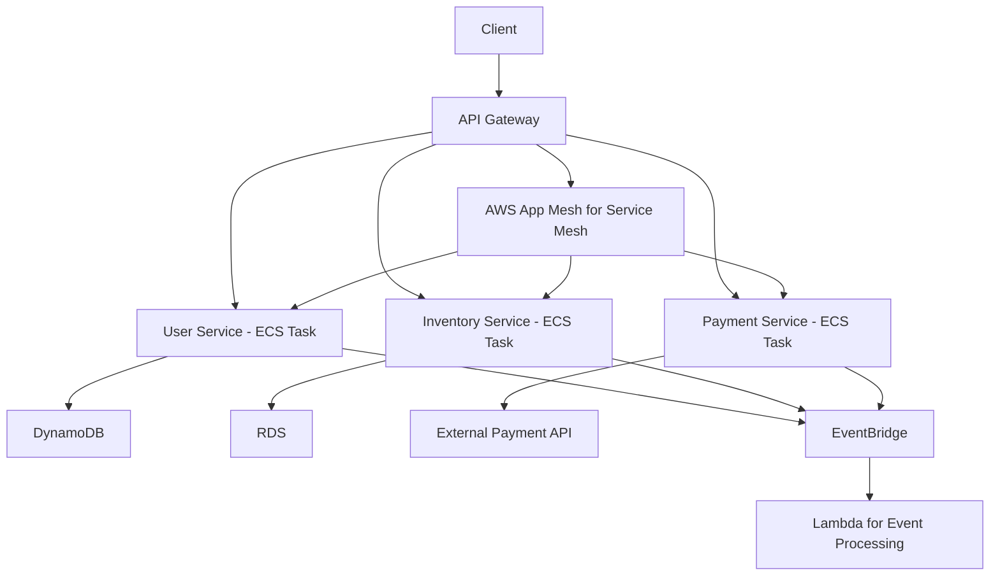

### 5. How do you secure an AWS architecture?

**Answer:**
- Implement the principle of least privilege with **IAM**.
  - **Why:** Grants only necessary permissions; reduces breach impact and enforces security best practices.
- Use **VPC** with security groups and **NACLs**.
  - **Why:** Isolates resources and controls traffic; benefits network segmentation and protection against unauthorized access.
- Enable encryption with **KMS**.
  - **Why:** Protects data at rest and in transit; ensures compliance and prevents data exposure.
- Deploy **WAF** for web applications.
  - **Why:** Filters malicious web traffic; mitigates attacks like SQL injection and XSS.
- Use **AWS Config** and **GuardDuty** for compliance monitoring.
  - **Why:** Continuously audits configurations and detects threats; improves proactive security and compliance.

**Service Explanations:**
- **IAM:** Manages access to AWS services and resources.
- **VPC:** Virtual private cloud for network isolation.
- **NACLs:** Network Access Control Lists for subnet-level traffic control.
- **KMS:** Key Management Service for encryption keys.
- **WAF:** Web Application Firewall for protecting web apps.
- **AWS Config:** Service for compliance auditing and configuration tracking.
- **GuardDuty:** Threat detection service using ML.

**Special Notes:**
- Least privilege: Grant minimal access required for tasks.
- Encryption: Process of converting data to secure it from unauthorized access.

*Example:* For a financial app, restrict EC2 access to specific IP ranges via security groups, encrypt S3 buckets with SSE-KMS, and use WAF to block SQL injection attacks.

**Diagram:**

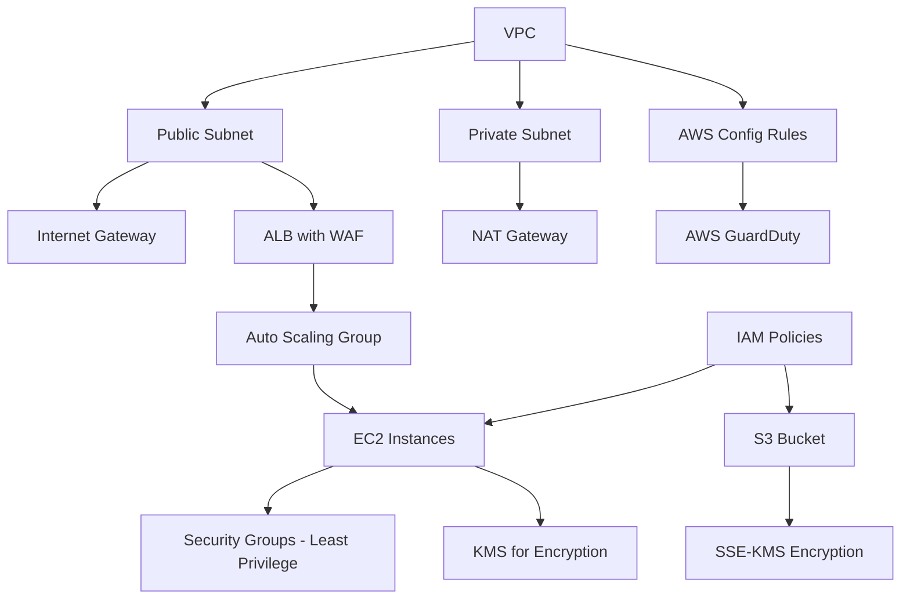

### 6. Explain designing for disaster recovery on AWS.

**Answer:**
- Use a multi-region strategy with pilot light or warm standby.
  - **Why:** Minimizes costs while ensuring quick recovery; pilot light keeps minimal resources running, warm standby has partial capacity.
- Replicate data with **Cross-Region Replication (CRR)** for **S3** and **Global Tables** for **DynamoDB**.
  - **Why:** Ensures data availability across regions; benefits low RTO and data durability.
- Automate recovery with **CloudFormation** and **Route 53** failover.
  - **Why:** Speeds up restoration and reduces manual errors; Route 53 routes traffic to healthy regions.

**Service Explanations:**
- **S3:** Object storage service with high durability.
- **DynamoDB:** NoSQL database with global tables for multi-region replication.
- **CloudFormation:** IaC service for provisioning AWS resources.
- **Route 53:** DNS service with failover capabilities.

**Special Notes:**
- Pilot light: Minimal resources running in backup region for quick scaling.
- Warm standby: Partial infrastructure ready in backup region.
- RTO: Recovery Time Objective, time to restore service.

*Example:* In a global outage, Route 53 switches DNS to a backup region, and EC2 instances launch from pre-configured AMIs, restoring service within 30 minutes.

**Diagram:**

```mermaid
graph TD
    PrimaryRegion[Primary Region] --> EC2_P[EC2 Instances]
    PrimaryRegion --> RDS_P[RDS Database]
    PrimaryRegion --> S3_P[S3 Bucket]
    BackupRegion[Backup Region] --> EC2_B[Pilot Light EC2]
    BackupRegion --> RDS_B[Warm Standby RDS]
    BackupRegion --> S3_B[S3 with CRR]
    Route53[Route 53] --> PrimaryRegion
    Route53 --> BackupRegion
    CloudFormation[CloudFormation] --> PrimaryRegion
    CloudFormation --> BackupRegion
    Note over Route53: Failover on Health Check Failure
```

### 7. How do you optimize network performance in AWS?

**Answer:**
- Use **CloudFront** for global distribution.
  - **Why:** Caches content at edge locations; reduces latency and bandwidth costs for global users.
- **VPC endpoints** for private access to AWS services.
  - **Why:** Avoids public internet routing; improves security and performance by reducing hops.
- **Transit Gateway** for multi-VPC connectivity.
  - **Why:** Simplifies network architecture; enables efficient routing between VPCs.
- Monitor with **VPC Flow Logs** and optimize instance types for network throughput.
  - **Why:** Provides visibility into traffic; allows tuning for better performance and cost.

**Service Explanations:**
- **CloudFront:** CDN for delivering content with low latency.
- **VPC endpoints:** Private connections to AWS services without internet.
- **Transit Gateway:** Network hub for connecting VPCs and on-premises networks.
- **VPC Flow Logs:** Captures IP traffic information for monitoring.

**Special Notes:**
- Network throughput: Amount of data transferred over a network in a given time.
- Edge locations: Points of presence for faster content delivery.

*Example:* A video streaming service uses CloudFront to cache content at edge locations, reducing latency from 500ms to 50ms for users worldwide.

### 8. Describe architecting a data lake on AWS.

**Answer:**
- Use **S3** as the storage layer, **Glue** for ETL, **Athena** for querying, and **Lake Formation** for governance.
  - **Why:** S3 provides scalable storage; Glue automates ETL; Athena enables SQL queries; Lake Formation secures and manages access; benefits cost-effective analytics and data processing.
- Ingest data via **Kinesis** or **DMS**, catalog with **Glue Catalog**.
  - **Why:** Kinesis streams real-time data; DMS migrates databases; Glue Catalog organizes metadata; improves data discoverability and integration.

**Service Explanations:**
- **S3:** Scalable object storage for data lakes.
- **Glue:** ETL service for data preparation.
- **Athena:** Serverless query service for data in S3.
- **Lake Formation:** Service for building and managing data lakes.
- **Kinesis:** Real-time data streaming service.
- **DMS:** Database migration service.
- **Glue Catalog:** Metadata repository for data assets.

**Special Notes:**
- ETL: Extract, Transform, Load process for data integration.
- Data lake: Centralized repository for storing structured and unstructured data.

*Example:* For analytics, raw game telemetry data is stored in S3, processed by Glue jobs into Parquet format, and queried via Athena for player behavior insights.

**Diagram:**

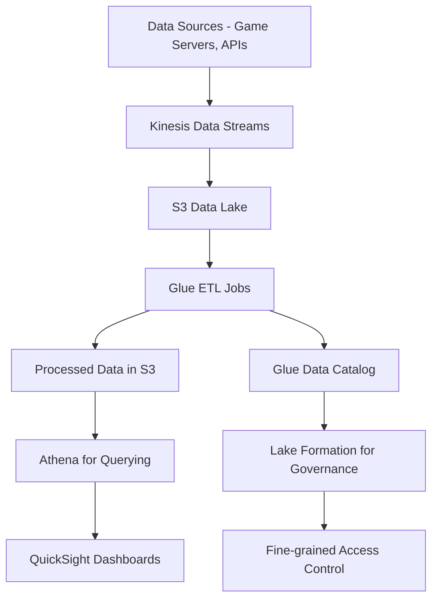

### Key Takeaways
- Designing highly available architectures with multi-AZ and auto-scaling is fundamental for reliability.
- Serverless architectures reduce operational overhead but require careful monitoring for cold starts.
- Data migration strategies must account for downtime and data integrity using tools like DMS.
- Microservices benefit from service meshes for resilience and observability.
- Security is layered, starting with IAM and VPC, and includes encryption and monitoring.
- Disaster recovery plans include pilot light and automated failover for quick restoration.
- Network optimization uses CDNs and VPC endpoints to reduce latency and costs.
- Data lakes leverage S3 and managed services for scalable analytics.

**Think About:** Which of these architectures have you implemented, and what challenges did you face?

## 🌐 Multi-Cloud

### 9. How would you design a multi-cloud strategy for high availability?

**Answer:**
- Use cloud-agnostic tools like Terraform for IaC, Kubernetes for orchestration across clouds, and DNS-based failover.
  - **Why:** Terraform ensures consistent infrastructure across providers; Kubernetes manages containers portably; DNS failover redirects traffic during failures; benefits vendor neutrality, reduced lock-in, and improved resilience.
- Replicate data with tools like Velero for backups.
  - **Why:** Enables cross-cloud data recovery and portability; prevents data loss during outages; benefits high availability and disaster recovery.
  - **Why:** Enables cross-cloud data recovery; prevents data loss during outages.

**Service Explanations:**
- **Terraform:** IaC tool for provisioning resources across providers.
- **Kubernetes:** Container orchestration platform.
- **DNS:** Domain Name System for routing.
- **Velero:** Backup and restore tool for Kubernetes.

**Special Notes:**
- Cloud-agnostic: Tools that work across multiple cloud providers.
- IaC: Infrastructure as Code for automated provisioning.

*Example:* Deploy an app on AWS and Azure; if AWS region fails, update DNS to route to Azure, ensuring continuity.

**Diagram:**

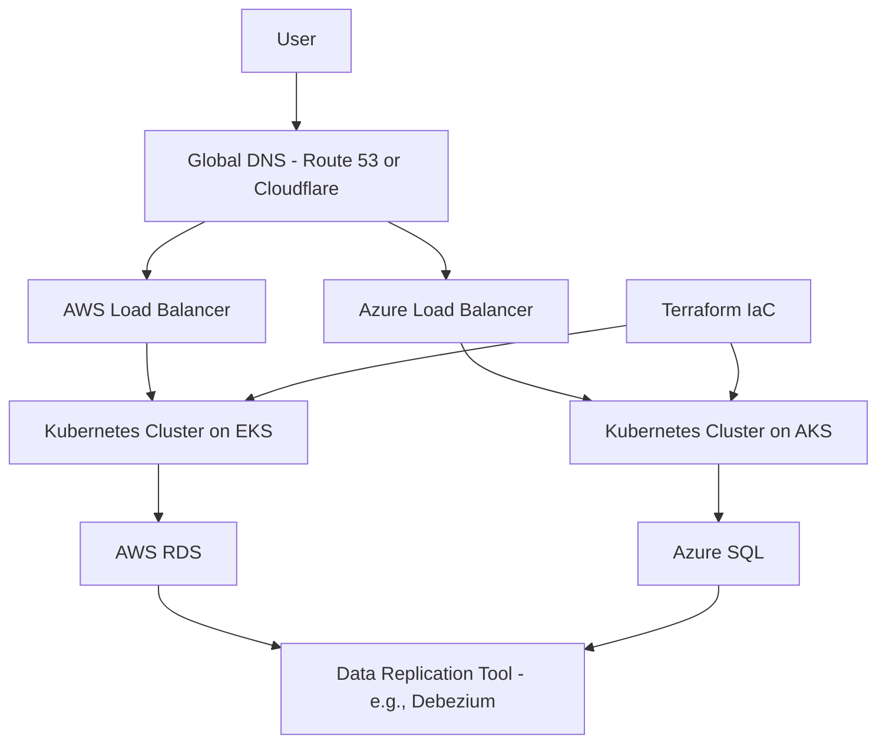

### 10. Explain challenges in multi-cloud management and solutions.

**Answer:**
- Challenges:
  - Vendor lock-in
  - Data transfer costs
  - Complexity
- Solutions:
  - Use open-source tools
    - **Why:** Reduces dependency on proprietary services; benefits portability and cost savings.
  - Implement hybrid networking with VPNs
    - **Why:** Secures connections between clouds; enables seamless data flow.
  - Monitor with multi-cloud tools like Datadog
    - **Why:** Provides unified visibility; simplifies troubleshooting across environments.

**Service Explanations:**
- **VPNs:** Virtual Private Networks for secure connections.
- **Datadog:** Monitoring platform for multi-cloud environments.

**Special Notes:**
- Vendor lock-in: Dependency on a single provider's services.
- Data transfer costs: Fees for moving data between clouds.

*Example:* Managing costs by using spot instances on AWS and preemptible VMs on GCP, monitored via a unified dashboard.

### 11. How do you handle data consistency across multiple clouds?

**Answer:**
- Use eventual consistency models, tools like Apache Kafka for data streaming, or database federation.
  - **Why:** Allows for distributed data without strict synchronization; Kafka enables real-time streaming; federation accesses multiple databases as one; benefits scalability, fault tolerance, and reduced complexity.
- Implement conflict resolution strategies.
  - **Why:** Handles discrepancies in data updates; ensures data integrity across clouds; benefits consistency and reliability.
  - **Why:** Handles discrepancies in data updates; ensures data integrity across clouds.

**Service Explanations:**
- **Apache Kafka:** Distributed event streaming platform.

**Special Notes:**
- Eventual consistency: Data becomes consistent over time, not immediately.
- Database federation: Technique to access multiple databases as one.

*Example:* User data synced between AWS DynamoDB and Azure Cosmos DB using Kafka, with last-write-wins for conflicts.

### 12. Describe migrating workloads between clouds.

**Answer:**
- Assess dependencies, use tools like AWS Migration Hub or Azure Migrate.
  - **Why:** Identifies what needs migration and risks; tools automate discovery and planning; reduces risks and downtime.
- Perform phased migrations with testing.
  - **Why:** Allows gradual transition; testing validates functionality; minimizes downtime and issues.
  - **Why:** Allows gradual transition; testing validates functionality; minimizes downtime.

**Service Explanations:**
- **AWS Migration Hub:** Central place to track migrations.
- **Azure Migrate:** Tool for assessing and migrating to Azure.

**Special Notes:**
- Phased migrations: Breaking migration into stages for control.
- Dependencies: Resources or services that must be migrated together.

*Example:* Migrating VMs from AWS to GCP using Velero for Kubernetes apps, ensuring zero data loss.

### 13. How do you ensure security in a multi-cloud environment?

**Answer:**
- Use consistent IAM policies, encrypt data in transit with TLS, and deploy unified security tools like CrowdStrike.
  - **Why:** Consistent policies standardize access; TLS secures data; unified tools provide cross-cloud protection; benefits comprehensive security and compliance.
  - **Why:** Consistent policies standardize access; TLS secures data; unified tools provide cross-cloud protection; benefits comprehensive security.

**Service Explanations:**
- **IAM:** Identity and Access Management for permissions.
- **TLS:** Transport Layer Security for encrypting communications.
- **CrowdStrike:** Unified security platform for threat detection.

**Special Notes:**
- SSO: Single Sign-On for accessing multiple systems.
- VPC peering: Connecting VPCs across clouds securely.

*Example:* Implementing SSO with Okta across AWS and Azure, with encrypted VPC peering.

### 14. Explain cost optimization in multi-cloud setups.

**Answer:**
- Use reserved instances where possible, monitor with tools like CloudHealth, and right-size resources dynamically.
  - **Why:** Reserved instances reduce costs for predictable workloads; monitoring identifies waste; right-sizing matches capacity to needs; benefits significant savings and efficiency.
  - **Why:** Reserved instances reduce costs for predictable workloads; monitoring identifies waste; right-sizing matches capacity to needs; benefits significant savings.

**Service Explanations:**
- **Reserved instances:** Pre-paid instances for discounted rates.
- **CloudHealth:** Cost management and optimization platform.

**Special Notes:**
- Right-sizing: Adjusting resource sizes to fit actual usage.
- Cost optimization: Strategies to reduce cloud spending without sacrificing performance.

*Example:* Running compute-intensive tasks on GCP's cheaper instances and storage on AWS S3, saving 20% monthly.

### 15. How do you monitor multi-cloud applications?

**Answer:**
- Use tools like Prometheus with multi-cloud exporters or commercial solutions like New Relic for unified monitoring.
  - **Why:** Prometheus is open-source and extensible; New Relic provides commercial support; benefits centralized visibility and faster issue resolution.
  - **Why:** Prometheus is open-source and extensible; New Relic provides commercial support; benefits centralized visibility and faster issue resolution.

**Service Explanations:**
- **Prometheus:** Monitoring and alerting toolkit.
- **New Relic:** Application performance monitoring platform.

**Special Notes:**
- Exporters: Components that collect metrics from services for Prometheus.
- Unified monitoring: Single view of systems across multiple clouds.

*Example:* Alerting on latency spikes in either cloud via a single dashboard.

### 16. Describe disaster recovery in multi-cloud.

**Answer:**
- Implement active-active or active-passive setups with automated failover scripts.
  - **Why:** Active-active runs in both clouds; active-passive keeps one as backup; automation speeds recovery; benefits high availability and minimal downtime.
  - **Why:** Active-active runs in both clouds; active-passive keeps one as backup; automation speeds recovery; benefits high availability and minimal downtime.

**Special Notes:**
- Active-active: Both clouds serve traffic simultaneously.
- Active-passive: One cloud active, other standby.
- Failover scripts: Automated processes to switch to backup.

*Example:* If AWS fails, Terraform provisions resources on Azure automatically.

### Key Takeaways
- Multi-cloud strategies use cloud-agnostic tools like Terraform for IaC and Kubernetes for portability.
- Challenges include vendor lock-in, data transfer costs, and complexity; solutions involve open-source tools and unified monitoring.
- Data consistency can be managed with eventual consistency and tools like Kafka.
- Workload migration requires phased approaches and assessment of dependencies.
- Security in multi-cloud emphasizes consistent IAM and encryption.
- Cost optimization leverages reserved instances and spot instances across providers.
- Monitoring multi-cloud applications benefits from unified tools like Datadog.

**Think About:** Have you worked in a multi-cloud environment? What were the biggest hurdles?

## 🛡️ Reliability

### 17. How do you define and measure reliability in SRE?

**Answer:**
- Measured by **SLIs**: uptime, latency, error rates.
  - **Why:** Quantifies service performance objectively; enables data-driven decisions on reliability.
- **SLOs** set targets, e.g., 99.9% uptime.
  - **Why:** Defines acceptable reliability levels; guides engineering efforts and balances trade-offs.
- **SLAs** define consequences.
  - **Why:** Outlines penalties or actions for missing targets; aligns business and technical expectations.
  - **Why:** Outlines penalties or actions for missing targets; aligns business and tech.

**Special Notes:**
- SLIs: Service Level Indicators, metrics for measuring performance.
- SLOs: Service Level Objectives, targets for SLIs.
- SLAs: Service Level Agreements, contracts with consequences.

*Example:* For a game server, SLI is successful logins per minute; SLO is 99.95% success rate.

### 18. Explain implementing chaos engineering in AWS.

**Answer:**
- Use AWS Fault Injection Simulator (FIS) to inject failures like instance terminations.
  - **Why:** Tests system under stress; identifies weaknesses proactively; benefits improved resilience and preparedness.
- Monitor impact and improve resilience.
  - **Why:** Observes behavior during failures; leads to better design and fixes; benefits overall system stability.
  - **Why:** Observes behavior during failures; leads to better design.

**Service Explanations:**
- **AWS Fault Injection Simulator (FIS):** Service for running chaos experiments on AWS.

**Special Notes:**
- Chaos engineering: Practice of testing systems by introducing failures.
- Resilience: Ability to recover from disruptions.

*Example:* Simulating AZ failure to ensure auto-scaling kicks in within 5 minutes.

### 19. How do you handle incident response?

**Answer:**
- Follow a structured process: detect via monitoring, assess impact, contain, eradicate, recover, and learn via post-mortems.
  - **Why:** Ensures systematic handling; reduces downtime; improves future responses through learning.
  - **Why:** Ensures systematic handling; reduces downtime and improves future responses.

**Special Notes:**
- Incident response: Steps to manage and resolve system disruptions.
- Post-mortems: Reviews after incidents to learn and prevent recurrence.

*Example:* During a DDoS attack, use Shield and WAF to mitigate, then analyze logs for prevention.

### 20. Describe building resilient microservices.

**Answer:**
- Implement retries, circuit breakers with Hystrix, and bulkheads to isolate failures.
  - **Why:** Retries handle transient errors; circuit breakers stop failing calls; bulkheads limit failure spread; benefits overall system stability and fault tolerance.
  - **Why:** Retries handle transient errors; circuit breakers stop failing calls; bulkheads limit failure spread; benefits overall system stability.

**Service Explanations:**
- **Hystrix:** Library for implementing circuit breakers.

**Special Notes:**
- Circuit breakers: Prevent calls to failing services.
- Bulkheads: Isolate components to contain failures.
- Retries: Re-attempt failed operations.

*Example:* If a downstream service fails, circuit breaker prevents cascading failures.

### 21. How do you ensure database reliability?

**Answer:**
- Use Multi-AZ RDS, backups, and read replicas.
  - **Why:** Multi-AZ provides failover; backups enable recovery; read replicas offload queries; benefits high availability, performance, and data safety.
- Monitor with CloudWatch.
  - **Why:** Tracks metrics and alerts on issues; enables proactive management; benefits quick issue detection.
  - **Why:** Tracks metrics and alerts on issues; proactive management.

**Service Explanations:**
- **RDS:** Relational Database Service with reliability features.
- **CloudWatch:** Monitoring service for metrics and logs.

**Special Notes:**
- Read replicas: Copies of database for read operations.
- Multi-AZ: Multi-Availability Zone deployment for redundancy.

*Example:* Automatic failover during maintenance minimizes downtime.

### 22. Explain error budgeting in SRE.

**Answer:**
- Error budget is the acceptable failure rate, e.g., 0.1% downtime.
  - **Why:** Defines how much unreliability is tolerable; allows calculated risk-taking for innovation.
- Track against SLOs to balance reliability and innovation.
  - **Why:** Ensures focus on stability when needed; promotes faster development otherwise.
  - **Why:** Ensures focus on stability when needed; promotes faster development otherwise.

**Special Notes:**
- Error budget: Portion of time service can be unreliable.
- SLOs: Targets that define the budget.

*Example:* If budget is exceeded, halt feature releases to focus on stability.

### 23. How do you automate reliability testing?

**Answer:**
- Use tools like Gremlin for chaos testing and Jenkins for CI/CD integrated reliability checks.
  - **Why:** Gremlin injects failures; Jenkins automates pipelines; ensures reliability is tested early; benefits proactive issue finding.
  - **Why:** Gremlin injects failures; Jenkins automates pipelines; ensures reliability is tested early.

**Service Explanations:**
- **Gremlin:** Chaos engineering platform.
- **Jenkins:** Automation server for CI/CD.

**Special Notes:**
- Chaos testing: Introducing failures to test resilience.
- CI/CD: Continuous Integration/Continuous Deployment.

*Example:* Automated tests simulate high load and failures before deployment.

### 24. Describe handling cascading failures.

**Answer:**
- Implement timeouts, rate limiting, and dependency isolation.
  - **Why:** Timeouts prevent hanging; rate limiting controls load; isolation contains failures; benefits system stability and prevents cascades.
  - **Why:** Timeouts prevent hanging; rate limiting controls load; isolation contains failures; benefits system stability.

**Special Notes:**
- Cascading failures: One failure triggering others in sequence.
- Dependency isolation: Preventing failures from spreading.

*Example:* In a service mesh, isolate failing pods to prevent cluster-wide outage.

### Key Takeaways
- Reliability is measured with SLIs, SLOs, and SLAs to quantify and target performance.
- Chaos engineering tests resilience by simulating failures.
- Incident response follows a structured process with post-mortems for learning.
- Resilient microservices use retries, circuit breakers, and bulkheads.
- Database reliability relies on Multi-AZ, backups, and read replicas.
- Error budgeting balances innovation and stability.
- Reliability testing automates chaos and load tests.

**Think About:** What reliability practices have you implemented in your teams?

## 📈 Scalability

### 25. How do you scale a web application horizontally on AWS?

**Answer:**
- Use Auto Scaling groups with ELB, triggered by CloudWatch metrics like CPU >70%.
  - **Why:** Auto Scaling adds/removes instances; ELB distributes load; CloudWatch monitors; benefits handling variable traffic, cost optimization, and performance.
  - **Why:** Auto Scaling adds/removes instances; ELB distributes load; CloudWatch monitors; benefits handling variable traffic.

**Service Explanations:**
- **Auto Scaling groups:** Automatically adjust instance count.
- **ELB:** Load balancer for distributing traffic.
- **CloudWatch:** Monitoring service for metrics.

**Special Notes:**
- Horizontal scaling: Adding more instances.
- CPU >70%: Threshold for scaling up.

*Example:* During peak gaming hours, scale from 10 to 100 instances automatically.

### 26. Explain vertical vs. horizontal scaling.

**Answer:**

| Scaling Type | Description | Advantages |
|--------------|-------------|------------|
| Vertical | Increases instance size | Simpler, no code changes |
| Horizontal | Adds more instances | Better fault tolerance, unlimited scale |

- Prefer horizontal for most cases.
  - **Why:** Better for distributed systems; allows unlimited growth and fault tolerance.
  - **Why:** Better for distributed systems; allows unlimited growth and fault tolerance.

**Special Notes:**
- Vertical scaling: Upgrading hardware of a single instance.
- Horizontal scaling: Adding more instances to distribute load.

*Example:* For a database, use read replicas (horizontal) over larger instances (vertical).

### 27. How do you handle stateful application scaling?

**Answer:**
- Use EFS for shared storage or DynamoDB for state.
  - **Why:** EFS provides shared file system; DynamoDB is scalable database; enables state persistence across instances.
- Avoid sticky sessions.
  - **Why:** Allows load balancer to distribute requests freely; improves scalability and fault tolerance.
  - **Why:** Allows load balancer to distribute requests freely; improves scalability.

**Service Explanations:**
- **EFS:** Elastic File System for shared storage.
- **DynamoDB:** NoSQL database for state management.

**Special Notes:**
- Stateful applications: Apps that maintain state between requests.
- Sticky sessions: Routing requests from same user to same instance.

**Special Notes:**
- Stateful applications: Applications that maintain state across requests.
- Sticky sessions: Keeping user requests to the same server instance.

*Example:* User sessions stored in ElastiCache, allowing seamless scaling.

### 28. Describe scaling databases on AWS.

**Answer:**
- Use Aurora Serverless for auto-scaling, or provisioned with read replicas.
  - **Why:** Aurora Serverless scales automatically; read replicas handle read load; benefits performance, cost, and scalability.
  - **Why:** Aurora Serverless scales automatically; read replicas handle read load; benefits performance and cost.

**Service Explanations:**
- **Aurora Serverless:** Serverless version of Aurora database.

**Special Notes:**
- Aurora: AWS's MySQL/PostgreSQL-compatible database.
- Read replicas: Copies for scaling reads.

**Special Notes:**
- Aurora: High-performance relational database.
- Read replicas: Database copies for scaling reads.

*Example:* During high traffic, Aurora scales storage and compute automatically.

### 29. How do you optimize for global scalability?

**Answer:**
- Use CloudFront, Route 53 latency-based routing, and multi-region deployments.
  - **Why:** CloudFront caches globally; Route 53 routes to low-latency regions; multi-region ensures availability; benefits worldwide performance and resilience.
  - **Why:** CloudFront caches globally; Route 53 routes to low-latency regions; multi-region ensures availability; benefits worldwide performance.

**Service Explanations:**
- **CloudFront:** CDN for global content delivery.
- **Route 53:** DNS with routing policies.

**Special Notes:**
- Latency-based routing: Directing traffic to closest or fastest region.
- Multi-region deployments: Running services in multiple regions.

**Special Notes:**
- Latency-based routing: Routing based on response time.
- Multi-region deployments: Services in multiple AWS regions.

*Example:* Global users access content from nearest edge location, reducing latency.

### 30. Explain load testing for scalability.

**Answer:**
- Use tools like JMeter or Artillery to simulate traffic, monitor with CloudWatch.
  - **Why:** Simulates real load; identifies limits; CloudWatch tracks performance; ensures scalability and prevents issues.
  - **Why:** Simulates real load; identifies limits; CloudWatch tracks performance; ensures scalability.

**Service Explanations:**
- **JMeter:** Open-source load testing tool.
- **Artillery:** Modern load testing framework.
- **CloudWatch:** Monitoring during tests.

**Special Notes:**
- Load testing: Simulating user load to test system capacity.
- Bottlenecks: Points where performance degrades.

**Special Notes:**
- Load testing: Testing system under simulated load.
- Bottlenecks: Points of congestion limiting performance.

*Example:* Test 10x traffic increase to ensure no bottlenecks.

### 31. How do you scale serverless applications?

**Answer:**
- Lambda scales automatically; use provisioned concurrency for cold starts.
  - **Why:** Automatic scaling handles demand; provisioned concurrency reduces latency; benefits ease, performance, and cost-efficiency.
  - **Why:** Automatic scaling handles demand; provisioned concurrency reduces latency; benefits ease and performance.

**Service Explanations:**
- **Lambda:** Serverless compute that scales per request.

**Special Notes:**
- Cold starts: Delay when function initializes.
- Provisioned concurrency: Keeps functions warm.

**Special Notes:**
- Cold starts: Delay when serverless function initializes.
- Provisioned concurrency: Pre-warms function instances.

*Example:* API Gateway routes to Lambda, handling millions of requests.

### 32. Describe caching strategies for scalability.

**Answer:**
- Use CloudFront for static content, ElastiCache for dynamic data.
  - **Why:** CloudFront speeds static delivery; ElastiCache caches dynamic data; reduces backend load and latency.
  - **Why:** CloudFront speeds static delivery; ElastiCache caches dynamic data; reduces backend load and latency.

**Service Explanations:**
- **CloudFront:** CDN for caching static assets.
- **ElastiCache:** In-memory caching service.

**Special Notes:**
- Caching: Storing data for faster access.
- Static content: Unchanging files like images.

**Special Notes:**
- Caching: Temporary storage of data for faster retrieval.
- Static content: Files that don't change frequently.

*Example:* Cache user profiles in Redis, reducing DB load by 50%.

### Key Takeaways
- Horizontal scaling uses auto-scaling and load balancers for handling traffic spikes.
- Vertical vs. horizontal scaling: Prefer horizontal for unlimited growth and fault tolerance.
- Stateful applications scale with shared storage and session management.
- Databases scale with read replicas and Aurora Serverless.
- Global scalability uses CDNs, Route 53, and multi-region deployments.
- Load testing identifies bottlenecks before production.
- Serverless scales automatically with provisioned concurrency for cold starts.
- Caching strategies include CloudFront and ElastiCache for performance.

**Think About:** What scaling challenges have you faced in high-traffic applications?

## 👁️ Observability

### 33. How do you implement observability in AWS?

**Answer:**
- Use CloudWatch for metrics, X-Ray for tracing, and CloudTrail for auditing.
  - **Why:** CloudWatch monitors performance; X-Ray traces requests; CloudTrail logs API calls; provides full visibility.
- Centralize logs with CloudWatch Logs.
  - **Why:** Aggregates logs for analysis; simplifies debugging and compliance.
  - **Why:** Aggregates logs for analysis; simplifies debugging.

**Service Explanations:**
- **CloudWatch:** Metrics, logs, and alarms.
- **X-Ray:** Distributed tracing.
- **CloudTrail:** Audit logs for AWS API calls.
- **CloudWatch Logs:** Centralized logging.

**Special Notes:**
- Observability: Ability to understand system state from outputs.
- Metrics: Quantitative measurements.

**Special Notes:**
- Observability: Measuring system internals via outputs.
- Metrics: Quantifiable data points.

*Example:* Trace a request from API Gateway through Lambda to DynamoDB.

### 34. Explain the three pillars of observability.

**Answer:**
- Logs: events
  - **Why:** Record discrete events for debugging and auditing.
- Metrics: quantitative data
  - **Why:** Measure performance over time for monitoring trends.
- Traces: request paths
  - **Why:** Follow requests through systems to identify bottlenecks.
  - **Why:** Follow requests through systems.

**Special Notes:**
- Pillars of observability: Logs, metrics, traces.
- Events: Specific occurrences in the system.

**Special Notes:**
- Pillars of observability: Logs, metrics, traces.
- Events: Discrete happenings in the system.

*Example:* Logs show errors, metrics track latency, traces identify bottlenecks.

### 35. How do you monitor microservices?

**Answer:**
- Use service mesh like App Mesh for metrics, and distributed tracing with X-Ray.
  - **Why:** App Mesh provides service-level insights; X-Ray traces across services; benefits understanding complex interactions and issues.
  - **Why:** App Mesh provides service-level insights; X-Ray traces across services; benefits understanding complex interactions.

**Service Explanations:**
- **App Mesh:** Service mesh for microservices.
- **X-Ray:** Tracing for distributed systems.

**Special Notes:**
- Service mesh: Infrastructure layer for service-to-service communication.
- Distributed tracing: Tracking requests across multiple services.

**Special Notes:**
- Service mesh: Infrastructure for service-to-service communication.
- Distributed tracing: Following requests across multiple services.

*Example:* Visualize service dependencies and latency in X-Ray.

### 36. Describe setting up alerts.

**Answer:**
- Define thresholds in CloudWatch, e.g., CPU >80% triggers scaling or alerts.
  - **Why:** Proactive notifications; prevents issues from escalating; enables timely responses.
  - **Why:** Proactive notifications; prevents issues from escalating.

**Service Explanations:**
- **CloudWatch:** For setting alarms.

**Special Notes:**
- Thresholds: Limits that trigger actions.
- Alerts: Notifications of issues.

**Special Notes:**
- Thresholds: Values that trigger responses.
- Alerts: Signals for attention.

*Example:* Alert on error rate >5% for immediate investigation.

### 37. How do you handle log aggregation?

**Answer:**
- Use CloudWatch Logs, Kinesis for streaming, and Elasticsearch for analysis.
  - **Why:** CloudWatch centralizes; Kinesis streams; Elasticsearch searches; enables comprehensive log management and insights.
  - **Why:** CloudWatch centralizes; Kinesis streams; Elasticsearch searches; enables comprehensive log management.

**Service Explanations:**
- **CloudWatch Logs:** Log aggregation service.
- **Kinesis:** Data streaming service.
- **Elasticsearch:** Search and analytics engine.

**Special Notes:**
- Log aggregation: Collecting logs from multiple sources.
- Anomaly detection: Identifying unusual patterns.

**Special Notes:**
- Log aggregation: Gathering logs from sources.
- Anomaly detection: Identifying unusual patterns.

*Example:* Aggregate logs from multiple EC2 instances for anomaly detection.

### 38. Explain distributed tracing.

**Answer:**
- Tools like X-Ray track requests across services, identifying latency sources.
  - **Why:** Provides end-to-end visibility; helps pinpoint bottlenecks and optimize performance.
  - **Why:** Provides end-to-end visibility; helps pinpoint bottlenecks.

**Service Explanations:**
- **X-Ray:** AWS distributed tracing service.

**Special Notes:**
- Distributed tracing: Following a request through multiple services.
- Latency sources: Components causing delays.

**Special Notes:**
- Distributed tracing: Tracing requests across systems.
- Latency sources: Components introducing delay.

*Example:* Trace shows 90% latency in DB query, prompting optimization.

### 39. How do you measure user experience?

**Answer:**
- Use Real User Monitoring (RUM) with CloudWatch Synthetics.
  - **Why:** Captures real user interactions; identifies performance issues from user perspective; benefits user experience improvement.
  - **Why:** Captures real user interactions; identifies performance issues from user perspective.

**Service Explanations:**
- **CloudWatch Synthetics:** For canary monitoring and RUM.

**Special Notes:**
- RUM: Monitoring actual user experiences.
- User journeys: Paths users take through the app.

**Special Notes:**
- RUM: Real User Monitoring.
- User journeys: Sequences of user actions.

*Example:* Simulate user journeys to detect frontend issues.

### 40. Describe anomaly detection.

**Answer:**
- Use CloudWatch Insights or ML-based tools to detect unusual patterns.
  - **Why:** Identifies deviations from normal; enables early issue detection and prevention.
  - **Why:** Identifies deviations from normal; enables early issue detection.

**Service Explanations:**
- **CloudWatch Insights:** For log and metric analysis.

**Special Notes:**
- Anomaly detection: Finding outliers in data.
- Unusual patterns: Deviations from expected behavior.

**Special Notes:**
- Anomaly detection: Identifying abnormal behavior.
- Unusual patterns: Patterns outside expected range.

*Example:* Alert on sudden traffic drop indicating outage.

### Key Takeaways
- Observability combines logs, metrics, and traces for full system insight.
- The three pillars: Logs for events, metrics for trends, traces for paths.
- Microservices monitoring uses service meshes and distributed tracing.
- Alerts are set with thresholds in CloudWatch for proactive response.
- Log aggregation centralizes data with tools like CloudWatch Logs.
- Distributed tracing identifies bottlenecks with X-Ray.
- User experience is measured with RUM and synthetics.
- Anomaly detection uses ML for unusual patterns.

**Think About:** How do you ensure observability in your current systems?

## 💰 Cost Optimization

### 41. How do you optimize AWS costs?

**Answer:**
- Use reserved instances.
  - **Why:** Provides significant discounts for predictable workloads; benefits include cost savings up to 75% compared to on-demand; rationale is to commit to usage for long-term financial planning.
- Right-size resources.
  - **Why:** Matches resource capacity to actual needs; benefits cost reduction by eliminating over-provisioning; rationale prevents wasting money on unused capacity.
- Leverage spot instances.
  - **Why:** Offers up to 90% discount for flexible workloads; benefits cost-effective for batch jobs or non-critical tasks; rationale utilizes unused AWS capacity.
- Monitor with Cost Explorer.
  - **Why:** Provides visibility into spending patterns; benefits identification of waste and optimization opportunities; rationale enables data-driven cost management.

**Service Explanations:**
- Reserved instances: Pre-paid EC2 instances for discounted rates on predictable workloads.
- Spot instances: Unused EC2 capacity offered at lower prices with potential interruption.
- Cost Explorer: AWS tool for visualizing and analyzing cost and usage data.

**Special Notes:**
- Right-sizing: Adjusting resource sizes to match actual usage for cost efficiency.
- Cost optimization: Strategies to reduce cloud expenses without compromising performance.

*Example:* Switch to reserved EC2 for predictable workloads, saving 30%.

### 42. Explain spot instances and their use.

**Answer:**
- Spot instances are unused capacity at lower prices, suitable for fault-tolerant workloads.
  - **Why:** Provides up to 90% cost savings; benefits cheaper compute for flexible tasks; rationale leverages surplus capacity with interruption awareness.
  - **Why:** Provides up to 90% cost savings; benefits include cheaper compute for non-critical tasks; rationale is to leverage surplus AWS capacity with interruption risk.

**Service Explanations:**
- Spot instances: Unused EC2 capacity offered at lower prices with potential interruption.

**Special Notes:**
- Fault-tolerant workloads: Applications that can handle instance termination gracefully.

**Special Notes:**
- Fault-tolerant workloads: Workloads resilient to failures.

*Example:* Use for batch processing, saving 70% vs. on-demand.

### 43. How do you manage data storage costs?

**Answer:**
- Use S3 lifecycle policies to move data to cheaper tiers, like Glacier for archives.
  - **Why:** Automatically transitions data to lower-cost storage; benefits significant savings for infrequently accessed data; rationale optimizes storage costs based on usage patterns.
  - **Why:** Automatically transitions data to lower-cost storage; benefits significant savings for infrequently accessed data; rationale optimizes storage costs based on access patterns.

**Service Explanations:**
- S3 lifecycle policies: Rules to manage object storage classes and expiration in S3.
- Glacier: Low-cost storage service for long-term archival.

**Special Notes:**
- Storage tiers: Different S3 classes like Standard, IA (Infrequent Access), Glacier for varying costs and access times.

**Special Notes:**
- Storage tiers: Levels of storage with varying costs.

*Example:* Move old logs to S3 IA, reducing costs by 50%.

### 44. Describe cost allocation tags.

**Answer:**
- Tag resources by department or project, then use Cost Allocation Reports for tracking.
  - **Why:** Enables detailed cost breakdown; benefits accountability and optimization; rationale allows attributing costs to specific entities for better management.
  - **Why:** Enables detailed cost breakdown; benefits accountability and optimization; rationale allows attributing costs to specific entities for better management.

**Service Explanations:**
- Cost Allocation Tags: Key-value pairs attached to AWS resources for cost tracking.
- Cost Allocation Reports: Detailed reports on AWS costs by tag.

**Special Notes:**
- Tagging strategy: Consistent tagging conventions for effective cost analysis.

**Special Notes:**
- Tagging strategy: Consistent resource tagging for management.

*Example:* Tag EC2 by team, identify high-cost areas.

### 45. How do you optimize for reserved instances?

**Answer:**
- Analyze usage patterns with Cost Explorer, purchase for steady-state workloads.
  - **Why:** Identifies predictable usage; benefits discounted rates; rationale maximizes savings for consistent demand.
  - **Why:** Identifies predictable usage; benefits discounted rates; rationale maximizes savings for consistent demand.

**Service Explanations:**
- Cost Explorer: AWS tool for cost analysis and recommendations.

**Special Notes:**
- Steady-state workloads: Applications with consistent resource usage.

**Special Notes:**
- Steady-state workloads: Workloads with stable demand.

*Example:* Reserve 50% of EC2 capacity for base load.

### 46. Explain serverless cost benefits.

**Answer:**
- Pay only for execution time, no idle costs.
  - **Why:** Eliminates charges for unused capacity; benefits cost-efficiency for variable workloads; rationale aligns costs with actual usage.
  - **Why:** Eliminates charges for unused capacity; benefits cost-efficiency for variable workloads; rationale aligns costs with actual usage.

**Service Explanations:**
- Lambda: Serverless compute service charged per execution.

**Special Notes:**
- Serverless: No server management; pay-per-use model.

**Special Notes:**
- Serverless: Compute model without managing servers.

*Example:* Lambda for infrequent tasks saves vs. always-on EC2.

### 47. How do you monitor and control costs?

**Answer:**
- Set budgets in AWS Budgets, alerts on thresholds.
  - **Why:** Provides proactive cost control; benefits prevents overspending; rationale monitors against predefined limits.
  - **Why:** Provides proactive cost control; benefits prevents overspending; rationale monitors against predefined limits.

**Service Explanations:**
- AWS Budgets: Service to set custom cost and usage budgets with alerts.

**Special Notes:**
- Budget alerts: Notifications when spending approaches or exceeds limits.

**Special Notes:**
- Budget alerts: Warnings when costs approach limits.

*Example:* Alert if monthly spend exceeds 10% of budget.

### 48. Describe optimizing network costs.

**Answer:**
- Use VPC endpoints, compress data, minimize cross-region transfers.
  - **Why:** VPC endpoints avoid public internet; compression reduces data size; minimizing transfers cuts costs; benefits lower network expenses.

**Service Explanations:**
- **VPC endpoints:** Private connections to AWS services without internet.

*Example:* VPC endpoint for S3 avoids NAT gateway costs.

### Key Takeaways
- Cost optimization starts with reserved instances and right-sizing for predictable savings.
- Spot instances offer discounts for flexible workloads with interruption awareness.
- Data storage costs are managed with S3 lifecycle policies and cheaper tiers.
- Cost allocation tags enable tracking and accountability.
- Reserved instances are optimized by analyzing usage patterns.
- Serverless benefits from pay-per-use model, eliminating idle costs.
- Budgets and alerts provide proactive cost control.
- Network costs are reduced with VPC endpoints and data compression.

**Think About:** What cost-saving measures have you implemented in your projects?

## 🗣️ Behavioral Questions

### 49. Describe a time you handled a major incident.

**Answer:**
- Coordinated with the team, implemented failover, and conducted a post-mortem to prevent recurrence.

*Example:* Restored service in 20 minutes, identified root cause as misconfiguration.

### 50. How do you balance reliability and feature delivery?

**Answer:**
- Use error budgets; if exceeded, prioritize fixes over new features.

*Example:* Paused releases to improve uptime from 99% to 99.9%.

### 51. Tell us about collaborating with other teams.

**Answer:**
- Worked with developers to implement monitoring early, reducing incidents by 40%.

*Example:* Joint design reviews ensured scalable architecture.

### 52. How do you stay updated with technology?

**Answer:**
- Read AWS blogs, attend conferences, experiment with new services.

*Example:* Implemented X-Ray after learning at re:Invent, improving debugging.

### 53. Describe handling conflicting priorities.

**Answer:**
- Prioritize based on business impact, communicate trade-offs.

*Example:* Delayed feature for critical security patch.

### 54. How do you mentor junior engineers?

**Answer:**
- Pair programming, code reviews, knowledge sharing sessions.

*Example:* Helped junior SRE reduce on-call incidents through training.

### 55. Tell us about a failure and what you learned.

**Answer:**
- Misconfigured auto-scaling caused outage; learned to test configurations thoroughly.

*Example:* Implemented automated tests for IaC.

### 56. How do you approach problem-solving?

**Answer:**
- Break down problems, gather data, propose solutions, iterate.

*Example:* Debugged latency by tracing requests, optimized queries.

### Key Takeaways
- Handling incidents involves coordination, containment, and post-mortems.
- Balancing reliability and delivery uses error budgets.
- Staying updated requires continuous learning through blogs and conferences.
- Conflicting priorities are resolved by prioritizing impact.
- Mentoring juniors includes pair programming and feedback.
- Learning from failures leads to improved processes.

**Think About:** Reflect on a behavioral scenario from your experience.

## 🚨 Incident and Problem Management

### 57. How do you lead incident response for a critical outage?

**Answer:**
- Follow the incident response process:
  - Detect via monitoring
  - Assess impact
  - Contain the issue
  - Eradicate root cause
  - Recover
  - Learn
  - **Why:** Ensures systematic handling; reduces downtime and improves future responses.
- Coordinate cross-functional teams
- Communicate transparently with stakeholders
- Ensure blameless post-mortems
- Use tools like PagerDuty for alerting and Zoom for war rooms

**Service Explanations:**
- **PagerDuty:** Incident alerting and on-call management platform.
- **Zoom:** Video conferencing tool for war rooms.
- **Slack:** Collaboration tool for communication.

**Detailed Explanation:**
- Phases:
  1. Prepare (have runbooks)
  2. Respond (escalate appropriately)
  3. Recover (implement fixes)
  4. Learn (RCA)
- Example actions: In a database outage, isolate affected services, failover to backup, and analyze logs to prevent recurrence.

*Example:* During a DDoS attack on a gaming platform, I activated our incident playbook, scaled up WAF rules, and communicated ETA to users, resolving in 15 minutes with minimal data loss.

**Diagram:**

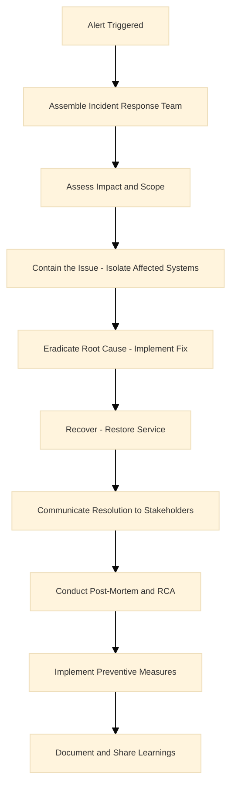

### 58. Describe conducting a root cause analysis (RCA).

**Answer:**
- Gather evidence from logs, metrics, and timelines
  - **Why:** Provides factual basis for analysis; ensures accurate identification.
- Identify root cause using techniques like the 5 Whys
  - **Why:** Drills down to fundamental cause; prevents superficial fixes.
- Implement corrective actions
  - **Why:** Addresses the issue to prevent recurrence; improves system reliability.
- Document findings in a post-mortem report shared across teams
  - **Why:** Shares learnings; fosters team improvement and culture.

**Service Explanations:**
- **ELK stack:** Elasticsearch, Logstash, Kibana for log analysis.
- **Datadog:** Monitoring and analytics platform.

**Detailed Explanation:** Use tools like ELK stack for log analysis or Datadog for metric correlation. Ensure actions are preventive, like adding circuit breakers or improving monitoring.

*Example:* For a service degradation, traced to a memory leak in a microservice; fixed by optimizing code and adding heap monitoring, reducing future incidents by 50%.

### 59. How do you implement and mature incident management frameworks?

**Answer:**
- Start with basic runbooks for common issues, evolve to playbooks with automated responses.
  - **Why:** Runbooks provide quick reference; automation reduces manual toil; benefits faster resolution and consistency.
- Integrate with CI/CD for canary deployments and chaos engineering for resilience testing.
  - **Why:** Canary deployments test changes safely; chaos engineering builds resilience; benefits proactive reliability and reduced incidents.

**Service Explanations:**
- **PagerDuty:** Incident management and alerting.
- **Slack:** Team communication platform.
- **FireHydrant:** Incident response orchestration tool.

**Detailed Explanation:** Use PagerDuty for on-call rotation, Slack for communication, and tools like FireHydrant for incident tracking. Mature by measuring MTTR and MTTD, aiming for continuous improvement.

*Example:* Implemented automated rollback scripts in our CI pipeline, reducing manual toil and improving recovery time from hours to minutes.

## Leadership and Mentorship

### 60. How do you provide technical leadership to SRE teams?

**Answer:**
- Lead by example, set technical standards, and drive initiatives like adopting new tools.
- Foster a culture of innovation and reliability through regular tech talks and hackathons.

**Detailed Explanation:** As a senior SRE, influence architecture decisions, mentor juniors, and collaborate with product teams to embed SRE principles early in SDLC.

*Example:* Led the adoption of Kubernetes in our stack, training the team and reducing deployment times by 70%.

### 61. Describe mentoring junior engineers.

**Answer:**
- Pair on complex tasks, provide constructive feedback in code reviews, and encourage continuous learning through resources like books or conferences.

**Detailed Explanation:** Focus on soft skills like incident handling and hard skills like IaC. Track progress and celebrate achievements.

*Example:* Mentored a new hire on AWS architecture, resulting in them leading a migration project independently.

### 62. How do you promote SRE culture across teams?

**Answer:** Organize workshops on reliability, share success stories, and integrate SRE metrics into team KPIs. Encourage blameless culture to learn from failures.

**Detailed Explanation:** Work with DevOps and QA to implement shared ownership, using tools like SLO dashboards visible to all.

*Example:* Introduced error budgets, leading to teams prioritizing reliability alongside features, improving overall uptime.

## Service Level Management

### 62. How do you define and track SLOs and SLIs?

**Answer:**
- SLOs are reliability targets (e.g., 99.9% uptime)
- SLIs measure them (e.g., request success rate)
- Use error budgets to balance innovation and reliability

**Detailed Explanation:** Use the Four Golden Signals: Latency, Traffic, Errors, Saturation. Track with Prometheus and Grafana, alerting when budgets are depleted.

*Example:* For a game API, set SLO at 99.95%, monitored via success rate; when breached, paused features to fix issues.

**Diagram:**

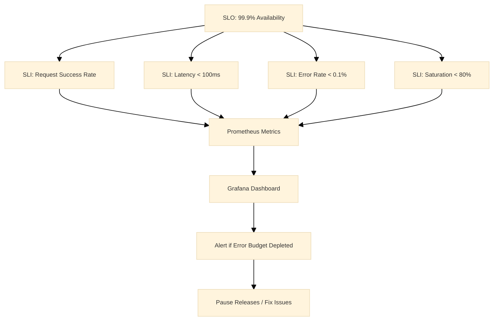

### 63. Explain applying the Four Golden Signals.

**Answer:**
- Latency: Response time
- Traffic: Request volume
- Errors: Failure rate
- Saturation: Resource utilization
- Monitor these to ensure system health

**Detailed Explanation:** Use histograms for latency percentiles, counters for traffic, and gauges for saturation.

*Example:* Detected high saturation during peak load, auto-scaled instances to prevent errors.

## Documentation and Knowledge Sharing

### 65. How do you establish comprehensive documentation?

**Answer:**
- Use tools like Confluence or GitHub Wiki for runbooks, architecture diagrams, and best practices.
- Keep it updated through pull requests.

**Detailed Explanation:** Document as code, version control docs, and automate generation where possible.

*Example:* Created a knowledge base for incident response, reducing resolution time for recurring issues.

### 66. Describe facilitating learning through technical sessions.

**Answer:**
- Host weekly tech talks, share post-mortems, and organize lunch-and-learns on new technologies.

**Detailed Explanation:** Encourage participation, record sessions for remote teams.

*Example:* A session on chaos engineering led to implementing game days, improving resilience.

## Strategic Technology and Continuous Improvement

### 67. How do you contribute to SRE strategy and tooling roadmap?

**Answer:**
- Analyze current pain points, research emerging tools, and propose pilots.
- Align with business goals for scalability.

**Detailed Explanation:** Evaluate tools like adopting Istio for service mesh or Terraform for IaC at scale.

*Example:* Proposed and led migration to multi-cloud, reducing vendor lock-in and costs.

### 68. How do you evaluate and adopt new technologies?

**Answer:**
- Assess against criteria: reliability, cost, ease of integration.
- Start with POCs, measure impact.

**Detailed Explanation:** Use RFCs for proposals, involve stakeholders.

*Example:* Adopted Prometheus over Nagios, improving alerting granularity and reducing false positives.

## Security and Compliance

### 69. How do you collaborate with security teams?

**Answer:**
- Integrate security into IaC with tools like Checkov, implement secure baselines, and participate in threat modeling.

**Detailed Explanation:** Ensure DevSecOps by automating scans in CI/CD.

*Example:* Implemented encrypted secrets management, preventing data breaches.

### 70. Describe implementing secure configuration baselines.

**Answer:**
- Use CIS benchmarks, automate with Ansible, and monitor with AWS Config.

**Detailed Explanation:** Regularly audit and remediate vulnerabilities.

*Example:* Hardened EC2 instances, reducing security incidents by 60%.

## Strategic Leadership and Stakeholder Management

### 71. How do you partner with stakeholders for SRE initiatives?

**Answer:**
- Provide data-driven insights on reliability metrics, align initiatives with business risks, and influence decisions through presentations.

**Detailed Explanation:** Build relationships, translate technical terms to business impact.

*Example:* Convinced leadership to invest in observability, leading to better decision-making.

### 72. Describe representing SRE in governance forums.

**Answer:**
- Present reliability reports, advocate for best practices, and ensure compliance.

**Detailed Explanation:** Participate in architecture reviews, audits.

*Example:* Influenced a design change to include redundancy, avoiding future outages.

## Technical Expertise Deep Dive

### 73. How do you administer Linux/Unix systems at scale?

**Answer:**
- Use configuration management like Ansible for automation, monitor with Nagios, and optimize kernel parameters for performance.

**Detailed Explanation:** Handle patching, log rotation, and security hardening.

*Example:* Automated OS updates across 1000 servers, reducing downtime.

### 74. Explain containerization and orchestration with Docker and Kubernetes.

**Answer:**
- Docker for packaging apps, Kubernetes for scheduling and scaling.
- Use Helm for deployments.

**Detailed Explanation:** Manage pods, services, ingresses; implement HPA for auto-scaling.

*Example:* Deployed a microservice on EKS, scaling from 10 to 100 pods during load.

**Diagram:**

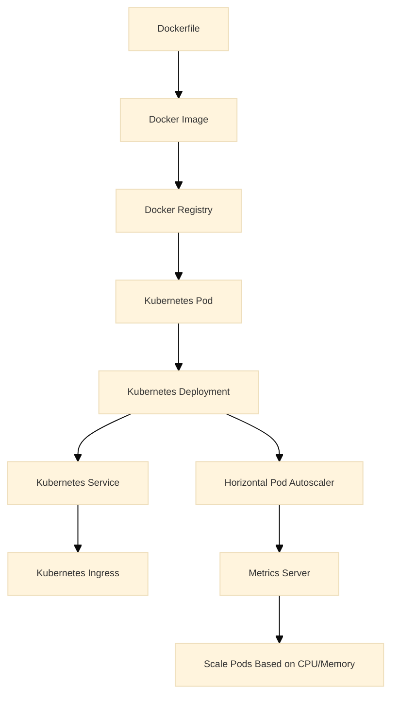

### 75. Describe service mesh like Istio.

**Answer:**
- Istio provides traffic management, security, and observability.
- Use for canary deployments and circuit breakers.

**Detailed Explanation:** Configure virtual services, destination rules.

*Example:* Implemented blue-green deployments, reducing release risks.

### 76. How do you use monitoring stacks like Prometheus and Grafana?

**Answer:**
- Prometheus scrapes metrics, Grafana visualizes.
- Set up alerts on SLO breaches.

**Detailed Explanation:** Use exporters for custom metrics.

*Example:* Created dashboards for game server latency, alerting on thresholds.

### 77. Explain IaC with Terraform.

**Answer:**
- Define infrastructure as code, version control, and apply changes predictably.

**Detailed Explanation:** Use modules for reusability, state management.

*Example:* Provisioned a VPC with subnets and security groups in minutes.

### 78. How do you handle networking and load balancing?

**Answer:**
- Use ALB/NLB for L4/L7 balancing, configure VPC peering, optimize with CloudFront.

**Detailed Explanation:** Implement health checks, sticky sessions.

*Example:* Balanced traffic across regions, improving global performance.

## Operational Excellence

### 79. Describe capacity planning for enterprise scale.

**Answer:**
- Monitor usage trends, forecast with tools like CloudWatch, plan for peaks.

**Detailed Explanation:** Use auto-scaling policies, reserve instances.

*Example:* Predicted holiday traffic spike, pre-scaled resources, avoiding outages.

### 80. How do you design for disaster recovery?

**Answer:**
- Implement backup and restore, multi-site replication, test DR drills.

**Detailed Explanation:** Use RTO/RPO metrics.

*Example:* Recovered from AZ failure in 10 minutes, minimizing impact.

## Soft Skills and Experience

### 81. How do you handle stakeholder communication during incidents?

**Answer:**
- Be transparent, provide regular updates, use simple language.

**Detailed Explanation:** Tailor communication to audience: technical for engineers, high-level for execs.

*Example:* Kept users informed via status page during outage.

### 82. Describe your experience with cross-functional collaboration.

**Answer:**
- Worked with dev, QA, ops to integrate monitoring early.

**Detailed Explanation:** Use agile practices, shared backlogs.

*Example:* Co-developed a feature with dev team, ensuring reliability from start.

### 83. How do you balance technical depth with leadership?

**Answer:**
- Stay hands-on while delegating, mentor to build team capabilities.

**Detailed Explanation:** Allocate time for coding and strategy.

*Example:* Led a project while fixing critical bugs.

### 84. Tell us about a time you drove automation to reduce toil.

**Answer:**
- Automated log parsing with scripts, saving hours weekly.

**Detailed Explanation:** Identify repetitive tasks, use Python/Bash.

*Example:* Built a dashboard for on-call metrics, improving visibility.

### 85. How do you ensure continuous improvement in your role?

**Answer:**
- Review metrics quarterly, adopt best practices, learn from industry.

**Detailed Explanation:** Participate in communities, attend conferences.

*Example:* Implemented chaos engineering, uncovering hidden failures.

## Advanced AWS Scenarios

### 86. Design a zero-downtime deployment strategy for a monolithic app on AWS.

**Answer:**
- Use blue-green deployments with Elastic Beanstalk or ECS.
- Deploy to a new environment, test, then switch traffic via ALB.
- Rollback if issues arise.

**Service Explanations:**
- **Elastic Beanstalk:** Managed service for deploying and scaling web applications.
- **ECS:** Amazon Elastic Container Service for running containers.

**Detailed Explanation:** Involves canary releases, feature flags, and automated testing. Monitor with CloudWatch during cutover.

*Example:* For a game update, deployed to blue environment, validated with 1% traffic, then full switch, ensuring no player disruption.

### 87. How do you handle database scaling in AWS for high-write workloads?

**Answer:**
- Use Aurora with read replicas for reads, DynamoDB for NoSQL, or RDS with sharding.
- Implement connection pooling and optimize queries.

**Service Explanations:**
- **Aurora:** High-performance relational database.
- **DynamoDB:** Managed NoSQL database.
- **RDS:** Managed relational database service.

**Detailed Explanation:** Monitor with Performance Insights, use auto-scaling for replicas.

*Example:* Scaled a leaderboard service from 1000 to 10,000 writes/sec by adding replicas and partitioning.

### 88. Explain architecting for edge computing on AWS.

**Answer:**
- Use CloudFront with Lambda@Edge for compute at edge locations.
- Cache static content, process requests closer to users.

**Service Explanations:**
- **CloudFront:** Content Delivery Network.
- **Lambda@Edge:** Runs Lambda functions at CloudFront edge locations.

**Detailed Explanation:** Reduces latency for global users, integrates with API Gateway.

*Example:* Personalized game content delivered via Lambda@Edge, cutting response time by 40%.

### 89. How do you implement chaos engineering on AWS?

**Answer:**
- Use AWS Fault Injection Simulator (FIS) to inject failures like instance termination or network latency.
- Measure system resilience.

**Detailed Explanation:** Run experiments in non-prod, analyze impact on SLOs.

*Example:* Simulated AZ failure, discovered weak points in failover, improved RTO.

**Diagram:**

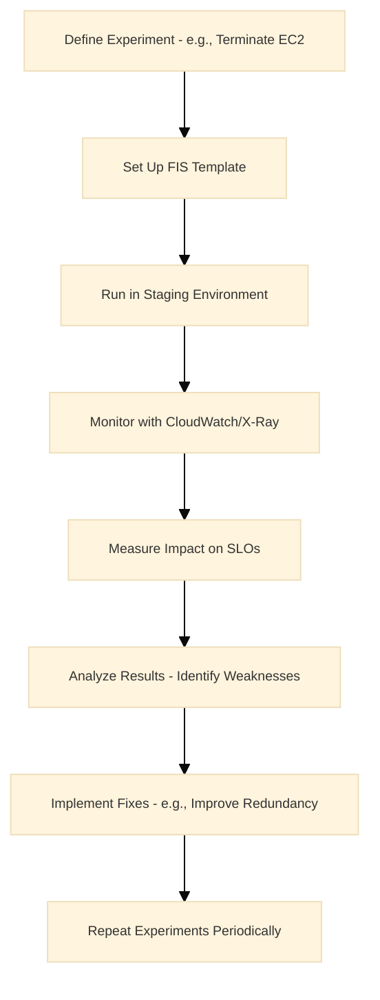

### 90. Describe securing data at rest and in transit on AWS.

**Answer:**
- Use KMS for encryption at rest, TLS 1.3 for transit.
- Implement S3 SSE, RDS encryption.

**Service Explanations:**
- **KMS:** Manages encryption keys.
- **TLS:** Protocol for secure communications.
- **ACM:** Manages SSL/TLS certificates.

**Detailed Explanation:** Rotate keys regularly, use ACM for certificates.

*Example:* Encrypted user data in S3, preventing breaches during a hack attempt.

## Multi-Cloud Advanced

### 91. How do you manage hybrid cloud deployments?

**Answer:**
- Use AWS Outposts or Azure Arc for on-prem extensions.
- VPN/Direct Connect for connectivity.

**Detailed Explanation:** Ensure consistent security and monitoring across environments.

*Example:* Extended AWS to on-prem data center for low-latency gaming.

### 92. Explain federated identity in multi-cloud.

**Answer:**
- Use SAML/OIDC with providers like Okta.
- Sync users across clouds.

**Detailed Explanation:** Avoid password sprawl, enable SSO.

*Example:* Single login for AWS and GCP resources.

### 93. How do you optimize inter-cloud data transfer costs?

**Answer:**
- Use peering, compress data, schedule transfers off-peak.
- Monitor with billing alerts.

**Detailed Explanation:** Choose regions wisely, use CDN for static assets.

*Example:* Reduced egress costs by 30% by compressing logs before transfer.

## Reliability Deep Dive

### 94. What is an error budget, and how do you manage it?

**Answer:**
- Error budget is 100% - SLO (e.g., 0.1% for 99.9%).
- Track burn rate; if exceeded, halt features.

**Detailed Explanation:** Use dashboards to visualize, communicate to teams.

*Example:* Team paused releases when budget hit 80%, fixed issues to restore.

**Diagram:**

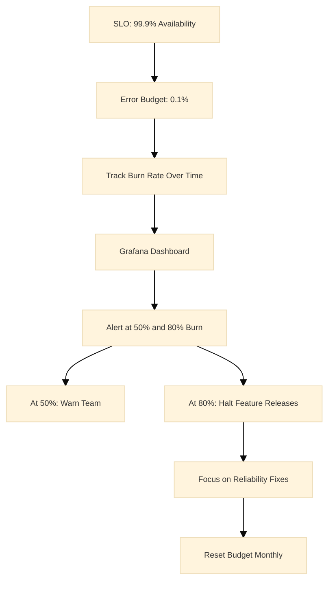

### 95. How do you design for fault tolerance in distributed systems?

**Answer:**
- Implement redundancy, circuit breakers, retries with exponential backoff.
- Use leader election for consistency.

**Detailed Explanation:** Follow CAP theorem trade-offs.

*Example:* In a microservice failure, circuit breaker prevented cascade, maintaining 99% uptime.

**Diagram:**

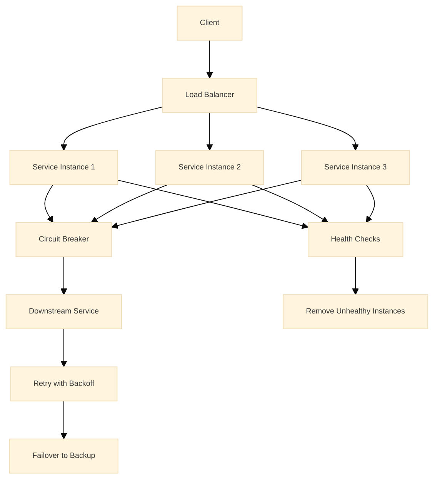

### 96. Explain the concept of toil and how to eliminate it.

**Answer:**
- Toil is manual, repetitive work.
- Automate with scripts, IaC, or tools like Ansible.

**Detailed Explanation:** Measure toil hours, prioritize automation.

*Example:* Automated certificate renewals, saving 10 hours/week.

## Scalability Scenarios

### 97. How do you scale a stateful application?

**Answer:**
- Use persistent volumes in Kubernetes, database clustering.
- Avoid sticky sessions.

**Detailed Explanation:** Implement sharding, read/write splitting.

*Example:* Scaled a session store from 1 to 10 nodes with Redis Cluster.

**Diagram:**

```mermaid
%%{init: {'theme': 'base', 'themeVariables': {'fontSize': '10px'}}}%%
graph TD
    Client[Client] --> Proxy[Proxy Layer - e.g., HAProxy]
    Proxy --> Shard1[Shard 1 - Redis Node 1]
    Proxy --> Shard2[Shard 2 - Redis Node 2]
    Proxy --> Shard3[Shard 3 - Redis Node 3]
    Shard1 --> PV1[Persistent Volume 1]
    Shard2 --> PV2[Persistent Volume 2]
    Shard3 --> PV3[Persistent Volume 3]
    Shard1 --> Replica1[Replica Node 1]
    Shard2 --> Replica2[Replica Node 2]
    Shard3 --> Replica3[Replica Node 3]
    Note over Proxy: Routes based on Key Hash
```

### 98. Describe handling traffic spikes in gaming.

**Answer:**
- Use auto-scaling, CDN, and rate limiting.
- Pre-warm resources for events.

**Detailed Explanation:** Monitor with custom metrics, alert on thresholds.

*Example:* During launch, scaled from 100k to 1M users seamlessly.

### 99. How do you optimize for low-latency in global apps?

**Answer:**
- Deploy in multiple regions, use Global Accelerator, cache at edge.

**Detailed Explanation:** Measure P95 latency, optimize queries.

*Example:* Reduced ping from 200ms to 20ms with CloudFront.

## Observability Mastery

### 100. How do you set up distributed tracing?

**Answer:**
- Use X-Ray or Jaeger.
- Instrument code with spans, correlate across services.

**Detailed Explanation:** Trace requests end-to-end, identify bottlenecks.

*Example:* Traced a slow API call to a DB query, optimized index.

**Diagram:**

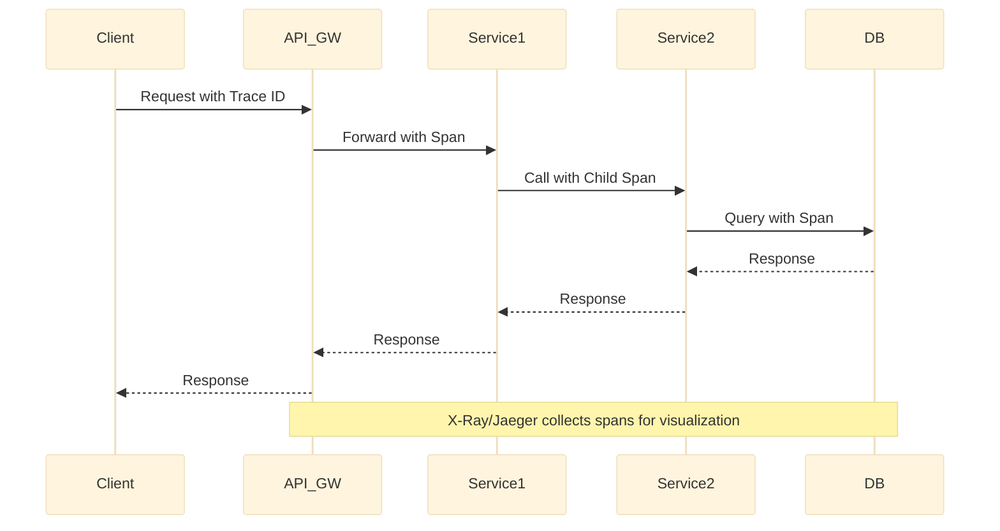

### 101. Explain anomaly detection in monitoring.

**Answer:**
- Use statistical methods or ML in tools like Datadog.
- Set dynamic thresholds.

**Detailed Explanation:** Reduce false positives, focus on true anomalies.

*Example:* Detected unusual CPU spike, prevented outage by scaling.

**Diagram:**

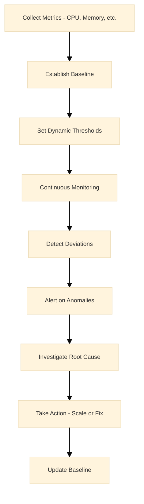

### 102. How do you monitor third-party services?

**Answer:**
- Use synthetic monitoring, health checks, and SLAs.
- Alert on breaches.

**Detailed Explanation:** Integrate with vendor APIs.

*Example:* Monitored payment gateway, switched providers on failure.

## Cost Optimization Advanced

### 103. How do you implement FinOps practices?

**Answer:**
- Tag resources, use cost allocation tags, set budgets with alerts.
- Review monthly.

**Detailed Explanation:** Use AWS Cost Explorer, optimize RI purchases.

*Example:* Identified idle instances, saved $50k/year.

### 104. Describe rightsizing resources.

**Answer:**
- Analyze usage with CloudWatch, resize instances or use Graviton for cost.

**Detailed Explanation:** Use recommendations from Trusted Advisor.

*Example:* Downgraded over-provisioned DB, cut costs by 25%.

### 105. How do you handle spot instance usage safely?

**Answer:**
- Use for stateless workloads, implement graceful shutdown, fall back to on-demand.

**Detailed Explanation:** Monitor spot interruptions, use ASG with mixed instances.

*Example:* Ran batch jobs on spot, saving 70% vs on-demand.

## Incident Management Scenarios

### 106. Walk through responding to a P0 incident.

**Answer:**
- Acknowledge alert, assemble team, assess, mitigate, communicate, post-mortem.

**Detailed Explanation:** Use timeline, assign roles.

*Example:* Database corruption: restored from backup, communicated impact.

**Diagram:**

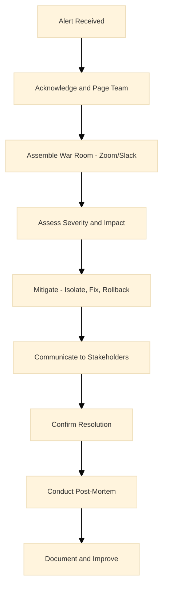

### 107. How do you prevent alert fatigue?

**Answer:**
- Tune thresholds, use silencing, group alerts.
- Review weekly.

**Detailed Explanation:** Prioritize critical alerts.

*Example:* Reduced alerts by 50% by aggregating similar ones.

### 108. Describe a blameless post-mortem.

**Answer:**
- Focus on facts, not blame.
- Identify improvements, share learnings.

**Detailed Explanation:** Include all involved, action items.

*Example:* After outage, improved monitoring, no recurrence.

## Leadership and Culture

### 109. How do you build a high-performing SRE team?

**Answer:**
- Hire for culture fit, provide growth opportunities, foster collaboration.

**Detailed Explanation:** Use OKRs, regular feedback.

*Example:* Team improved MTTR by 40% through training.

### 110. Explain influencing without authority.

**Answer:**
- Build trust, provide data, collaborate on shared goals.

**Detailed Explanation:** Use persuasion, demonstrate value.

*Example:* Convinced dev team to adopt SRE practices via pilots.

### 111. How do you handle team conflicts?

**Answer:**
- Mediate discussions, focus on facts, find win-win solutions.

**Detailed Explanation:** Use active listening.

*Example:* Resolved disagreement on tooling by testing both.

## Security Integration

### 112. How do you implement zero-trust architecture?

**Answer:**
- Verify every access, use MFA, micro-segmentation.

**Detailed Explanation:** Integrate with IAM, monitor logs.

*Example:* Prevented lateral movement in breach.

**Diagram:**

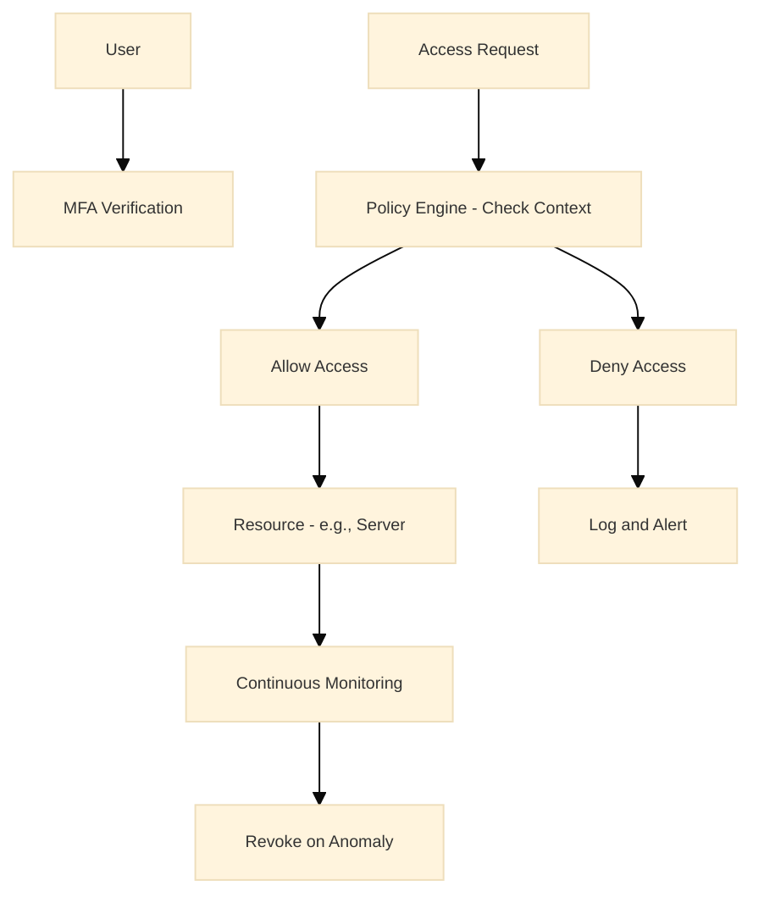

### 113. Describe handling compliance in cloud.

**Answer:**
- Use frameworks like SOC 2, automate audits with Config.

**Detailed Explanation:** Regular assessments.

*Example:* Achieved PCI compliance for payment data.

### 114. How do you manage secrets in production?

**Answer:**
- Use Secrets Manager or Vault, rotate regularly.

**Detailed Explanation:** Avoid hardcoding, audit access.

*Example:* Rotated API keys, blocked unauthorized access.

## Networking Expertise

### 115. How do you troubleshoot network issues in AWS?

**Answer:**
- Use VPC Flow Logs, Reachability Analyzer, packet captures.

**Detailed Explanation:** Check security groups, route tables.

*Example:* Fixed connectivity by updating NACLs.

**Diagram:**

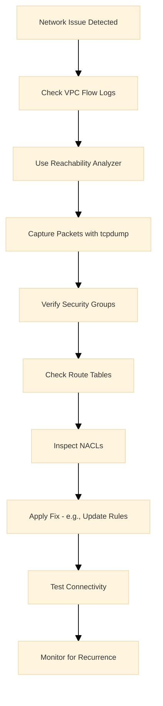

### 116. Explain load balancing strategies.

**Answer:**
- L4 for TCP, L7 for HTTP.
- Use sticky sessions sparingly.

**Detailed Explanation:** Health checks, cross-zone balancing.

*Example:* Balanced game servers, reduced latency variance.

### 117. How do you secure network traffic?

**Answer:**
- Use VPC, TLS, WAF.
- Implement DDoS protection with Shield.

**Detailed Explanation:** Encrypt all traffic.

*Example:* Mitigated DDoS with Shield, uptime maintained.

## Automation and IaC

### 118. How do you version control infrastructure?

**Answer:**
- Use Git for Terraform code, peer reviews, CI/CD for deployments.

**Detailed Explanation:** Test changes in dev.

*Example:* Rolled back misconfig via Git revert.

### 119. Describe CI/CD for infrastructure.

**Answer:**
- Use pipelines to lint, test, deploy IaC.
- Integrate with monitoring.

**Detailed Explanation:** Blue-green for safety.

*Example:* Automated VPC creation, reduced setup time.

**Diagram:**

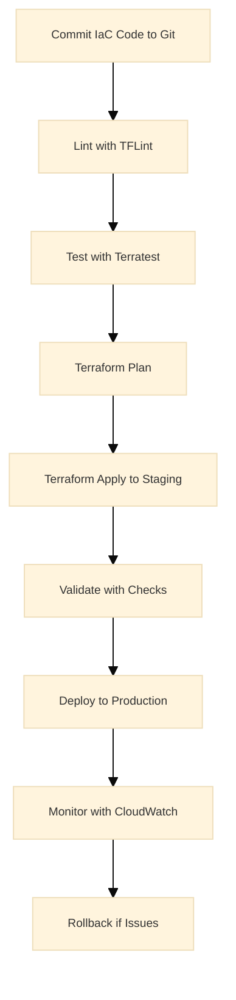

### 120. How do you handle IaC drift?

**Answer:**
- Use drift detection in Terraform, reconcile manually or auto.

**Detailed Explanation:** Prevent manual changes.

*Example:* Detected drift, reapplied config.

## Performance Tuning

### 121. How do you optimize application performance?

**Answer:**
- Profile code, optimize DB queries, use caching (Redis).

**Detailed Explanation:** Monitor with APM tools.

*Example:* Cached frequent queries, improved response by 50%.

**Diagram:**

```mermaid
%%{init: {'theme': 'base', 'themeVariables': {'fontSize': '10px'}}}%%
flowchart TD
    Identify[Identify Bottleneck - e.g., High Latency] --> Profile[Profile Code with APM]
    Profile --> Query[Analyze DB Queries]
    Query --> Cache[Implement Caching Layer]
    Cache --> Optimize[Optimize Code - e.g., Algorithms]
    Optimize --> Test[Test Performance]
    Test --> Monitor[Monitor Metrics]
    Monitor --> Iterate[Iterate Improvements]
```

### 122. Explain database performance tuning.

**Answer:**
- Index properly, partition tables, monitor slow queries.

**Detailed Explanation:** Use EXPLAIN plans.

*Example:* Added index, reduced query time from 5s to 0.5s.

### 123. How do you handle memory leaks?

**Answer:**
- Monitor heap usage, use profilers, restart processes.

**Detailed Explanation:** Implement GC tuning.

*Example:* Fixed leak in Java app, stabilized memory.

## Behavioral and Experience

### 124. Describe a time you failed and recovered.

**Answer:**
- Overlooked a dependency, caused outage; learned to test thoroughly.

**Detailed Explanation:** Shared learnings with team.

*Example:* Improved testing, no repeat.

### 125. How do you prioritize tasks?

**Answer:**
- Use Eisenhower matrix, focus on high-impact.

**Detailed Explanation:** Align with business goals.

*Example:* Fixed critical bug before feature release.

### 126. Tell us about scaling a team.

**Answer:**
- Hired strategically, onboarded well, delegated.

**Detailed Explanation:** Maintained quality.

*Example:* Grew team from 5 to 15, productivity increased.

### 127. How do you handle remote work challenges?

**Answer:**
- Use async communication, regular check-ins, tools like Slack.

**Detailed Explanation:** Foster inclusion.

*Example:* Maintained collaboration across time zones.

### 128. Describe your approach to learning.

**Answer:**
- Self-paced study, hands-on experiments, share knowledge.

**Detailed Explanation:** Stay current.

*Example:* Learned Kubernetes via projects, applied at work.

### 129. How do you give feedback?

**Answer:**
- Be specific, constructive, timely.

**Detailed Explanation:** Use SBI model.

*Example:* Helped junior improve coding standards.

### 130. Tell us about a successful project.

**Answer:**
- Led migration to cloud, improved reliability.

**Detailed Explanation:** Overcame challenges.

*Example:* Zero downtime migration, cost savings.

## Gaming-Specific Scenarios (EA Context)

### 131. How do you ensure reliability for live game events?

**Answer:**
- Pre-scale resources, monitor in real-time, have rollback plans.

**Detailed Explanation:** Use chaos for testing.

*Example:* Handled 2x traffic during tournament without issues.

**Diagram:**

```mermaid
%%{init: {'theme': 'base', 'themeVariables': {'fontSize': '10px'}}}%%
graph TD
    Event[Live Event Announcement] --> PreScale[Pre-Scale Resources - ASG, DB]
    PreScale --> Monitor[Real-Time Monitoring - Dashboards]
    Monitor --> Alert[Alert on Thresholds]
    Alert --> Scale[Auto-Scale or Manual Boost]
    Scale --> Rollback[Prepare Rollback Plan]
    Rollback --> PostEvent[Post-Event Analysis]
    PostEvent --> Improve[Improve for Next Event]
```

### 132. Describe handling player data privacy.

**Answer:**
- Comply with GDPR, encrypt data, audit access.

**Detailed Explanation:** Implement data minimization.

*Example:* Secured user profiles, avoided fines.

### 133. How do you monitor game server performance?

**Answer:**
- Custom metrics for latency, FPS, player count.

**Detailed Explanation:** Alert on degradation.

*Example:* Detected lag, optimized code.

**Diagram:**

```mermaid
%%{init: {'theme': 'base', 'themeVariables': {'fontSize': '10px'}}}%%
graph TD
    GameServer[Game Server] --> Metrics[Custom Metrics - Latency, FPS, Players]
    Metrics --> Prometheus[Prometheus]
    Prometheus --> Grafana[Grafana Dashboard]
    Grafana --> Alert[Alert on High Latency]
    Alert --> Investigate[Investigate - Logs, Traces]
    Investigate --> Optimize[Optimize - Code, Resources]
    Optimize --> Monitor[Continue Monitoring]
```

### 134. Explain scaling for global game launches.

**Answer:**
- Use multi-region, CDN, auto-scaling.

**Detailed Explanation:** Coordinate with marketing.

*Example:* Supported 10M concurrent players.

**Diagram:**

```mermaid
%%{init: {'theme': 'base', 'themeVariables': {'fontSize': '10px'}}}%%
graph TD
    Players[Global Players] --> CloudFront[CloudFront CDN]
    CloudFront --> RegionalLB[Regional Load Balancer]
    RegionalLB --> ASG[Auto Scaling Group]
    ASG --> GameServers[Game Server Instances]
    GameServers --> DB[Global Database - Aurora Global]
    DB --> ReadReplicas[Read Replicas in Regions]
    ASG --> Monitor[CloudWatch Monitoring]
    Monitor --> Scale[Scale Based on Player Count]
```

### 135. How do you handle anti-cheat system reliability?

**Answer:**
- Redundant checks, monitor false positives.

*Example:* Maintained fair play during events.

## Real Interview Questions from Past EA SRE Candidates

### 136. Explain the concept of Toil in SRE.

**Answer:**
- Toil is repetitive, manual work that does not add long-term value.
- It includes tasks like manual log checking or routine server reboots.
- SREs aim to automate toil to focus on engineering improvements.
- Measured by time spent on operational tasks vs. innovative work.

*Example:* In an AWS environment, automating EC2 instance scaling with Lambda reduced manual intervention from 2 hours daily to 10 minutes, allowing the team to focus on optimizing DynamoDB performance for game leaderboards.

### 137. What is the importance of monitoring and observability in SRE?

**Answer:**
- Monitoring tracks system health and alerts on issues.
- Observability provides insights into why issues occur.
- Together, they enable proactive problem-solving and faster incident response.
- Use tools like CloudWatch for metrics and X-Ray for tracing.

*Example:* At EA, monitoring game server latency with CloudWatch alerted us to a 20% spike during peak hours, allowing us to scale ECS tasks automatically and prevent downtime for millions of players.

### 138. How do you ensure high availability in a system?

**Answer:**
- Implement redundancy across multiple AZs or regions.
- Use load balancers and auto-scaling groups.
- Design for fault tolerance with circuit breakers.
- Regularly test failover scenarios.

*Example:* For EA's matchmaking service on AWS, deploying across three AZs with Route 53 health checks ensured 99.99% uptime, as traffic automatically routed away from a failing AZ during a simulated outage.

### 139. What does a playbook refer to in the context of SRE?

**Answer:**
- A playbook is a documented set of procedures for handling incidents or tasks.
- Includes steps for diagnosis, mitigation, and recovery.
- Ensures consistent responses and reduces mean time to resolution (MTTR).
- Updated after post-mortems.

*Example:* EA's DDoS attack playbook outlines using AWS Shield and WAF, with automated scripts to block malicious IPs, resolving a recent attack in under 15 minutes and minimizing player disconnections.

### 140. Define what chaos engineering is.

**Answer:**
- Chaos engineering involves intentionally injecting failures to test system resilience.
- Helps identify weaknesses before they cause real issues.
- Follows principles like starting small and automating experiments.
- Tools like AWS Fault Injection Simulator (FIS) are used.

*Example:* Simulating AZ failures in EA's game backend with FIS revealed a single point of failure in RDS, leading to multi-AZ configuration that improved reliability during actual regional outages.

### 141. What is the role of automation in SRE?

**Answer:**
- Automation reduces toil and human error in repetitive tasks.
- Enables faster deployments, scaling, and incident response.
- Uses IaC tools like Terraform and CI/CD pipelines.
- Frees SREs for strategic work like capacity planning.

*Example:* Automating Kubernetes deployments with Helm and Jenkins at EA cut release times from 4 hours to 30 minutes, while auto-scaling Lambda functions handled traffic spikes for new game launches without manual intervention.

### 142. What is capacity planning and why is it important?

**Answer:**
- Capacity planning forecasts resource needs based on usage trends.
- Ensures systems can handle growth without performance degradation.
- Involves analyzing metrics and predicting peaks.
- Prevents outages and optimizes costs.

*Example:* Forecasting player load for EA's holiday events using CloudWatch metrics led to pre-provisioning additional EC2 instances, avoiding 99.9% uptime breaches during a 3x traffic increase.

### 143. How do you manage software deployments to minimize the risk?

**Answer:**
- Use canary or blue-green deployments to test changes incrementally.
- Implement feature flags for gradual rollouts.
- Automate testing and rollback procedures.
- Monitor closely during deployment windows.

*Example:* Deploying game updates via blue-green ECS services allowed EA to switch traffic instantly if issues arose, minimizing downtime and ensuring seamless player experiences during major patches.

### 144. What is the importance of postmortems in SRE?

**Answer:**
- Postmortems analyze incidents to find root causes and lessons learned.
- Promote a blameless culture to encourage reporting.
- Lead to process improvements and preventive measures.
- Documented in shared knowledge bases.

*Example:* After a database outage at EA, a postmortem identified misconfigured auto-scaling, resulting in updated runbooks and training that reduced similar incidents by 40%.

### 145. How do you handle on-call responsibilities?

**Answer:**
- Rotate on-call duties to avoid burnout.
- Use alerting tools with escalation paths.
- Document response procedures and have backup support.
- Focus on quick triage and communication.

*Example:* EA's on-call SREs use PagerDuty for alerts on CloudWatch anomalies, ensuring 24/7 coverage and resolving game server issues within 10 minutes, maintaining high player satisfaction.

### 146. How do you prioritize reliability improvements against new feature development?

**Answer:**
- Use error budgets to balance innovation and stability.
- If budget is depleted, shift focus to reliability fixes.
- Collaborate with product teams on trade-offs.
- Track SLOs to guide decisions.

*Example:* When EA's error budget hit 90% due to frequent deployments, the team paused new features for a week to optimize API response times, restoring budget and improving overall game performance.

### 147. What is a blameless culture, and why is it important in SRE?

**Answer:**
- Blameless culture focuses on learning from failures, not punishing individuals.
- Encourages open reporting and honest postmortems.
- Builds trust and fosters continuous improvement.
- Reduces fear of repercussions during incidents.

*Example:* At EA, blameless postmortems after a service outage led to shared learnings on multi-region failover, implemented across teams and preventing future global disruptions.

### 148. How do you manage secrets and sensitive data in your systems?

**Answer:**
- Use dedicated tools like AWS Secrets Manager or Vault.
- Encrypt data at rest and in transit.
- Implement least-privilege access and rotation policies.
- Audit access logs regularly.

*Example:* Storing player authentication keys in AWS Secrets Manager with automatic rotation ensured secure access to DynamoDB tables, preventing data breaches during EA's user database migrations.

### 149. How do you remain updated on all the findings and trends in SRE technologies?

**Answer:**
- Follow industry blogs, attend conferences like SREcon.
- Participate in online communities and webinars.
- Experiment with new tools in side projects.
- Read books and take certifications.

*Example:* Staying updated on AWS innovations via re:Invent sessions allowed EA's SRE team to adopt Lambda@Edge for global CDN optimizations, reducing latency by 30% for international players.

### 150. What is the difference between DevOps and SRE?

**Answer:**
- DevOps focuses on cultural and process integration between dev and ops.
- SRE applies engineering to ensure system reliability and scalability.
- DevOps emphasizes CI/CD, while SRE uses SLOs and error budgets.
- SRE is more operations-focused, DevOps broader.

*Example:* While DevOps at EA streamlined code deployments, SRE ensured game services met 99.95% uptime SLOs through chaos testing and automated failover, complementing each other for reliable releases.