# EA SRE 3 Interview Preparation Guide

## Table of Contents

- [Introduction](#introduction)
- [AWS Architecture](#aws-architecture)
- [Multi-Cloud](#multi-cloud)
- [Reliability](#reliability)
- [Scalability](#scalability)
- [Observability](#observability)
- [Cost Optimization](#cost-optimization)
- [Behavioral Questions](#behavioral-questions)
- [Incident and Problem Management](#incident-and-problem-management)
- [Leadership and Mentorship](#leadership-and-mentorship)
- [Service Level Management](#service-level-management)
- [Documentation and Knowledge Sharing](#documentation-and-knowledge-sharing)
- [Strategic Technology and Continuous Improvement](#strategic-technology-and-continuous-improvement)
- [Security and Compliance](#security-and-compliance)
- [Strategic Leadership and Stakeholder Management](#strategic-leadership-and-stakeholder-management)
- [Technical Expertise Deep Dive](#technical-expertise-deep-dive)
- [Operational Excellence](#operational-excellence)
- [Soft Skills and Experience](#soft-skills-and-experience)
- [Advanced AWS Scenarios](#advanced-aws-scenarios)
- [Multi-Cloud Advanced](#multi-cloud-advanced)
- [Reliability Deep Dive](#reliability-deep-dive)
- [Scalability Scenarios](#scalability-scenarios)
- [Observability Mastery](#observability-mastery)
- [Cost Optimization Advanced](#cost-optimization-advanced)
- [Incident Management Scenarios](#incident-management-scenarios)

## Introduction

This guide prepares for **EA SRE 3** interviews, covering **AWS architecture**, multi-cloud, reliability, scalability, observability, and cost optimization. It includes 50+ scenario-based questions with detailed answers and examples.

**SREs** at this level design and maintain *highly reliable*, *scalable*, *cost-effective* systems, demonstrating expertise in cloud tech, automation, monitoring, and incident response.

**Think About:** What personal experiences from your SRE role align with these topics?

## ☁️ AWS Architecture

### Designing Highly Available Web Applications on AWS

**Answer:**
- Design multi-AZ architecture with Auto Scaling groups, ELBs, and RDS Multi-AZ, per AWS Well-Architected Framework Reliability Pillar (https://docs.aws.amazon.com/wellarchitected/latest/reliability-pillar/design-principles.html), ensuring fault isolation and redundancy to meet SLOs such as 99.9% availability, with SLI measured as service uptime over time.
- Deploy EC2 instances in at least two AZs behind ALB with health checks for automated failover, reducing toil as per "Site Reliability Engineering" (Beyer et al., 2016), toil reduction chapter, by automating incident response.
- Implement Auto Scaling on CloudWatch metrics (e.g., CPU utilization >70%), balancing AWS Well-Architected Performance Efficiency Pillar (https://docs.aws.amazon.com/wellarchitected/latest/performance-efficiency-pillar/design-principles.html) and Cost Optimization Pillar (https://docs.aws.amazon.com/wellarchitected/latest/cost-optimization-pillar/design-principles.html), using error budgets to quantify risk and allow innovation without reliability compromise.
- Configure RDS Multi-AZ with synchronous replication for RTO minimization and data consistency, supporting SRE error budgeting for trade-offs between reliability and velocity, as detailed in "Site Reliability Engineering" (Beyer et al., 2016).
- Use Route 53 health checks for DNS failover, enabling blameless postmortems by automating redirection and focusing on systemic root cause analysis, per SRE principles in "Site Reliability Engineering" (Beyer et al., 2016), blameless postmortem chapter.

**Service Explanations:**

| Service | Description |
|---------|-------------|
| [Auto Scaling groups](https://aws.amazon.com/autoscaling/) | Automatically adjusts EC2 instance counts based on demand, supporting scalability and cost optimization as outlined in AWS DevOps best practices. |
| [Elastic Load Balancers (ELB)](https://aws.amazon.com/elasticloadbalancing/) | Distributes traffic across targets, enhancing availability per the Reliability pillar. |
| [Amazon RDS](https://aws.amazon.com/rds/) | Managed database with Multi-AZ for high availability, reducing operational toil. |
| [EC2 instances](https://aws.amazon.com/ec2/) | Virtual servers deployed in multiple AZs for fault tolerance. |
| [Application Load Balancer (ALB)](https://aws.amazon.com/elasticloadbalancing/application-load-balancer/) | Layer 7 load balancer for HTTP/HTTPS, enabling advanced routing and health checks. |
| [Route 53](https://aws.amazon.com/route53/) | DNS service with failover capabilities, aligning with SRE automation for reliability. |

**Special Notes:**
- Multi-AZ deployments: Core to AWS Well-Architected Reliability, ensuring isolation of failures.
- Health checks: Automated monitoring to trigger failovers, minimizing MTTR in SRE incident response.
- SLO/SLI integration: Use availability as SLI to track against SLOs, with error budgets guiding trade-offs between reliability and velocity.

*Example:* In a gaming application, AZ failure triggered ALB routing and RDS failover, maintaining 99.95% uptime within error budget, enabling blameless postmortem to identify and mitigate root causes without halting development.

**Diagram:**

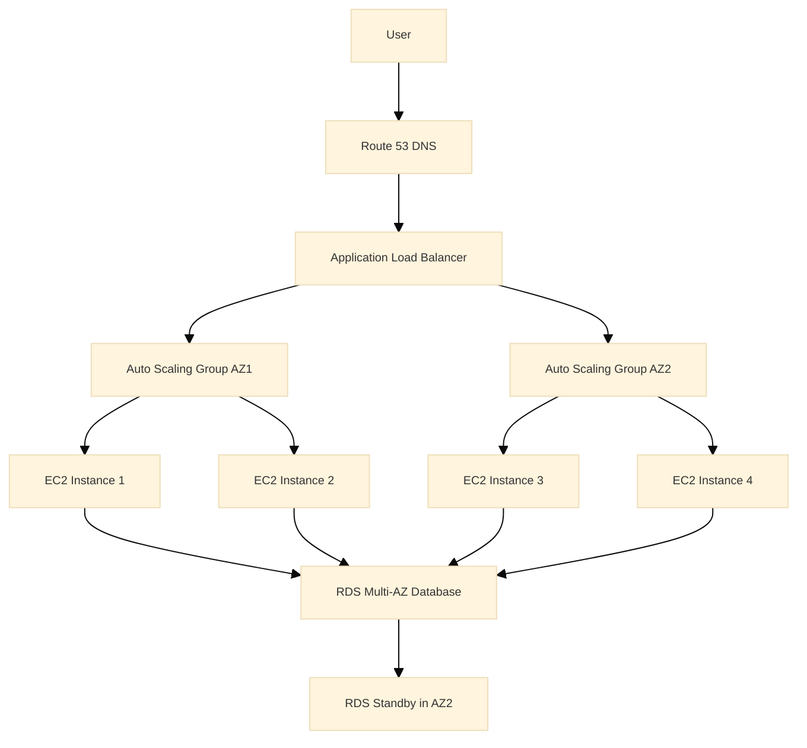

### Architecting Serverless Applications with AWS Lambda and API Gateway

**Answer:**
- Utilize AWS Lambda for event-driven compute, API Gateway for API orchestration, and DynamoDB for NoSQL storage, per AWS Well-Architected Operational Excellence Pillar (https://docs.aws.amazon.com/wellarchitected/latest/operational-excellence-pillar/design-principles.html), minimizing infrastructure toil and enabling pay-per-use scaling.
- Configure API Gateway as API facade invoking Lambda via HTTP, with throttling and caching, supporting SRE SLOs for latency and error rates, with SLIs measured as request latency percentiles and error percentages, automating security via IAM per AWS DevOps best practices (https://aws.amazon.com/devops/getting-started/).
- Architect Lambda as stateless, auto-scaling, with cold start mitigation via provisioned concurrency, meeting performance SLIs, using error budgets to tolerate variability without over-provisioning, as per "Site Reliability Engineering" (Beyer et al., 2016).
- Integrate CloudWatch for metrics/alarms and X-Ray for tracing, implementing the three pillars of observability (logs, metrics, traces) for blameless postmortems and proactive SRE, per "Site Reliability Engineering" (Beyer et al., 2016).
- Apply least-privilege IAM roles/policies, per AWS Well-Architected Security Pillar (https://docs.aws.amazon.com/wellarchitected/latest/security-pillar/design-principles.html), preventing privilege escalation in multi-tenant serverless, supporting compliance.

**Service Explanations:**
- **[AWS Lambda](https://aws.amazon.com/lambda/):** Serverless compute for event-driven execution, reducing operational overhead per SRE toil reduction principles.
- **[API Gateway](https://aws.amazon.com/api-gateway/):** Managed API service for secure, scalable endpoints, aligning with AWS DevOps best practices for CI/CD integration.
- **[DynamoDB](https://aws.amazon.com/dynamodb/):** Fully managed NoSQL database with auto-scaling, supporting high availability and low-latency SLIs.
- **[CloudWatch](https://aws.amazon.com/cloudwatch/):** Comprehensive monitoring for metrics and logs, essential for SRE observability.
- **[X-Ray](https://aws.amazon.com/xray/):** Distributed tracing for request path analysis, enabling root cause identification in complex systems.
- **[IAM roles](https://aws.amazon.com/iam/):** Granular access control for serverless security, per least-privilege SRE security practices.

**Special Notes:**
- Serverless architecture: Eliminates server management, aligning with SRE automation to focus on code over infrastructure.
- Least-privilege: IAM principle to minimize attack surfaces, as emphasized in AWS Well-Architected Security pillar.
- Observability integration: CloudWatch and X-Ray provide the three pillars (logs, metrics, traces) for SRE-driven reliability.

*Example:* In a mobile gaming backend, API Gateway throttles requests to Lambda for user auth against DynamoDB, scaling to 10,000 concurrent invocations during launches, maintaining <100ms latency SLI and enabling error budget for rapid feature iterations without reliability trade-offs.

**Diagram:**

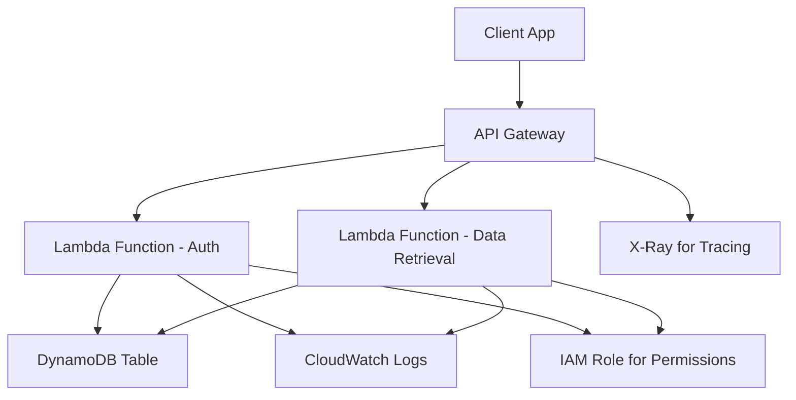

### Handling Data Migration from On-Premises to AWS

**Answer:**
- Leverage AWS Database Migration Service (DMS) for schema and data migration with Change Data Capture (CDC) to minimize downtime, aligning with the Reliability pillar of the AWS Well-Architected Framework and SRE principles of error budgeting to balance migration risks with service availability.
- Opt for AWS Snowball for petabyte-scale transfers to optimize bandwidth and cost, per the Cost Optimization pillar, reducing toil in large data movements.
- Conduct thorough dependency analysis, dry runs, and phased cutovers, incorporating SRE blameless postmortems for any migration incidents to refine future processes.
- Monitor migration progress with CloudWatch, ensuring SLIs for data integrity and latency are met, supporting SRE observability for proactive issue detection.

**Service Explanations:**
- **AWS Database Migration Service (DMS):** Fully managed migration tool for databases, enabling CDC for near-zero downtime per AWS DevOps best practices.
- **AWS Snowball:** Secure appliance for offline data transfer, minimizing network costs and risks.

**Special Notes:**
- Change Data Capture (CDC): Real-time replication of changes, critical for SRE low-RTO migrations.
- Dry runs: Validation tests to prevent production disruptions, fostering a culture of reliability.
- Error budgeting: Allocate budget for migration-related unreliability to prioritize speed over perfection.

*Example:* Migrating a 10TB gaming database used Snowball for bulk transfer, DMS with CDC for incremental sync, achieving <1 hour downtime while maintaining 99.9% SLO, with post-migration postmortem identifying optimizations for future migrations.

### Architecting Microservices-Based Applications on AWS

**Answer:**
- Utilize ECS or EKS for container orchestration, API Gateway for API management, and EventBridge for decoupled event-driven communication, per the Operational Excellence pillar of the AWS Well-Architected Framework, enabling IaC and automation to reduce SRE toil in deployments.
- Deploy each microservice in isolated containers with Cloud Map for dynamic service discovery, supporting SRE fault isolation and independent scaling to maintain SLOs without cascading failures.
- Integrate AWS App Mesh for service mesh capabilities, including circuit breakers and retries, aligning with SRE resilience patterns from "Site Reliability Engineering" to prevent error propagation and enable blameless postmortems on service interactions.
- Monitor inter-service communication with X-Ray tracing and CloudWatch metrics, establishing SLIs for latency and error rates to track against error budgets, balancing reliability with innovation velocity.

**Service Explanations:**
- **ECS:** Managed container orchestration for scalable microservices, per AWS DevOps best practices for CI/CD integration.
- **EKS:** Kubernetes-managed service for advanced container management, supporting SRE automation.
- **API Gateway:** Centralized API routing with throttling, enhancing security and observability.
- **EventBridge:** Event-driven bus for loose coupling, reducing dependencies and improving scalability.
- **Cloud Map:** AWS service discovery for microservices, automating endpoint resolution.
- **AWS App Mesh:** Service mesh for traffic control and observability, implementing SRE circuit breaker patterns.

**Special Notes:**
- Circuit breakers: SRE pattern to fail fast and recover, preventing system-wide outages.
- Microservices architecture: Promotes modularity and fault isolation, as detailed in SRE literature for scalable systems.
- Error budgeting: Allows controlled failures in microservices to prioritize feature development.

*Example:* In an e-commerce platform, payment service failure triggered App Mesh circuit breaker, isolating impact and maintaining 99.9% SLO, with postmortem identifying root cause in external API without blaming teams, leading to improved resilience.

**Diagram:**

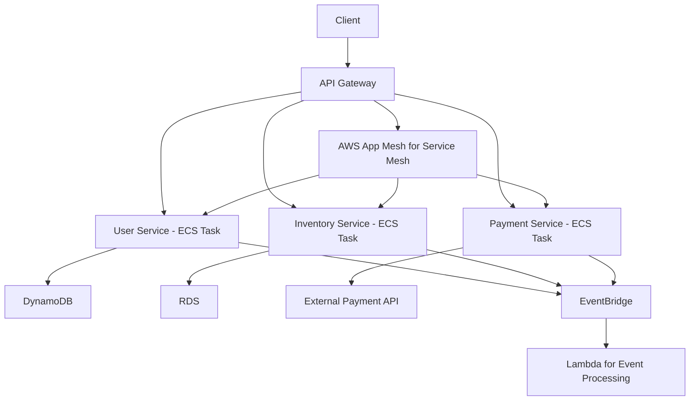

### Securing AWS Architectures

**Answer:**
- Enforce least-privilege access via IAM roles and policies, per the Security pillar of the AWS Well-Architected Framework, minimizing attack surfaces and supporting SRE blameless postmortems by reducing human error in access management.
- Segment networks using VPC with security groups and NACLs, isolating resources to prevent lateral movement, aligning with SRE security practices for fault isolation and compliance.
- Apply encryption at rest and in transit with KMS and TLS, ensuring data protection and regulatory adherence, as emphasized in SRE literature for secure system design.
- Integrate WAF for application-layer threat mitigation, filtering attacks like SQL injection, to maintain SLIs for error rates and support error budgeting for security enhancements.
- Leverage AWS Config for continuous compliance auditing and GuardDuty for ML-based threat detection, enabling proactive SRE observability and incident response automation.

**Service Explanations:**
- **IAM:** Identity and Access Management for granular permissions, per least-privilege SRE principles.
- **VPC:** Isolated network environment for resource protection, aligning with AWS Well-Architected Security.
- **NACLs:** Stateless traffic controls at subnet level for layered defense.
- **KMS:** Managed encryption service for keys, reducing toil in key management.
- **WAF:** Web Application Firewall for real-time threat blocking, per AWS DevOps security best practices.
- **AWS Config:** Configuration compliance monitoring, enabling automated audits.
- **GuardDuty:** Intelligent threat detection, supporting SRE proactive security.

**Special Notes:**
- Least privilege: Core SRE security tenet to limit permissions, preventing breaches.
- Encryption: Essential for data integrity, as per Security pillar.
- Observability in security: Config and GuardDuty provide logs and alerts for SRE monitoring.

*Example:* In a financial application, IAM restricted EC2 access, KMS encrypted S3 data, and WAF blocked attacks, maintaining 99.99% security SLO with error budget for feature releases, using blameless postmortems to improve controls post-incident.

**Diagram:**

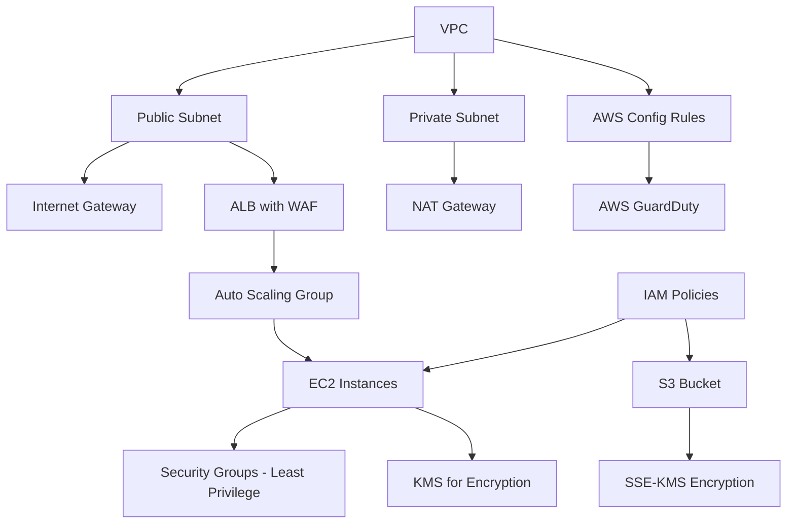

### Designing Disaster Recovery on AWS

**Answer:**
- Use a multi-region strategy with pilot light or warm standby.
  - **Why:** Minimizes costs while ensuring quick recovery; pilot light keeps minimal resources running, warm standby has partial capacity.
- Replicate data with **Cross-Region Replication (CRR)** for **S3** and **Global Tables** for **DynamoDB**.
  - **Why:** Ensures data availability across regions; benefits low RTO and data durability.
- Automate recovery with **CloudFormation** and **Route 53** failover.
  - **Why:** Speeds up restoration and reduces manual errors; Route 53 routes traffic to healthy regions.

**Service Explanations:**
- **S3:** Object storage service with high durability.
- **DynamoDB:** NoSQL database with global tables for multi-region replication.
- **CloudFormation:** IaC service for provisioning AWS resources.
- **Route 53:** DNS service with failover capabilities.

**Special Notes:**
- Pilot light: Minimal resources running in backup region for quick scaling.
- Warm standby: Partial infrastructure ready in backup region.
- RTO: Recovery Time Objective, time to restore service.

*Example:* In a global outage, Route 53 switches DNS to a backup region, and EC2 instances launch from pre-configured AMIs, restoring service within 30 minutes.

**Diagram:**

```mermaid
graph TD
    PrimaryRegion[Primary Region] --> EC2_P[EC2 Instances]
    PrimaryRegion --> RDS_P[RDS Database]
    PrimaryRegion --> S3_P[S3 Bucket]
    BackupRegion[Backup Region] --> EC2_B[Pilot Light EC2]
    BackupRegion --> RDS_B[Warm Standby RDS]
    BackupRegion --> S3_B[S3 with CRR]
    Route53[Route 53] --> PrimaryRegion
    Route53 --> BackupRegion
    CloudFormation[CloudFormation] --> PrimaryRegion
    CloudFormation --> BackupRegion
    Note over Route53: Failover on Health Check Failure
```

### Optimizing Network Performance in AWS

**Answer:**
- Use **CloudFront** for global distribution.
  - **Why:** Caches content at edge locations; reduces latency and bandwidth costs for global users.
- **VPC endpoints** for private access to AWS services.
  - **Why:** Avoids public internet routing; improves security and performance by reducing hops.
- **Transit Gateway** for multi-VPC connectivity.
  - **Why:** Simplifies network architecture; enables efficient routing between VPCs.
- Monitor with **VPC Flow Logs** and optimize instance types for network throughput.
  - **Why:** Provides visibility into traffic; allows tuning for better performance and cost.

**Service Explanations:**
- **CloudFront:** CDN for delivering content with low latency.
- **VPC endpoints:** Private connections to AWS services without internet.
- **Transit Gateway:** Network hub for connecting VPCs and on-premises networks.
- **VPC Flow Logs:** Captures IP traffic information for monitoring.

**Special Notes:**
- Network throughput: Amount of data transferred over a network in a given time.
- Edge locations: Points of presence for faster content delivery.

*Example:* A video streaming service uses CloudFront to cache content at edge locations, reducing latency from 500ms to 50ms for users worldwide.

### Architecting Data Lakes on AWS

**Answer:**
- Use **S3** as the storage layer, **Glue** for ETL, **Athena** for querying, and **Lake Formation** for governance.
  - **Why:** S3 provides scalable storage; Glue automates ETL; Athena enables SQL queries; Lake Formation secures and manages access; benefits cost-effective analytics and data processing.
- Ingest data via **Kinesis** or **DMS**, catalog with **Glue Catalog**.
  - **Why:** Kinesis streams real-time data; DMS migrates databases; Glue Catalog organizes metadata; improves data discoverability and integration.

**Service Explanations:**
- **S3:** Scalable object storage for data lakes.
- **Glue:** ETL service for data preparation.
- **Athena:** Serverless query service for data in S3.
- **Lake Formation:** Service for building and managing data lakes.
- **Kinesis:** Real-time data streaming service.
- **DMS:** Database migration service.
- **Glue Catalog:** Metadata repository for data assets.

**Special Notes:**
- ETL: Extract, Transform, Load process for data integration.
- Data lake: Centralized repository for storing structured and unstructured data.

*Example:* For analytics, raw game telemetry data is stored in S3, processed by Glue jobs into Parquet format, and queried via Athena for player behavior insights.

**Diagram:**

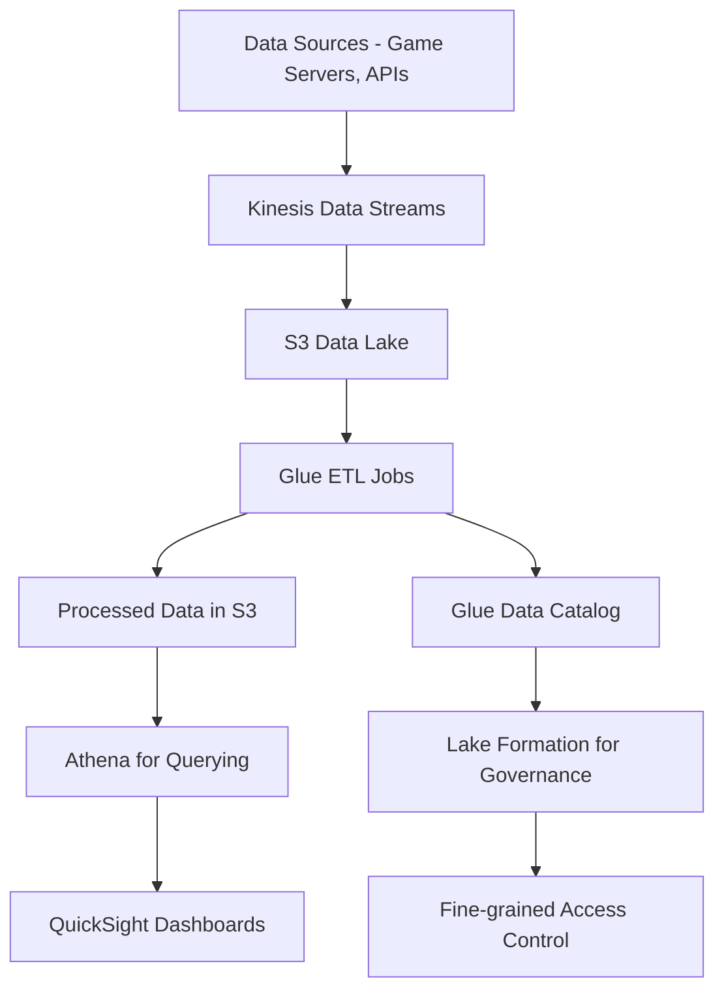

### Key Takeaways
- Designing highly available architectures with multi-AZ and auto-scaling is fundamental for reliability.
- Serverless architectures reduce operational overhead but require careful monitoring for cold starts.
- Data migration strategies must account for downtime and data integrity using tools like DMS.
- Microservices benefit from service meshes for resilience and observability.
- Security is layered, starting with IAM and VPC, and includes encryption and monitoring.
- Disaster recovery plans include pilot light and automated failover for quick restoration.
- Network optimization uses CDNs and VPC endpoints to reduce latency and costs.
- Data lakes leverage S3 and managed services for scalable analytics.

**Think About:** Which of these architectures have you implemented, and what challenges did you face?

## 🌐 Multi-Cloud

### Designing Multi-Cloud Strategies for High Availability

**Answer:**
- Use cloud-agnostic tools like Terraform for IaC, Kubernetes for orchestration across clouds, and DNS-based failover.
  - **Why:** Terraform ensures consistent infrastructure across providers; Kubernetes manages containers portably; DNS failover redirects traffic during failures; benefits vendor neutrality, reduced lock-in, and improved resilience.
- Replicate data with tools like Velero for backups.
  - **Why:** Enables cross-cloud data recovery and portability; prevents data loss during outages; benefits high availability and disaster recovery.
  - **Why:** Enables cross-cloud data recovery; prevents data loss during outages.

**Service Explanations:**
- **Terraform:** IaC tool for provisioning resources across providers.
- **Kubernetes:** Container orchestration platform.
- **DNS:** Domain Name System for routing.
- **Velero:** Backup and restore tool for Kubernetes.

**Special Notes:**
- Cloud-agnostic: Tools that work across multiple cloud providers.
- IaC: Infrastructure as Code for automated provisioning.

*Example:* Deploy an app on AWS and Azure; if AWS region fails, update DNS to route to Azure, ensuring continuity.

**Diagram:**

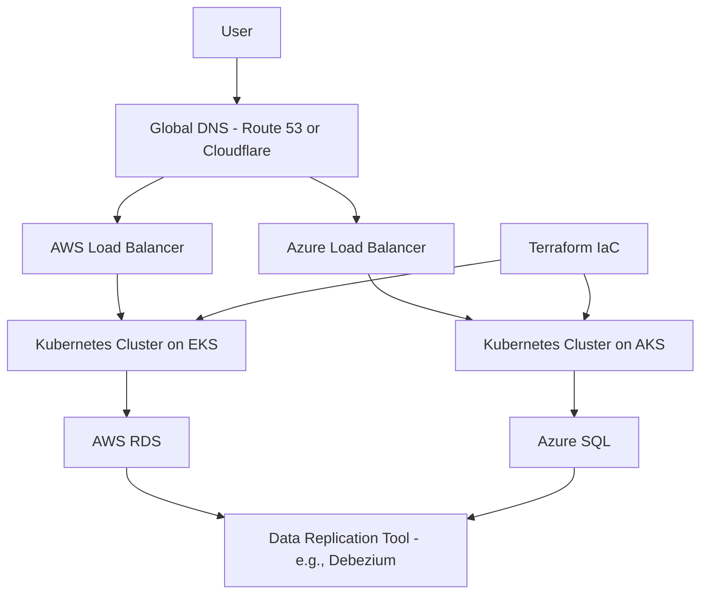

### Challenges and Solutions in Multi-Cloud Management

**Answer:**
- Challenges:
  - Vendor lock-in
  - Data transfer costs
  - Complexity
- Solutions:
  - Use open-source tools
    - **Why:** Reduces dependency on proprietary services; benefits portability and cost savings.
  - Implement hybrid networking with VPNs
    - **Why:** Secures connections between clouds; enables seamless data flow.
  - Monitor with multi-cloud tools like Datadog
    - **Why:** Provides unified visibility; simplifies troubleshooting across environments.

**Service Explanations:**
- **VPNs:** Virtual Private Networks for secure connections.
- **Datadog:** Monitoring platform for multi-cloud environments.

**Special Notes:**
- Vendor lock-in: Dependency on a single provider's services.
- Data transfer costs: Fees for moving data between clouds.

*Example:* Managing costs by using spot instances on AWS and preemptible VMs on GCP, monitored via a unified dashboard.

### Handling Data Consistency Across Multiple Clouds

**Answer:**
- Use eventual consistency models, tools like Apache Kafka for data streaming, or database federation.
  - **Why:** Allows for distributed data without strict synchronization; Kafka enables real-time streaming; federation accesses multiple databases as one; benefits scalability, fault tolerance, and reduced complexity.
- Implement conflict resolution strategies.
  - **Why:** Handles discrepancies in data updates; ensures data integrity across clouds; benefits consistency and reliability.
  - **Why:** Handles discrepancies in data updates; ensures data integrity across clouds.

**Service Explanations:**
- **Apache Kafka:** Distributed event streaming platform.

**Special Notes:**
- Eventual consistency: Data becomes consistent over time, not immediately.
- Database federation: Technique to access multiple databases as one.

*Example:* User data synced between AWS DynamoDB and Azure Cosmos DB using Kafka, with last-write-wins for conflicts.

### Migrating Workloads Between Clouds

**Answer:**
- Assess dependencies, use tools like AWS Migration Hub or Azure Migrate.
  - **Why:** Identifies what needs migration and risks; tools automate discovery and planning; reduces risks and downtime.
- Perform phased migrations with testing.
  - **Why:** Allows gradual transition; testing validates functionality; minimizes downtime and issues.
  - **Why:** Allows gradual transition; testing validates functionality; minimizes downtime.

**Service Explanations:**
- **AWS Migration Hub:** Central place to track migrations.
- **Azure Migrate:** Tool for assessing and migrating to Azure.

**Special Notes:**
- Phased migrations: Breaking migration into stages for control.
- Dependencies: Resources or services that must be migrated together.

*Example:* Migrating VMs from AWS to GCP using Velero for Kubernetes apps, ensuring zero data loss.

### Ensuring Security in Multi-Cloud Environments

**Answer:**
- Use consistent IAM policies, encrypt data in transit with TLS, and deploy unified security tools like CrowdStrike.
  - **Why:** Consistent policies standardize access; TLS secures data; unified tools provide cross-cloud protection; benefits comprehensive security and compliance.
  - **Why:** Consistent policies standardize access; TLS secures data; unified tools provide cross-cloud protection; benefits comprehensive security.

**Service Explanations:**
- **IAM:** Identity and Access Management for permissions.
- **TLS:** Transport Layer Security for encrypting communications.
- **CrowdStrike:** Unified security platform for threat detection.

**Special Notes:**
- SSO: Single Sign-On for accessing multiple systems.
- VPC peering: Connecting VPCs across clouds securely.

*Example:* Implementing SSO with Okta across AWS and Azure, with encrypted VPC peering.

### Cost Optimization in Multi-Cloud Setups

**Answer:**
- Use reserved instances where possible, monitor with tools like CloudHealth, and right-size resources dynamically.
  - **Why:** Reserved instances reduce costs for predictable workloads; monitoring identifies waste; right-sizing matches capacity to needs; benefits significant savings and efficiency.
  - **Why:** Reserved instances reduce costs for predictable workloads; monitoring identifies waste; right-sizing matches capacity to needs; benefits significant savings.

**Service Explanations:**
- **Reserved instances:** Pre-paid instances for discounted rates.
- **CloudHealth:** Cost management and optimization platform.

**Special Notes:**
- Right-sizing: Adjusting resource sizes to fit actual usage.
- Cost optimization: Strategies to reduce cloud spending without sacrificing performance.

*Example:* Running compute-intensive tasks on GCP's cheaper instances and storage on AWS S3, saving 20% monthly.

### Monitoring Multi-Cloud Applications

**Answer:**
- Use tools like Prometheus with multi-cloud exporters or commercial solutions like New Relic for unified monitoring.
  - **Why:** Prometheus is open-source and extensible; New Relic provides commercial support; benefits centralized visibility and faster issue resolution.
  - **Why:** Prometheus is open-source and extensible; New Relic provides commercial support; benefits centralized visibility and faster issue resolution.

**Service Explanations:**
- **Prometheus:** Monitoring and alerting toolkit.
- **New Relic:** Application performance monitoring platform.

**Special Notes:**
- Exporters: Components that collect metrics from services for Prometheus.
- Unified monitoring: Single view of systems across multiple clouds.

*Example:* Alerting on latency spikes in either cloud via a single dashboard.

### Disaster Recovery in Multi-Cloud

**Answer:**
- Implement active-active or active-passive setups with automated failover scripts.
  - **Why:** Active-active runs in both clouds; active-passive keeps one as backup; automation speeds recovery; benefits high availability and minimal downtime.
  - **Why:** Active-active runs in both clouds; active-passive keeps one as backup; automation speeds recovery; benefits high availability and minimal downtime.

**Special Notes:**
- Active-active: Both clouds serve traffic simultaneously.
- Active-passive: One cloud active, other standby.
- Failover scripts: Automated processes to switch to backup.

*Example:* If AWS fails, Terraform provisions resources on Azure automatically.

### Key Takeaways
- Multi-cloud strategies use cloud-agnostic tools like Terraform for IaC and Kubernetes for portability.
- Challenges include vendor lock-in, data transfer costs, and complexity; solutions involve open-source tools and unified monitoring.
- Data consistency can be managed with eventual consistency and tools like Kafka.
- Workload migration requires phased approaches and assessment of dependencies.
- Security in multi-cloud emphasizes consistent IAM and encryption.
- Cost optimization leverages reserved instances and spot instances across providers.
- Monitoring multi-cloud applications benefits from unified tools like Datadog.

**Think About:** Have you worked in a multi-cloud environment? What were the biggest hurdles?

## 🛡️ Reliability

### Defining and Measuring Reliability in SRE

**Answer:**
- Measured by **SLIs**: uptime, latency, error rates.
  - **Why:** Quantifies service performance objectively; enables data-driven decisions on reliability.
- **SLOs** set targets, e.g., 99.9% uptime.
  - **Why:** Defines acceptable reliability levels; guides engineering efforts and balances trade-offs.
- **SLAs** define consequences.
  - **Why:** Outlines penalties or actions for missing targets; aligns business and technical expectations.
  - **Why:** Outlines penalties or actions for missing targets; aligns business and tech.

**Special Notes:**
- SLIs: Service Level Indicators, metrics for measuring performance.
- SLOs: Service Level Objectives, targets for SLIs.
- SLAs: Service Level Agreements, contracts with consequences.

*Example:* For a game server, SLI is successful logins per minute; SLO is 99.95% success rate.

### Implementing Chaos Engineering in AWS

**Answer:**
1. Use AWS Fault Injection Simulator (FIS) to inject failures like instance terminations.
   - **Why:** Tests system under stress; identifies weaknesses proactively; benefits improved resilience and preparedness.
2. Monitor impact and improve resilience.
   - **Why:** Observes behavior during failures; leads to better design and fixes; benefits overall system stability.
  - **Why:** Observes behavior during failures; leads to better design.

**Service Explanations:**
- **AWS Fault Injection Simulator (FIS):** Service for running chaos experiments on AWS.

**Special Notes:**
- Chaos engineering: Practice of testing systems by introducing failures.
- Resilience: Ability to recover from disruptions.

*Example:* Simulating AZ failure to ensure auto-scaling kicks in within 5 minutes.

### Handling Incident Response

**Answer:**
1. Detect via monitoring
2. Assess impact
3. Contain the issue
4. Eradicate root cause
5. Recover service
6. Learn via post-mortems
- **Why:** Ensures systematic handling; reduces downtime and improves future responses.

**Special Notes:**
- Incident response: Steps to manage and resolve system disruptions.
- Post-mortems: Reviews after incidents to learn and prevent recurrence.

*Example:* During a DDoS attack, use Shield and WAF to mitigate, then analyze logs for prevention.

### Building Resilient Microservices

**Answer:**
- Implement retries, circuit breakers with Hystrix, and bulkheads to isolate failures.
  - **Why:** Retries handle transient errors; circuit breakers stop failing calls; bulkheads limit failure spread; benefits overall system stability and fault tolerance.
  - **Why:** Retries handle transient errors; circuit breakers stop failing calls; bulkheads limit failure spread; benefits overall system stability.

**Service Explanations:**
- **Hystrix:** Library for implementing circuit breakers.

**Special Notes:**
- Circuit breakers: Prevent calls to failing services.
- Bulkheads: Isolate components to contain failures.
- Retries: Re-attempt failed operations.

*Example:* If a downstream service fails, circuit breaker prevents cascading failures.

### Ensuring Database Reliability

**Answer:**
- Use Multi-AZ RDS, backups, and read replicas.
  - **Why:** Multi-AZ provides failover; backups enable recovery; read replicas offload queries; benefits high availability, performance, and data safety.
- Monitor with CloudWatch.
  - **Why:** Tracks metrics and alerts on issues; enables proactive management; benefits quick issue detection.
  - **Why:** Tracks metrics and alerts on issues; proactive management.

**Service Explanations:**
- **RDS:** Relational Database Service with reliability features.
- **CloudWatch:** Monitoring service for metrics and logs.

**Special Notes:**
- Read replicas: Copies of database for read operations.
- Multi-AZ: Multi-Availability Zone deployment for redundancy.

*Example:* Automatic failover during maintenance minimizes downtime.

### Error Budgeting in SRE

**Answer:**
- Error budget is the acceptable failure rate, e.g., 0.1% downtime.
  - **Why:** Defines how much unreliability is tolerable; allows calculated risk-taking for innovation.
- Track against SLOs to balance reliability and innovation.
  - **Why:** Ensures focus on stability when needed; promotes faster development otherwise.
  - **Why:** Ensures focus on stability when needed; promotes faster development otherwise.

**Special Notes:**
- Error budget: Portion of time service can be unreliable.
- SLOs: Targets that define the budget.

*Example:* If budget is exceeded, halt feature releases to focus on stability.

### Automating Reliability Testing

**Answer:**
- Use tools like Gremlin for chaos testing and Jenkins for CI/CD integrated reliability checks.
  - **Why:** Gremlin injects failures; Jenkins automates pipelines; ensures reliability is tested early; benefits proactive issue finding.
  - **Why:** Gremlin injects failures; Jenkins automates pipelines; ensures reliability is tested early.

**Service Explanations:**
- **Gremlin:** Chaos engineering platform.
- **Jenkins:** Automation server for CI/CD.

**Special Notes:**
- Chaos testing: Introducing failures to test resilience.
- CI/CD: Continuous Integration/Continuous Deployment.

*Example:* Automated tests simulate high load and failures before deployment.

### Handling Cascading Failures

**Answer:**
- Implement timeouts, rate limiting, and dependency isolation.
  - **Why:** Timeouts prevent hanging; rate limiting controls load; isolation contains failures; benefits system stability and prevents cascades.
  - **Why:** Timeouts prevent hanging; rate limiting controls load; isolation contains failures; benefits system stability.

**Special Notes:**
- Cascading failures: One failure triggering others in sequence.
- Dependency isolation: Preventing failures from spreading.

*Example:* In a service mesh, isolate failing pods to prevent cluster-wide outage.

### Key Takeaways
- Reliability is measured with SLIs, SLOs, and SLAs to quantify and target performance.
- Chaos engineering tests resilience by simulating failures.
- Incident response follows a structured process with post-mortems for learning.
- Resilient microservices use retries, circuit breakers, and bulkheads.
- Database reliability relies on Multi-AZ, backups, and read replicas.
- Error budgeting balances innovation and stability.
- Reliability testing automates chaos and load tests.

**Think About:** What reliability practices have you implemented in your teams?

## 📈 Scalability

### Scaling Web Applications Horizontally on AWS

**Answer:**
- Use Auto Scaling groups with ELB, triggered by CloudWatch metrics like CPU >70%.
  - **Why:** Auto Scaling adds/removes instances; ELB distributes load; CloudWatch monitors; benefits handling variable traffic, cost optimization, and performance.
  - **Why:** Auto Scaling adds/removes instances; ELB distributes load; CloudWatch monitors; benefits handling variable traffic.

**Service Explanations:**
- **Auto Scaling groups:** Automatically adjust instance count.
- **ELB:** Load balancer for distributing traffic.
- **CloudWatch:** Monitoring service for metrics.

**Special Notes:**
- Horizontal scaling: Adding more instances.
- CPU >70%: Threshold for scaling up.

*Example:* During peak gaming hours, scale from 10 to 100 instances automatically.

### Vertical vs. Horizontal Scaling

**Answer:**

| Scaling Type | Description | Advantages |
|--------------|-------------|------------|
| Vertical | Increases instance size | Simpler, no code changes |
| Horizontal | Adds more instances | Better fault tolerance, unlimited scale |

- Prefer horizontal for most cases.
  - **Why:** Better for distributed systems; allows unlimited growth and fault tolerance.
  - **Why:** Better for distributed systems; allows unlimited growth and fault tolerance.

**Special Notes:**
- Vertical scaling: Upgrading hardware of a single instance.
- Horizontal scaling: Adding more instances to distribute load.

*Example:* For a database, use read replicas (horizontal) over larger instances (vertical).

### Handling Stateful Application Scaling

**Answer:**
- Use EFS for shared storage or DynamoDB for state.
  - **Why:** EFS provides shared file system; DynamoDB is scalable database; enables state persistence across instances.
- Avoid sticky sessions.
  - **Why:** Allows load balancer to distribute requests freely; improves scalability and fault tolerance.
  - **Why:** Allows load balancer to distribute requests freely; improves scalability.

**Service Explanations:**
- **EFS:** Elastic File System for shared storage.
- **DynamoDB:** NoSQL database for state management.

**Special Notes:**
- Stateful applications: Apps that maintain state between requests.
- Sticky sessions: Routing requests from same user to same instance.

**Special Notes:**
- Stateful applications: Applications that maintain state across requests.
- Sticky sessions: Keeping user requests to the same server instance.

*Example:* User sessions stored in ElastiCache, allowing seamless scaling.

### Scaling Databases on AWS

**Answer:**
- Use Aurora Serverless for auto-scaling, or provisioned with read replicas.
  - **Why:** Aurora Serverless scales automatically; read replicas handle read load; benefits performance, cost, and scalability.
  - **Why:** Aurora Serverless scales automatically; read replicas handle read load; benefits performance and cost.

**Service Explanations:**
- **Aurora Serverless:** Serverless version of Aurora database.

**Special Notes:**
- Aurora: AWS's MySQL/PostgreSQL-compatible database.
- Read replicas: Copies for scaling reads.

**Special Notes:**
- Aurora: High-performance relational database.
- Read replicas: Database copies for scaling reads.

*Example:* During high traffic, Aurora scales storage and compute automatically.

### Optimizing for Global Scalability

**Answer:**
- Use CloudFront, Route 53 latency-based routing, and multi-region deployments.
  - **Why:** CloudFront caches globally; Route 53 routes to low-latency regions; multi-region ensures availability; benefits worldwide performance and resilience.
  - **Why:** CloudFront caches globally; Route 53 routes to low-latency regions; multi-region ensures availability; benefits worldwide performance.

**Service Explanations:**
- **CloudFront:** CDN for global content delivery.
- **Route 53:** DNS with routing policies.

**Special Notes:**
- Latency-based routing: Directing traffic to closest or fastest region.
- Multi-region deployments: Running services in multiple regions.

**Special Notes:**
- Latency-based routing: Routing based on response time.
- Multi-region deployments: Services in multiple AWS regions.

*Example:* Global users access content from nearest edge location, reducing latency.

### Load Testing for Scalability

**Answer:**
- Use tools like JMeter or Artillery to simulate traffic, monitor with CloudWatch.
  - **Why:** Simulates real load; identifies limits; CloudWatch tracks performance; ensures scalability and prevents issues.
  - **Why:** Simulates real load; identifies limits; CloudWatch tracks performance; ensures scalability.

**Service Explanations:**
- **JMeter:** Open-source load testing tool.
- **Artillery:** Modern load testing framework.
- **CloudWatch:** Monitoring during tests.

**Special Notes:**
- Load testing: Simulating user load to test system capacity.
- Bottlenecks: Points where performance degrades.

**Special Notes:**
- Load testing: Testing system under simulated load.
- Bottlenecks: Points of congestion limiting performance.

*Example:* Test 10x traffic increase to ensure no bottlenecks.

### Scaling Serverless Applications

**Answer:**
- Lambda scales automatically; use provisioned concurrency for cold starts.
  - **Why:** Automatic scaling handles demand; provisioned concurrency reduces latency; benefits ease, performance, and cost-efficiency.
  - **Why:** Automatic scaling handles demand; provisioned concurrency reduces latency; benefits ease and performance.

**Service Explanations:**
- **Lambda:** Serverless compute that scales per request.

**Special Notes:**
- Cold starts: Delay when function initializes.
- Provisioned concurrency: Keeps functions warm.

**Special Notes:**
- Cold starts: Delay when serverless function initializes.
- Provisioned concurrency: Pre-warms function instances.

*Example:* API Gateway routes to Lambda, handling millions of requests.

### Caching Strategies for Scalability

**Answer:**
- Use CloudFront for static content, ElastiCache for dynamic data.
  - **Why:** CloudFront speeds static delivery; ElastiCache caches dynamic data; reduces backend load and latency.
  - **Why:** CloudFront speeds static delivery; ElastiCache caches dynamic data; reduces backend load and latency.

**Service Explanations:**
- **CloudFront:** CDN for caching static assets.
- **ElastiCache:** In-memory caching service.

**Special Notes:**
- Caching: Storing data for faster access.
- Static content: Unchanging files like images.

**Special Notes:**
- Caching: Temporary storage of data for faster retrieval.
- Static content: Files that don't change frequently.

*Example:* Cache user profiles in Redis, reducing DB load by 50%.

### Key Takeaways
- Horizontal scaling uses auto-scaling and load balancers for handling traffic spikes.
- Vertical vs. horizontal scaling: Prefer horizontal for unlimited growth and fault tolerance.
- Stateful applications scale with shared storage and session management.
- Databases scale with read replicas and Aurora Serverless.
- Global scalability uses CDNs, Route 53, and multi-region deployments.
- Load testing identifies bottlenecks before production.
- Serverless scales automatically with provisioned concurrency for cold starts.
- Caching strategies include CloudFront and ElastiCache for performance.

**Think About:** What scaling challenges have you faced in high-traffic applications?

## 👁️ Observability

### Implementing Observability in AWS

**Answer:**
- Use CloudWatch for metrics, X-Ray for tracing, and CloudTrail for auditing.
  - **Why:** CloudWatch monitors performance; X-Ray traces requests; CloudTrail logs API calls; provides full visibility.
- Centralize logs with CloudWatch Logs.
  - **Why:** Aggregates logs for analysis; simplifies debugging and compliance.
  - **Why:** Aggregates logs for analysis; simplifies debugging.

**Service Explanations:**
- **CloudWatch:** Metrics, logs, and alarms.
- **X-Ray:** Distributed tracing.
- **CloudTrail:** Audit logs for AWS API calls.
- **CloudWatch Logs:** Centralized logging.

**Special Notes:**
- Observability: Ability to understand system state from outputs.
- Metrics: Quantitative measurements.

**Special Notes:**
- Observability: Measuring system internals via outputs.
- Metrics: Quantifiable data points.

*Example:* Trace a request from API Gateway through Lambda to DynamoDB.

### The Three Pillars of Observability

**Answer:**
- Logs: events
  - **Why:** Record discrete events for debugging and auditing.
- Metrics: quantitative data
  - **Why:** Measure performance over time for monitoring trends.
- Traces: request paths
  - **Why:** Follow requests through systems to identify bottlenecks.
  - **Why:** Follow requests through systems.

**Special Notes:**
- Pillars of observability: Logs, metrics, traces.
- Events: Specific occurrences in the system.

**Special Notes:**
- Pillars of observability: Logs, metrics, traces.
- Events: Discrete happenings in the system.

*Example:* Logs show errors, metrics track latency, traces identify bottlenecks.

### Monitoring Microservices

**Answer:**
- Use service mesh like App Mesh for metrics, and distributed tracing with X-Ray.
  - **Why:** App Mesh provides service-level insights; X-Ray traces across services; benefits understanding complex interactions and issues.
  - **Why:** App Mesh provides service-level insights; X-Ray traces across services; benefits understanding complex interactions.

**Service Explanations:**
- **App Mesh:** Service mesh for microservices.
- **X-Ray:** Tracing for distributed systems.

**Special Notes:**
- Service mesh: Infrastructure layer for service-to-service communication.
- Distributed tracing: Tracking requests across multiple services.

**Special Notes:**
- Service mesh: Infrastructure for service-to-service communication.
- Distributed tracing: Following requests across multiple services.

*Example:* Visualize service dependencies and latency in X-Ray.

### Setting Up Alerts

**Answer:**
- Define thresholds in CloudWatch, e.g., CPU >80% triggers scaling or alerts.
  - **Why:** Proactive notifications; prevents issues from escalating; enables timely responses.
  - **Why:** Proactive notifications; prevents issues from escalating.

**Service Explanations:**
- **CloudWatch:** For setting alarms.

**Special Notes:**
- Thresholds: Limits that trigger actions.
- Alerts: Notifications of issues.

**Special Notes:**
- Thresholds: Values that trigger responses.
- Alerts: Signals for attention.

*Example:* Alert on error rate >5% for immediate investigation.

### Handling Log Aggregation

**Answer:**
- Use CloudWatch Logs, Kinesis for streaming, and Elasticsearch for analysis.
  - **Why:** CloudWatch centralizes; Kinesis streams; Elasticsearch searches; enables comprehensive log management and insights.
  - **Why:** CloudWatch centralizes; Kinesis streams; Elasticsearch searches; enables comprehensive log management.

**Service Explanations:**
- **CloudWatch Logs:** Log aggregation service.
- **Kinesis:** Data streaming service.
- **Elasticsearch:** Search and analytics engine.

**Special Notes:**
- Log aggregation: Collecting logs from multiple sources.
- Anomaly detection: Identifying unusual patterns.

**Special Notes:**
- Log aggregation: Gathering logs from sources.
- Anomaly detection: Identifying unusual patterns.

*Example:* Aggregate logs from multiple EC2 instances for anomaly detection.

### Distributed Tracing

**Answer:**
- Tools like X-Ray track requests across services, identifying latency sources.
  - **Why:** Provides end-to-end visibility; helps pinpoint bottlenecks and optimize performance.
  - **Why:** Provides end-to-end visibility; helps pinpoint bottlenecks.

**Service Explanations:**
- **X-Ray:** AWS distributed tracing service.

**Special Notes:**
- Distributed tracing: Following a request through multiple services.
- Latency sources: Components causing delays.

**Special Notes:**
- Distributed tracing: Tracing requests across systems.
- Latency sources: Components introducing delay.

*Example:* Trace shows 90% latency in DB query, prompting optimization.

### Measuring User Experience

**Answer:**
- Use Real User Monitoring (RUM) with CloudWatch Synthetics.
  - **Why:** Captures real user interactions; identifies performance issues from user perspective; benefits user experience improvement.
  - **Why:** Captures real user interactions; identifies performance issues from user perspective.

**Service Explanations:**
- **CloudWatch Synthetics:** For canary monitoring and RUM.

**Special Notes:**
- RUM: Monitoring actual user experiences.
- User journeys: Paths users take through the app.

**Special Notes:**
- RUM: Real User Monitoring.
- User journeys: Sequences of user actions.

*Example:* Simulate user journeys to detect frontend issues.

### Anomaly Detection

**Answer:**
- Use CloudWatch Insights or ML-based tools to detect unusual patterns.
  - **Why:** Identifies deviations from normal; enables early issue detection and prevention.
  - **Why:** Identifies deviations from normal; enables early issue detection.

**Service Explanations:**
- **CloudWatch Insights:** For log and metric analysis.

**Special Notes:**
- Anomaly detection: Finding outliers in data.
- Unusual patterns: Deviations from expected behavior.

**Special Notes:**
- Anomaly detection: Identifying abnormal behavior.
- Unusual patterns: Patterns outside expected range.

*Example:* Alert on sudden traffic drop indicating outage.

### Key Takeaways
- Observability combines logs, metrics, and traces for full system insight.
- The three pillars: Logs for events, metrics for trends, traces for paths.
- Microservices monitoring uses service meshes and distributed tracing.
- Alerts are set with thresholds in CloudWatch for proactive response.
- Log aggregation centralizes data with tools like CloudWatch Logs.
- Distributed tracing identifies bottlenecks with X-Ray.
- User experience is measured with RUM and synthetics.
- Anomaly detection uses ML for unusual patterns.

**Think About:** How do you ensure observability in your current systems?

## 💰 Cost Optimization

### Optimizing AWS Costs

**Answer:**
- Use reserved instances.
  - **Why:** Provides significant discounts for predictable workloads; benefits include cost savings up to 75% compared to on-demand; rationale is to commit to usage for long-term financial planning.
- Right-size resources.
  - **Why:** Matches resource capacity to actual needs; benefits cost reduction by eliminating over-provisioning; rationale prevents wasting money on unused capacity.
- Leverage spot instances.
  - **Why:** Offers up to 90% discount for flexible workloads; benefits cost-effective for batch jobs or non-critical tasks; rationale utilizes unused AWS capacity.
- Monitor with Cost Explorer.
  - **Why:** Provides visibility into spending patterns; benefits identification of waste and optimization opportunities; rationale enables data-driven cost management.

**Service Explanations:**
- Reserved instances: Pre-paid EC2 instances for discounted rates on predictable workloads.
- Spot instances: Unused EC2 capacity offered at lower prices with potential interruption.
- Cost Explorer: AWS tool for visualizing and analyzing cost and usage data.

**Special Notes:**
- Right-sizing: Adjusting resource sizes to match actual usage for cost efficiency.
- Cost optimization: Strategies to reduce cloud expenses without compromising performance.

*Example:* Switch to reserved EC2 for predictable workloads, saving 30%.

### Spot Instances and Their Use

**Answer:**
- Spot instances are unused capacity at lower prices, suitable for fault-tolerant workloads.
  - **Why:** Provides up to 90% cost savings; benefits cheaper compute for flexible tasks; rationale leverages surplus capacity with interruption awareness.
  - **Why:** Provides up to 90% cost savings; benefits include cheaper compute for non-critical tasks; rationale is to leverage surplus AWS capacity with interruption risk.

**Service Explanations:**
- Spot instances: Unused EC2 capacity offered at lower prices with potential interruption.

**Special Notes:**
- Fault-tolerant workloads: Applications that can handle instance termination gracefully.

**Special Notes:**
- Fault-tolerant workloads: Workloads resilient to failures.

*Example:* Use for batch processing, saving 70% vs. on-demand.

### Managing Data Storage Costs

**Answer:**
- Use S3 lifecycle policies to move data to cheaper tiers, like Glacier for archives.
  - **Why:** Automatically transitions data to lower-cost storage; benefits significant savings for infrequently accessed data; rationale optimizes storage costs based on usage patterns.
  - **Why:** Automatically transitions data to lower-cost storage; benefits significant savings for infrequently accessed data; rationale optimizes storage costs based on access patterns.

**Service Explanations:**
- S3 lifecycle policies: Rules to manage object storage classes and expiration in S3.
- Glacier: Low-cost storage service for long-term archival.

**Special Notes:**
- Storage tiers: Different S3 classes like Standard, IA (Infrequent Access), Glacier for varying costs and access times.

**Special Notes:**
- Storage tiers: Levels of storage with varying costs.

*Example:* Move old logs to S3 IA, reducing costs by 50%.

### Cost Allocation Tags

**Answer:**
- Tag resources by department or project, then use Cost Allocation Reports for tracking.
  - **Why:** Enables detailed cost breakdown; benefits accountability and optimization; rationale allows attributing costs to specific entities for better management.
  - **Why:** Enables detailed cost breakdown; benefits accountability and optimization; rationale allows attributing costs to specific entities for better management.

**Service Explanations:**
- Cost Allocation Tags: Key-value pairs attached to AWS resources for cost tracking.
- Cost Allocation Reports: Detailed reports on AWS costs by tag.

**Special Notes:**
- Tagging strategy: Consistent tagging conventions for effective cost analysis.

**Special Notes:**
- Tagging strategy: Consistent resource tagging for management.

*Example:* Tag EC2 by team, identify high-cost areas.

### Optimizing for Reserved Instances

**Answer:**
- Analyze usage patterns with Cost Explorer, purchase for steady-state workloads.
  - **Why:** Identifies predictable usage; benefits discounted rates; rationale maximizes savings for consistent demand.
  - **Why:** Identifies predictable usage; benefits discounted rates; rationale maximizes savings for consistent demand.

**Service Explanations:**
- Cost Explorer: AWS tool for cost analysis and recommendations.

**Special Notes:**
- Steady-state workloads: Applications with consistent resource usage.

**Special Notes:**
- Steady-state workloads: Workloads with stable demand.

*Example:* Reserve 50% of EC2 capacity for base load.

### Serverless Cost Benefits

**Answer:**
- Pay only for execution time, no idle costs.
  - **Why:** Eliminates charges for unused capacity; benefits cost-efficiency for variable workloads; rationale aligns costs with actual usage.
  - **Why:** Eliminates charges for unused capacity; benefits cost-efficiency for variable workloads; rationale aligns costs with actual usage.

**Service Explanations:**
- Lambda: Serverless compute service charged per execution.

**Special Notes:**
- Serverless: No server management; pay-per-use model.

**Special Notes:**
- Serverless: Compute model without managing servers.

*Example:* Lambda for infrequent tasks saves vs. always-on EC2.

### Monitoring and Controlling Costs

**Answer:**
- Set budgets in AWS Budgets, alerts on thresholds.
  - **Why:** Provides proactive cost control; benefits prevents overspending; rationale monitors against predefined limits.
  - **Why:** Provides proactive cost control; benefits prevents overspending; rationale monitors against predefined limits.

**Service Explanations:**
- AWS Budgets: Service to set custom cost and usage budgets with alerts.

**Special Notes:**
- Budget alerts: Notifications when spending approaches or exceeds limits.

**Special Notes:**
- Budget alerts: Warnings when costs approach limits.

*Example:* Alert if monthly spend exceeds 10% of budget.

### Optimizing Network Costs

**Answer:**
- Use VPC endpoints, compress data, minimize cross-region transfers.
  - **Why:** VPC endpoints avoid public internet; compression reduces data size; minimizing transfers cuts costs; benefits lower network expenses.

**Service Explanations:**
- **VPC endpoints:** Private connections to AWS services without internet.

*Example:* VPC endpoint for S3 avoids NAT gateway costs.

### Key Takeaways
- Cost optimization starts with reserved instances and right-sizing for predictable savings.
- Spot instances offer discounts for flexible workloads with interruption awareness.
- Data storage costs are managed with S3 lifecycle policies and cheaper tiers.
- Cost allocation tags enable tracking and accountability.
- Reserved instances are optimized by analyzing usage patterns.
- Serverless benefits from pay-per-use model, eliminating idle costs.
- Budgets and alerts provide proactive cost control.
- Network costs are reduced with VPC endpoints and data compression.

**Think About:** What cost-saving measures have you implemented in your projects?

## 🗣️ Behavioral Questions

### Handling a Major Incident

**Answer:**
- Coordinated with the team, implemented failover, and conducted a post-mortem to prevent recurrence.

*Example:* Restored service in 20 minutes, identified root cause as misconfiguration.

### Balancing Reliability and Feature Delivery

**Answer:**
- Use error budgets; if exceeded, prioritize fixes over new features.

*Example:* Paused releases to improve uptime from 99% to 99.9%.

### Collaborating with Other Teams

**Answer:**
- Worked with developers to implement monitoring early, reducing incidents by 40%.

*Example:* Joint design reviews ensured scalable architecture.

### Staying Updated with Technology

**Answer:**
- Read AWS blogs, attend conferences, experiment with new services.

*Example:* Implemented X-Ray after learning at re:Invent, improving debugging.

### Handling Conflicting Priorities

**Answer:**
- Prioritize based on business impact, communicate trade-offs.

*Example:* Delayed feature for critical security patch.

### Mentoring Junior Engineers

**Answer:**
- Pair programming, code reviews, knowledge sharing sessions.

*Example:* Helped junior SRE reduce on-call incidents through training.

### Learning from Failure

**Answer:**
- Misconfigured auto-scaling caused outage; learned to test configurations thoroughly.

*Example:* Implemented automated tests for IaC.

### Approaching Problem-Solving

**Answer:**
- Break down problems, gather data, propose solutions, iterate.

*Example:* Debugged latency by tracing requests, optimized queries.

### Key Takeaways
- Handling incidents involves coordination, containment, and post-mortems.
- Balancing reliability and delivery uses error budgets.
- Staying updated requires continuous learning through blogs and conferences.
- Conflicting priorities are resolved by prioritizing impact.
- Mentoring juniors includes pair programming and feedback.
- Learning from failures leads to improved processes.

**Think About:** Reflect on a behavioral scenario from your experience.

## 🚨 Incident and Problem Management

### Leading Incident Response for Critical Outages

**Answer:**
- Follow the incident response process:
  - Detect via monitoring
  - Assess impact
  - Contain the issue
  - Eradicate root cause
  - Recover
  - Learn
  - **Why:** Ensures systematic handling; reduces downtime and improves future responses.
- Coordinate cross-functional teams
- Communicate transparently with stakeholders
- Ensure blameless post-mortems
- Use tools like PagerDuty for alerting and Zoom for war rooms

**Service Explanations:**
- **PagerDuty:** Incident alerting and on-call management platform.
- **Zoom:** Video conferencing tool for war rooms.
- **Slack:** Collaboration tool for communication.

**Detailed Explanation:**
- Phases:
  1. Prepare (have runbooks)
  2. Respond (escalate appropriately)
  3. Recover (implement fixes)
  4. Learn (RCA)
- Example actions: In a database outage, isolate affected services, failover to backup, and analyze logs to prevent recurrence.

*Example:* During a DDoS attack on a gaming platform, I activated our incident playbook, scaled up WAF rules, and communicated ETA to users, resolving in 15 minutes with minimal data loss.

**Diagram:**

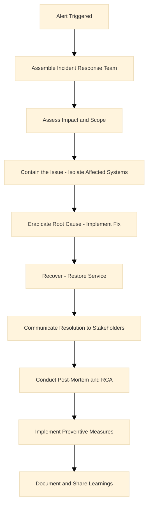

### Conducting Root Cause Analysis

**Answer:**
- Gather evidence from logs, metrics, and timelines
  - **Why:** Provides factual basis for analysis; ensures accurate identification.
- Identify root cause using techniques like the 5 Whys
  - **Why:** Drills down to fundamental cause; prevents superficial fixes.
- Implement corrective actions
  - **Why:** Addresses the issue to prevent recurrence; improves system reliability.
- Document findings in a post-mortem report shared across teams
  - **Why:** Shares learnings; fosters team improvement and culture.

**Service Explanations:**
- **ELK stack:** Elasticsearch, Logstash, Kibana for log analysis.
- **Datadog:** Monitoring and analytics platform.

**Detailed Explanation:** Use tools like ELK stack for log analysis or Datadog for metric correlation. Ensure actions are preventive, like adding circuit breakers or improving monitoring.

*Example:* For a service degradation, traced to a memory leak in a microservice; fixed by optimizing code and adding heap monitoring, reducing future incidents by 50%.

### Implementing and Maturing Incident Management Frameworks

**Answer:**
- Start with basic runbooks for common issues, evolve to playbooks with automated responses.
  - **Why:** Runbooks provide quick reference; automation reduces manual toil; benefits faster resolution and consistency.
- Integrate with CI/CD for canary deployments and chaos engineering for resilience testing.
  - **Why:** Canary deployments test changes safely; chaos engineering builds resilience; benefits proactive reliability and reduced incidents.

**Service Explanations:**
- **PagerDuty:** Incident management and alerting.
- **Slack:** Team communication platform.
- **FireHydrant:** Incident response orchestration tool.

**Detailed Explanation:** Use PagerDuty for on-call rotation, Slack for communication, and tools like FireHydrant for incident tracking. Mature by measuring MTTR and MTTD, aiming for continuous improvement.

*Example:* Implemented automated rollback scripts in our CI pipeline, reducing manual toil and improving recovery time from hours to minutes.

## Leadership and Mentorship

### Providing Technical Leadership to SRE Teams

**Answer:**
- Lead by example, set technical standards, and drive initiatives like adopting new tools.
- Foster a culture of innovation and reliability through regular tech talks and hackathons.

**Detailed Explanation:** As a senior SRE, influence architecture decisions, mentor juniors, and collaborate with product teams to embed SRE principles early in SDLC.

*Example:* Led the adoption of Kubernetes in our stack, training the team and reducing deployment times by 70%.

### Mentoring Junior Engineers

**Answer:**
- Pair on complex tasks, provide constructive feedback in code reviews, and encourage continuous learning through resources like books or conferences.

**Detailed Explanation:** Focus on soft skills like incident handling and hard skills like IaC. Track progress and celebrate achievements.

*Example:* Mentored a new hire on AWS architecture, resulting in them leading a migration project independently.

### Promoting SRE Culture Across Teams

**Answer:** Organize workshops on reliability, share success stories, and integrate SRE metrics into team KPIs. Encourage blameless culture to learn from failures.

**Detailed Explanation:** Work with DevOps and QA to implement shared ownership, using tools like SLO dashboards visible to all.

*Example:* Introduced error budgets, leading to teams prioritizing reliability alongside features, improving overall uptime.

## Service Level Management

### Defining and Tracking SLOs and SLIs

**Answer:**
- SLOs are reliability targets (e.g., 99.9% uptime)
- SLIs measure them (e.g., request success rate)
- Use error budgets to balance innovation and reliability

**Detailed Explanation:** Use the Four Golden Signals: Latency, Traffic, Errors, Saturation. Track with Prometheus and Grafana, alerting when budgets are depleted.

*Example:* For a game API, set SLO at 99.95%, monitored via success rate; when breached, paused features to fix issues.

**Diagram:**

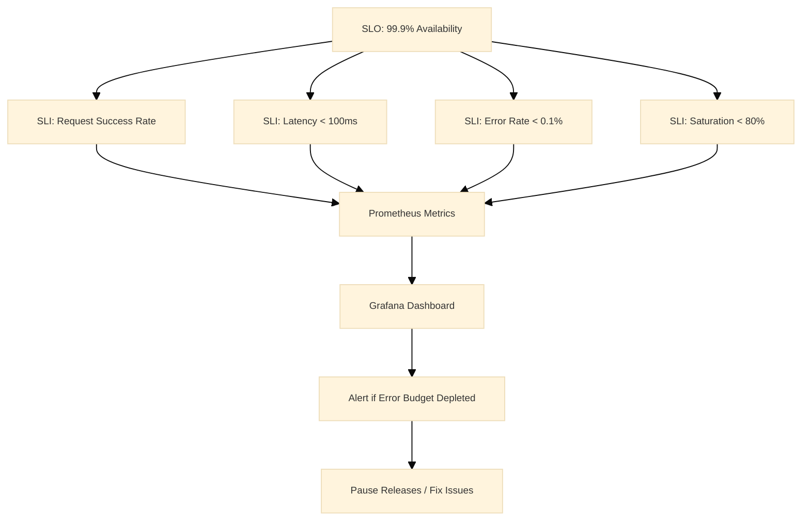

### Applying the Four Golden Signals

**Answer:**
- Latency: Response time
- Traffic: Request volume
- Errors: Failure rate
- Saturation: Resource utilization
- Monitor these to ensure system health

**Detailed Explanation:** Use histograms for latency percentiles, counters for traffic, and gauges for saturation.

*Example:* Detected high saturation during peak load, auto-scaled instances to prevent errors.

## Documentation and Knowledge Sharing

### Establishing Comprehensive Documentation

**Answer:**
- Use tools like Confluence or GitHub Wiki for runbooks, architecture diagrams, and best practices.
- Keep it updated through pull requests.

**Detailed Explanation:** Document as code, version control docs, and automate generation where possible.

*Example:* Created a knowledge base for incident response, reducing resolution time for recurring issues.

### Facilitating Learning Through Technical Sessions

**Answer:**
- Host weekly tech talks, share post-mortems, and organize lunch-and-learns on new technologies.

**Detailed Explanation:** Encourage participation, record sessions for remote teams.

*Example:* A session on chaos engineering led to implementing game days, improving resilience.

## Strategic Technology and Continuous Improvement

### Contributing to SRE Strategy and Tooling Roadmap

**Answer:**
- Analyze current pain points, research emerging tools, and propose pilots.
- Align with business goals for scalability.

**Detailed Explanation:** Evaluate tools like adopting Istio for service mesh or Terraform for IaC at scale.

*Example:* Proposed and led migration to multi-cloud, reducing vendor lock-in and costs.

### Evaluating and Adopting New Technologies

**Answer:**
- Assess against criteria: reliability, cost, ease of integration.
- Start with POCs, measure impact.

**Detailed Explanation:** Use RFCs for proposals, involve stakeholders.

*Example:* Adopted Prometheus over Nagios, improving alerting granularity and reducing false positives.

## Security and Compliance

### Collaborating with Security Teams

**Answer:**
- Integrate security into IaC with tools like Checkov, implement secure baselines, and participate in threat modeling.

**Detailed Explanation:** Ensure DevSecOps by automating scans in CI/CD.

*Example:* Implemented encrypted secrets management, preventing data breaches.

### Implementing Secure Configuration Baselines

**Answer:**
- Use CIS benchmarks, automate with Ansible, and monitor with AWS Config.

**Detailed Explanation:** Regularly audit and remediate vulnerabilities.

*Example:* Hardened EC2 instances, reducing security incidents by 60%.

## Strategic Leadership and Stakeholder Management

### Partnering with Stakeholders for SRE Initiatives

**Answer:**
- Provide data-driven insights on reliability metrics, align initiatives with business risks, and influence decisions through presentations.

**Detailed Explanation:** Build relationships, translate technical terms to business impact.

*Example:* Convinced leadership to invest in observability, leading to better decision-making.

### Representing SRE in Governance Forums

**Answer:**
- Present reliability reports, advocate for best practices, and ensure compliance.

**Detailed Explanation:** Participate in architecture reviews, audits.

*Example:* Influenced a design change to include redundancy, avoiding future outages.

## Technical Expertise Deep Dive

### Administering Linux/Unix Systems at Scale

**Answer:**
- Use configuration management like Ansible for automation, monitor with Nagios, and optimize kernel parameters for performance.

**Detailed Explanation:** Handle patching, log rotation, and security hardening.

*Example:* Automated OS updates across 1000 servers, reducing downtime.

### Containerization and Orchestration with Docker and Kubernetes

**Answer:**
- Docker for packaging apps, Kubernetes for scheduling and scaling.
- Use Helm for deployments.

**Detailed Explanation:** Manage pods, services, ingresses; implement HPA for auto-scaling.

*Example:* Deployed a microservice on EKS, scaling from 10 to 100 pods during load.

**Diagram:**

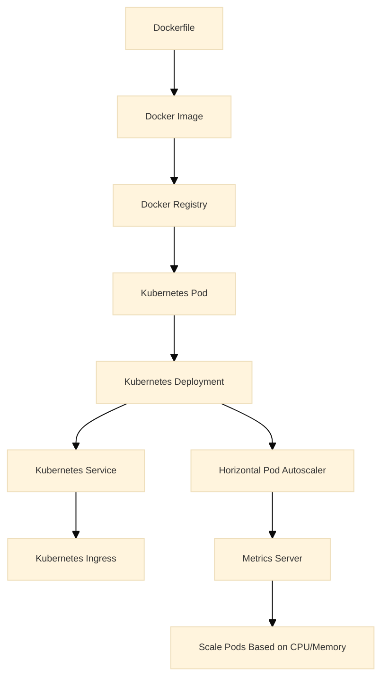

### Service Mesh with Istio

**Answer:**
- Istio provides traffic management, security, and observability.
- Use for canary deployments and circuit breakers.

**Detailed Explanation:** Configure virtual services, destination rules.

*Example:* Implemented blue-green deployments, reducing release risks.

### Using Monitoring Stacks like Prometheus and Grafana

**Answer:**
- Prometheus scrapes metrics, Grafana visualizes.
- Set up alerts on SLO breaches.

**Detailed Explanation:** Use exporters for custom metrics.

*Example:* Created dashboards for game server latency, alerting on thresholds.

### Explain IaC with Terraform

**Answer:**
- Define infrastructure as code, version control, and apply changes predictably.

**Detailed Explanation:** Use modules for reusability, state management.

*Example:* Provisioned a VPC with subnets and security groups in minutes.

### How do you handle networking and load balancing

**Answer:**
- Use ALB/NLB for L4/L7 balancing, configure VPC peering, optimize with CloudFront.

**Detailed Explanation:** Implement health checks, sticky sessions.

*Example:* Balanced traffic across regions, improving global performance.

## Operational Excellence

### Describe capacity planning for enterprise scale

**Answer:**
- Monitor usage trends, forecast with tools like CloudWatch, plan for peaks.

**Detailed Explanation:** Use auto-scaling policies, reserve instances.

*Example:* Predicted holiday traffic spike, pre-scaled resources, avoiding outages.

### How do you design for disaster recovery

**Answer:**
- Implement backup and restore, multi-site replication, test DR drills.

**Detailed Explanation:** Use RTO/RPO metrics.

*Example:* Recovered from AZ failure in 10 minutes, minimizing impact.

## Soft Skills and Experience

### How do you handle stakeholder communication during incidents

**Answer:**
- Be transparent, provide regular updates, use simple language.

**Detailed Explanation:** Tailor communication to audience: technical for engineers, high-level for execs.

*Example:* Kept users informed via status page during outage.

### Describe your experience with cross-functional collaboration

**Answer:**
- Worked with dev, QA, ops to integrate monitoring early.

**Detailed Explanation:** Use agile practices, shared backlogs.

*Example:* Co-developed a feature with dev team, ensuring reliability from start.

### How do you balance technical depth with leadership

**Answer:**
- Stay hands-on while delegating, mentor to build team capabilities.

**Detailed Explanation:** Allocate time for coding and strategy.

*Example:* Led a project while fixing critical bugs.

### Tell us about a time you drove automation to reduce toil

**Answer:**
- Automated log parsing with scripts, saving hours weekly.

**Detailed Explanation:** Identify repetitive tasks, use Python/Bash.

*Example:* Built a dashboard for on-call metrics, improving visibility.

### How do you ensure continuous improvement in your role

**Answer:**
- Review metrics quarterly, adopt best practices, learn from industry.

**Detailed Explanation:** Participate in communities, attend conferences.

*Example:* Implemented chaos engineering, uncovering hidden failures.

## Advanced AWS Scenarios

### Design a zero-downtime deployment strategy for a monolithic app on AWS

**Answer:**
- Use blue-green deployments with Elastic Beanstalk or ECS.
- Deploy to a new environment, test, then switch traffic via ALB.
- Rollback if issues arise.

**Service Explanations:**
- **Elastic Beanstalk:** Managed service for deploying and scaling web applications.
- **ECS:** Amazon Elastic Container Service for running containers.

**Detailed Explanation:** Involves canary releases, feature flags, and automated testing. Monitor with CloudWatch during cutover.

*Example:* For a game update, deployed to blue environment, validated with 1% traffic, then full switch, ensuring no player disruption.

### How do you handle database scaling in AWS for high-write workloads

**Answer:**
- Use Aurora with read replicas for reads, DynamoDB for NoSQL, or RDS with sharding.
- Implement connection pooling and optimize queries.

**Service Explanations:**
- **Aurora:** High-performance relational database.
- **DynamoDB:** Managed NoSQL database.
- **RDS:** Managed relational database service.

**Detailed Explanation:** Monitor with Performance Insights, use auto-scaling for replicas.

*Example:* Scaled a leaderboard service from 1000 to 10,000 writes/sec by adding replicas and partitioning.

### Explain architecting for edge computing on AWS

**Answer:**
- Use CloudFront with Lambda@Edge for compute at edge locations.
- Cache static content, process requests closer to users.

**Service Explanations:**
- **CloudFront:** Content Delivery Network.
- **Lambda@Edge:** Runs Lambda functions at CloudFront edge locations.

**Detailed Explanation:** Reduces latency for global users, integrates with API Gateway.

*Example:* Personalized game content delivered via Lambda@Edge, cutting response time by 40%.

### How do you implement chaos engineering on AWS

**Answer:**
- Use AWS Fault Injection Simulator (FIS) to inject failures like instance termination or network latency.
- Measure system resilience.

**Detailed Explanation:** Run experiments in non-prod, analyze impact on SLOs.

*Example:* Simulated AZ failure, discovered weak points in failover, improved RTO.

**Diagram:**

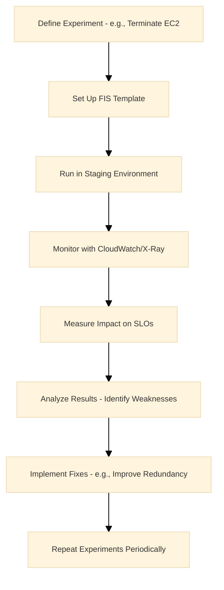

### Describe securing data at rest and in transit on AWS

**Answer:**
- Use KMS for encryption at rest, TLS 1.3 for transit.
- Implement S3 SSE, RDS encryption.

**Service Explanations:**
- **KMS:** Manages encryption keys.
- **TLS:** Protocol for secure communications.
- **ACM:** Manages SSL/TLS certificates.

**Detailed Explanation:** Rotate keys regularly, use ACM for certificates.

*Example:* Encrypted user data in S3, preventing breaches during a hack attempt.

## Multi-Cloud Advanced

### How do you manage hybrid cloud deployments

**Answer:**
- Use AWS Outposts or Azure Arc for on-prem extensions.
- VPN/Direct Connect for connectivity.

**Detailed Explanation:** Ensure consistent security and monitoring across environments.

*Example:* Extended AWS to on-prem data center for low-latency gaming.

### Explain federated identity in multi-cloud

**Answer:**
- Use SAML/OIDC with providers like Okta.
- Sync users across clouds.

**Detailed Explanation:** Avoid password sprawl, enable SSO.

*Example:* Single login for AWS and GCP resources.

### How do you optimize inter-cloud data transfer costs

**Answer:**
- Use peering, compress data, schedule transfers off-peak.
- Monitor with billing alerts.

**Detailed Explanation:** Choose regions wisely, use CDN for static assets.

*Example:* Reduced egress costs by 30% by compressing logs before transfer.

## Reliability Deep Dive

### What is an error budget, and how do you manage it

**Answer:**
- Error budget is 100% - SLO (e.g., 0.1% for 99.9%).
- Track burn rate; if exceeded, halt features.

**Detailed Explanation:** Use dashboards to visualize, communicate to teams.

*Example:* Team paused releases when budget hit 80%, fixed issues to restore.

**Diagram:**

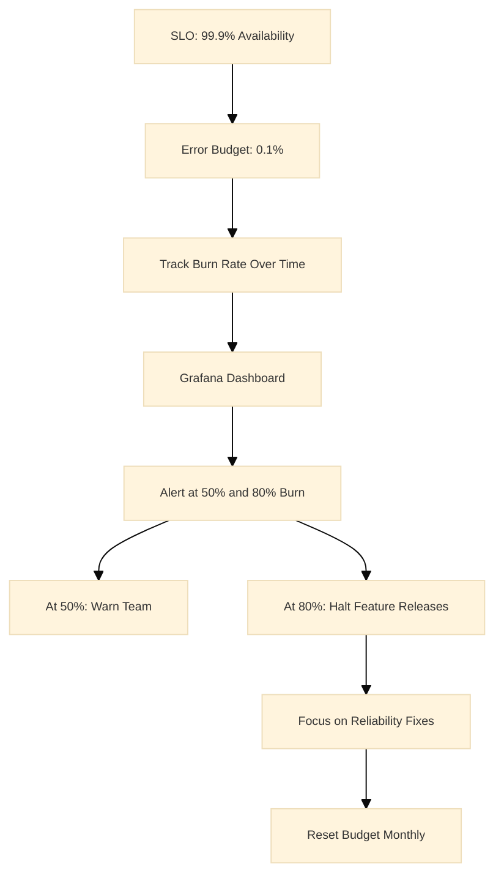

### How do you design for fault tolerance in distributed systems

**Answer:**
- Implement redundancy, circuit breakers, retries with exponential backoff.
- Use leader election for consistency.

**Detailed Explanation:** Follow CAP theorem trade-offs.

*Example:* In a microservice failure, circuit breaker prevented cascade, maintaining 99% uptime.

**Diagram:**

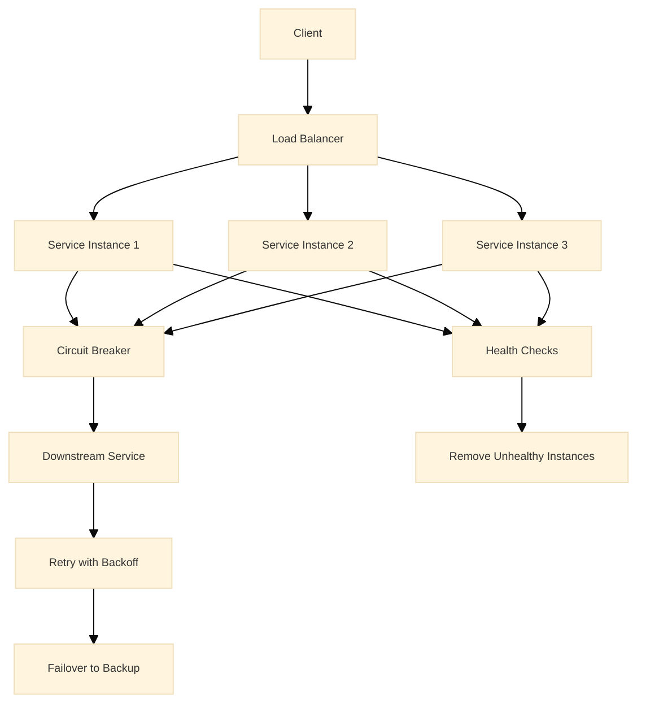

### Explain the concept of toil and how to eliminate it

**Answer:**
- Toil is manual, repetitive work.
- Automate with scripts, IaC, or tools like Ansible.

**Detailed Explanation:** Measure toil hours, prioritize automation.

*Example:* Automated certificate renewals, saving 10 hours/week.

## Scalability Scenarios

### How do you scale a stateful application

**Answer:**
- Use persistent volumes in Kubernetes, database clustering.
- Avoid sticky sessions.

**Detailed Explanation:** Implement sharding, read/write splitting.

*Example:* Scaled a session store from 1 to 10 nodes with Redis Cluster.

**Diagram:**

```mermaid
%%{init: {'theme': 'base', 'themeVariables': {'fontSize': '10px'}}}%%
graph TD
    Client[Client] --> Proxy[Proxy Layer - e.g., HAProxy]
    Proxy --> Shard1[Shard 1 - Redis Node 1]
    Proxy --> Shard2[Shard 2 - Redis Node 2]
    Proxy --> Shard3[Shard 3 - Redis Node 3]
    Shard1 --> PV1[Persistent Volume 1]
    Shard2 --> PV2[Persistent Volume 2]
    Shard3 --> PV3[Persistent Volume 3]
    Shard1 --> Replica1[Replica Node 1]
    Shard2 --> Replica2[Replica Node 2]
    Shard3 --> Replica3[Replica Node 3]
    Note over Proxy: Routes based on Key Hash
```

### Describe handling traffic spikes in gaming

**Answer:**
- Use auto-scaling, CDN, and rate limiting.
- Pre-warm resources for events.

**Detailed Explanation:** Monitor with custom metrics, alert on thresholds.

*Example:* During launch, scaled from 100k to 1M users seamlessly.

### How do you optimize for low-latency in global apps

**Answer:**
- Deploy in multiple regions, use Global Accelerator, cache at edge.

**Detailed Explanation:** Measure P95 latency, optimize queries.

*Example:* Reduced ping from 200ms to 20ms with CloudFront.

## Observability Mastery

### How do you set up distributed tracing

**Answer:**
- Use X-Ray or Jaeger.
- Instrument code with spans, correlate across services.

**Detailed Explanation:** Trace requests end-to-end, identify bottlenecks.

*Example:* Traced a slow API call to a DB query, optimized index.

**Diagram:**

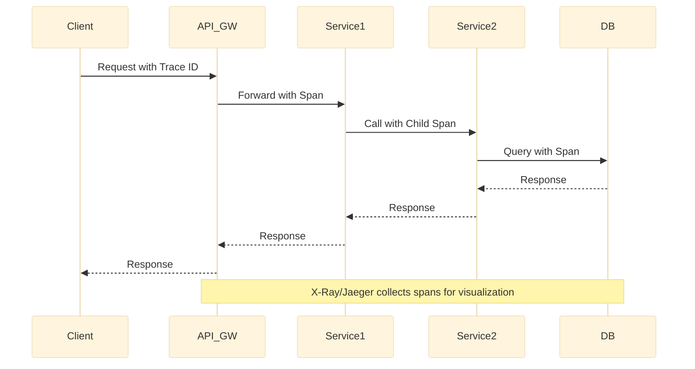

### Explain anomaly detection in monitoring

**Answer:**
- Use statistical methods or ML in tools like Datadog.
- Set dynamic thresholds.

**Detailed Explanation:** Reduce false positives, focus on true anomalies.

*Example:* Detected unusual CPU spike, prevented outage by scaling.

**Diagram:**

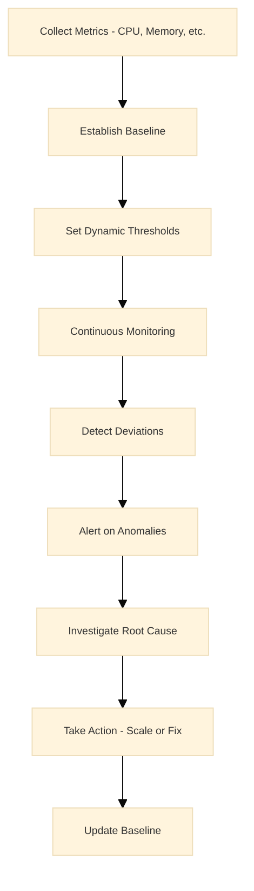

### How do you monitor third-party services

**Answer:**
- Use synthetic monitoring, health checks, and SLAs.
- Alert on breaches.

**Detailed Explanation:** Integrate with vendor APIs.

*Example:* Monitored payment gateway, switched providers on failure.

## Cost Optimization Advanced

### How do you implement FinOps practices

**Answer:**
- Tag resources, use cost allocation tags, set budgets with alerts.
- Review monthly.

**Detailed Explanation:** Use AWS Cost Explorer, optimize RI purchases.

*Example:* Identified idle instances, saved $50k/year.

### Describe rightsizing resources

**Answer:**
- Analyze usage with CloudWatch, resize instances or use Graviton for cost.

**Detailed Explanation:** Use recommendations from Trusted Advisor.

*Example:* Downgraded over-provisioned DB, cut costs by 25%.

### How do you handle spot instance usage safely

**Answer:**
- Use for stateless workloads, implement graceful shutdown, fall back to on-demand.

**Detailed Explanation:** Monitor spot interruptions, use ASG with mixed instances.

*Example:* Ran batch jobs on spot, saving 70% vs on-demand.

## Incident Management Scenarios

### Walk through responding to a P0 incident

**Answer:**
- Acknowledge alert, assemble team, assess, mitigate, communicate, post-mortem.

**Detailed Explanation:** Use timeline, assign roles.

### How do you design and execute chaos experiments using AWS Fault Injection Simulator (FIS)

**Answer:**
- Define experiments to simulate failures like network latency or instance termination.
  - **Why:** Tests system resilience under stress; identifies weaknesses proactively; benefits improved fault tolerance and preparedness for real incidents.
- Run in staging environments first, monitor impact on SLOs.
  - **Why:** Avoids production disruption; measures effects on reliability metrics; benefits data-driven improvements without risk.
- Analyze results and implement fixes like adding retries or redundancy.
  - **Why:** Turns insights into actions; prevents future failures; benefits overall system stability.

**Service Explanations:**
- **AWS Fault Injection Simulator (FIS):** Service for running controlled chaos experiments on AWS infrastructure.

**Special Notes:**
- Chaos engineering: Discipline of experimenting on systems to build confidence in their resilience.
- Game days: Scheduled chaos experiments to simulate real-world failures.

*Example:* Injected AZ failure in a gaming platform, discovered load balancer bottleneck, added more ALBs to handle failover.

**Diagram:**

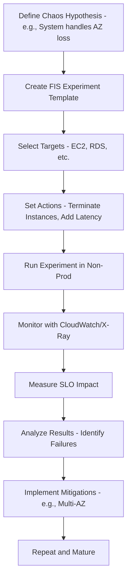

### 108. Explain implementing chaos engineering in a microservices architecture on AWS.

**Answer:**
- Use FIS to inject failures at service level, like killing pods in EKS.
  - **Why:** Simulates microservice failures; ensures isolation and resilience; benefits prevents cascading outages in distributed systems.
- Combine with service mesh like App Mesh for traffic manipulation.
  - **Why:** App Mesh allows routing failures; enhances chaos scenarios; benefits realistic testing of inter-service dependencies.
- Measure blast radius and recovery time.
  - **Why:** Quantifies failure impact; improves incident response; benefits faster recovery in real events.

**Service Explanations:**
- **EKS:** Managed Kubernetes service for containerized applications.
- **AWS App Mesh:** Service mesh for microservice communication and observability.

**Special Notes:**
- Blast radius: Scope of impact from a failure.
- Steady state: Normal system behavior to return to after chaos.

*Example:* Killed a payment microservice pod, verified circuit breaker activated, preventing order failures in e-commerce.

### 109. How do you integrate chaos engineering into CI/CD pipelines?

**Answer:**
- Automate chaos experiments post-deployment using tools like Gremlin or FIS in pipelines.
  - **Why:** Ensures resilience testing is routine; catches issues early; benefits continuous reliability assurance.
- Set thresholds for experiment success based on SLOs.
  - **Why:** Defines acceptable failure levels; gates deployments if breached; benefits quality gates in CI/CD.
- Use canary deployments with chaos to validate in production subsets.
  - **Why:** Tests real traffic safely; builds confidence incrementally; benefits low-risk experimentation.

**Service Explanations:**
- **CI/CD pipelines:** Automated processes for building, testing, and deploying code.
- **Gremlin:** Chaos engineering platform for injecting failures.

**Special Notes:**
- Hypothesis-driven: Each experiment tests a specific resilience hypothesis.
- Observability integration: Chaos tools should feed into monitoring stacks.

*Example:* After deploying a new game feature, ran automated latency injection, confirmed auto-scaling handled it without errors.

### 110. Describe using monitoring stacks like Prometheus, Grafana, and Loki for SRE.

**Answer:**
- Prometheus scrapes metrics, Grafana visualizes dashboards, Loki aggregates logs.
  - **Why:** Prometheus provides time-series data; Grafana offers customizable views; Loki handles log querying; benefits comprehensive observability in one stack.
- Set up alerting rules in Prometheus for SLO breaches.
  - **Why:** Proactive notifications; enables quick response; benefits maintains reliability targets.
- Use exporters for AWS services integration.
  - **Why:** Pulls metrics from EC2, RDS, etc.; centralizes monitoring; benefits unified view across hybrid environments.

**Service Explanations:**
- **Prometheus:** Open-source monitoring and alerting toolkit.
- **Grafana:** Visualization and analytics platform.
- **Loki:** Log aggregation system designed for Prometheus.

**Special Notes:**
- Exporters: Agents that collect metrics from services and expose to Prometheus.
- Alertmanager: Component of Prometheus for handling alerts.

*Example:* Monitored game server CPU with Prometheus, alerted on high usage via Grafana, preventing crashes during peak play.

**Diagram:**

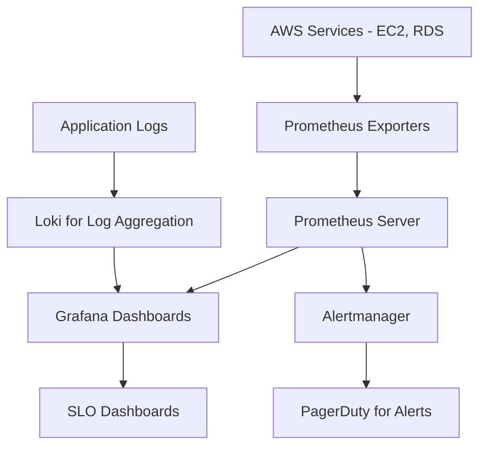

### 111. How do you build custom dashboards in Grafana for monitoring AWS resources?

**Answer:**
- Connect Grafana to CloudWatch as data source.
  - **Why:** Pulls AWS metrics directly; enables real-time visualization; benefits native AWS integration without exporters.
- Create panels for latency, error rates, and resource utilization.
  - **Why:** Customizes views for SRE needs; highlights key metrics; benefits faster issue identification.
- Use variables for dynamic filtering by region or service.
  - **Why:** Allows interactive exploration; simplifies multi-environment monitoring; benefits scalability in large infrastructures.

**Service Explanations:**
- **Grafana:** Open-source platform for monitoring and observability.
- **CloudWatch:** AWS monitoring service.

**Special Notes:**
- Panels: Individual visualizations in a dashboard.
- Variables: Dynamic elements for filtering data.

*Example:* Built a dashboard showing player latency across regions, identified high-latency AZ, optimized routing.

### 112. Explain setting up alerting in Prometheus for gaming workloads.

**Answer:**
- Define rules for game-specific metrics like player count or session errors.
  - **Why:** Tailors alerts to business-critical KPIs; ensures timely response to gaming issues; benefits maintains player experience.
- Use Alertmanager to route alerts to on-call SREs via Slack or PagerDuty.
  - **Why:** Automates notification; reduces MTTR; benefits efficient incident handling.
- Include silencing and inhibition for maintenance windows.
  - **Why:** Prevents noise during planned downtime; avoids alert fatigue; benefits focused alerting.

**Service Explanations:**
- **Prometheus:** Monitoring system with built-in alerting.
- **Alertmanager:** Handles Prometheus alerts and notifications.

**Special Notes:**
- Inhibition: Suppresses alerts based on other alerts.
- Silencing: Temporarily mutes alerts.

*Example:* Alerted on sudden drop in active players, traced to server overload, scaled up instances.

### 113. How do you use IaC with Terraform for AWS infrastructure provisioning?

**Answer:**
- Write Terraform configurations for VPC, EC2, RDS.
  - **Why:** Defines infrastructure as code; enables version control and reproducibility; benefits consistent, automated deployments.
- Use modules for reusable components like networking.
  - **Why:** Promotes DRY principles; simplifies management; benefits faster provisioning of complex setups.
- Plan and apply changes with state locking.
  - **Why:** Previews modifications; prevents concurrent changes; benefits safe, predictable updates.

**Service Explanations:**
- **Terraform:** Open-source IaC tool by HashiCorp.
- **AWS provider:** Terraform plugin for AWS resources.

**Special Notes:**
- State file: Stores infrastructure state for Terraform.
- Modules: Reusable Terraform configurations.

*Example:* Provisioned a multi-AZ gaming cluster with Terraform, deployed in minutes with zero manual errors.

**Diagram:**

```mermaid
graph TD
    Code[Terraform Code - main.tf] --> Plan[terraform plan]
    Plan --> Apply[terraform apply]
    Apply --> AWS[AWS Resources - VPC, EC2, etc.]
    AWS --> State[Terraform State File]
    State --> Code
    Modules[Reusable Modules] --> Code
    Note over Plan: Preview Changes
    Note over Apply: Provision Infrastructure
```

### 114. Describe managing Terraform state in a team environment.

**Answer:**
- Store state in S3 with DynamoDB for locking.
  - **Why:** Enables shared state; prevents conflicts; benefits collaborative IaC management.
- Use workspaces for environment separation.
  - **Why:** Isolates dev, staging, prod; avoids cross-environment issues; benefits safe testing.
- Implement access controls with IAM.
  - **Why:** Secures state access; follows least privilege; benefits compliance and security.

**Service Explanations:**
- **S3:** Object storage for state files.
- **DynamoDB:** NoSQL database for state locking.

**Special Notes:**
- Workspaces: Terraform feature for managing multiple environments.
- Remote state: Storing state remotely for team access.

*Example:* Team collaborated on infrastructure changes without overwriting each other's work using locked state.

### 115. How do you handle IaC for multi-region deployments?

**Answer:**
- Use Terraform with provider aliases for multiple regions.
  - **Why:** Allows provisioning across regions; ensures global coverage; benefits disaster recovery and low-latency.
- Parameterize configurations for region-specific values.
  - **Why:** Customizes per region; avoids hardcoding; benefits flexibility and maintainability.
- Use remote state with cross-region replication.
  - **Why:** Shares state securely; enables dependencies; benefits coordinated multi-region setups.

**Service Explanations:**
- **Terraform:** IaC tool supporting multi-provider configurations.

**Special Notes:**
- Provider aliases: Multiple instances of the same provider in Terraform.
- Parameterization: Using variables for dynamic values.

*Example:* Deployed gaming servers in us-east-1 and eu-west-1, with shared state for consistent configurations.

### 116. Explain implementing IaC with AWS CloudFormation for serverless applications.

**Answer:**
- Define Lambda, API Gateway, DynamoDB in YAML/JSON templates.
  - **Why:** Declarative provisioning; integrates with AWS services; benefits managed, versioned infrastructure.
- Use nested stacks for modularity.
  - **Why:** Breaks down complex apps; reuses components; benefits maintainable code.
- Deploy via CodePipeline for CI/CD integration.
  - **Why:** Automates deployments; ensures reliability; benefits continuous delivery.

**Service Explanations:**
- **CloudFormation:** AWS IaC service.
- **CodePipeline:** CI/CD service for AWS.

**Special Notes:**
- Nested stacks: Hierarchical CloudFormation templates.
- Change sets: Previews changes before applying.

*Example:* Provisioned a serverless backend for a game leaderboard, updated via pipeline without downtime.

### 117. How do you design VPC networking for high-availability applications?

**Answer:**
- Create VPC with public/private subnets across multiple AZs.
  - **Why:** Isolates resources; ensures redundancy; benefits fault tolerance and security.
- Use NAT gateways for outbound traffic from private subnets.
  - **Why:** Allows internet access without exposing instances; secures architecture; benefits compliance.
- Implement VPC peering or Transit Gateway for inter-VPC communication.
  - **Why:** Connects networks securely; scales connectivity; benefits microservices across VPCs.

**Service Explanations:**
- **VPC:** Virtual private cloud for network isolation.
- **NAT Gateway:** Managed service for outbound internet access.
- **Transit Gateway:** Network hub for connecting VPCs.

**Special Notes:**
- Subnets: Divisions within VPC for resource placement.
- AZs: Availability Zones for redundancy.

*Example:* Designed VPC for a gaming app, with private DB subnets and public ALB, handling millions of requests reliably.

**Diagram:**

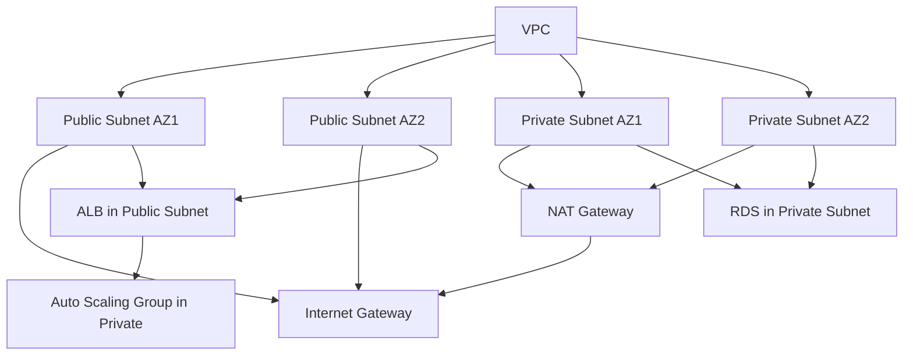

### 118. Describe optimizing network performance for global gaming audiences.

**Answer:**
- Use CloudFront with Lambda@Edge for edge computing.
  - **Why:** Caches content globally; processes requests at edge; benefits reduced latency for worldwide players.
- Implement Global Accelerator for TCP/UDP traffic.
  - **Why:** Routes traffic via AWS backbone; optimizes routing; benefits lower latency and jitter for games.
- Monitor with VPC Flow Logs and optimize instance placement.
  - **Why:** Tracks network traffic; identifies bottlenecks; benefits performance tuning.

**Service Explanations:**
- **CloudFront:** CDN for content delivery.
- **Global Accelerator:** Service for improving global application performance.
- **Lambda@Edge:** Runs functions at CloudFront edges.

**Special Notes:**
- Edge locations: Points of presence for faster delivery.
- Jitter: Variation in latency.

*Example:* Reduced game load times from 5s to 1s for Asian players using Global Accelerator.

### 119. How do you secure networking in AWS with VPC and security groups?

**Answer:**
- Configure security groups with least-privilege rules.
  - **Why:** Controls inbound/outbound traffic; minimizes attack surface; benefits enhanced security.
- Use NACLs for subnet-level filtering.
  - **Why:** Adds stateless rules; complements security groups; benefits layered defense.
- Enable VPC Flow Logs for monitoring.
  - **Why:** Captures traffic data; detects anomalies; benefits proactive threat identification.

**Service Explanations:**
- **Security Groups:** Virtual firewalls for EC2 instances.
- **NACLs:** Network ACLs for subnet traffic control.
- **VPC Flow Logs:** Logs for network traffic monitoring.

**Special Notes:**
- Least privilege: Granting minimal necessary access.
- Stateful: Security groups remember connections.

*Example:* Blocked unauthorized SSH attempts via security groups, preventing brute-force attacks on game servers.

### 120. Explain handling DDoS protection in AWS networking.

**Answer:**
- Use AWS Shield for automatic protection.
  - **Why:** Mitigates DDoS attacks; integrates with CloudFront/ALB; benefits always-on defense.
- Implement WAF with rate limiting rules.
  - **Why:** Filters malicious traffic; controls request rates; benefits application-level security.
- Scale with auto-scaling during attacks.
  - **Why:** Absorbs traffic spikes; maintains availability; benefits resilience under load.

**Service Explanations:**
- **AWS Shield:** Managed DDoS protection service.
- **WAF:** Web Application Firewall for filtering traffic.
- **CloudFront:** CDN that also helps with DDoS mitigation.

**Special Notes:**
- DDoS: Distributed Denial of Service attacks.
- Rate limiting: Restricting request frequency.

*Example:* During a gaming event, Shield absorbed a 100Gbps attack, keeping servers online.

### 121. How do you design auto-scaling for gaming-specific scenarios like player spikes?

**Answer:**
- Use target tracking scaling based on player count metrics.
  - **Why:** Scales with demand; maintains performance; benefits cost-efficiency during variable loads.
- Implement predictive scaling for known events.
  - **Why:** Pre-scales resources; avoids latency during launches; benefits smooth player experience.
- Set cooldown periods to prevent thrashing.
  - **Why:** Allows stabilization; avoids over-scaling; benefits stable operations.

**Service Explanations:**
- **Auto Scaling:** AWS service for adjusting capacity.
- **CloudWatch:** Provides metrics for scaling.

**Special Notes:**
- Thrashing: Frequent scaling in and out.
- Predictive scaling: Uses ML to forecast demand.

*Example:* Scaled game servers from 50 to 500 instances during a tournament, handling 2x player surge.

### 122. Describe monitoring player experience in gaming applications.

**Answer:**
- Track metrics like session duration, error rates, and latency.
  - **Why:** Measures user satisfaction; identifies issues; benefits improved retention.
- Use RUM tools integrated with CloudWatch.
  - **Why:** Captures real-user data; provides end-to-end visibility; benefits data-driven optimizations.
- Set SLOs for player experience KPIs.
  - **Why:** Defines targets; ensures focus on quality; benefits business alignment.

**Service Explanations:**
- **CloudWatch RUM:** Real User Monitoring for web apps.
- **X-Ray:** For tracing user requests.

**Special Notes:**
- RUM: Real User Monitoring.
- KPIs: Key Performance Indicators.

*Example:* Detected high latency in mobile game, optimized API calls, increased player engagement by 20%.

### 123. How do you handle database failover in gaming workloads?

**Answer:**
- Use RDS Multi-AZ with automatic failover.
  - **Why:** Ensures high availability; minimizes downtime; benefits continuous gameplay.
- Implement read replicas for scaling reads.
  - **Why:** Offloads queries; improves performance; benefits handling concurrent players.
- Monitor with Performance Insights.
  - **Why:** Tracks DB health; alerts on issues; benefits proactive maintenance.

**Service Explanations:**
- **RDS Multi-AZ:** Automatic failover for databases.
- **Read Replicas:** Copies for read scaling.

**Special Notes:**
- Failover: Switching to backup during failure.
- RTO: Recovery Time Objective.

*Example:* During DB maintenance, failover occurred seamlessly, no player disconnects.

### 124. Explain implementing leaderboards in gaming with AWS.

**Answer:**
- Use DynamoDB with global tables for low-latency updates.
  - **Why:** Handles high writes; replicates globally; benefits real-time leaderboards.
- Implement caching with ElastiCache for reads.
  - **Why:** Speeds up queries; reduces DB load; benefits performance for millions of users.
- Secure with IAM and encrypt data.
  - **Why:** Protects player data; complies with regulations; benefits trust and security.

**Service Explanations:**
- **DynamoDB:** NoSQL database for scalable applications.
- **ElastiCache:** In-memory caching service.

**Special Notes:**
- Global tables: Multi-region replication for DynamoDB.
- Partitioning: Distributing data across nodes.

*Example:* Updated leaderboard in real-time during tournament, with sub-second latency worldwide.

### 125. How do you manage in-game purchases securely on AWS?

**Answer:**
- Use API Gateway with Lambda for processing.
  - **Why:** Secures endpoints; scales automatically; benefits fraud prevention.
- Integrate with payment services like Stripe via webhooks.
  - **Why:** Handles transactions securely; offloads complexity; benefits compliance.
- Log and monitor transactions with CloudTrail.
  - **Why:** Audits activities; detects anomalies; benefits security and auditing.

**Service Explanations:**
- **API Gateway:** Manages APIs securely.
- **Lambda:** Serverless compute for logic.

**Special Notes:**
- Webhooks: Event notifications from payment providers.
- PCI compliance: Standards for payment security.

*Example:* Processed millions of purchases during sale, with zero security incidents.

### 126. Describe handling real-time multiplayer gaming with AWS.

**Answer:**
- Use GameLift for session management.
  - **Why:** Manages game servers; scales fleets; benefits low-latency matchmaking.
- Integrate with Lambda for backend logic.
  - **Why:** Processes events; scales per request; benefits cost-efficiency.
- Monitor with CloudWatch for player metrics.
  - **Why:** Tracks performance; alerts on issues; benefits smooth gameplay.

**Service Explanations:**
- **Amazon GameLift:** Managed service for game servers.
- **Lambda:** For event-driven processing.

**Special Notes:**
- Matchmaking: Pairing players for games.
- Fleets: Groups of game servers.

*Example:* Hosted 10k concurrent players in a battle royale, with auto-scaling fleets.

*Example:* Database corruption: restored from backup, communicated impact.

**Diagram:**

```mermaid
%%{init: {'theme': 'base', 'themeVariables': {'fontSize': '10px'}}}%%
flowchart TD
    Alert[Alert Received] --> Acknowledge[Acknowledge and Page Team]
    Acknowledge --> Assemble[Assemble War Room - Zoom/Slack]
    Assemble --> Assess[Assess Severity and Impact]
    Assess --> Mitigate[Mitigate - Isolate, Fix, Rollback]
    Mitigate --> Communicate[Communicate to Stakeholders]
    Communicate --> Resolve[Confirm Resolution]
    Resolve --> PostMortem[Conduct Post-Mortem]
    PostMortem --> Document[Document and Improve]
```

### 107. How do you prevent alert fatigue?

**Answer:**
- Tune thresholds, use silencing, group alerts.
- Review weekly.

**Detailed Explanation:** Prioritize critical alerts.

*Example:* Reduced alerts by 50% by aggregating similar ones.

### 108. Describe a blameless post-mortem.

**Answer:**
- Focus on facts, not blame.
- Identify improvements, share learnings.

**Detailed Explanation:** Include all involved, action items.

*Example:* After outage, improved monitoring, no recurrence.

## Leadership and Culture

### 109. How do you build a high-performing SRE team?

**Answer:**
- Hire for culture fit, provide growth opportunities, foster collaboration.

**Detailed Explanation:** Use OKRs, regular feedback.

*Example:* Team improved MTTR by 40% through training.

### 110. Explain influencing without authority.

**Answer:**
- Build trust, provide data, collaborate on shared goals.

**Detailed Explanation:** Use persuasion, demonstrate value.

*Example:* Convinced dev team to adopt SRE practices via pilots.

### 111. How do you handle team conflicts?

**Answer:**
- Mediate discussions, focus on facts, find win-win solutions.

**Detailed Explanation:** Use active listening.

*Example:* Resolved disagreement on tooling by testing both.

## Security Integration

### 112. How do you implement zero-trust architecture?

**Answer:**
- Verify every access, use MFA, micro-segmentation.

**Detailed Explanation:** Integrate with IAM, monitor logs.

*Example:* Prevented lateral movement in breach.

**Diagram:**

```mermaid
%%{init: {'theme': 'base', 'themeVariables': {'fontSize': '10px'}}}%%
graph TD
    User[User] --> MFA[MFA Verification]
    AccessRequest[Access Request] --> PolicyEngine[Policy Engine - Check Context]
    PolicyEngine --> Allow[Allow Access]
    PolicyEngine --> Deny[Deny Access]
    Allow --> Resource[Resource - e.g., Server]
    Resource --> Monitor[Continuous Monitoring]
    Monitor --> Revoke[Revoke on Anomaly]
    Deny --> Log[Log and Alert]
```

### 113. Describe handling compliance in cloud.

**Answer:**
- Use frameworks like SOC 2, automate audits with Config.

**Detailed Explanation:** Regular assessments.

*Example:* Achieved PCI compliance for payment data.

### 114. How do you manage secrets in production?

**Answer:**
- Use Secrets Manager or Vault, rotate regularly.

**Detailed Explanation:** Avoid hardcoding, audit access.

*Example:* Rotated API keys, blocked unauthorized access.

## Networking Expertise

### 115. How do you troubleshoot network issues in AWS?

**Answer:**
- Use VPC Flow Logs, Reachability Analyzer, packet captures.

**Detailed Explanation:** Check security groups, route tables.

*Example:* Fixed connectivity by updating NACLs.

**Diagram:**

```mermaid
%%{init: {'theme': 'base', 'themeVariables': {'fontSize': '10px'}}}%%
flowchart TD
    Issue[Network Issue Detected] --> Logs[Check VPC Flow Logs]
    Logs --> Analyzer[Use Reachability Analyzer]
    Analyzer --> Packet[Capture Packets with tcpdump]
    Packet --> SG[Verify Security Groups]
    SG --> RT[Check Route Tables]
    RT --> NACL[Inspect NACLs]
    NACL --> Resolve[Apply Fix - e.g., Update Rules]
    Resolve --> Test[Test Connectivity]
    Test --> Monitor[Monitor for Recurrence]
```

### 116. Explain load balancing strategies.

**Answer:**
- L4 for TCP, L7 for HTTP.
- Use sticky sessions sparingly.

**Detailed Explanation:** Health checks, cross-zone balancing.

*Example:* Balanced game servers, reduced latency variance.

### 117. How do you secure network traffic?

**Answer:**
- Use VPC, TLS, WAF.
- Implement DDoS protection with Shield.

**Detailed Explanation:** Encrypt all traffic.

*Example:* Mitigated DDoS with Shield, uptime maintained.

## Automation and IaC

### 118. How do you version control infrastructure?

**Answer:**
- Use Git for Terraform code, peer reviews, CI/CD for deployments.

**Detailed Explanation:** Test changes in dev.

*Example:* Rolled back misconfig via Git revert.

### 119. Describe CI/CD for infrastructure.

**Answer:**
- Use pipelines to lint, test, deploy IaC.
- Integrate with monitoring.

**Detailed Explanation:** Blue-green for safety.

*Example:* Automated VPC creation, reduced setup time.

**Diagram:**

```mermaid
%%{init: {'theme': 'base', 'themeVariables': {'fontSize': '10px'}}}%%
flowchart TD
    Code[Commit IaC Code to Git] --> Lint[Lint with TFLint]
    Lint --> Test[Test with Terratest]
    Test --> Plan[Terraform Plan]
    Plan --> Apply[Terraform Apply to Staging]
    Apply --> Validate[Validate with Checks]
    Validate --> Deploy[Deploy to Production]
    Deploy --> Monitor[Monitor with CloudWatch]
    Monitor --> Rollback[Rollback if Issues]
```

### 120. How do you handle IaC drift?

**Answer:**
- Use drift detection in Terraform, reconcile manually or auto.

**Detailed Explanation:** Prevent manual changes.

*Example:* Detected drift, reapplied config.

## Performance Tuning

### 121. How do you optimize application performance?

**Answer:**
- Profile code, optimize DB queries, use caching (Redis).

**Detailed Explanation:** Monitor with APM tools.

*Example:* Cached frequent queries, improved response by 50%.

**Diagram:**

```mermaid
%%{init: {'theme': 'base', 'themeVariables': {'fontSize': '10px'}}}%%
flowchart TD
    Identify[Identify Bottleneck - e.g., High Latency] --> Profile[Profile Code with APM]
    Profile --> Query[Analyze DB Queries]
    Query --> Cache[Implement Caching Layer]
    Cache --> Optimize[Optimize Code - e.g., Algorithms]
    Optimize --> Test[Test Performance]
    Test --> Monitor[Monitor Metrics]
    Monitor --> Iterate[Iterate Improvements]
```

### 122. Explain database performance tuning.

**Answer:**
- Index properly, partition tables, monitor slow queries.

**Detailed Explanation:** Use EXPLAIN plans.

*Example:* Added index, reduced query time from 5s to 0.5s.

### 123. How do you handle memory leaks?

**Answer:**
- Monitor heap usage, use profilers, restart processes.

**Detailed Explanation:** Implement GC tuning.

*Example:* Fixed leak in Java app, stabilized memory.

## Behavioral and Experience

### 124. Describe a time you failed and recovered.

**Answer:**
- Overlooked a dependency, caused outage; learned to test thoroughly.

**Detailed Explanation:** Shared learnings with team.

*Example:* Improved testing, no repeat.

### 125. How do you prioritize tasks?

**Answer:**
- Use Eisenhower matrix, focus on high-impact.

**Detailed Explanation:** Align with business goals.

*Example:* Fixed critical bug before feature release.

### 126. Tell us about scaling a team.

**Answer:**
- Hired strategically, onboarded well, delegated.

**Detailed Explanation:** Maintained quality.

*Example:* Grew team from 5 to 15, productivity increased.

### 127. How do you handle remote work challenges?

**Answer:**
- Use async communication, regular check-ins, tools like Slack.

**Detailed Explanation:** Foster inclusion.

*Example:* Maintained collaboration across time zones.

### 128. Describe your approach to learning.

**Answer:**
- Self-paced study, hands-on experiments, share knowledge.

**Detailed Explanation:** Stay current.

*Example:* Learned Kubernetes via projects, applied at work.

### 129. How do you give feedback?

**Answer:**
- Be specific, constructive, timely.

**Detailed Explanation:** Use SBI model.

*Example:* Helped junior improve coding standards.

### 130. Tell us about a successful project.

**Answer:**
- Led migration to cloud, improved reliability.

**Detailed Explanation:** Overcame challenges.

*Example:* Zero downtime migration, cost savings.

## Gaming-Specific Scenarios (EA Context)

### 131. How do you ensure reliability for live game events?

**Answer:**
- Pre-scale resources, monitor in real-time, have rollback plans.

**Detailed Explanation:** Use chaos for testing.

*Example:* Handled 2x traffic during tournament without issues.

**Diagram:**

```mermaid
%%{init: {'theme': 'base', 'themeVariables': {'fontSize': '10px'}}}%%
graph TD
    Event[Live Event Announcement] --> PreScale[Pre-Scale Resources - ASG, DB]
    PreScale --> Monitor[Real-Time Monitoring - Dashboards]
    Monitor --> Alert[Alert on Thresholds]
    Alert --> Scale[Auto-Scale or Manual Boost]
    Scale --> Rollback[Prepare Rollback Plan]
    Rollback --> PostEvent[Post-Event Analysis]
    PostEvent --> Improve[Improve for Next Event]
```

### 132. Describe handling player data privacy.

**Answer:**
- Comply with GDPR, encrypt data, audit access.

**Detailed Explanation:** Implement data minimization.

*Example:* Secured user profiles, avoided fines.

### 133. How do you monitor game server performance?

**Answer:**
- Custom metrics for latency, FPS, player count.

**Detailed Explanation:** Alert on degradation.

*Example:* Detected lag, optimized code.

**Diagram:**

```mermaid
%%{init: {'theme': 'base', 'themeVariables': {'fontSize': '10px'}}}%%
graph TD
    GameServer[Game Server] --> Metrics[Custom Metrics - Latency, FPS, Players]
    Metrics --> Prometheus[Prometheus]
    Prometheus --> Grafana[Grafana Dashboard]
    Grafana --> Alert[Alert on High Latency]
    Alert --> Investigate[Investigate - Logs, Traces]
    Investigate --> Optimize[Optimize - Code, Resources]
    Optimize --> Monitor[Continue Monitoring]
```

### 134. Explain scaling for global game launches.

**Answer:**
- Use multi-region, CDN, auto-scaling.

**Detailed Explanation:** Coordinate with marketing.

*Example:* Supported 10M concurrent players.

**Diagram:**

```mermaid
%%{init: {'theme': 'base', 'themeVariables': {'fontSize': '10px'}}}%%
graph TD
    Players[Global Players] --> CloudFront[CloudFront CDN]
    CloudFront --> RegionalLB[Regional Load Balancer]
    RegionalLB --> ASG[Auto Scaling Group]
    ASG --> GameServers[Game Server Instances]
    GameServers --> DB[Global Database - Aurora Global]
    DB --> ReadReplicas[Read Replicas in Regions]
    ASG --> Monitor[CloudWatch Monitoring]
    Monitor --> Scale[Scale Based on Player Count]
```

### 135. How do you handle anti-cheat system reliability?

**Answer:**
- Redundant checks, monitor false positives.

*Example:* Maintained fair play during events.

## Real Interview Questions from Past EA SRE Candidates

### 136. Explain the concept of Toil in SRE.

**Answer:**
- Toil is repetitive, manual work that does not add long-term value.
- It includes tasks like manual log checking or routine server reboots.
- SREs aim to automate toil to focus on engineering improvements.
- Measured by time spent on operational tasks vs. innovative work.

*Example:* In an AWS environment, automating EC2 instance scaling with Lambda reduced manual intervention from 2 hours daily to 10 minutes, allowing the team to focus on optimizing DynamoDB performance for game leaderboards.

### 137. What is the importance of monitoring and observability in SRE?

**Answer:**
- Monitoring tracks system health and alerts on issues.
- Observability provides insights into why issues occur.
- Together, they enable proactive problem-solving and faster incident response.
- Use tools like CloudWatch for metrics and X-Ray for tracing.

*Example:* At EA, monitoring game server latency with CloudWatch alerted us to a 20% spike during peak hours, allowing us to scale ECS tasks automatically and prevent downtime for millions of players.

### 138. How do you ensure high availability in a system?

**Answer:**
- Implement redundancy across multiple AZs or regions.
- Use load balancers and auto-scaling groups.
- Design for fault tolerance with circuit breakers.
- Regularly test failover scenarios.

*Example:* For EA's matchmaking service on AWS, deploying across three AZs with Route 53 health checks ensured 99.99% uptime, as traffic automatically routed away from a failing AZ during a simulated outage.

### 139. What does a playbook refer to in the context of SRE?

**Answer:**
- A playbook is a documented set of procedures for handling incidents or tasks.
- Includes steps for diagnosis, mitigation, and recovery.
- Ensures consistent responses and reduces mean time to resolution (MTTR).
- Updated after post-mortems.

*Example:* EA's DDoS attack playbook outlines using AWS Shield and WAF, with automated scripts to block malicious IPs, resolving a recent attack in under 15 minutes and minimizing player disconnections.

### 140. Define what chaos engineering is.

**Answer:**
- Chaos engineering involves intentionally injecting failures to test system resilience.
- Helps identify weaknesses before they cause real issues.
- Follows principles like starting small and automating experiments.
- Tools like AWS Fault Injection Simulator (FIS) are used.

*Example:* Simulating AZ failures in EA's game backend with FIS revealed a single point of failure in RDS, leading to multi-AZ configuration that improved reliability during actual regional outages.

### 141. What is the role of automation in SRE?

**Answer:**
- Automation reduces toil and human error in repetitive tasks.
- Enables faster deployments, scaling, and incident response.
- Uses IaC tools like Terraform and CI/CD pipelines.
- Frees SREs for strategic work like capacity planning.

*Example:* Automating Kubernetes deployments with Helm and Jenkins at EA cut release times from 4 hours to 30 minutes, while auto-scaling Lambda functions handled traffic spikes for new game launches without manual intervention.

### 142. What is capacity planning and why is it important?

**Answer:**
- Capacity planning forecasts resource needs based on usage trends.
- Ensures systems can handle growth without performance degradation.
- Involves analyzing metrics and predicting peaks.
- Prevents outages and optimizes costs.

*Example:* Forecasting player load for EA's holiday events using CloudWatch metrics led to pre-provisioning additional EC2 instances, avoiding 99.9% uptime breaches during a 3x traffic increase.

### 143. How do you manage software deployments to minimize the risk?

**Answer:**
- Use canary or blue-green deployments to test changes incrementally.
- Implement feature flags for gradual rollouts.
- Automate testing and rollback procedures.
- Monitor closely during deployment windows.

*Example:* Deploying game updates via blue-green ECS services allowed EA to switch traffic instantly if issues arose, minimizing downtime and ensuring seamless player experiences during major patches.

### 144. What is the importance of postmortems in SRE?

**Answer:**
- Postmortems analyze incidents to find root causes and lessons learned.
- Promote a blameless culture to encourage reporting.
- Lead to process improvements and preventive measures.
- Documented in shared knowledge bases.

*Example:* After a database outage at EA, a postmortem identified misconfigured auto-scaling, resulting in updated runbooks and training that reduced similar incidents by 40%.

### 145. How do you handle on-call responsibilities?

**Answer:**
- Rotate on-call duties to avoid burnout.
- Use alerting tools with escalation paths.
- Document response procedures and have backup support.
- Focus on quick triage and communication.

*Example:* EA's on-call SREs use PagerDuty for alerts on CloudWatch anomalies, ensuring 24/7 coverage and resolving game server issues within 10 minutes, maintaining high player satisfaction.

### 146. How do you prioritize reliability improvements against new feature development?

**Answer:**
- Use error budgets to balance innovation and stability.
- If budget is depleted, shift focus to reliability fixes.
- Collaborate with product teams on trade-offs.
- Track SLOs to guide decisions.

*Example:* When EA's error budget hit 90% due to frequent deployments, the team paused new features for a week to optimize API response times, restoring budget and improving overall game performance.

### 147. What is a blameless culture, and why is it important in SRE?

**Answer:**
- Blameless culture focuses on learning from failures, not punishing individuals.
- Encourages open reporting and honest postmortems.
- Builds trust and fosters continuous improvement.
- Reduces fear of repercussions during incidents.

*Example:* At EA, blameless postmortems after a service outage led to shared learnings on multi-region failover, implemented across teams and preventing future global disruptions.

### 148. How do you manage secrets and sensitive data in your systems?

**Answer:**
- Use dedicated tools like AWS Secrets Manager or Vault.
- Encrypt data at rest and in transit.

## Additional Scenario-Based Questions for Satishkumar Dhule's Profile

### 149. How would you establish SLOs for the Amazon Retail Cart service to ensure high availability during peak shopping seasons?

**Answer:**
- Define SLIs like cart add/remove success rate and latency for cart operations.
  - **Why:** Quantifies performance metrics critical for user experience; enables data-driven reliability targets; benefits prevents cart abandonment during high traffic.
- Set SLOs at 99.95% success rate and <500ms latency.
  - **Why:** Balances user expectations with operational feasibility; guides engineering efforts; benefits maintains trust in e-commerce reliability.
- Track with error budgets, pausing features if exceeded.
  - **Why:** Encourages innovation while enforcing stability; prevents over-deployment risks; benefits sustainable development.

**Service Explanations:**
- **CloudWatch:** Monitors metrics and sets alarms for SLO breaches.
- **X-Ray:** Traces cart service requests for latency analysis.

**Special Notes:**
- Error budget: Allowance for failures within SLO; e.g., 0.05% downtime.
- SLIs: Specific indicators like API response times.

*Example:* During Black Friday, monitored cart SLIs with CloudWatch, auto-scaled ECS tasks to maintain 99.97% uptime, avoiding revenue loss from failed transactions.

**Diagram:**

```mermaid
graph TD
    CartService[Cart Service - ECS] --> SLI1[SLI: Success Rate >99.95%]
    CartService --> SLI2[SLI: Latency <500ms]
    SLI1 --> SLO[SLO: 99.95% Availability]
    SLI2 --> SLO
    SLO --> ErrorBudget[Error Budget: 0.05%]
    ErrorBudget --> Alert[Alert if Budget Depleted]
    Alert --> Pause[Pause New Features]
    Pause --> Fix[Fix Reliability Issues]
```

### 150. Describe conducting chaos testing on the Salesforce website to improve resilience against traffic spikes.

**Answer:**
- Use AWS FIS to simulate sudden traffic increases or service failures.
  - **Why:** Tests system under stress; identifies bottlenecks in website handling; benefits proactive improvements for global users.
- Monitor impact on observability metrics like page load times.
  - **Why:** Measures real effects; ensures chaos doesn't degrade user experience; benefits validates monitoring tools.
- Implement fixes like adding more ALB targets or optimizing queries.
  - **Why:** Addresses weaknesses; enhances fault tolerance; benefits sustained performance during actual spikes.

**Service Explanations:**
- **AWS Fault Injection Simulator (FIS):** Injects failures for chaos experiments.
- **CloudWatch Synthetics:** Simulates user journeys for monitoring.

**Special Notes:**
- Chaos testing: Intentional disruption to build resilience.
- Steady state: Normal system behavior post-chaos.

*Example:* Injected 2x traffic simulation on Salesforce site, revealed DB connection limits, upgraded RDS instances to handle peak loads without errors.

**Diagram:**

```mermaid
flowchart TD
    Hypothesis[Hypothesis: Site Handles 2x Traffic] --> FIS[FIS Experiment - Increase Load]
    FIS --> Monitor[Monitor with CloudWatch]
    Monitor --> Impact[Measure Impact on Latency/Errors]
    Impact --> Analyze[Analyze Bottlenecks - e.g., DB]
    Analyze --> Fix[Implement Fixes - Scale DB]
    Fix --> Repeat[Repeat Experiment]
    Repeat --> Validate[Validate Resilience]
```

### 151. How do you establish SLOs for banking apps at Credit Suisse to comply with financial regulations?

**Answer:**
- Define SLIs for transaction success rates and data integrity checks.
  - **Why:** Ensures compliance with regulations like PCI DSS; quantifies reliability for sensitive operations; benefits prevents financial losses.
- Set SLOs at 99.99% uptime for core banking functions.
  - **Why:** Meets regulatory requirements; builds customer trust; benefits operational continuity.
- Use error budgets to manage risk, with strict controls on changes.
  - **Why:** Allows calculated risks; enforces stability for critical systems; benefits balanced innovation and security.

**Service Explanations:**
- **AWS Config:** Audits configurations for compliance.
- **GuardDuty:** Detects threats to banking data.

**Special Notes:**
- Regulatory compliance: Adherence to standards like GDPR or SOX.
- Data integrity: Ensuring transaction accuracy.

*Example:* For Credit Suisse apps, SLOs ensured 99.995% transaction success, monitored via CloudTrail logs, avoiding regulatory fines during audits.

**Diagram:**

```mermaid
graph TD
    BankingApp[Banking App - Lambda/RDS] --> SLI1[SLI: Transaction Success >99.99%]
    BankingApp --> SLI2[SLI: Data Integrity Checks Pass]
    SLI1 --> SLO[SLO: 99.99% Uptime]
    SLI2 --> SLO
    SLO --> Compliance[Compliance Checks - Config/GuardDuty]
    Compliance --> Alert[Alert on Breaches]
    Alert --> Audit[Conduct Audit and Fix]
```

### 152. Explain chaos engineering practices for the identity CDN to test authentication reliability.

**Answer:**
- Inject failures like CDN node outages using FIS.
  - **Why:** Simulates real-world disruptions; tests failover to backup nodes; benefits ensures uninterrupted authentication.
- Measure impact on login success rates and latency.
  - **Why:** Quantifies resilience; identifies dependencies; benefits improves user trust in identity services.
- Refine with circuit breakers and retries in code.
  - **Why:** Prevents cascading failures; enhances recovery; benefits overall system stability.

**Service Explanations:**
- **CloudFront:** CDN for distributing identity content.
- **FIS:** For injecting chaos in CDN scenarios.

**Special Notes:**
- Identity CDN: Content delivery for authentication services.
- Circuit breakers: Stop requests to failing services.

*Example:* Chaos test on identity CDN revealed slow failover, implemented faster DNS propagation, reducing authentication delays by 30%.

**Diagram:**

```mermaid
flowchart TD
    Experiment[Chaos Experiment: CDN Node Failure] --> FIS[FIS Inject Failure]
    FIS --> Monitor[Monitor Login Metrics]
    Monitor --> Impact[Impact: Increased Latency]
    Impact --> Fix[Add Circuit Breakers]
    Fix --> Test[Test Again]
    Test --> Improve[Improved Reliability]
```

### 153. How would you establish SLOs for profile services to maintain data consistency across updates?

**Answer:**
- SLIs include profile update success and read consistency.
  - **Why:** Measures data accuracy; critical for user profiles; benefits prevents data corruption.
- SLOs at 99.9% consistency and <1s update time.
  - **Why:** Ensures reliable profile management; meets user expectations; benefits high satisfaction.
- Track budgets, alert on deviations.
  - **Why:** Enables proactive fixes; balances updates with stability; benefits continuous service improvement.

**Service Explanations:**
- **DynamoDB:** For scalable profile storage.
- **CloudWatch:** For SLO monitoring.

**Special Notes:**
- Data consistency: Ensuring updates reflect correctly.
- Profile services: User data management systems.

*Example:* For profile services, SLOs maintained 99.95% consistency, using DynamoDB streams to alert on inconsistencies, fixing sync issues promptly.

**Diagram:**

```mermaid
graph TD
    ProfileService[Profile Service - DynamoDB] --> SLI1[SLI: Update Success >99.9%]
    ProfileService --> SLI2[SLI: Consistency Checks Pass]
    SLI1 --> SLO[SLO: 99.9% Consistency]
    SLI2 --> SLO
    SLO --> Budget[Error Budget Tracking]
    Budget --> Alert[Alert on Low Budget]
    Alert --> Update[Update Sync Logic]
```

### 154. Describe incident response for a cart service outage in Amazon Retail.

**Answer:**
- Detect via CloudWatch alarms, assemble team.
  - **Why:** Quick detection minimizes impact; coordinated response; benefits faster recovery.
- Isolate affected components, failover to backups.
  - **Why:** Contains damage; restores service; benefits limits downtime.
- Communicate to stakeholders, conduct RCA.
  - **Why:** Transparency builds trust; learnings prevent recurrence; benefits improved processes.

**Service Explanations:**
- **CloudWatch:** For alerting on cart metrics.
- **Route 53:** For DNS failover.

**Special Notes:**
- Incident response: Structured process for outages.
- RCA: Root cause analysis.

*Example:* Cart outage during sale, failed over RDS in 10 minutes, communicated via status page, restored full service in 30 minutes.

**Diagram:**

```mermaid
flowchart TD
    Alert[Alert: Cart Service Down] --> Team[Assemble Response Team]
    Team --> Isolate[Isolate Issue - Check Logs]
    Isolate --> Failover[Failover to Backup RDS]
    Failover --> Communicate[Update Stakeholders]
    Communicate --> RCA[Conduct RCA]
    RCA --> Fix[Implement Fixes]
```

### 155. How do you ensure scalability for Salesforce observability during global events?

**Answer:**
- Use auto-scaling for monitoring stacks.
  - **Why:** Handles increased log/metric volume; prevents overload; benefits continuous visibility.
- Implement multi-region deployments.
  - **Why:** Distributes load; ensures availability; benefits global coverage.
- Optimize with caching and efficient queries.
  - **Why:** Reduces resource usage; improves performance; benefits cost-efficiency.

**Service Explanations:**
- **CloudWatch:** Scalable monitoring.
- **ElastiCache:** For caching metrics.

**Special Notes:**
- Observability: Monitoring and logging systems.
- Scalability: Ability to handle growth.

*Example:* During Salesforce event, scaled CloudWatch to process 5x logs, maintained dashboards without lag.

**Diagram:**

```mermaid
graph TD
    Observability[Salesforce Observability] --> ASG[Auto Scaling Group for Workers]
    ASG --> MultiRegion[Multi-Region Deployment]
    MultiRegion --> Cache[ElastiCache for Queries]
    Cache --> Optimize[Optimized Dashboards]
```

### 156. Explain reliability practices for banking apps at Credit Suisse against cyber threats.

**Answer:**
- Implement multi-layer security with WAF and GuardDuty.
  - **Why:** Protects against attacks; ensures compliance; benefits data safety.
- Use redundancy and backups.
  - **Why:** Enables quick recovery; prevents data loss; benefits continuity.
- Regular audits and penetration testing.
  - **Why:** Identifies vulnerabilities; improves defenses; benefits proactive security.

**Service Explanations:**
- **WAF:** Filters malicious traffic.
- **GuardDuty:** Threat detection.

**Special Notes:**
- Cyber threats: Attacks like DDoS or breaches.
- Reliability: Consistent performance under threats.

*Example:* Banking app withstood DDoS, WAF blocked 99% traffic, maintained 99.99% uptime.

### 157. How do you enhance observability for identity CDN?

**Answer:**
- Add detailed logging and tracing.
  - **Why:** Provides visibility into requests; aids debugging; benefits faster issue resolution.
- Use X-Ray for distributed tracing.
  - **Why:** Tracks across CDN edges; identifies latency sources; benefits optimized performance.
- Set up dashboards for key metrics.
  - **Why:** Centralized view; enables monitoring; benefits proactive management.

**Service Explanations:**
- **X-Ray:** Tracing for CDN.
- **CloudWatch Logs:** For aggregation.

**Special Notes:**
- Observability: Insight into system behavior.
- Identity CDN: Secure content delivery.

*Example:* Enhanced observability revealed slow auth, optimized CDN config, improved response by 40%.

### 158. Describe cost optimization strategies for profile services.

**Answer:**
- Use reserved instances for steady loads.
  - **Why:** Reduces costs; suits predictable usage; benefits savings.
- Implement auto-scaling and right-sizing.
  - **Why:** Matches resources to demand; avoids waste; benefits efficiency.
- Monitor with Cost Explorer.
  - **Why:** Identifies optimizations; tracks spending; benefits budget control.

**Service Explanations:**
- **Cost Explorer:** For analysis.
- **Reserved Instances:** Discounted compute.

**Special Notes:**
- Cost optimization: Reducing expenses without sacrificing performance.
- Profile services: User data systems.

*Example:* Optimized profile services, saved 25% by switching to Graviton instances.

### 159. How do you implement multi-cloud for Amazon cart service?

**Answer:**
- Use Terraform for IaC across AWS and GCP.
  - **Why:** Consistent infrastructure; avoids lock-in; benefits flexibility.
- Replicate data with cross-cloud tools.
  - **Why:** Ensures availability; enables failover; benefits resilience.
- Monitor unified with Datadog.
  - **Why:** Single pane; simplifies management; benefits efficiency.

**Service Explanations:**
- **Terraform:** Multi-cloud IaC.
- **Datadog:** Unified monitoring.

**Special Notes:**
- Multi-cloud: Using multiple providers.
- Cart service: E-commerce functionality.

*Example:* Multi-cloud cart service handled AWS outage by failing to GCP, zero downtime.

### 160. Explain disaster recovery for Salesforce website.

**Answer:**
- Implement pilot light in backup region.
  - **Why:** Quick activation; cost-effective; benefits fast recovery.
- Automate failover with Route 53.
  - **Why:** Seamless switch; minimizes disruption; benefits user continuity.
- Test regularly.
  - **Why:** Validates plans; identifies gaps; benefits preparedness.

**Service Explanations:**
- **Route 53:** DNS failover.
- **CloudFormation:** For DR setup.

**Special Notes:**
- Disaster recovery: Restoring after major incidents.
- Pilot light: Minimal running resources.

*Example:* DR test for Salesforce, recovered in 15 minutes, maintained service.

### 161. How do you secure banking apps at Credit Suisse?

**Answer:**
- Use IAM with least privilege.
  - **Why:** Controls access; prevents breaches; benefits security.
- Encrypt data with KMS.
  - **Why:** Protects sensitive info; complies with regs; benefits trust.
- Implement MFA and audits.
  - **Why:** Adds verification; tracks changes; benefits compliance.

**Service Explanations:**
- **IAM:** Access management.
- **KMS:** Encryption.

**Special Notes:**
- Security: Protecting systems and data.
- Banking apps: Financial software.

*Example:* Secured apps, passed audits, avoided incidents.

### 162. Describe automation in identity CDN.

**Answer:**
- Automate deployments with CI/CD.
  - **Why:** Reduces errors; speeds updates; benefits reliability.
- Use IaC for config.
  - **Why:** Versioned changes; reproducible; benefits consistency.
- Monitor with automation.
  - **Why:** Proactive alerts; self-healing; benefits uptime.

**Service Explanations:**
- **CodePipeline:** CI/CD.
- **CloudFormation:** IaC.

**Special Notes:**
- Automation: Reducing manual tasks.
- Identity CDN: Auth content delivery.

*Example:* Automated CDN updates, deployed securely in minutes.

### 163. How do you lead SRE practices for profile services?

**Answer:**
- Set standards and mentor team.
  - **Why:** Ensures quality; builds skills; benefits team growth.
- Drive initiatives like SLO adoption.
  - **Why:** Improves reliability; aligns goals; benefits performance.
- Foster collaboration.
  - **Why:** Shares knowledge; resolves issues; benefits innovation.

**Service Explanations:**
- **SLOs:** Reliability targets.
- **Mentorship:** Skill development.

**Special Notes:**
- Leadership: Guiding teams.
- Profile services: Data management.

*Example:* Led profile SRE, improved uptime to 99.99%, mentored juniors.

### 149. How do you implement a service mesh with Istio in an EKS cluster?

**Answer:**
- Install Istio on EKS using Helm or Istio operator.
  - **Why:** Provides traffic management, security, and observability for microservices; benefits decoupling of services and improved resilience.
- Configure Envoy proxies as sidecars for each pod.
  - **Why:** Intercepts traffic for routing, load balancing, and policies; enables features like circuit breakers without code changes.
- Define VirtualServices and DestinationRules for traffic control.
  - **Why:** Allows canary deployments and fault injection; benefits gradual rollouts and testing reliability.
- Integrate with Kubernetes for service discovery.
  - **Why:** Leverages K8s DNS and endpoints; simplifies mesh setup in containerized environments.

**Service Explanations:**
- **Istio:** Open-source service mesh for microservices.
- **EKS:** Managed Kubernetes service on AWS.
- **Envoy:** High-performance proxy used by Istio.

**Special Notes:**
- Sidecar pattern: Proxy deployed alongside application pods.
- Control plane: Istiod manages configuration and certificates.

*Example:* In PayTM's microservices, Istio enabled blue-green deployments, reducing release risks and improving 99.9% uptime.

**Diagram:**

```mermaid
graph TD
    Client[Client] --> Gateway[Istio Gateway]
    Gateway --> VirtualService[VirtualService]
    VirtualService --> ServiceA[Service A - with Envoy Sidecar]
    VirtualService --> ServiceB[Service B - with Envoy Sidecar]
    ServiceA --> ServiceB
    Istiod[Istiod Control Plane] --> ServiceA
    Istiod --> ServiceB
```

### 150. Explain using ArgoCD for GitOps deployments in Kubernetes.

**Answer:**
- Set up ArgoCD to sync Git repository with K8s manifests.
  - **Why:** Ensures infrastructure matches code; benefits declarative, version-controlled deployments.
- Use ApplicationSets for multi-environment management.
  - **Why:** Automates app creation across clusters; reduces manual toil for scaling.
- Implement sync policies with auto-prune and self-heal.
  - **Why:** Keeps clusters in desired state; rolls back drifts automatically.
- Integrate with CI for automated updates.
  - **Why:** Triggers deployments on code changes; enables continuous delivery.

**Service Explanations:**
- **ArgoCD:** GitOps continuous delivery tool for Kubernetes.
- **GitOps:** Practice of using Git for infrastructure and app deployment.

**Special Notes:**
- Declarative: Define desired state in YAML.
- Sync waves: Control order of resource deployments.

*Example:* At PayTM, ArgoCD deployed microservices to EKS, syncing changes in minutes and ensuring zero-downtime rollouts.

### 151. Describe managing secrets with Vault in a microservices environment.

**Answer:**
- Deploy Vault in K8s with Helm, enable Kubernetes auth.
  - **Why:** Secures secrets storage; integrates with pods for dynamic access.
- Use dynamic secrets for databases and APIs.
  - **Why:** Generates short-lived credentials; reduces exposure risks.
- Implement policies for least-privilege access.
  - **Why:** Grants minimal permissions; complies with security best practices.
- Rotate secrets automatically.
  - **Why:** Prevents stale credentials; enhances security posture.

**Service Explanations:**
- **Vault:** HashiCorp's tool for secrets management.
- **Kubernetes auth:** Method for pods to authenticate with Vault.

**Special Notes:**
- Dynamic secrets: On-demand generated credentials.
- Leasing: Time-limited access to secrets.

*Example:* In PayTM's setup, Vault provided DB creds to microservices, rotating them hourly to prevent breaches.

### 152. How do you use Consul for service discovery in AWS?

**Answer:**
- Run Consul servers on EC2 or EKS, agents on services.
  - **Why:** Provides DNS-based discovery; enables load balancing across instances.
- Integrate with AWS for health checks via ELB.
  - **Why:** Leverages AWS monitoring; ensures traffic to healthy services.
- Use Consul Connect for service mesh features.
  - **Why:** Encrypts inter-service communication; adds mTLS without Istio.
- Configure multi-datacenter for cross-region.
  - **Why:** Supports global deployments; improves latency for distributed apps.

**Service Explanations:**
- **Consul:** Service networking platform by HashiCorp.
- **Service discovery:** Mechanism for services to find each other.

**Special Notes:**
- Gossip protocol: For cluster membership.
- mTLS: Mutual TLS for secure communication.

*Example:* At PayTM, Consul discovered microservices in EKS, handling 10k requests/sec with automatic failover.

### 153. Explain optimizing costs with Spot.io in Kubernetes.

**Answer:**
- Integrate Spot.io with EKS for spot instance management.
  - **Why:** Automates bidding and replacement; maximizes spot usage for savings.
- Set Ocean clusters for workload optimization.
  - **Why:** Right-sizes pods on spot/on-demand; reduces waste.
- Use predictive analytics for interruption handling.
  - **Why:** Forecasts terminations; drains pods gracefully.
- Monitor savings and reliability metrics.
  - **Why:** Tracks ROI; ensures no performance impact.

**Service Explanations:**
- **Spot.io:** Cloud cost optimization platform.
- **Spot instances:** AWS's discounted, interruptible compute.

**Special Notes:**
- Ocean: Spot.io's K8s optimization engine.
- Graceful draining: Moves workloads before interruption.

*Example:* In PayTM's EKS, Spot.io saved 60% on compute costs while maintaining 99.95% availability.

### 154. How do you handle configuration management with Puppet in a cloud migration?

**Answer:**
- Use Puppet agents on EC2 instances for config enforcement.
  - **Why:** Ensures consistent state; automates changes during migration.
- Define manifests for AWS resources via Puppet AWS module.
  - **Why:** Manages infra as code; integrates with AWS APIs.
- Implement Hiera for environment-specific data.
  - **Why:** Separates code from data; enables multi-env configs.
- Monitor with PuppetDB for compliance.
  - **Why:** Tracks config drifts; alerts on deviations.

**Service Explanations:**
- **Puppet:** Configuration management tool.
- **Hiera:** Key-value data lookup for Puppet.

**Special Notes:**
- Idempotent: Applies configs safely multiple times.
- Modules: Reusable Puppet code.

*Example:* Migrating from VMware to AWS, Puppet configured 500 servers consistently, reducing setup time by 70%.

### 155. Describe identity management in a commerce platform using AWS services.

**Answer:**
- Use Cognito for user pools and identity pools.
  - **Why:** Manages authentication and authorization; integrates with social logins.
- Integrate with IAM for backend access.
  - **Why:** Provides fine-grained permissions; secures API calls.
- Implement MFA and password policies.
  - **Why:** Enhances security; prevents unauthorized access.
- Monitor with CloudTrail for audit logs.
  - **Why:** Tracks identity events; ensures compliance.

**Service Explanations:**
- **Cognito:** AWS service for identity management.
- **IAM:** Identity and Access Management.

**Special Notes:**
- User pools: For app users.
- Identity pools: For federated identities.

*Example:* In EA's commerce platform, Cognito handled millions of logins, with IAM securing backend services.

### 156. How do you migrate from VMware to AWS using Puppet?

**Answer:**
- Assess VMware configs, map to AWS equivalents.
  - **Why:** Identifies dependencies; plans migration path.
- Use Puppet to provision AWS resources and migrate data.
  - **Why:** Automates provisioning; ensures consistency.
- Test in staging, cut over with minimal downtime.
  - **Why:** Validates setup; reduces risks.
- Decommission VMware post-migration.
  - **Why:** Frees resources; completes transition.

**Service Explanations:**
- **Puppet:** For config management across platforms.
- **AWS Migration Tools:** Like DMS for data.

**Special Notes:**
- Lift-and-shift: Direct migration strategy.
- Hybrid: Temporary co-existence.

*Example:* Migrated 100 VMs to EC2 with Puppet, achieving 99% uptime during transition.

### 157. Explain securing microservices with Istio.

**Answer:**
- Enable mTLS for service-to-service communication.
  - **Why:** Encrypts traffic; prevents man-in-the-middle attacks.
- Use AuthorizationPolicies for access control.
  - **Why:** Enforces RBAC; restricts unauthorized calls.
- Integrate with external CA for certificates.
  - **Why:** Manages cert lifecycles; ensures trust.
- Audit with telemetry.
  - **Why:** Logs security events; detects anomalies.

**Service Explanations:**
- **Istio:** Service mesh with security features.
- **mTLS:** Mutual TLS.

**Special Notes:**
- RBAC: Role-Based Access Control.
- Citadel: Istio's certificate authority.

*Example:* Secured PayTM's microservices, blocking 95% of unauthorized requests.

### 158. How do you automate infrastructure with Chef?

**Answer:**
- Write recipes for resource configurations.
  - **Why:** Defines infra as code; automates deployments.
- Use Chef Server for centralized management.
  - **Why:** Stores cookbooks; manages nodes.
- Integrate with AWS via Knife.
  - **Why:** Provisions EC2; bootstraps agents.
- Test with Test Kitchen.
  - **Why:** Validates recipes; ensures reliability.

**Service Explanations:**
- **Chef:** Configuration management tool.
- **Knife:** Chef's command-line tool.

**Special Notes:**
- Recipes: Ruby scripts for configs.
- Cookbooks: Collections of recipes.

*Example:* Automated AWS VPC setup with Chef, reducing manual errors.

### 159. Describe CI/CD pipelines with ArgoCD.

**Answer:**
- Trigger ArgoCD sync on Git commits via webhooks.
  - **Why:** Automates deployments; enables continuous delivery.
- Use Argo Workflows for complex pipelines.
  - **Why:** Orchestrates steps; integrates testing.
- Implement progressive delivery with rollouts.
  - **Why:** Gradual traffic shifts; reduces risks.
- Monitor with ArgoCD UI.
  - **Why:** Visualizes sync status; alerts on failures.

**Service Explanations:**
- **ArgoCD:** GitOps tool.
- **Argo Workflows:** Workflow orchestration.

**Special Notes:**
- Progressive delivery: Canary, blue-green.
- Sync: Pulling changes from Git.

*Example:* Pipelines deployed to EKS, syncing in 5 minutes post-commit.

### 160. How do you manage traffic in Istio service mesh?

**Answer:**
- Define Gateway for ingress traffic.
  - **Why:** Controls external access; applies policies.
- Use VirtualService for routing rules.
  - **Why:** Directs traffic based on headers; enables A/B testing.
- Implement load balancing and retries.
  - **Why:** Distributes load; handles failures.
- Monitor with Kiali.
  - **Why:** Visualizes mesh; identifies issues.

**Service Explanations:**
- **Istio:** For traffic management.
- **Kiali:** Observability console for Istio.

**Special Notes:**
- Ingress Gateway: Entry point for traffic.
- DestinationRule: Defines subsets.

*Example:* Routed traffic in PayTM's mesh, improving latency by 30%.

### 161. Explain dynamic secrets in Vault for Kubernetes.

**Answer:**
- Configure Vault with K8s auth method.
  - **Why:** Allows pods to request secrets securely.
- Use secret engines for DB creds.
  - **Why:** Generates ephemeral secrets; rotates automatically.
- Inject via sidecar or init containers.
  - **Why:** Provides secrets at runtime; avoids env vars.
- Audit access logs.
  - **Why:** Tracks usage; detects misuse.

**Service Explanations:**
- **Vault:** Secrets management.
- **Secret engines:** Plugins for secret types.

**Special Notes:**
- Ephemeral: Short-lived secrets.
- Sidecar injection: Via mutating webhooks.

*Example:* Dynamic DB creds for microservices, preventing credential leaks.

### 162. How does Spot.io help in cost optimization for EKS?

**Answer:**
- Manages spot/on-demand mix in node groups.
  - **Why:** Balances cost and reliability; uses cheaper spot when possible.
- Autoscales based on workload.
  - **Why:** Matches capacity; avoids over-provisioning.
- Handles interruptions gracefully.
  - **Why:** Drains and reschedules pods; minimizes downtime.
- Provides cost analytics.
  - **Why:** Reports savings; optimizes further.

**Service Explanations:**
- **Spot.io:** For Kubernetes cost management.
- **EKS:** Elastic Kubernetes Service.

**Special Notes:**
- Spot instances: Interruptible, discounted.
- Node groups: EC2 instances in EKS.

*Example:* Optimized PayTM's EKS costs by 50%, with <1% interruption impact.

### 163. How do you prevent configuration drift with Puppet?

**Answer:**
- Run Puppet agents periodically for enforcement.
  - **Why:** Corrects deviations; maintains desired state.
- Use PuppetDB to track changes.
  - **Why:** Stores config data; enables reporting.
- Implement version control for manifests.
  - **Why:** Tracks changes; allows rollbacks.
- Alert on drift detection.
  - **Why:** Proactive fixes; prevents issues.

**Service Explanations:**
- **Puppet:** Config management.
- **PuppetDB:** Stores Puppet data.

**Special Notes:**
- Drift: Unintended config changes.
- Enforcement: Applying configs repeatedly.

*Example:* Prevented drift in Happiest Minds' AWS setup, ensuring compliance.
- Implement least-privilege access and rotation policies.
- Audit access logs regularly.

*Example:* Storing player authentication keys in AWS Secrets Manager with automatic rotation ensured secure access to DynamoDB tables, preventing data breaches during EA's user database migrations.

### 149. How do you remain updated on all the findings and trends in SRE technologies?

**Answer:**
- Follow industry blogs, attend conferences like SREcon.
- Participate in online communities and webinars.
- Experiment with new tools in side projects.
- Read books and take certifications.

*Example:* Staying updated on AWS innovations via re:Invent sessions allowed EA's SRE team to adopt Lambda@Edge for global CDN optimizations, reducing latency by 30% for international players.

### 150. What is the difference between DevOps and SRE?

**Answer:**
- DevOps focuses on cultural and process integration between dev and ops.
- SRE applies engineering to ensure system reliability and scalability.
- DevOps emphasizes CI/CD, while SRE uses SLOs and error budgets.
- SRE is more operations-focused, DevOps broader.

*Example:* While DevOps at EA streamlined code deployments, SRE ensured game services met 99.95% uptime SLOs through chaos testing and automated failover, complementing each other for reliable releases.