# EA SRE 3 Interview Prep - Visual Guide

## 🎯 Quick Navigation
- [AWS Architecture](#-aws-architecture)
- [Multi-Cloud](#-multi-cloud)
- [Reliability](#-reliability)
- [Scalability](#-scalability)
- [Observability](#-observability)
- [Cost Optimization](#-cost-optimization)
- [Incident Management](#-incident-management)
- [Leadership](#-leadership)

---

## ☁️ AWS Architecture

### High Availability Web App
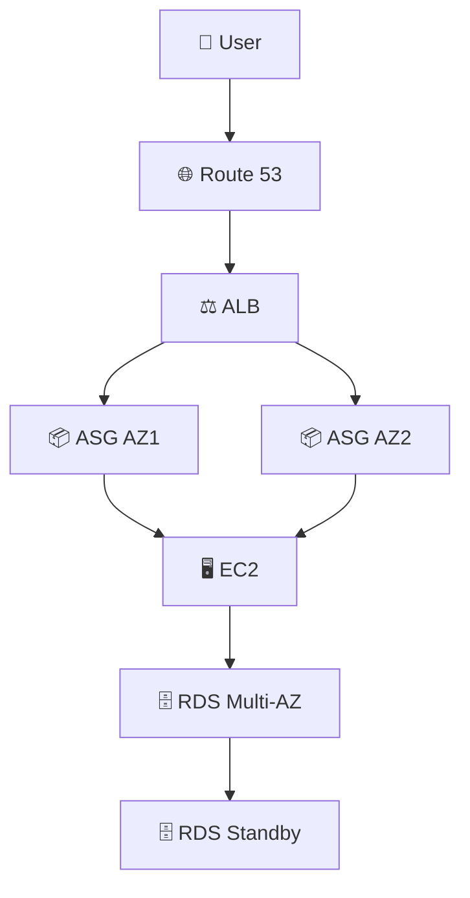

**Key Components:**
- 🎯 **Multi-AZ** deployment
- ⚡ **Auto Scaling** groups
- 🔄 **Load Balancing** with ALB
- 💾 **RDS Multi-AZ** for DB redundancy

### Serverless Architecture
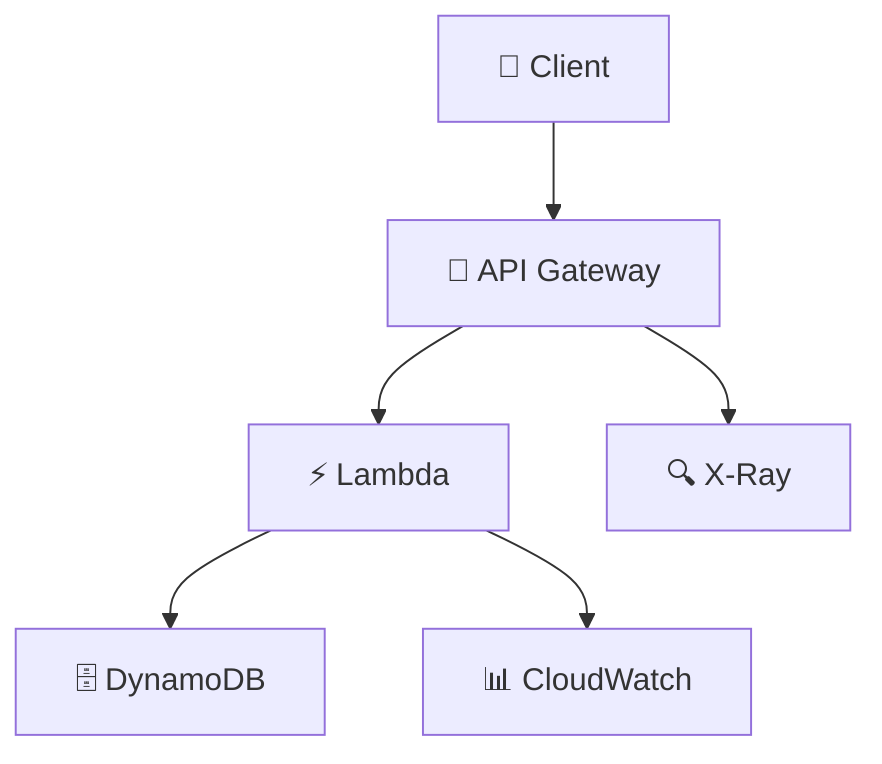

**Benefits:**
- 💰 **Pay-per-use**
- 🚀 **Auto-scaling**
- 🛡️ **Managed infrastructure**
- ⚡ **Cold start mitigation**

---

## 🌐 Multi-Cloud

### Multi-Cloud Strategy
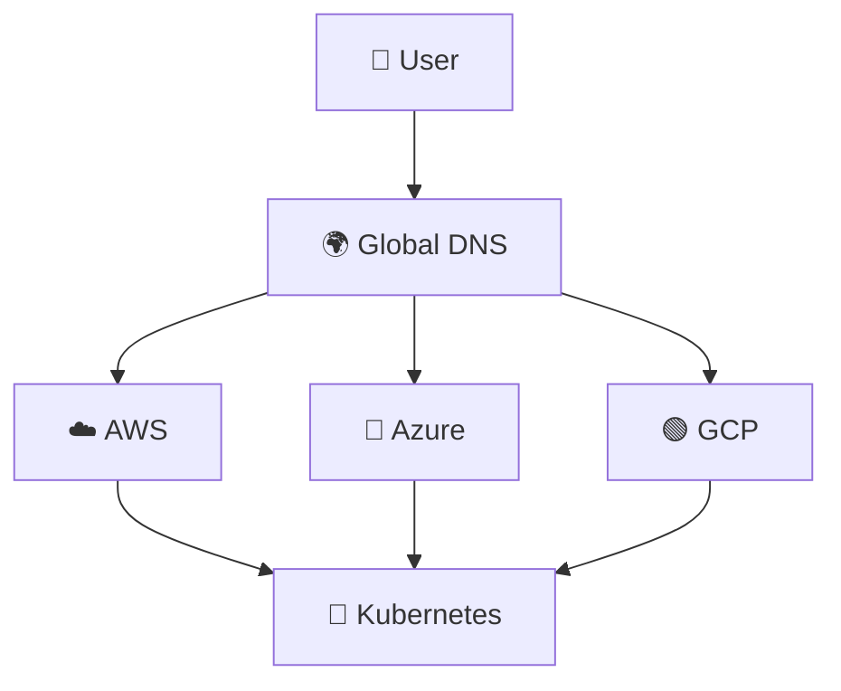

**Tools:**
- 🏗️ **Terraform** for IaC
- 🐳 **Kubernetes** for portability
- 🔄 **DNS failover** for resilience

**Challenges & Solutions:**
| Challenge | Solution |
|-----------|----------|
| 🔒 Vendor lock-in | 🛠️ Open-source tools |
| 💸 Data transfer costs | 📦 Data compression |
| 🌪️ Complexity | 📊 Unified monitoring |

---

## 🛡️ Reliability

### SRE Metrics Overview
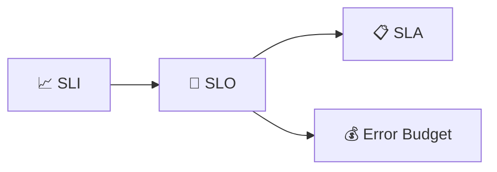

**Key Concepts:**
- 📊 **SLI**: Service Level Indicator (metrics)
- 🎯 **SLO**: Service Level Objective (target)
- 📋 **SLA**: Service Level Agreement (contract)
- 💰 **Error Budget**: Acceptable failure rate

### Incident Response Flow
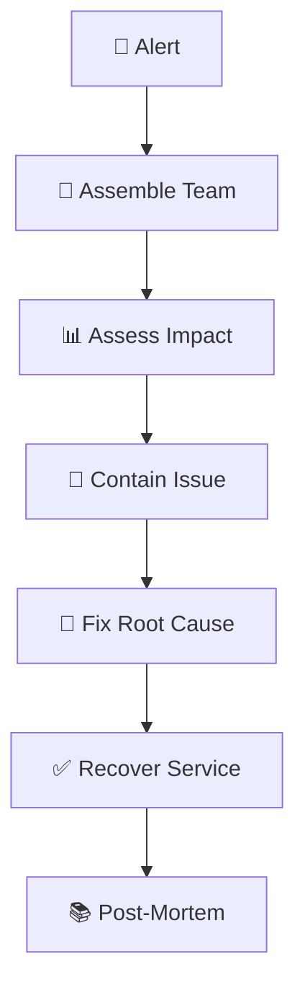

---

## 📈 Scalability

### Scaling Patterns
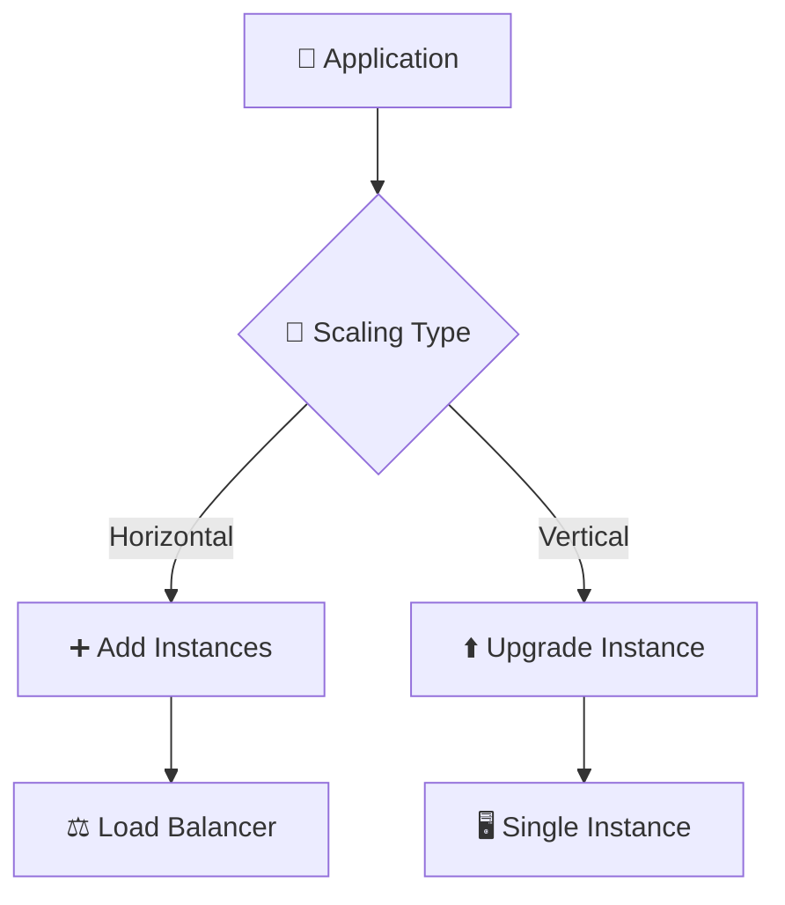

**When to Use:**
- ➕ **Horizontal**: Better fault tolerance, unlimited scale
- ⬆️ **Vertical**: Simpler, no code changes

### Auto-Scaling Setup
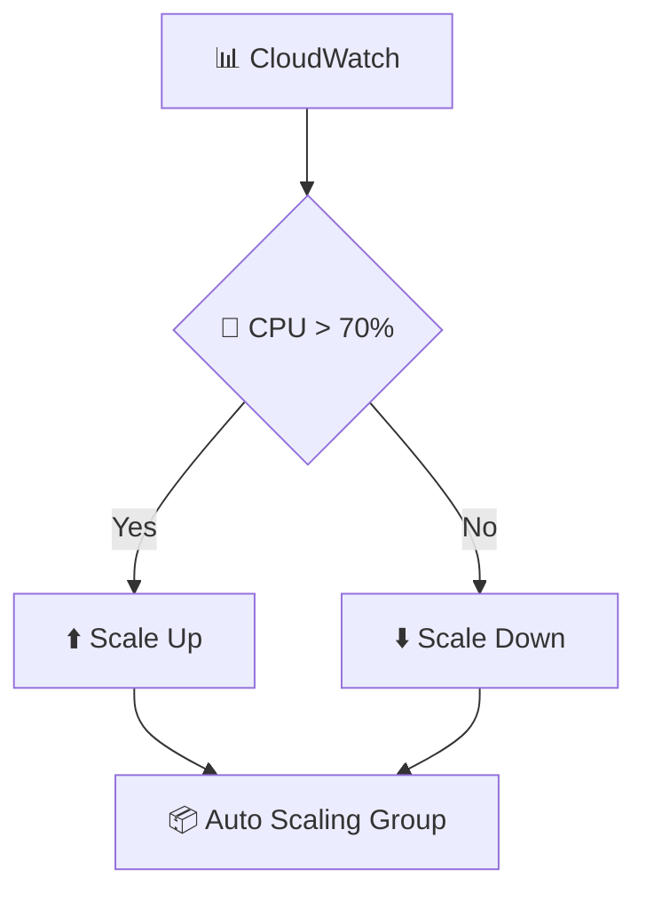

---

## 👁️ Observability

### Three Pillars
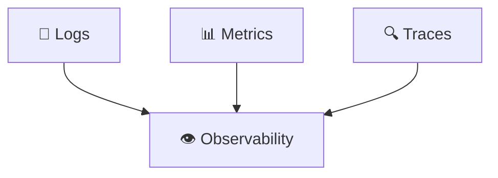

**Implementation:**
- 📝 **Logs**: CloudWatch Logs
- 📊 **Metrics**: CloudWatch, Prometheus
- 🔍 **Traces**: X-Ray, Jaeger

### Monitoring Stack
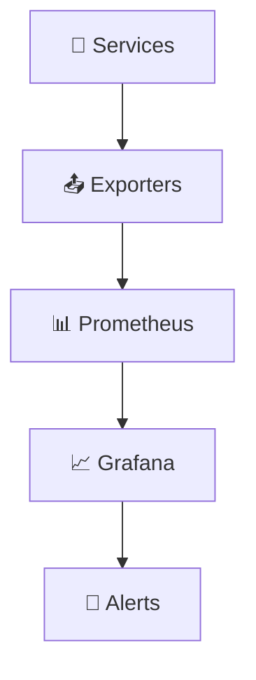

---

## 💰 Cost Optimization

### Cost Reduction Strategies
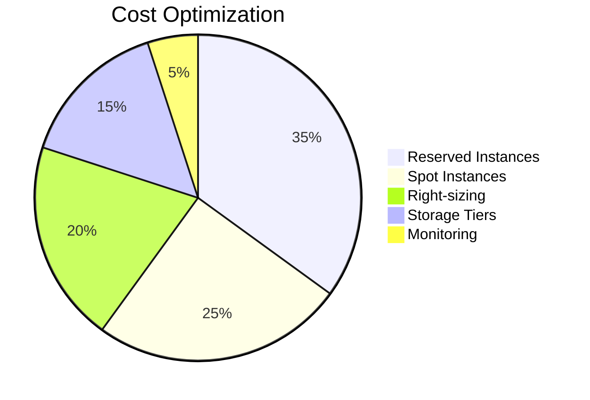

**Key Actions:**
- 🎫 **Reserved Instances**: Up to 75% savings
- ⚡ **Spot Instances**: Up to 90% discount
- 📏 **Right-sizing**: Match resources to demand
- 📦 **Storage Tiers**: S3 lifecycle policies

---

## 🚨 Incident Management

### Incident Response Process
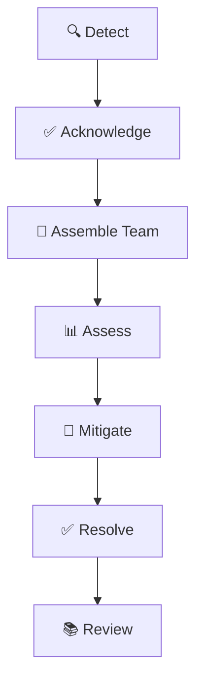

**Key Roles:**
- 🎯 **Incident Commander**: Lead response
- 📊 **Communicator**: Stakeholder updates
- 🔧 **Technical Lead**: Fix implementation
- 📝 **Scribe**: Document timeline

---

## 👥 Leadership

### SRE Team Building
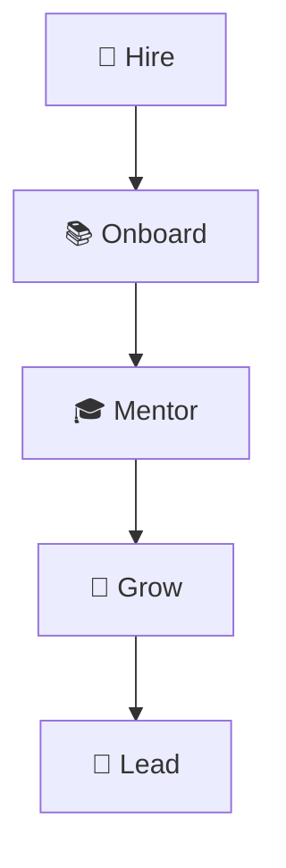

**Leadership Skills:**
- 🎯 **Technical expertise**
- 🗣️ **Communication**
- 🤝 **Collaboration**
- 📚 **Continuous learning**

---

## 🎮 Gaming-Specific Scenarios

### Game Event Scaling
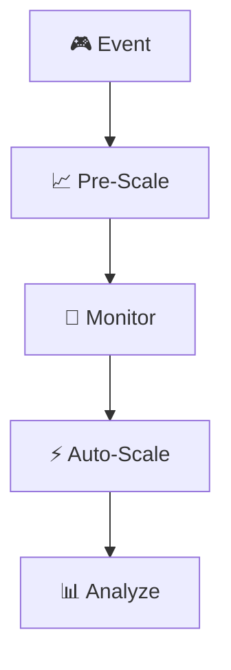

**Key Metrics:**
- 👥 **Player count**
- ⚡ **Latency**
- 🎯 **Success rate**
- 💾 **Resource usage**

---

## 📋 Quick Reference

### AWS Services Cheat Sheet
| Service | Use Case | Key Feature |
|---------|----------|-------------|
| 🖥️ EC2 | Compute | Virtual servers |
| 🗄️ RDS | Database | Managed SQL |
| ⚡ Lambda | Serverless | Event-driven |
| 🌐 CloudFront | CDN | Global distribution |
| 📊 CloudWatch | Monitoring | Metrics & logs |

### SRE Formulas
```
Error Budget = 100% - SLO
Burn Rate = Error Budget Used / Time Elapsed
MTTR = Total Downtime / Number of Incidents
```

---

## 🎯 Interview Tips

### Common Question Types
1. **🏗️ Architecture Design**
2. **🚨 Incident Response**
3. **💰 Cost Optimization**
4. **👥 Leadership Experience**
5. **🔧 Technical Deep Dive**

### STAR Method
- **S**ituation: Context
- **T**ask: Goal
- **A**ction: What you did
- **R**esult: Outcome

---

## 📚 Study Plan

### Week-by-Week Preparation
| Week | Focus | Practice |
|------|-------|----------|
| 1 | AWS Architecture | Design diagrams |
| 2 | Reliability | SLO calculations |
| 3 | Scalability | Auto-scaling configs |
| 4 | Observability | Monitoring setup |
| 5 | Cost Optimization | Budget analysis |
| 6 | Incident Response | Mock scenarios |

---

**🎉 Good luck with your EA SRE 3 interview!**

*Remember: Focus on practical experience and real-world examples.*