# EA SRE 3 Interview Prep - Visual Guide

## 🎯 Quick Navigation
- [AWS Architecture](#-aws-architecture)
- [Load Balancers](#️-load-balancers-deep-dive)
- [Route 53 Failover](#-route-53-failover-configuration)
- [Global Accelerator](#-global-accelerator)
- [Multi-Cloud](#-multi-cloud)
- [Reliability](#-reliability)
- [Scalability](#-scalability)
- [Observability](#-observability)
- [Cost Optimization](#-cost-optimization)
- [Incident Management](#-incident-management)
- [Leadership](#-leadership)

---

## ☁️ AWS Architecture

### High Availability Web App
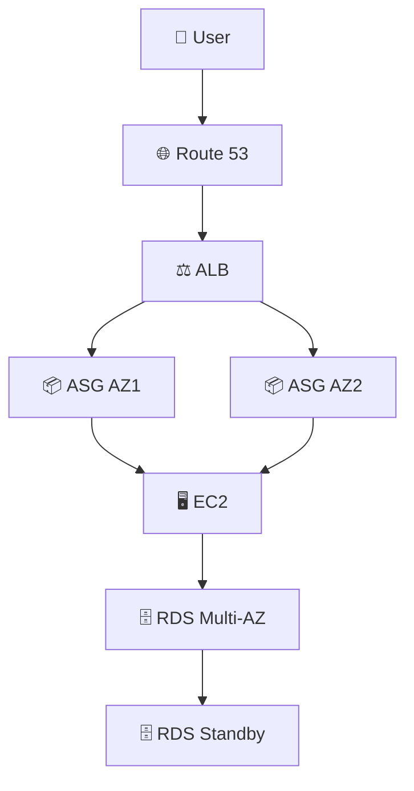
```mermaid
graph TD
    User[👤 User] --> Route53[🌐 Route 53]
    Route53 --> ALB[⚖️ ALB]
    ALB --> ASG1[📦 ASG AZ1]
    ALB --> ASG2[📦 ASG AZ2]
    ASG1 --> EC2[🖥️ EC2]
    ASG2 --> EC2
    EC2 --> RDS[🗄️ RDS Multi-AZ]
    RDS --> RDS_Standby[🗄️ RDS Standby]
```

**Key Components:**
- 🎯 <span style="color: #FF6B6B; font-weight: bold;">Multi-AZ</span> deployment
- ⚡ <span style="color: #4ECDC4; font-weight: bold;">Auto Scaling</span> groups
- 🔄 <span style="color: #45B7D1; font-weight: bold;">Load Balancing</span> with ALB
- 💾 <span style="color: #96CEB4; font-weight: bold;">RDS Multi-AZ</span> for DB redundancy

---

## ⚖️ Load Balancers Deep Dive

### Load Balancer Types
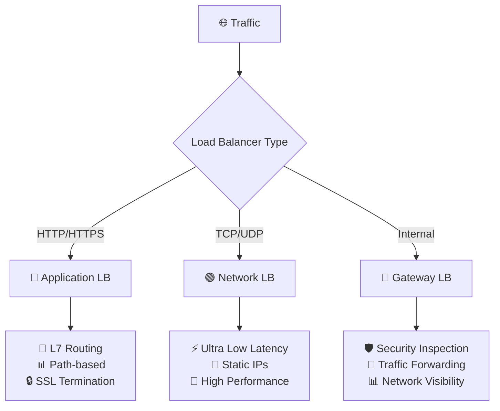
```mermaid
graph TD
    Traffic[🌐 Traffic] --> LB_Type{Load Balancer Type}
    LB_Type -->|HTTP/HTTPS| ALB[🔷 Application LB]
    LB_Type -->|TCP/UDP| NLB[🟢 Network LB]
    LB_Type -->|Internal| GWLB[🔌 Gateway LB]
    
    ALB --> Features1["🎯 L7 Routing<br>📊 Path-based<br>🔒 SSL Termination"]
    NLB --> Features2["⚡ Ultra Low Latency<br>🎯 Static IPs<br>💪 High Performance"]
    GWLB --> Features3["🛡️ Security Inspection<br>🔗 Traffic Forwarding<br>📊 Network Visibility"]
```

### ALB Configuration
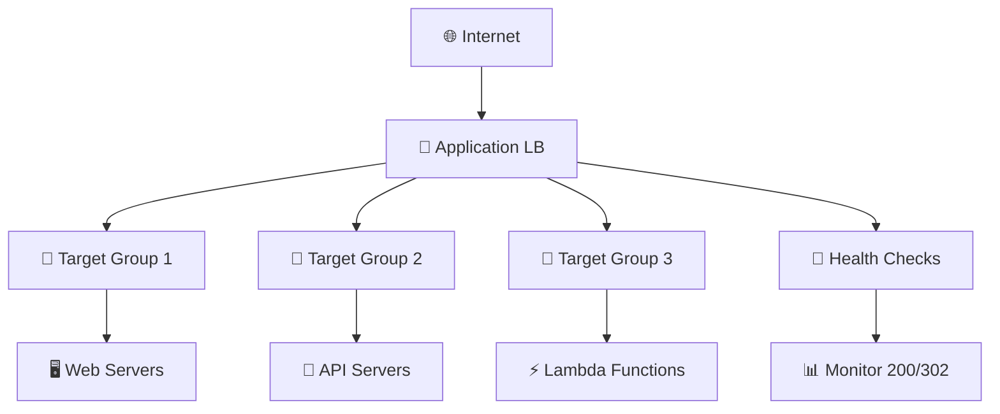
```mermaid
graph TD
    Internet[🌐 Internet] --> ALB[🔷 Application LB]
    ALB --> TG1[🎯 Target Group 1]
    ALB --> TG2[🎯 Target Group 2]
    ALB --> TG3[🎯 Target Group 3]
    
    TG1 --> EC2_Web[🖥️ Web Servers]
    TG2 --> EC2_API[🔧 API Servers]
    TG3 --> Lambda[⚡ Lambda Functions]
    
    ALB --> Health[💚 Health Checks]
    Health --> Monitor[📊 Monitor 200/302]
```

**Key ALB Features:**
- 🎯 <span style="color: #FF6B6B; font-weight: bold;">Path-based routing</span>: `/api/*` → API servers
- 🔄 <span style="color: #4ECDC4; font-weight: bold;">Host-based routing</span>: `api.example.com` → API TG
- ⚖️ <span style="color: #45B7D1; font-weight: bold;">Weighted routing</span>: 90% to v1, 10% to v2
- 💚 <span style="color: #96CEB4; font-weight: bold;">Health checks</span>: HTTP/HTTPS, TCP, custom protocols

### NLB vs ALB Comparison
| Feature | ALB (L7) | NLB (L4) |
|---------|----------|----------|
| 🎯 <span style="color: #FF6B6B; font-weight: bold;">Protocol</span> | HTTP/HTTPS | TCP/UDP |
| ⚡ <span style="color: #4ECDC4; font-weight: bold;">Latency</span> | ~100ms | ~10ms |
| 📊 <span style="color: #45B7D1; font-weight: bold;">Metrics</span> | Rich | Basic |
| 💰 <span style="color: #96CEB4; font-weight: bold;">Cost</span> | Higher | Lower |
| 🎯 <span style="color: #FF6B6B; font-weight: bold;">Use Case</span> | Web apps | Gaming/Streaming |

---

## 🌐 Route 53 Failover Configuration

### Failover Architecture
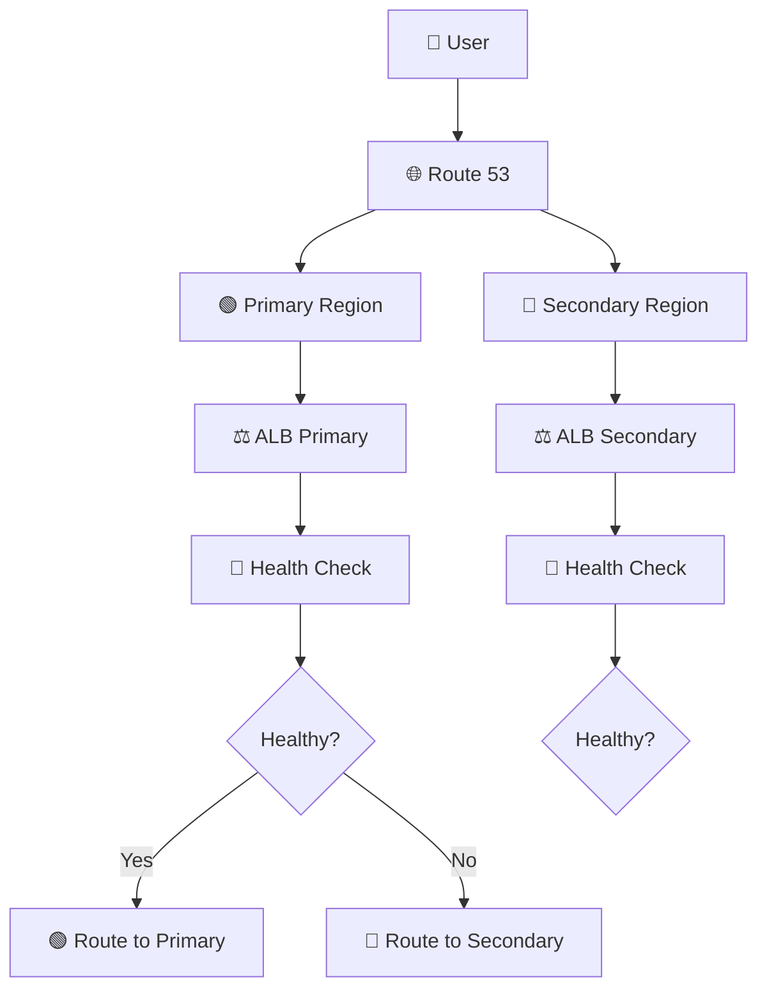
```mermaid
graph TD
    User[👤 User] --> Route53[🌐 Route 53]
    Route53 --> Primary[🟢 Primary Region]
    Route53 --> Secondary[🔴 Secondary Region]
    
    Primary --> ALB_P[⚖️ ALB Primary]
    Secondary --> ALB_S[⚖️ ALB Secondary]
    
    ALB_P --> Health_P[💚 Health Check]
    ALB_S --> Health_S[💚 Health Check]
    
    Health_P --> Status_P{Healthy?}
    Health_S --> Status_S{Healthy?}
    
    Status_P -->|Yes| Route_P[🟢 Route to Primary]
    Status_P -->|No| Route_S[🔴 Route to Secondary]
```

### Route 53 Configuration Steps
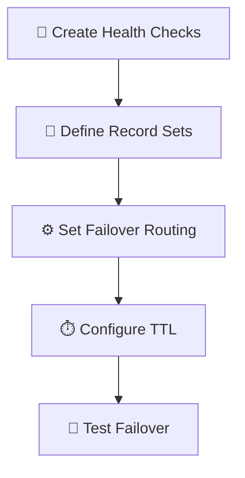
```mermaid
flowchart TD
    Step1[📝 Create Health Checks] --> Step2[🎯 Define Record Sets]
    Step2 --> Step3[⚙️ Set Failover Routing]
    Step3 --> Step4[⏱️ Configure TTL]
    Step4 --> Step5[🧪 Test Failover]
```

**Health Check Configuration:**
- 📡 <span style="color: #FF6B6B; font-weight: bold;">Protocol</span>: HTTP/HTTPS/TCP
- 🎯 <span style="color: #4ECDC4; font-weight: bold;">Endpoint</span>: `/health` or specific port
- ⏱️ <span style="color: #45B7D1; font-weight: bold;">Interval</span>: 10 seconds (fast) or 30 seconds (standard)
- 🔢 <span style="color: #96CEB4; font-weight: bold;">Threshold</span>: 3 failures = unhealthy
- 🌍 <span style="color: #9B59B6; font-weight: bold;">Regions</span>: Check from multiple locations

### Failover Routing Policy
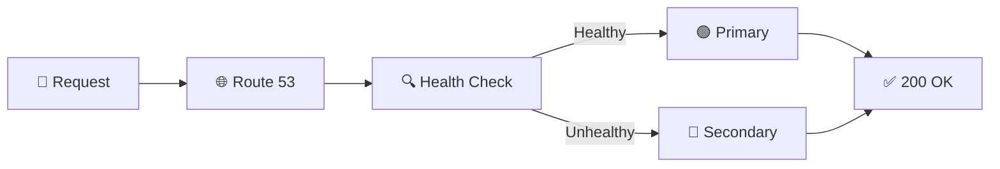
```mermaid
graph LR
    Request[📨 Request] --> DNS[🌐 Route 53]
    DNS --> Check[🔍 Health Check]
    Check -->|Healthy| Primary[🟢 Primary]
    Check -->|Unhealthy| Secondary[🔴 Secondary]
    Primary --> Response[✅ 200 OK]
    Secondary --> Response
```

**Advanced Features:**
- 🎯 <span style="color: #FF6B6B; font-weight: bold;">Geolocation routing</span>: Route based on user location
- ⚖️ <span style="color: #4ECDC4; font-weight: bold;">Latency routing</span>: Route to lowest latency region
- 🔄 <span style="color: #45B7D1; font-weight: bold;">Geoproximity routing</span>: Route with bias for specific region
- 📊 <span style="color: #96CEB4; font-weight: bold;">Weighted routing</span>: Split traffic percentage

---

## 🚀 Global Accelerator

### Global Accelerator vs CloudFront
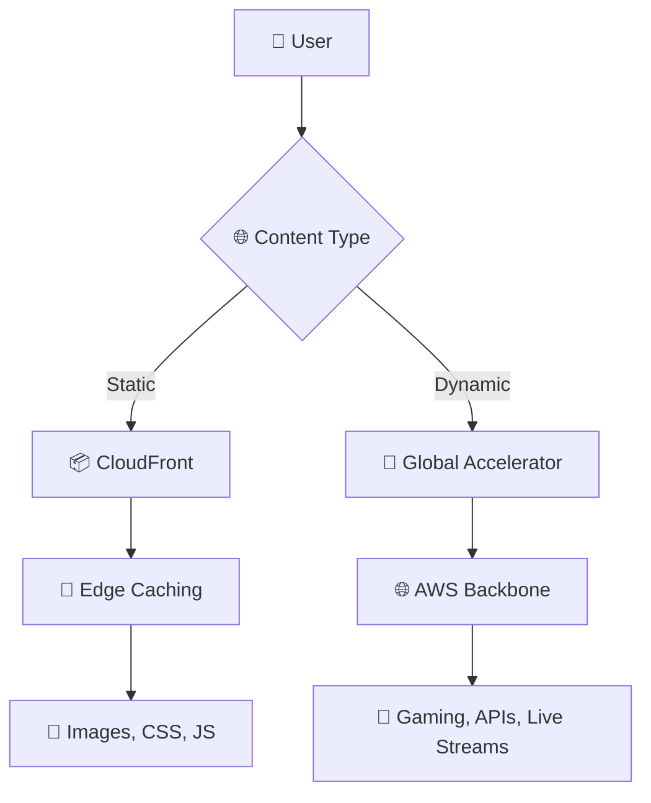
```mermaid
graph TD
    User[👤 User] --> Choice{🌐 Content Type}
    Choice -->|Static| CF[📦 CloudFront]
    Choice -->|Dynamic| GA[🚀 Global Accelerator]
    
    CF --> Cache[💾 Edge Caching]
    GA --> Backbone[🌐 AWS Backbone]
    
    Cache --> Static[📄 Images, CSS, JS]
    Backbone --> Dynamic[🔴 Gaming, APIs, Live Streams]
```

### Global Accelerator Architecture
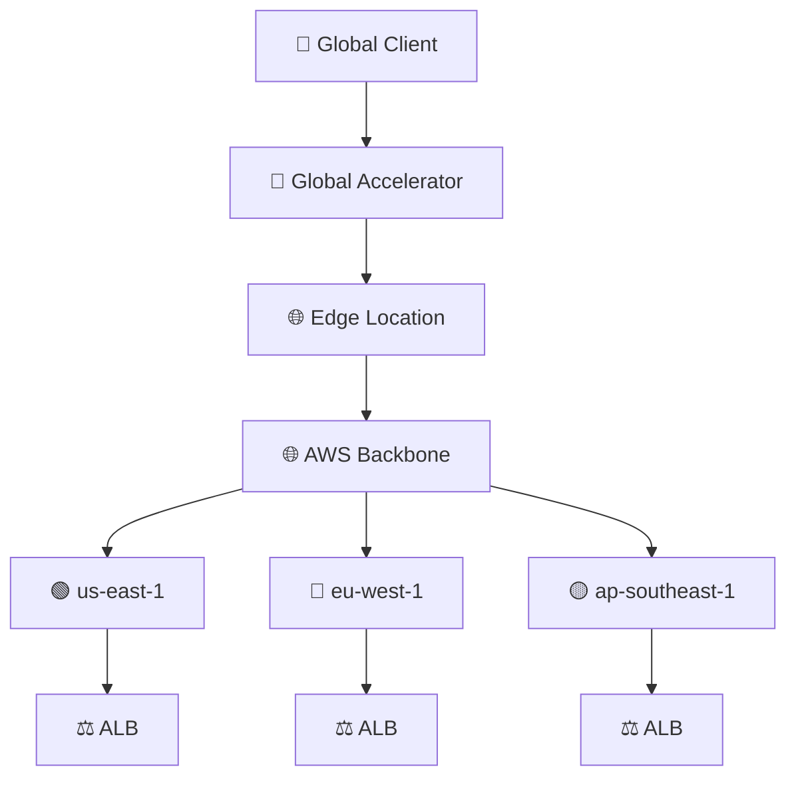
```mermaid
graph TD
    Client[👤 Global Client] --> GA[🚀 Global Accelerator]
    GA --> Edge[🌐 Edge Location]
    Edge --> Backbone[🌐 AWS Backbone]
    Backbone --> Region1[🟢 us-east-1]
    Backbone --> Region2[🔴 eu-west-1]
    Backbone --> Region3[🟡 ap-southeast-1]
    
    Region1 --> ALB1[⚖️ ALB]
    Region2 --> ALB2[⚖️ ALB]
    Region3 --> ALB3[⚖️ ALB]
```

**Key Benefits:**
- ⚡ <span style="color: #FF6B6B; font-weight: bold;">Performance</span>: 30% better latency for dynamic content
- 🛡️ <span style="color: #4ECDC4; font-weight: bold;">Reliability</span>: Automatic failover across regions
- 📊 <span style="color: #45B7D1; font-weight: bold;">Monitoring</span>: Flow logs and health checks
- 🌍 <span style="color: #96CEB4; font-weight: bold;">Global</span>: Fixed IP addresses for any region

### GA Configuration
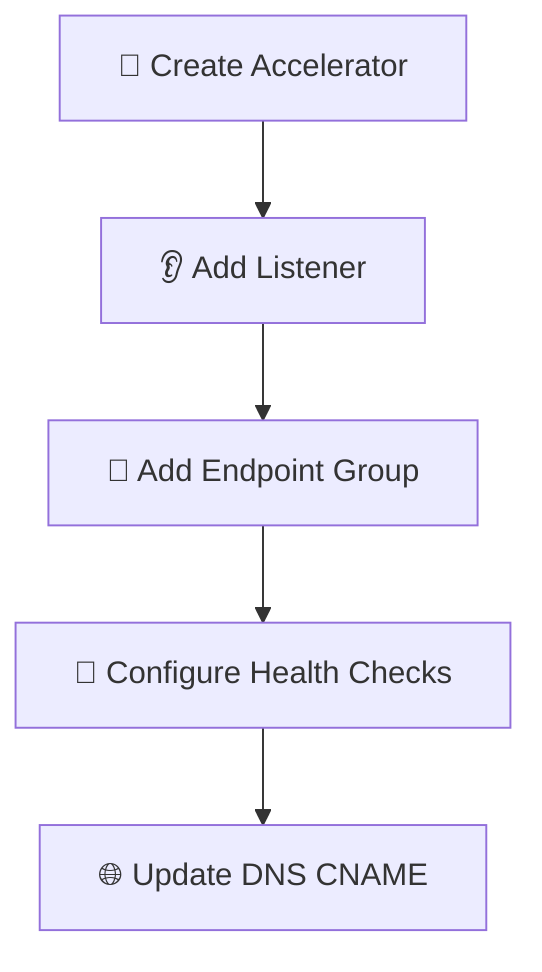
```mermaid
flowchart TD
    Create[📝 Create Accelerator] --> Listener[👂 Add Listener]
    Listener --> Endpoint[🎯 Add Endpoint Group]
    Endpoint --> Health[💚 Configure Health Checks]
    Health --> DNS[🌐 Update DNS CNAME]
```

**Endpoint Group Settings:**
- 🎯 <span style="color: #FF6B6B; font-weight: bold;">Traffic Dials</span>: Control traffic percentage
- 🌍 <span style="color: #4ECDC4; font-weight: bold;">Regions</span>: Multiple endpoint groups
- 💚 <span style="color: #45B7D1; font-weight: bold;">Health Checks</span>: TCP/HTTP protocols
- ⚖️ <span style="color: #96CEB4; font-weight: bold;">Weights</span>: Distribute traffic across regions

---

## 🎮 Gaming Load Balancing Scenarios

### Multi-Region Game Architecture
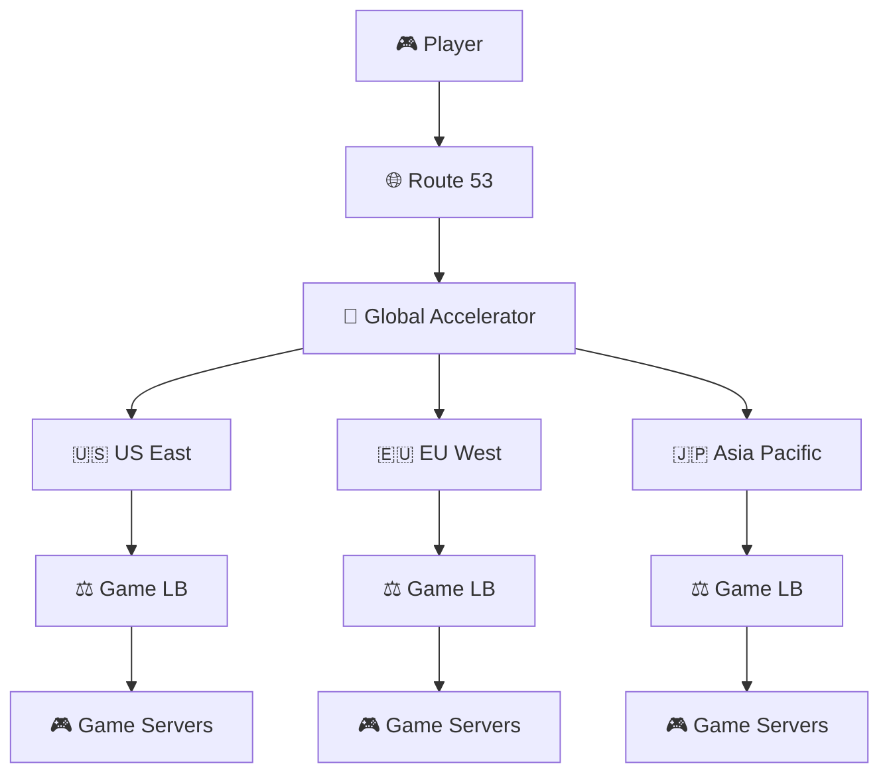
```mermaid
graph TD
    Player[🎮 Player] --> Route53[🌐 Route 53]
    Route53 --> GA[🚀 Global Accelerator]
    GA --> Region_US[🇺🇸 US East]
    GA --> Region_EU[🇪🇺 EU West]
    GA --> Region_ASIA[🇯🇵 Asia Pacific]
    
    Region_US --> ALB_US[⚖️ Game LB]
    Region_EU --> ALB_EU[⚖️ Game LB]
    Region_ASIA --> ALB_ASIA[⚖️ Game LB]
    
    ALB_US --> GameServers_US[🎮 Game Servers]
    ALB_EU --> GameServers_EU[🎮 Game Servers]
    ALB_ASIA --> GameServers_ASIA[🎮 Game Servers]
```

### Real-time Load Balancing for Gaming
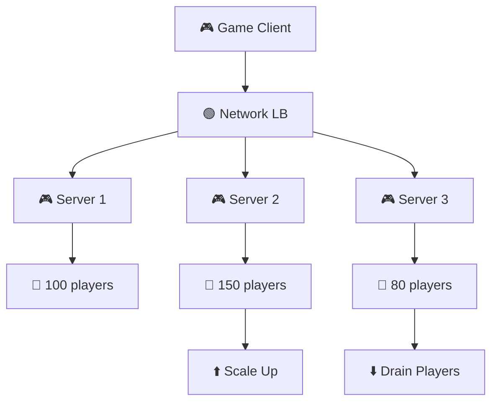
```mermaid
graph TD
    GameClient[🎮 Game Client] --> NLB[🟢 Network LB]
    NLB --> GameServer1[🎮 Server 1]
    NLB --> GameServer2[🎮 Server 2]
    NLB --> GameServer3[🎮 Server 3]
    
    GameServer1 --> PlayerCount1[👥 100 players]
    GameServer2 --> PlayerCount2[👥 150 players]
    GameServer3 --> PlayerCount3[👥 80 players]
    
    PlayerCount2 --> Scale[⬆️ Scale Up]
    PlayerCount3 --> Drain[⬇️ Drain Players]
```

**Gaming-Specific Optimizations:**
- ⚡ <span style="color: #FF6B6B; font-weight: bold;">UDP Protocol</span>: For real-time gaming
- 🎯 <span style="color: #4ECDC4; font-weight: bold;">Sticky Sessions</span>: Keep players on same server
- 📊 <span style="color: #45B7D1; font-weight: bold;">Player Metrics</span>: Track server load by player count
- 🔄 <span style="color: #96CEB4; font-weight: bold;">Seamless Migration</span>: Move players without disconnect

---

## 📋 Load Balancer Interview Questions

### Essential Questions
1. **🎯 When would you use ALB vs NLB?**
   - ALB: <span style="color: #FF6B6B; font-weight: bold;">HTTP/HTTPS</span>, <span style="color: #4ECDC4; font-weight: bold;">path-based routing</span>, <span style="color: #45B7D1; font-weight: bold;">SSL termination</span>
   - NLB: <span style="color: #96CEB4; font-weight: bold;">TCP/UDP</span>, <span style="color: #9B59B6; font-weight: bold;">ultra-low latency</span>, <span style="color: #E67E22; font-weight: bold;">static IPs</span>

2. **🌐 How does Route 53 failover work?**
   - <span style="color: #FF6B6B; font-weight: bold;">Health checks</span> monitor endpoints
   - <span style="color: #4ECDC4; font-weight: bold;">DNS routing</span> changes based on health
   - <span style="color: #45B7D1; font-weight: bold;">TTL</span> affects failover speed

3. **🚀 What's the difference between Global Accelerator and CloudFront?**
   - GA: <span style="color: #FF6B6B; font-weight: bold;">Dynamic content</span>, <span style="color: #4ECDC4; font-weight: bold;">AWS backbone</span>, <span style="color: #45B7D1; font-weight: bold;">fixed IPs</span>
   - CF: <span style="color: #96CEB4; font-weight: bold;">Static content</span>, <span style="color: #9B59B6; font-weight: bold;">edge caching</span>, <span style="color: #E67E22; font-weight: bold;">CDN</span>

4. **⚖️ How do you configure sticky sessions?**
   - <span style="color: #FF6B6B; font-weight: bold;">Enable</span> on target group
   - <span style="color: #4ECDC4; font-weight: bold;">Duration-based cookies</span>
   - Use for <span style="color: #45B7D1; font-weight: bold;">stateful applications</span>

5. **🛡️ How do load balancers handle DDoS?**
   - <span style="color: #FF6B6B; font-weight: bold;">AWS Shield</span> integration
   - <span style="color: #4ECDC4; font-weight: bold;">Rate-based rules</span>
   - <span style="color: #45B7D1; font-weight: bold;">Auto-scaling</span> to absorb traffic

### Advanced Scenarios
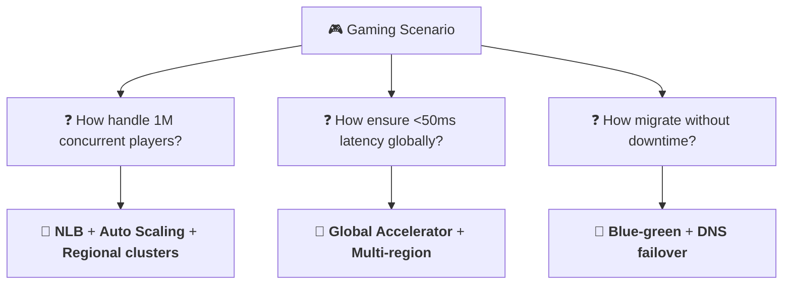
```mermaid
graph TD
    Scenario[🎮 Gaming Scenario] --> Q1["❓ How handle 1M concurrent players?"]
    Scenario --> Q2["❓ How ensure <50ms latency globally?"]
    Scenario --> Q3["❓ How migrate without downtime?"]
    
    Q1 --> A1["🎯 <span style='color: #FF6B6B; font-weight: bold;'>NLB</span> + <span style='color: #4ECDC4; font-weight: bold;'>Auto Scaling</span> + <span style='color: #45B7D1; font-weight: bold;'>Regional clusters</span>"]
    Q2 --> A2["🚀 <span style='color: #FF6B6B; font-weight: bold;'>Global Accelerator</span> + <span style='color: #4ECDC4; font-weight: bold;'>Multi-region</span>"]
    Q3 --> A3["🔄 <span style='color: #FF6B6B; font-weight: bold;'>Blue-green</span> + <span style='color: #4ECDC4; font-weight: bold;'>DNS failover</span>"]
```

### Serverless Architecture
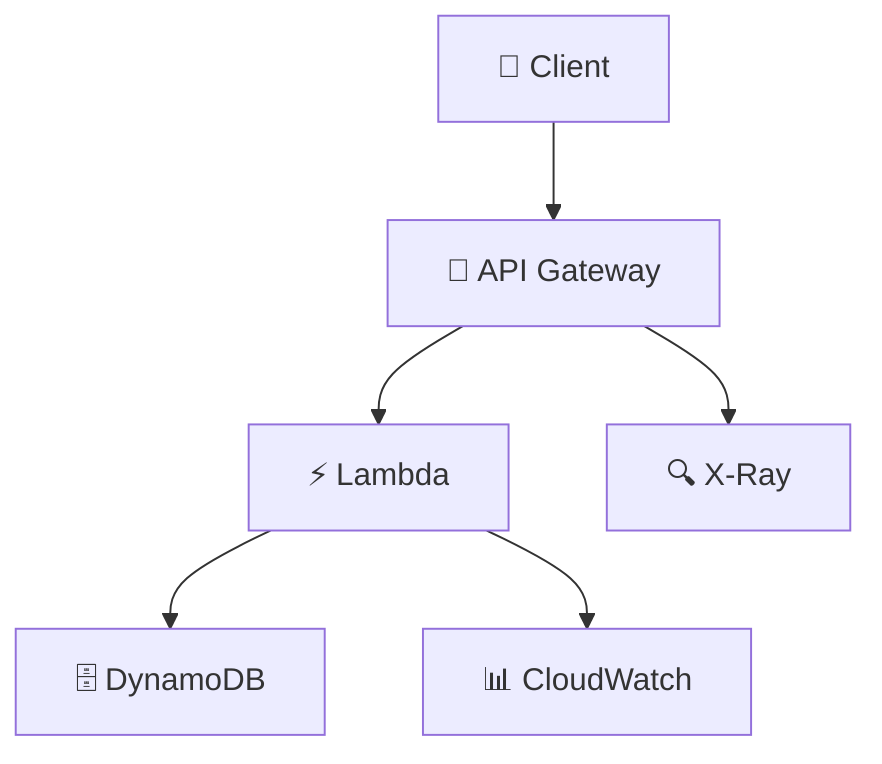
```mermaid
graph TD
    Client[📱 Client] --> API[🚪 API Gateway]
    API --> Lambda[⚡ Lambda]
    Lambda --> DB[🗄️ DynamoDB]
    Lambda --> Logs[📊 CloudWatch]
    API --> Trace[🔍 X-Ray]
```

**Benefits:**
- 💰 **Pay-per-use**
- 🚀 **Auto-scaling**
- 🛡️ **Managed infrastructure**
- ⚡ **Cold start mitigation**

---

## 🌐 Multi-Cloud

### Multi-Cloud Strategy
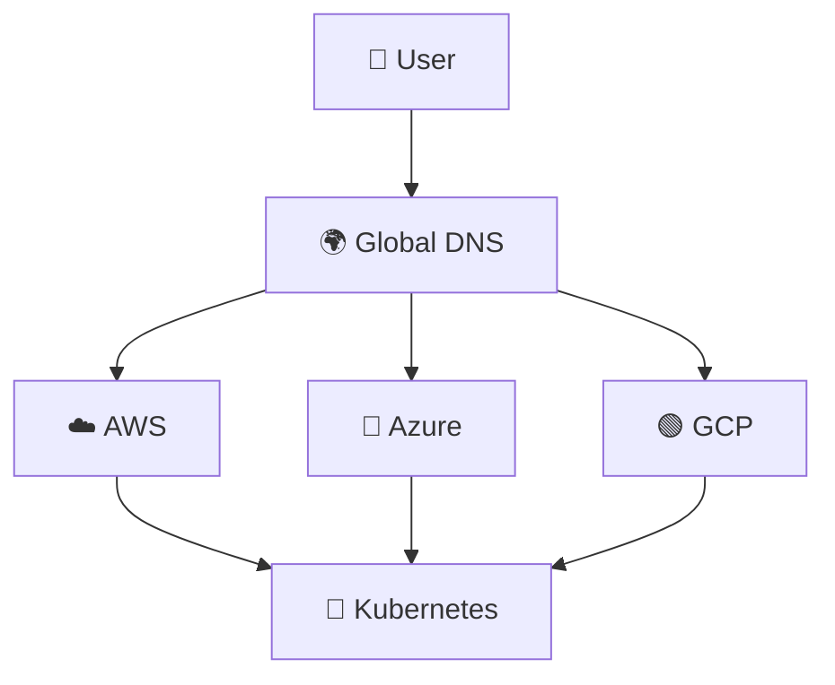
```mermaid
graph TD
    User[👤 User] --> DNS[🌍 Global DNS]
    DNS --> AWS[☁️ AWS]
    DNS --> Azure[🔷 Azure]
    DNS --> GCP[🟢 GCP]
    AWS --> K8s[🐳 Kubernetes]
    Azure --> K8s
    GCP --> K8s
```

**Tools:**
- 🏗️ **Terraform** for IaC
- 🐳 **Kubernetes** for portability
- 🔄 **DNS failover** for resilience

**Challenges & Solutions:**
| Challenge | Solution |
|-----------|----------|
| 🔒 Vendor lock-in | 🛠️ Open-source tools |
| 💸 Data transfer costs | 📦 Data compression |
| 🌪️ Complexity | 📊 Unified monitoring |

---

## 🛡️ Reliability

### SRE Metrics Overview
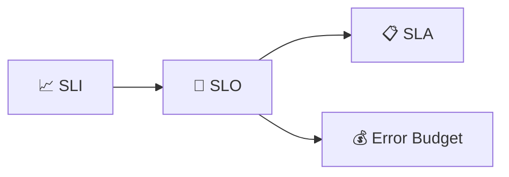
```mermaid
graph LR
    SLI[📈 SLI] --> SLO[🎯 SLO]
    SLO --> SLA[📋 SLA]
    SLO --> Budget[💰 Error Budget]
```

**Key Concepts:**
- 📊 <span style="color: #FF6B6B; font-weight: bold;">SLI</span>: Service Level Indicator (metrics)
- 🎯 <span style="color: #4ECDC4; font-weight: bold;">SLO</span>: Service Level Objective (target)
- 📋 <span style="color: #45B7D1; font-weight: bold;">SLA</span>: Service Level Agreement (contract)
- 💰 <span style="color: #96CEB4; font-weight: bold;">Error Budget</span>: Acceptable failure rate

### Incident Response Flow
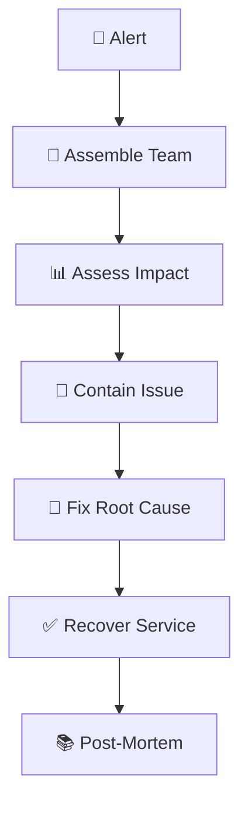
```mermaid
flowchart TD
    Alert[🚨 Alert] --> Team[👥 Assemble Team]
    Team --> Assess[📊 Assess Impact]
    Assess --> Contain[🔧 Contain Issue]
    Contain --> Fix[🔨 Fix Root Cause]
    Fix --> Recover[✅ Recover Service]
    Recover --> Learn[📚 Post-Mortem]
```

---

## 📈 Scalability

### Scaling Patterns
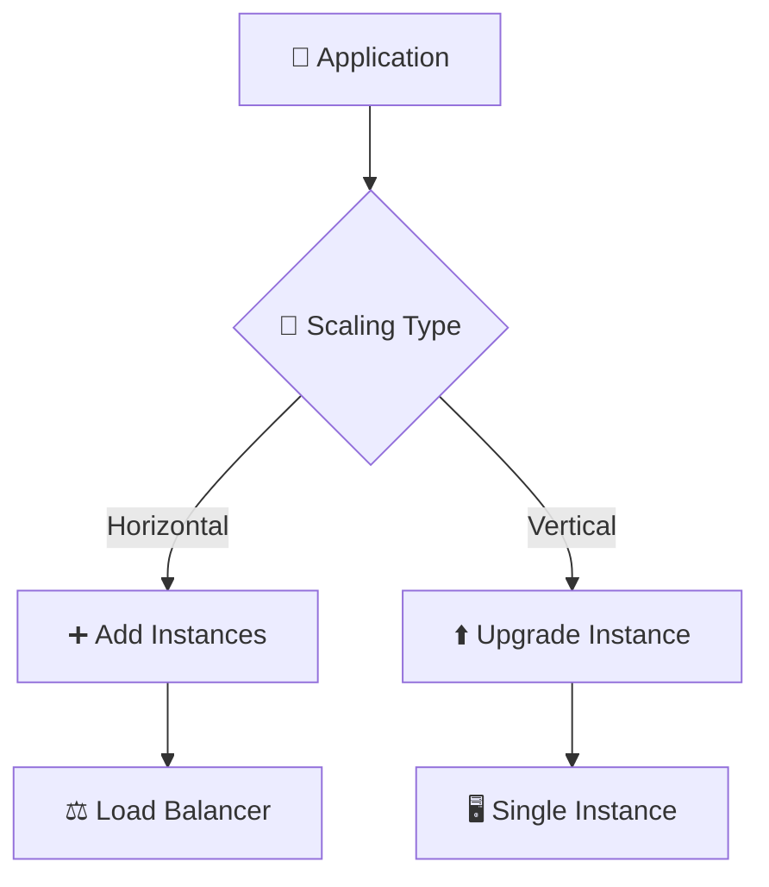
```mermaid
graph TD
    App[📱 Application] --> Choice{🔄 Scaling Type}
    Choice -->|Horizontal| HScale[➕ Add Instances]
    Choice -->|Vertical| VScale[⬆️ Upgrade Instance]
    HScale --> LB[⚖️ Load Balancer]
    VScale --> Single[🖥️ Single Instance]
```

**When to Use:**
- ➕ **Horizontal**: Better fault tolerance, unlimited scale
- ⬆️ **Vertical**: Simpler, no code changes

### Auto-Scaling Setup
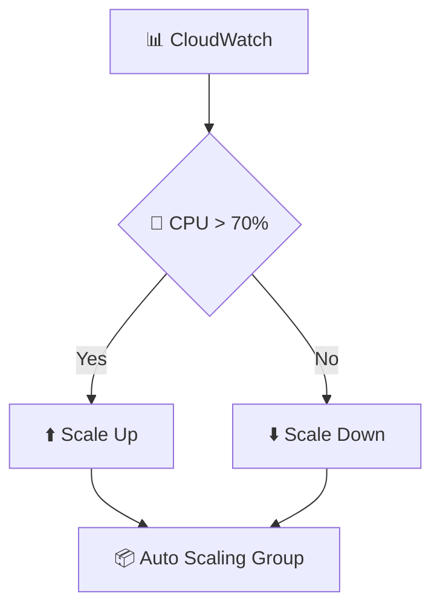
```mermaid
graph TD
    Monitor[📊 CloudWatch] --> Threshold{🎯 CPU > 70%}
    Threshold -->|Yes| ScaleUp[⬆️ Scale Up]
    Threshold -->|No| ScaleDown[⬇️ Scale Down]
    ScaleUp --> ASG[📦 Auto Scaling Group]
    ScaleDown --> ASG
```

---

## 👁️ Observability

### Three Pillars
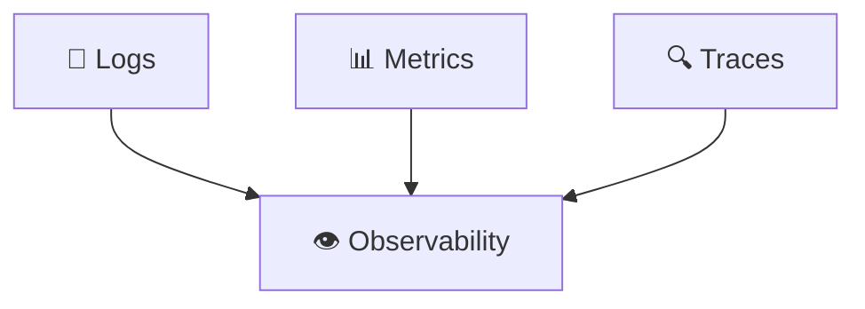
```mermaid
graph TD
    Logs[📝 Logs] --> Observability[👁️ Observability]
    Metrics[📊 Metrics] --> Observability
    Traces[🔍 Traces] --> Observability
```

**Implementation:**
- 📝 **Logs**: CloudWatch Logs
- 📊 **Metrics**: CloudWatch, Prometheus
- 🔍 **Traces**: X-Ray, Jaeger

### Monitoring Stack
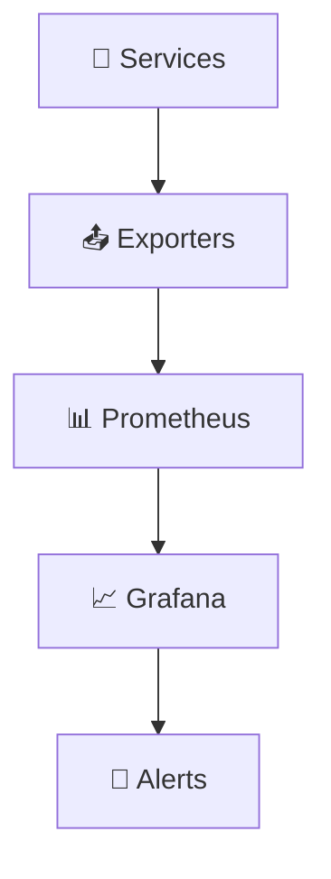
```mermaid
graph TD
    Services[🔧 Services] --> Exporters[📤 Exporters]
    Exporters --> Prometheus[📊 Prometheus]
    Prometheus --> Grafana[📈 Grafana]
    Grafana --> Alerts[🚨 Alerts]
```

---

## 💰 Cost Optimization

### Cost Reduction Strategies
```mermaid
pie title Cost Optimization
    "Reserved Instances" : 35
    "Spot Instances" : 25
    "Right-sizing" : 20
    "Storage Tiers" : 15
    "Monitoring" : 5
```

**Key Actions:**
- 🎫 **Reserved Instances**: Up to 75% savings
- ⚡ **Spot Instances**: Up to 90% discount
- 📏 **Right-sizing**: Match resources to demand
- 📦 **Storage Tiers**: S3 lifecycle policies

---

## 🚨 Incident Management

### Incident Response Process
```mermaid
flowchart TD
    Detect[🔍 Detect] --> Ack[✅ Acknowledge]
    Ack --> Assemble[👥 Assemble Team]
    Assemble --> Assess[📊 Assess]
    Assess --> Mitigate[🔧 Mitigate]
    Mitigate --> Resolve[✅ Resolve]
    Resolve --> Review[📚 Review]
```

**Key Roles:**
- 🎯 <span style="color: #FF6B6B; font-weight: bold;">Incident Commander</span>: Lead response
- 📊 <span style="color: #4ECDC4; font-weight: bold;">Communicator</span>: Stakeholder updates
- 🔧 <span style="color: #45B7D1; font-weight: bold;">Technical Lead</span>: Fix implementation
- 📝 <span style="color: #96CEB4; font-weight: bold;">Scribe</span>: Document timeline

---

## 👥 Leadership

### SRE Team Building
```mermaid
graph TD
    Hire[👤 Hire] --> Onboard[📚 Onboard]
    Onboard --> Mentor[🎓 Mentor]
    Mentor --> Grow[🌱 Grow]
    Grow --> Lead[👑 Lead]
```

**Leadership Skills:**
- 🎯 <span style="color: #FF6B6B; font-weight: bold;">Technical expertise</span>
- 🗣️ <span style="color: #4ECDC4; font-weight: bold;">Communication</span>
- 🤝 <span style="color: #45B7D1; font-weight: bold;">Collaboration</span>
- 📚 <span style="color: #96CEB4; font-weight: bold;">Continuous learning</span>

---

## 🎮 Gaming-Specific Scenarios

### Game Event Scaling
```mermaid
graph TD
    Event[🎮 Event] --> PreScale[📈 Pre-Scale]
    PreScale --> Monitor[👀 Monitor]
    Monitor --> Scale[⚡ Auto-Scale]
    Scale --> PostEvent[📊 Analyze]
```

**Key Metrics:**
- 👥 <span style="color: #FF6B6B; font-weight: bold;">Player count</span>
- ⚡ <span style="color: #4ECDC4; font-weight: bold;">Latency</span>
- 🎯 <span style="color: #45B7D1; font-weight: bold;">Success rate</span>
- 💾 <span style="color: #96CEB4; font-weight: bold;">Resource usage</span>

---

## 🌀 Chaos Engineering

### Chaos Engineering Workflow
```mermaid
flowchart TD
    Hypothesis[🎯 Define Hypothesis] --> Design[🔧 Design Experiment]
    Design --> Inject[💉 Inject Failure]
    Inject --> Monitor[📊 Monitor Impact]
    Monitor --> Analyze[🔍 Analyze Results]
    Analyze --> Improve[🚀 Improve System]
```

### 108. Implementing Chaos Engineering in Microservices
```mermaid
graph TD
    FIS[🌀 AWS FIS] --> EKS[🐳 EKS Cluster]
    EKS --> Pod[📦 Pod Termination]
    Pod --> Service[🔧 Microservice]
    Service --> Monitor[📊 Monitor Recovery]
    
    AppMesh[🔗 App Mesh] --> Traffic[🚦 Traffic Manipulation]
    Traffic --> Circuit[⚡ Circuit Breaker]
    Circuit --> Resilience[🛡️ Resilience Test]
```

**Key Components:**
- 🌀 <span style="color: #FF6B6B; font-weight: bold;">FIS</span>: Fault Injection Simulator
- 🐳 <span style="color: #4ECDC4; font-weight: bold;">EKS</span>: Kubernetes pod failures
- 🔗 <span style="color: #45B7D1; font-weight: bold;">App Mesh</span>: Service mesh traffic control
- 📊 <span style="color: #96CEB4; font-weight: bold;">Blast Radius</span>: Impact measurement

### 109. Chaos Engineering in CI/CD
```mermaid
flowchart TD
    Deploy[🚀 Deploy] --> Chaos[🌀 Chaos Test]
    Chaos --> SLO[📊 SLO Check]
    SLO -->|Pass| Production[✅ Production]
    SLO -->|Fail| Rollback[🔄 Rollback]
    
    Pipeline[🔄 CI/CD Pipeline] --> Automated[🤖 Automated Chaos]
    Automated --> Canary[🐤 Canary Testing]
    Canary --> Validate[✅ Validate]
```

**Integration Points:**
- 🤖 <span style="color: #FF6B6B; font-weight: bold;">Automated Experiments</span>: Post-deployment chaos
- 📊 <span style="color: #4ECDC4; font-weight: bold;">SLO Gates</span>: Quality thresholds
- 🐤 <span style="color: #45B7D1; font-weight: bold;">Canary Testing</span>: Safe production testing

---

## 📊 Monitoring & Observability

### 110. Monitoring Stack: Prometheus, Grafana, Loki
```mermaid
graph TD
    Services[🔧 AWS Services] --> Exporters[📤 Exporters]
    Exporters --> Prometheus[📊 Prometheus]
    Prometheus --> Grafana[📈 Grafana]
    Logs[📝 Application Logs] --> Loki[🗂️ Loki]
    Loki --> Grafana
    Prometheus --> Alertmanager[🚨 Alertmanager]
    Alertmanager --> PagerDuty[📱 PagerDuty]
```

**Stack Components:**
- 📊 <span style="color: #FF6B6B; font-weight: bold;">Prometheus</span>: Metrics collection
- 📈 <span style="color: #4ECDC4; font-weight: bold;">Grafana</span>: Visualization
- 🗂️ <span style="color: #45B7D1; font-weight: bold;">Loki</span>: Log aggregation
- 📤 <span style="color: #96CEB4; font-weight: bold;">Exporters</span>: AWS service metrics

### 111. Grafana Dashboard Building
```mermaid
graph TD
    DataSources[📊 Data Sources] --> CloudWatch[☁️ CloudWatch]
    DataSources --> Prometheus[📈 Prometheus]
    
    Dashboard[📈 Dashboard] --> Panels[📊 Panels]
    Panels --> Metrics[📊 Latency/Error Rate]
    Panels --> Resources[💻 CPU/Memory]
    Panels --> Business[💰 Business KPIs]
    
    Variables[🔧 Variables] --> Dynamic[🔄 Dynamic Filtering]
    Dynamic --> Region[🌍 Region Filter]
    Dynamic --> Service[🔧 Service Filter]
```

**Dashboard Features:**
- 📊 <span style="color: #FF6B6B; font-weight: bold;">Custom Panels</span>: Latency, error rates
- 🔧 <span style="color: #4ECDC4; font-weight: bold;">Variables</span>: Dynamic filtering
- 🌍 <span style="color: #45B7D1; font-weight: bold;">Multi-Region</span>: Global view

### 112. Prometheus Alerting for Gaming
```mermaid
graph TD
    GameMetrics[🎮 Game Metrics] --> PlayerCount[👥 Player Count]
    GameMetrics --> SessionErrors[❌ Session Errors]
    GameMetrics --> Latency[⚡ Latency]
    
    AlertRules[📜 Alert Rules] --> Thresholds[🎯 Thresholds]
    Thresholds --> Alertmanager[🚨 Alertmanager]
    
    Alertmanager --> Routing[🔀 Routing Rules]
    Routing --> Slack[💬 Slack]
    Routing --> PagerDuty[📱 PagerDuty]
    Routing --> Email[📧 Email]
```

**Gaming-Specific Alerts:**
- 👥 <span style="color: #FF6B6B; font-weight: bold;">Player Count</span>: Sudden drops
- ❌ <span style="color: #4ECDC4; font-weight: bold;">Session Errors</span>: Authentication failures
- ⚡ <span style="color: #45B7D1; font-weight: bold;">Latency</span>: Performance degradation

---

## 🏗️ Infrastructure as Code

### 113. Terraform AWS Provisioning
```mermaid
graph TD
    Code[📝 Terraform Code] --> Plan[📋 terraform plan]
    Plan --> Apply[🚀 terraform apply]
    Apply --> AWS[☁️ AWS Resources]
    AWS --> State[🗄️ State File]
    State --> Lock[🔒 State Lock]
    
    Modules[📦 Modules] --> Reusable[♻️ Reusable Components]
    Reusable --> VPC[🌐 VPC Module]
    Reusable --> Security[🛡️ Security Module]
```

**Terraform Components:**
- 📝 <span style="color: #FF6B6B; font-weight: bold;">Configuration</span>: Infrastructure as code
- 📋 <span style="color: #4ECDC4; font-weight: bold;">Plan/Apply</span>: Safe deployment
- 🗄️ <span style="color: #45B7D1; font-weight: bold;">State Management</span>: Resource tracking
- 📦 <span style="color: #96CEB4; font-weight: bold;">Modules</span>: Reusable components

### 114. Terraform State Management
```mermaid
graph TD
    Team[👥 Team] --> S3[📦 S3 Bucket]
    S3 --> State[🗄️ State Files]
    State --> DynamoDB[⚡ DynamoDB Lock]
    
    Workspaces[🏢 Workspaces] --> Dev[🧪 Development]
    Workspaces --> Staging[🚧 Staging]
    Workspaces --> Prod[🚀 Production]
    
    IAM[🔐 IAM] --> Permissions[📋 Access Control]
    Permissions --> Audit[📊 Audit Trail]
```

**State Management:**
- 📦 <span style="color: #FF6B6B; font-weight: bold;">S3 Backend</span>: Remote state storage
- ⚡ <span style="color: #4ECDC4; font-weight: bold;">DynamoDB Lock</span>: Prevent conflicts
- 🏢 <span style="color: #45B7D1; font-weight: bold;">Workspaces</span>: Environment separation
- 🔐 <span style="color: #96CEB4; font-weight: bold;">IAM Controls</span>: Secure access

### 115. Multi-Region IaC
```mermaid
graph TD
    Config[⚙️ Terraform Config] --> Provider[☁️ AWS Provider]
    Provider --> Aliases[🏷️ Provider Aliases]
    
    Aliases --> US_East[🇺🇸 us-east-1]
    Aliases --> EU_West[🇪🇺 eu-west-1]
    Aliases --> AP_South[🇮🇳 ap-south-1]
    
    Variables[🔧 Variables] --> Region[🌍 Region Specific]
    Variables --> Resources[📦 Resource Config]
```

**Multi-Region Strategy:**
- 🏷️ <span style="color: #FF6B6B; font-weight: bold;">Provider Aliases</span>: Multiple regions
- 🔧 <span style="color: #4ECDC4; font-weight: bold;">Parameterization</span>: Dynamic values
- 🌍 <span style="color: #45B7D1; font-weight: bold;">Replication</span>: Cross-region state

### 116. CloudFormation Serverless
```mermaid
graph TD
    Template[📄 YAML/JSON Template] --> Lambda[⚡ Lambda Functions]
    Template --> API[🚪 API Gateway]
    Template --> DynamoDB[🗄️ DynamoDB]
    
    Nested[📦 Nested Stacks] --> Modular[🧩 Modular Design]
    Modular --> Reuse[♻️ Reusable Components]
    
    Pipeline[🔄 CodePipeline] --> Deploy[🚀 Automated Deploy]
    Deploy --> ChangeSets[👀 Change Sets]
```

**Serverless IaC:**
- 📄 <span style="color: #FF6B6B; font-weight: bold;">Declarative</span>: YAML/JSON templates
- 📦 <span style="color: #4ECDC4; font-weight: bold;">Nested Stacks</span>: Modularity
- 🔄 <span style="color: #45B7D1; font-weight: bold;">CI/CD Integration</span>: Automated deployment

---

## 🌐 Networking & Security

### 117. VPC High Availability Design
```mermaid
graph TD
    VPC[🌐 VPC] --> Public1[🌍 Public AZ1]
    VPC --> Public2[🌍 Public AZ2]
    VPC --> Private1[🔒 Private AZ1]
    VPC --> Private2[🔒 Private AZ2]
    
    Public1 --> IGW[🌐 Internet Gateway]
    Public2 --> IGW
    Private1 --> NAT[🚪 NAT Gateway]
    Private2 --> NAT
    
    Private1 --> RDS[🗄️ RDS Primary]
    Private2 --> RDS_Standby[🗄️ RDS Standby]
```

**HA Components:**
- 🌐 <span style="color: #FF6B6B; font-weight: bold;">Multi-AZ</span>: Availability zones
- 🚪 <span style="color: #4ECDC4; font-weight: bold;">NAT Gateway</span>: Outbound access
- 🗄️ <span style="color: #45B7D1; font-weight: bold;">RDS Multi-AZ</span>: Database redundancy

### 118. Global Gaming Network Optimization
```mermaid
graph TD
    Players[🎮 Global Players] --> CloudFront[📦 CloudFront]
    CloudFront --> LambdaEdge[⚡ Lambda@Edge]
    
    Traffic[🌐 TCP/UDP Traffic] --> GlobalAccel[🚀 Global Accelerator]
    GlobalAccel --> Backbone[🌐 AWS Backbone]
    Backbone --> Regions[🌍 Regional Endpoints]
    
    Monitoring[📊 VPC Flow Logs] --> Optimization[🔧 Performance Tuning]
```

**Optimization Tools:**
- 📦 <span style="color: #FF6B6B; font-weight: bold;">CloudFront</span>: Edge caching
- ⚡ <span style="color: #4ECDC4; font-weight: bold;">Lambda@Edge</span>: Edge computing
- 🚀 <span style="color: #45B7D1; font-weight: bold;">Global Accelerator</span>: TCP/UDP optimization

### 119. Network Security
```mermaid
graph TD
    Security[🛡️ Security Layers] --> SG[🔥 Security Groups]
    Security --> NACL[🚦 Network ACLs]
    Security --> FlowLogs[📊 Flow Logs]
    
    SG[🔥 Security Groups] --> Rules[📋 Stateful Rules]
    NACL[🚦 NACLs] --> Stateless[📋 Stateless Rules]
    FlowLogs[📊 Flow Logs] --> Monitoring[🔍 Traffic Monitoring]
```

**Security Components:**
- 🔥 <span style="color: #FF6B6B; font-weight: bold;">Security Groups</span>: Instance-level firewall
- 🚦 <span style="color: #4ECDC4; font-weight: bold;">Network ACLs</span>: Subnet-level control
- 📊 <span style="color: #45B7D1; font-weight: bold;">Flow Logs</span>: Traffic visibility

### 120. DDoS Protection
```mermaid
graph TD
    Attack[🚨 DDoS Attack] --> Shield[🛡️ AWS Shield]
    Shield --> WAF[🔥 Web Application Firewall]
    WAF --> RateLimit[🚦 Rate Limiting]
    
    AutoScaling[📈 Auto Scaling] --> Absorb[💪 Absorb Traffic]
    Absorb --> Mitigate[⚡ Mitigation]
    
    Monitoring[📊 Monitoring] --> Alert[🚨 Alerting]
```

**Protection Layers:**
- 🛡️ <span style="color: #FF6B6B; font-weight: bold;">AWS Shield</span>: Automatic protection
- 🔥 <span style="color: #4ECDC4; font-weight: bold;">WAF</span>: Application filtering
- 📈 <span style="color: #45B7D1; font-weight: bold;">Auto Scaling</span>: Traffic absorption

---

## 📈 Auto-Scaling & Gaming

### 121. Gaming Auto-Scaling
```mermaid
graph TD
    Players[🎮 Player Spikes] --> Metrics[📊 Player Count Metrics]
    Metrics --> TargetTracking[🎯 Target Tracking]
    TargetTracking --> ScaleOut[📈 Scale Out]
    TargetTracking --> ScaleIn[📉 Scale In]
    
    Predictive[🔮 Predictive Scaling] --> Events[🎮 Known Events]
    Events --> PreScale[📈 Pre-Scaling]
    
    Cooldown[⏱️ Cooldown Period] --> Stability[🛡️ Stability]
```

**Scaling Strategies:**
- 🎯 <span style="color: #FF6B6B; font-weight: bold;">Target Tracking</span>: Player-based scaling
- 🔮 <span style="color: #4ECDC4; font-weight: bold;">Predictive</span>: Event preparation
- ⏱️ <span style="color: #45B7D1; font-weight: bold;">Cooldown</span>: Prevent thrashing

### 122. Player Experience Monitoring
```mermaid
graph TD
    Player[🎮 Player] --> Metrics[📊 Experience Metrics]
    Metrics --> Session[⏱️ Session Duration]
    Metrics --> Errors[❌ Error Rates]
    Metrics --> Latency[⚡ Latency]
    
    RUM[📱 Real User Monitoring] --> CloudWatch[☁️ CloudWatch RUM]
    CloudWatch --> Dashboards[📈 Dashboards]
    Dashboards --> SLO[🎯 SLO Tracking]
```

**Experience Metrics:**
- ⏱️ <span style="color: #FF6B6B; font-weight: bold;">Session Duration</span>: Engagement
- ❌ <span style="color: #4ECDC4; font-weight: bold;">Error Rates</span>: Reliability
- ⚡ <span style="color: #45B7D1; font-weight: bold;">Latency</span>: Performance

### 123. Database Failover for Gaming
```mermaid
graph TD
    Primary[🗄️ Primary DB] --> Replicas[📚 Read Replicas]
    Primary --> Standby[🛡️ Standby DB]
    
    Failover[🔄 Failover] --> Automatic[⚡ Automatic]
    Automatic --> Monitor[📊 Performance Insights]
    
    Players[🎮 Players] --> Continuous[🔄 Continuous Gameplay]
```

**Database Reliability:**
- 📚 <span style="color: #FF6B6B; font-weight: bold;">Read Replicas</span>: Scale reads
- 🛡️ <span style="color: #4ECDC4; font-weight: bold;">Multi-AZ</span>: Automatic failover
- 📊 <span style="color: #45B7D1; font-weight: bold;">Performance Insights</span>: Monitoring

### 124. Gaming Leaderboards
```mermaid
graph TD
    Players[🎮 Players] --> Scores[🏆 Score Updates]
    Scores --> DynamoDB[🗄️ DynamoDB]
    DynamoDB --> GlobalTables[🌍 Global Tables]
    
    Cache[💾 ElastiCache] --> Reads[📖 Fast Reads]
    Reads --> Leaderboard[📊 Leaderboard Display]
    
    Security[🔐 Security] --> IAM[🔐 IAM Policies]
    IAM --> Encryption[🔒 Encryption]
```

**Leaderboard Architecture:**
- 🌍 <span style="color: #FF6B6B; font-weight: bold;">Global Tables</span>: Multi-region
- 💾 <span style="color: #4ECDC4; font-weight: bold;">ElastiCache</span>: Performance
- 🔐 <span style="color: #45B7D1; font-weight: bold;">Security</span>: Data protection

### 125. In-Game Purchases
```mermaid
graph TD
    Purchase[💳 Purchase] --> API[🚪 API Gateway]
    API --> Lambda[⚡ Lambda Processing]
    Lambda --> Payment[💳 Payment Provider]
    
    Webhooks[🪝 Webhooks] --> Validation[✅ Validation]
    Validation --> Fulfillment[🎁 Item Fulfillment]
    
    Audit[📊 CloudTrail] --> Compliance[🔒 Compliance]
```

**Purchase Flow:**
- 🚪 <span style="color: #FF6B6B; font-weight: bold;">API Gateway</span>: Secure endpoints
- ⚡ <span style="color: #4ECDC4; font-weight: bold;">Lambda</span>: Serverless processing
- 🪝 <span style="color: #45B7D1; font-weight: bold;">Webhooks</span>: Payment confirmation

### 126. Multiplayer Gaming
```mermaid
graph TD
    Players[🎮 Players] --> Matchmaking[🎯 Matchmaking]
    Matchmaking --> GameLift[🎮 GameLift]
    GameLift --> Servers[🖥️ Game Servers]
    
    Backend[🔧 Backend] --> Lambda[⚡ Lambda Functions]
    Lambda --> Events[📊 Game Events]
    
    Monitoring[📊 CloudWatch] --> Metrics[📈 Player Metrics]
```

**Multiplayer Architecture:**
- 🎯 <span style="color: #FF6B6B; font-weight: bold;">Matchmaking</span>: Player pairing
- 🎮 <span style="color: #4ECDC4; font-weight: bold;">GameLift</span>: Server management
- 📊 <span style="color: #45B7D1; font-weight: bold;">Monitoring</span>: Performance tracking

---

## 🚨 Incident Management Deep Dive

### 127. Incident Response Process
```mermaid
flowchart TD
    Alert[🚨 Alert Received] --> Acknowledge[✅ Acknowledge]
    Acknowledge --> Assemble[👥 Assemble Team]
    Assemble --> Assess[📊 Assess Impact]
    Assess --> Mitigate[🔧 Mitigate]
    Mitigate --> Communicate[📢 Communicate]
    Communicate --> Resolve[✅ Resolve]
    Resolve --> PostMortem[📚 Post-Mortem]
```

### 128. Alert Fatigue Prevention
```mermaid
graph TD
    Alerts[🚨 Many Alerts] --> Aggregate[📊 Aggregation]
    Aggregate --> Prioritize[🎯 Prioritization]
    Prioritize --> Silence[🔕 Silencing]
    Silence --> Review[📋 Weekly Review]
    
    Thresholds[🎯 Tuned Thresholds] --> Noise[🔇 Noise Reduction]
    Noise --> Quality[📈 Alert Quality]
```

**Fatigue Solutions:**
- 📊 <span style="color: #FF6B6B; font-weight: bold;">Aggregation</span>: Group similar alerts
- 🎯 <span style="color: #4ECDC4; font-weight: bold;">Prioritization</span>: Critical first
- 🔕 <span style="color: #45B7D1; font-weight: bold;">Silencing</span>: Maintenance windows

### 129. Blameless Post-Mortem
```mermaid
graph TD
    Incident[🚨 Incident] --> Facts[📊 Facts Collection]
    Facts --> Timeline[⏰ Timeline]
    Timeline --> RootCause[🔍 Root Cause]
    RootCause --> Actions[📋 Action Items]
    Actions --> Learning[📚 Learning]
    
    Culture[🤝 Blameless Culture] --> Trust[🤝 Trust Building]
    Trust --> Improvement[🚀 Continuous Improvement]
```

**Post-Mortem Elements:**
- 📊 <span style="color: #FF6B6B; font-weight: bold;">Facts</span>: Objective analysis
- 🔍 <span style="color: #4ECDC4; font-weight: bold;">Root Cause</span>: Deep analysis
- 📋 <span style="color: #45B7D1; font-weight: bold;">Action Items</span>: Preventive measures

---

## 👥 Leadership & Culture

### 130. High-Performing SRE Team
```mermaid
graph TD
    Hire[👤 Hiring] --> Culture[🤝 Culture Fit]
    Culture --> Growth[🌱 Growth Opportunities]
    Growth --> Collaboration[🤝 Collaboration]
    Collaboration --> OKRs[🎯 OKRs]
    OKRs --> Feedback[📝 Regular Feedback]
```

**Team Building:**
- 🤝 <span style="color: #FF6B6B; font-weight: bold;">Culture Fit</span>: Shared values
- 🌱 <span style="color: #4ECDC4; font-weight: bold;">Growth</span>: Skill development
- 🎯 <span style="color: #45B7D1; font-weight: bold;">OKRs</span>: Goal alignment

### 131. Influencing Without Authority
```mermaid
graph TD
    Trust[🤝 Build Trust] --> Data[📊 Provide Data]
    Data --> Collaboration[🤝 Collaboration]
    Collaboration --> Goals[🎯 Shared Goals]
    Goals --> Persuasion[💡 Persuasion]
```

**Influence Strategies:**
- 🤝 <span style="color: #FF6B6B; font-weight: bold;">Trust Building</span>: Credibility
- 📊 <span style="color: #4ECDC4; font-weight: bold;">Data-Driven</span>: Evidence-based
- 🎯 <span style="color: #45B7D1; font-weight: bold">Shared Goals</span>: Common objectives

### 132. Team Conflict Resolution
```mermaid
graph TD
    Conflict[⚔️ Conflict] --> Mediate[🗣️ Mediation]
    Mediate --> Facts[📊 Focus on Facts]
    Facts --> Solutions[💡 Solutions]
    Solutions --> WinWin[🤝 Win-Win]
```

**Resolution Approach:**
- 🗣️ <span style="color: #FF6B6B; font-weight: bold;">Mediation</span>: Facilitated discussion
- 📊 <span style="color: #4ECDC4; font-weight: bold;">Facts</span>: Objective focus
- 🤝 <span style="color: #45B7D1; font-weight: bold;">Win-Win</span>: Mutual benefit

---

## 🔐 Security Integration

### 133. Zero Trust Architecture
```mermaid
graph TD
    User[👤 User] --> MFA[🔐 MFA Verification]
    Access[🔑 Access Request] --> Policy[⚖️ Policy Engine]
    Policy --> Allow[✅ Allow]
    Policy --> Deny[❌ Deny]
    Allow --> Resource[🖥️ Resource]
    Resource --> Monitor[👁️ Monitoring]
```

**Zero Trust Principles:**
- 🔐 <span style="color: #FF6B6B; font-weight: bold;">MFA</span>: Multi-factor authentication
- ⚖️ <span style="color: #4ECDC4; font-weight: bold;">Policy Engine</span>: Context-based access
- 👁️ <span style="color: #45B7D1; font-weight: bold;">Monitoring</span>: Continuous verification

### 134. Compliance in Cloud
```mermaid
graph TD
    Frameworks[📋 Frameworks] --> SOC2[SOC 2]
    Frameworks --> PCI[PCI DSS]
    Frameworks --> GDPR[GDPR]
    
    Automation[🤖 Automation] --> Config[☁️ AWS Config]
    Config --> Rules[📋 Compliance Rules]
    Rules --> Alerts[🚨 Compliance Alerts]
```

**Compliance Management:**
- 📋 <span style="color: #FF6B6B; font-weight: bold;">Frameworks</span>: Industry standards
- 🤖 <span style="color: #4ECDC4; font-weight: bold;">Automation</span>: Continuous monitoring
- 📋 <span style="color: #45B7D1; font-weight: bold;">Rules</span>: Policy enforcement

### 135. Secrets Management
```mermaid
graph TD
    Secrets[🔒 Secrets] --> Manager[🗝️ Secrets Manager]
    Manager --> Rotation[🔄 Rotation]
    Rotation --> Audit[📊 Audit Access]
    
    Vault[🗝️ Vault] --> Dynamic[⚡ Dynamic Secrets]
    Dynamic --> ShortLived[⏱️ Short-Lived]
```

**Secrets Best Practices:**
- 🗝️ <span style="color: #FF6B6B; font-weight: bold;">Secrets Manager</span>: Centralized storage
- 🔄 <span style="color: #4ECDC4; font-weight: bold;">Rotation</span>: Automatic updates
- ⚡ <span style="color: #45B7D1; font-weight: bold;">Dynamic Secrets</span>: Ephemeral access

---

## 🌍 Networking Expertise

### 136. Network Troubleshooting
```mermaid
flowchart TD
    Issue[🔍 Network Issue] --> FlowLogs[📊 VPC Flow Logs]
    FlowLogs --> Analyzer[🔍 Reachability Analyzer]
    Analyzer --> Packet[📦 Packet Capture]
    Packet --> Security[🔥 Security Groups]
    Security --> Routes[🗺️ Route Tables]
    Routes --> NACL[🚦 NACLs]
```

**Troubleshooting Tools:**
- 📊 <span style="color: #FF6B6B; font-weight: bold;">Flow Logs</span>: Traffic visibility
- 🔍 <span style="color: #4ECDC4; font-weight: bold;">Reachability Analyzer</span>: Path analysis
- 📦 <span style="color: #45B7D1; font-weight: bold;">Packet Capture</span>: Deep inspection

### 137. Load Balancing Strategies
```mermaid
graph TD
    Traffic[🌐 Traffic] --> L4[🔷 Layer 4 - TCP]
    Traffic --> L7[🔶 Layer 7 - HTTP]
    
    L4 --> Performance[⚡ Performance]
    L7 --> Features[🎯 Features]
    
    Sticky[🔒 Sticky Sessions] --> Stateful[🗃️ Stateful Apps]
    Health[💚 Health Checks] --> Reliability[🛡️ Reliability]
```

**Balancing Options:**
- 🔷 <span style="color: #FF6B6B; font-weight: bold;">Layer 4</span>: TCP/UDP routing
- 🔶 <span style="color: #4ECDC4; font-weight: bold;">Layer 7</span>: HTTP/HTTPS features
- 🔒 <span style="color: #45B7D1; font-weight: bold;">Sticky Sessions</span>: State preservation

### 138. Network Security
```mermaid
graph TD
    Security[🛡️ Security] --> VPC[🌐 VPC Isolation]
    VPC --> TLS[🔒 TLS Encryption]
    TLS --> WAF[🔥 WAF Filtering]
    WAF --> Shield[🛡️ DDoS Protection]
```

**Security Layers:**
- 🌐 <span style="color: #FF6B6B; font-weight: bold;">VPC</span>: Network isolation
- 🔒 <span style="color: #4ECDC4; font-weight: bold;">TLS</span>: Encryption in transit
- 🔥 <span style="color: #45B7D1; font-weight: bold;">WAF</span>: Application protection

---

## 🤖 Automation & IaC

### 139. Infrastructure Version Control
```mermaid
graph TD
    Code[📝 IaC Code] --> Git[🔄 Git Repository]
    Git --> Review[👀 Peer Review]
    Review --> Pipeline[🔄 CI/CD Pipeline]
    Pipeline --> Deploy[🚀 Deploy]
    Deploy --> Monitor[📊 Monitor]
```

**Version Control:**
- 📝 <span style="color: #FF6B6B; font-weight: bold;">IaC Code</span>: Infrastructure as code
- 👀 <span style="color: #4ECDC4; font-weight: bold;">Peer Review</span>: Quality assurance
- 🔄 <span style="color: #45B7D1; font-weight: bold;">CI/CD</span>: Automated deployment

### 140. IaC CI/CD Pipeline
```mermaid
flowchart TD
    Commit[📝 Commit Code] --> Lint[🔍 Lint]
    Lint --> Test[🧪 Test]
    Test --> Plan[📋 Plan]
    Plan --> Staging[🚧 Staging Deploy]
    Staging --> Production[🚀 Production]
    Production --> Monitor[📊 Monitor]
```

**Pipeline Stages:**
- 🔍 <span style="color: #FF6B6B; font-weight: bold;">Lint</span>: Code quality
- 🧪 <span style="color: #4ECDC4; font-weight: bold;">Test</span>: Validation
- 📋 <span style="color: #45B7D1; font-weight: bold;">Plan</span>: Change preview

### 141. IaC Drift Management
```mermaid
graph TD
    State[🗄️ State File] --> Reality[🌐 Actual Infrastructure]
    Reality --> Drift[🔍 Drift Detection]
    Drift --> Reconcile[🔧 Reconcile]
    Reconcile --> Prevent[🚫 Prevent Manual Changes]
```

**Drift Handling:**
- 🔍 <span style="color: #FF6B6B; font-weight: bold;">Detection</span>: Identify differences
- 🔧 <span style="color: #4ECDC4; font-weight: bold;">Reconcile</span>: Fix differences
- 🚫 <span style="color: #45B7D1; font-weight: bold;">Prevention</span>: Stop manual changes

---

## ⚡ Performance Tuning

### 142. Application Performance Optimization
```mermaid
flowchart TD
    Identify[🔍 Identify Bottleneck] --> Profile[📊 Profile Code]
    Profile --> Database[🗄️ Database Queries]
    Database --> Cache[💾 Caching]
    Cache --> Optimize[⚡ Optimize Code]
    Optimize --> Test[🧪 Test Performance]
```

**Optimization Steps:**
- 🔍 <span style="color: #FF6B6B; font-weight: bold;">Identify</span>: Find bottlenecks
- 📊 <span style="color: #4ECDC4; font-weight: bold;">Profile</span>: Analyze performance
- 💾 <span style="color: #45B7D1; font-weight: bold;">Cache</span>: Improve speed

### 143. Database Performance
```mermaid
graph TD
    Queries[📊 Slow Queries] --> Index[📑 Indexing]
    Index --> Partition[🗂️ Partitioning]
    Partition --> Monitor[📊 Monitor]
    Monitor --> Optimize[⚡ Optimize]
```

**Database Tuning:**
- 📑 <span style="color: #FF6B6B; font-weight: bold;">Indexing</span>: Query optimization
- 🗂️ <span style="color: #4ECDC4; font-weight: bold;">Partitioning</span>: Data organization
- 📊 <span style="color: #45B7D1; font-weight: bold;">Monitor</span>: Continuous tracking

### 144. Memory Leak Management
```mermaid
graph TD
    Monitor[📊 Monitor Heap] --> Profile[🔍 Profile Memory]
    Profile --> Identify[🎯 Identify Leaks]
    Identify --> Fix[🔧 Fix Code]
    Fix --> Restart[🔄 Restart Process]
```

**Memory Management:**
- 📊 <span style="color: #FF6B6B; font-weight: bold;">Monitor</span>: Heap usage
- 🔍 <span style="color: #4ECDC4; font-weight: bold;">Profile</span>: Memory analysis
- 🔄 <span style="color: #45B7D1; font-weight: bold;">Restart</span>: Recovery

---

## 🎯 Behavioral & Experience

### 145. Failure and Recovery
```mermaid
graph TD
    Failure[❌ Failure] --> Analysis[📊 Analysis]
    Analysis --> Learning[📚 Learning]
    Learning --> Improvement[🚀 Improvement]
    Improvement --> Sharing[🤝 Sharing]
```

**Failure Response:**
- 📊 <span style="color: #FF6B6B; font-weight: bold;">Analysis</span>: Root cause
- 📚 <span style="color: #4ECDC4; font-weight: bold;">Learning</span>: Lessons learned
- 🤝 <span style="color: #45B7D1; font-weight: bold;">Sharing</span>: Team knowledge

### 146. Task Prioritization
```mermaid
graph TD
    Tasks[📋 Tasks] --> Eisenhower[📊 Eisenhower Matrix]
    Eisenhower --> Urgent[🚨 Urgent]
    Eisenhower --> Important[🎯 Important]
    Important --> Impact[💰 High Impact]
```

**Prioritization Framework:**
- 📊 <span style="color: #FF6B6B; font-weight: bold;">Eisenhower Matrix</span>: Urgent/Important
- 🎯 <span style="color: #4ECDC4; font-weight: bold;">Impact</span>: Business value
- 🚨 <span style="color: #45B7D1; font-weight: bold;">Urgent</span>: Time sensitivity

### 147. Team Scaling
```mermaid
graph TD
    Growth[📈 Team Growth] --> Hire[👤 Strategic Hiring]
    Hire --> Onboard[📚 Onboarding]
    Onboard --> Delegate[🤝 Delegation]
    Delegate --> Quality[✅ Quality Maintenance]
```

**Scaling Strategy:**
- 👤 <span style="color: #FF6B6B; font-weight: bold;">Strategic Hiring</span>: Right skills
- 📚 <span style="color: #4ECDC4; font-weight: bold;">Onboarding</span>: Smooth integration
- 🤝 <span style="color: #45B7D1; font-weight: bold;">Delegation</span>: Empowerment

### 148. Remote Work Management
```mermaid
graph TD
    Remote[🏠 Remote Work] --> Async[🔄 Async Communication]
    Async --> CheckIn[📅 Regular Check-ins]
    CheckIn --> Tools[🛠️ Tools]
    Tools --> Inclusion[🤝 Inclusion]
```

**Remote Success:**
- 🔄 <span style="color: #FF6B6B; font-weight: bold;">Async</span>: Flexible communication
- 📅 <span style="color: #4ECDC4; font-weight: bold;">Check-ins</span>: Regular connection
- 🤝 <span style="color: #45B7D1; font-weight: bold;">Inclusion</span>: Team cohesion

### 149. Learning Approach
```mermaid
graph TD
    Learning[📚 Learning] --> Self[🎯 Self-Paced]
    Self --> HandsOn[🛠️ Hands-On]
    HandsOn --> Sharing[🤝 Knowledge Sharing]
    Sharing --> Current[📈 Stay Current]
```

**Continuous Learning:**
- 🎯 <span style="color: #FF6B6B; font-weight: bold;">Self-Paced</span>: Personal growth
- 🛠️ <span style="color: #4ECDC4; font-weight: bold;">Hands-On</span>: Practical experience
- 🤝 <span style="color: #45B7D1; font-weight: bold;">Sharing</span>: Team learning

### 150. Feedback Delivery
```mermaid
graph TD
    Feedback[📝 Feedback] --> Specific[🎯 Specific]
    Specific --> Constructive[🔧 Constructive]
    Constructive --> Timely[⏰ Timely]
    Timely --> SBI[📊 SBI Model]
```

**Feedback Framework:**
- 🎯 <span style="color: #FF6B6B; font-weight: bold;">Specific</span>: Clear examples
- 🔧 <span style="color: #4ECDC4; font-weight: bold;">Constructive</span>: Actionable
- 📊 <span style="color: #45B7D1; font-weight: bold;">SBI</span>: Situation-Behavior-Impact

### 151. Successful Project
```mermaid
graph TD
    Project[🚀 Project] --> Leadership[👑 Leadership]
    Leadership --> Challenges[⚠️ Challenges]
    Challenges --> Solutions[💡 Solutions]
    Solutions --> Results[📈 Results]
```

**Project Success:**
- 👑 <span style="color: #FF6B6B; font-weight: bold;">Leadership</span>: Guiding team
- ⚠️ <span style="color: #4ECDC4; font-weight: bold;">Challenges</span>: Overcoming obstacles
- 📈 <span style="color: #45B7D1; font-weight: bold;">Results</span>: Measurable outcomes

---

## 🎮 EA-Specific Scenarios

### 152. Live Game Events
```mermaid
flowchart TD
    Event[🎮 Live Event] --> PreScale[📈 Pre-Scale Resources]
    PreScale --> Monitor[👀 Real-Time Monitoring]
    Monitor --> Alert[🚨 Alert Thresholds]
    Alert --> Scale[⚡ Auto-Scale]
    Scale --> Rollback[🔄 Rollback Plan]
    Rollback --> Analysis[📊 Post-Event Analysis]
```

**Event Management:**
- 📈 <span style="color: #FF6B6B; font-weight: bold;">Pre-Scale</span>: Resource preparation
- 👀 <span style="color: #4ECDC4; font-weight: bold;">Real-Time</span>: Continuous monitoring
- 🔄 <span style="color: #45B7D1; font-weight: bold;">Rollback</span>: Safety planning

### 153. Player Data Privacy
```mermaid
graph TD
    Data[👤 Player Data] --> GDPR[🇪🇺 GDPR Compliance]
    GDPR --> Encryption[🔒 Encryption]
    Encryption --> Audit[📊 Access Audit]
    Audit --> Minimize[📉 Data Minimization]
```

**Privacy Protection:**
- 🇪🇺 <span style="color: #FF6B6B; font-weight: bold;">GDPR</span>: Regulatory compliance
- 🔒 <span style="color: #4ECDC4; font-weight: bold;">Encryption</span>: Data protection
- 📉 <span style="color: #45B7D1; font-weight: bold;">Minimization</span>: Reduce exposure

### 154. Game Server Monitoring
```mermaid
graph TD
    Servers[🎮 Game Servers] --> Metrics[📊 Custom Metrics]
    Metrics --> Latency[⚡ Latency]
    Metrics --> FPS[🎯 FPS]
    Metrics --> Players[👥 Player Count]
    Metrics --> Alert[🚨 Alerting]
```

**Server Metrics:**
- ⚡ <span style="color: #FF6B6B; font-weight: bold;">Latency</span>: Network performance
- 🎯 <span style="color: #4ECDC4; font-weight: bold;">FPS</span>: Game performance
- 👥 <span style="color: #45B7D1; font-weight: bold;">Player Count</span>: Load measurement

### 155. Global Game Launches
```mermaid
graph TD
    Launch[🚀 Global Launch] --> MultiRegion[🌍 Multi-Region]
    MultiRegion --> CDN[📦 CDN]
    CDN --> AutoScaling[📈 Auto-Scaling]
    AutoScaling --> Coordination[🤝 Marketing Coordination]
```

**Launch Strategy:**
- 🌍 <span style="color: #FF6B6B; font-weight: bold;">Multi-Region</span>: Global coverage
- 📦 <span style="color: #4ECDC4; font-weight: bold;">CDN</span>: Content distribution
- 🤝 <span style="color: #45B7D1; font-weight: bold;">Coordination</span>: Team alignment

### 156. Anti-Cheat Reliability
```mermaid
graph TD
    AntiCheat[🛡️ Anti-Cheat] --> Redundant[🔄 Redundant Checks]
    Redundant --> Monitor[📊 False Positives]
    Monitor --> Balance[⚖️ Balance]
    Balance --> FairPlay[🎮 Fair Play]
```

**Anti-Cheat System:**
- 🔄 <span style="color: #FF6B6B; font-weight: bold;">Redundant</span>: Multiple checks
- 📊 <span style="color: #4ECDC4; font-weight: bold;">Monitoring</span>: False positive tracking
- ⚖️ <span style="color: #45B7D1; font-weight: bold;">Balance</span>: Accuracy vs. performance

---

## 🎯 Real Interview Questions

### 157. Toil in SRE
```mermaid
graph TD
    Toil[🔄 Toil] --> Manual[👨‍💻 Manual Work]
    Manual --> Repetitive[🔄 Repetitive]
    Repetitive --> NoValue[📉 No Long-Term Value]
    NoValue --> Automate[🤖 Automate]
```

**Toil Characteristics:**
- 👨‍💻 <span style="color: #FF6B6B; font-weight: bold;">Manual</span>: Hand-operated
- 🔄 <span style="color: #4ECDC4; font-weight: bold;">Repetitive</span>: Recurring tasks
- 🤖 <span style="color: #45B7D1; font-weight: bold;">Automate</span>: Eliminate toil

### 158. Monitoring vs Observability
```mermaid
graph TD
    Monitoring[📊 Monitoring] --> Health[💚 System Health]
    Observability[🔍 Observability] --> Why[❓ Why Issues Occur]
    Health --> Reactive[🚨 Reactive]
    Why --> Proactive[🔧 Proactive]
```

**Key Differences:**
- 📊 <span style="color: #FF6B6B; font-weight: bold;">Monitoring</span>: What's happening
- 🔍 <span style="color: #4ECDC4; font-weight: bold;">Observability</span>: Why it's happening

### 159. High Availability Implementation
```mermaid
graph TD
    HA[🛡️ High Availability] --> Redundancy[🔄 Redundancy]
    Redundancy --> MultiAZ[🌍 Multi-AZ]
    MultiAZ --> LoadBalancer[⚖️ Load Balancer]
    LoadBalancer --> Failover[🔄 Failover]
```

**HA Components:**
- 🔄 <span style="color: #FF6B6B; font-weight: bold;">Redundancy</span>: Multiple instances
- 🌍 <span style="color: #4ECDC4; font-weight: bold;">Multi-AZ</span>: Geographic distribution
- 🔄 <span style="color: #45B7D1; font-weight: bold;">Failover</span>: Automatic recovery

### 160. SRE Playbooks
```mermaid
graph TD
    Incident[🚨 Incident] --> Playbook[📋 Playbook]
    Playbook --> Procedures[📝 Procedures]
    Procedures --> Diagnosis[🔍 Diagnosis]
    Diagnosis --> Mitigation[🔧 Mitigation]
    Mitigation --> Recovery[✅ Recovery]
```

**Playbook Elements:**
- 📝 <span style="color: #FF6B6B; font-weight: bold;">Procedures</span>: Step-by-step
- 🔍 <span style="color: #4ECDC4; font-weight: bold;">Diagnosis</span>: Issue identification
- 🔧 <span style="color: #45B7D1; font-weight: bold;">Mitigation</span>: Resolution steps

### 161. Chaos Engineering Definition
```mermaid
graph TD
    Chaos[🌀 Chaos Engineering] --> Inject[💉 Inject Failures]
    Inject --> Test[🧪 Test Resilience]
    Test --> Identify[🔍 Identify Weaknesses]
    Identify --> Improve[🚀 Improve System]
```

**Chaos Principles:**
- 💉 <span style="color: #FF6B6B; font-weight: bold;">Inject Failures</span>: Controlled experiments
- 🧪 <span style="color: #4ECDC4; font-weight: bold;">Test Resilience</span>: Verify recovery
- 🚀 <span style="color: #45B7D1; font-weight: bold;">Improve</span>: System strengthening

### 162. SRE Automation Role
```mermaid
graph TD
    Automation[🤖 Automation] --> ReduceToil[🔄 Reduce Toil]
    ReduceToil --> PreventErrors[🚫 Prevent Errors]
    PreventErrors --> Speed[⚡ Speed Deployments]
    Speed --> Scale[📈 Scale Operations]
```

**Automation Benefits:**
- 🔄 <span style="color: #FF6B6B; font-weight: bold;">Reduce Toil</span>: Eliminate manual work
- 🚫 <span style="color: #4ECDC4; font-weight: bold;">Prevent Errors</span>: Consistency
- ⚡ <span style="color: #45B7D1; font-weight: bold;">Speed</span>: Faster delivery

### 163. Capacity Planning
```mermaid
graph TD
    Planning[📊 Capacity Planning] --> Forecast[🔮 Forecast Needs]
    Forecast --> Trends[📈 Usage Trends]
    Trends --> Growth[🌱 Growth Prediction]
    Growth --> Optimize[⚡ Optimize Resources]
```

**Planning Process:**
- 🔮 <span style="color: #FF6B6B; font-weight: bold;">Forecast</span>: Predict demand
- 📈 <span style="color: #4ECDC4; font-weight: bold;">Trends</span>: Analyze patterns
- ⚡ <span style="color: #45B7D1; font-weight: bold;">Optimize</span>: Resource efficiency

### 164. Safe Software Deployment
```mermaid
graph TD
    Deploy[🚀 Deployment] --> Canary[🐤 Canary]
    Canary --> BlueGreen[🔵🟢 Blue-Green]
    BlueGreen --> FeatureFlags[🚦 Feature Flags]
    FeatureFlags --> Monitor[📊 Monitor]
```

**Deployment Strategies:**
- 🐤 <span style="color: #FF6B6B; font-weight: bold;">Canary</span>: Gradual rollout
- 🔵🟢 <span style="color: #4ECDC4; font-weight: bold;">Blue-Green</span>: Instant switch
- 🚦 <span style="color: #45B7D1; font-weight: bold;">Feature Flags</span>: Controlled release

### 165. Post-Mortem Importance
```mermaid
graph TD
    Incident[🚨 Incident] --> PostMortem[📚 Post-Mortem]
    PostMortem --> RootCause[🔍 Root Cause]
    RootCause --> Learning[📖 Learning]
    Learning --> Prevention[🚫 Prevention]
```

**Post-Mortem Value:**
- 🔍 <span style="color: #FF6B6B; font-weight: bold;">Root Cause</span>: Deep analysis
- 📖 <span style="color: #4ECDC4; font-weight: bold;">Learning</span>: Team education
- 🚫 <span style="color: #45B7D1; font-weight: bold;">Prevention</span>: Future avoidance

### 166. On-Call Management
```mermaid
graph TD
    OnCall[📞 On-Call] --> Rotate[🔄 Rotation]
    Rotate --> Escalation[📈 Escalation]
    Escalation --> Documentation[📋 Documentation]
    Documentation --> Support[🤝 Backup Support]
```

**On-Call Best Practices:**
- 🔄 <span style="color: #FF6B6B; font-weight: bold;">Rotation</span>: Prevent burnout
- 📈 <span style="color: #4ECDC4; font-weight: bold;">Escalation</span>: Clear paths
- 📋 <span style="color: #45B7D1; font-weight: bold;">Documentation</span>: Runbooks

### 167. Error Budget Management
```mermaid
graph TD
    ErrorBudget[💰 Error Budget] --> SLO[🎯 SLO Tracking]
    SLO --> Innovation[🚀 Innovation]
    Innovation --> Reliability[🛡️ Reliability]
    Reliability --> Balance[⚖️ Balance]
```

**Budget Strategy:**
- 🎯 <span style="color: #FF6B6B; font-weight: bold;">SLO Tracking</span>: Monitor usage
- 🚀 <span style="color: #4ECDC4; font-weight: bold;">Innovation</span>: Enable features
- ⚖️ <span style="color: #45B7D1; font-weight: bold;">Balance</span>: Stability vs. progress

### 168. Blameless Culture
```mermaid
graph TD
    Culture[🤝 Blameless Culture] --> Learning[📚 Learning Focus]
    Learning --> Trust[🤝 Trust Building]
    Trust --> Reporting[📢 Open Reporting]
    Reporting --> Improvement[🚀 Improvement]
```

**Culture Benefits:**
- 📚 <span style="color: #FF6B6B; font-weight: bold;">Learning</span>: Focus on systems
- 🤝 <span style="color: #4ECDC4; font-weight: bold;">Trust</span>: Psychological safety
- 📢 <span style="color: #45B7D1; font-weight: bold;">Reporting</span>: Transparency

### 169. Secrets Management
```mermaid
graph TD
    Secrets[🔒 Secrets] --> Manager[🗝️ Secrets Manager]
    Manager --> Vault[🗝️ Vault]
    Vault --> Rotation[🔄 Rotation]
    Rotation --> Audit[📊 Audit]
```

**Secrets Handling:**
- 🗝️ <span style="color: #FF6B6B; font-weight: bold;">Manager</span>: Centralized storage
- 🔄 <span style="color: #4ECDC4; font-weight: bold;">Rotation</span>: Automatic updates
- 📊 <span style="color: #45B7D1; font-weight: bold;">Audit</span>: Access tracking

### 170. DevOps vs SRE
```mermaid
graph TD
    DevOps[🔄 DevOps] --> Culture[🤝 Culture Integration]
    SRE[🛡️ SRE] --> Engineering[⚙️ Engineering Reliability]
    Culture --> CI[🔄 CI/CD]
    Engineering --> SLO[🎯 SLOs]
```

**Key Differences:**
- 🤝 <span style="color: #FF6B6B; font-weight: bold;">DevOps</span>: Process integration
- ⚙️ <span style="color: #4ECDC4; font-weight: bold;">SRE</span>: Reliability engineering
- 🎯 <span style="color: #45B7D1; font-weight: bold;">SLOs</span>: Quantitative targets

---

## 📋 Quick Reference

### AWS Services Cheat Sheet
| Service | Use Case | Key Feature |
|---------|----------|-------------|
| 🖥️ <span style="color: #FF6B6B; font-weight: bold;">EC2</span> | Compute | Virtual servers |
| 🗄️ <span style="color: #4ECDC4; font-weight: bold;">RDS</span> | Database | Managed SQL |
| ⚡ <span style="color: #45B7D1; font-weight: bold;">Lambda</span> | Serverless | Event-driven |
| ⚖️ <span style="color: #96CEB4; font-weight: bold;">ALB/NLB</span> | Load Balancing | L4/L7 routing |
| 🌐 <span style="color: #9B59B6; font-weight: bold;">Route 53</span> | DNS | Failover & routing |
| 🚀 <span style="color: #E67E22; font-weight: bold;">Global Accelerator</span> | Performance | AWS backbone |
| 🌐 <span style="color: #FF6B6B; font-weight: bold;">CloudFront</span> | CDN | Global distribution |
| 📊 <span style="color: #4ECDC4; font-weight: bold;">CloudWatch</span> | Monitoring | Metrics & logs |

### SRE Formulas
```
<span style="color: #FF6B6B; font-weight: bold;">Error Budget</span> = 100% - <span style="color: #4ECDC4; font-weight: bold;">SLO</span>
<span style="color: #45B7D1; font-weight: bold;">Burn Rate</span> = Error Budget Used / Time Elapsed
<span style="color: #96CEB4; font-weight: bold;">MTTR</span> = Total Downtime / Number of Incidents
```

---

## 🎯 Interview Tips

### Common Question Types
1. **🏗️ <span style="color: #FF6B6B; font-weight: bold;">Architecture Design</span>**
2. **🚨 <span style="color: #4ECDC4; font-weight: bold;">Incident Response</span>**
3. **💰 <span style="color: #45B7D1; font-weight: bold;">Cost Optimization</span>**
4. **👥 <span style="color: #96CEB4; font-weight: bold;">Leadership Experience</span>**
5. **🔧 <span style="color: #9B59B6; font-weight: bold;">Technical Deep Dive</span>**

### STAR Method
- **<span style="color: #FF6B6B; font-weight: bold;">S</span>ituation**: Context
- **<span style="color: #4ECDC4; font-weight: bold;">T</span>ask**: Goal
- **<span style="color: #45B7D1; font-weight: bold;">A</span>ction**: What you did
- **<span style="color: #96CEB4; font-weight: bold;">R</span>esult**: Outcome

---

## 📚 Study Plan

### Week-by-Week Preparation
| Week | Focus | Practice |
|------|-------|----------|
| 1 | <span style="color: #FF6B6B; font-weight: bold;">AWS Architecture</span> | Design diagrams |
| 2 | <span style="color: #4ECDC4; font-weight: bold;">Reliability</span> | SLO calculations |
| 3 | <span style="color: #45B7D1; font-weight: bold;">Scalability</span> | Auto-scaling configs |
| 4 | <span style="color: #96CEB4; font-weight: bold;">Observability</span> | Monitoring setup |
| 5 | <span style="color: #9B59B6; font-weight: bold;">Cost Optimization</span> | Budget analysis |
| 6 | <span style="color: #E67E22; font-weight: bold;">Incident Response</span> | Mock scenarios |

---

**🎉 Good luck with your EA SRE 3 interview!**

*Remember: Focus on practical experience and real-world examples.*