# EA SRE 3 Interview Prep - Visual Guide

## 🎯 Quick Navigation
- [AWS Architecture](#-aws-architecture)
- [Load Balancers](#️-load-balancers-deep-dive)
- [Route 53 Failover](#-route-53-failover-configuration)
- [Global Accelerator](#-global-accelerator)
- [Multi-Cloud](#-multi-cloud)
- [Reliability](#-reliability)
- [Scalability](#-scalability)
- [Observability](#-observability)
- [Cost Optimization](#-cost-optimization)
- [Incident Management](#-incident-management)
- [Leadership](#-leadership)

---

## ☁️ AWS Architecture

### High Availability Web App
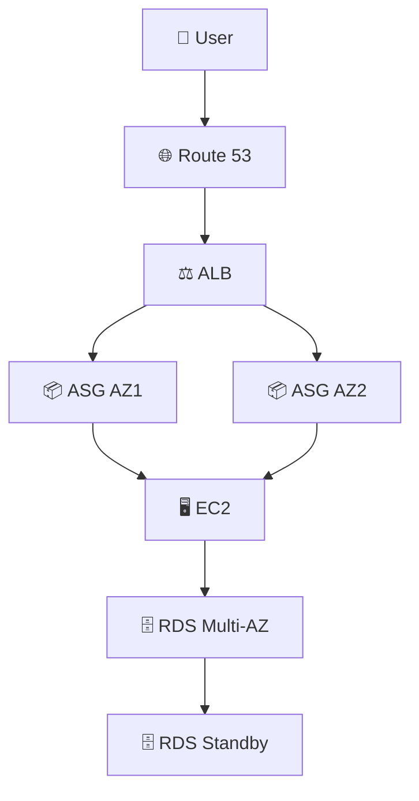
```mermaid
graph TD
    User[👤 User] --> Route53[🌐 Route 53]
    Route53 --> ALB[⚖️ ALB]
    ALB --> ASG1[📦 ASG AZ1]
    ALB --> ASG2[📦 ASG AZ2]
    ASG1 --> EC2[🖥️ EC2]
    ASG2 --> EC2
    EC2 --> RDS[🗄️ RDS Multi-AZ]
    RDS --> RDS_Standby[🗄️ RDS Standby]
```

**Key Components:**
- 🎯 <span style="color: #FF6B6B; font-weight: bold;">Multi-AZ</span> deployment
- ⚡ <span style="color: #4ECDC4; font-weight: bold;">Auto Scaling</span> groups
- 🔄 <span style="color: #45B7D1; font-weight: bold;">Load Balancing</span> with ALB
- 💾 <span style="color: #96CEB4; font-weight: bold;">RDS Multi-AZ</span> for DB redundancy

---

## ⚖️ Load Balancers Deep Dive

### Load Balancer Types
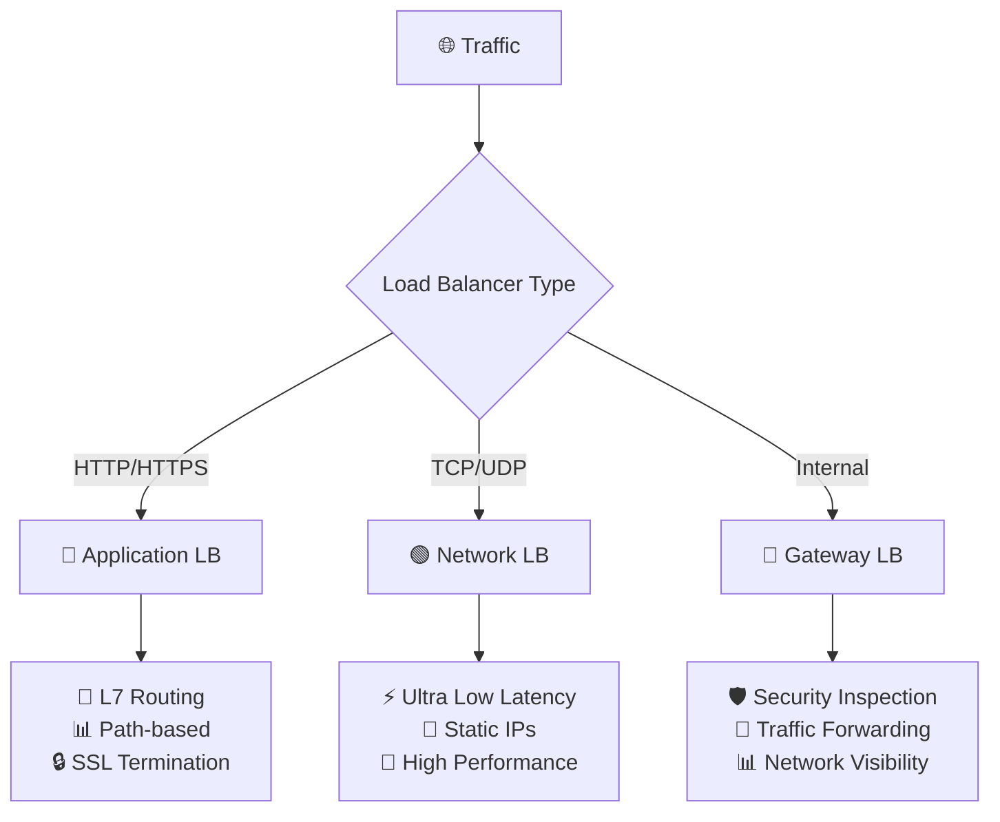
```mermaid
graph TD
    Traffic[🌐 Traffic] --> LB_Type{Load Balancer Type}
    LB_Type -->|HTTP/HTTPS| ALB[🔷 Application LB]
    LB_Type -->|TCP/UDP| NLB[🟢 Network LB]
    LB_Type -->|Internal| GWLB[🔌 Gateway LB]
    
    ALB --> Features1["🎯 L7 Routing<br>📊 Path-based<br>🔒 SSL Termination"]
    NLB --> Features2["⚡ Ultra Low Latency<br>🎯 Static IPs<br>💪 High Performance"]
    GWLB --> Features3["🛡️ Security Inspection<br>🔗 Traffic Forwarding<br>📊 Network Visibility"]
```

### ALB Configuration
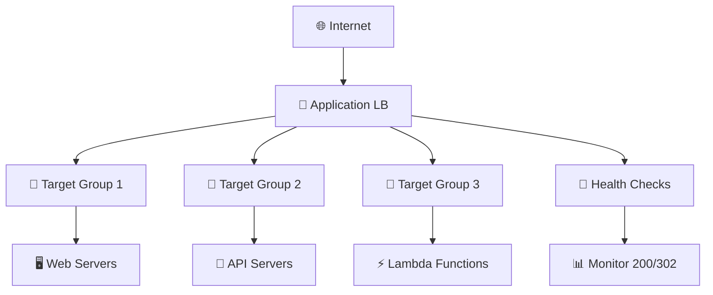
```mermaid
graph TD
    Internet[🌐 Internet] --> ALB[🔷 Application LB]
    ALB --> TG1[🎯 Target Group 1]
    ALB --> TG2[🎯 Target Group 2]
    ALB --> TG3[🎯 Target Group 3]
    
    TG1 --> EC2_Web[🖥️ Web Servers]
    TG2 --> EC2_API[🔧 API Servers]
    TG3 --> Lambda[⚡ Lambda Functions]
    
    ALB --> Health[💚 Health Checks]
    Health --> Monitor[📊 Monitor 200/302]
```

**Key ALB Features:**
- 🎯 <span style="color: #FF6B6B; font-weight: bold;">Path-based routing</span>: `/api/*` → API servers
- 🔄 <span style="color: #4ECDC4; font-weight: bold;">Host-based routing</span>: `api.example.com` → API TG
- ⚖️ <span style="color: #45B7D1; font-weight: bold;">Weighted routing</span>: 90% to v1, 10% to v2
- 💚 <span style="color: #96CEB4; font-weight: bold;">Health checks</span>: HTTP/HTTPS, TCP, custom protocols

### NLB vs ALB Comparison
| Feature | ALB (L7) | NLB (L4) |
|---------|----------|----------|
| 🎯 <span style="color: #FF6B6B; font-weight: bold;">Protocol</span> | HTTP/HTTPS | TCP/UDP |
| ⚡ <span style="color: #4ECDC4; font-weight: bold;">Latency</span> | ~100ms | ~10ms |
| 📊 <span style="color: #45B7D1; font-weight: bold;">Metrics</span> | Rich | Basic |
| 💰 <span style="color: #96CEB4; font-weight: bold;">Cost</span> | Higher | Lower |
| 🎯 <span style="color: #FF6B6B; font-weight: bold;">Use Case</span> | Web apps | Gaming/Streaming |

---

## 🌐 Route 53 Failover Configuration

### Failover Architecture
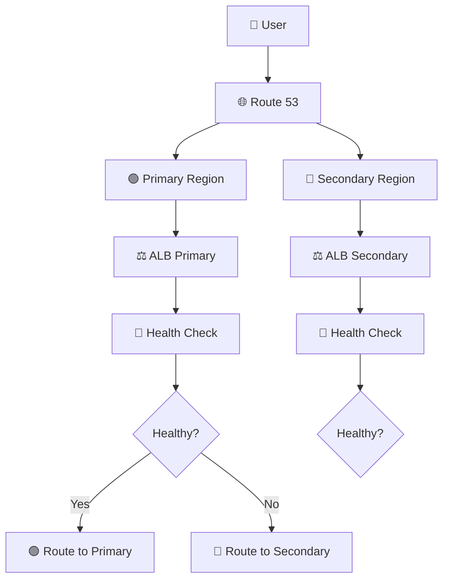
```mermaid
graph TD
    User[👤 User] --> Route53[🌐 Route 53]
    Route53 --> Primary[🟢 Primary Region]
    Route53 --> Secondary[🔴 Secondary Region]
    
    Primary --> ALB_P[⚖️ ALB Primary]
    Secondary --> ALB_S[⚖️ ALB Secondary]
    
    ALB_P --> Health_P[💚 Health Check]
    ALB_S --> Health_S[💚 Health Check]
    
    Health_P --> Status_P{Healthy?}
    Health_S --> Status_S{Healthy?}
    
    Status_P -->|Yes| Route_P[🟢 Route to Primary]
    Status_P -->|No| Route_S[🔴 Route to Secondary]
```

### Route 53 Configuration Steps
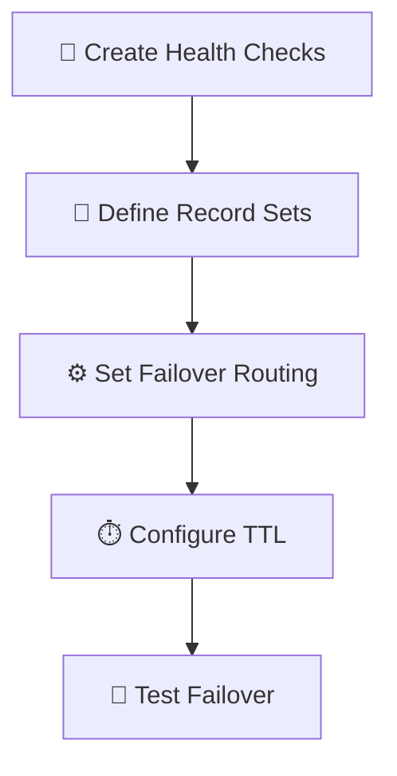
```mermaid
flowchart TD
    Step1[📝 Create Health Checks] --> Step2[🎯 Define Record Sets]
    Step2 --> Step3[⚙️ Set Failover Routing]
    Step3 --> Step4[⏱️ Configure TTL]
    Step4 --> Step5[🧪 Test Failover]
```

**Health Check Configuration:**
- 📡 <span style="color: #FF6B6B; font-weight: bold;">Protocol</span>: HTTP/HTTPS/TCP
- 🎯 <span style="color: #4ECDC4; font-weight: bold;">Endpoint</span>: `/health` or specific port
- ⏱️ <span style="color: #45B7D1; font-weight: bold;">Interval</span>: 10 seconds (fast) or 30 seconds (standard)
- 🔢 <span style="color: #96CEB4; font-weight: bold;">Threshold</span>: 3 failures = unhealthy
- 🌍 <span style="color: #9B59B6; font-weight: bold;">Regions</span>: Check from multiple locations

### Failover Routing Policy
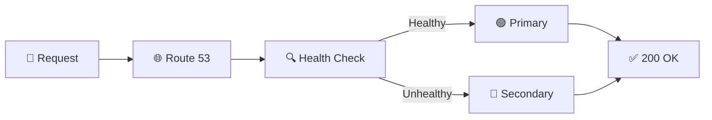
```mermaid
graph LR
    Request[📨 Request] --> DNS[🌐 Route 53]
    DNS --> Check[🔍 Health Check]
    Check -->|Healthy| Primary[🟢 Primary]
    Check -->|Unhealthy| Secondary[🔴 Secondary]
    Primary --> Response[✅ 200 OK]
    Secondary --> Response
```

**Advanced Features:**
- 🎯 <span style="color: #FF6B6B; font-weight: bold;">Geolocation routing</span>: Route based on user location
- ⚖️ <span style="color: #4ECDC4; font-weight: bold;">Latency routing</span>: Route to lowest latency region
- 🔄 <span style="color: #45B7D1; font-weight: bold;">Geoproximity routing</span>: Route with bias for specific region
- 📊 <span style="color: #96CEB4; font-weight: bold;">Weighted routing</span>: Split traffic percentage

---

## 🚀 Global Accelerator

### Global Accelerator vs CloudFront
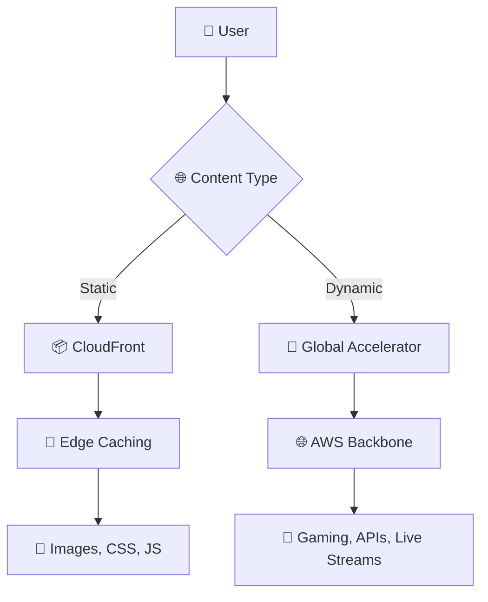
```mermaid
graph TD
    User[👤 User] --> Choice{🌐 Content Type}
    Choice -->|Static| CF[📦 CloudFront]
    Choice -->|Dynamic| GA[🚀 Global Accelerator]
    
    CF --> Cache[💾 Edge Caching]
    GA --> Backbone[🌐 AWS Backbone]
    
    Cache --> Static[📄 Images, CSS, JS]
    Backbone --> Dynamic[🔴 Gaming, APIs, Live Streams]
```

### Global Accelerator Architecture
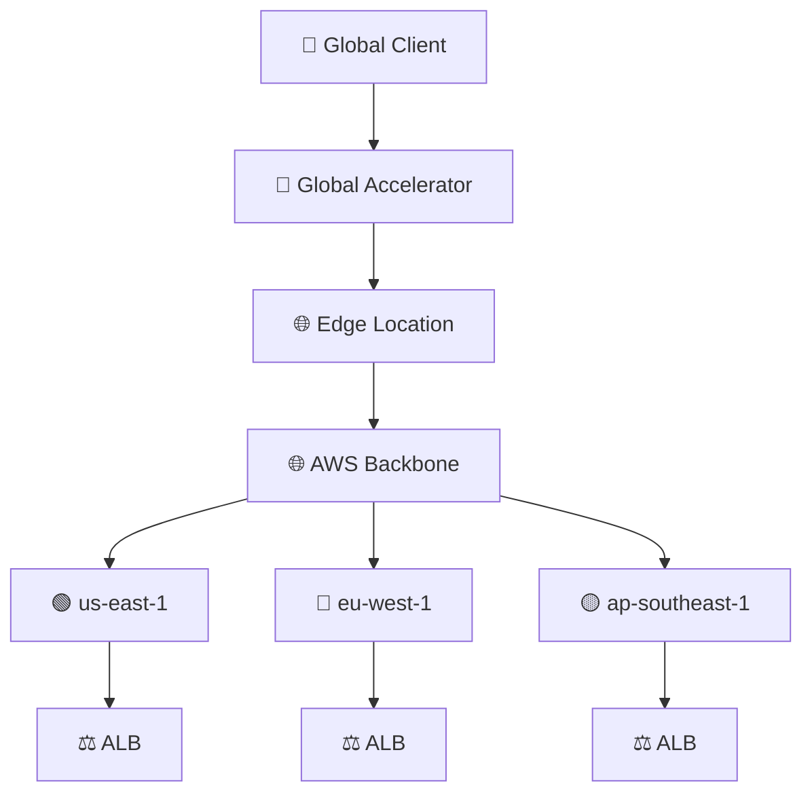
```mermaid
graph TD
    Client[👤 Global Client] --> GA[🚀 Global Accelerator]
    GA --> Edge[🌐 Edge Location]
    Edge --> Backbone[🌐 AWS Backbone]
    Backbone --> Region1[🟢 us-east-1]
    Backbone --> Region2[🔴 eu-west-1]
    Backbone --> Region3[🟡 ap-southeast-1]
    
    Region1 --> ALB1[⚖️ ALB]
    Region2 --> ALB2[⚖️ ALB]
    Region3 --> ALB3[⚖️ ALB]
```

**Key Benefits:**
- ⚡ <span style="color: #FF6B6B; font-weight: bold;">Performance</span>: 30% better latency for dynamic content
- 🛡️ <span style="color: #4ECDC4; font-weight: bold;">Reliability</span>: Automatic failover across regions
- 📊 <span style="color: #45B7D1; font-weight: bold;">Monitoring</span>: Flow logs and health checks
- 🌍 <span style="color: #96CEB4; font-weight: bold;">Global</span>: Fixed IP addresses for any region

### GA Configuration
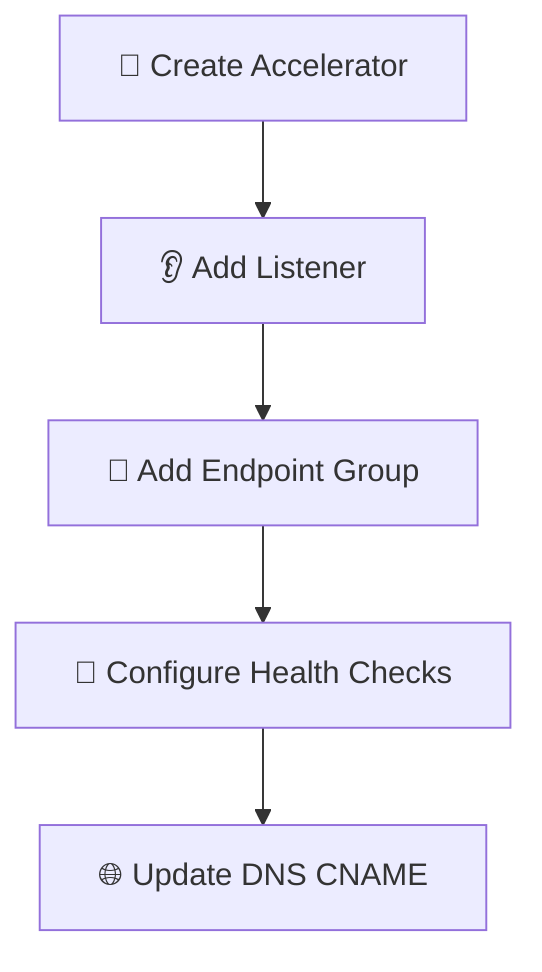
```mermaid
flowchart TD
    Create[📝 Create Accelerator] --> Listener[👂 Add Listener]
    Listener --> Endpoint[🎯 Add Endpoint Group]
    Endpoint --> Health[💚 Configure Health Checks]
    Health --> DNS[🌐 Update DNS CNAME]
```

**Endpoint Group Settings:**
- 🎯 <span style="color: #FF6B6B; font-weight: bold;">Traffic Dials</span>: Control traffic percentage
- 🌍 <span style="color: #4ECDC4; font-weight: bold;">Regions</span>: Multiple endpoint groups
- 💚 <span style="color: #45B7D1; font-weight: bold;">Health Checks</span>: TCP/HTTP protocols
- ⚖️ <span style="color: #96CEB4; font-weight: bold;">Weights</span>: Distribute traffic across regions

---

## 🎮 Gaming Load Balancing Scenarios

### Multi-Region Game Architecture
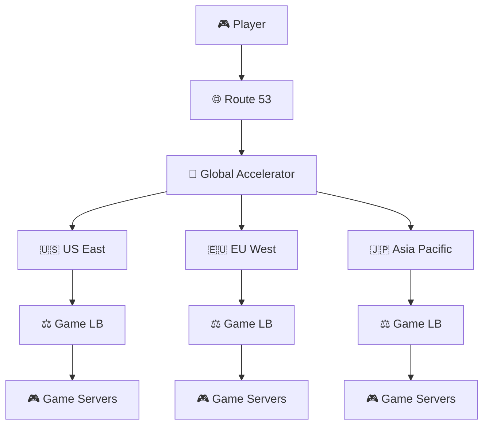
```mermaid
graph TD
    Player[🎮 Player] --> Route53[🌐 Route 53]
    Route53 --> GA[🚀 Global Accelerator]
    GA --> Region_US[🇺🇸 US East]
    GA --> Region_EU[🇪🇺 EU West]
    GA --> Region_ASIA[🇯🇵 Asia Pacific]
    
    Region_US --> ALB_US[⚖️ Game LB]
    Region_EU --> ALB_EU[⚖️ Game LB]
    Region_ASIA --> ALB_ASIA[⚖️ Game LB]
    
    ALB_US --> GameServers_US[🎮 Game Servers]
    ALB_EU --> GameServers_EU[🎮 Game Servers]
    ALB_ASIA --> GameServers_ASIA[🎮 Game Servers]
```

### Real-time Load Balancing for Gaming
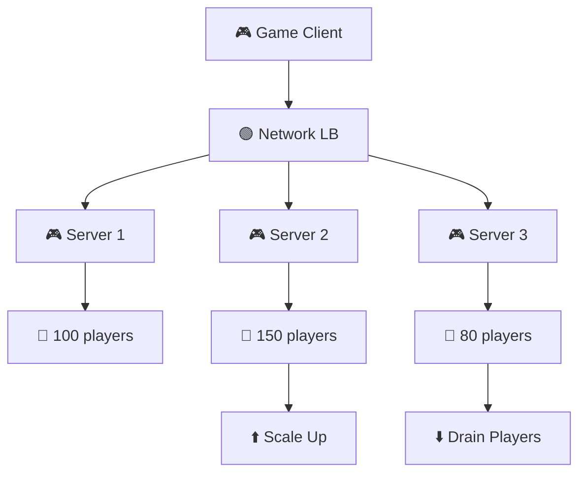
```mermaid
graph TD
    GameClient[🎮 Game Client] --> NLB[🟢 Network LB]
    NLB --> GameServer1[🎮 Server 1]
    NLB --> GameServer2[🎮 Server 2]
    NLB --> GameServer3[🎮 Server 3]
    
    GameServer1 --> PlayerCount1[👥 100 players]
    GameServer2 --> PlayerCount2[👥 150 players]
    GameServer3 --> PlayerCount3[👥 80 players]
    
    PlayerCount2 --> Scale[⬆️ Scale Up]
    PlayerCount3 --> Drain[⬇️ Drain Players]
```

**Gaming-Specific Optimizations:**
- ⚡ <span style="color: #FF6B6B; font-weight: bold;">UDP Protocol</span>: For real-time gaming
- 🎯 <span style="color: #4ECDC4; font-weight: bold;">Sticky Sessions</span>: Keep players on same server
- 📊 <span style="color: #45B7D1; font-weight: bold;">Player Metrics</span>: Track server load by player count
- 🔄 <span style="color: #96CEB4; font-weight: bold;">Seamless Migration</span>: Move players without disconnect

---

## 📋 Load Balancer Interview Questions

### Essential Questions
1. **🎯 When would you use ALB vs NLB?**
   - ALB: <span style="color: #FF6B6B; font-weight: bold;">HTTP/HTTPS</span>, <span style="color: #4ECDC4; font-weight: bold;">path-based routing</span>, <span style="color: #45B7D1; font-weight: bold;">SSL termination</span>
   - NLB: <span style="color: #96CEB4; font-weight: bold;">TCP/UDP</span>, <span style="color: #9B59B6; font-weight: bold;">ultra-low latency</span>, <span style="color: #E67E22; font-weight: bold;">static IPs</span>

2. **🌐 How does Route 53 failover work?**
   - <span style="color: #FF6B6B; font-weight: bold;">Health checks</span> monitor endpoints
   - <span style="color: #4ECDC4; font-weight: bold;">DNS routing</span> changes based on health
   - <span style="color: #45B7D1; font-weight: bold;">TTL</span> affects failover speed

3. **🚀 What's the difference between Global Accelerator and CloudFront?**
   - GA: <span style="color: #FF6B6B; font-weight: bold;">Dynamic content</span>, <span style="color: #4ECDC4; font-weight: bold;">AWS backbone</span>, <span style="color: #45B7D1; font-weight: bold;">fixed IPs</span>
   - CF: <span style="color: #96CEB4; font-weight: bold;">Static content</span>, <span style="color: #9B59B6; font-weight: bold;">edge caching</span>, <span style="color: #E67E22; font-weight: bold;">CDN</span>

4. **⚖️ How do you configure sticky sessions?**
   - <span style="color: #FF6B6B; font-weight: bold;">Enable</span> on target group
   - <span style="color: #4ECDC4; font-weight: bold;">Duration-based cookies</span>
   - Use for <span style="color: #45B7D1; font-weight: bold;">stateful applications</span>

5. **🛡️ How do load balancers handle DDoS?**
   - <span style="color: #FF6B6B; font-weight: bold;">AWS Shield</span> integration
   - <span style="color: #4ECDC4; font-weight: bold;">Rate-based rules</span>
   - <span style="color: #45B7D1; font-weight: bold;">Auto-scaling</span> to absorb traffic

### Advanced Scenarios
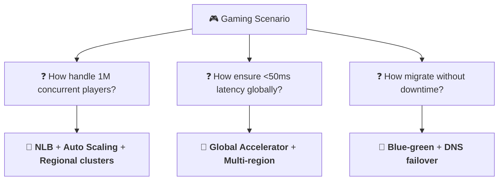
```mermaid
graph TD
    Scenario[🎮 Gaming Scenario] --> Q1["❓ How handle 1M concurrent players?"]
    Scenario --> Q2["❓ How ensure <50ms latency globally?"]
    Scenario --> Q3["❓ How migrate without downtime?"]
    
    Q1 --> A1["🎯 <span style='color: #FF6B6B; font-weight: bold;'>NLB</span> + <span style='color: #4ECDC4; font-weight: bold;'>Auto Scaling</span> + <span style='color: #45B7D1; font-weight: bold;'>Regional clusters</span>"]
    Q2 --> A2["🚀 <span style='color: #FF6B6B; font-weight: bold;'>Global Accelerator</span> + <span style='color: #4ECDC4; font-weight: bold;'>Multi-region</span>"]
    Q3 --> A3["🔄 <span style='color: #FF6B6B; font-weight: bold;'>Blue-green</span> + <span style='color: #4ECDC4; font-weight: bold;'>DNS failover</span>"]
```

### Serverless Architecture
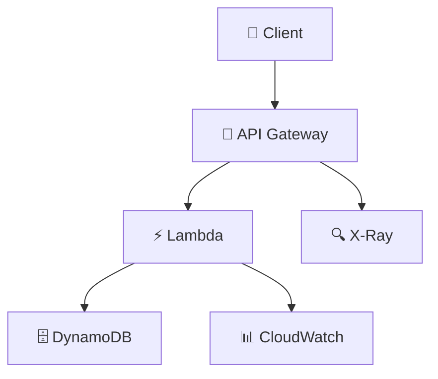
```mermaid
graph TD
    Client[📱 Client] --> API[🚪 API Gateway]
    API --> Lambda[⚡ Lambda]
    Lambda --> DB[🗄️ DynamoDB]
    Lambda --> Logs[📊 CloudWatch]
    API --> Trace[🔍 X-Ray]
```

**Benefits:**
- 💰 **Pay-per-use**
- 🚀 **Auto-scaling**
- 🛡️ **Managed infrastructure**
- ⚡ **Cold start mitigation**

---

## 🌐 Multi-Cloud

### Multi-Cloud Strategy
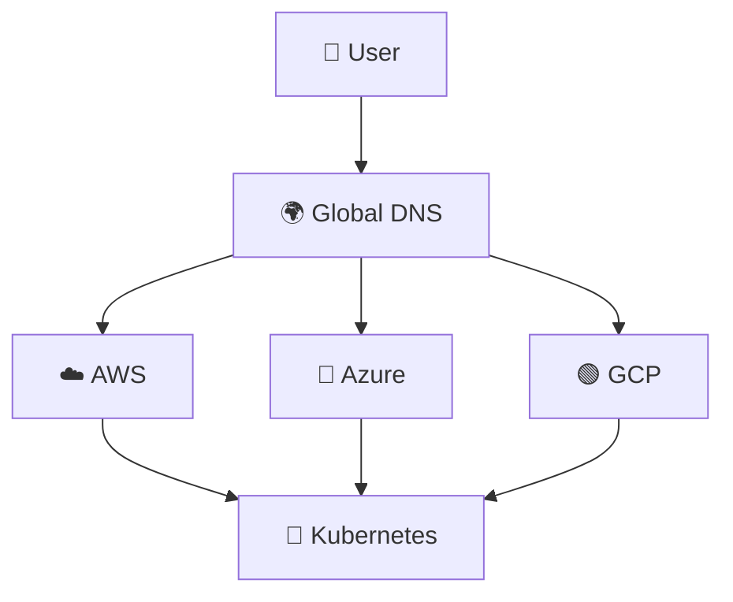
```mermaid
graph TD
    User[👤 User] --> DNS[🌍 Global DNS]
    DNS --> AWS[☁️ AWS]
    DNS --> Azure[🔷 Azure]
    DNS --> GCP[🟢 GCP]
    AWS --> K8s[🐳 Kubernetes]
    Azure --> K8s
    GCP --> K8s
```

**Tools:**
- 🏗️ **Terraform** for IaC
- 🐳 **Kubernetes** for portability
- 🔄 **DNS failover** for resilience

**Challenges & Solutions:**
| Challenge | Solution |
|-----------|----------|
| 🔒 Vendor lock-in | 🛠️ Open-source tools |
| 💸 Data transfer costs | 📦 Data compression |
| 🌪️ Complexity | 📊 Unified monitoring |

---

## 🛡️ Reliability

### SRE Metrics Overview
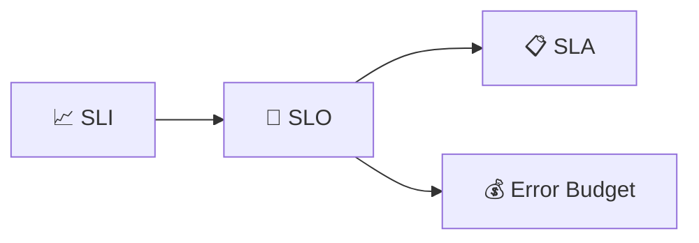
```mermaid
graph LR
    SLI[📈 SLI] --> SLO[🎯 SLO]
    SLO --> SLA[📋 SLA]
    SLO --> Budget[💰 Error Budget]
```

**Key Concepts:**
- 📊 <span style="color: #FF6B6B; font-weight: bold;">SLI</span>: Service Level Indicator (metrics)
- 🎯 <span style="color: #4ECDC4; font-weight: bold;">SLO</span>: Service Level Objective (target)
- 📋 <span style="color: #45B7D1; font-weight: bold;">SLA</span>: Service Level Agreement (contract)
- 💰 <span style="color: #96CEB4; font-weight: bold;">Error Budget</span>: Acceptable failure rate

### Incident Response Flow
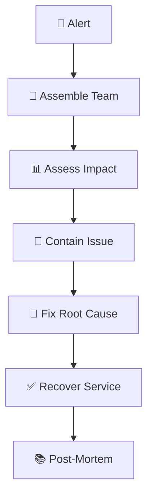
```mermaid
flowchart TD
    Alert[🚨 Alert] --> Team[👥 Assemble Team]
    Team --> Assess[📊 Assess Impact]
    Assess --> Contain[🔧 Contain Issue]
    Contain --> Fix[🔨 Fix Root Cause]
    Fix --> Recover[✅ Recover Service]
    Recover --> Learn[📚 Post-Mortem]
```

---

## 📈 Scalability

### Scaling Patterns
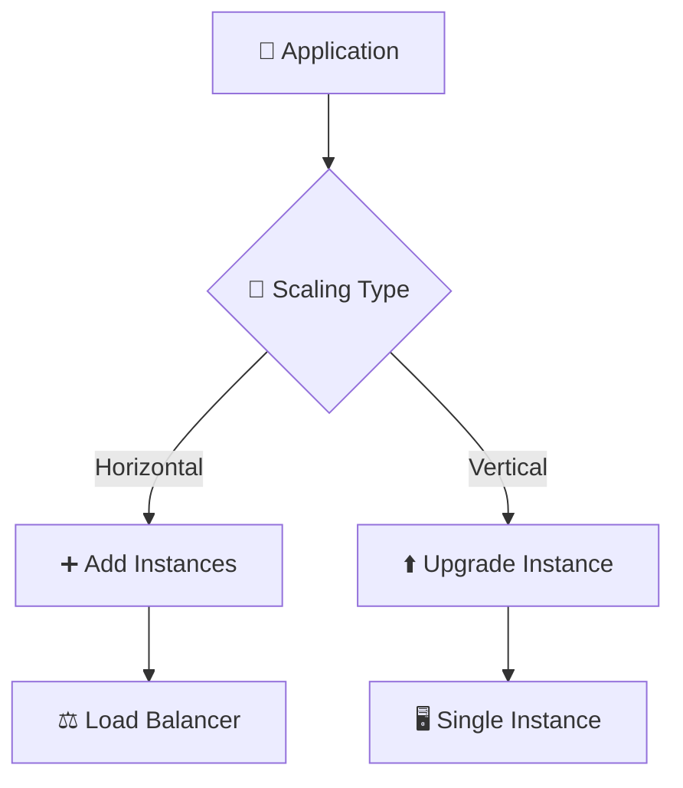
```mermaid
graph TD
    App[📱 Application] --> Choice{🔄 Scaling Type}
    Choice -->|Horizontal| HScale[➕ Add Instances]
    Choice -->|Vertical| VScale[⬆️ Upgrade Instance]
    HScale --> LB[⚖️ Load Balancer]
    VScale --> Single[🖥️ Single Instance]
```

**When to Use:**
- ➕ **Horizontal**: Better fault tolerance, unlimited scale
- ⬆️ **Vertical**: Simpler, no code changes

### Auto-Scaling Setup
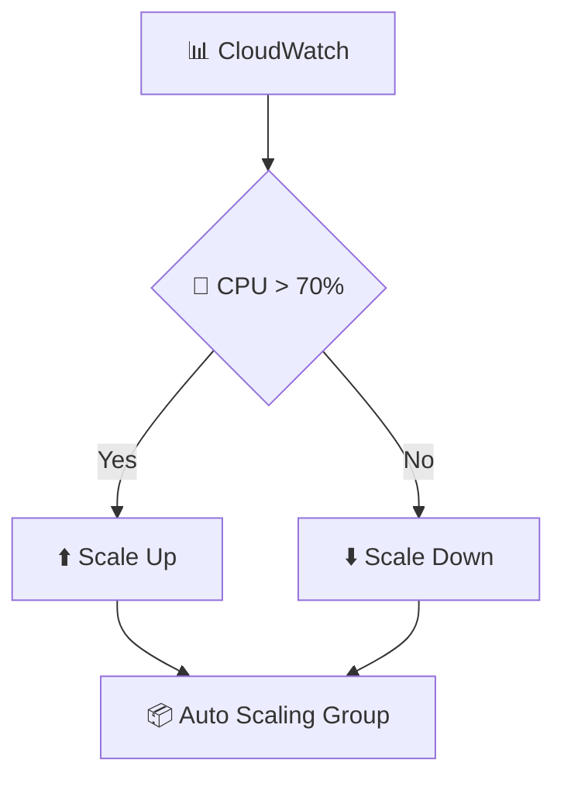
```mermaid
graph TD
    Monitor[📊 CloudWatch] --> Threshold{🎯 CPU > 70%}
    Threshold -->|Yes| ScaleUp[⬆️ Scale Up]
    Threshold -->|No| ScaleDown[⬇️ Scale Down]
    ScaleUp --> ASG[📦 Auto Scaling Group]
    ScaleDown --> ASG
```

---

## 👁️ Observability

### Three Pillars
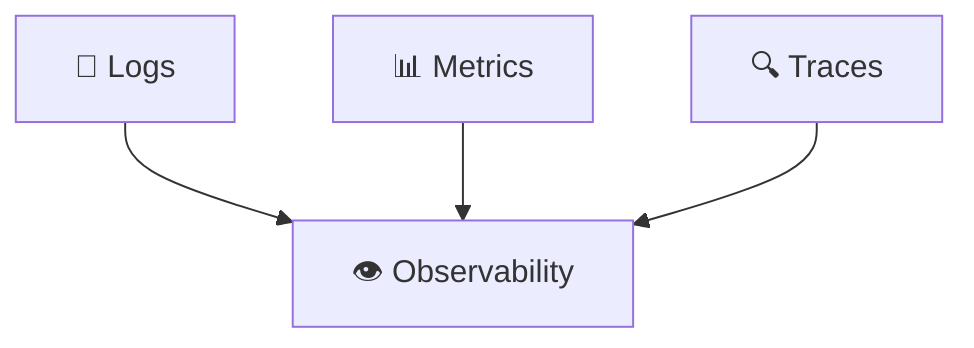
```mermaid
graph TD
    Logs[📝 Logs] --> Observability[👁️ Observability]
    Metrics[📊 Metrics] --> Observability
    Traces[🔍 Traces] --> Observability
```

**Implementation:**
- 📝 **Logs**: CloudWatch Logs
- 📊 **Metrics**: CloudWatch, Prometheus
- 🔍 **Traces**: X-Ray, Jaeger

### Monitoring Stack
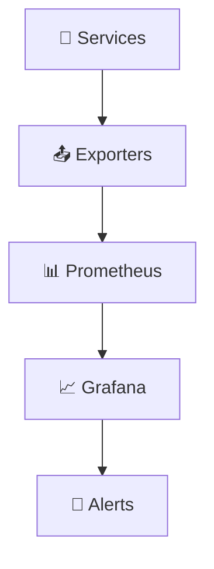
```mermaid
graph TD
    Services[🔧 Services] --> Exporters[📤 Exporters]
    Exporters --> Prometheus[📊 Prometheus]
    Prometheus --> Grafana[📈 Grafana]
    Grafana --> Alerts[🚨 Alerts]
```

---

## 💰 Cost Optimization

### Cost Reduction Strategies
```mermaid
pie title Cost Optimization
    "Reserved Instances" : 35
    "Spot Instances" : 25
    "Right-sizing" : 20
    "Storage Tiers" : 15
    "Monitoring" : 5
```

**Key Actions:**
- 🎫 **Reserved Instances**: Up to 75% savings
- ⚡ **Spot Instances**: Up to 90% discount
- 📏 **Right-sizing**: Match resources to demand
- 📦 **Storage Tiers**: S3 lifecycle policies

---

## 🚨 Incident Management

### Incident Response Process
```mermaid
flowchart TD
    Detect[🔍 Detect] --> Ack[✅ Acknowledge]
    Ack --> Assemble[👥 Assemble Team]
    Assemble --> Assess[📊 Assess]
    Assess --> Mitigate[🔧 Mitigate]
    Mitigate --> Resolve[✅ Resolve]
    Resolve --> Review[📚 Review]
```

**Key Roles:**
- 🎯 <span style="color: #FF6B6B; font-weight: bold;">Incident Commander</span>: Lead response
- 📊 <span style="color: #4ECDC4; font-weight: bold;">Communicator</span>: Stakeholder updates
- 🔧 <span style="color: #45B7D1; font-weight: bold;">Technical Lead</span>: Fix implementation
- 📝 <span style="color: #96CEB4; font-weight: bold;">Scribe</span>: Document timeline

---

## 👥 Leadership

### SRE Team Building
```mermaid
graph TD
    Hire[👤 Hire] --> Onboard[📚 Onboard]
    Onboard --> Mentor[🎓 Mentor]
    Mentor --> Grow[🌱 Grow]
    Grow --> Lead[👑 Lead]
```

**Leadership Skills:**
- 🎯 <span style="color: #FF6B6B; font-weight: bold;">Technical expertise</span>
- 🗣️ <span style="color: #4ECDC4; font-weight: bold;">Communication</span>
- 🤝 <span style="color: #45B7D1; font-weight: bold;">Collaboration</span>
- 📚 <span style="color: #96CEB4; font-weight: bold;">Continuous learning</span>

---

## 🎮 Gaming-Specific Scenarios

### Game Event Scaling
```mermaid
graph TD
    Event[🎮 Event] --> PreScale[📈 Pre-Scale]
    PreScale --> Monitor[👀 Monitor]
    Monitor --> Scale[⚡ Auto-Scale]
    Scale --> PostEvent[📊 Analyze]
```

**Key Metrics:**
- 👥 <span style="color: #FF6B6B; font-weight: bold;">Player count</span>
- ⚡ <span style="color: #4ECDC4; font-weight: bold;">Latency</span>
- 🎯 <span style="color: #45B7D1; font-weight: bold;">Success rate</span>
- 💾 <span style="color: #96CEB4; font-weight: bold;">Resource usage</span>

---

## 📋 Quick Reference

### AWS Services Cheat Sheet
| Service | Use Case | Key Feature |
|---------|----------|-------------|
| 🖥️ <span style="color: #FF6B6B; font-weight: bold;">EC2</span> | Compute | Virtual servers |
| 🗄️ <span style="color: #4ECDC4; font-weight: bold;">RDS</span> | Database | Managed SQL |
| ⚡ <span style="color: #45B7D1; font-weight: bold;">Lambda</span> | Serverless | Event-driven |
| ⚖️ <span style="color: #96CEB4; font-weight: bold;">ALB/NLB</span> | Load Balancing | L4/L7 routing |
| 🌐 <span style="color: #9B59B6; font-weight: bold;">Route 53</span> | DNS | Failover & routing |
| 🚀 <span style="color: #E67E22; font-weight: bold;">Global Accelerator</span> | Performance | AWS backbone |
| 🌐 <span style="color: #FF6B6B; font-weight: bold;">CloudFront</span> | CDN | Global distribution |
| 📊 <span style="color: #4ECDC4; font-weight: bold;">CloudWatch</span> | Monitoring | Metrics & logs |

### SRE Formulas
```
<span style="color: #FF6B6B; font-weight: bold;">Error Budget</span> = 100% - <span style="color: #4ECDC4; font-weight: bold;">SLO</span>
<span style="color: #45B7D1; font-weight: bold;">Burn Rate</span> = Error Budget Used / Time Elapsed
<span style="color: #96CEB4; font-weight: bold;">MTTR</span> = Total Downtime / Number of Incidents
```

---

## 🎯 Interview Tips

### Common Question Types
1. **🏗️ <span style="color: #FF6B6B; font-weight: bold;">Architecture Design</span>**
2. **🚨 <span style="color: #4ECDC4; font-weight: bold;">Incident Response</span>**
3. **💰 <span style="color: #45B7D1; font-weight: bold;">Cost Optimization</span>**
4. **👥 <span style="color: #96CEB4; font-weight: bold;">Leadership Experience</span>**
5. **🔧 <span style="color: #9B59B6; font-weight: bold;">Technical Deep Dive</span>**

### STAR Method
- **<span style="color: #FF6B6B; font-weight: bold;">S</span>ituation**: Context
- **<span style="color: #4ECDC4; font-weight: bold;">T</span>ask**: Goal
- **<span style="color: #45B7D1; font-weight: bold;">A</span>ction**: What you did
- **<span style="color: #96CEB4; font-weight: bold;">R</span>esult**: Outcome

---

## 📚 Study Plan

### Week-by-Week Preparation
| Week | Focus | Practice |
|------|-------|----------|
| 1 | <span style="color: #FF6B6B; font-weight: bold;">AWS Architecture</span> | Design diagrams |
| 2 | <span style="color: #4ECDC4; font-weight: bold;">Reliability</span> | SLO calculations |
| 3 | <span style="color: #45B7D1; font-weight: bold;">Scalability</span> | Auto-scaling configs |
| 4 | <span style="color: #96CEB4; font-weight: bold;">Observability</span> | Monitoring setup |
| 5 | <span style="color: #9B59B6; font-weight: bold;">Cost Optimization</span> | Budget analysis |
| 6 | <span style="color: #E67E22; font-weight: bold;">Incident Response</span> | Mock scenarios |

---

**🎉 Good luck with your EA SRE 3 interview!**

*Remember: Focus on practical experience and real-world examples.*