# EA SRE 3 Interview Prep - Visual Guide

## 🎯 Quick Navigation
- [AWS Architecture](#-aws-architecture)
- [Load Balancers](#️-load-balancers-deep-dive)
- [Route 53 Failover](#-route-53-failover-configuration)
- [Global Accelerator](#-global-accelerator)
- [Multi-Cloud](#-multi-cloud)
- [Reliability](#-reliability)
- [Scalability](#-scalability)
- [Observability](#-observability)
- [Cost Optimization](#-cost-optimization)
- [Incident Management](#-incident-management)
- [Leadership](#-leadership)

---

## ☁️ AWS Architecture

### High Availability Web App
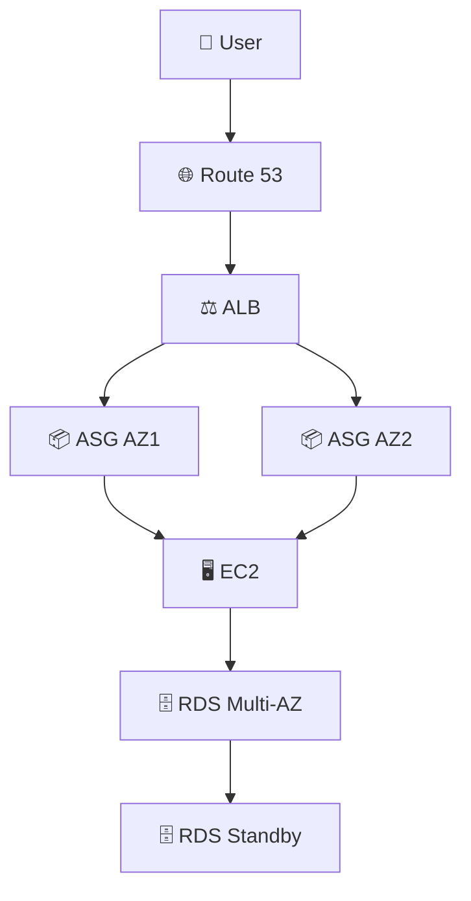
```mermaid
graph TD
    User[👤 User] --> Route53[🌐 Route 53]
    Route53 --> ALB[⚖️ ALB]
    ALB --> ASG1[📦 ASG AZ1]
    ALB --> ASG2[📦 ASG AZ2]
    ASG1 --> EC2[🖥️ EC2]
    ASG2 --> EC2
    EC2 --> RDS[🗄️ RDS Multi-AZ]
    RDS --> RDS_Standby[🗄️ RDS Standby]
```

**Key Components:**
- 🎯 **Multi-AZ** deployment
- ⚡ **Auto Scaling** groups
- 🔄 **Load Balancing** with ALB
- 💾 **RDS Multi-AZ** for DB redundancy

---

## ⚖️ Load Balancers Deep Dive

### Load Balancer Types
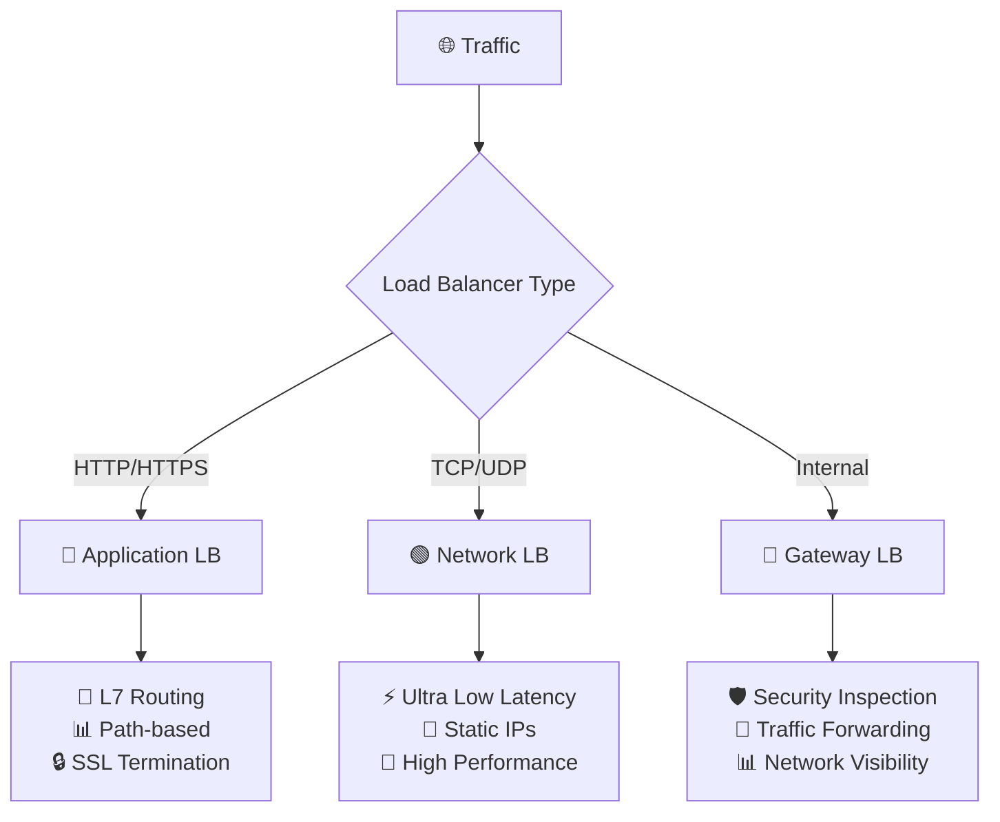
```mermaid
graph TD
    Traffic[🌐 Traffic] --> LB_Type{Load Balancer Type}
    LB_Type -->|HTTP/HTTPS| ALB[🔷 Application LB]
    LB_Type -->|TCP/UDP| NLB[🟢 Network LB]
    LB_Type -->|Internal| GWLB[🔌 Gateway LB]
    
    ALB --> Features1["🎯 L7 Routing<br>📊 Path-based<br>🔒 SSL Termination"]
    NLB --> Features2["⚡ Ultra Low Latency<br>🎯 Static IPs<br>💪 High Performance"]
    GWLB --> Features3["🛡️ Security Inspection<br>🔗 Traffic Forwarding<br>📊 Network Visibility"]
```

### ALB Configuration
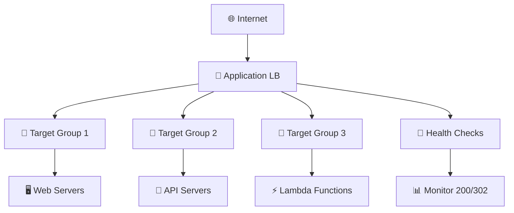
```mermaid
graph TD
    Internet[🌐 Internet] --> ALB[🔷 Application LB]
    ALB --> TG1[🎯 Target Group 1]
    ALB --> TG2[🎯 Target Group 2]
    ALB --> TG3[🎯 Target Group 3]
    
    TG1 --> EC2_Web[🖥️ Web Servers]
    TG2 --> EC2_API[🔧 API Servers]
    TG3 --> Lambda[⚡ Lambda Functions]
    
    ALB --> Health[💚 Health Checks]
    Health --> Monitor[📊 Monitor 200/302]
```

**Key ALB Features:**
- 🎯 **Path-based routing**: `/api/*` → API servers
- 🔄 **Host-based routing**: `api.example.com` → API TG
- ⚖️ **Weighted routing**: 90% to v1, 10% to v2
- 💚 **Health checks**: HTTP/HTTPS, TCP, custom protocols

### NLB vs ALB Comparison
| Feature | ALB (L7) | NLB (L4) |
|---------|----------|----------|
| 🎯 **Protocol** | HTTP/HTTPS | TCP/UDP |
| ⚡ **Latency** | ~100ms | ~10ms |
| 📊 **Metrics** | Rich | Basic |
| 💰 **Cost** | Higher | Lower |
| 🎯 **Use Case** | Web apps | Gaming/Streaming |

---

## 🌐 Route 53 Failover Configuration

### Failover Architecture
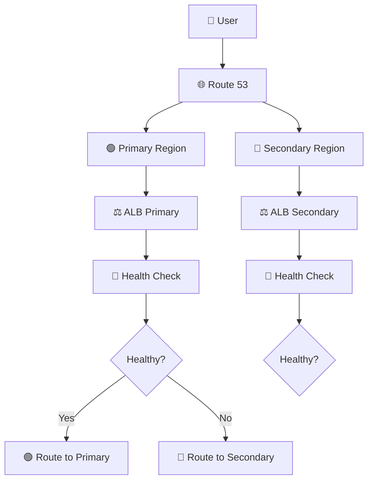
```mermaid
graph TD
    User[👤 User] --> Route53[🌐 Route 53]
    Route53 --> Primary[🟢 Primary Region]
    Route53 --> Secondary[🔴 Secondary Region]
    
    Primary --> ALB_P[⚖️ ALB Primary]
    Secondary --> ALB_S[⚖️ ALB Secondary]
    
    ALB_P --> Health_P[💚 Health Check]
    ALB_S --> Health_S[💚 Health Check]
    
    Health_P --> Status_P{Healthy?}
    Health_S --> Status_S{Healthy?}
    
    Status_P -->|Yes| Route_P[🟢 Route to Primary]
    Status_P -->|No| Route_S[🔴 Route to Secondary]
```

### Route 53 Configuration Steps
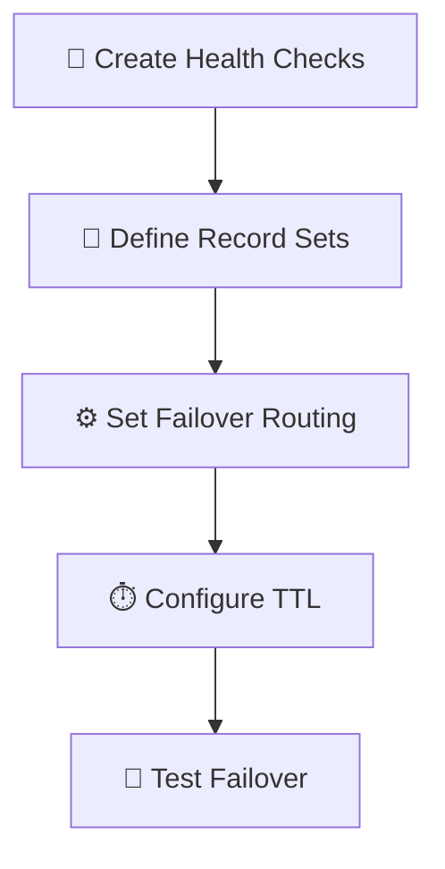
```mermaid
flowchart TD
    Step1[📝 Create Health Checks] --> Step2[🎯 Define Record Sets]
    Step2 --> Step3[⚙️ Set Failover Routing]
    Step3 --> Step4[⏱️ Configure TTL]
    Step4 --> Step5[🧪 Test Failover]
```

**Health Check Configuration:**
- 📡 **Protocol**: HTTP/HTTPS/TCP
- 🎯 **Endpoint**: `/health` or specific port
- ⏱️ **Interval**: 10 seconds (fast) or 30 seconds (standard)
- 🔢 **Threshold**: 3 failures = unhealthy
- 🌍 **Regions**: Check from multiple locations

### Failover Routing Policy
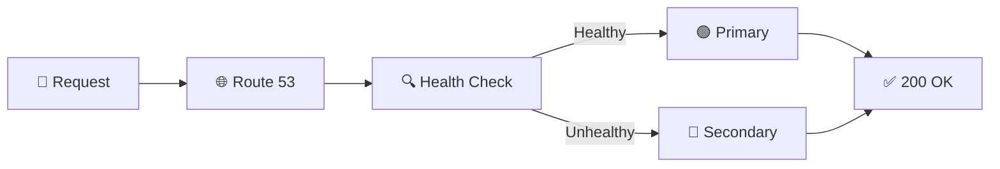
```mermaid
graph LR
    Request[📨 Request] --> DNS[🌐 Route 53]
    DNS --> Check[🔍 Health Check]
    Check -->|Healthy| Primary[🟢 Primary]
    Check -->|Unhealthy| Secondary[🔴 Secondary]
    Primary --> Response[✅ 200 OK]
    Secondary --> Response
```

**Advanced Features:**
- 🎯 **Geolocation routing**: Route based on user location
- ⚖️ **Latency routing**: Route to lowest latency region
- 🔄 **Geoproximity routing**: Route with bias for specific region
- 📊 **Weighted routing**: Split traffic percentage

---

## 🚀 Global Accelerator

### Global Accelerator vs CloudFront
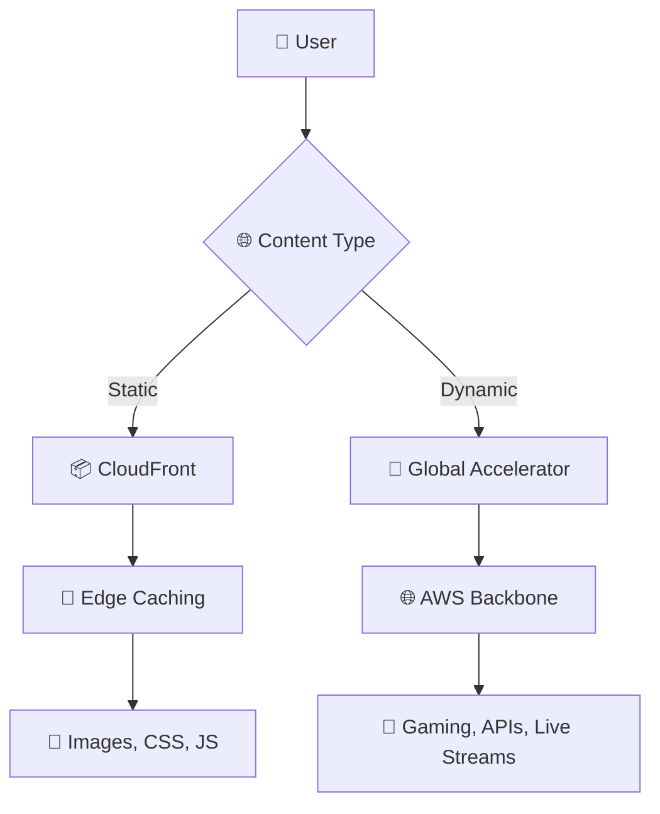
```mermaid
graph TD
    User[👤 User] --> Choice{🌐 Content Type}
    Choice -->|Static| CF[📦 CloudFront]
    Choice -->|Dynamic| GA[🚀 Global Accelerator]
    
    CF --> Cache[💾 Edge Caching]
    GA --> Backbone[🌐 AWS Backbone]
    
    Cache --> Static[📄 Images, CSS, JS]
    Backbone --> Dynamic[🔴 Gaming, APIs, Live Streams]
```

### Global Accelerator Architecture
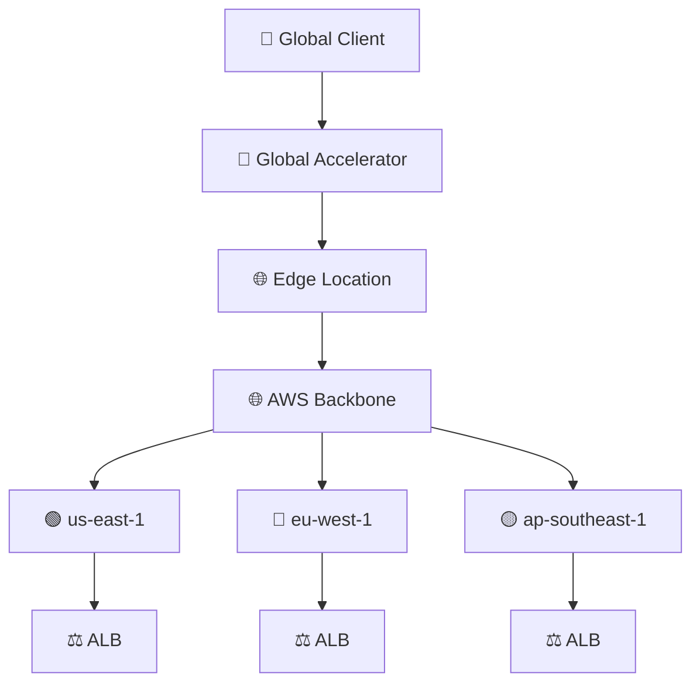
```mermaid
graph TD
    Client[👤 Global Client] --> GA[🚀 Global Accelerator]
    GA --> Edge[🌐 Edge Location]
    Edge --> Backbone[🌐 AWS Backbone]
    Backbone --> Region1[🟢 us-east-1]
    Backbone --> Region2[🔴 eu-west-1]
    Backbone --> Region3[🟡 ap-southeast-1]
    
    Region1 --> ALB1[⚖️ ALB]
    Region2 --> ALB2[⚖️ ALB]
    Region3 --> ALB3[⚖️ ALB]
```

**Key Benefits:**
- ⚡ **Performance**: 30% better latency for dynamic content
- 🛡️ **Reliability**: Automatic failover across regions
- 📊 **Monitoring**: Flow logs and health checks
- 🌍 **Global**: Fixed IP addresses for any region

### GA Configuration
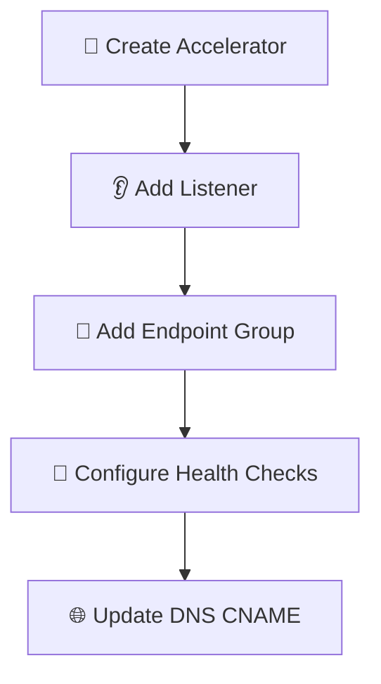
```mermaid
flowchart TD
    Create[📝 Create Accelerator] --> Listener[👂 Add Listener]
    Listener --> Endpoint[🎯 Add Endpoint Group]
    Endpoint --> Health[💚 Configure Health Checks]
    Health --> DNS[🌐 Update DNS CNAME]
```

**Endpoint Group Settings:**
- 🎯 **Traffic Dials**: Control traffic percentage
- 🌍 **Regions**: Multiple endpoint groups
- 💚 **Health Checks**: TCP/HTTP protocols
- ⚖️ **Weights**: Distribute traffic across regions

---

## 🎮 Gaming Load Balancing Scenarios

### Multi-Region Game Architecture
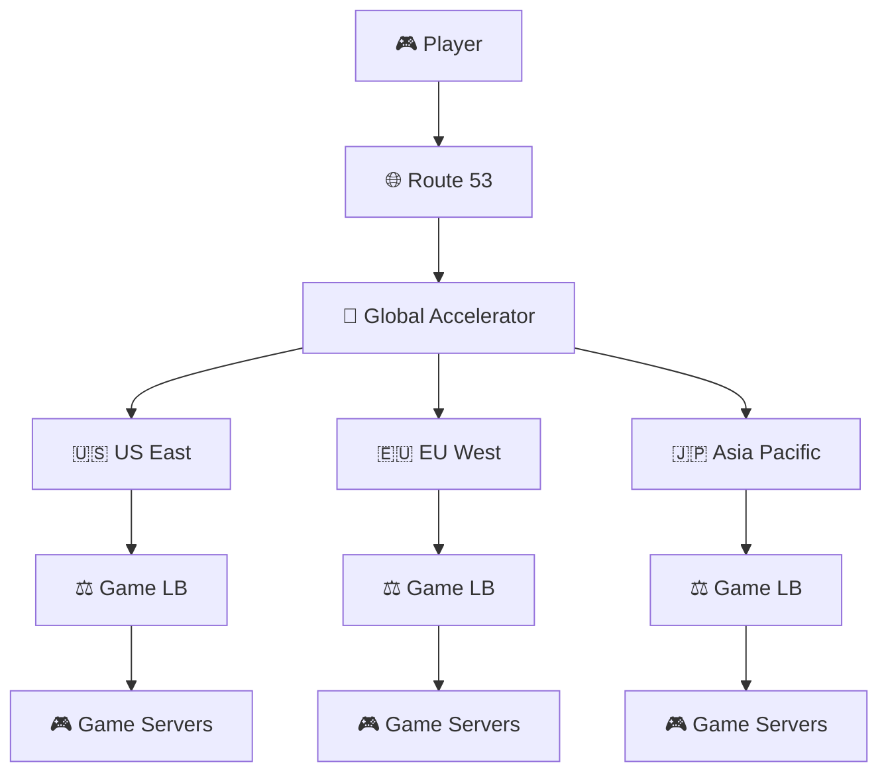
```mermaid
graph TD
    Player[🎮 Player] --> Route53[🌐 Route 53]
    Route53 --> GA[🚀 Global Accelerator]
    GA --> Region_US[🇺🇸 US East]
    GA --> Region_EU[🇪🇺 EU West]
    GA --> Region_ASIA[🇯🇵 Asia Pacific]
    
    Region_US --> ALB_US[⚖️ Game LB]
    Region_EU --> ALB_EU[⚖️ Game LB]
    Region_ASIA --> ALB_ASIA[⚖️ Game LB]
    
    ALB_US --> GameServers_US[🎮 Game Servers]
    ALB_EU --> GameServers_EU[🎮 Game Servers]
    ALB_ASIA --> GameServers_ASIA[🎮 Game Servers]
```

### Real-time Load Balancing for Gaming
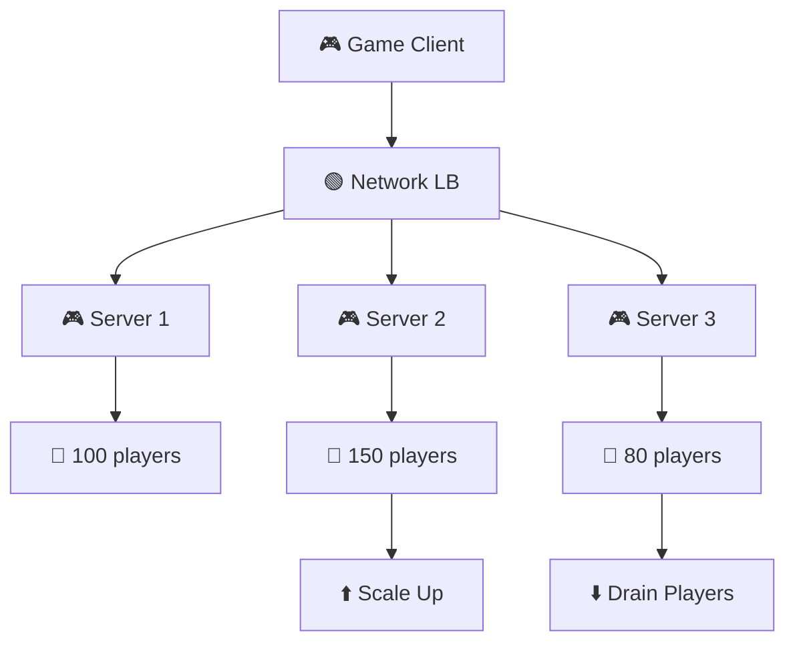
```mermaid
graph TD
    GameClient[🎮 Game Client] --> NLB[🟢 Network LB]
    NLB --> GameServer1[🎮 Server 1]
    NLB --> GameServer2[🎮 Server 2]
    NLB --> GameServer3[🎮 Server 3]
    
    GameServer1 --> PlayerCount1[👥 100 players]
    GameServer2 --> PlayerCount2[👥 150 players]
    GameServer3 --> PlayerCount3[👥 80 players]
    
    PlayerCount2 --> Scale[⬆️ Scale Up]
    PlayerCount3 --> Drain[⬇️ Drain Players]
```

**Gaming-Specific Optimizations:**
- ⚡ **UDP Protocol**: For real-time gaming
- 🎯 **Sticky Sessions**: Keep players on same server
- 📊 **Player Metrics**: Track server load by player count
- 🔄 **Seamless Migration**: Move players without disconnect

---

## 📋 Load Balancer Interview Questions

### Essential Questions
1. **🎯 When would you use ALB vs NLB?**
   - ALB: HTTP/HTTPS, path-based routing, SSL termination
   - NLB: TCP/UDP, ultra-low latency, static IPs

2. **🌐 How does Route 53 failover work?**
   - Health checks monitor endpoints
   - DNS routing changes based on health
   - TTL affects failover speed

3. **🚀 What's the difference between Global Accelerator and CloudFront?**
   - GA: Dynamic content, AWS backbone, fixed IPs
   - CF: Static content, edge caching, CDN

4. **⚖️ How do you configure sticky sessions?**
   - Enable on target group
   - Duration-based cookies
   - Use for stateful applications

5. **🛡️ How do load balancers handle DDoS?**
   - AWS Shield integration
   - Rate-based rules
   - Auto-scaling to absorb traffic

### Advanced Scenarios
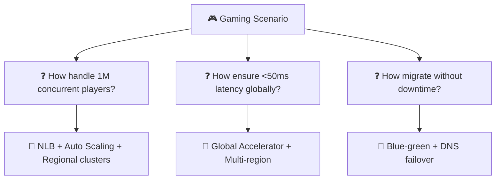
```mermaid
graph TD
    Scenario[🎮 Gaming Scenario] --> Q1["❓ How handle 1M concurrent players?"]
    Scenario --> Q2["❓ How ensure <50ms latency globally?"]
    Scenario --> Q3["❓ How migrate without downtime?"]
    
    Q1 --> A1["🎯 NLB + Auto Scaling + Regional clusters"]
    Q2 --> A2["🚀 Global Accelerator + Multi-region"]
    Q3 --> A3["🔄 Blue-green + DNS failover"]
```

### Serverless Architecture
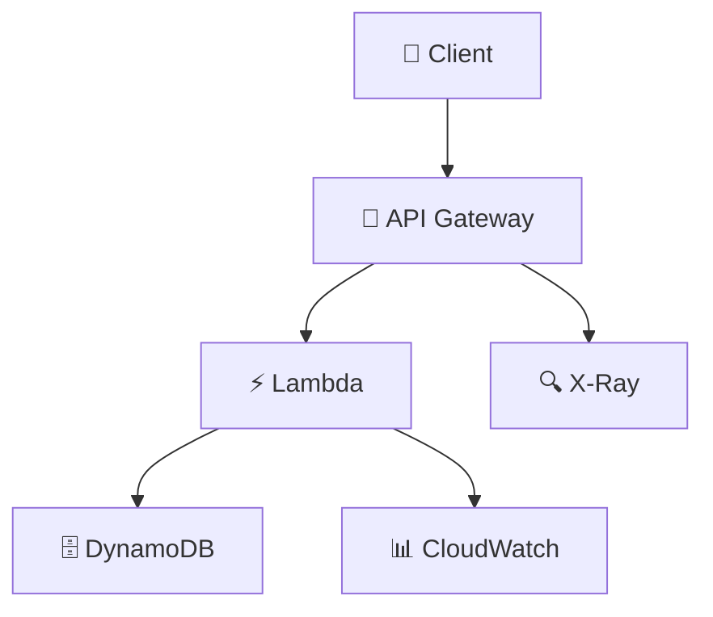
```mermaid
graph TD
    Client[📱 Client] --> API[🚪 API Gateway]
    API --> Lambda[⚡ Lambda]
    Lambda --> DB[🗄️ DynamoDB]
    Lambda --> Logs[📊 CloudWatch]
    API --> Trace[🔍 X-Ray]
```

**Benefits:**
- 💰 **Pay-per-use**
- 🚀 **Auto-scaling**
- 🛡️ **Managed infrastructure**
- ⚡ **Cold start mitigation**

---

## 🌐 Multi-Cloud

### Multi-Cloud Strategy
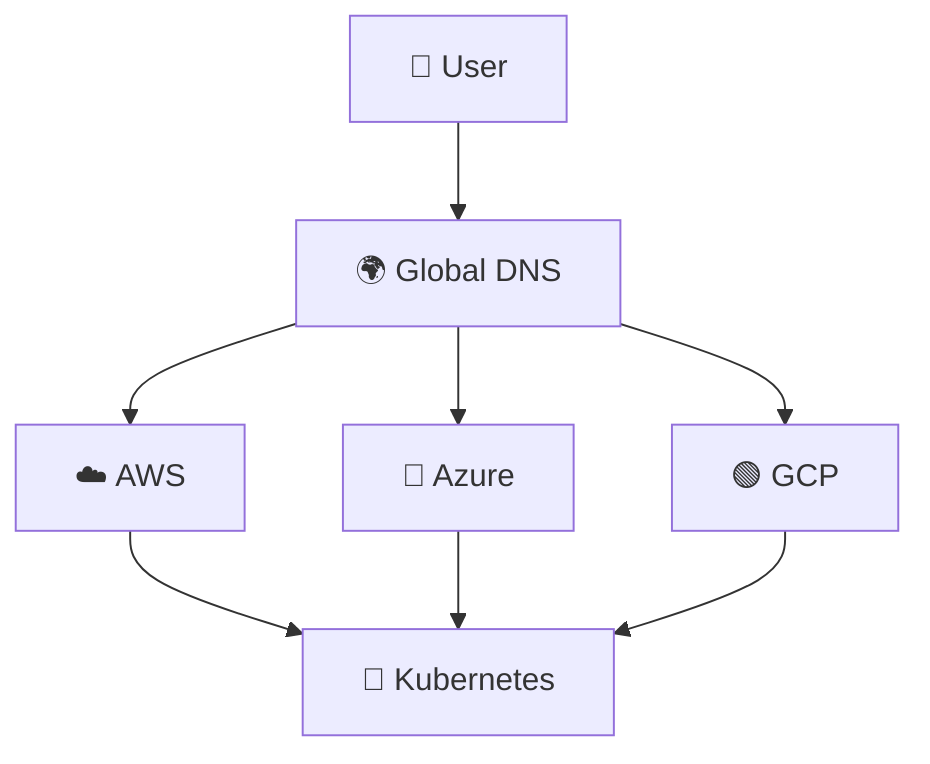
```mermaid
graph TD
    User[👤 User] --> DNS[🌍 Global DNS]
    DNS --> AWS[☁️ AWS]
    DNS --> Azure[🔷 Azure]
    DNS --> GCP[🟢 GCP]
    AWS --> K8s[🐳 Kubernetes]
    Azure --> K8s
    GCP --> K8s
```

**Tools:**
- 🏗️ **Terraform** for IaC
- 🐳 **Kubernetes** for portability
- 🔄 **DNS failover** for resilience

**Challenges & Solutions:**
| Challenge | Solution |
|-----------|----------|
| 🔒 Vendor lock-in | 🛠️ Open-source tools |
| 💸 Data transfer costs | 📦 Data compression |
| 🌪️ Complexity | 📊 Unified monitoring |

---

## 🛡️ Reliability

### SRE Metrics Overview
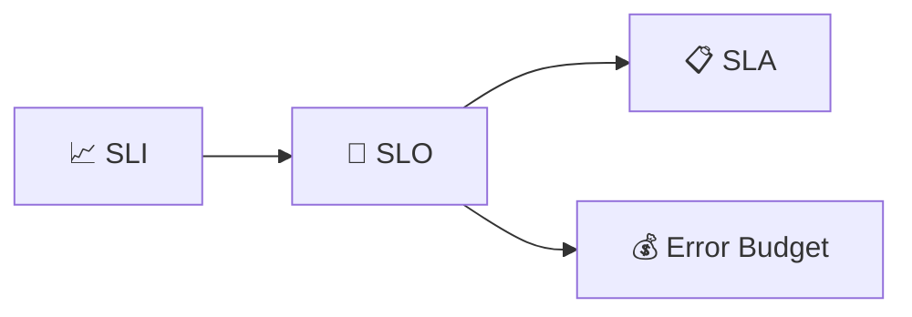
```mermaid
graph LR
    SLI[📈 SLI] --> SLO[🎯 SLO]
    SLO --> SLA[📋 SLA]
    SLO --> Budget[💰 Error Budget]
```

**Key Concepts:**
- 📊 **SLI**: Service Level Indicator (metrics)
- 🎯 **SLO**: Service Level Objective (target)
- 📋 **SLA**: Service Level Agreement (contract)
- 💰 **Error Budget**: Acceptable failure rate

### Incident Response Flow
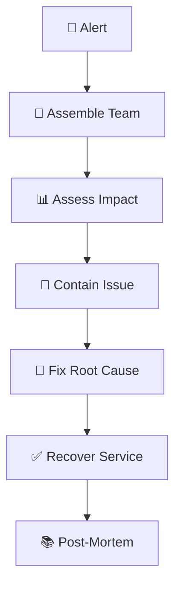
```mermaid
flowchart TD
    Alert[🚨 Alert] --> Team[👥 Assemble Team]
    Team --> Assess[📊 Assess Impact]
    Assess --> Contain[🔧 Contain Issue]
    Contain --> Fix[🔨 Fix Root Cause]
    Fix --> Recover[✅ Recover Service]
    Recover --> Learn[📚 Post-Mortem]
```

---

## 📈 Scalability

### Scaling Patterns
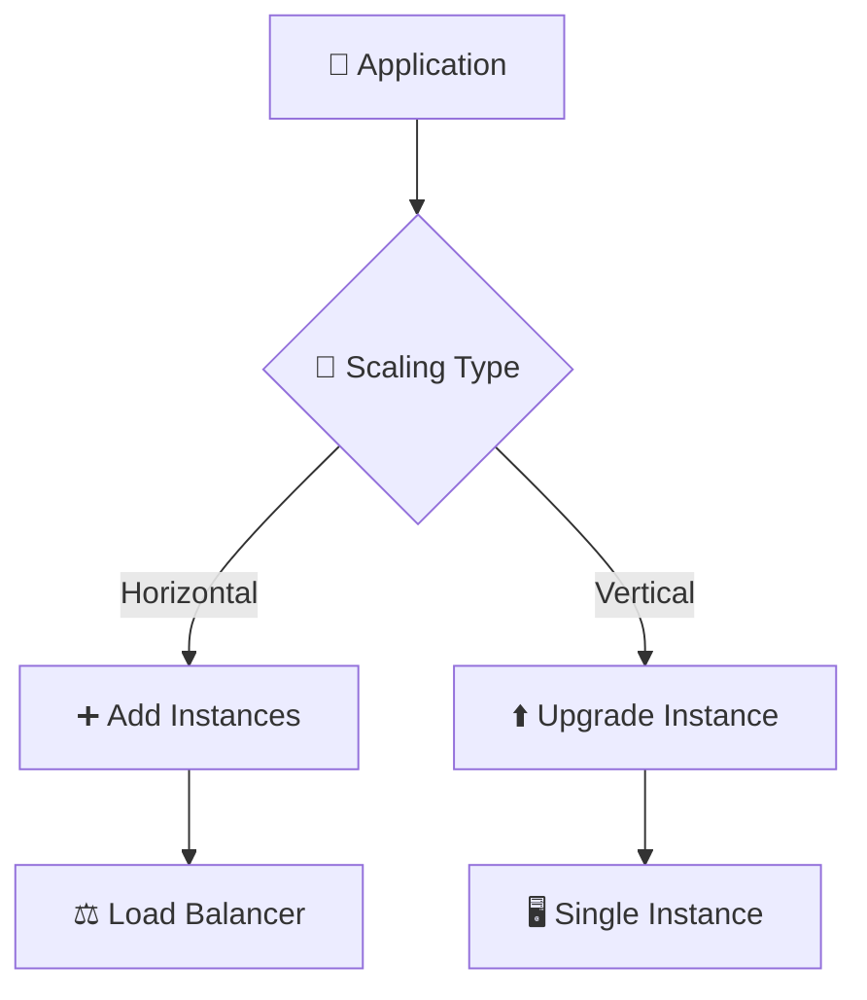
```mermaid
graph TD
    App[📱 Application] --> Choice{🔄 Scaling Type}
    Choice -->|Horizontal| HScale[➕ Add Instances]
    Choice -->|Vertical| VScale[⬆️ Upgrade Instance]
    HScale --> LB[⚖️ Load Balancer]
    VScale --> Single[🖥️ Single Instance]
```

**When to Use:**
- ➕ **Horizontal**: Better fault tolerance, unlimited scale
- ⬆️ **Vertical**: Simpler, no code changes

### Auto-Scaling Setup
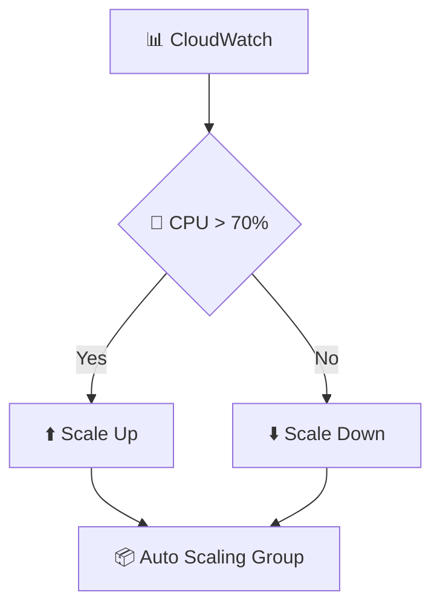
```mermaid
graph TD
    Monitor[📊 CloudWatch] --> Threshold{🎯 CPU > 70%}
    Threshold -->|Yes| ScaleUp[⬆️ Scale Up]
    Threshold -->|No| ScaleDown[⬇️ Scale Down]
    ScaleUp --> ASG[📦 Auto Scaling Group]
    ScaleDown --> ASG
```

---

## 👁️ Observability

### Three Pillars
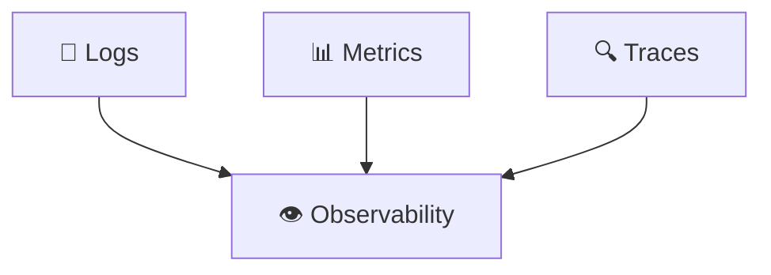
```mermaid
graph TD
    Logs[📝 Logs] --> Observability[👁️ Observability]
    Metrics[📊 Metrics] --> Observability
    Traces[🔍 Traces] --> Observability
```

**Implementation:**
- 📝 **Logs**: CloudWatch Logs
- 📊 **Metrics**: CloudWatch, Prometheus
- 🔍 **Traces**: X-Ray, Jaeger

### Monitoring Stack
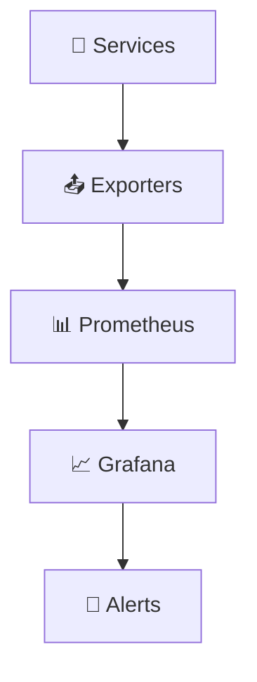
```mermaid
graph TD
    Services[🔧 Services] --> Exporters[📤 Exporters]
    Exporters --> Prometheus[📊 Prometheus]
    Prometheus --> Grafana[📈 Grafana]
    Grafana --> Alerts[🚨 Alerts]
```

---

## 💰 Cost Optimization

### Cost Reduction Strategies
```mermaid
pie title Cost Optimization
    "Reserved Instances" : 35
    "Spot Instances" : 25
    "Right-sizing" : 20
    "Storage Tiers" : 15
    "Monitoring" : 5
```

**Key Actions:**
- 🎫 **Reserved Instances**: Up to 75% savings
- ⚡ **Spot Instances**: Up to 90% discount
- 📏 **Right-sizing**: Match resources to demand
- 📦 **Storage Tiers**: S3 lifecycle policies

---

## 🚨 Incident Management

### Incident Response Process
```mermaid
flowchart TD
    Detect[🔍 Detect] --> Ack[✅ Acknowledge]
    Ack --> Assemble[👥 Assemble Team]
    Assemble --> Assess[📊 Assess]
    Assess --> Mitigate[🔧 Mitigate]
    Mitigate --> Resolve[✅ Resolve]
    Resolve --> Review[📚 Review]
```

**Key Roles:**
- 🎯 **Incident Commander**: Lead response
- 📊 **Communicator**: Stakeholder updates
- 🔧 **Technical Lead**: Fix implementation
- 📝 **Scribe**: Document timeline

---

## 👥 Leadership

### SRE Team Building
```mermaid
graph TD
    Hire[👤 Hire] --> Onboard[📚 Onboard]
    Onboard --> Mentor[🎓 Mentor]
    Mentor --> Grow[🌱 Grow]
    Grow --> Lead[👑 Lead]
```

**Leadership Skills:**
- 🎯 **Technical expertise**
- 🗣️ **Communication**
- 🤝 **Collaboration**
- 📚 **Continuous learning**

---

## 🎮 Gaming-Specific Scenarios

### Game Event Scaling
```mermaid
graph TD
    Event[🎮 Event] --> PreScale[📈 Pre-Scale]
    PreScale --> Monitor[👀 Monitor]
    Monitor --> Scale[⚡ Auto-Scale]
    Scale --> PostEvent[📊 Analyze]
```

**Key Metrics:**
- 👥 **Player count**
- ⚡ **Latency**
- 🎯 **Success rate**
- 💾 **Resource usage**

---

## 📋 Quick Reference

### AWS Services Cheat Sheet
| Service | Use Case | Key Feature |
|---------|----------|-------------|
| 🖥️ EC2 | Compute | Virtual servers |
| 🗄️ RDS | Database | Managed SQL |
| ⚡ Lambda | Serverless | Event-driven |
| ⚖️ ALB/NLB | Load Balancing | L4/L7 routing |
| 🌐 Route 53 | DNS | Failover & routing |
| 🚀 Global Accelerator | Performance | AWS backbone |
| 🌐 CloudFront | CDN | Global distribution |
| 📊 CloudWatch | Monitoring | Metrics & logs |

### SRE Formulas
```
Error Budget = 100% - SLO
Burn Rate = Error Budget Used / Time Elapsed
MTTR = Total Downtime / Number of Incidents
```

---

## 🎯 Interview Tips

### Common Question Types
1. **🏗️ Architecture Design**
2. **🚨 Incident Response**
3. **💰 Cost Optimization**
4. **👥 Leadership Experience**
5. **🔧 Technical Deep Dive**

### STAR Method
- **S**ituation: Context
- **T**ask: Goal
- **A**ction: What you did
- **R**esult: Outcome

---

## 📚 Study Plan

### Week-by-Week Preparation
| Week | Focus | Practice |
|------|-------|----------|
| 1 | AWS Architecture | Design diagrams |
| 2 | Reliability | SLO calculations |
| 3 | Scalability | Auto-scaling configs |
| 4 | Observability | Monitoring setup |
| 5 | Cost Optimization | Budget analysis |
| 6 | Incident Response | Mock scenarios |

---

**🎉 Good luck with your EA SRE 3 interview!**

*Remember: Focus on practical experience and real-world examples.*