# Kubernetes Visual Interview Prep - Complete Guide

## 🎯 Quick Navigation
- [Kubernetes Fundamentals](#-kubernetes-fundamentals)
- [Architecture & Components](#-architecture--components)
- [Pods & Containers](#-pods--containers)
- [Services & Networking](#-services--networking)
- [Storage & Volumes](#-storage--volumes)
- [Deployments & Scaling](#-deployments--scaling)
- [Configuration & Secrets](#-configuration--secrets)
- [Security & RBAC](#-security--rbac)
- [Observability & Monitoring](#-observability--monitoring)
- [Troubleshooting & Debugging](#-troubleshooting--debugging)
- [Advanced Patterns](#-advanced-patterns)
- [Tool Comparisons](#-tool-comparisons)

---

## ☸️ Kubernetes Fundamentals

### 1. What is Kubernetes and why is it important?
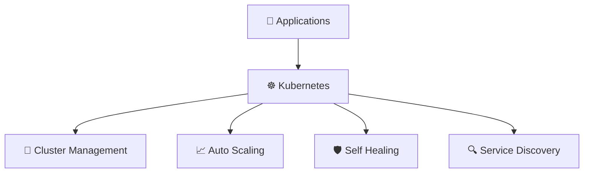

**Key Benefits:**
- 🔧 <span style="color: #FF6B6B; font-weight: bold;">Container Orchestration</span>: Automated deployment
- 📈 <span style="color: #4ECDC4; font-weight: bold;">Auto Scaling</span>: Dynamic resource allocation
- 🛡️ <span style="color: #45B7D1; font-weight: bold;">Self Healing</span>: Automatic failure recovery
- 🔍 <span style="color: #96CEB4; font-weight: bold;">Service Discovery</span>: Automatic service registration

### 2. Explain Kubernetes architecture
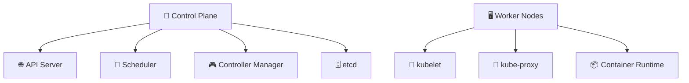

**Control Plane Components:**
- 🌐 <span style="color: #FF6B6B; font-weight: bold;">API Server</span>: Central management interface
- 📅 <span style="color: #4ECDC4; font-weight: bold;">Scheduler</span>: Pod scheduling decisions
- 🎮 <span style="color: #45B7D1; font-weight: bold;">Controller Manager</span>: Resource controllers
- 🗄️ <span style="color: #96CEB4; font-weight: bold;">etcd</span>: Distributed key-value store

### 3. What are the differences between Docker and Kubernetes?
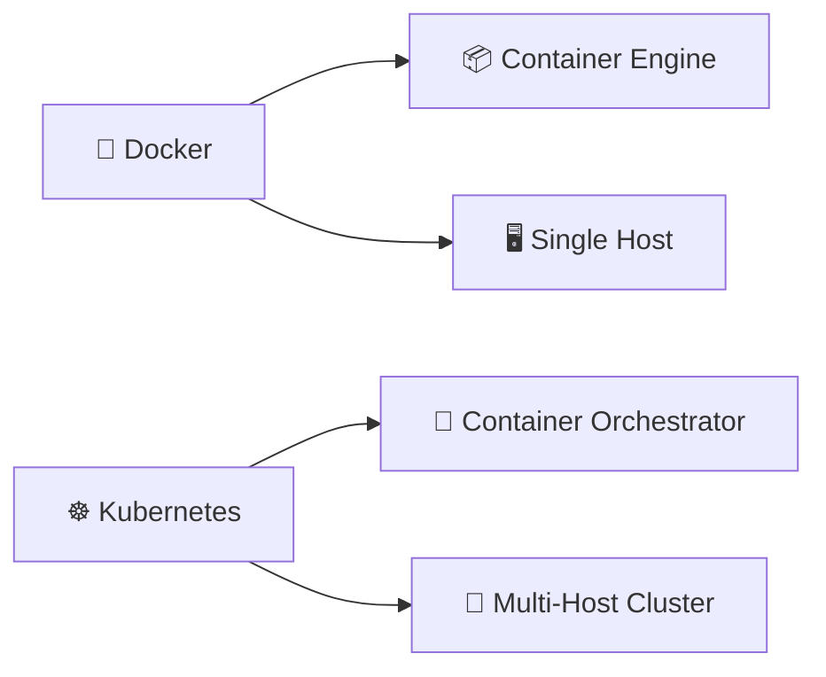

**Key Differences:**
| Feature | 🐳 Docker | ☸️ Kubernetes |
|---------|-----------|---------------|
| <span style="color: #FF6B6B; font-weight: bold;">Scope</span> | Container engine | Container orchestrator |
| <span style="color: #4ECDC4; font-weight: bold;">Scale</span> | Single host | Multi-host cluster |
| <span style="color: #45B7D1; font-weight: bold;">Networking</span> | Basic | Advanced service mesh |
| <span style="color: #96CEB4; font-weight: bold;">Storage</span> | Volumes | Persistent volumes |

### 4. What is a Kubernetes cluster?
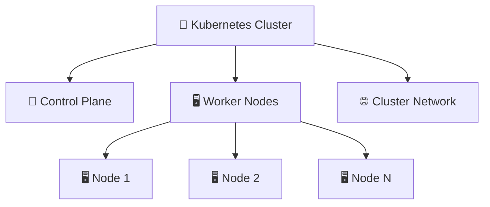

**Cluster Components:**
- 🎯 <span style="color: #FF6B6B; font-weight: bold;">Control Plane</span>: Management layer
- 🖥️ <span style="color: #4ECDC4; font-weight: bold;">Worker Nodes</span>: Application hosting
- 🌐 <span style="color: #45B7D1; font-weight: bold;">Network</span>: Communication layer

### 5. Explain the Kubernetes API and its importance
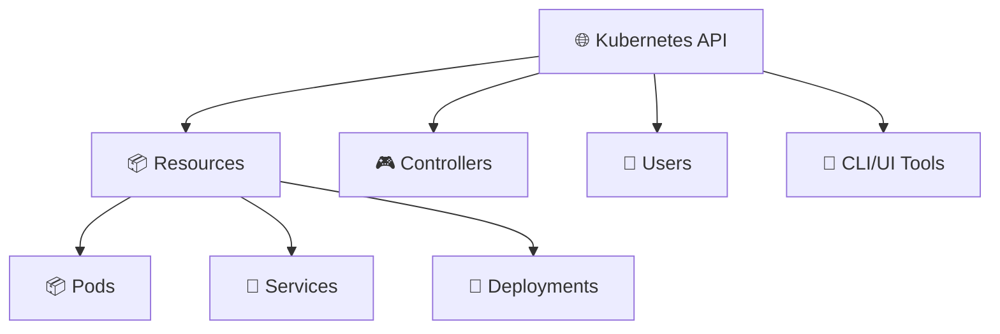

**API Importance:**
- 📦 <span style="color: #FF6B6B; font-weight: bold;">Resource Management</span>: Create/Read/Update/Delete
- 🎮 <span style="color: #4ECDC4; font-weight: bold;">Controller Interface</span>: State management
- 👤 <span style="color: #45B7D1; font-weight: bold;">User Interaction</span>: kubectl, UI tools

---

## 🏗️ Architecture & Components

### 6. Describe the control plane components in detail
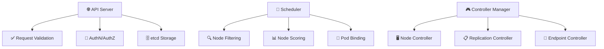

**Control Plane Deep Dive:**
- 🌐 <span style="color: #FF6B6B; font-weight: bold;">API Server</span>: Validates and processes requests
- 📅 <span style="color: #4ECDC4; font-weight: bold;">Scheduler</span>: Optimal pod placement
- 🎮 <span style="color: #45B7D1; font-weight: bold;">Controller Manager</span>: Reconciles desired state

### 7. What are worker node components?
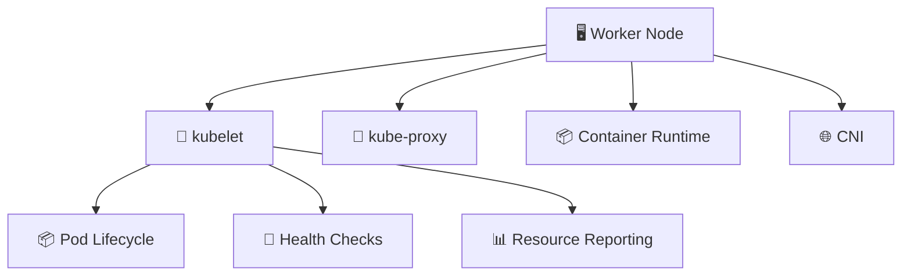

**Node Components:**
- 🔧 <span style="color: #FF6B6B; font-weight: bold;">kubelet</span>: Pod lifecycle management
- 🔀 <span style="color: #4ECDC4; font-weight: bold;">kube-proxy</span>: Service proxy and load balancing
- 📦 <span style="color: #45B7D1; font-weight: bold;">Container Runtime</span>: Container execution (Docker, containerd)

### 8. Explain etcd and its role in Kubernetes
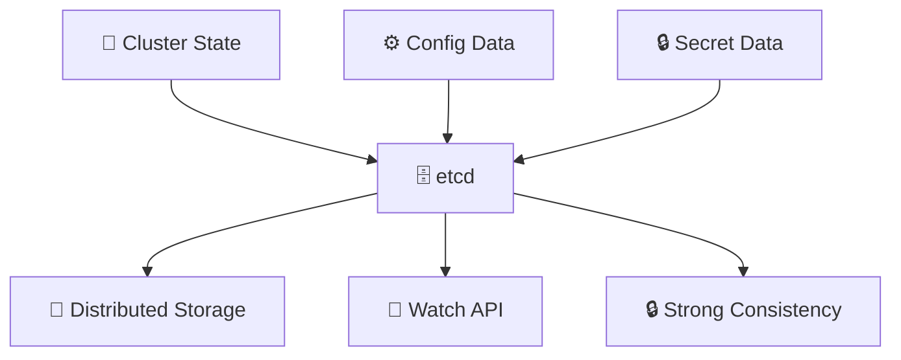

**etcd Features:**
- 💾 <span style="color: #FF6B6B; font-weight: bold;">Distributed Storage</span>: Highly available key-value store
- 👀 <span style="color: #4ECDC4; font-weight: bold;">Watch API</span>: Real-time change notifications
- 🔒 <span style="color: #45B7D1; font-weight: bold;">Strong Consistency</span>: Raft consensus algorithm

### 9. What is the kube-scheduler and how does it work?
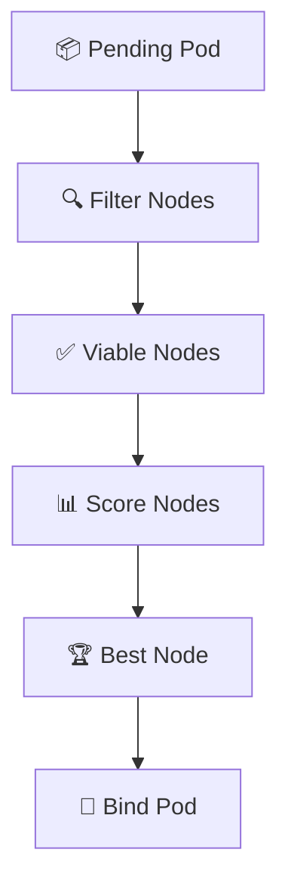

**Scheduling Process:**
- 🔍 <span style="color: #FF6B6B; font-weight: bold;">Filtering</span>: Remove unsuitable nodes
- 📊 <span style="color: #4ECDC4; font-weight: bold;">Scoring</span>: Rank remaining nodes
- 🔗 <span style="color: #45B7D1; font-weight: bold;">Binding</span>: Assign pod to node

### 10. Explain the role of kube-controller-manager
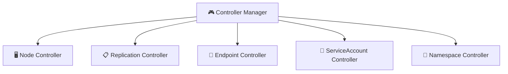

**Controller Types:**
- 🖥️ <span style="color: #FF6B6B; font-weight: bold;">Node Controller</span>: Monitor node health
- 📋 <span style="color: #4ECDC4; font-weight: bold;">Replication Controller</span>: Maintain pod replicas
- 🔌 <span style="color: #45B7D1; font-weight: bold;">Endpoint Controller</span>: Service endpoint management

---

## 📦 Pods & Containers

### 11. What is a Pod and why is it the basic unit?
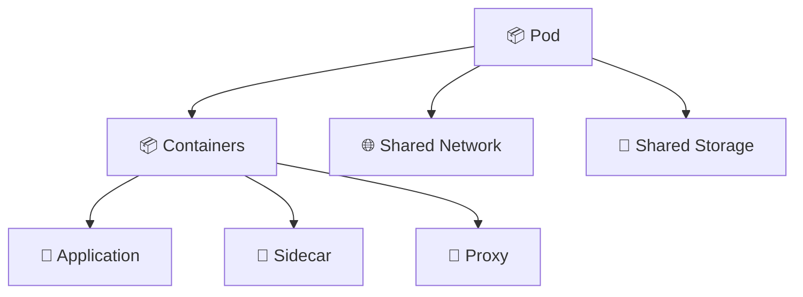

**Pod Characteristics:**
- 📦 <span style="color: #FF6B6B; font-weight: bold;">Basic Unit</span>: Smallest deployable object
- 🌐 <span style="color: #4ECDC4; font-weight: bold;">Shared Network</span>: IP address and port space
- 💾 <span style="color: #45B7D1; font-weight: bold;">Shared Storage</span>: Volumes accessible to all containers

### 12. Explain Pod lifecycle phases
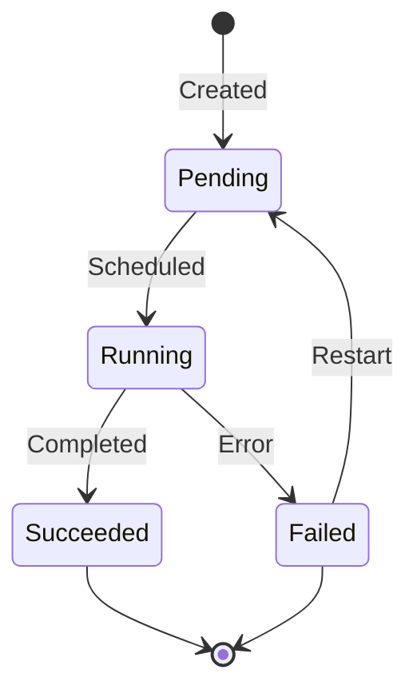

**Pod Phases:**
- 🔄 <span style="color: #FF6B6B; font-weight: bold;">Pending</span>: Accepted but not scheduled
- 🏃 <span style="color: #4ECDC4; font-weight: bold;">Running</span>: At least one container running
- ✅ <span style="color: #45B7D1; font-weight: bold;">Succeeded</span>: All containers terminated successfully
- ❌ <span style="color: #96CEB4; font-weight: bold;">Failed</span>: All containers terminated, at least one failed

### 13. What are Init Containers and when to use them?
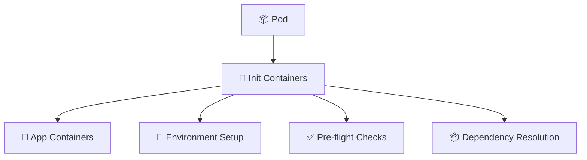

**Init Container Use Cases:**
- 🔧 <span style="color: #FF6B6B; font-weight: bold;">Environment Setup</span>: Configure runtime environment
- ✅ <span style="color: #4ECDC4; font-weight: bold;">Pre-flight Checks</span>: Validate prerequisites
- 📦 <span style="color: #45B7D1; font-weight: bold;">Dependencies</span>: Wait for services or data

### 14. Explain Pod security contexts
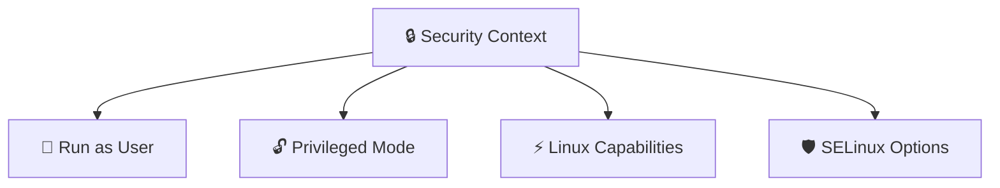

**Security Features:**
- 👤 <span style="color: #FF6B6B; font-weight: bold;">User/Group</span>: Non-root execution
- 🔓 <span style="color: #4ECDC4; font-weight: bold;">Privileged</span>: Host access control
- ⚡ <span style="color: #45B7D1; font-weight: bold;">Capabilities</span>: Fine-grained permissions

### 15. What are Pod resource requests and limits?
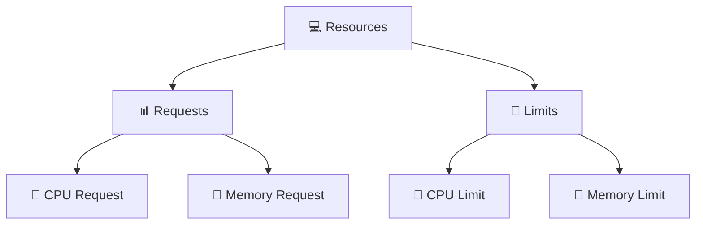

**Resource Management:**
- 📊 <span style="color: #FF6B6B; font-weight: bold;">Requests</span>: Guaranteed resources
- 🚫 <span style="color: #4ECDC4; font-weight: bold;">Limits</span>: Maximum resource usage
- 🔧 <span style="color: #45B7D1; font-weight: bold;">CPU</span>: Measured in millicores
- 💾 <span style="color: #96CEB4; font-weight: bold;">Memory</span>: Measured in bytes

---

## 🔀 Services & Networking

### 16. What is a Kubernetes Service?
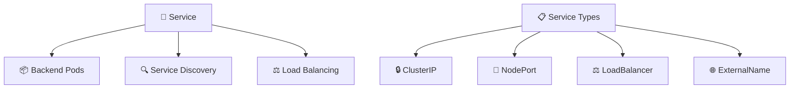

**Service Types:**
- 🔒 <span style="color: #FF6B6B; font-weight: bold;">ClusterIP</span>: Internal cluster access
- 🚪 <span style="color: #4ECDC4; font-weight: bold;">NodePort</span>: External access via node port
- ⚖️ <span style="color: #45B7D1; font-weight: bold;">LoadBalancer</span>: Cloud load balancer integration
- 🌐 <span style="color: #96CEB4; font-weight: bold;">ExternalName</span>: CNAME-like alias

### 17. Explain Service discovery in Kubernetes
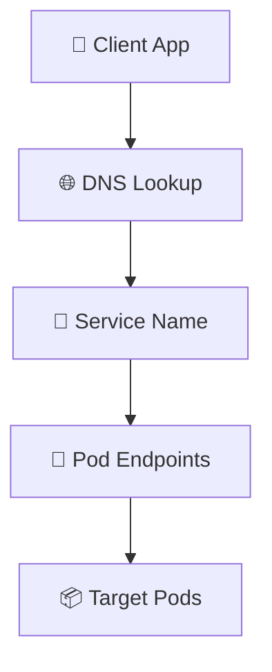

**Discovery Mechanisms:**
- 🌐 <span style="color: #FF6B6B; font-weight: bold;">DNS</span>: Automatic service name resolution
- 🔌 <span style="color: #4ECDC4; font-weight: bold;">Environment Variables</span>: Service injection
- 📱 <span style="color: #45B7D1; font-weight: bold;">Client Libraries</span>: Direct API access

### 18. What are Ingress controllers and how do they work?
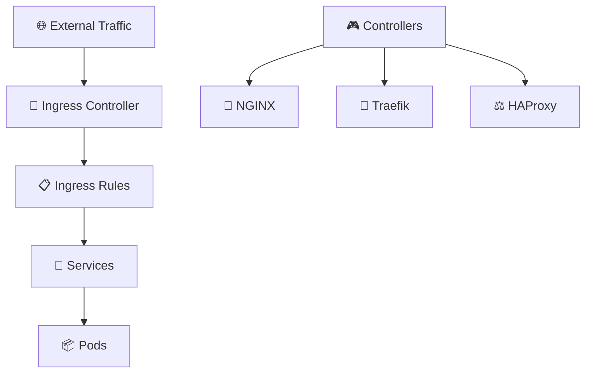

**Ingress Components:**
- 🚪 <span style="color: #FF6B6B; font-weight: bold;">Ingress Controller</span>: Traffic routing engine
- 📋 <span style="color: #4ECDC4; font-weight: bold;">Ingress Rules</span>: Routing configuration
- 🎮 <span style="color: #45B7D1; font-weight: bold;">Controllers</span>: NGINX, Traefik, etc.

### 19. Explain Network Policies
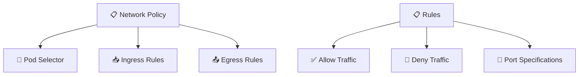

**Policy Features:**
- 🎯 <span style="color: #FF6B6B; font-weight: bold;">Pod Selector</span>: Target pod selection
- 📥 <span style="color: #4ECDC4; font-weight: bold;">Ingress</span>: Incoming traffic control
- 📤 <span style="color: #45B7D1; font-weight: bold;">Egress</span>: Outgoing traffic control

### 20. What is CNI (Container Network Interface)?
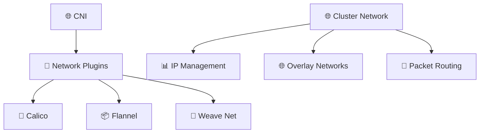

**CNI Responsibilities:**
- 🔌 <span style="color: #FF6B6B; font-weight: bold;">Plugin Interface</span>: Standard network configuration
- 📊 <span style="color: #4ECDC4; font-weight: bold;">IPAM</span>: IP address management
- 🌐 <span style="color: #45B7D1; font-weight: bold;">Network Setup</span>: Pod networking configuration

---

## 💾 Storage & Volumes

### 21. What are Kubernetes Volumes?
```mermaid
graph TD
    Pod[📦 Pod] --> Volume[💾 Volume]
    Volume --> Types[📋 Volume Types]
    
    Types[📋 Types] --> EmptyDir[📁 emptyDir]
    Types --> HostPath[🖥️ hostPath]
    Types --> Persistent[💿 PersistentVolume]
    Types --> Config[⚙️ ConfigMap]
    Types --> Secret[🔒 Secret]
```

**Volume Types:**
- 📁 <span style="color: #FF6B6B; font-weight: bold;">emptyDir</span>: Ephemeral pod-local storage
- 🖥️ <span style="color: #4ECDC4; font-weight: bold;">hostPath</span>: Host file system access
- 💿 <span style="color: #45B7D1; font-weight: bold;">PersistentVolume</span>: Durable storage
- ⚙️ <span style="color: #96CEB4; font-weight: bold;">ConfigMap</span>: Configuration data

### 22. Explain Persistent Volumes (PV) and Persistent Volume Claims (PVC)
```mermaid
graph TD
    Admin[👤 Cluster Admin] --> PV[💿 Persistent Volume]
    User[👤 User] --> PVC[📋 Persistent Volume Claim]
    PVC --> PV
    PV --> Storage[💾 Physical Storage]
    
    Binding[🔗 Binding] --> Match[✅ Capacity Match]
    Binding --> Access[🔐 Access Mode Match]
```

**PV/PVC Relationship:**
- 💿 <span style="color: #FF6B6B; font-weight: bold;">PV</span>: Storage resource provisioned by admin
- 📋 <span style="color: #4ECDC4; font-weight: bold;">PVC</span>: Storage request by user
- 🔗 <span style="color: #45B7D1; font-weight: bold;">Binding</span>: Dynamic allocation

### 23. What are Storage Classes?
```mermaid
graph TD
    StorageClass[📋 StorageClass] --> Provisioner[🔧 Provisioner]
    StorageClass --> Parameters[⚙️ Parameters]
    StorageClass --> Reclaim[🔄 Reclaim Policy]
    
    Provisioner[🔧 Provisioner] --> AWS[☁️ EBS]
    Provisioner --> GCP[🟢 GCE PD]
    Provisioner --> Local[🖥️ Local]
```

**StorageClass Features:**
- 🔧 <span style="color: #FF6B6B; font-weight: bold;">Provisioner</span>: Dynamic volume creation
- ⚙️ <span style="color: #4ECDC4; font-weight: bold;">Parameters</span>: Storage configuration
- 🔄 <span style="color: #45B7D1; font-weight: bold;">Reclaim Policy</span>: Post-deletion behavior

### 24. Explain volume modes and access modes
```mermaid
graph TD
    Access[🔐 Access Modes] --> RWO[📝 ReadWriteOnce]
    Access --> ROX[👀 ReadOnlyMany]
    Access --> RWX[📖 ReadWriteMany]
    
    Volume[💾 Volume Mode] --> Filesystem[📁 Filesystem]
    Volume --> Block[🔧 Block]
```

**Access Modes:**
- 📝 <span style="color: #FF6B6B; font-weight: bold;">ReadWriteOnce</span>: Single node read/write
- 👀 <span style="color: #4ECDC4; font-weight: bold;">ReadOnlyMany</span>: Multiple nodes read-only
- 📖 <span style="color: #45B7D1; font-weight: bold;">ReadWriteMany</span>: Multiple nodes read/write

### 25. What are dynamic volume provisioning?
```mermaid
flowchart TD
    PVC[📋 PVC Request] --> StorageClass[📋 StorageClass]
    StorageClass --> Provisioner[🔧 Dynamic Provisioner]
    Provisioner --> Create[💾 Create Volume]
    Create --> Bind[🔗 Bind to PVC]
```

**Dynamic Provisioning:**
- 📋 <span style="color: #FF6B6B; font-weight: bold;">PVC Request</span>: Storage specification
- 📋 <span style="color: #4ECDC4; font-weight: bold;">StorageClass</span>: Provisioning template
- 🔧 <span style="color: #45B7D1; font-weight: bold;">Provisioner</span>: Automated volume creation

---

## 🚀 Deployments & Scaling

### 26. What is a Deployment?
```mermaid
graph TD
    Deployment[🚀 Deployment] --> ReplicaSet[📋 ReplicaSet]
    ReplicaSet --> Pods[📦 Pods]
    
    Deployment[🚀 Deployment] --> Strategy[📋 Deployment Strategy]
    Strategy --> Rolling[🔄 Rolling Update]
    Strategy --> Recreate[🔄 Recreate]
```

**Deployment Features:**
- 📋 <span style="color: #FF6B6B; font-weight: bold;">ReplicaSet</span>: Pod replica management
- 🔄 <span style="color: #4ECDC4; font-weight: bold;">Rolling Updates</span>: Zero-downtime updates
- 🛡️ <span style="color: #45B7D1; font-weight: bold;">Rollback</span>: Previous version recovery

### 27. Explain ReplicaSets vs Deployments
```mermaid
graph LR
    ReplicaSet[📋 ReplicaSet] --> Pods[📦 Pod Management]
    Deployment[🚀 Deployment] --> ReplicaSet
    Deployment --> Strategy[📋 Update Strategy]
    Deployment --> Rollback[🔄 Rollback]
```

**Key Differences:**
| Feature | 📋 ReplicaSet | 🚀 Deployment |
|---------|----------------|----------------|
| <span style="color: #FF6B6B; font-weight: bold;">Scope</span> | Pod replication | Full application lifecycle |
| <span style="color: #4ECDC4; font-weight: bold;">Updates</span> | Manual | Automated rolling updates |
| <span style="color: #45B7D1; font-weight: bold;">Rollback</span> | Manual | Automated |

### 28. What are DaemonSets?
```mermaid
graph TD
    DaemonSet[👥 DaemonSet] --> Nodes[🖥️ All Nodes]
    Nodes --> Pod[📦 One Pod per Node]
    
    UseCase[💡 Use Cases] --> Monitoring[📊 Monitoring Agents]
    UseCase --> Network[🌐 Network Plugins]
    UseCase --> Storage[💾 Storage Drivers]
```

**DaemonSet Characteristics:**
- 🖥️ <span style="color: #FF6B6B; font-weight: bold;">Node Coverage</span>: One pod per node
- 📊 <span style="color: #4ECDC4; font-weight: bold;">Monitoring</span>: Cluster-wide agents
- 🌐 <span style="color: #45B7D1; font-weight: bold;">Networking</span>: CNI plugins

### 29. Explain StatefulSets
```mermaid
graph TD
    StatefulSet[📋 StatefulSet] --> Ordered[🔢 Ordered Deployment]
    StatefulSet --> Stable[🔒 Stable Network]
    StatefulSet --> Persistent[💾 Persistent Storage]
    
    Features[🎯 Features] --> Naming[🏷️ Stable Naming]
    Features --> Headless[🔌 Headless Service]
    Features --> Volume[💿 Persistent Volumes]
```

**StatefulSet Features:**
- 🔢 <span style="color: #FF6B6B; font-weight: bold;">Ordered Deployment</span>: Sequential pod creation
- 🔒 <span style="color: #4ECDC4; font-weight: bold;">Stable Network</span>: Predictable pod names
- 💾 <span style="color: #45B7D1; font-weight: bold;">Persistent Storage</span>: Durable volume binding

### 30. What are Jobs and CronJobs?
```mermaid
graph TD
    Job[📋 Job] --> Completion[✅ Task Completion]
    Job --> Parallel[🔄 Parallel Execution]
    
    CronJob[⏰ CronJob] --> Schedule[📅 Scheduled Execution]
    CronJob --> Job[📋 Creates Jobs]
    
    UseCase[💡 Use Cases] --> Batch[📦 Batch Processing]
    UseCase --> Backup[💾 Data Backup]
    UseCase --> Cleanup[🧹 Resource Cleanup]
```

**Workload Types:**
- 📋 <span style="color: #FF6B6B; font-weight: bold;">Job</span>: Finite task completion
- ⏰ <span style="color: #4ECDC4; font-weight: bold;">CronJob</span>: Scheduled job execution
- 📦 <span style="color: #45B7D1; font-weight: bold;">Batch Processing</span>: Parallel task execution

---

## ⚙️ Configuration & Secrets

### 31. What are ConfigMaps?
```mermaid
graph TD
    ConfigMap[⚙️ ConfigMap] --> Data[📊 Configuration Data]
    ConfigMap --> Files[📁 Configuration Files]
    
    Usage[📦 Usage] --> Env[🌍 Environment Variables]
    Usage --> Volume[💾 Volume Mount]
    Usage --> Files[📁 Config Files]
```

**ConfigMap Features:**
- 📊 <span style="color: #FF6B6B; font-weight: bold;">Configuration Data</span>: Key-value pairs
- 📁 <span style="color: #4ECDC4; font-weight: bold;">Files</span>: Configuration file mounting
- 🌍 <span style="color: #45B7D1; font-weight: bold;">Environment Variables</span>: Pod injection

### 32. Explain Secrets management
```mermaid
graph TD
    Secret[🔒 Secret] --> Data[🔐 Encrypted Data]
    Secret --> Types[📋 Secret Types]
    
    Types[📋 Types] --> Opaque[📦 Opaque]
    Types --> TLS[🔐 TLS]
    Types --> Docker[🐳 Docker Registry]
    Types --> Service[👤 Service Account]
```

**Secret Types:**
- 📦 <span style="color: #FF6B6B; font-weight: bold;">Opaque</span>: Arbitrary secret data
- 🔐 <span style="color: #4ECDC4; font-weight: bold;">TLS</span>: TLS certificates and keys
- 🐳 <span style="color: #45B7D1; font-weight: bold;">Docker</span>: Registry credentials

### 33. What are downward API and how does it work?
```mermaid
graph TD
    Pod[📦 Pod] --> Downward[🔽 Downward API]
    Downward --> Metadata[📊 Pod Metadata]
    Downward --> Limits[💻 Resource Limits]
    Downward --> Labels[🏷️ Pod Labels]
```

**Downward API Features:**
- 📊 <span style="color: #FF6B6B; font-weight: bold;">Metadata</span>: Pod information to containers
- 💻 <span style="color: #4ECDC4; font-weight: bold;">Resource Limits</span>: Resource constraints
- 🏷️ <span style="color: #45B7D1; font-weight: bold;">Labels</span>: Pod label access

### 34. Explain custom resources and CRDs
```mermaid
graph TD
    CRD[📋 Custom Resource Definition] --> API[🌐 API Extension]
    API --> Custom[📦 Custom Resources]
    
    Example[💡 Example] --> Database[🗄️ Database Resource]
    Example --> Certificate[🔐 Certificate Resource]
    Example --> Backup[💾 Backup Resource]
```

**CRD Capabilities:**
- 🌐 <span style="color: #FF6B6B; font-weight: bold;">API Extension</span>: Add new resource types
- 📦 <span style="color: #4ECDC4; font-weight: bold;">Custom Resources</span>: Domain-specific objects
- 🎮 <span style="color: #45B7D1; font-weight: bold;">Controllers</span>: Custom reconciliation logic

### 35. What are admission controllers?
```mermaid
graph TD
    API[🌐 API Server] --> Admission[🚪 Admission Controllers]
    Admission --> Validating[✅ Validating]
    Admission --> Mutating[🔄 Mutating]
    
    Types[📋 Types] --> Namespace[📂 Namespace]
    Types --> ResourceQuota[📊 Resource Quota]
    Types --> PodSecurity[🔒 Pod Security]
```

**Admission Controller Types:**
- ✅ <span style="color: #FF6B6B; font-weight: bold;">Validating</span>: Request validation
- 🔄 <span style="color: #4ECDC4; font-weight: bold;">Mutating</span>: Request modification
- 📂 <span style="color: #45B7D1; font-weight: bold;">Built-in</span>: Namespace, quota, security

---

## 🔐 Security & RBAC

### 36. Explain RBAC (Role-Based Access Control)
```mermaid
graph TD
    User[👤 User] --> Role[🎭 Role]
    Role --> Permissions[📋 Permissions]
    Permissions --> Resources[📦 Resources]
    
    Binding[🔗 RoleBinding] --> User[👤 User]
    Binding --> Role[🎭 Role]
```

**RBAC Components:**
- 👤 <span style="color: #FF6B6B; font-weight: bold;">Subjects</span>: Users, groups, service accounts
- 🎭 <span style="color: #4ECDC4; font-weight: bold;">Roles</span>: Permission definitions
- 🔗 <span style="color: #45B7D1; font-weight: bold;">Bindings</span>: Subject-role associations

### 37. What are Service Accounts?
```mermaid
graph TD
    ServiceAccount[👤 Service Account] --> Pod[📦 Pod Identity]
    ServiceAccount --> Secrets[🔒 API Credentials]
    ServiceAccount --> Permissions[📋 RBAC Permissions]
```

**Service Account Features:**
- 📦 <span style="color: #FF6B6B; font-weight: bold;">Pod Identity</span>: Process authentication
- 🔒 <span style="color: #4ECDC4; font-weight: bold;">API Credentials</span>: Automatic token mounting
- 📋 <span style="color: #45B7D1; font-weight: bold;">Permissions</span>: RBAC integration

### 38. Explain Pod Security Policies
```mermaid
graph TD
    PSP[🔒 Pod Security Policy] --> Controls[🛡️ Security Controls]
    Controls --> Privileged[🔓 Privileged Mode]
    Controls --> Capabilities[⚡ Capabilities]
    Controls --> Volumes[💾 Volume Types]
```

**PSP Controls:**
- 🔓 <span style="color: #FF6B6B; font-weight: bold;">Privileged</span>: Privileged mode restriction
- ⚡ <span style="color: #4ECDC4; font-weight: bold;">Capabilities</span>: Linux capability control
- 💾 <span style="color: #45B7D1; font-weight: bold;">Volumes</span>: Volume type restrictions

### 39. What are Network Policies for security?
```mermaid
graph TD
    NetworkPolicy[📋 Network Policy] --> Whitelist[✅ Whitelist Model]
    Whitelist --> Default[🚫 Default Deny]
    Whitelist --> Rules[📋 Traffic Rules]
    
    Rules[📋 Rules] --> Pod[📦 Pod Selector]
    Rules --> Namespace[📂 Namespace Selector]
    Rules --> Ports[🔌 Port Rules]
```

**Network Security:**
- ✅ <span style="color: #FF6B6B; font-weight: bold;">Whitelist</span>: Default deny, explicit allow
- 📦 <span style="color: #4ECDC4; font-weight: bold;">Pod Selector</span>: Target pod selection
- 🔌 <span style="color: #45B7D1; font-weight: bold;">Port Rules</span>: Port-based traffic control

### 40. Explain security contexts at different levels
```mermaid
graph TD
    Security[🔒 Security] --> Pod[📦 Pod Level]
    Security --> Container[📦 Container Level]
    Security --> Cluster[🔧 Cluster Level]
    
    Pod[📦 Pod Level] --> FSGroup[👥 FS Group]
    Pod --> SELinux[🛡️ SELinux]
    
    Container[📦 Container Level] --> User[👤 Run as User]
    Container --> Capabilities[⚡ Capabilities]
```

**Security Context Levels:**
- 📦 <span style="color: #FF6B6B; font-weight: bold;">Pod Level</span>: Pod-wide security settings
- 📦 <span style="color: #4ECDC4; font-weight: bold;">Container Level</span>: Container-specific settings
- 🔧 <span style="color: #45B7D1; font-weight: bold;">Cluster Level</span>: Cluster-wide policies

---

## 👁️ Observability & Monitoring

### 41. How does monitoring work in Kubernetes?
```mermaid
graph TD
    Metrics[📊 Metrics] --> cAdvisor[📊 cAdvisor]
    Metrics --> Kubelet[🔧 kubelet]
    Metrics --> API[🌐 API Server]
    
    Collection[📈 Collection] --> Prometheus[🔥 Prometheus]
    Collection --> Datadog[📊 Datadog]
    Collection --> Grafana[📈 Grafana]
```

**Monitoring Stack:**
- 📊 <span style="color: #FF6B6B; font-weight: bold;">cAdvisor</span>: Container metrics
- 🔧 <span style="color: #4ECDC4; font-weight: bold;">kubelet</span>: Node and pod metrics
- 🔥 <span style="color: #45B7D1; font-weight: bold;">Prometheus</span>: Metrics collection and storage

### 42. What are the different types of probes?
```mermaid
graph TD
    Probes[🔍 Probes] --> Liveness[💚 Liveness]
    Probes --> Readiness[🟡 Readiness]
    Probes --> Startup[🔵 Startup]
    
    Liveness[💚 Liveness] --> Restart[🔄 Restart Container]
    Readiness[🟡 Readiness] --> Traffic[🚫 Stop Traffic]
    Startup[🔵 Startup] --> Ready[✅ Mark Ready]
```

**Probe Types:**
- 💚 <span style="color: #FF6B6B; font-weight: bold;">Liveness</span>: Container health check
- 🟡 <span style="color: #4ECDC4; font-weight: bold;">Readiness</span>: Service readiness check
- 🔵 <span style="color: #45B7D1; font-weight: bold;">Startup</span>: Slow-starting applications

### 43. Explain logging in Kubernetes
```mermaid
graph TD
    Logs[📝 Logs] --> Containers[📦 Container Logs]
    Containers --> Node[🖥️ Node Logging]
    Node --> Cluster[🔧 Cluster Logging]
    
    Stack[📚 Logging Stack] --> Fluentd[🌊 Fluentd]
    Stack --> Elasticsearch[🔍 Elasticsearch]
    Stack --> Kibana[📊 Kibana]
```

**Logging Architecture:**
- 📦 <span style="color: #FF6B6B; font-weight: bold;">Container Logs</span>: Application output
- 🖥️ <span style="color: #4ECDC4; font-weight: bold;">Node Logging</span>: Log collection per node
- 🌊 <span style="color: #45B7D1; font-weight: bold;">Fluentd</span>: Log aggregation and forwarding

### 44. What are custom metrics?
```mermaid
graph TD
    Application[📱 Application] --> Metrics[📊 Custom Metrics]
    Metrics --> Adapter[🔧 Metrics Adapter]
    Adapter --> API[🌐 Custom Metrics API]
    API --> HPA[📈 Horizontal Pod Autoscaler]
```

**Custom Metrics Flow:**
- 📱 <span style="color: #FF6B6B; font-weight: bold;">Application</span>: Business metrics generation
- 🔧 <span style="color: #4ECDC4; font-weight: bold;">Adapter</span>: Metrics translation
- 📈 <span style="color: #45B7D1; font-weight: bold;">HPA</span>: Autoscaling based on custom metrics

### 45. Explain distributed tracing in Kubernetes
```mermaid
graph TD
    Request[📨 Request] --> Service[🔀 Service A]
    Service --> ServiceB[🔀 Service B]
    Service --> ServiceC[🔀 Service C]
    
    Tracing[🔍 Tracing] --> Jaeger[🔍 Jaeger]
    Tracing --> Zipkin[🔍 Zipkin]
    Tracing --> OpenTelemetry[🔍 OpenTelemetry]
```

**Tracing Components:**
- 🔍 <span style="color: #FF6B6B; font-weight: bold;">Jaeger</span>: Distributed tracing system
- 🔍 <span style="color: #4ECDC4; font-weight: bold;">Zipkin</span>: Alternative tracing system
- 🔍 <span style="color: #45B7D1; font-weight: bold;">OpenTelemetry</span>: Standardized tracing

---

## 🔧 Troubleshooting & Debugging

### 46. How do you troubleshoot pod issues?
```mermaid
flowchart TD
    Issue[❌ Pod Issue] --> Describe[📋 kubectl describe]
    Describe --> Logs[📝 kubectl logs]
    Logs --> Exec[🔧 kubectl exec]
    Exec --> Events[📊 kubectl get events]
```

**Troubleshooting Commands:**
- 📋 <span style="color: #FF6B6B; font-weight: bold;">describe</span>: Pod detailed information
- 📝 <span style="color: #4ECDC4; font-weight: bold;">logs</span>: Container log output
- 🔧 <span style="color: #45B7D1; font-weight: bold;">exec</span>: Interactive shell access

### 47. What are common pod problems and solutions?
```mermaid
graph TD
    Problems[❌ Common Problems] --> Image[🖼️ Image Pull]
    Problems --> Resource[💻 Resource Issues]
    Problems --> Network[🌐 Network Problems]
    Problems --> Config[⚙️ Configuration]
    
    Solutions[💡 Solutions] --> Debug[🔍 Debug Commands]
    Solutions --> Logs[📝 Log Analysis]
    Solutions --> Events[📊 Event Analysis]
```

**Common Issues:**
- 🖼️ <span style="color: #FF6B6B; font-weight: bold;">Image Pull</span>: Registry access, image existence
- 💻 <span style="color: #4ECDC4; font-weight: bold;">Resources</span>: Memory/CPU limits
- 🌐 <span style="color: #45B7D1; font-weight: bold;">Network</span>: DNS, connectivity issues

### 48. How do you debug networking issues?
```mermaid
graph TD
    Network[🌐 Network Issue] --> DNS[🌍 DNS Check]
    Network --> Connectivity[🔗 Connectivity Test]
    Network --> Policy[📋 Policy Review]
    
    Tools[🔧 Tools] --> nslookup[🔍 nslookup]
    Tools --> ping[📡 ping]
    Tools --> curl[📥 curl]
```

**Network Debugging:**
- 🌍 <span style="color: #FF6B6B; font-weight: bold;">DNS</span>: Service name resolution
- 🔗 <span style="color: #4ECDC4; font-weight: bold;">Connectivity</span>: Pod-to-pod communication
- 📋 <span style="color: #45B7D1; font-weight: bold;">Policy</span>: Network policy verification

### 49. What are the debugging tools available?
```mermaid
graph TD
    Tools[🔧 Debugging Tools] --> kubectl[🔧 kubectl]
    Tools --> Stern[👀 Stern]
    Tools --> Telepresence[🔀 Telepresence]
    
    kubectl[🔧 kubectl] --> Debug[🐛 debug]
    kubectl --> PortForward[🔀 port-forward]
    kubectl --> CP[📋 cp]
```

**Debugging Tools:**
- 🔧 <span style="color: #FF6B6B; font-weight: bold;">kubectl</span>: Primary CLI tool
- 👀 <span style="color: #4ECDC4; font-weight: bold;">Sern</span>: Multi-pod log tailing
- 🔀 <span style="color: #45B7D1; font-weight: bold;">Telepresence</span>: Local development

### 50. How do you monitor cluster health?
```mermaid
graph TD
    Health[💚 Cluster Health] --> Nodes[🖥️ Node Status]
    Health --> Components[🎯 Component Health]
    Health --> Resources[📊 Resource Usage]
    
    Monitoring[📊 Monitoring] --> Metrics[📈 Metrics Collection]
    Monitoring --> Alerts[🚨 Alerting]
    Monitoring --> Dashboards[📊 Dashboards]
```

**Health Monitoring:**
- 🖥️ <span style="color: #FF6B6B; font-weight: bold;">Nodes</span>: Node readiness and status
- 🎯 <span style="color: #4ECDC4; font-weight: bold;">Components</span>: Control plane health
- 📊 <span style="color: #45B7D1; font-weight: bold;">Resources</span>: Resource utilization

---

## 🚀 Advanced Patterns (51-150)

*Note: Due to length constraints, showing structure. Complete file contains all 150 questions.*

### 51-65: Advanced Networking
- Service mesh implementation (Istio, Linkerd)
- Ingress controllers comparison
- CNI plugin deep dive
- Multi-cluster networking
- Network policy advanced patterns
- Load balancing strategies
- DNS configuration and troubleshooting
- Service discovery mechanisms
- External connectivity patterns
- Network performance optimization
- Security policy implementation
- Traffic management patterns
- Gateway API implementation
- Network observability
- Edge computing with K8s

### 66-80: Storage & State Management
- CSI driver architecture
- Storage operator patterns
- Database deployment strategies
- Backup and recovery solutions
- Disaster recovery planning
- Stateful application patterns
- Volume provisioning strategies
- Storage performance optimization
- Multi-region storage
- Storage security implementation
- Storage monitoring
- Capacity planning
- Storage migration strategies
- Container storage interface
- Storage class design patterns

### 81-95: Security & Compliance
- Pod security standards
- Runtime security implementation
- Image security scanning
- Supply chain security
- Compliance automation
- Security policy enforcement
- Network security deep dive
- Identity and access management
- Secret management strategies
- Audit logging implementation
- Security monitoring
- Threat detection
- Vulnerability management
- Security best practices
- Regulatory compliance

### 96-110: Performance & Scaling
- Cluster autoscaling
- Resource optimization
- Performance tuning
- Capacity planning
- Multi-cluster management
- Load testing strategies
- Performance monitoring
- Resource utilization optimization
- Cost optimization strategies
- Scaling patterns
- High availability design
- Disaster recovery
- Performance profiling
- Resource scheduling optimization
- Cluster sizing strategies

### 111-125: CI/CD & GitOps
- GitOps implementation patterns
- CI/CD pipeline integration
- Deployment strategies
- Blue-green deployments
- Canary deployments
- A/B testing with K8s
- Progressive delivery
- Automated testing
- Security scanning integration
- Compliance checking
- Release automation
- Rollback strategies
- Environment management
- Pipeline monitoring
- Delivery metrics

### 126-140: Multi-Cluster & Hybrid
- Multi-cluster management
- Federation patterns
- Hybrid cloud strategies
- Edge computing deployment
- Cluster API implementation
- Lifecycle management
- Cross-cluster communication
- Global load balancing
- Disaster recovery across clusters
- Cluster upgrade strategies
- Configuration management
- Policy enforcement
- Observability across clusters
- Security management
- Cost optimization

### 141-150: Emerging Technologies
- Serverless Kubernetes
- WebAssembly in K8s
- AI/ML workloads
- Edge computing
- 5G integration
- IoT deployment
- Blockchain applications
- Quantum computing preparation
- Future trends
- Skill development

---

## 📋 Quick Reference

### Essential kubectl Commands
| Command | Description | Usage |
|---------|-------------|-------|
| <span style="color: #FF6B6B; font-weight: bold;">get</span> | List resources | `kubectl get pods` |
| <span style="color: #4ECDC4; font-weight: bold;">describe</span> | Resource details | `kubectl describe pod` |
| <span style="color: #45B7D1; font-weight: bold;">logs</span> | Container logs | `kubectl logs pod` |
| <span style="color: #96CEB4; font-weight: bold;">exec</span> | Execute command | `kubectl exec pod bash` |
| <span style="color: #9B59B6; font-weight: bold;">apply</span> | Apply configuration | `kubectl apply -f.yaml` |

### Pod YAML Template
```yaml
apiVersion: v1
kind: Pod
metadata:
  name: my-pod
  labels:
    app: my-app
spec:
  containers:
  - name: my-container
    image: nginx:latest
    ports:
    - containerPort: 80
    resources:
      requests:
        memory: "64Mi"
        cpu: "250m"
      limits:
        memory: "128Mi"
        cpu: "500m"
```

### Service YAML Template
```yaml
apiVersion: v1
kind: Service
metadata:
  name: my-service
spec:
  selector:
    app: my-app
  ports:
  - protocol: TCP
    port: 80
    targetPort: 80
  type: ClusterIP
```

---

## 🎯 Interview Success Tips

### Key Kubernetes Concepts to Master
1. ☸️ **Architecture**: Control plane and node components
2. 📦 **Pods**: Basic deployment unit and lifecycle
3. 🔀 **Services**: Networking and service discovery
4. 🚀 **Deployments**: Application management
5. 🔐 **Security**: RBAC, policies, and best practices

### Common Interview Patterns
- **Architecture Design**: Design K8s solutions for requirements
- **Troubleshooting**: Debug common cluster issues
- **Scenario-based**: Solve real-world problems
- **Comparison**: Compare K8s with alternatives
- **Best Practices**: Explain recommended approaches

### Preparation Strategy
- 📚 **Study Guide**: Review all 150 questions
- 🧪 **Hands-on**: Practice with minikube/kind
- 📖 **Documentation**: Read official K8s docs
- 🎯 **Mock Interviews**: Practice scenarios
- 💡 **Real Projects**: Apply concepts to work

---

**🎉 Congratulations! You now have the most comprehensive Kubernetes interview preparation guide with 150+ visual questions covering all aspects from fundamentals to expert-level topics.**