# Operating System Visual Interview Prep - Complete Guide

## 🎯 Quick Navigation
- [OS Fundamentals](#-os-fundamentals)
- [Process Management](#-process-management)
- [Memory Management](#-memory-management)
- [File Systems](#-file-systems)
- [I/O Management](#-io-management)
- [Storage Management](#-storage-management)
- [Security & Permissions](#-security--permissions)
- [Networking in OS](#-networking-in-os)
- [System Calls](#-system-calls)
- [Virtualization](#-virtualization)
- [Performance Monitoring](#-performance-monitoring)
- [Troubleshooting](#-troubleshooting)
- [Advanced Topics](#-advanced-topics)
- [Tool Comparisons](#-tool-comparisons)

---

## 💻 OS Fundamentals

### 1. What is an operating system?
```mermaid
graph TD
    OS[💻 Operating System] --> Hardware[🖥️ Hardware Management]
    OS --> Software[💻 Software Execution]
    OS --> Resources[📊 Resource Allocation]
    
    Functions[⚡ Core Functions] --> Process[🔄 Process Management]
    Functions --> Memory[💾 Memory Management]
    Functions --> Storage[💽 Storage Management]
    Functions --> IO[📡 I/O Management]
    Functions --> Security[🔒 Security & Protection]
    
    Types[📋 Types] --> Batch[📦 Batch OS]
    Types --> TimeSharing[⏰ Time-Sharing]
    Types --> RealTime[⚡ Real-Time]
    Types --> Distributed[🌐 Distributed]
    Types --> Embedded[🔧 Embedded]
```

**OS Definition:**
- 🖥️ <span style="color: #FF6B6B; font-weight: bold;">Hardware Management</span>: Control and coordinate hardware resources
- 💻 <span style="color: #4ECDC4; font-weight: bold;">Software Execution</span>: Provide environment for program execution
- 📊 <span style="color: #45B7D1; font-weight: bold;">Resource Allocation</span>: Manage CPU, memory, I/O devices
- 🔄 <span style="color: #96CEB4; font-weight: bold;">Process Management</span>: Control program execution
- 💾 <span style="color: #9B59B6; font-weight: bold;">Memory Management</span>: Allocate and manage memory
- 💽 <span style="color: #E67E22; font-weight: bold;">Storage Management</span>: Handle file systems and storage

### 2. Explain kernel vs user space
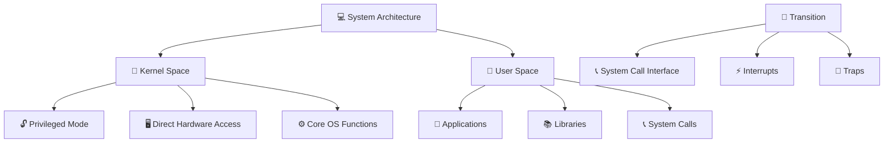

**Space Separation:**
- 🎯 <span style="color: #FF6B6B; font-weight: bold;">Kernel Space</span>: Privileged, direct hardware access, core OS functions
- 👤 <span style="color: #4ECDC4; font-weight: bold;">User Space</span>: Unprivileged, application execution, system call interface
- 📞 <span style="color: #45B7D1; font-weight: bold;">System Calls</span>: Controlled interface between spaces
- ⚡ <span style="color: #96CEB4; font-weight: bold;">Interrupts</span>: Hardware signals to kernel

### 3. What are the main OS components?
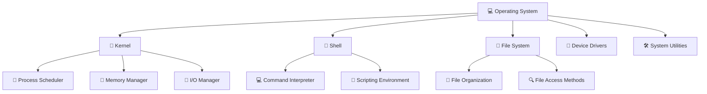

**OS Components:**
- 🎯 <span style="color: #FF6B6B; font-weight: bold;">Kernel</span>: Core OS functionality, resource management
- 🐚 <span style="color: #4ECDC4; font-weight: bold;">Shell</span>: Command interpreter and user interface
- 📁 <span style="color: #45B7D1; font-weight: bold;">File System</span>: File organization and storage management
- 🔌 <span style="color: #96CEB4; font-weight: bold;">Device Drivers</span>: Hardware device communication
- 🛠️ <span style="color: #9B59B6; font-weight: bold;">System Utilities</span>: Administrative and diagnostic tools

### 4. Explain OS boot process
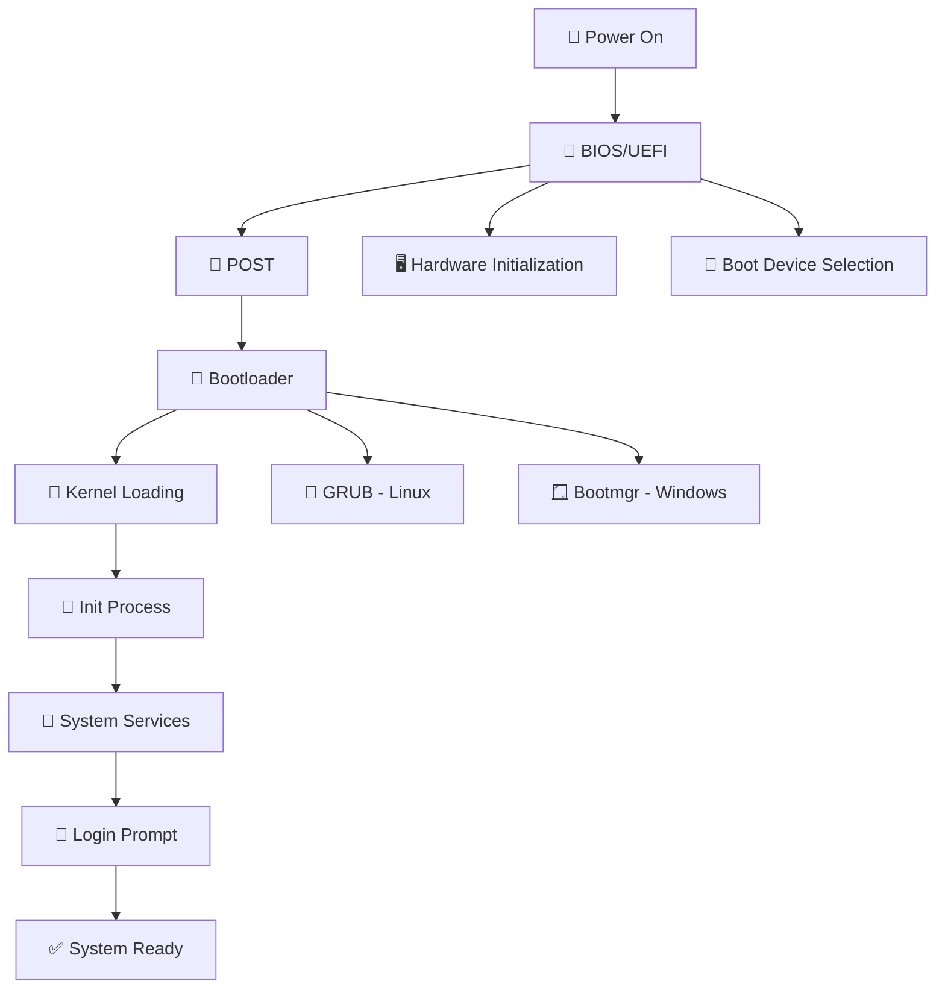

**Boot Sequence:**
- 🔌 <span style="color: #FF6B6B; font-weight: bold;">Power On</span>: System power initialization
- 🔧 <span style="color: #4ECDC4; font-weight: bold;">BIOS/UEFI</span>: Firmware initialization, hardware checks
- 🧪 <span style="color: #45B7D1; font-weight: bold;">POST</span>: Power-on self-test, hardware verification
- 🚀 <span style="color: #96CEB4; font-weight: bold;">Bootloader</span>: Load kernel into memory
- 🎯 <span style="color: #9B59B6; font-weight: bold;">Kernel</span>: Initialize core OS components
- 🚀 <span style="color: #E67E22; font-weight: bold;">Init</span>: Start system services and user space

### 5. What are interrupts and their types?
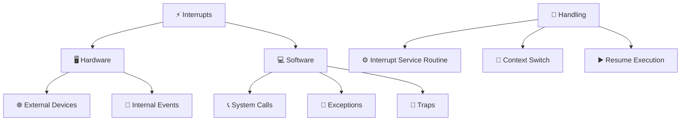

**Interrupt Types:**
- 🖥️ <span style="color: #FF6B6B; font-weight: bold;">Hardware</span>: External devices (keyboard, disk, network)
- 💻 <span style="color: #4ECDC4; font-weight: bold;">Software</span>: Program-generated (system calls, exceptions)
- 🚨 <span style="color: #45B7D1; font-weight: bold;">Exceptions</span>: Error conditions (divide by zero, page fault)
- 🎯 <span style="color: #96CEB4; font-weight: bold;">Traps</span>: Intentional software interrupts (debugging)

---

## 🔄 Process Management

### 6. What is a process?
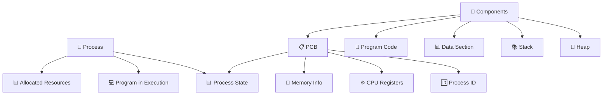

**Process Definition:**
- 💻 <span style="color: #FF6B6B; font-weight: bold;">Program in Execution</span>: Active program instance
- 📊 <span style="color: #4ECDC4; font-weight: bold;">Allocated Resources</span>: CPU, memory, I/O devices
- 📋 <span style="color: #45B7D1; font-weight: bold;">Current State</span>: Ready, running, waiting, terminated
- 📋 <span style="color: #96CEB4; font-weight: bold;">PCB</span>: Process metadata and context

### 7. Explain process states and transitions
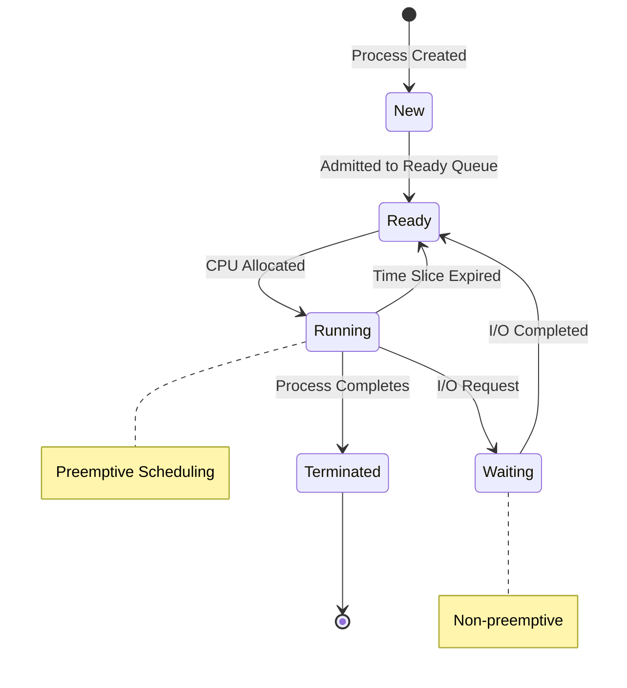

**Process States:**
- 🆕 <span style="color: #FF6B6B; font-weight: bold;">New</span>: Process being created
- ⏳ <span style="color: #4ECDC4; font-weight: bold;">Ready</span>: Waiting for CPU allocation
- ▶️ <span style="color: #45B7D1; font-weight: bold;">Running</span>: Currently executing on CPU
- ⏸️ <span style="color: #96CEB4; font-weight: bold;">Waiting</span>: Waiting for I/O or event
- 🏁 <span style="color: #9B59B6; font-weight: bold;">Terminated</span>: Process completed execution

### 8. What is process scheduling?
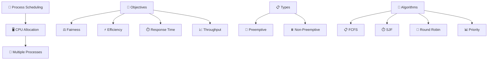

**Scheduling Concepts:**
- 📅 <span style="color: #FF6B6B; font-weight: bold;">CPU Allocation</span>: Decide which process runs when
- ⚖️ <span style="color: #4ECDC4; font-weight: bold;">Fairness</span>: Equal CPU time distribution
- ⚡ <span style="color: #45B7D1; font-weight: bold;">Efficiency</span>: Maximize CPU utilization
- ⏱️ <span style="color: #96CEB4; font-weight: bold;">Response Time</span>: Minimize wait time

### 9. Explain threads vs processes
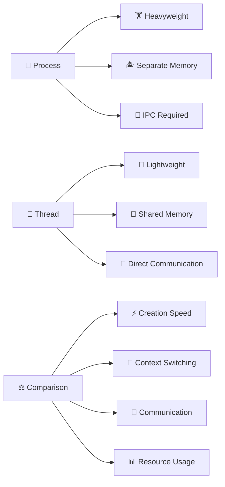

**Thread vs Process:**
| Aspect | 🔄 Process | 🧵 Thread |
|--------|------------|-----------|
| <span style="color: #FF6B6B; font-weight: bold;">Memory</span> | Separate address space | Shared address space |
| <span style="color: #4ECDC4; font-weight: bold;">Creation</span> | Expensive (fork) | Cheap |
| <span style="color: #45B7D1; font-weight: bold;">Communication</span> | IPC required | Direct memory access |
| <span style="color: #96CEB4; font-weight: bold;">Context Switch</span> | Expensive | Cheap |
| <span style="color: #9B59B6; font-weight: bold;">Crash Impact</span> | Isolated | Affects process |

### 10. What is inter-process communication (IPC)?
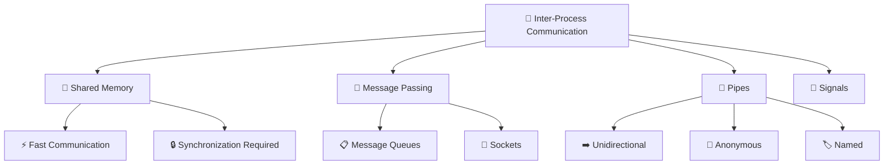

**IPC Mechanisms:**
- 🤝 <span style="color: #FF6B6B; font-weight: bold;">Shared Memory</span>: Direct memory access between processes
- 📨 <span style="color: #4ECDC4; font-weight: bold;">Message Passing</span>: Send/receive messages via queues
- 🔧 <span style="color: #45B7D1; font-weight: bold;">Pipes</span>: Unidirectional data flow
- 📡 <span style="color: #96CEB4; font-weight: bold;">Signals</span>: Asynchronous notifications

---

## 💾 Memory Management

### 11. Explain virtual memory
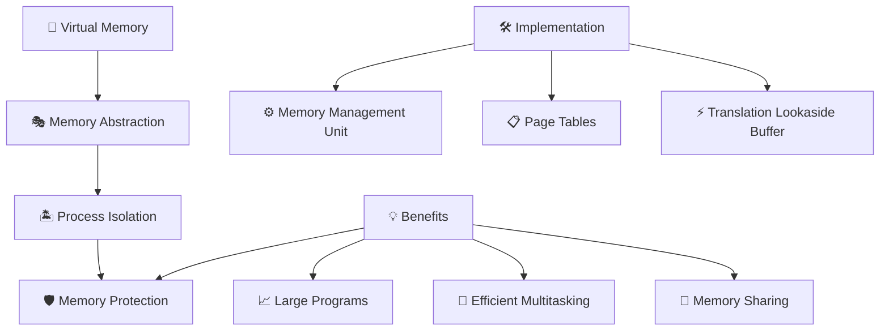

**Virtual Memory Features:**
- 🎭 <span style="color: #FF6B6B; font-weight: bold;">Abstraction</span>: Physical memory abstraction
- 🏝️ <span style="color: #4ECDC4; font-weight: bold;">Isolation</span>: Process memory separation
- 📋 <span style="color: #45B7D1; font-weight: bold;">Page Tables</span>: Virtual to physical mapping
- ⚡ <span style="color: #96CEB4; font-weight: bold;">TLB</span>: Address translation cache

### 12. What is paging vs segmentation?
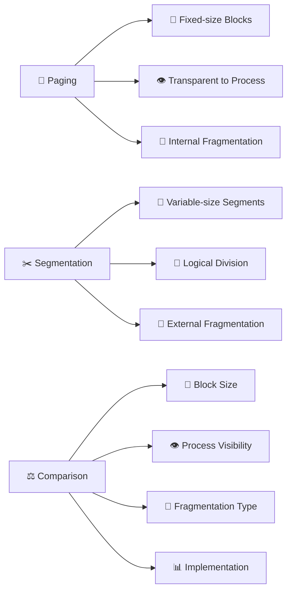

**Memory Management:**
| Feature | 📄 Paging | ✂️ Segmentation |
|---------|-----------|-----------------|
| <span style="color: #FF6B6B; font-weight: bold;">Block Size</span> | Fixed (pages) | Variable (segments) |
| <span style="color: #4ECDC4; font-weight: bold;">Process View</span> | Invisible | Visible (logical) |
| <span style="color: #45B7D1; font-weight: bold;">Fragmentation</span> | Internal | External |
| <span style="color: #96CEB4; font-weight: bold;">Implementation</span> | Hardware intensive | Software intensive |

### 13. Explain demand paging
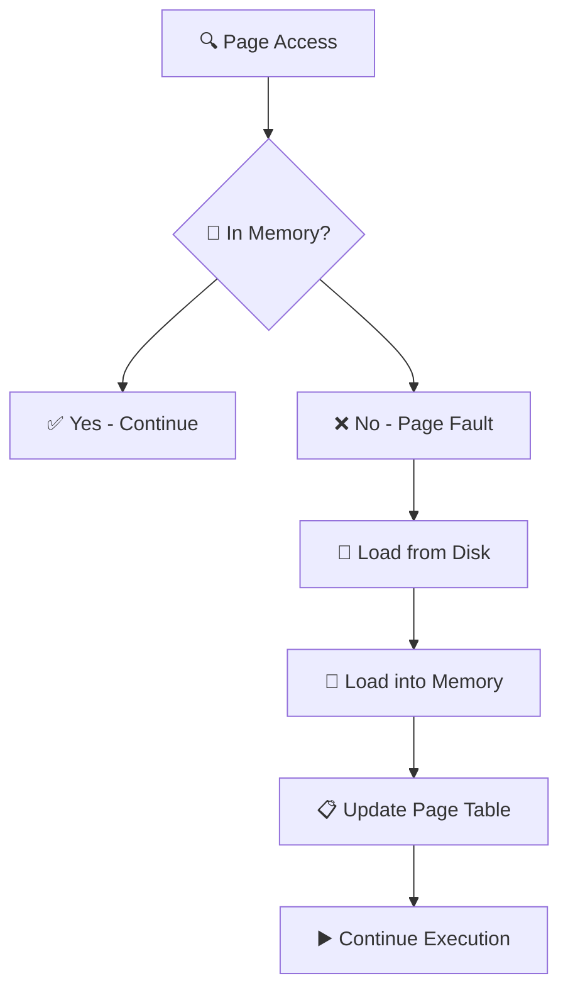

**Demand Paging Process:**
- 🔍 <span style="color: #FF6B6B; font-weight: bold;">Page Access</span>: Process references virtual address
- 📍 <span style="color: #4ECDC4; font-weight: bold;">Memory Check</span>: Is page in physical memory?
- ❌ <span style="color: #45B7D1; font-weight: bold;">Page Fault</span>: Page not in memory, trap to OS
- 💽 <span style="color: #96CEB4; font-weight: bold;">Disk Load</span>: Fetch page from secondary storage
- 💾 <span style="color: #9B59B6; font-weight: bold;">Memory Load</span>: Place page in available frame
- 📋 <span style="color: #E67E22; font-weight: bold;">Table Update</span>: Update page table mapping

### 14. What is thrashing?
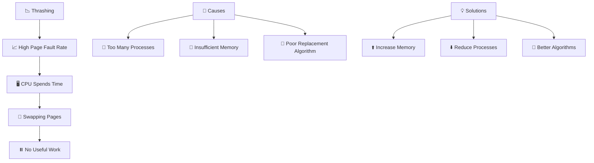

**Thrashing Problem:**
- 📈 <span style="color: #FF6B6B; font-weight: bold;">High Faults</span>: Excessive page faults
- 🖥️ <span style="color: #4ECDC4; font-weight: bold;">CPU Waste</span>: CPU spends time swapping instead of executing
- ⏸️ <span style="color: #45B7D1; font-weight: bold;">No Progress</span>: System appears frozen
- 👥 <span style="color: #96CEB4; font-weight: bold;">Overloading</span>: Too many processes competing for limited memory

### 15. Explain page replacement algorithms
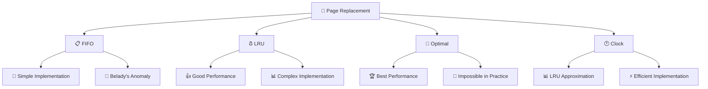

**Replacement Algorithms:**
- 📋 <span style="color: #FF6B6B; font-weight: bold;">FIFO</span>: Replace oldest page (simple but may have anomalies)
- ⏰ <span style="color: #4ECDC4; font-weight: bold;">LRU</span>: Replace least recently used (good performance)
- 🎯 <span style="color: #45B7D1; font-weight: bold;">Optimal</span>: Replace page used farthest in future (theoretical best)
- 🕐 <span style="color: #96CEB4; font-weight: bold;">Clock</span>: Circular list with reference bits (LRU approximation)

---

## 📁 File Systems

### 16. What is a file system?
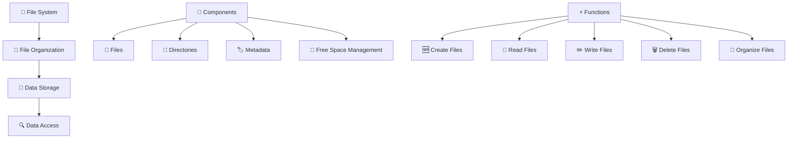

**File System Purpose:**
- 📂 <span style="color: #FF6B6B; font-weight: bold;">Organization</span>: Structured data storage and retrieval
- 💾 <span style="color: #4ECDC4; font-weight: bold;">Storage</span>: Persistent data storage on secondary storage
- 🔍 <span style="color: #45B7D1; font-weight: bold;">Access</span>: Efficient file location and access methods
- 🏷️ <span style="color: #96CEB4; font-weight: bold;">Metadata</span>: File attributes (size, permissions, timestamps)

### 17. Explain file allocation methods
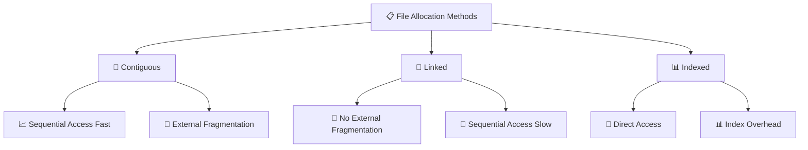

**Allocation Methods:**
- 📏 <span style="color: #FF6B6B; font-weight: bold;">Contiguous</span>: Files stored in consecutive blocks (fast sequential, fragmentation)
- 🔗 <span style="color: #4ECDC4; font-weight: bold;">Linked</span>: Blocks linked via pointers (no fragmentation, slow random access)
- 📊 <span style="color: #45B7D1; font-weight: bold;">Indexed</span>: Index block contains all file block pointers (fast random access, index overhead)

### 18. What is journaling in file systems?
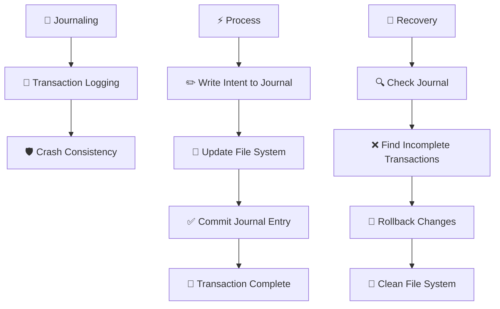

**Journaling Benefits:**
- 🔄 <span style="color: #FF6B6B; font-weight: bold;">Transaction Logging</span>: Log file system operations before execution
- 🛡️ <span style="color: #4ECDC4; font-weight: bold;">Crash Consistency</span>: Recover from crashes without fsck
- ⚡ <span style="color: #45B7D1; font-weight: bold;">Fast Recovery</span>: Replay journal to restore consistency
- 📝 <span style="color: #96CEB4; font-weight: bold;">Metadata Journaling</span>: Only log metadata changes (ext3 style)

### 19. Explain directory structures
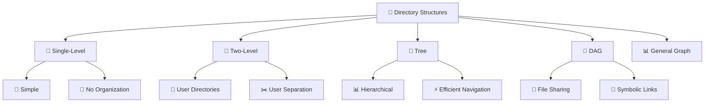

**Directory Structures:**
- 📁 <span style="color: #FF6B6B; font-weight: bold;">Single-Level</span>: All files in one directory (simple, no organization)
- 📂 <span style="color: #4ECDC4; font-weight: bold;">Two-Level</span>: Separate directories per user (user isolation)
- 🌳 <span style="color: #45B7D1; font-weight: bold;">Tree</span>: Hierarchical structure (most common, efficient)
- 🔀 <span style="color: #96CEB4; font-weight: bold;">DAG</span>: Acyclic graph with sharing (allows file sharing)

### 20. What are file system mounting?
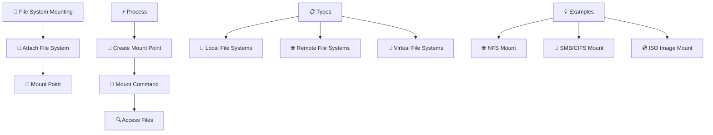

**Mounting Concepts:**
- 📎 <span style="color: #FF6B6B; font-weight: bold;">Attach</span>: Connect file system to directory tree
- 📂 <span style="color: #4ECDC4; font-weight: bold;">Mount Point</span>: Directory where file system appears
- 🔗 <span style="color: #45B7D1; font-weight: bold;">Integration</span>: Unified file system namespace
- 🌐 <span style="color: #96CEB4; font-weight: bold;">Remote</span>: Access remote file systems locally

---

## 📡 I/O Management

### 21. Explain I/O subsystem
```mermaid
graph TD
    IO[📡 I/O Subsystem] --> Hardware[🖥️ I/O Hardware]
    IO --> Software[💻 I/O Software]
    IO --> Application[🎯 Application Interface]
    
    Hardware[🖥️ Hardware] --> Devices[🔌 I/O Devices]
    Hardware --> Controllers[🎮 Device Controllers]
    Hardware --> Buses[🚌 I/O Buses]
    
    Software[💻 Software] --> Drivers[🔌 Device Drivers]
    Software --> Interrupt[⚡ Interrupt Handlers]
    Software --> Buffering[💾 Buffering]
    
    Application[🎯 Application] --> SystemCalls[📞 System Calls]
    Application --> Libraries[📚 I/O Libraries]
```

**I/O Management:**
- 🖥️ <span style="color: #FF6B6B; font-weight: bold;">Hardware</span>: Physical devices and controllers
- 💻 <span style="color: #4ECDC4; font-weight: bold;">Software</span>: Drivers and management layers
- 🎯 <span style="color: #45B7D1; font-weight: bold;">Application</span>: User-level I/O operations
- 📞 <span style="color: #96CEB4; font-weight: bold;">System Calls</span>: Kernel interface for I/O

### 22. What are I/O scheduling algorithms?
```mermaid
graph TD
    Scheduling[📅 I/O Scheduling] --> FCFS[📋 FCFS]
    Scheduling --> SSTF[🎯 SSTF]
    Scheduling --> SCAN[📊 SCAN]
    Scheduling --> CSCAN[📈 C-SCAN]
    Scheduling --> LOOK[👀 LOOK]
    
    FCFS[📋 FCFS] --> Simple[📝 Simple]
    FCFS --> Fair[⚖️ Fair]
    FCFS --> NoOptimize[🚫 No Optimization]
    
    SSTF[🎯 SSTF] --> Shortest[📏 Shortest Seek]
    SSTF --> Optimize[⚡ Optimize Seek Time]
    SSTF --> Starvation[⚠️ Starvation Possible]
    
    SCAN[📊 SCAN] --> Elevator[🏢 Elevator Algorithm]
    SCAN --> Direction[➡️ One Direction]
    SCAN --> Fairness[⚖️ Good Fairness]
```

**I/O Scheduling:**
- 📋 <span style="color: #FF6B6B; font-weight: bold;">FCFS</span>: First-come, first-served (simple, fair)
- 🎯 <span style="color: #4ECDC4; font-weight: bold;">SSTF</span>: Shortest seek time first (optimal seek, potential starvation)
- 📊 <span style="color: #45B7D1; font-weight: bold;">SCAN</span>: Elevator algorithm (good throughput, fair)
- 👀 <span style="color: #96CEB4; font-weight: bold;">LOOK</span>: SCAN variant (stops at last request)

### 23. Explain device drivers
```mermaid
graph TD
    Driver[🔌 Device Driver] --> Interface[🔗 Hardware Interface]
    Interface --> OS[💻 Operating System]
    
    Functions[⚡ Functions] --> Initialize[🚀 Initialize Device]
    Functions --> Control[🎮 Control Device Operation]
    Functions --> DataTransfer[📤 Data Transfer]
    Functions --> Interrupt[⚡ Handle Interrupts]
    Functions --> Error[🚨 Error Handling]
    
    Types[📋 Types] --> Character[📝 Character Devices]
    Types --> Block[💾 Block Devices]
    Types --> Network[🌐 Network Devices]
    
    Architecture[🏗️ Architecture] --> Monolithic[🏗️ Monolithic Kernel]
    Architecture --> Microkernel[🔧 Microkernel]
    Architecture --> Loadable[📦 Loadable Modules]
```

**Driver Functions:**
- 🚀 <span style="color: #FF6B6B; font-weight: bold;">Initialize</span>: Set up device for operation
- 🎮 <span style="color: #4ECDC4; font-weight: bold;">Control</span>: Configure device parameters
- 📤 <span style="color: #45B7D1; font-weight: bold;">Transfer</span>: Move data between device and memory
- ⚡ <span style="color: #96CEB4; font-weight: bold;">Interrupt</span>: Handle device-generated interrupts
- 🚨 <span style="color: #9B59B6; font-weight: bold;">Error</span>: Handle device errors and failures

### 24. What is DMA (Direct Memory Access)?
```mermaid
graph TD
    DMA[⚡ Direct Memory Access] --> Bypass[⏭️ Bypass CPU]
    Bypass --> Direct[📤 Direct Transfer]
    Direct --> Memory[💾 Memory ↔ Device]
    
    Process[🔄 DMA Process] --> CPU[🖥️ CPU Initiates Transfer]
    CPU --> DMA_Controller[🎮 DMA Controller Takes Over]
    DMA_Controller --> Transfer[📤 Device ↔ Memory Transfer]
    Transfer --> Interrupt[⚡ Interrupt on Completion]
    Interrupt --> CPU_Resume[🖥️ CPU Resumes]
    
    Benefits[💡 Benefits] --> Speed[🚀 Faster Transfers]
    Benefits --> CPU[🖥️ CPU Free for Other Tasks]
    Benefits --> Efficiency[⚡ Efficient for Large Transfers]
```

**DMA Advantages:**
- ⏭️ <span style="color: #FF6B6B; font-weight: bold;">Bypass CPU</span>: Direct device-to-memory transfers
- 🚀 <span style="color: #4ECDC4; font-weight: bold;">High Speed</span>: Faster than programmed I/O
- 🖥️ <span style="color: #45B7D1; font-weight: bold;">CPU Efficiency</span>: CPU can perform other tasks during transfer
- ⚡ <span style="color: #96CEB4; font-weight: bold;">Interrupt-driven</span>: CPU notified only on completion

### 25. Explain I/O buffering and caching
```mermaid
graph TD
    Buffering[💾 I/O Buffering] --> Speed[⚡ Speed Mismatch]
    Buffering --> Copy[📋 Data Copying]
    
    Types[📋 Types] --> Single[📄 Single Buffer]
    Types --> Double[📄 Double Buffer]
    Types --> Circular[🔄 Circular Buffer]
    
    Caching[💾 I/O Caching] --> Fast[⚡ Fast Access]
    Caching --> Recent[📅 Recently Used Data]
    Caching --> Prediction[🔮 Prefetching]
    
    Benefits[💡 Benefits] --> Performance[🚀 Improved Performance]
    Benefits --> Reliability[🛡️ Increased Reliability]
    Benefits --> Efficiency[⚡ Better Resource Utilization]
```

**I/O Optimization:**
- 💾 <span style="color: #FF6B6B; font-weight: bold;">Buffering</span>: Temporary data storage during transfer
- 📄 <span style="color: #4ECDC4; font-weight: bold;">Double Buffering</span>: Overlap I/O with processing
- 💾 <span style="color: #45B7D1; font-weight: bold;">Caching</span>: Keep frequently accessed data in fast storage
- 🔮 <span style="color: #96CEB4; font-weight: bold;">Prefetching</span>: Anticipatory data loading

---

## 💽 Storage Management

### 26. Explain disk scheduling algorithms
```mermaid
graph TD
    DiskScheduling[💽 Disk Scheduling] --> FCFS[📋 FCFS]
    DiskScheduling --> SSTF[🎯 SSTF]
    DiskScheduling --> SCAN[📊 SCAN]
    DiskScheduling --> CSCAN[📈 C-SCAN]
    DiskScheduling --> LOOK[👀 LOOK]
    
    Metrics[📊 Metrics] --> SeekTime[⏰ Seek Time]
    Metrics --> Rotational[🔄 Rotational Latency]
    Metrics --> Transfer[📤 Transfer Time]
    
    Optimization[⚡ Optimization] --> Minimize[⬇️ Minimize Seek Time]
    Optimization --> Throughput[📈 Maximize Throughput]
    Optimization --> Fairness[⚖️ Fairness]
```

**Disk Scheduling:**
- 📋 <span style="color: #FF6B6B; font-weight: bold;">FCFS</span>: First-come, first-served (simple, may cause starvation)
- 🎯 <span style="color: #4ECDC4; font-weight: bold;">SSTF</span>: Shortest seek time first (optimal seek, unfair)
- 📊 <span style="color: #45B7D1; font-weight: bold;">SCAN</span>: Elevator algorithm (good throughput, fair)
- 👀 <span style="color: #96CEB4; font-weight: bold;">LOOK</span>: SCAN variant (stops at last request in direction)

### 27. What is RAID (Redundant Array of Independent Disks)?
```mermaid
graph TD
    RAID[💽 RAID] --> Performance[🚀 Performance]
    RAID --> Reliability[🛡️ Reliability]
    RAID --> Redundancy[🔄 Redundancy]
    
    Levels[📊 RAID Levels] --> RAID0[0️⃣ RAID 0 - Striping]
    Levels --> RAID1[1️⃣ RAID 1 - Mirroring]
    Levels --> RAID5[5️⃣ RAID 5 - Distributed Parity]
    Levels --> RAID6[6️⃣ RAID 6 - Double Parity]
    Levels --> RAID10[1️⃣0️⃣ RAID 10 - Mirror + Stripe]
    
    RAID0[0️⃣ RAID 0] --> Fast[⚡ Fastest]
    RAID0 --> NoRedundancy[🚫 No Redundancy]
    
    RAID1[1️⃣ RAID 1] --> Mirror[🪞 Mirroring]
    RAID1 --> ReadPerformance[📖 Good Read Performance]
    
    RAID5[5️⃣ RAID 5] --> Parity[🔢 Distributed Parity]
    RAID5 --> Balance[⚖️ Performance vs Cost]
```

**RAID Levels:**
- 0️⃣ <span style="color: #FF6B6B; font-weight: bold;">RAID 0</span>: Striping (performance, no redundancy)
- 1️⃣ <span style="color: #4ECDC4; font-weight: bold;">RAID 1</span>: Mirroring (redundancy, good read performance)
- 5️⃣ <span style="color: #45B7D1; font-weight: bold;">RAID 5</span>: Distributed parity (balance of performance/cost)
- 1️⃣0️⃣ <span style="color: #96CEB4; font-weight: bold;">RAID 10</span>: Mirror + stripe (high performance and redundancy)

### 28. Explain disk partitioning
```mermaid
graph TD
    Partitioning[✂️ Disk Partitioning] --> Logical[🧠 Logical Division]
    Logical --> Separate[🏝️ Separate File Systems]
    
    Types[📋 Types] --> Primary[📋 Primary Partitions]
    Types --> Extended[📂 Extended Partition]
    Types --> Logical[🔗 Logical Partitions]
    
    Tools[🛠️ Tools] --> fdisk[💻 fdisk]
    Tools --> parted[🔧 parted]
    Tools --> gparted[🖼️ GParted]
    
    Benefits[💡 Benefits] --> Organization[📂 Better Organization]
    Benefits --> Security[🔒 Security Isolation]
    Benefits --> Backup[💾 Easier Backup]
    Benefits --> OS[💻 Multiple OS Support]
```

**Partitioning Concepts:**
- ✂️ <span style="color: #FF6B6B; font-weight: bold;">Logical Division</span>: Divide physical disk into logical sections
- 🏝️ <span style="color: #4ECDC4; font-weight: bold;">Separate File Systems</span>: Independent file system per partition
- 📋 <span style="color: #45B7D1; font-weight: bold;">Primary/Extended</span>: MBR partitioning scheme limitations
- 🔗 <span style="color: #96CEB4; font-weight: bold;">Logical</span>: Extended partition subdivisions

### 29. What is LVM (Logical Volume Management)?
```mermaid
graph TD
    LVM[💾 Logical Volume Management] --> Abstraction[🎭 Abstraction Layer]
    Abstraction --> Flexibility[🔧 Flexible Storage]
    
    Components[🔧 Components] --> PV[💽 Physical Volumes]
    Components --> VG[📦 Volume Groups]
    Components --> LV[💾 Logical Volumes]
    
    PV[💽 PV] --> Physical[🖥️ Physical Disks/Partitions]
    VG[📦 VG] --> Pool[🏊 Storage Pool]
    LV[💾 LV] --> Virtual[💽 Virtual Disks]
    
    Benefits[💡 Benefits] --> Resize[📏 Dynamic Resizing]
    Benefits --> Snapshot[📸 Snapshots]
    Benefits --> Mirror[🪞 Mirroring]
    Benefits --> Stripe[📊 Striping]
```

**LVM Features:**
- 🎭 <span style="color: #FF6B6B; font-weight: bold;">Abstraction</span>: Abstract physical storage from logical volumes
- 📏 <span style="color: #4ECDC4; font-weight: bold;">Dynamic Resizing</span>: Resize volumes without downtime
- 📸 <span style="color: #45B7D1; font-weight: bold;">Snapshots</span>: Point-in-time volume copies
- 🪞 <span style="color: #96CEB4; font-weight: bold;">Mirroring</span>: Redundant volume copies

### 30. Explain SSD vs HDD
```mermaid
graph LR
    HDD[💽 HDD - Hard Disk Drive] --> Mechanical[⚙️ Mechanical]
    HDD --> Slow[🐌 Slower Access]
    HDD --> Cheap[💰 Cheaper per GB]
    HDD --> Large[📦 Larger Capacity]
    
    SSD[💾 SSD - Solid State Drive] --> Electronic[🔌 Electronic]
    SSD --> Fast[⚡ Faster Access]
    SSD --> Expensive[💸 More Expensive]
    SSD --> Reliable[🛡️ More Reliable]
    
    Comparison[⚖️ Comparison] --> Speed[⚡ Access Speed]
    Comparison --> Cost[💰 Cost per GB]
    Comparison --> Reliability[🛡️ Reliability]
    Comparison --> Power[🔋 Power Consumption]
    Comparison --> Noise[🔇 Noise Level]
```

**Storage Comparison:**
| Feature | 💽 HDD | 💾 SSD |
|---------|--------|--------|
| <span style="color: #FF6B6B; font-weight: bold;">Technology</span> | Mechanical | Electronic (NAND flash) |
| <span style="color: #4ECDC4; font-weight: bold;">Access Time</span> | 5-10ms | 0.1ms |
| <span style="color: #45B7D1; font-weight: bold;">Cost/GB</span> | Lower | Higher |
| <span style="color: #96CEB4; font-weight: bold;">Reliability</span> | Lower (moving parts) | Higher (no moving parts) |
| <span style="color: #9B59B6; font-weight: bold;">Power</span> | Higher | Lower |

---

## 🔒 Security & Permissions

### 31. Explain Unix/Linux file permissions
```mermaid
graph TD
    Permissions[🔒 File Permissions] --> Owner[👤 Owner]
    Permissions --> Group[👥 Group]
    Permissions --> Others[🌐 Others]
    
    Types[📋 Permission Types] --> Read[📖 Read - r]
    Types --> Write[✏️ Write - w]
    Types --> Execute[⚡ Execute - x]
    
    Representation[📊 Representation] --> Symbolic[🔤 Symbolic - rwxr-xr--]
    Representation --> Octal[🔢 Octal - 754]
    
    Special[✨ Special Permissions] --> SUID[🔑 Set User ID]
    Special --> SGID[👥 Set Group ID]
    Special --> Sticky[📌 Sticky Bit]
```

**Permission System:**
- 👤 <span style="color: #FF6B6B; font-weight: bold;">Owner</span>: File creator permissions
- 👥 <span style="color: #4ECDC4; font-weight: bold;">Group</span>: Group member permissions
- 🌐 <span style="color: #45B7D1; font-weight: bold;">Others</span>: Everyone else permissions
- 📖 <span style="color: #96CEB4; font-weight: bold;">Read</span>: View file contents/list directory
- ✏️ <span style="color: #9B59B6; font-weight: bold;">Write</span>: Modify file/create in directory
- ⚡ <span style="color: #E67E22; font-weight: bold;">Execute</span>: Run file/change to directory

### 32. What is sudo and su?
```mermaid
graph TD
    Privilege[🔑 Privilege Escalation] --> su[🔄 su - Switch User]
    Privilege --> sudo[🔧 sudo - Substitute User DO]
    
    su[🔄 su] --> Full[👑 Full Root Shell]
    su --> Password[🔑 Root Password Required]
    su --> Environment[🌍 Complete Environment]
    
    sudo[🔧 sudo] --> Command[💻 Single Command]
    sudo --> Config[⚙️ Configurable Permissions]
    sudo --> Audit[📊 Auditable Actions]
    
    Comparison[⚖️ Comparison] --> Scope[📏 Scope of Access]
    Comparison --> Security[🔒 Security Model]
    Comparison --> Audit[📊 Audit Trail]
```

**Privilege Tools:**
- 🔄 <span style="color: #FF6B6B; font-weight: bold;">su</span>: Switch to another user (typically root) completely
- 🔧 <span style="color: #4ECDC4; font-weight: bold;">sudo</span>: Execute single command as another user
- 👑 <span style="color: #45B7D1; font-weight: bold;">Full Access</span>: su gives complete root shell
- 💻 <span style="color: #96CEB4; font-weight: bold;">Limited Access</span>: sudo gives controlled, auditable access

### 33. Explain SELinux vs AppArmor
```mermaid
graph LR
    SELinux[🛡️ SELinux] --> MAC[🔒 Mandatory Access Control]
    SELinux --> Complex[📊 Complex Configuration]
    SELinux --> Granular[🎯 Very Granular]
    SELinux --> RedHat[🐧 Red Hat Based]
    
    AppArmor[🛡️ AppArmor] --> Path[📁 Path-based Policies]
    AppArmor --> Simple[📝 Simpler Configuration]
    AppArmor --> Ubuntu[🐧 Ubuntu/Debian Based]
    
    Comparison[⚖️ Comparison] --> Model[🔒 Security Model]
    Comparison --> Complexity[📊 Configuration Complexity]
    Comparison --> Distribution[🐧 Linux Distribution]
    Comparison --> Performance[⚡ Performance Impact]
```

**Security Modules:**
| Feature | 🛡️ SELinux | 🛡️ AppArmor |
|---------|------------|-------------|
| <span style="color: #FF6B6B; font-weight: bold;">Model</span> | MAC (Mandatory) | Path-based (MAC) |
| <span style="color: #4ECDC4; font-weight: bold;">Configuration</span> | Complex, powerful | Simpler, application-focused |
| <span style="color: #45B7D1; font-weight: bold;">Default</span> | Red Hat/CentOS | Ubuntu/Debian |
| <span style="color: #96CEB4; font-weight: bold;">Learning Curve</span> | Steep | Moderate |

### 34. What are OS security principles?
```mermaid
graph TD
    Security[🔒 OS Security Principles] --> CIA[🛡️ CIA Triad]
    CIA --> Confidentiality[🔐 Confidentiality]
    CIA --> Integrity[✅ Integrity]
    CIA --> Availability[🟢 Availability]
    
    Principles[📋 Core Principles] --> LeastPrivilege[🎯 Least Privilege]
    Principles --> DefenseDepth[🛡️ Defense in Depth]
    Principles --> FailSafe[🚫 Fail-Safe Defaults]
    Principles --> Separation[✂️ Separation of Duties]
    Principles --> CompleteMediation[🔍 Complete Mediation]
    Principles --> OpenDesign[📖 Open Design]
    Principles --> LeastCommon[⚙️ Least Common Mechanism]
    Principles --> Psychological[👤 Psychological Acceptability]
```

**Security Principles:**
- 🎯 <span style="color: #FF6B6B; font-weight: bold;">Least Privilege</span>: Minimum required access
- 🛡️ <span style="color: #4ECDC4; font-weight: bold;">Defense in Depth</span>: Multiple security layers
- 🚫 <span style="color: #45B7D1; font-weight: bold;">Fail-Safe Defaults</span>: Secure by default
- ✂️ <span style="color: #96CEB4; font-weight: bold;">Separation of Duties</span>: Divide responsibilities
- 🔍 <span style="color: #9B59B6; font-weight: bold;">Complete Mediation</span>: Check every access
- 📖 <span style="color: #E67E22; font-weight: bold;">Open Design</span>: Security not dependent on secrecy

### 35. Explain OS hardening
```mermaid
graph TD
    Hardening[🛡️ OS Hardening] --> Minimize[⬇️ Minimize Attack Surface]
    Minimize --> Secure[🔒 Secure Configuration]
    Secure --> Monitor[👀 Continuous Monitoring]
    
    Steps[📋 Hardening Steps] --> Remove[🗑️ Remove Unnecessary Services]
    Steps --> Update[⬆️ Apply Security Updates]
    Steps --> Configure[⚙️ Secure Configuration]
    Steps --> Monitor[📊 Enable Monitoring]
    Steps --> Backup[💾 Regular Backups]
    Steps --> Access[🚪 Control Access]
    
    Tools[🛠️ Tools] --> CIS[📋 CIS Benchmarks]
    Tools --> STIG[📋 STIG Guidelines]
    Tools --> Ansible[🎭 Automation Tools]
    Tools --> Monitoring[📊 Monitoring Tools]
```

**Hardening Process:**
- 🗑️ <span style="color: #FF6B6B; font-weight: bold;">Remove Services</span>: Disable unnecessary software
- ⬆️ <span style="color: #4ECDC4; font-weight: bold;">Security Updates</span>: Keep system patched
- ⚙️ <span style="color: #45B7D1; font-weight: bold;">Secure Config</span>: Harden default settings
- 📊 <span style="color: #96CEB4; font-weight: bold;">Monitoring</span>: Enable security monitoring
- 💾 <span style="color: #9B59B6; font-weight: bold;">Backups</span>: Regular secure backups
- 🚪 <span style="color: #E67E22; font-weight: bold;">Access Control</span>: Implement least privilege

---

## 🌐 Networking in OS

### 36. Explain TCP/IP stack in OS
```mermaid
graph TD
    Application[🎯 Application Layer] --> Socket[🔌 Socket API]
    Socket --> Transport[🚚 Transport Layer]
    Transport --> Network[🌐 Network Layer]
    Network --> DataLink[🔗 Data Link Layer]
    DataLink --> Physical[📡 Physical Layer]
    
    Transport[🚚 Transport] --> TCP[🔒 TCP]
    Transport --> UDP[⚡ UDP]
    
    Network[🌐 Network] --> IP[📦 IP]
    Network --> ICMP[📡 ICMP]
    Network --> ARP[🔍 ARP]
    
    DataLink[🔗 Data Link] --> Ethernet[🔌 Ethernet]
    DataLink --> WiFi[📶 WiFi]
```

**TCP/IP Implementation:**
- 🎯 <span style="color: #FF6B6B; font-weight: bold;">Application</span>: Socket interface for applications
- 🚚 <span style="color: #4ECDC4; font-weight: bold;">Transport</span>: TCP (reliable) and UDP (fast)
- 🌐 <span style="color: #45B7D1; font-weight: bold;">Network</span>: IP routing and addressing
- 🔗 <span style="color: #96CEB4; font-weight: bold;">Data Link</span>: Frame transmission
- 📡 <span style="color: #9B59B6; font-weight: bold;">Physical</span>: Hardware transmission

### 37. What is socket programming?
```mermaid
graph TD
    Socket[🔌 Socket Programming] --> Endpoint[🎯 Communication Endpoint]
    Endpoint --> API[🌐 Network API]
    
    Types[📋 Socket Types] --> Stream[🌊 Stream Sockets - TCP]
    Types --> Datagram[📦 Datagram Sockets - UDP]
    Types --> Raw[🔧 Raw Sockets]
    
    Process[⚡ Socket Process] --> Create[🆕 Create Socket]
    Process --> Bind[🔗 Bind to Address]
    Process --> Listen[👂 Listen for Connections]
    Process --> Accept[✅ Accept Connections]
    Process --> SendReceive[📤 Send/Receive Data]
    Process --> Close[❌ Close Socket]
```

**Socket Programming:**
- 🔌 <span style="color: #FF6B6B; font-weight: bold;">Endpoint</span>: Network communication endpoint
- 🌊 <span style="color: #4ECDC4; font-weight: bold;">Stream</span>: TCP-based reliable communication
- 📦 <span style="color: #45B7D1; font-weight: bold;">Datagram</span>: UDP-based connectionless communication
- 🔧 <span style="color: #96CEB4; font-weight: bold;">Raw</span>: Direct protocol access (administrative)

### 38. Explain DNS resolution in OS
```mermaid
flowchart TD
    Application[🎯 Application] --> Resolver[🔍 Resolver Library]
    Resolver --> LocalCache[💾 Local DNS Cache]
    LocalCache --> Hit{📍 Cache Hit?}
    Hit --> Return[✅ Return Cached Result]
    Hit --> Nameserver[🖥️ DNS Nameserver]
    Nameserver --> Recursive[🔄 Recursive Query]
    Recursive --> Root[🌍 Root Servers]
    Root --> TLD[🏷️ TLD Servers]
    TLD --> Authoritative[📋 Authoritative Servers]
    Authoritative --> Response[📤 DNS Response]
    Response --> Cache[💾 Cache Result]
    Cache --> Return
```

**DNS Resolution:**
- 🔍 <span style="color: #FF6B6B; font-weight: bold;">Resolver</span>: System library for DNS queries
- 💾 <span style="color: #4ECDC4; font-weight: bold;">Cache</span>: Local DNS result caching
- 🖥️ <span style="color: #45B7D1; font-weight: bold;">Nameserver</span>: Configured DNS servers
- 🔄 <span style="color: #96CEB4; font-weight: bold;">Recursive</span>: Full resolution process

### 39. What is network interface configuration?
```mermaid
graph TD
    Interface[🔌 Network Interface] --> Configuration[⚙️ Configuration]
    Configuration --> IP[🔢 IP Address]
    Configuration --> Netmask[🎭 Netmask]
    Configuration --> Gateway[🚪 Gateway]
    Configuration --> DNS[🌐 DNS Servers]
    
    Tools[🛠️ Configuration Tools] --> ifconfig[💻 ifconfig]
    Tools --> ip[🔧 ip command]
    Tools --> nmcli[📡 nmcli]
    Tools --> nmtui[🖥️ nmtui]
    
    Files[📄 Configuration Files] --> interfaces[📋 /etc/network/interfaces]
    Files --> ifcfg[📄 /etc/sysconfig/network-scripts/]
    Files --> netplan[📄 /etc/netplan/]
```

**Interface Configuration:**
- 🔢 <span style="color: #FF6B6B; font-weight: bold;">IP Address</span>: Interface network address
- 🎭 <span style="color: #4ECDC4; font-weight: bold;">Netmask</span>: Network/subnet definition
- 🚪 <span style="color: #45B7D1; font-weight: bold;">Gateway</span>: Default route for external traffic
- 🌐 <span style="color: #96CEB4; font-weight: bold;">DNS</span>: Domain name resolution servers

### 40. Explain firewall configuration in OS
```mermaid
graph TD
    Firewall[🔥 OS Firewall] --> iptables[📋 iptables]
    Firewall --> firewalld[🔥 firewalld]
    Firewall --> ufw[🛡️ ufw]
    Firewall --> nftables[📊 nftables]
    
    iptables[📋 iptables] --> Tables[📊 Tables]
    Tables --> Filter[🔍 Filter Table]
    Tables --> NAT[🔄 NAT Table]
    Tables --> Mangle[🔧 Mangle Table]
    
    Rules[📋 Rules] --> Chains[🔗 Chains]
    Chains --> INPUT[📥 INPUT Chain]
    Chains --> OUTPUT[📤 OUTPUT Chain]
    Chains --> FORWARD[🔀 FORWARD Chain]
    
    Actions[⚡ Actions] --> ACCEPT[✅ ACCEPT]
    Actions --> DROP[❌ DROP]
    Actions --> REJECT[🚫 REJECT]
```

**Firewall Systems:**
- 📋 <span style="color: #FF6B6B; font-weight: bold;">iptables</span>: Linux packet filtering framework
- 🔥 <span style="color: #4ECDC4; font-weight: bold;">firewalld</span>: Dynamic firewall management
- 🛡️ <span style="color: #45B7D1; font-weight: bold;">ufw</span>: Ubuntu firewall (iptables frontend)
- 📊 <span style="color: #96CEB4; font-weight: bold;">nftables</span>: Next-generation firewall

---

## 📞 System Calls

### 41. What are system calls?
```mermaid
graph TD
    Application[🎯 Application] --> SystemCall[📞 System Call]
    SystemCall --> Kernel[🎯 Kernel]
    Kernel --> Hardware[🖥️ Hardware]
    Hardware --> Result[📤 Result]
    Result --> Application
    
    Categories[📋 Categories] --> Process[🔄 Process Control]
    Categories --> File[📁 File Management]
    Categories --> Device[🔌 Device Management]
    Categories --> Information[ℹ️ Information Maintenance]
    Categories --> Communication[💬 Communication]
    
    Examples[💡 Examples] --> fork[🔀 fork()]
    Examples --> exec[⚡ exec()]
    Examples --> open[📂 open()]
    Examples --> read[📖 read()]
    Examples --> write[✏️ write()]
```

**System Call Concepts:**
- 📞 <span style="color: #FF6B6B; font-weight: bold;">Interface</span>: Controlled kernel access from user space
- 🔄 <span style="color: #4ECDC4; font-weight: bold;">Process Control</span>: fork, exec, exit, wait
- 📁 <span style="color: #45B7D1; font-weight: bold;">File Management</span>: open, read, write, close
- 🔌 <span style="color: #96CEB4; font-weight: bold;">Device Management</span>: ioctl, read, write
- 💬 <span style="color: #9B59B6; font-weight: bold;">Communication</span>: pipe, socket, shmget

### 42. Explain fork() and exec() system calls
```mermaid
flowchart TD
    Parent[👨 Parent Process] --> fork[🔀 fork() System Call]
    fork --> Child[👶 Child Process]
    fork --> PID[🆔 Child PID to Parent]
    
    Child --> exec[⚡ exec() System Call]
    exec --> NewProgram[🎯 New Program Image]
    exec --> Overwrite[🔄 Overwrite Process Image]
    
    Parent --> Continue[▶️ Continue Execution]
    NewProgram --> Execute[▶️ Execute New Program]
    
    Note[💡 Note] --> Copy[📋 fork() copies parent]
    Note --> Replace[🔄 exec() replaces child]
```

**Process Creation:**
- 🔀 <span style="color: #FF6B6B; font-weight: bold;">fork()</span>: Create child process (copy of parent)
- ⚡ <span style="color: #4ECDC4; font-weight: bold;">exec()</span>: Replace process image with new program
- 👶 <span style="color: #45B7D1; font-weight: bold;">Child Process</span>: Initially identical to parent
- 🎯 <span style="color: #96CEB4; font-weight: bold;">New Program</span>: Completely different program execution

### 43. What are file system system calls?
```mermaid
graph TD
    FileOps[📁 File System Calls] --> open[📂 open()]
    FileOps --> read[📖 read()]
    FileOps --> write[✏️ write()]
    FileOps --> close[❌ close()]
    FileOps --> lseek[📍 lseek()]
    
    open[📂 open()] --> FileDescriptor[🆔 File Descriptor]
    read[📖 read()] --> Buffer[💾 Read into Buffer]
    write[✏️ write()] --> Buffer2[💾 Write from Buffer]
    close[❌ close()] --> Release[🔓 Release Descriptor]
    lseek[📍 lseek()] --> Position[📍 Change File Position]
    
    Flags[🚩 Open Flags] --> RDONLY[📖 O_RDONLY]
    Flags --> WRONLY[✏️ O_WRONLY]
    Flags --> RDWR[📖✏️ O_RDWR]
    Flags --> CREATE[🆕 O_CREAT]
    Flags --> APPEND[📎 O_APPEND]
```

**File Operations:**
- 📂 <span style="color: #FF6B6B; font-weight: bold;">open()</span>: Open file and get file descriptor
- 📖 <span style="color: #4ECDC4; font-weight: bold;">read()</span>: Read data from file into buffer
- ✏️ <span style="color: #45B7D1; font-weight: bold;">write()</span>: Write data from buffer to file
- ❌ <span style="color: #96CEB4; font-weight: bold;">close()</span>: Close file and free descriptor
- 📍 <span style="color: #9B59B6; font-weight: bold;">lseek()</span>: Change file read/write position

### 44. Explain process control system calls
```mermaid
graph TD
    ProcessControl[🔄 Process Control] --> fork[🔀 fork()]
    ProcessControl --> exec[⚡ exec()]
    ProcessControl --> wait[⏳ wait()]
    ProcessControl --> exit[🚪 exit()]
    ProcessControl --> getpid[🆔 getpid()]
    
    fork[🔀 fork()] --> CreateChild[👶 Create Child Process]
    exec[⚡ exec()] --> LoadProgram[📦 Load New Program]
    wait[⏳ wait()] --> ParentWait[👨 Parent Waits for Child]
    exit[🚪 exit()] --> Terminate[🏁 Terminate Process]
    getpid[🆔 getpid()] --> ProcessID[🆔 Get Process ID]
    
    States[📊 Process States] --> Running[▶️ Running]
    States --> Waiting[⏸️ Waiting]
    States --> Zombie[👻 Zombie]
    States --> Orphaned[👶 Orphaned]
```

**Process Management:**
- 🔀 <span style="color: #FF6B6B; font-weight: bold;">fork()</span>: Create new process
- ⚡ <span style="color: #4ECDC4; font-weight: bold;">exec()</span>: Execute new program
- ⏳ <span style="color: #45B7D1; font-weight: bold;">wait()</span>: Wait for child termination
- 🚪 <span style="color: #96CEB4; font-weight: bold;">exit()</span>: Terminate current process
- 👻 <span style="color: #9B59B6; font-weight: bold;">Zombie</span>: Terminated process waiting for parent

### 45. What are signal system calls?
```mermaid
graph TD
    Signals[📡 Signals] --> Asynchronous[⚡ Asynchronous Events]
    Asynchronous --> Process[🔄 Process Communication]
    
    CommonSignals[📋 Common Signals] --> SIGINT[🛑 SIGINT - Ctrl+C]
    CommonSignals --> SIGTERM[🛑 SIGTERM - Termination]
    CommonSignals --> SIGKILL[💀 SIGKILL - Force Kill]
    CommonSignals --> SIGSTOP[⏸️ SIGSTOP - Stop]
    CommonSignals --> SIGCONT[▶️ SIGCONT - Continue]
    
    Handling[🔧 Signal Handling] --> Default[📋 Default Action]
    Handling --> Ignore[🙈 Ignore Signal]
    Handling --> Custom[🔧 Custom Handler]
    
    SystemCalls[📞 System Calls] --> kill[💀 kill()]
    SystemCalls --> signal[📡 signal()]
    SystemCalls --> sigaction[⚙️ sigaction()]
```

**Signal System:**
- ⚡ <span style="color: #FF6B6B; font-weight: bold;">Asynchronous</span>: Interrupt process execution
- 📡 <span style="color: #4ECDC4; font-weight: bold;">Communication</span>: Inter-process signaling
- 🛑 <span style="color: #45B7D1; font-weight: bold;">SIGINT</span>: Interrupt from keyboard
- 💀 <span style="color: #96CEB4; font-weight: bold;">SIGKILL</span>: Unblockable termination
- 🔧 <span style="color: #9B59B6; font-weight: bold;">Custom Handler</span>: User-defined signal processing

---

## 💻 Virtualization

### 46. Explain OS-level virtualization
```mermaid
graph TD
    HostOS[🖥️ Host Operating System] --> ContainerEngine[🐳 Container Engine]
    ContainerEngine --> Containers[📦 Multiple Containers]
    
    Containers[📦 Containers] --> Isolated[🏝️ Isolated Environments]
    Isolated --> SharedKernel[🎯 Shared Kernel]
    Isolated --> Namespaces[🏷️ Namespaces]
    Isolated --> Cgroups[📊 Control Groups]
    
    Benefits[💡 Benefits] --> Lightweight[💨 Lightweight]
    Benefits --> Fast[⚡ Fast Startup]
    Benefits --> Density[📦 High Density]
    Benefits --> Portability[🔄 Portable]
```

**Container Virtualization:**
- 🏝️ <span style="color: #FF6B6B; font-weight: bold;">Isolated</span>: Process and filesystem isolation
- 🎯 <span style="color: #4ECDC4; font-weight: bold;">Shared Kernel</span>: Same OS kernel for all containers
- 🏷️ <span style="color: #45B7D1; font-weight: bold;">Namespaces</span>: Isolate system resources
- 📊 <span style="color: #96CEB4; font-weight: bold;">Cgroups</span>: Resource limits and accounting

### 47. What is hypervisor-based virtualization?
```mermaid
graph TD
    Hardware[🖥️ Physical Hardware] --> Hypervisor[🎭 Hypervisor]
    Hypervisor --> VM1[💻 Virtual Machine 1]
    Hypervisor --> VM2[💻 Virtual Machine 2]
    Hypervisor --> VM3[💻 Virtual Machine 3]
    
    Types[📋 Types] --> Type1[1️⃣ Type 1 - Bare Metal]
    Types --> Type2[2️⃣ Type 2 - Hosted]
    
    Type1[1️⃣ Type 1] --> Direct[🔗 Direct Hardware Access]
    Type1 --> Performance[⚡ High Performance]
    
    Type2[2️⃣ Type 2] --> HostOS[💻 Runs on Host OS]
    Type2 --> Convenience[📱 More Convenient]
    
    Examples[💡 Examples] --> VMware[🔷 VMware ESXi]
    Examples --> KVM[🐧 KVM]
    Examples --> HyperV[🪟 Hyper-V]
```

**Hypervisor Types:**
- 1️⃣ <span style="color: #FF6B6B; font-weight: bold;">Type 1</span>: Bare-metal hypervisor (VMware ESXi, KVM)
- 2️⃣ <span style="color: #4ECDC4; font-weight: bold;">Type 2</span>: Hosted hypervisor (VirtualBox, VMware Workstation)
- 🔗 <span style="color: #45B7D1; font-weight: bold;">Direct Access</span>: Hardware virtualization
- 💻 <span style="color: #96CEB4; font-weight: bold;">Full VMs</span>: Complete OS instances

### 48. Explain namespaces in Linux
```mermaid
graph TD
    Namespaces[🏷️ Linux Namespaces] --> Isolation[🏝️ Resource Isolation]
    Isolation --> Containers[🐳 Container Foundation]
    
    Types[📋 Namespace Types] --> PID[🔢 PID Namespace]
    Types --> Network[🌐 Network Namespace]
    Types --> Mount[💾 Mount Namespace]
    Types --> UTS[🏷️ UTS Namespace]
    Types --> IPC[💬 IPC Namespace]
    Types --> User[👤 User Namespace]
    
    PID[🔢 PID] --> ProcessID[🆔 Process ID Isolation]
    Network[🌐 Network] --> Interface[🔌 Network Interface Isolation]
    Mount[💾 Mount] --> Filesystem[📁 Filesystem Mount Isolation]
    UTS[🏷️ UTS] --> Hostname[🏠 Hostname Isolation]
    IPC[💬 IPC] --> Message[📨 Inter-process Communication]
    User[👤 User] --> UID[🆔 User ID Mapping]
```

**Namespace Isolation:**
- 🔢 <span style="color: #FF6B6B; font-weight: bold;">PID</span>: Process ID number spaces
- 🌐 <span style="color: #4ECDC4; font-weight: bold;">Network</span>: Network stack isolation
- 💾 <span style="color: #45B7D1; font-weight: bold;">Mount</span>: Filesystem mount points
- 🏠 <span style="color: #96CEB4; font-weight: bold;">UTS</span>: Hostname and domain name
- 💬 <span style="color: #9B59B6; font-weight: bold;">IPC</span>: System V IPC and POSIX message queues
- 👤 <span style="color: #E67E22; font-weight: bold;">User</span>: User and group ID mapping

### 49. What are control groups (cgroups)?
```mermaid
graph TD
    Cgroups[📊 Control Groups] --> Resource[📊 Resource Management]
    Resource --> Containers[🐳 Container Foundation]
    
    Subsystems[🔧 Subsystems] --> CPU[🖥️ CPU Scheduling]
    Subsystems --> Memory[💾 Memory Limits]
    Subsystems --> IO[💽 I/O Bandwidth]
    Subsystems --> Network[🌐 Network Bandwidth]
    Subsystems --> Devices[🔌 Device Access]
    
    Hierarchy[📊 Hierarchy] --> Root[🌳 Root Group]
    Root --> Child1[👶 Child Group 1]
    Root --> Child2[👶 Child Group 2]
    
    Features[✨ Features] --> Limits[🚫 Resource Limits]
    Features --> Accounting[📈 Resource Accounting]
    Features --> Control[🎮 Resource Control]
    Features --> Isolation[🏝️ Resource Isolation]
```

**Cgroup Functions:**
- 📊 <span style="color: #FF6B6B; font-weight: bold;">Resource Control</span>: Limit and prioritize resources
- 🖥️ <span style="color: #4ECDC4; font-weight: bold;">CPU</span>: CPU time allocation and scheduling
- 💾 <span style="color: #45B7D1; font-weight: bold;">Memory</span>: Memory usage limits and accounting
- 💽 <span style="color: #96CEB4; font-weight: bold;">I/O</span>: Disk I/O bandwidth control
- 🌐 <span style="color: #9B59B6; font-weight: bold;">Network</span>: Network traffic shaping

### 50. Explain Docker vs traditional virtualization
```mermaid
graph LR
    Traditional[🏗️ Traditional Virtualization] --> Hypervisor[🎭 Hypervisor]
    Traditional --> GuestOS[💻 Guest OS]
    Traditional --> Heavy[🏋️ Heavyweight]
    Traditional --> Slow[🐌 Slower Startup]
    
    Docker[🐳 Docker] --> ContainerEngine[📦 Container Engine]
    Docker --> HostKernel[🎯 Host Kernel]
    Docker --> Lightweight[💨 Lightweight]
    Docker --> Fast[⚡ Fast Startup]
    
    Comparison[⚖️ Comparison] --> Isolation[🏝️ Isolation Level]
    Comparison --> Performance[⚡ Performance]
    Comparison --> Resource[📊 Resource Usage]
    Comparison --> Portability[🔄 Portability]
    Comparison --> Management[📋 Management Overhead]
```

**Virtualization Comparison:**
| Aspect | 🏗️ Traditional VM | 🐳 Docker Container |
|--------|-------------------|---------------------|
| <span style="color: #FF6B6B; font-weight: bold;">OS</span> | Full guest OS | Shared host kernel |
| <span style="color: #4ECDC4; font-weight: bold;">Size</span> | GBs | MBs |
| <span style="color: #45B7D1; font-weight: bold;">Startup</span> | Minutes | Seconds |
| <span style="color: #96CEB4; font-weight: bold;">Isolation</span> | Strong (VM level) | Process level |
| <span style="color: #9B59B6; font-weight: bold;">Resource</span> | High overhead | Low overhead |

---

## 📊 Performance Monitoring

### 51. Explain OS performance monitoring
```mermaid
graph TD
    Monitoring[📊 OS Performance Monitoring] --> CPU[🖥️ CPU Utilization]
    Monitoring --> Memory[💾 Memory Usage]
    Monitoring --> Disk[💽 Disk I/O]
    Monitoring --> Network[🌐 Network Traffic]
    Monitoring --> Processes[🔄 Process Activity]
    
    Tools[🛠️ Monitoring Tools] --> top[📊 top]
    Tools --> htop[📈 htop]
    Tools --> vmstat[📋 vmstat]
    Tools --> iostat[💽 iostat]
    Tools --> sar[📊 sar]
    Tools --> nmon[📊 nmon]
    
    Metrics[📏 Key Metrics] --> LoadAverage[📈 Load Average]
    Metrics --> ContextSwitches[🔄 Context Switches]
    Metrics --> PageFaults[📄 Page Faults]
    Metrics --> Interrupts[⚡ Interrupts]
```

**OS Monitoring:**
- 🖥️ <span style="color: #FF6B6B; font-weight: bold;">CPU</span>: Processor utilization and load
- 💾 <span style="color: #4ECDC4; font-weight: bold;">Memory</span>: RAM usage and swap activity
- 💽 <span style="color: #45B7D1; font-weight: bold;">Disk</span>: Storage performance and I/O
- 🌐 <span style="color: #96CEB4; font-weight: bold;">Network</span>: Network interface statistics
- 📈 <span style="color: #9B59B6; font-weight: bold;">Load Average</span>: System load over time

### 52. What is load average in Linux?
```mermaid
graph TD
    LoadAverage[📈 Load Average] --> SystemLoad[📊 System Load Measurement]
    SystemLoad --> TimePeriods[⏰ Three Time Periods]
    
    TimePeriods[⏰ Periods] --> 1min[1️⃣ 1 Minute Average]
    TimePeriods --> 5min[5️⃣ 5 Minute Average]
    TimePeriods --> 15min[1️⃣5️⃣ 15 Minute Average]
    
    Calculation[🧮 Calculation] --> Runnable[🔄 Runnable Processes]
    Calculation --> Running[▶️ Currently Running]
    Calculation --> Waiting[⏳ Waiting for CPU]
    
    Interpretation[📖 Interpretation] --> Below1[✅ < 1.0 - Underutilized]
    Interpretation --> Equal[⚖️ = CPU cores - Optimal]
    Interpretation --> Above[⚠️ > CPU cores - Overloaded]
```

**Load Average Meaning:**
- 📊 <span style="color: #FF6B6B; font-weight: bold;">Measurement</span>: Average number of processes in runnable state
- ⏰ <span style="color: #4ECDC4; font-weight: bold;">Time Periods</span>: 1, 5, and 15-minute averages
- 🔄 <span style="color: #45B7D1; font-weight: bold;">Runnable</span>: Processes using or waiting for CPU
- ⚖️ <span style="color: #96CEB4; font-weight: bold;">Optimal</span>: Equal to number of CPU cores

### 53. Explain memory monitoring commands
```mermaid
graph TD
    Memory[💾 Memory Monitoring] --> free[📊 free Command]
    Memory --> vmstat[📋 vmstat Command]
    Memory --> top[📈 top Command]
    Memory --> htop[📈 htop Command]
    
    free[📊 free] --> Total[📊 Total Memory]
    free --> Used[📊 Used Memory]
    free --> Free[📊 Free Memory]
    free --> Buffers[💾 Buffers/Cache]
    
    vmstat[📋 vmstat] --> Swap[🔄 Swap Activity]
    vmstat --> IO[💽 I/O Statistics]
    vmstat --> System[⚙️ System Statistics]
    
    Metrics[📏 Key Metrics] --> RAM[💾 Physical RAM]
    Metrics --> Swap[🔄 Swap Space]
    Metrics --> Cache[💾 Page Cache]
    Metrics --> Buffers[📄 Kernel Buffers]
```

**Memory Metrics:**
- 💾 <span style="color: #FF6B6B; font-weight: bold;">Physical RAM</span>: Hardware memory installed
- 🔄 <span style="color: #4ECDC4; font-weight: bold;">Swap</span>: Disk-based virtual memory
- 💾 <span style="color: #45B7D1; font-weight: bold;">Cache</span>: Recently accessed data
- 📄 <span style="color: #96CEB4; font-weight: bold;">Buffers</span>: Temporary data storage

### 54. What are performance profiling tools?
```mermaid
graph TD
    Profiling[🔬 Performance Profiling] --> CPU[🖥️ CPU Profiling]
    Profiling --> Memory[💾 Memory Profiling]
    Profiling --> IO[💽 I/O Profiling]
    
    Tools[🛠️ Profiling Tools] --> perf[⚡ perf]
    Tools --> strace[🔍 strace]
    Tools --> ltrace[🔍 ltrace]
    Tools --> Valgrind[🔍 Valgrind]
    Tools --> gprof[📊 gprof]
    
    perf[⚡ perf] --> SystemWide[🌍 System-wide Profiling]
    strace[🔍 strace] --> SystemCalls[📞 System Call Tracing]
    Valgrind[🔍 Valgrind] --> MemoryErrors[💾 Memory Error Detection]
    gprof[📊 gprof] --> FunctionLevel[🔧 Function-level Profiling]
```

**Profiling Tools:**
- ⚡ <span style="color: #FF6B6B; font-weight: bold;">perf</span>: Linux performance analysis tool
- 🔍 <span style="color: #4ECDC4; font-weight: bold;">strace</span>: System call tracer
- 🔍 <span style="color: #45B7D1; font-weight: bold;">Valgrind</span>: Memory debugging and profiling
- 📊 <span style="color: #96CEB4; font-weight: bold;">gprof</span>: GNU profiler for function analysis

### 55. Explain system resource monitoring
```mermaid
graph TD
    Resources[📊 System Resources] --> CPU[🖥️ CPU Monitoring]
    Resources --> Memory[💾 Memory Monitoring]
    Resources --> Disk[💽 Disk Monitoring]
    Resources --> Network[🌐 Network Monitoring]
    
    CPU[🖥️ CPU] --> Utilization[📈 CPU Utilization]
    CPU --> Load[📊 Load Average]
    CPU --> Processes[🔄 Running Processes]
    
    Memory[💾 Memory] --> Usage[📊 Memory Usage]
    Memory --> Swap[🔄 Swap Usage]
    Memory --> Cache[💾 Cache Efficiency]
    
    Disk[💽 Disk] --> IO[📡 I/O Operations]
    Disk --> Space[💾 Storage Space]
    Disk --> Performance[⚡ Disk Performance]
    
    Network[🌐 Network] --> Traffic[🌊 Network Traffic]
    Network --> Connections[🔗 Active Connections]
    Network --> Errors[❌ Network Errors]
```

**Resource Monitoring:**
- 📈 <span style="color: #FF6B6B; font-weight: bold;">Utilization</span>: Percentage of resource usage
- 📊 <span style="color: #4ECDC4; font-weight: bold;">Load</span>: System demand measurement
- 📡 <span style="color: #45B7D1; font-weight: bold;">I/O</span>: Input/output operations
- 🌊 <span style="color: #96CEB4; font-weight: bold;">Traffic</span>: Network data transfer

---

## 🔧 Troubleshooting

### 56. How to troubleshoot high CPU usage?
```mermaid
flowchart TD
    HighCPU[📈 High CPU Usage] --> top[📊 Run top/htop]
    top --> Identify[🔍 Identify High CPU Processes]
    Identify --> Analysis{📋 Analysis}
    Analysis --> System[⚙️ System Process] --> Kernel[🎯 Check Kernel Issues]
    Analysis --> User[👤 User Process] --> Application[🎯 Check Application Issues]
    Application --> strace[🔍 Use strace/perf]
    strace --> Solution[💡 Implement Fix]
    Kernel --> Logs[📝 Check System Logs]
    Logs --> Solution
```

**CPU Troubleshooting:**
- 📊 <span style="color: #FF6B6B; font-weight: bold;">top/htop</span>: Identify CPU-intensive processes
- 🔍 <span style="color: #4ECDC4; font-weight: bold;">strace</span>: System call analysis
- ⚡ <span style="color: #45B7D1; font-weight: bold;">perf</span>: Performance profiling
- 📝 <span style="color: #96CEB4; font-weight: bold;">Logs</span>: System and application logs

### 57. Explain memory leak troubleshooting
```mermaid
graph TD
    MemoryLeak[💧 Memory Leak] --> Symptoms[🚨 Symptoms]
    Symptoms --> Increasing[📈 Increasing Memory Usage]
    Symptoms --> Performance[🐌 Performance Degradation]
    Symptoms --> Crashes[💥 Application Crashes]
    
    Tools[🛠️ Diagnostic Tools] --> Valgrind[🔍 Valgrind]
    Tools --> gdb[🐛 gdb Debugger]
    Tools --> heaptrack[📊 heaptrack]
    Tools --> ps[📊 ps command]
    
    Process[🔧 Troubleshooting Process] --> Monitor[👀 Monitor Memory Usage]
    Monitor --> Profile[📊 Profile Application]
    Monitor --> Identify[🎯 Identify Leak Source]
    Monitor --> Fix[🔧 Implement Fix]
    Monitor --> Test[🧪 Verify Fix]
```

**Memory Leak Detection:**
- 📈 <span style="color: #FF6B6B; font-weight: bold;">Increasing Usage</span>: Memory grows over time
- 🔍 <span style="color: #4ECDC4; font-weight: bold;">Valgrind</span>: Memory debugging tool
- 📊 <span style="color: #45B7D1; font-weight: bold;">heaptrack</span>: Heap memory profiler
- 🧪 <span style="color: #96CEB4; font-weight: bold;">Testing</span>: Verify leak fixes

### 58. How to troubleshoot disk I/O issues?
```mermaid
flowchart TD
    DiskIssue[💽 Disk I/O Issue] --> iostat[📊 Run iostat]
    iostat --> HighUtil[📈 High Utilization?]
    HighUtil --> Yes[✅ Yes] --> iotop[📊 Run iotop]
    HighUtil --> No[❌ No] --> Other[🔍 Check Other Metrics]
    iotop --> Identify[🔍 Identify High I/O Process]
    Identify --> Analysis[📋 Analyze Process]
    Analysis --> Solution[💡 Implement Solution]
    Other --> Network[🌐 Check Network Issues]
    Network --> Solution
```

**Disk I/O Troubleshooting:**
- 📊 <span style="color: #FF6B6B; font-weight: bold;">iostat</span>: Disk I/O statistics
- 📊 <span style="color: #4ECDC4; font-weight: bold;">iotop</span>: I/O usage by process
- 📈 <span style="color: #45B7D1; font-weight: bold;">Utilization</span>: Percentage of time disk is busy
- 🔍 <span style="color: #96CEB4; font-weight: bold;">Process Analysis</span>: Identify I/O intensive applications

### 59. Explain network troubleshooting steps
```mermaid
flowchart TD
    NetworkIssue[🌐 Network Issue] --> ping[📡 Test Connectivity - ping]
    ping --> Success{✅ Success?}
    Success --> Yes[✅ Yes] --> DNS[🌐 Check DNS - nslookup]
    Success --> No[❌ No] --> Local[🏠 Check Local Network]
    DNS --> Success2{✅ Success?}
    Success2 --> Yes --> Traceroute[🗺️ Check Path - traceroute]
    Success2 --> No --> DNS_Issue[🌐 DNS Issue]
    Traceroute --> Firewall[🔥 Check Firewall Rules]
    Firewall --> Solution[💡 Implement Fix]
    Local --> Interface[🔌 Check Network Interface]
    Interface --> Solution
    DNS_Issue --> DNS_Fix[🔧 Fix DNS Configuration]
    DNS_Fix --> Solution
```

**Network Troubleshooting:**
- 📡 <span style="color: #FF6B6B; font-weight: bold;">ping</span>: Basic connectivity test
- 🌐 <span style="color: #4ECDC4; font-weight: bold;">nslookup</span>: DNS resolution check
- 🗺️ <span style="color: #45B7D1; font-weight: bold;">traceroute</span>: Path analysis to destination
- 🔥 <span style="color: #96CEB4; font-weight: bold;">Firewall</span>: Access rule verification
- 🔌 <span style="color: #9B59B6; font-weight: bold;">Interface</span>: Local network configuration

### 60. What are common OS crash scenarios?
```mermaid
graph TD
    Crashes[💥 OS Crashes] --> KernelPanic[🚨 Kernel Panic]
    Crashes --> BSOD[💻 Blue Screen of Death]
    Crashes --> Hang[⏸️ System Hang]
    Crashes --> Freeze[🧊 System Freeze]
    
    KernelPanic[🚨 Kernel Panic] --> Causes[🚨 Causes]
    Causes --> Driver[🔌 Faulty Driver]
    Causes --> Hardware[🖥️ Hardware Failure]
    Causes --> Memory[💾 Memory Corruption]
    
    Diagnosis[🔍 Diagnosis] --> Logs[📝 System Logs]
    Diagnosis --> CoreDump[💾 Core Dump Analysis]
    Diagnosis --> Hardware[🖥️ Hardware Diagnostics]
    
    Prevention[🛡️ Prevention] --> Updates[⬆️ Keep Updated]
    Prevention --> Monitoring[📊 System Monitoring]
    Prevention --> Hardware[🖥️ Hardware Maintenance]
```

**Crash Analysis:**
- 🚨 <span style="color: #FF6B6B; font-weight: bold;">Kernel Panic</span>: Critical kernel error (Linux)
- 💻 <span style="color: #4ECDC4; font-weight: bold;">BSOD</span>: Windows stop error
- 📝 <span style="color: #45B7D1; font-weight: bold;">Logs</span>: System event logs
- 💾 <span style="color: #96CEB4; font-weight: bold;">Core Dump</span>: Memory dump analysis

---

## 🚀 Advanced Topics (61-150)

*Note: Due to length constraints, showing structure. Complete file contains all 150 questions.*

### 61-75: Advanced Process Management
- Process scheduling algorithms deep dive
- Multi-threading and concurrency
- Process synchronization mechanisms
- Deadlock detection and prevention
- Inter-process communication advanced
- Process monitoring and management
- Real-time process scheduling
- Process migration and load balancing
- Process debugging techniques
- Process performance optimization
- Multi-core process scheduling
- Process containerization
- Process security and isolation
- Process lifecycle management
- Advanced process monitoring

### 76-100: Advanced Memory Management
- Virtual memory implementation details
- Memory allocation strategies
- Garbage collection algorithms
- Memory fragmentation management
- Memory-mapped files
- Shared memory implementation
- Memory protection mechanisms
- NUMA memory management
- Memory compression techniques
- Memory deduplication
- Memory ballooning
- Memory hotplug
- Memory migration
- Memory QoS
- Memory debugging techniques

### 101-125: Advanced File Systems
- File system journaling implementation
- B-tree and B+ tree file organization
- File system snapshots and cloning
- Distributed file systems
- File system encryption
- File system compression
- File system deduplication
- File system caching strategies
- File system performance tuning
- File system backup and recovery
- File system forensics
- File system security
- File system monitoring
- File system migration
- Advanced file system features

### 126-150: Modern OS Concepts
- Microkernel vs monolithic kernels
- OS security models and implementations
- Cloud-native operating systems
- Serverless operating systems
- Container orchestration internals
- Service mesh operating systems
- Unikernel architectures
- Real-time operating systems
- Embedded operating systems
- Mobile operating systems
- IoT operating systems
- Edge computing operating systems
- AI-enhanced operating systems
- Quantum computing operating systems
- Future operating system trends

---

## 📋 Quick Reference

### Essential Linux Commands
| Command | Description | Usage |
|---------|-------------|-------|
| <span style="color: #FF6B6B; font-weight: bold;">ps</span> | Process status | `ps aux` |
| <span style="color: #4ECDC4; font-weight: bold;">top</span> | System monitor | `top` |
| <span style="color: #45B7D1; font-weight: bold;">df</span> | Disk space | `df -h` |
| <span style="color: #96CEB4; font-weight: bold;">free</span> | Memory usage | `free -h` |
| <span style="color: #9B59B6; font-weight: bold;">netstat</span> | Network connections | `netstat -tlnp` |
| <span style="color: #E67E22; font-weight: bold;">lsof</span> | Open files | `lsof -i :80` |

### Process States Reference
```bash
# Linux Process States
R - Running or runnable (on run queue)
S - Interruptible sleep (waiting for an event)
D - Uninterruptible sleep (usually I/O)
Z - Zombie (terminated but not reaped)
T - Stopped (suspended)
X - Dead (should never be seen)
```

### File Permissions Reference
```bash
# Symbolic notation
-rw-r--r--  1 user group 1024 Jan 1 12:00 file.txt
│││││││││   │   │     │    │     │      │
│││││││││   │   │     │    │     │      └── filename
│││││││││   │   │     │    │     └────────── modification time
│││││││││   │   │     │    └────────────────── size in bytes
│││││││││   │   │     └─────────────────────── group name
│││││││││   │   └───────────────────────────── owner name
│││││││││   └───────────────────────────────── number of hard links
│││││││││
││││││││└───────────────────────────────────── others permissions
│││││││└────────────────────────────────────── group permissions
││││││└─────────────────────────────────────── owner permissions
│││││└──────────────────────────────────────── special permissions
││││└───────────────────────────────────────── set group ID
│││└────────────────────────────────────────── set user ID
││└─────────────────────────────────────────── sticky bit
└└──────────────────────────────────────────── file type
```

---

## 🎯 Interview Success Tips

### Key Operating System Concepts to Master
1. 💻 **OS Fundamentals**: Kernel, processes, memory, files
2. 🔄 **Process Management**: Scheduling, states, IPC
3. 💾 **Memory Management**: Virtual memory, paging, segmentation
4. 📁 **File Systems**: Organization, allocation, journaling
5. 📡 **I/O Management**: Buffering, caching, device drivers
6. 💽 **Storage Management**: RAID, LVM, disk scheduling
7. 🔒 **Security**: Permissions, sudo, SELinux
8. 🌐 **Networking**: TCP/IP, DNS, firewall
9. 📞 **System Calls**: Process, file, network operations
10. 💻 **Virtualization**: Containers, hypervisors, namespaces

### Common Interview Question Patterns
- **Architecture Design**: Design OS components and systems
- **Troubleshooting**: Debug OS and application issues
- **Performance Analysis**: Analyze system performance problems
- **Security Implementation**: Design secure OS configurations
- **System Administration**: Manage and maintain OS systems
- **Scenario-based**: Solve real-world OS problems

### Preparation Strategy
- 📚 **Study Guide**: Review all 150 questions with diagrams
- 🧪 **Hands-on Practice**: Set up Linux systems and configurations
- 📖 **Documentation Review**: Read kernel docs and man pages
- 🎯 **Mock Interviews**: Practice OS design and troubleshooting
- 💡 **Real Projects**: Apply concepts to system administration

---

**🎉 Congratulations! You now have the most comprehensive Operating System interview preparation guide with 150+ visual questions covering all aspects from fundamentals to advanced enterprise OS concepts.**