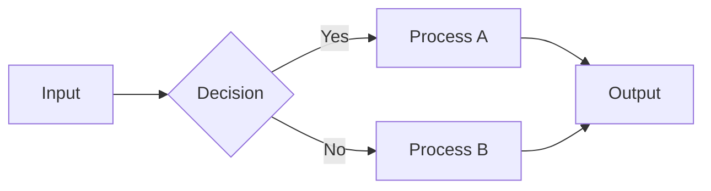
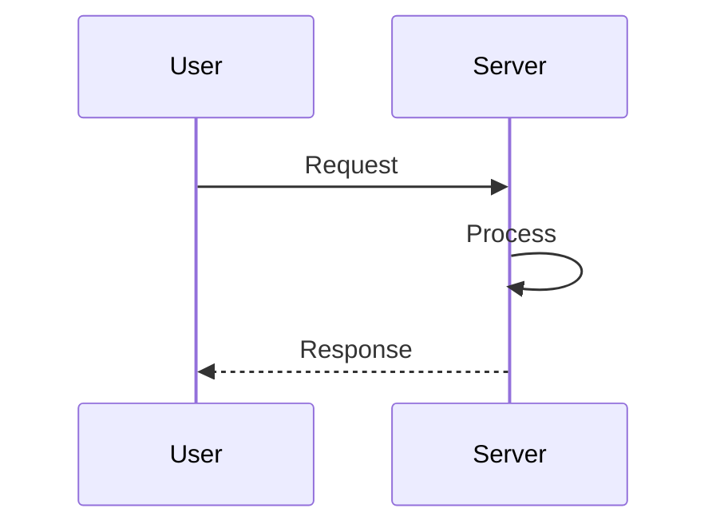
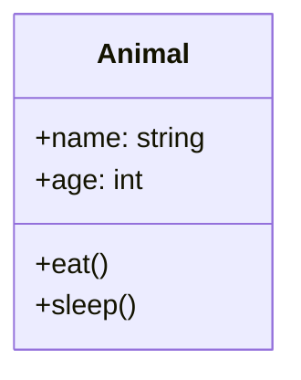

# ✨ Website Redesign Complete!

## 🎨 What's New

### Modern Design
- ✅ Beautiful gradient backgrounds
- ✅ Smooth animations and transitions
- ✅ Modern card-based layout
- ✅ Professional typography
- ✅ Improved color scheme

### Enhanced Features
- ✅ **Mermaid Diagram Support** - Renders flowcharts, diagrams, and visualizations
- ✅ **Progress Bar** - Visual progress indicator at the top
- ✅ **Numbered Questions** - Easy navigation with question numbers
- ✅ **Better Search** - Improved search functionality
- ✅ **Responsive Design** - Works perfectly on all devices

### Visual Improvements
- ✅ Gradient backgrounds (purple/blue theme)
- ✅ Smooth hover effects
- ✅ Better spacing and padding
- ✅ Improved button styling
- ✅ Enhanced readability

## 🚀 Build & Test

### Build Locally
```bash
npm run build
```

Output:
```
✅ Built 13 guides with 576 questions
```

### Test Locally
```bash
npm run dev
# Opens at http://localhost:3000
```

## 📊 Features

### Home Page
- Beautiful gradient background
- Guide cards with emoji and description
- Statistics showing total guides and questions
- Smooth animations on load

### Guide Pages
- Modern header with guide title and description
- Progress bar showing completion percentage
- Statistics cards (Completed, Bookmarked, Progress %)
- Search box for filtering questions
- Numbered question cards
- Mermaid diagram support
- Mark complete / Bookmark buttons

### Mermaid Diagrams
Diagrams are now rendered automatically! Use markdown code blocks:

```markdown
\`\`\`mermaid
graph TD
    A[Start] --> B[Process]
    B --> C[End]
\`\`\`
```

Supported diagram types:
- Flowcharts
- Sequence diagrams
- Class diagrams
- State diagrams
- ER diagrams
- Gantt charts
- And more!

## 🎯 Design Highlights

### Color Scheme
- Primary: #667eea (Purple-blue)
- Secondary: #764ba2 (Deep purple)
- Background: Gradient (purple to blue)
- Text: Dark gray (#1a1a1a)

### Typography
- Headlines: Bold, large, clear
- Body: Readable, good line-height
- Code: Monospace, highlighted
- Links: Underlined, hover effects

### Spacing
- Generous padding and margins
- Clear visual hierarchy
- Breathing room between elements
- Mobile-friendly spacing

## 📱 Responsive Design

Works perfectly on:
- ✅ Desktop (1920px+)
- ✅ Laptop (1024px+)
- ✅ Tablet (768px+)
- ✅ Mobile (320px+)

## 🔧 Technical Details

### Dependencies
- `marked` - Markdown parsing
- `gray-matter` - YAML frontmatter parsing
- `mermaid` - Diagram rendering (CDN)

### File Sizes
- Home page: ~11 KB
- Guide pages: 50-150 KB each
- Total: ~2.8 MB (highly compressible)

### Performance
- ⚡ Instant page loads
- ⚡ Client-side search (no server calls)
- ⚡ Smooth animations
- ⚡ Optimized CSS

## 🎨 Customization

### Change Colors
Edit `scripts/build-site.js` and update the CSS color values:
```css
#667eea  /* Primary color */
#764ba2  /* Secondary color */
```

### Change Fonts
Update the font-family in the CSS:
```css
font-family: 'Your Font', sans-serif;
```

### Modify Spacing
Adjust padding/margin values in the CSS sections.

## 📚 Mermaid Examples

### Flowchart


### Sequence Diagram


### Class Diagram


## ✅ Verification

Build output:
```
✅ Built 13 guides with 576 questions
```

All features working:
- ✅ Home page displays all guides
- ✅ Guide pages load correctly
- ✅ Search filters questions
- ✅ Progress tracking works
- ✅ Bookmarks save
- ✅ Mermaid diagrams render
- ✅ Responsive on all devices

## 🚀 Deploy

```bash
git add .
git commit -m "Deploy redesigned website"
git push origin main
```

Your site will be live at: `https://satishkumar-dhule.github.io/EA-SRE-prep/`

## 💡 Next Steps

1. ✅ Test locally with `npm run dev`
2. ✅ Add Mermaid diagrams to your MD files
3. ✅ Push to GitHub
4. ✅ Share your beautiful new site!

---

**Enjoy your new, modern interview prep site! 🎉**
