# System Design Visual Interview Prep

## 🎯 Quick Navigation
- [1. Design a URL Shortener](#1-design-a-url-shortener)
- [2. Design a Social Media News Feed](#2-design-a-social-media-news-feed)
- [3. Design a Chat Application](#3-design-a-chat-application)
- [4. Design a Video Streaming Service](#4-design-a-video-streaming-service)
- [5. Design a File Storage Service](#5-design-a-file-storage-service)
- [6. Design a Search Engine Typeahead](#6-design-a-search-engine-typeahead)
- [7. Design an API Rate Limiter](#7-design-an-api-rate-limiter)
- [8. Design a Notification System](#8-design-a-notification-system)
- [9. Design a Recommendation System](#9-design-a-recommendation-system)
- [10. Design a Location-Based Service](#10-design-a-location-based-service)
- [11. Design an E-commerce System](#11-design-an-e-commerce-system)
- [12. Design a Web Crawler](#12-design-a-web-crawler)
- [13. Design an Online Bookstore](#13-design-an-online-bookstore)
- [14. Design an ATM System](#14-design-an-atm-system)
- [15. Design a Parking Lot System](#15-design-a-parking-lot-system)
- [16. Design a Distributed Cache](#16-design-a-distributed-cache)
- [17. Design a Distributed Job Scheduler](#17-design-a-distributed-job-scheduler)
- [18. Design an Authentication System](#18-design-an-authentication-system)
- [19. Design a Content Delivery Network (CDN)](#19-design-a-content-delivery-network-cdn)
- [20. Design a Pub/Sub System](#20-design-a-pubsub-system)
- [21. Design a Distributed Key-Value Store](#21-design-a-distributed-key-value-store)
- [22. Design a Distributed Message Queue](#22-design-a-distributed-message-queue)
- [23. Design a Distributed File System (like HDFS)](#23-design-a-distributed-file-system-like-hdfs)
- [24. Design a Distributed Transaction System](#24-design-a-distributed-transaction-system)
- [25. Design a Distributed ID Generator](#25-design-a-distributed-id-generator)
- [26. Design a Distributed Locking Service](#26-design-a-distributed-locking-service)
- [27. Design a Distributed Consensus System (like Paxos or Raft)](#27-design-a-distributed-consensus-system-like-paxos-or-raft)
- [28. Design a Distributed Log Storage (like Kafka)](#28-design-a-distributed-log-storage-like-kafka)
- [29. Design a Real-time Analytics System](#29-design-a-real-time-analytics-system)
- [30. Design a Write-Ahead Log (WAL)](#30-design-a-write-ahead-log-wal)
- [31. Design an Anti-Entropy Protocol](#31-design-an-anti-entropy-protocol)
- [32. Design a Global Load Balancer](#32-design-a-global-load-balancer)
- [33. Design a Distributed Tracing System](#33-design-a-distributed-tracing-system)
- [34. Design a Distributed Configuration Service](#34-design-a-distributed-configuration-service)
- [35. Design a Distributed Logging System](#35-design-a-distributed-logging-system)
- [36. Design a Leader Election Service](#36-design-a-leader-election-service)
- [37. Design a Circuit Breaker Pattern](#37-design-a-circuit-breaker-pattern)
- [38. Design an Asynchronous Task Queue](#38-design-an-asynchronous-task-queue)
- [39. Design a Geo-Distributed Database](#39-design-a-geo-distributed-database)
- [40. Design a Write-Ahead Log (WAL)](#40-design-a-write-ahead-log-wal)
- [41. Design a Distributed Search Engine](#41-design-a-distributed-search-engine)
- [42. Design a Distributed Graph Database](#42-design-a-distributed-graph-database)
- [43. Design a Distributed Time Series Database](#43-design-a-distributed-time-series-database)
- [44. Design a Distributed Queue for Analytics](#44-design-a-distributed-queue-for-analytics)
- [45. Design a Consistent Hashing Ring](#45-design-a-consistent-hashing-ring)
- [46. Design a Peer-to-Peer File Sharing System](#46-design-a-peer-to-peer-file-sharing-system)
- [47. Design a Real-time Auction System](#47-design-a-real-time-auction-system)
- [48. Design an Ad Server](#48-design-an-ad-server)
- [49. Design a Matching System (like Uber/Lyft rider-driver matching)](#49-design-a-matching-system-like-uberlyft-rider-driver-matching)
- [50. Design a Recommendation System for Live Events](#50-design-a-recommendation-system-for-live-events)

---

### 1. Design a URL Shortener
Design a service like TinyURL or bit.ly that takes a long URL and generates a unique, short alias.

```mermaid
graph TD
    subgraph "Write Path (Create Short URL)"
        User[👩‍💻 User] -- POST /create_url --> APIServer{🌐 API Server}
        APIServer -- "Generates unique hash" --> HashGen[#️⃣ Hash Generator]
        HashGen -- "If hash exists, retry" --> DB[(🗄️ Database)]
        APIServer -- "Saves long_url, short_hash" --> DB
        APIServer -- "Returns short URL" --> User
    end

    subgraph "Read Path (Redirect)"
        User2[👩‍💻 User] -- GET /<short_hash> --> LoadBalancer[⚖️ Load Balancer]
        LoadBalancer --> ReadReplicas[🌐 Read Replicas]
        ReadReplicas -- "Look up long_url by hash" --> Cache[⚡ Cache (Redis)]
        Cache -- Cache Miss --> DB
        ReadReplicas -- "301 Redirect" --> User2
    end
```

**Core Components & Concepts:**
- ⛩️ **API Gateway/Load Balancer**: Distributes traffic, handles routing.
- ⚙️ **Application Service**:
    - **Write API (`/create_url`)**: Handles creation of new short URLs. Must ensure hash uniqueness.
    - **Read API (`/<short_hash>`)**: Handles redirection. Must be extremely fast and scalable.
- #️⃣ **Hash Generation**:
    - Could be a simple hash (e.g., MD5 of the long URL) and take the first 6-7 characters. Prone to collisions.
    - Better: Use a dedicated service (like a counter) to generate a unique ID, then convert it to a Base62 or Base64 string. This guarantees no collisions.
- 🗄️ **Database**:
    - A NoSQL database like DynamoDB or Cassandra is a good fit. The primary access pattern is a key-value lookup (`short_hash` -> `long_url`).
    - The table schema is simple: `short_hash` (Partition Key), `long_url`, `created_at`, etc.
- ⚡ **Cache**:
    - To handle high read traffic, a cache (like Redis or Memcached) is essential. It stores the most frequently accessed short URLs.
    - **Cache Strategy**: Read-through. The application looks in the cache first. If the entry isn't there (cache miss), it queries the database and then populates the cache with the result.

**Scalability & Considerations:**
- **Read/Write Ratio**: This system is extremely read-heavy. Optimize for fast reads by scaling read replicas and having a robust caching layer.
- **Data Partitioning**: The database can be sharded based on the `short_hash` to distribute the load.
- **Vanity URLs**: Allow users to choose their own short URLs. This requires an extra check for uniqueness at creation time.
- **Analytics**: Track click-through rates and other metrics. This can be done asynchronously by sending an event to a message queue (like SQS or Kafka) on each redirect.

---

### 2. Design a Social Media News Feed
Design the backend for a news feed on a platform like Facebook or Twitter.

```mermaid
graph TD
    subgraph "Fan-out on Write (Push Model)"
        direction LR
        UserA[👩‍💻 User A<br>Posts a photo] --> PostService[📝 Post Service]
        PostService -- "Writes post to DB" --> PostDB[(🗄️ Posts DB)]
        PostService -- "Sends post to Fan-out service" --> FanoutService[🌪️ Fan-out Service]
        
        FanoutService -- "Gets User A's followers" --> UserGraphDB[(👥 User Graph)]
        UserGraphDB -- "Followers: B, C, D" --> FanoutService
        
        FanoutService -- "Injects Post ID into feeds" --> FeedCacheB[⚡ User B's Feed<br>(Redis List)]
        FanoutService -- "Injects Post ID into feeds" --> FeedCacheC[⚡ User C's Feed<br>(Redis List)]
        FanoutService -- "Injects Post ID into feeds" --> FeedCacheD[⚡ User D's Feed<br>(Redis List)]
    end

    subgraph "Read Path"
        UserB[👨‍💻 User B<br>Fetches Feed] --> FeedService[📰 Feed Service]
        FeedService -- "Gets Post IDs from cache" --> FeedCacheB
        FeedService -- "Hydrates posts from DB/Cache" --> PostDB
        FeedService -- "Returns generated feed" --> UserB
    end
```
**Core Components & Concepts:**
- 👤 **Users**: Can create posts and follow other users.
- 📝 **Post Service**: Handles the creation of new posts.
- 📰 **Feed Service**: Responsible for generating a user's news feed.
- 🌪️ **Fan-out Service**: The core logic for delivering posts to followers' feeds.
- 🗄️ **Databases**:
    - **Posts DB**: Stores post content (text, image URLs, etc.). Can be a NoSQL database like Cassandra.
    - **User Graph DB**: Stores the follower/following relationships. A graph database like Neo4j is ideal, but a relational or key-value store can also work.
- ⚡ **Feed Cache**:
    - A dedicated cache (like Redis Lists or ZSETs) for each user's feed.
    - This cache stores a list of Post IDs, which are then "hydrated" (i.e., the full post content is fetched) by the Feed Service.

**Design Choice: Fan-out on Write (Push) vs. Fan-out on Read (Pull)**
- **Fan-out on Write (Push)**: When a user posts, we immediately push that post into the feeds of all their followers.
    - **Pros**: Reading the feed is extremely fast (just a simple cache read).
    - **Cons**: Writing a post can be slow and resource-intensive, especially for "celebrity" users with millions of followers (the "celebrity problem").
- **Fan-out on Read (Pull)**: When a user requests their feed, we query the database to find all the people they follow, get their recent posts, and merge/rank them on the fly.
    - **Pros**: Writing is fast. Solves the celebrity problem.
    - **Cons**: Reading the feed is slow and complex. Doesn't scale well for most users.

**Hybrid Approach (The solution for the "celebrity problem"):**
- For most users (< 1000 followers), use the **push** model.
- For celebrities, use the **pull** model. When a regular user requests their feed, their pre-computed feed is merged with the latest posts from any celebrities they follow.

---

### 3. Design a Chat Application
Design a 1-on-1 and group chat application like WhatsApp or Messenger.

```mermaid
graph TD
    subgraph "User A (Sender)"
        ClientA[📱 Client A]
    end
    subgraph "User B (Receiver)"
        ClientB[📱 Client B]
    end

    subgraph "Backend Infrastructure"
        APIServer[🌐 API/Chat Server]
        WSServer[⚡ WebSocket Server]
        DB[(🗄️ Messages DB)]
    end
    
    ClientA -- "POST /send_message" --> APIServer
    APIServer -- "Persists message" --> DB
    APIServer -- "Forwards to WebSocket" --> WSServer

    WSServer -- "Maintains persistent connection" --> ClientA
    WSServer -- "Maintains persistent connection" --> ClientB
    
    WSServer -- "Pushes message to User B" --> ClientB
    ClientB -- "Sends 'Delivered' ack" --> WSServer
    WSServer -- "Pushes 'Delivered' status to User A" --> ClientA
```

**Core Components & Concepts:**
- 📱 **Clients**: Mobile (iOS/Android) or web clients that interact with the backend.
- 🌐 **API/Chat Server**: A stateless service that handles business logic like authentication, user profiles, contact management, and sending messages (via HTTP POST).
- ⚡ **WebSocket Server**: A stateful service that maintains persistent WebSocket connections with online users. This is the core of real-time messaging. When a message is sent, the API server forwards it to the WebSocket server, which then pushes it to the correct recipient(s) over the open connection.
- 🗄️ **Database**:
    - A NoSQL database like Cassandra is excellent for chat applications due to its high write throughput and scalability.
    - **Data Model**: A common approach is to model chats by `chat_id` and use a clustering key based on `timestamp` to store messages in chronological order. `(chat_id, timestamp)` -> `message_content`.
- 🔌 **Persistent Connections**:
    - **WebSockets** are the standard for bidirectional, real-time communication. They keep a connection open between the client and server, allowing the server to push data to the client without the client having to poll for it.
    - **Long Polling** can be a fallback for older clients or networks that don't support WebSockets.

**Scalability & Features:**
- **Service Discovery**: The client needs to know which WebSocket server to connect to. A service discovery mechanism (like ZooKeeper or Consul) can help a client find the server that is holding its connection.
- **Group Chat**: The logic is similar, but when a message is sent to a group, the server must look up all members of the group and push the message to each online member.
- **Read/Delivered/Typing Status**: These are small, frequent events. They can be sent over the WebSocket connection and can be treated as ephemeral—they don't necessarily need to be persisted in the main database.
- **Offline Users**: If a user is offline, messages are stored in the database. When they come online, the client can query the API server for any messages received since their last online time.

---

### 4. Design a Video Streaming Service
Design a service like YouTube or Netflix, focusing on video upload and playback.

```mermaid
graph TD
    subgraph "Video Upload (Write Path)"
        User[👩‍💻 Creator] -- 1. Upload Video --> API[🌐 API Server]
        API -- 2. Store Raw Video --> RawStorage[💾 Raw File Storage (S3)]
        API -- 3. Create Job in Queue --> MQ[🔄 Message Queue (Kafka)]
        MQ -- 4. Trigger Worker --> Transcoder[⚙️ Video Transcoder]
        Transcoder -- 5. Process Video --> ProcessedStorage[💾 Processed File Storage (S3)]
        ProcessedStorage -- "Multiple Formats (1080p, 720p, 480p)" --> CDN
        Transcoder -- 6. Update DB with metadata --> DB[(🗄️ Metadata DB)]
    end

    subgraph "Video Playback (Read Path)"
        Viewer[👨‍💻 Viewer] -- 1. Request Video --> APIServer[🌐 API Server]
        APIServer -- 2. Get Video Metadata --> DB
        APIServer -- 3. Return CDN links --> Viewer
        Viewer -- 4. Stream from nearest edge --> CDN[🌍 CDN (CloudFront)]
    end
```

**Core Components & Concepts:**
- 💾 **File Storage (S3/GCS)**: Object storage is used to hold the video files. We need separate buckets for raw, unprocessed videos and for the processed, streamable formats.
- 🔄 **Message Queue (Kafka/SQS)**: Decouples the upload process from the transcoding process. When a video is uploaded, a message is placed on the queue.
- ⚙️ **Video Transcoder**: A fleet of worker services that consume messages from the queue. Their job is to:
    - **Transcode**: Convert the raw video into multiple formats and bitrates (e.g., 1080p H.264, 720p H.264, 480p VP9). This is crucial for **Adaptive Bitrate Streaming**.
    - **Chunking**: Break the video files into small segments (e.g., 2-10 seconds long). This allows the player to switch bitrates mid-stream and start playback faster.
    - **Generate Thumbnails**: Create preview images from the video.
- 🗄️ **Metadata Database (e.g., Cassandra, MySQL)**: Stores information about the videos, such as title, description, user, and the locations (CDN URLs) of the different video formats and chunks.
- 🌍 **Content Delivery Network (CDN)**: This is the most critical component for playback. The processed video chunks are distributed to CDN edge locations around the world. When a user streams a video, they download the chunks from the CDN server closest to them, which ensures low latency and high throughput.

**Workflow & Key Ideas:**
- **Asynchronous Processing**: The video upload and transcoding process is highly asynchronous and handled by background workers. This allows the user to get an immediate "Upload successful" response while the heavy lifting happens in the background.
- **Adaptive Bitrate Streaming**: The player client (e.g., on your phone) constantly monitors network conditions. If the connection is good, it requests high-quality (high bitrate) chunks. If the connection worsens, it seamlessly switches to requesting lower-quality chunks, preventing buffering.
- **Scalability**: The transcoder workers can be auto-scaled based on the length of the message queue. The CDN handles the massive read load of video streaming.

---

### 5. Design a File Storage Service
Design a service like Dropbox or Google Drive.

```mermaid
graph TD
    User[👩‍💻 User]
    
    subgraph "Client Application"
        FileWatcher[👁️ File Watcher]
        Chunker[🔪 Chunker]
        LocalDB[📝 Local Metadata DB]
    end

    subgraph "Backend Services"
        APIServer[🌐 API Server]
        BlockStore[💾 Block Store (S3)]
        MetadataDB[(🗄️ Metadata DB)]
        NotificationService[📣 Notification Service]
    end

    User -- "Saves file 'report.docx'" --> FileWatcher
    FileWatcher --> Chunker
    Chunker -- "Splits file into A, B, C and uploads them" --> APIServer
    APIServer -- "Stores chunks" --> BlockStore
    APIServer -- "Updates file metadata" --> MetadataDB
    APIServer -- "Notifies other clients" --> NotificationService
    NotificationService -- "Pushes update to..." --> OtherClient[📱 User's Phone]
```

**Core Components & Concepts:**
- 📱 **Client Application**: The application running on the user's device (desktop, phone). This is a complex piece of software.
    - **File Watcher**: Monitors the local filesystem for any changes (create, update, delete).
    - **Chunker**: To handle large files efficiently and enable delta syncing, files are broken down into smaller, fixed-size (or variable-size) chunks.
    - **Local Metadata DB**: Keeps track of file versions and which chunks belong to which file.
- 🌐 **API Server**: The gateway to the backend. It handles authentication, file metadata operations, and requests to upload/download blocks.
- 💾 **Block Store (S3/Blob Storage)**: The actual file chunks (blocks) are stored in a highly durable object store like S3. Each chunk is typically content-addressed (its key is a hash of its content), which provides automatic deduplication.
- 🗄️ **Metadata Database (MySQL/PostgreSQL)**: This is the heart of the system. It stores the filesystem hierarchy, file names, versions, and the mapping of which blocks make up which file. A relational database is often a good choice here because of the need for transactional integrity.
- 📣 **Notification Service**: When one client uploads a change, other clients for the same user need to be notified so they can pull down the latest changes. This is often done using long polling or WebSockets.

**Key Syncing Logic:**
1.  User A modifies a file on their laptop.
2.  The client's **File Watcher** detects the change.
3.  The client **chunks** the file. It computes hashes of the new chunks.
4.  The client communicates with the **API Server**, asking "Do you have chunks with hashes X, Y, Z?".
5.  The backend checks the **Block Store**. If it already has a chunk (from another user or a previous version of the file), it doesn't need to be re-uploaded. This is **deduplication**.
6.  The client uploads only the new, unique chunks.
7.  The client tells the API Server: "File 'report.docx', version 2, is now composed of chunks X, Y, and Z."
8.  The API server updates the **Metadata DB**.
9.  The API Server notifies the **Notification Service** that the file has changed.
10. The Notification Service sends a push notification to User A's phone.
11. The client on the phone then connects to the API server to get the latest metadata and downloads only the required chunks.

---

### 6. Design a Search Engine Typeahead
Design the backend for a typeahead/autocomplete suggestion service.

```mermaid
graph TD
    User[👩‍💻 User] -- "Types 'syst...'" --> APIServer[🌐 API Server]
    APIServer -- "Forwards 'syst'" --> Service[💡 Typeahead Service]
    
    subgraph "Trie Data Structure"
        TrieRoot(" ") --- s
        s --- y
        y --- s
        s --- t
        t --- e
        e --- m
        m -- "is_word=true, freq=99" --> system(system)
        m --- d("d")
        d --- e2("e")
        e2 --- s2("s")
        s2 --- i("i")
        i --- g("g")
        g --- n("n")
    end

    Service -- "Finds all words under prefix 'syst'" --> Trie
    Trie -- "Returns: 'system' (99), 'systolic' (10), ..." --> Service
    Service -- "Returns top K results" --> APIServer
    APIServer --> User
```

**Core Components & Concepts:**
- 💡 **Typeahead Service**: A specialized service that takes a prefix string and returns a list of ranked suggestions.
- 🌳 **Trie (Prefix Tree)**: This is the core data structure for this problem.
    - Each node in the trie represents a character.
    - A path from the root to a node represents a prefix.
    - Nodes can be marked as "end of word" and can store metadata, like the frequency of the search term.
- 🗄️ **Frequency Data**: To provide relevant suggestions, the system needs to know which search terms are popular. This data can be gathered from historical search logs.

**Detailed Workflow:**
1.  **Data Gathering**: An offline job processes historical search logs to count the frequency of each search query.
2.  **Trie Construction**: Periodically (e.g., once a day), a new trie is built using the latest frequency data. All search queries are inserted into the trie.
3.  **Distribution**: The constructed trie is distributed to every instance of the Typeahead Service. Since the trie can be large, it's often loaded directly into memory for fast access.
4.  **Querying**:
    - A user types a prefix (e.g., "des").
    - The request hits the Typeahead Service.
    - The service traverses the trie to the node corresponding to the prefix "des".
    - It then performs a depth-first search from that node to find all child nodes that represent complete words (e.g., "design", "designer", "design patterns").
    - The results are collected along with their frequencies.
5.  **Ranking**: The collected results are ranked, primarily by frequency. Other factors like personalization or recent trends can also be included. The top K (e.g., 10) results are returned to the user.

**Scalability & Optimization:**
- **Sharding the Trie**: If the trie is too large to fit on a single machine, it can be sharded. A common approach is to shard by the first character or first few characters of the query. A load balancer would route a request for "design" to the "d" shard.
- **Caching**: The results for very common prefixes can be cached in a layer like Redis to reduce computation.
- **Updating the Trie**: Updating the trie in-place can be complex. A common strategy is to build a new trie offline and then hot-swap it into production servers, which ensures zero downtime and consistent results.

---

### 7. Design an API Rate Limiter
Design a system that can limit the number of requests a user can make to an API within a certain time window.

```mermaid
graph TD
    UserReq[👨‍💻 User Request] --> APIGateway[⛩️ API Gateway]
    APIGateway -- "Before routing, check rate limit" --> RateLimiter[🚦 Rate Limiter Middleware]

    subgraph "Rate Limiter Logic (Token Bucket)"
        Cache[(⚡ Distributed Cache<br>e.g., Redis)]
        RateLimiter -- "GET user_id's bucket" --> Cache
        Cache -- "{tokens: 4, timestamp: ...}" --> RateLimiter
        RateLimiter -- "Decrement token. OK?" --> IsOK{Allow?}
        IsOK -- Yes --> RouteRequest[✅ Route to Upstream]
        IsOK -- No --> RejectRequest[❌ Reject (429)]
        RateLimiter -- "UPDATE bucket" --> Cache
    end
    
    RouteRequest --> UpstreamService[🏭 API Service]
```

**Core Components & Concepts:**
- 🚦 **Rate Limiter Middleware**: This logic sits at the API Gateway or in the service itself. It intercepts every incoming request before it's processed.
- ⚡ **Distributed Cache (Redis)**: A fast, shared data store is needed to keep track of request counts for each user across all servers. Redis is perfect for this because:
    - It's extremely fast (in-memory).
    - It has atomic operations (like `INCR`), which are crucial for avoiding race conditions.

**Algorithms:**

1.  **Token Bucket (Most common and flexible):**
    - **Concept**: Each user has a "bucket" that holds a certain number of tokens. The bucket is refilled with tokens at a fixed rate.
    - **Implementation**: For each user, store `tokens` and `last_refill_timestamp` in Redis.
    1.  When a request comes in, calculate how many tokens should be added to the bucket since the last refill.
    2.  If the bucket has at least 1 token, the request is allowed. Decrement the token count.
    3.  If the bucket is empty, the request is rejected (HTTP 429 Too Many Requests).
    - **Pros**: Smooths out bursts of traffic. A user can save up tokens to make a burst of requests.

2.  **Fixed Window Counter:**
    - **Concept**: Count requests from a user within a fixed window (e.g., a calendar minute).
    - **Implementation**: For each user, use a Redis key like `user_id:timestamp`. On each request, run `INCR` on the key and set an expiration (`EXPIRE`) for the window length.
    - **Cons**: Can lead to a flood of traffic at the edge of a window. A user could make 100 requests at 11:59:59 and another 100 at 12:00:01, effectively getting 2x the rate.

3.  **Sliding Window Log:**
    - **Concept**: Store a timestamp for every request in a list (e.g., Redis ZSET). When a new request comes in, count how many requests have occurred in the last N seconds.
    - **Pros**: Very accurate.
    - **Cons**: Uses a lot of memory, as you have to store a timestamp for every single request.

**Scalability Considerations:**
- **Centralized vs. Distributed**: The counter must be centralized (in Redis, Memcached, etc.). If each API server had its own counter in memory, a user could simply round-robin their requests to different servers to bypass the limit.
- **Performance**: The rate-limiting check must be extremely fast to avoid adding latency to every API call. This is why an in-memory store like Redis is used.
- **Race Conditions**: Use atomic operations (`INCR` in Redis) to avoid issues where two requests from the same user arrive at the same time on different servers, both read the same count, and both incorrectly allow the request.

---

### 8. Design a Notification System
Design a system that can send push notifications, emails, and SMS messages to users.

```mermaid
graph TD
    subgraph "Triggering Systems"
        A[👨‍💻 User Action<br>e.g., likes a photo]
        B[⏰ Scheduled Event<br>e.g., marketing email]
    end

    subgraph "Notification Service"
        APIServer[🌐 API Server]
        MsgQueue[🔄 Message Queue (Kafka/SQS)]
        Workers[⚙️ Worker Fleet]
        DB[(🗄️ Templates DB)]
    end

    subgraph "3rd Party Gateways"
        PushGateway[📱 APNS / FCM]
        SMSGateway[💬 Twilio]
        EmailGateway[✉️ SendGrid]
    end

    A --> APIServer
    B --> APIServer
    APIServer -- "1. Send 'like' event" --> MsgQueue
    Workers -- "2. Consume event" --> MsgQueue
    Workers -- "3. Get user prefs & template" --> DB
    Workers -- "4. Format message and send to gateway" --> PushGateway
    Workers -- "..." --> SMSGateway
    Workers -- "..." --> EmailGateway
```

**Core Components & Concepts:**
- 🌐 **API Server**: An endpoint for other microservices (or scheduled jobs) to call when they want to send a notification. The request might be simple, like `send(user_id, event_type='photo_liked', context={...})`.
- 🔄 **Message Queue (Kafka/SQS)**: The backbone of the system. It decouples the API server from the workers that actually send the notifications. This provides resiliency (if a sending service is down, messages wait in the queue) and allows for easy scaling of workers.
- ⚙️ **Worker Fleet**: A group of stateless services that consume messages from the queue. Each worker:
    1.  Picks up a message (e.g., `user_id: 123` got a new like).
    2.  Fetches the user's notification preferences from a database (e.g., "Does this user want push notifications for likes?").
    3.  Fetches the message template (e.g., "Your photo was liked by {name}").
    4.  Formats the final message.
    5.  Sends the message to the appropriate third-party gateway.
- 🗄️ **Databases**:
    - **User Prefs DB**: Stores user preferences for notifications.
    - **Templates DB**: Stores message templates.
- 📱 **Third-Party Gateways**: The actual sending of notifications is outsourced to specialized services:
    - **Push**: APNS (Apple), FCM (Google)
    - **SMS**: Twilio, Vonage
    - **Email**: SendGrid, Mailchimp

**Scalability and Reliability:**
- **Retries and Dead-Letter Queues (DLQ)**: If a third-party gateway is down, the worker should retry sending the message a few times with exponential backoff. If it continues to fail, the message should be moved to a DLQ for manual inspection later.
- **Idempotency**: What if a worker processes a message but crashes before it can mark the message as complete? The message might be processed again. The system should be designed to be idempotent (sending the same notification twice has no adverse effect, or is prevented by checking a unique message ID).
- **Throttling/Batching**: To avoid overwhelming users or third-party gateways, you can implement logic to batch notifications (e.g., "You have 15 new likes") or throttle the rate at which you send them.

---

### 9. Design a Recommendation System
Design a system like Netflix's "Recommended for You" or Amazon's "Customers who bought this also bought...".

```mermaid
graph TD
    subgraph "Offline Processing (Batch / ML Training)"
        Data[📊 User Activity Data<br>(clicks, purchases, ratings)] --> DataPipeline[🔄 ETL/Spark Jobs]
        DataPipeline --> FeatureStore[🗄️ Feature Store]
        FeatureStore --> ModelTraining[🧠 Model Training (e.g., Collaborative Filtering)]
        ModelTraining --> TrainedModel[🤖 Trained Model]
        TrainedModel -- "Generates recommendations" --> RecsDB[(💎 Recommendations DB<br>user_id -> [item1, item2, ...])]
    end
    
    subgraph "Online Serving (Real-time)"
        User[👩‍💻 User] -- "GET /recommendations" --> RecService[💡 Recommendation Service]
        RecService -- "1. Get pre-computed recs" --> RecsDB
        RecsDB -- "[item1, item2, ...]" --> RecService
        RecService -- "2. Filter & Rank" --> RecService
        RecService -- "Returns top N" --> User
    end
```

**Core Components & Concepts:**
- 📊 **Data Collection**: The system needs to collect massive amounts of user interaction data: clicks, views, purchases, ratings, time spent on an item, etc. This is typically fed into a data lake or event stream like Kafka.
- 🔄 **Offline Data Processing (ETL/Spark)**: Batch jobs (e.g., using Apache Spark) run periodically to process the raw data, clean it, and transform it into features that can be used for model training.
- 🧠 **Model Training**: This is where the core machine learning happens.
    - **Collaborative Filtering**: A common technique. It finds users with similar tastes to you ("neighbors") and recommends items that they liked but you haven't seen yet.
    - **Content-Based Filtering**: Recommends items that are similar to other items you've liked. For example, if you watch a lot of action movies, it will recommend more action movies.
    - **Hybrid Models**: Most modern systems use a hybrid of these and other approaches (like deep learning).
- 💎 **Recommendations Database**: The output of the offline model training is a set of pre-computed recommendations for each user. This is often stored in a key-value store like Redis or Cassandra, where the key is the `user_id` and the value is a ranked list of `item_ids`.
- 💡 **Recommendation Service**: A lightweight API service that serves the recommendations. When a user requests recommendations, this service:
    1.  Fetches the pre-computed list of `item_ids` for that user from the Recommendations DB.
    2.  Performs any real-time filtering (e.g., remove items the user has already purchased or explicitly disliked).
    3.  Optionally, performs some light re-ranking based on real-time context.
    4.  Returns the final list to the user.

**System Properties:**
- **Batch vs. Real-time**: The heavy-duty model training is done offline in batch. The serving of recommendations needs to be a low-latency, real-time service.
- **Cold Start Problem**: How do you make recommendations for a new user or a new item?
    - **New User**: Start with generic recommendations (e.g., most popular items on the site) or ask them to select a few genres/items they like during signup.
    - **New Item**: Use content-based filtering. If a new movie is an "action" film, it can be recommended to users who like other action films.
- **Feedback Loop**: The system must constantly incorporate new user interactions to keep the recommendations fresh and relevant.

---

### 10. Design a Location-Based Service
Design a service like Uber or Yelp that can find nearby points of interest (e.g., drivers, restaurants).

```mermaid
graph TD
    subgraph "Driver/Provider (Writes)"
        Driver[🚗 Driver's Phone] -- "Periodically sends (lat, long, driver_id)" --> WriteAPI[🌐 Write API]
        WriteAPI -- "Updates driver location" --> DB[(🗄️ Geo-DB<br>Redis GEO / PostGIS)]
    end

    subgraph "Rider/Customer (Reads)"
        Rider[👩‍💻 Rider's Phone] -- "GET /nearby_drivers?lat=X&long=Y" --> ReadAPI[🌐 Read API]
        
        subgraph "Geohash/Quadtree Logic"
             ReadAPI -- "1. Find Geohash for (X,Y) and neighbors" --> DB
        end

        DB -- "Returns list of nearby drivers" --> ReadAPI
        ReadAPI -- "Returns drivers to Rider" --> Rider
    end
```

**Core Problem:** How to efficiently query for points within a certain radius of a given latitude/longitude. A naive database query that calculates the distance for every single point would be incredibly slow.

**Core Components & Concepts:**
- 🗄️ **Geospatial Database**: The key to this system is using a database that is optimized for geospatial queries.
    - **Specialized DBs**: PostGIS (an extension for PostgreSQL).
    - **In-Memory Caches**: Redis GEO commands (`GEOADD`, `GEORADIUS`) are extremely fast and well-suited for this use case, especially for ephemeral data like driver locations.
- **Spatial Indexing (The "Magic"):** To avoid scanning every point, the world is divided into a grid.
    - **Geohashing**: This is a popular technique. It encodes a latitude/longitude pair into a short string. The key property is that the longer two geohash strings share a prefix, the closer they are to each other. A search for nearby points becomes a simple database query for points whose geohash starts with a similar prefix.
    - **Quadtrees / S2 Geometry**: These are other hierarchical grid systems (Google's S2 is used for Maps) that achieve a similar goal. The map is recursively divided into smaller and smaller cells.

**Workflow:**
1.  **Write Path (Updating Locations)**:
    - Drivers' phones periodically send their `driver_id` and current `(lat, long)` to the Write API.
    - The service takes the `(lat, long)`, calculates its geohash (e.g., `9q8yy`).
    - It then updates the driver's location in the database. In Redis, this would be `GEOADD drivers 13.37, 35.68, driver_123`).

2.  **Read Path (Finding Nearby Points)**:
    - A rider opens the app. Their phone sends their current `(lat, long)` to the Read API.
    - The service calculates the geohash for the rider's location.
    - It then queries the database for all drivers in the rider's geohash cell *and* the 8 neighboring cells. This ensures you don't miss a driver who is right across a cell boundary.

---

### 21. Design a Distributed Key-Value Store
Design a highly available and scalable distributed key-value store like Amazon DynamoDB or Apache Cassandra.

```mermaid
graph TD
    Client[👩‍💻 Client] -- "1. PUT/GET key, value" --> LoadBalancer[⚖️ Load Balancer]
    LoadBalancer --> Coordinators[🌐 Coordinator Nodes]
    
    subgraph "Distributed Data Storage Nodes"
        NodeA[🗄️ Data Node A]
        NodeB[🗄️ Data Node B]
        NodeC[🗄️ Data Node C]
    end

    Coordinators -- "2. Hash key to find responsible nodes (Consistent Hashing)" --> Ring[#️⃣ Consistent Hashing Ring]
    Ring -- "3. Replicate data to N nodes (R=3)" --> NodeA
    Ring --> NodeB
    Ring --> NodeC

    NodeA -- "4. Acknowledge Write/Read" --> Coordinators
    NodeB -- "4. Acknowledge Write/Read" --> Coordinators
    NodeC -- "4. Acknowledge Write/Read" --> Coordinators

    Coordinators -- "5. Return success/failure (W=2, R=2)" --> Client
```

**Core Problem**: Store and retrieve data quickly with high availability and scalability, handling node failures and data distribution transparently.

**Core Components & Concepts:**
- 🌐 **Client**: Applications that interact with the key-value store.
- ⚖️ **Load Balancer**: Distributes client requests to available coordinator nodes.
- 🌐 **Coordinator Nodes**: Front-end nodes that receive client requests. They determine which data nodes are responsible for a given key and coordinate the read/write operations with them.
- 🗄️ **Data Nodes**: Store the actual key-value pairs. Data is partitioned and replicated across these nodes.
- #️⃣ **Consistent Hashing Ring**: A fundamental technique for distributing data across nodes and handling node additions/removals with minimal data reshuffling. Each key is hashed to a point on the ring, and then assigned to the next data node on the ring.
- **Replication**: Data is replicated across multiple data nodes (e.g., `N` replicas) to ensure durability and high availability.

**CAP Theorem & Tunable Consistency:**
- Distributed key-value stores typically prioritize **Availability** and **Partition Tolerance** over strong **Consistency** (Eventual Consistency).
- **Tunable Consistency (N, W, R)**:
    - `N`: Number of replicas (e.g., 3).
    - `W`: Minimum number of replicas that must acknowledge a write for it to be considered successful.
    - `R`: Minimum number of replicas that must respond for a read to be considered successful.
    - `W + R > N` guarantees strong consistency (e.g., `W=2, R=2, N=3` implies a read will always see the latest write).
    - `W + R <= N` implies eventual consistency.

**Scalability & Considerations:**
- **Horizontal Scalability**: Add more data nodes to increase storage capacity and throughput.
- **Fault Tolerance**: Replication ensures data is available even if some nodes fail. **Hinted Handoff** can store data for temporarily unreachable nodes.
- **Conflict Resolution**: With eventual consistency, concurrent writes to the same key on different replicas can lead to conflicts. Vector clocks or "last write wins" are common strategies.
- **Gossip Protocol**: Nodes communicate with each other to share information about their state, health, and what data they hold.

---

### 22. Design a Distributed Message Queue
Design a robust and scalable distributed message queue like Apache Kafka or RabbitMQ.

```mermaid
graph TD
    Producer[📝 Producer] -- "1. Publish Message (Topic A)" --> LoadBalancer[⚖️ Load Balancer]
    LoadBalancer --> Brokers[🔄 Broker Nodes]
    
    subgraph "Broker Cluster"
        Broker1[📦 Broker 1]
        Broker2[📦 Broker 2]
        Broker3[📦 Broker 3]
    end

    Brokers -- "2. Store Message (Topic A, Partition 0)" --> Broker1
    Brokers -- "2. Replicate to followers" --> Broker2
    Brokers -- "2. Replicate to followers" --> Broker3

    ConsumerGroup[👥 Consumer Group] -- "3. Subscribe to Topic A" --> Brokers
    ConsumerGroup -- "4. Pull Messages (Partition 0)" --> Broker1
    
    Consumer1[👩‍💻 Consumer 1] --> ConsumerGroup
    Consumer2[👨‍💻 Consumer 2] --> ConsumerGroup
```

**Core Problem**: Reliably transfer messages between distributed applications (producers and consumers) with high throughput, low latency, and fault tolerance.

**Core Components & Concepts:**
- 📝 **Producer**: An application that sends messages to the message queue.
- 👩‍💻 **Consumer**: An application that receives and processes messages from the message queue. Consumers typically belong to **Consumer Groups**.
- 🔄 **Broker Nodes**: Servers that form the message queue cluster. They receive messages from producers, store them, and deliver them to consumers.
- 🔖 **Topics**: Messages are categorized into topics. Producers publish messages to topics, and consumers subscribe to topics.
- **Partitions**: Each topic is divided into partitions. Partitions allow for parallel processing of messages within a topic and enable horizontal scalability.
- **Replication**: Partitions are replicated across multiple brokers to ensure high availability and durability.

**Key Features & Considerations:**
- **Durability**: Messages should not be lost, even if brokers fail. Replication and persistent storage are essential.
- **Ordering**: Message ordering is typically guaranteed within a single partition.
- **Scalability**: Can scale horizontally by adding more brokers and partitions.
- **Consumer Offsets**: Consumers keep track of their "offset" (the last message they successfully processed) within each partition. This allows them to resume processing from where they left off after a crash.
- **At-least-once Delivery**: A common guarantee, meaning a message is delivered at least once (it might be delivered multiple times if a consumer fails before acknowledging a message). Exactly-once is harder to achieve.
- **Message Acknowledgment**: Consumers acknowledge messages after processing them, allowing the broker to clean up.

---

### 23. Design a Distributed File System (like HDFS)
Design a fault-tolerant and scalable distributed file system.

```mermaid
graph TD
    Client[👩‍💻 Client] -- "1. Request File (read/write)" --> NameNode[🧠 NameNode<br>(Metadata Server)]
    
    subgraph "DataNode Cluster"
        DataNode1[💾 DataNode 1]
        DataNode2[💾 DataNode 2]
        DataNodeN[💾 DataNode N]
    end

    NameNode -- "2. Return Block Locations" --> Client
    Client -- "3. Read/Write Data Blocks" --> DataNode1
    Client -- "3. Read/Write Data Blocks" --> DataNode2
    Client -- "3. Read/Write Data Blocks" --> DataNodeN

    DataNode1 -- "4. Replicate Blocks" --> DataNode2
    DataNode2 -- "4. Replicate Blocks" --> DataNodeN

    NameNode -- "5. Periodically receives Heartbeat/Block Reports" --> DataNode1
    NameNode -- "..." --> DataNode2
    NameNode -- "..." --> DataNodeN
```

**Core Problem**: Store and manage very large files (terabytes to petabytes) across a cluster of commodity hardware, providing high throughput for large data reads and writes, and fault tolerance.

**Core Components & Concepts:**
- 🧠 **NameNode (Master Node)**: The central authority for file system metadata. It stores:
    - The file system tree (directories, files).
    - Metadata for all files (permissions, timestamps).
    - The mapping of files to data blocks and where those blocks are stored on DataNodes.
    - **Single Point of Failure**: Historically, NameNode was a SPOF. Modern systems use High-Availability (HA) NameNodes (e.g., active/standby).
- 💾 **DataNodes (Worker Nodes)**: Store the actual file data in blocks. They perform read/write operations based on client requests and periodically report their status and stored blocks to the NameNode (heartbeats and block reports).
- **Blocks**: Files are broken down into large blocks (e.g., 128MB or 256MB), which are replicated across multiple DataNodes (typically 3 for fault tolerance).
- **Client**: An application library that communicates with the NameNode for metadata operations and directly with DataNodes for data I/O.

**Workflow (Simplified Read/Write):**
- **Write**:
    1.  Client asks NameNode where to write a new file.
    2.  NameNode returns a list of DataNodes to store the file's blocks.
    3.  Client writes data directly to the DataNodes in a pipeline, with each DataNode replicating the block to the next.
- **Read**:
    1.  Client asks NameNode for the locations of a file's blocks.
    2.  NameNode returns the DataNode locations.
    3.  Client reads data directly from the nearest DataNodes.

**Scalability & Fault Tolerance:**
- **Horizontal Scalability**: Add more DataNodes to increase storage and throughput.
- **Fault Tolerance**: Replication of data blocks ensures data durability. If a DataNode fails, the NameNode detects it and initiates replication of lost blocks to new DataNodes.
- **High Throughput**: Optimized for sequential reads/writes of large files, not low-latency random access.

---

### 24. Design a Distributed Transaction System
Design a system that ensures atomicity, consistency, isolation, and durability (ACID) across multiple distributed services or databases.

```mermaid
graph TD
    Client[👩‍💻 Client] -- "1. Request Distributed Transaction" --> Orchestrator[⚙️ Transaction Orchestrator]

    subgraph "Participating Services"
        SvcA[📦 Service A]
        SvcB[📦 Service B]
        SvcC[📦 Service C]
    end

    subgraph "Databases"
        DBA[(🗄️ DB A)]
        DBB[(🗄️ DB B)]
        DBC[(🗄️ DB C)]
    end

    Orchestrator -- "2. Start Transaction (Prepare Phase)" --> SvcA
    Orchestrator -- "..." --> SvcB
    Orchestrator -- "..." --> SvcC

    SvcA -- "3. Local Transaction" --> DBA
    SvcB -- "3. Local Transaction" --> DBB
    SvcC -- "3. Local Transaction" --> DBC

    DBA -- "4. Report Ready/Abort" --> SvcA
    DBB -- "4. Report Ready/Abort" --> SvcB
    DBC -- "4. Report Ready/Abort" --> SvcC

    SvcA -- "5. Report Ready/Abort" --> Orchestrator
    SvcB -- "5. Report Ready/Abort" --> Orchestrator
    SvcC -- "5. Report Ready/Abort" --> Orchestrator

    Orchestrator -- "6. If all Ready, COMMIT (Commit Phase)" --> SvcA
    Orchestrator -- "Else, ROLLBACK (Rollback Phase)" --> SvcA
```

**Core Problem**: Maintain ACID properties when a single logical transaction spans multiple, independent databases or microservices, each with its own local transaction.

**Core Concepts:**
- ⚙️ **Transaction Orchestrator (Coordinator)**: A central component that coordinates the distributed transaction. It initiates the transaction, monitors the status of participants, and decides whether to commit or abort the entire transaction.
- 📦 **Participating Services**: Microservices that perform local transactions on their own databases. They must be able to "prepare" a transaction (lock resources, ensure ability to commit) and then either commit or roll back.
- 🗄️ **Local Databases**: Each service's independent database.

**Common Patterns:**

1.  **Two-Phase Commit (2PC)**:
    - **Phase 1 (Prepare)**: The coordinator sends a "prepare" message to all participants. Each participant executes its local transaction, writes a log record, and then votes "yes" (ready to commit) or "no" (abort).
    - **Phase 2 (Commit/Rollback)**:
        - If all participants vote "yes", the coordinator sends a "commit" message to all.
        - If any participant votes "no" or a timeout occurs, the coordinator sends an "abort" message to all.
    - **Pros**: Ensures atomicity (all or nothing).
    - **Cons**: Blocking protocol (participants remain locked while waiting for coordinator's decision), high latency, coordinator is a single point of failure.

2.  **Saga Pattern**:
    - A sequence of local transactions, where each transaction updates its own database and publishes an event.
    - If a local transaction fails, a compensating transaction is executed to undo the changes made by previous local transactions.
    - **Pros**: Non-blocking, better availability, suitable for microservices.
    - **Cons**: Complex to implement, eventual consistency, harder to reason about, challenges with compensating transactions.

**Considerations:**
- **Idempotency**: All operations in distributed transactions must be idempotent to handle retries.
- **Fault Tolerance**: The orchestrator must be fault-tolerant, and recovery mechanisms are needed if it fails.
- **Observability**: Distributed tracing is essential for debugging issues in such complex systems.

---

### 25. Design a Distributed ID Generator
Design a system to generate unique, monotonically increasing IDs across a distributed system, like Twitter's Snowflake or Instagram's ID system.

```mermaid
graph TD
    Client[👩‍💻 Client Application] -- "1. Request ID" --> LoadBalancer[⚖️ Load Balancer]
    LoadBalancer --> IDService[⚙️ ID Generator Service]
    
    subgraph "ID Generator Service (Worker Pool)"
        Worker1[💻 Worker 1]
        Worker2[💻 Worker 2]
        WorkerN[💻 Worker N]
    end

    IDService -- "2. Generate Unique ID" --> Worker1
    Worker1 -- "Uses Local State + Config" --> IDComponent[🛠️ ID Components]
    IDComponent -- "Time (41 bits)<br>Worker ID (10 bits)<br>Sequence (12 bits)" --> UniqueID[#️⃣ Unique, Monotonically Increasing ID]
    Worker1 -- "3. Return ID" --> IDService
    IDService -- "4. Return ID" --> Client
```

**Core Problem**: Generate unique IDs at a very high rate (e.g., millions per second) across multiple servers, without coordination overhead and with predictable ordering (monotonically increasing).

**Naive Approaches (and why they fail/are problematic):**
- **UUIDs**: Universally Unique Identifiers are unique but not monotonically increasing, and take up a lot of space.
- **Database AUTO_INCREMENT**: Becomes a bottleneck at high scale, not distributed.
- **Centralized Service**: Single point of failure, bottleneck.

**Twitter Snowflake Approach (or similar):**
The idea is to combine several components into a single 64-bit integer ID:
`ID = Timestamp (41 bits) | Worker ID (10 bits) | Sequence Number (12 bits)`

- #️⃣ **Timestamp (41 bits)**:
    - Typically milliseconds since a custom epoch (e.g., Twitter uses Nov 04, 2010).
    - This provides about 69 years of unique IDs.
    - Ensures IDs are roughly time-ordered (monotonically increasing).
- 💻 **Worker ID (10 bits)**:
    - A unique identifier for the specific ID generator instance (server/process) that generated the ID.
    - Allows for 1024 unique worker IDs. This must be provisioned and managed carefully (e.g., using ZooKeeper, Kubernetes StatefulSets).
- 🔢 **Sequence Number (12 bits)**:
    - A counter that increments for each ID generated by a single worker within the same millisecond.
    - Allows for 4096 unique IDs per millisecond per worker. If more are needed, the worker can pause until the next millisecond.

**Benefits:**
- **Unique**: Guaranteed unique across the distributed system.
- **Monotonically Increasing**: Roughly time-ordered, useful for sorting and indexing.
- **Distributed**: No central bottleneck, each worker generates IDs independently.
- **Low Latency**: IDs can be generated locally by the worker without network calls (once the Worker ID is assigned).

**Considerations:**
- **Clock Skew**: If a server's clock drifts backward, it can generate duplicate IDs. Solutions include detecting clock jumps and waiting, or refusing to generate IDs until the clock catches up.
- **Worker ID Management**: Requires a reliable mechanism to assign and manage unique worker IDs.

---

### 26. Design a Distributed Locking Service
Design a distributed locking service to coordinate access to shared resources across multiple processes/servers.

```mermaid
graph TD
    ClientA[👩‍💻 Client A] -- "1. Acquire Lock (resource_X)" --> LockService[🔒 Distributed Lock Service]
    ClientB[👨‍💻 Client B] -- "2. Acquire Lock (resource_X)" --> LockService
    
    subgraph "Lock Service (e.g., ZooKeeper, Consul, Redis)"
        Leader[🌟 Leader]
        Follower1[🤝 Follower 1]
        Follower2[🤝 Follower 2]
    end

    LockService -- "3. If available, grant lock to A" --> ClientA
    LockService -- "4. If A holds lock, B waits/fails" --> ClientB

    ClientA -- "5. Release Lock (resource_X)" --> LockService
    LockService -- "6. Grant lock to B (if waiting)" --> ClientB
```

**Core Problem**: Ensure that only one process or server can access a shared resource (e.g., a critical section of code, a shared file, a database record) at any given time, preventing race conditions and data corruption in a distributed environment.

**Core Concepts:**
- 🔒 **Distributed Lock Service**: A dedicated service or a mechanism within a distributed coordination system (like Apache ZooKeeper, HashiCorp Consul, or Redis with Redlock algorithm) that manages locks.
- **Clients**: The applications or services that need to acquire and release locks.
- **Shared Resource**: The resource that needs to be protected by the lock.

**Key Requirements & Challenges:**
- **Mutual Exclusion**: Only one client can hold the lock at any given time.
- **Liveness**:
    - **Deadlock-Free**: If a client acquires a lock and then crashes, the lock must eventually be released. This often involves **expiring locks** (time-to-live, TTL).
    - **Starvation-Free**: All clients eventually get the lock.
- **Fault Tolerance**: The locking service itself must be highly available and fault-tolerant.
- **Performance**: Acquiring and releasing locks should be fast to avoid becoming a bottleneck.

**Implementation Approaches:**

1.  **ZooKeeper/Consul**:
    - Use ephemeral sequential nodes. A client creates an ephemeral node. The client with the lowest sequence number gets the lock. If a client crashes, its ephemeral node is automatically deleted, releasing the lock.
    - **Pros**: Strongly consistent, built-in leadership election and watch mechanisms.
    - **Cons**: Relatively high latency compared to Redis, more complex to set up.

2.  **Redis (with Redlock algorithm)**:
    - Use `SET NX PX` (set if not exists, with expiration) across multiple independent Redis instances.
    - **Pros**: Very fast (in-memory).
    - **Cons**: Less robust than ZooKeeper for true distributed consensus (some theoretical edge cases where Redlock can fail to provide mutual exclusion).

**Considerations:**
- **Fencing Tokens**: To prevent a "fencing problem" where a client that thought it had the lock (but lost it due to a network partition) might still try to operate on the shared resource, a unique, monotonically increasing "fencing token" can be issued with each successful lock acquisition. The shared resource then only accepts operations with the latest token.
- **Reentrancy**: Can the same client re-acquire a lock it already holds? (Often yes, but needs careful design).

---

### 27. Design a Distributed Consensus System (like Paxos or Raft)
Design a system to achieve agreement on a single data value among a group of distributed processes.

```mermaid
graph TD
    Client[👩‍💻 Client] -- "1. Propose Value X" --> Leader[🌟 Leader]
    
    subgraph "Replicated Log / State Machine"
        Node1[⚙️ Node 1]
        Node2[⚙️ Node 2]
        Node3[⚙️ Node 3]
        Node4[⚙️ Node 4]
        Node5[⚙️ Node 5]
    end

    Leader -- "2. Append to its log" --> Leader
    Leader -- "3. Replicate Log Entry to Followers" --> Node2
    Leader -- "..." --> Node3
    Leader -- "..." --> Node4
    Leader -- "..." --> Node5

    Node2 -- "4. Acknowledge Receipt" --> Leader
    Node3 -- "..." --> Leader
    Node4 -- "..." --> Leader
    Node5 -- "..." --> Leader

    Leader -- "5. If Majority Acknowledge, Commit Entry" --> Leader
    Leader -- "6. Send Commit to Followers" --> Node2
    Leader -- "..." --> Node3
    Leader -- "..." --> Node4
    Leader -- "..." --> Node5
    
    Node1 --- Node2
    Node2 --- Node3
    Node3 --- Node4
    Node4 --- Node5
    Node5 --- Node1
```

**Core Problem**: In a distributed system, how can a set of unreliable processes agree on a single outcome or ordering of operations, even if some processes fail or network partitions occur? This is crucial for building fault-tolerant replicated state machines.

**Core Concepts:**
- **Leader Election**: In most practical consensus algorithms (like Raft), one node is elected as the **Leader**. All client requests go through the Leader. If the Leader fails, a new Leader is elected.
- **Replicated Log**: All changes to the system's state are applied by appending entries to a replicated log. Each node maintains a copy of this log.
- **Quorum**: Agreement is reached when a **majority** (more than half) of the nodes agree. This ensures that even if some nodes fail or become isolated, the system can still make progress, and any two majorities will always overlap, preventing divergent outcomes.
- **State Machine Replication**: Each node applies the committed log entries in the same order to its local state machine, ensuring that all healthy nodes have identical states.

**Raft Algorithm (Simplified Workflow):**
1.  **Leader Election**: Nodes are in either Follower, Candidate, or Leader state. If a Follower doesn't hear from the Leader, it becomes a Candidate and requests votes. The node with the majority of votes becomes the Leader.
2.  **Log Replication**:
    - Clients send requests (e.g., "set x = 5") to the Leader.
    - The Leader appends the request to its local log.
    - The Leader sends "AppendEntries" RPCs to all Followers, containing the new log entries.
    - Followers acknowledge receipt of the log entries.
    - Once a majority of Followers have acknowledged, the Leader "commits" the entry and applies it to its state machine.
    - The Leader then notifies Followers to commit the entry.

**Benefits:**
- **Fault Tolerance**: The system can continue to operate as long as a majority of nodes are healthy.
- **Consistency**: Guarantees that all committed decisions are consistent across the system.
- **Durability**: Committed data is stored persistently on multiple nodes.

**Comparison (Raft vs. Paxos):**
- **Paxos**: The original, more complex consensus algorithm.
- **Raft**: Designed to be more understandable and easier to implement than Paxos, while achieving the same fault-tolerant consensus.

---

### 28. Design a Distributed Log Storage (like Kafka)
Design a highly scalable, fault-tolerant, distributed log storage system optimized for event streaming.

```mermaid
graph TD
    Producer[📝 Producer] -- "1. Send event (Topic: 'orders', Key: order_id)" --> Brokers[🔄 Broker Cluster]
    
    subgraph "Broker Cluster"
        Broker1[📦 Broker 1]
        Broker2[📦 Broker 2]
        Broker3[📦 Broker 3]
    end

    Brokers -- "2. Route to Partition (based on Key/Round-robin)" --> Partition0[📄 Partition 0]
    Partition0 -- "3. Append to Log" --> Segment1[💾 Segment 1]
    Segment1 -- "4. Replicate to followers" --> Replicas[📦 Replicas]
    
    ConsumerGroup[👥 Consumer Group] -- "5. Subscribe to Topic 'orders'" --> Brokers
    ConsumerGroup -- "6. Read from Partition 0, Offset X" --> Partition0
    ConsumerGroup -- "7. Update Offset" --> Zookeeper[(🗄️ ZooKeeper/Meta Store)]
```

**Core Problem**: Store a continuous stream of records (events) in an append-only, immutable, distributed log, and allow multiple consumers to read from it at their own pace, with high throughput and durability.

**Core Components & Concepts (similar to Kafka):**
- 📝 **Producer**: Applications that publish events to a specific `Topic`.
- 🔄 **Broker Cluster**: A cluster of servers (Kafka brokers) that store the logs.
- 🔖 **Topic**: A category or feed name to which records are published.
- **Partitions**: Each Topic is divided into an ordered, immutable sequence of records called a `Partition`. Partitions are the unit of parallelism and allow a Topic to be scaled across multiple brokers.
- **Segments**: Partitions are stored on disk as a sequence of `Segment` files.
- **Replication**: Each partition has a configurable number of replicas (e.g., 3). One replica is the **Leader**, and the others are **Followers**. All reads and writes for a partition go through its Leader. Followers passively replicate the Leader's log.
- 👥 **Consumer Group**: A set of consumers that jointly consume messages from a topic. Each consumer in a group reads from one or more distinct partitions, ensuring that each message is processed only once by the group.
- 🗄️ **ZooKeeper/Metadata Store**: Used for storing cluster metadata, performing leader elections, and tracking consumer offsets.

**Key Features & Workflow:**
- **Append-Only Log**: Records are always appended to the end of a partition log. Once written, they are immutable.
- **High Throughput**: Achieved through partitioning, batching, and sequential disk I/O.
- **Durability**: Replication and persistent storage ensure messages are not lost.
- **Decoupling**: Producers and consumers are fully decoupled; they only interact with the brokers.
- **Consumer Control**: Consumers manage their own offsets, allowing them to rewind, replay, or skip messages.

---

### 29. Design a Real-time Analytics System
Design a system for real-time aggregation and querying of event streams, like a dashboard for live metrics or fraud detection.

```mermaid
graph TD
    EventSource[🌍 Event Sources<br>(Web Clicks, Sensor Data)] -- "1. Generate Events" --> IngestAPI[🌐 Ingest API]
    
    subgraph "Event Processing Pipeline"
        IngestAPI -- "2. Push to Stream" --> EventStream[🔄 Event Stream<br>(Kafka)]
        EventStream -- "3. Stream Processing" --> StreamProcessor[⚙️ Stream Processor<br>(Flink/Spark Streaming)]
    end

    StreamProcessor -- "4. Aggregate & Transform" --> RealtimeDB[📈 Real-time DB<br>(Druid/ClickHouse)]
    StreamProcessor -- "5. Load into Dashboard" --> DashboardDB[(🗄️ Dashboard Data Store)]

    User[👩‍💻 Analyst/Dashboard] -- "6. Query Data" --> QueryAPI[🌐 Query API]
    QueryAPI -- "7. Get Aggregations/Metrics" --> RealtimeDB
    QueryAPI -- "8. Get Dashboard Data" --> DashboardDB
    QueryAPI -- "9. Display Dashboard" --> User
```

**Core Problem**: Process a continuous, high-volume stream of events, perform aggregations and transformations on them in near real-time, and make the results available for low-latency querying and visualization.

**Core Components & Concepts:**
- 🌍 **Event Sources**: Any system generating data, such as web servers, IoT devices, payment systems, etc.
- 🌐 **Ingest API**: A highly scalable endpoint that receives raw events from various sources and pushes them into the event stream.
- 🔄 **Event Stream (Message Queue)**: A distributed message queue (like Kafka) that acts as a buffer and enables decoupling and replayability of events.
- ⚙️ **Stream Processor**: A real-time data processing engine (e.g., Apache Flink, Apache Spark Streaming, Kafka Streams) that consumes events from the stream. It performs:
    - **Filtering**: Selecting relevant events.
    - **Transformations**: Changing event formats.
    - **Aggregations**: Calculating metrics over time windows (e.g., "count of clicks in the last 5 minutes").
    - **Joins**: Combining events from different streams.
- 📈 **Real-time Database/Data Store**: A database optimized for high-volume writes and low-latency analytical queries (e.g., Apache Druid, ClickHouse, Apache Pinot). It stores the aggregated and processed data.
- 🌐 **Query API**: An API layer that allows users or dashboard applications to query the real-time data stores.
- 👩‍💻 **Dashboard**: A visualization tool (e.g., Grafana, Tableau) that displays the real-time metrics and insights.

**Key Features & Considerations:**
- **Low Latency**: End-to-end latency from event generation to dashboard display should be in seconds or milliseconds.
- **High Throughput**: Capable of handling millions or billions of events per second.
- **Fault Tolerance**: The entire pipeline should be resilient to component failures, ensuring no data loss and automatic recovery.
- **Exactly-Once Processing**: Crucial for financial or critical metrics to ensure events are counted precisely once.
- **Time Windows**: Stream processors often use tumbling, hopping, or sliding windows to define the time periods for aggregations.

---

### 30. Design a Distributed Cache
Design a distributed caching system like Memcached or Redis.

```mermaid
graph TD
    Client[👩‍💻 Client Application] -- "1. GET key" --> CacheClient[⚙️ Cache Client Library]
    CacheClient -- "2. Hash key to find server" --> Hashing[#️⃣ Consistent Hashing Ring]
    Hashing -- "3. Request from responsible cache server" --> CacheServer1[⚡ Cache Server 1]
    CacheClient -- "..." --> CacheServerN[⚡ Cache Server N]

    CacheServer1 -- "Cache Miss" --> BackendDB[(🗄️ Backend DB)]
    BackendDB -- "Data" --> CacheServer1
    CacheServer1 -- "Stores & Returns Data" --> CacheClient
    CacheClient -- "Returns Data" --> Client
```

**Core Problem**: Store large amounts of data in memory across multiple servers and retrieve it quickly, while ensuring consistency and scalability.

**Core Components & Concepts:**
- ⚙️ **Cache Client Library**: Integrated into the client application. It knows how to connect to the cache servers, handle hashing, and manage retries.
- #️⃣ **Consistent Hashing**: A crucial technique for distributing keys across cache servers.
    - It maps both cache servers and data keys to a circular hash ring.
    - When a server is added or removed, only a small fraction of keys need to be remapped, minimizing data movement and cache misses.
- ⚡ **Cache Servers**: Individual instances (nodes) in the distributed cache. They are typically stateless (data is in memory) and just store key-value pairs.
- 🗄️ **Backend Database**: The primary data source. If a cache server experiences a "cache miss," it fetches the data from the backend DB, stores it, and then returns it to the client.

**Scalability & Consistency:**
- **High Availability**:
    - **Replication**: Data can be replicated across multiple cache servers (e.g., primary-secondary).
    - **Quorum**: For write-heavy caches, a quorum of replicas might need to acknowledge a write before it's considered successful.
- **Cache Eviction Policies**: When the cache is full, it needs to decide which items to remove (e.g., LRU - Least Recently Used, LFU - Least Frequently Used).
- **Cache Invalidation**: How do you ensure cached data is fresh?
    - **Time-To-Live (TTL)**: Items expire after a certain time.
    - **Write-Through/Write-Back**: Updates are written to both cache and DB.
    - **Explicit Invalidation**: Backend DB pushes invalidation messages to the cache.
- **Read-Heavy**: Distributed caches are primarily designed to handle massive read loads, reducing the burden on the backend database.


---

### 31. Design a Global Load Balancer
Design a global load balancing system that distributes user requests across geographically dispersed data centers.

```mermaid
graph TD
    User[👩‍💻 User] -- 1. DNS Query for app.example.com --> LocalDNS[🌐 Local DNS Resolver]
    LocalDNS -- 2. Query Authoritative DNS --> GSLB[🌍 Global Server Load Balancer (GSLB)]
    
    subgraph "Data Centers"
        DC1[🏢 Data Center 1<br>(US-East)]
        DC2[🏢 Data Center 2<br>(EU-West)]
        DC3[🏢 Data Center 3<br>(Asia-SE)]
    end

    GSLB -- "3. Choose optimal DC (Latency, Health, Load)" --> DC1
    GSLB -- "3. Returns IP of DC1 Load Balancer" --> LocalDNS
    LocalDNS -- 4. Returns IP to User --> User
    User -- 5. Request to DC1 --> AppLB1[⚖️ App Load Balancer (DC1)]
    AppLB1 -- 6. Routes to App Server --> AppServer[⚙️ Application Server]
```

**Core Problem**: Direct user traffic to the most appropriate data center or region, ensuring low latency, high availability, and efficient resource utilization.

**Core Components & Concepts:**
- 🌍 **Global Server Load Balancer (GSLB)**: The brain of the system. It sits at the DNS layer. When a user queries for `app.example.com`, the GSLB intercepts the request and, based on its intelligent routing policies, returns the IP address of the most suitable application load balancer in a specific data center.
- **Data Centers (DCs)**: Geographically distributed physical or virtual locations where your application infrastructure resides.
- ⚖️ **Application Load Balancer (App LB)**: Within each data center, a local load balancer distributes traffic to the application servers.
- ⚙️ **Application Servers**: Host your application logic.

**GSLB Routing Policies:**
- **Geolocation**: Direct users to the data center geographically closest to them, minimizing latency.
- **Latency-Based**: Measure the real-time latency between users and data centers and direct traffic to the lowest-latency option.
- **Health Checks**: Continuously monitor the health of application load balancers and services in each data center. If a DC is unhealthy, traffic is automatically routed away.
- **Weighted Round Robin/Load-Based**: Distribute traffic based on the capacity or current load of each data center.

**Benefits & Considerations:**
- **Disaster Recovery/High Availability**: If an entire data center fails, the GSLB can automatically redirect all traffic to healthy data centers.
- **Improved User Experience**: Users connect to the closest, best-performing data center, resulting in lower latency.
- **Traffic Management**: Efficiently distribute global traffic, preventing any single data center from becoming overloaded.
- **DNS Caching**: GSLB decisions are often cached by local DNS resolvers, which can delay updates if a data center goes down. Low DNS TTL (Time-To-Live) values help mitigate this.

---

### 32. Design a Distributed Tracing System
Design a system to track requests as they flow through a distributed microservices architecture.

```mermaid
graph TD
    Client[👩‍💻 Client Request] --> API_Gateway[⛩️ API Gateway]
    API_Gateway -- "Adds Trace ID" --> ServiceA[📦 Service A]
    ServiceA -- "Calls Service B, passes Trace ID" --> ServiceB[📦 Service B]
    ServiceB -- "Calls Service C, passes Trace ID" --> ServiceC[📦 Service C]

    subgraph "Tracing System"
        AgentA[📈 Agent (Service A)]
        AgentB[📈 Agent (Service B)]
        AgentC[📈 Agent (Service C)]
        Collector[📊 Collector]
        Storage[🗄️ Trace Storage (Cassandra)]
        UI[💻 UI (Jaeger/Zipkin)]
    end

    ServiceA -- "Sends Span to" --> AgentA
    ServiceB -- "Sends Span to" --> AgentB
    ServiceC -- "Sends Span to" --> AgentC

    AgentA --> Collector
    AgentB --> Collector
    AgentC --> Collector

    Collector -- "Aggregates Spans" --> Storage
    Storage -- "Queries" --> UI
```

**Core Problem**: Understand the end-to-end flow of requests, identify performance bottlenecks, and debug failures in complex microservices environments where a single user action might touch dozens of services.

**Core Concepts:**
- **Trace**: Represents a single request's journey through the distributed system. A trace consists of multiple **Spans**.
- **Span**: Represents a single operation within a trace (e.g., a function call, a database query, an HTTP request to another service). Each span has a name, a start time, an end time, and a set of key-value tags.
- **Trace ID**: A unique identifier that links all spans belonging to the same trace. It's propagated through all service calls.
- **Parent Span ID**: Each span (except the root span) references its parent span, creating a hierarchical relationship.
- **Agent**: A small process running alongside each service that collects span data from the service and forwards it to a collector.
- **Collector**: Receives span data from agents, aggregates it, and stores it in a persistent storage.
- **Trace Storage**: A database optimized for storing time-series data and complex queries (e.g., Cassandra, Elasticsearch).
- **UI**: A user interface (e.g., Jaeger, Zipkin, Grafana Tempo) for visualizing traces, searching, and analyzing performance.

**Workflow:**
1.  A client request hits the **API Gateway**. The gateway generates a unique **Trace ID** and a **Root Span**.
2.  As the request propagates through **Service A**, it creates a new span, linking it to the Root Span as its parent. The Trace ID is passed along in the request headers (e.g., `X-B3-TraceId`).
3.  **Service A** calls **Service B**, creating a new child span. The Trace ID and the current Span ID (from Service A) are passed to Service B.
4.  Each service measures the duration of its operations and sends the span data (Trace ID, Span ID, Parent Span ID, start/end times, tags) to its local **Agent**.
5.  Agents batch and send the span data to the **Collector**.
6.  The **Collector** reconstructs the full trace from all the individual spans and stores it in the **Trace Storage**.
7.  Developers can then use the **UI** to search for traces (e.g., by Trace ID, service name, duration) and visualize the entire request flow.

**Benefits:**
- **Root Cause Analysis**: Quickly pinpoint where latency or errors are occurring.
- **Performance Optimization**: Identify bottlenecks and understand dependencies between services.
- **Service Dependency Mapping**: Visualize the call graph of your microservices.

---

### 33. Design a Distributed Configuration Service
Design a centralized service for managing and distributing configuration settings to a fleet of distributed applications.

```mermaid
graph TD
    Admin[👨‍💻 Admin/CI-CD] -- "1. Update Config" --> ConfigEditor[💻 Config Editor UI/API]
    ConfigEditor -- "2. Persist Config" --> ConfigDB[(🗄️ Configuration DB)]
    ConfigDB -- "3. Notify Watcher" --> WatcherService[👀 Config Watcher Service]
    
    subgraph "Application Fleet"
        App1[⚙️ App Instance 1]
        App2[⚙️ App Instance 2]
        AppN[⚙️ App Instance N]
    end

    WatcherService -- "4. Push Update / Long Poll" --> App1
    WatcherService -- "..." --> App2
    WatcherService -- "..." --> AppN

    App1 -- "5. Fetch Config on Startup / Refresh" --> ConfigService[🌐 Configuration Service API]
    ConfigService -- "6. Read Config" --> ConfigDB
```

**Core Problem**: Provide a centralized, versioned, and dynamic way for multiple distributed applications to get their configuration settings, enabling runtime updates without restarting applications.

**Core Components & Concepts:**
- 🗄️ **Configuration Database**: Stores all configuration settings. Should support versioning and possibly role-based access control. Examples: Git repository (for GitOps), etcd, Consul, Apache ZooKeeper, dedicated services like AWS AppConfig.
- 💻 **Config Editor UI/API**: An interface for administrators or automated systems (CI/CD) to manage configuration.
- 🌐 **Configuration Service API**: Applications query this API to fetch their configuration.
- 👀 **Config Watcher Service**: Monitors the Configuration Database for changes and pushes updates to subscribing applications.

**Configuration Delivery Mechanisms:**
1.  **Pull Model (on startup/interval)**:
    - Applications fetch their configuration from the Configuration Service API when they start up.
    - They can also periodically poll the Configuration Service for updates.
    - **Pros**: Simple to implement.
    - **Cons**: Latency in applying updates, increased load on Config Service due to polling.

2.  **Push Model (real-time updates)**:
    - Applications establish a long-lived connection (e.g., WebSocket, long poll) with the Config Watcher Service.
    - When configuration changes, the Watcher Service pushes the new configuration to all subscribed applications.
    - **Pros**: Real-time updates, reduced polling overhead.
    - **Cons**: More complex to implement and manage persistent connections.

**Benefits & Considerations:**
- **Centralized Management**: All configurations in one place.
- **Dynamic Updates**: Change configuration without re-deploying or restarting applications.
- **Version Control**: Track changes to configurations, allowing rollbacks.
- **Security**: Implement strong access control to prevent unauthorized configuration changes.
- **Availability**: The Configuration Service itself must be highly available and fault-tolerant.

---

### 34. Design a Distributed Logging System
Design a centralized, scalable, and fault-tolerant system for collecting, storing, and analyzing logs from distributed applications.

```mermaid
graph TD
    App1[⚙️ App 1] -- "Generates Logs" --> Agent1[📈 Log Agent (App 1)]
    App2[⚙️ App 2] -- "Generates Logs" --> Agent2[📈 Log Agent (App 2)]
    AppN[⚙️ App N] -- "Generates Logs" --> AgentN[📈 Log Agent (App N)]

    subgraph "Logging Pipeline"
        Agent1 -- "1. Collect & Forward" --> Shipper[📦 Log Shipper<br>(Fluentd/Logstash)]
        Agent2 -- "..." --> Shipper
        AgentN -- "..." --> Shipper
        Shipper -- "2. Batch & Send" --> MQ[🔄 Message Queue<br>(Kafka)]
        MQ -- "3. Ingest" --> Indexer[📊 Log Indexer<br>(Elasticsearch)]
    end

    Indexer -- "4. Store" --> Storage[🗄️ Log Storage<br>(Disk/S3)]
    User[👨‍💻 Developer/SRE] -- "5. Search/Analyze" --> QueryUI[💻 Log Query UI<br>(Kibana/Grafana)]
    QueryUI -- "6. Query" --> Indexer
```

**Core Problem**: Collect massive volumes of logs from diverse, distributed sources, centralize them, make them searchable, and analyze them to monitor system health, debug issues, and gain insights.

**Core Components & Concepts:**
- ⚙️ **Applications**: Generate various types of logs (application logs, access logs, error logs).
- 📈 **Log Agent**: A lightweight process running on each application host (e.g., Fluentd, Filebeat, Logstash-forwarder) that:
    - Collects logs from local files, stdout, or other sources.
    - Tags logs with metadata (hostname, service name).
    - Forwards logs to the Log Shipper.
- 📦 **Log Shipper/Aggregator**: A central component (e.g., Fluentd, Logstash) that receives logs from agents, performs filtering, parsing, and transformations, and then sends them to the Message Queue.
- 🔄 **Message Queue (Kafka)**: Acts as a buffer and decoupler. It provides:
    - **Durability**: Logs are not lost if downstream components fail.
    - **Scalability**: Can handle high ingestion rates.
    - **Ordering**: Preserves log order (within partitions).
- 📊 **Log Indexer (Elasticsearch)**: A distributed search engine optimized for full-text search and analytical queries. It indexes the parsed log data, making it fast to search.
- 🗄️ **Log Storage**: Persistent storage for raw and/or indexed logs (e.g., local disk, S3). Elasticsearch typically stores its indices on local disk.
- 💻 **Log Query UI (Kibana/Grafana)**: A web-based interface for searching, filtering, visualizing, and analyzing log data.

**Workflow:**
1.  Applications generate logs.
2.  Log agents collect and forward logs to the shipper.
3.  The shipper processes (parses, filters) logs and sends them to a message queue.
4.  The log indexer (e.g., Elasticsearch) consumes from the message queue, indexes the logs, and stores them.
5.  Users query and analyze logs through a UI.

**Scalability & Considerations:**
- **Horizontal Scalability**: All components (agents, shippers, queue, indexer) can be scaled horizontally.
- **Schema-on-Read vs. Schema-on-Write**: Elasticsearch uses a schema-on-write approach, meaning fields need to be defined for efficient indexing.
- **Cost**: Storing and indexing large volumes of logs can be expensive. Implement retention policies.
- **Centralized Clock**: Essential for correlating logs from different services. Use NTP.

---

### 35. Design a Leader Election Service
Design a fault-tolerant service that elects a single leader among a group of distributed nodes and ensures leader handover upon failure.

```mermaid
graph TD
    NodeA[⚙️ Node A]
    NodeB[⚙️ Node B]
    NodeC[⚙️ Node C]

    subgraph "Consensus/Coordination Service (e.g., ZooKeeper)"
        ZK1[🗄️ ZK Node 1]
        ZK2[🗄️ ZK Node 2]
        ZK3[🗄️ ZK Node 3]
    end

    NodeA -- "1. Create ephemeral-sequential ZNode / Request Vote" --> ZK1
    NodeB -- "1. Create ephemeral-sequential ZNode / Request Vote" --> ZK1
    NodeC -- "1. Create ephemeral-sequential ZNode / Request Vote" --> ZK1

    ZK1 -- "2. Assign Smallest ID to Node B" --> NodeB[🌟 Leader]
    ZK1 -- "3. Notify others of Leader B" --> NodeA
    ZK1 -- "3. Notify others of Leader B" --> NodeC
    
    NodeB -- "4. Performs Leader Tasks" --> CriticalTask[✅ Critical Task]
    
    NodeB -- "5. Leader Fails / Disconnects" --> ZK1
    ZK1 -- "6. Detects Node B failure" --> NodeA[⚙️ Node A<br>Becomes Candidate]
    ZK1 -- "6. Detects Node B failure" --> NodeC[⚙️ Node C<br>Becomes Candidate]
    
    NodeA -- "7. Compete for Leader" --> ZK1
    ZK1 -- "8. Assign Smallest ID to Node A" --> NodeA[🌟 New Leader]
```

**Core Problem**: In a distributed system, for certain tasks that require a single coordinator or a single point of truth, how do you reliably select one node to be the "leader" and automatically select a new leader if the current one fails?

**Core Concepts:**
- **Nodes**: The participants in the election. Each node is a potential candidate for leadership.
- **Consensus/Coordination Service (e.g., ZooKeeper, etcd, Consul)**: These systems are designed to provide distributed coordination primitives, including leader election.
    - They offer features like **ephemeral nodes** (nodes that disappear when the client disconnects) and **watches** (clients can be notified when a node changes).
- **Leader**: The elected node responsible for a specific set of tasks (e.g., coordinating writes, scheduling jobs). Only one leader exists at any given time.
- **Followers**: The other nodes that monitor the leader and are ready to take over if the leader fails.

**Workflow (using ZooKeeper's ephemeral-sequential ZNodes):**
1.  **Join Election**: Each participating node creates an ephemeral-sequential ZNode (e.g., `/election/node_`) in a designated directory in ZooKeeper. ZooKeeper automatically appends a monotonically increasing sequence number to each ZNode (e.g., `/election/node_0000000001`, `/election/node_0000000002`).
2.  **Determine Leader**: Each node examines the ZNodes in the `/election` directory. The node whose ZNode has the smallest sequence number becomes the **Leader**.
3.  **Monitor Leader**: Each non-leader node (follower) sets a watch on the ZNode directly preceding its own. For example, `/election/node_0000000002` watches `/election/node_0000000001`.
4.  **Leader Failure**: If the Leader fails or disconnects, its ephemeral ZNode is automatically deleted by ZooKeeper.
5.  **New Election**: The follower whose watched ZNode (the previous leader's) was deleted is notified. It then re-evaluates the ZNodes in the directory and, if its ZNode now has the smallest sequence number, it becomes the new Leader.

**Benefits:**
- **Fault Tolerance**: The system can recover from leader failures automatically.
- **Single Point of Control**: Ensures only one process is performing critical operations.
- **Distributed Coordination**: Enables complex distributed systems to operate reliably.

**Considerations:**
- **Split-Brain**: A critical challenge where network partitions cause two (or more) leaders to be elected simultaneously. Consensus algorithms (Paxos, Raft) or strong fencing mechanisms are needed to prevent this.
- **Performance**: The coordination overhead can add latency.

---

### 37. Design a Circuit Breaker Pattern
Design a mechanism to prevent cascading failures in a microservices architecture.

```mermaid
graph TD
    Client[👩‍💻 Client] -- "1. Request" --> CircuitBreaker[🚦 Circuit Breaker]
    CircuitBreaker -- "2. Call Service" --> ServiceA[📦 Service A]

    subgraph "Circuit Breaker States"
        Closed[🟢 Closed<br>(Normal Operation)]
        Open[🔴 Open<br>(Fail Fast)]
        HalfOpen[🟡 Half-Open<br>(Test Service Health)]
    end

    Closed -- "Threshold exceeded (e.g., 5 failures in 10s)" --> Open
    Open -- "Timeout (e.g., 5s)" --> HalfOpen
    HalfOpen -- "Test successful" --> Closed
    HalfOpen -- "Test failed" --> Open

    ServiceA -- "Success" --> CircuitBreaker
    ServiceA -- "Failure" --> CircuitBreaker
    CircuitBreaker -- "Returns Error / Fallback" --> Client
```

**Core Problem**: Prevent a failing microservice from overwhelming and cascading its failures to other services, leading to a complete system outage. It provides resilience by preventing repeated attempts to an operation that's likely to fail.

**Core Concepts:**
- 🚦 **Circuit Breaker**: A proxy or wrapper around a remote service call. Instead of calling the service directly, the client calls the circuit breaker.
- **States**: The circuit breaker has three states:
    - 🟢 **Closed**: (Default state) The circuit breaker allows requests to pass through to the service. It monitors for failures. If the failure rate (or number of failures) exceeds a defined threshold, it transitions to `Open`.
    - 🔴 **Open**: The circuit breaker immediately rejects requests without calling the underlying service. It returns an error to the client or a predefined fallback response. This state lasts for a configurable timeout period. After the timeout, it transitions to `Half-Open`.
    - 🟡 **Half-Open**: After the timeout in the `Open` state, the circuit breaker allows a limited number of test requests to pass through to the service. If these test requests succeed, it transitions back to `Closed`. If they fail, it transitions back to `Open`.

**Workflow:**
1.  A **Client** wants to call **Service A**. It first goes through the **Circuit Breaker**.
2.  If the circuit is **Closed**, the request goes to **Service A**.
    - If **Service A** succeeds, the circuit breaker continues to pass requests.
    - If **Service A** fails repeatedly (e.g., network errors, timeouts) and the failure threshold is met, the circuit transitions to **Open**.
3.  If the circuit is **Open**, the **Circuit Breaker** immediately returns an error or a fallback response to the client without calling **Service A**. This prevents further load on the failing service and allows it to recover.
4.  After a configurable timeout (e.g., 30 seconds), the circuit transitions to **Half-Open**.
5.  In the **Half-Open** state, the circuit breaker allows a few (e.g., 1-5) test requests to **Service A**.
    - If the test requests succeed, the circuit assumes **Service A** has recovered and transitions back to **Closed**.
    - If the test requests fail, **Service A** is still unhealthy, and the circuit transitions back to **Open**.

**Benefits:**
- **Prevents Cascading Failures**: Protects downstream services from being overloaded by upstream failures.
- **Fail Fast**: Clients get immediate feedback when a service is unavailable, rather than waiting for timeouts.
- **Self-Healing**: Allows a failing service to recover without constant requests from clients.

**Considerations:**
- **Fallback Mechanisms**: Provide sensible fallback responses or alternative operations when the circuit is open.
- **Monitoring**: Monitor circuit breaker states and failure rates to understand service health.
- **Configuration**: Carefully tune thresholds and timeouts to balance resilience and responsiveness.

---

### 38. Design an Asynchronous Task Queue
Design a system to offload long-running or non-critical tasks from the main request-response cycle of an application.

```mermaid
graph TD
    Client[👩‍💻 User Request] -- "1. Trigger Task" --> WebServer[🌐 Web Server]
    WebServer -- "2. Enqueue Task Message" --> TaskQueue[🔄 Task Queue<br>(RabbitMQ/Celery)]
    WebServer -- "3. Return immediate response (200 OK)" --> Client
    
    subgraph "Worker Cluster"
        Worker1[⚙️ Worker 1]
        Worker2[⚙️ Worker 2]
        WorkerN[⚙️ Worker N]
    end

    TaskQueue -- "4. Distribute Task Messages" --> Worker1
    TaskQueue -- "..." --> Worker2
    TaskQueue -- "..." --> WorkerN

    Worker1 -- "5. Process Task" --> LongRunningTask[⏳ Long-Running Task]
    LongRunningTask -- "6. Update Status" --> ResultDB[(🗄️ Result DB)]
    LongRunningTask -- "7. Notify User (e.g., Email)" --> NotificationSvc[📣 Notification Service]
```

**Core Problem**: Improve application responsiveness by executing computationally intensive, time-consuming, or non-critical operations in the background, outside the critical path of user-facing requests.

**Core Components & Concepts:**
- 🌐 **Web Server/API**: The primary application that receives user requests. For long-running tasks, it should quickly enqueue a task and return an immediate response to the client.
- 🔄 **Task Queue (e.g., RabbitMQ, Celery, AWS SQS)**: A message queue specifically used for storing and distributing task messages.
- ⚙️ **Worker Fleet**: A pool of independent processes or servers that consume messages from the Task Queue and execute the actual tasks.
- ⏳ **Long-Running Task**: The actual work to be done in the background (e.g., image processing, video encoding, email sending, report generation).
- 🗄️ **Result Database**: (Optional) Stores the results or status of completed tasks, which the client can later query.
- 📣 **Notification Service**: (Optional) Notifies the user once the task is complete (e.g., email, push notification).

**Workflow:**
1.  A **Client** makes a request to the **Web Server** that involves a long-running operation.
2.  The **Web Server** quickly creates a message describing the task and puts it onto the **Task Queue**.
3.  The **Web Server** immediately returns a successful (e.g., 200 OK) response to the client, indicating that the task has been accepted for processing.
4.  An available **Worker** consumes the task message from the **Task Queue**.
5.  The **Worker** executes the **Long-Running Task**.
6.  Upon completion, the **Worker** might update a **Result Database** and/or trigger a **Notification Service** to inform the user.

**Benefits:**
- **Improved Responsiveness**: User-facing applications remain fast and responsive.
- **Scalability**: Workers can be scaled independently of the web servers.
- **Reliability**: Tasks are durably stored in the queue, ensuring they eventually get processed even if workers fail.
- **Decoupling**: The web server and workers are decoupled, allowing them to evolve independently.

**Considerations:**
- **Idempotency**: Tasks should ideally be idempotent so that if a worker fails and the task is re-processed, it doesn't lead to incorrect results.
- **Monitoring**: Monitor queue depth, worker health, and task success/failure rates.
- **Error Handling**: Implement retry mechanisms and dead-letter queues for failed tasks.

---

### 39. Design a Geo-Distributed Database
Design a database system that spans multiple geographic regions, optimized for global access, high availability, and disaster recovery.

```mermaid
graph TD
    ClientNA[👩‍💻 Client (North America)] -- Read/Write --> LBNorthAmerica[⚖️ Load Balancer (NA)]
    ClientEU[👩‍💻 Client (Europe)] -- Read/Write --> LBEurope[⚖️ Load Balancer (EU)]
    ClientAsia[👩‍💻 Client (Asia)] -- Read/Write --> LBAsia[⚖️ Load Balancer (Asia)]

    subgraph "Geo-Distributed Database"
        DCNA[🏢 Data Center NA]
        DCEU[🏢 Data Center EU]
        DCAsia[🏢 Data Center Asia]
    end

    LBNorthAmerica --> DCNA
    LBEurope --> DCEU
    LBAsia --> DCAsia

    DCNA -- "Async Replication" --> DCEU
    DCEU -- "Async Replication" --> DCAsia
    DCAsia -- "Async Replication" --> DCNA

    subgraph "Database Nodes per DC"
        MasterNA[🗄️ Master DB (NA)]
        ReplicaNA1[🗄️ Replica DB 1 (NA)]
        ReplicaNA2[🗄️ Replica DB 2 (NA)]
    end
    DCNA -- Contains --> MasterNA
    DCNA -- Contains --> ReplicaNA1
    DCNA -- Contains --> ReplicaNA2
```

**Core Problem**: Provide low-latency data access to users globally, ensure continuous availability even if an entire data center or region fails, and manage data consistency across geographically dispersed replicas.

**Core Concepts:**
- **Data Centers/Regions**: Geographically isolated locations hosting a portion or full replica of the database.
- **Replication**: Data is replicated between regions to ensure durability and availability. Replication can be **synchronous** (high consistency, high latency) or **asynchronous** (lower consistency, lower latency, more common for global distribution).
- **Global Load Balancer (GSLB)**: Directs client traffic to the nearest healthy data center.
- **Read/Write Strategies**:
    - **Single-Master (Primary-Secondary)**: One master database for writes (in one region), and read replicas in other regions. Simpler consistency model, but cross-region writes have higher latency.
    - **Multi-Master**: Writes can occur in multiple regions. Offers lower write latency for users in different regions but introduces complex conflict resolution challenges.
- **Data Partitioning (Sharding)**: Data can be partitioned across regions (e.g., user data for European users stored in the EU data center).

**Consistency Models:**
- **Strong Consistency**: All reads see the most recent write. Hard to achieve efficiently globally due to network latency (CAP theorem implies trading off availability).
- **Eventual Consistency**: All reads eventually see the most recent write. More common in geo-distributed systems for better performance and availability. Conflict resolution becomes critical.
- **Causal Consistency**: A weaker form of strong consistency that preserves causality (if event A causes event B, then all observers who see B will also see A).

**Benefits & Considerations:**
- **Low Latency Global Access**: Users interact with a nearby data center.
- **Disaster Recovery**: If a region goes down, other regions can take over.
- **High Availability**: Redundancy across regions prevents single points of failure.
- **Compliance**: May be required for data residency regulations (e.g., GDPR).

---

### 40. Design a Write-Ahead Log (WAL)
Design a mechanism to ensure data integrity and durability in a database system, even in the event of crashes.

```mermaid
graph TD
    Client[👩‍💻 Client] -- "1. SQL Query (UPDATE/INSERT)" --> DBServer[🗄️ Database Server]
    
    subgraph "Database Components"
        BufferCache[⚡ Buffer Cache<br>(In-memory)]
        WAL[📝 Write-Ahead Log<br>(Disk-based)]
        DataFiles[💾 Data Files<br>(Disk-based)]
    end

    DBServer -- "2. Write changes to WAL (disk)" --> WAL
    WAL -- "3. Flush to disk (before data changes)" --> WAL
    DBServer -- "4. Apply changes to Buffer Cache" --> BufferCache
    BufferCache -- "5. Periodically flush to Data Files" --> DataFiles
    
    DBServer -- "6. Acknowledge success to Client" --> Client
    
    WAL -- "Recovery on Crash" --> DataFiles
```

**Core Problem**: Ensure that committed transactions are durable (persisted) and that the database can recover to a consistent state after a crash, even if in-memory changes haven't been written to the main data files yet.

**Core Concepts:**
- 📝 **Write-Ahead Log (WAL)**: Also known as a transaction log or redo log. It's a sequential, append-only log on disk that records all changes made to the database *before* those changes are applied to the main data files.
- **Buffer Cache (Page Cache)**: An in-memory cache where database pages (blocks of data) are loaded and modified. Writes to the buffer cache are much faster than disk writes.
- 💾 **Data Files**: The main persistent storage for the database tables.

**WAL Principle (ACID - Durability & Atomicity):**
The WAL guarantees the "D" (Durability) in ACID. The fundamental rule is: **"Write-Ahead Logging Rule: You must write a change to the log before you can apply that change to the data files."**

**Workflow:**
1.  A **Client** sends a write query (e.g., `UPDATE`, `INSERT`) to the **Database Server**.
2.  The **Database Server** first records the proposed change (the "redo" record) into the **WAL**. This record describes how to re-apply the change.
3.  The WAL entry is typically **flushed to disk** before the transaction is considered committed. This is crucial for durability.
4.  Only after the WAL entry is safely on disk, the server applies the change to the in-memory **Buffer Cache**.
5.  Changes in the **Buffer Cache** are eventually (and asynchronously) flushed to the **Data Files** on disk.

**Crash Recovery:**
- If the database crashes, the **Data Files** might contain a mix of committed and uncommitted changes (because buffer cache flushes are asynchronous).
- During recovery, the database scans the **WAL**:
    - **Redo Phase**: It re-applies all committed changes from the WAL that might not have been flushed to the data files yet.
    - **Undo Phase**: It undoes any uncommitted changes found in the data files (by rolling back incomplete transactions).
- This process ensures that the database returns to a consistent state, reflecting only committed transactions.

**Benefits:**
- **Durability**: Guarantees that once a transaction is committed, its changes are permanent, even if the system crashes.
- **Atomicity**: Supports rollback of incomplete transactions.
- **Performance**: Allows database writes to appear faster to the client because the actual data file updates are asynchronous.

---

### 41. Design a Distributed Search Engine
Design a highly scalable and fault-tolerant distributed search engine like Elasticsearch or Apache Solr.

```mermaid
graph TD
    Client[👩‍💻 User/Application] -- "1. Search Query" --> QueryService[🔍 Query Service]
    
    subgraph "Indexing Path (Offline/Batch)"
        DataSources[📊 Data Sources<br>(DBs, Logs, Web)] --> Crawler[🕷️ Crawler/ETL]
        Crawler -- "Extracts & Transforms" --> IndexingQueue[🔄 Indexing Queue]
        IndexingQueue -- "Distributes Documents" --> IndexerWorkers[⚙️ Indexer Workers]
        IndexerWorkers -- "Builds Inverted Index Segments" --> IndexStorage[💾 Index Storage<br>(Distributed Filesystem/Object Store)]
        IndexStorage -- "Merges & Optimizes Segments" --> SearchService
    end

    subgraph "Search Path (Real-time)"
        QueryService -- "2. Parse Query, Rewrite" --> QueryParser[📄 Query Parser]
        QueryParser -- "3. Fan-out to Shards" --> QueryCoordinators[🌐 Query Coordinators]
        QueryCoordinators -- "4. Query Index Shards" --> IndexShards[🗄️ Index Shards]
        IndexShards -- "5. Return Results" --> QueryCoordinators
        QueryCoordinators -- "6. Merge & Rank Results" --> QueryService
        QueryService -- "7. Return Results to Client" --> Client
    end
```

**Core Problem**: Efficiently store, index, and query vast amounts of text-heavy data with low latency, providing relevant results across a distributed environment.

**Core Components & Concepts:**
- 📊 **Data Sources**: Where the original data resides (databases, log files, web pages, etc.).
- 🕷️ **Crawler/ETL**: Collects data from sources, cleans, and transforms it into documents suitable for indexing.
- 🔄 **Indexing Queue**: Buffers documents before they are indexed, ensuring high throughput and resilience.
- ⚙️ **Indexer Workers**: Processes documents, tokenizes text, removes stop words, stems words, and builds **inverted index segments**.
- 💾 **Index Storage**: Stores the index segments on a distributed file system (e.g., HDFS) or object store (e.g., S3).
- 🔍 **Search Service**: The main entry point for search queries.
- **Index Shards**: The inverted index is partitioned (sharded) across multiple nodes for scalability and fault tolerance. Each shard is an independent, searchable unit.
- **Query Coordinators**: When a search query comes in, it's sent to a coordinator. The coordinator fans out the query to all relevant shards, gathers results, merges them, and ranks the final set.

**Workflow:**
- **Indexing Path**: Data flows from sources, through crawling/ETL, into an indexing queue. Indexer workers consume from the queue, build index segments, and store them. These segments are periodically merged and optimized.
- **Search Path**: User submits a query. The query service parses it, fans it out to multiple index shards. Each shard executes the query on its portion of the index. Results are merged, ranked, and returned to the user.

**Scalability & Considerations:**
- **Horizontal Scalability**: Add more indexer workers and search service nodes (which host index shards) to scale.
- **Fault Tolerance**: Index shards are typically replicated across multiple nodes. If a node fails, its replica can take over.
- **Relevance Ranking**: Complex algorithms (e.g., TF-IDF, BM25, machine learning models) are used to rank search results.
- **Real-time Indexing**: While indexing is often batch-oriented, near real-time indexing can be achieved by continuously updating small index segments.

---

### 42. Design a Distributed Graph Database
Design a scalable and fault-tolerant graph database for managing highly connected data, like social networks or recommendation engines.

```mermaid
graph TD
    Client[👩‍💻 Client Application] -- "1. Graph Query (e.g., 'Find friends of User X')" --> QueryService[🌐 Query Service]
    
    subgraph "Graph Database Cluster"
        GraphNode1[🗄️ Graph Node 1<br>Stores subset of Vertices/Edges]
        GraphNode2[🗄️ Graph Node 2<br>Stores subset of Vertices/Edges]
        GraphNodeN[🗄️ Graph Node N]
    end

    QueryService -- "2. Route Query to relevant nodes" --> RoutingLayer[#️⃣ Distributed Routing/Partitioning Logic]
    RoutingLayer -- "3. Fan-out Query to relevant nodes" --> GraphNode1
    RoutingLayer -- "..." --> GraphNode2
    RoutingLayer -- "..." --> GraphNodeN

    GraphNode1 -- "4. Execute Local Query" --> GraphNode1
    GraphNode2 -- "4. Execute Local Query" --> GraphNode2
    
    GraphNode1 -- "5. Return partial results" --> QueryService
    GraphNode2 -- "5. Return partial results" --> QueryService
    QueryService -- "6. Aggregate & Return Results" --> Client
```

**Core Problem**: Efficiently store, traverse, and query highly interconnected data where relationships (edges) are as important as the entities (vertices) themselves, across a distributed system.

**Core Components & Concepts:**
- 🌐 **Query Service**: Acts as the entry point for clients to submit graph queries (e.g., Gremlin, Cypher).
- 🗄️ **Graph Nodes**: Individual servers in the distributed graph database. Each node stores a partition of the overall graph (a subset of vertices and their associated edges).
- #️⃣ **Distributed Routing/Partitioning Logic**: A crucial component that determines how the graph is partitioned across nodes and how queries are routed.
    - **Vertex-centric Partitioning**: A vertex and all its edges are stored on the same node. Good for queries starting from a specific vertex.
    - **Edge-centric Partitioning**: Edges are distributed, and vertices might be replicated.
- **Graph Traversal Engines**: Algorithms to efficiently navigate the graph (e.g., Breadth-First Search, Depth-First Search).

**Challenges in Distributed Graph Databases:**
- **Data Locality**: Graph queries often involve traversing many connected vertices and edges. If a query needs data from multiple nodes, it incurs network latency. Partitioning strategies aim to maximize data locality.
- **Query Complexity**: Optimizing complex graph traversals across many machines is challenging.
- **Consistency**: Maintaining consistency across distributed graph data, especially during updates, can be complex.

**Scalability & Considerations:**
- **Horizontal Scalability**: Add more Graph Nodes to scale storage and processing power.
- **Replication**: Replicate graph partitions to ensure fault tolerance.
- **Query Optimization**: Advanced query planners are needed to minimize cross-node communication.
- **Batch Processing**: For very large-scale graph analysis, integrate with distributed processing frameworks like Apache Spark's GraphX.

---

### 43. Design a Distributed Time Series Database
Design a scalable and performant database for storing and querying time-stamped data, like monitoring metrics or IoT sensor readings.

```mermaid
graph TD
    DataSources[📈 Sensor/Metric Data] -- "1. Send Time-Series Data" --> IngestAPI[🌐 Ingest API]
    
    subgraph "Time-Series Database Cluster"
        IngestNodes[⚙️ Ingest Nodes]
        QueryNodes[🔍 Query Nodes]
        StorageNodes[💾 Storage Nodes]
    end

    IngestAPI -- "2. Buffer & Distribute" --> IngestNodes
    IngestNodes -- "3. Write to appropriate Storage Node (based on time/tag)" --> StorageNodes
    StorageNodes -- "4. Replicate Data" --> StorageNodes

    Client[👩‍💻 User/Dashboard] -- "5. Time-Series Query" --> QueryService[🌐 Query Service]
    QueryService -- "6. Fan-out to Query Nodes" --> QueryNodes
    QueryNodes -- "7. Fetch Data from Storage Nodes" --> StorageNodes
    StorageNodes -- "8. Return Data" --> QueryNodes
    QueryNodes -- "9. Aggregate & Return Results" --> Client
```

**Core Problem**: Efficiently store vast quantities of time-stamped data (metrics, logs, events) that are primarily appended, and allow for fast aggregation and range queries over time intervals.

**Core Components & Concepts:**
- 🌐 **Ingest API**: A high-throughput endpoint designed to receive a continuous stream of time-series data.
- ⚙️ **Ingest Nodes**: Handles receiving, buffering, and routing incoming data to the correct Storage Nodes.
- 💾 **Storage Nodes**: Store the actual time-series data. Data is typically partitioned (sharded) by time and/or tags (e.g., metric name, host ID).
    - **Columnar Storage**: Often used for time-series data as it's efficient for aggregations over columns.
    - **Compression**: Time-series data is highly compressible due to patterns and repetition.
- 🔍 **Query Nodes**: Handles query parsing, fans out queries to relevant Storage Nodes, and aggregates results.
- **Client**: Applications or dashboards that query the time-series data.

**Key Optimizations for Time Series:**
- **Time-based Partitioning**: Data is often partitioned by time (e.g., a partition per day/week/month). Old partitions can be easily archived or deleted.
- **Downsampling/Rollups**: Older, fine-grained data can be aggregated into coarser-grained data (e.g., raw 1-second metrics downsampled to 1-minute averages after a day). This reduces storage and speeds up long-range queries.
- **Index for Tags**: Efficiently query for specific metrics or tags (e.g., `cpu.usage` for `host=server1`).

**Scalability & Considerations:**
- **Horizontal Scalability**: Add more Ingest, Query, and Storage Nodes to handle increased load.
- **Fault Tolerance**: Data is replicated across Storage Nodes.
- **Write-Heavy Workload**: Designed for high write throughput.
- **Specific Databases**: Prometheus, InfluxDB, TimescaleDB (PostgreSQL extension), OpenTSDB, Grafana Mimir.

---

### 44. Design a Distributed Queue for Analytics
Design a distributed queue specifically optimized for handling large volumes of analytical events or data for batch processing.

```mermaid
graph TD
    EventSources[📊 Data Sources/Producers] -- "1. Generate Events" --> IngestAPI[🌐 Ingest API]
    
    subgraph "Distributed Queue for Analytics"
        LoadBalancer[⚖️ Load Balancer]
        Brokers[🔄 Broker Nodes]
        StorageNodes[💾 Storage Nodes (Persistent Disk)]
    end

    IngestAPI -- "2. Push to Queue" --> LoadBalancer
    LoadBalancer --> Brokers
    Brokers -- "3. Persist to Storage" --> StorageNodes
    StorageNodes -- "4. Replicate" --> StorageNodes

    ConsumerGroup[👥 Analytical Consumers<br>(Spark, Flink, Batch Jobs)] -- "5. Pull Data" --> Brokers
    Brokers -- "6. Deliver Data" --> ConsumerGroup
    ConsumerGroup -- "7. Process Data" --> AnalyticsPlatform[📈 Analytics Platform]
```

**Core Problem**: Provide a robust, scalable, and highly available mechanism to ingest, buffer, and distribute large volumes of data for downstream analytical processing (batch or stream). Differs from Pub/Sub (Question 20) by often prioritizing persistence and ordered consumption for analytics workloads.

**Core Components & Concepts:**
- 🌐 **Ingest API**: Receives data from various sources.
- ⚖️ **Load Balancer**: Distributes incoming event writes across broker nodes.
- 🔄 **Broker Nodes**: Servers that receive, store, and manage messages. They typically organize messages into topics and partitions.
- 💾 **Storage Nodes**: Provides persistent storage for the messages (e.g., local disks on brokers, distributed file system). Durability is paramount for analytical queues.
- 👥 **Analytical Consumers**: Batch processing frameworks (e.g., Apache Spark, Apache Flink), data warehouses, or other services that pull data from the queue for processing.

**Key Features & Considerations:**
- **Durability & Persistence**: Messages must be durably stored until processed, even across node failures.
- **Ordering**: Often crucial for analytical workloads to maintain event order within partitions.
- **High Throughput Ingestion**: Must handle bursts of data from producers.
- **Scalable Consumption**: Multiple consumer groups can read from the same topics independently, and consumers within a group can scale horizontally to process partitions in parallel.
- **Consumer Offsets**: Consumers manage their own progress (offsets), allowing flexible consumption patterns (e.g., replaying data from an earlier point).
- **Batching**: Consumers can pull messages in batches, improving efficiency for batch processing.

**Examples**: Apache Kafka, AWS Kinesis.

---

### 45. Design a Consistent Hashing Ring
Design the core component of a distributed system that uses consistent hashing to distribute data or requests across a dynamic set of nodes.

```mermaid
graph TD
    Client[👩‍💻 Client Request/Data] -- "1. Hash Key" --> KeyHash[#️⃣ Key Hash (h(k))]
    
    subgraph "Consistent Hashing Ring"
        Ring[⭕ Consistent Hashing Ring]
        Node1[⚙️ Node 1 (h(N1))]
        Node2[⚙️ Node 2 (h(N2))]
        Node3[⚙️ Node 3 (h(N3))]
        Node4[⚙️ Node 4 (h(N4))]
    end

    KeyHash -- "2. Find next node on ring" --> Node1
    Node1 -- "3. Assign Key/Route Request" --> Storage[🗄️ Storage/Service]

    NodeAdded[➕ Node Added (h(N_new))] -- "4. Only affects a small range" --> Ring
    NodeRemoved[➖ Node Removed (h(N2))] -- "4. Only affects a small range" --> Ring
```

**Core Problem**: Distribute data or requests evenly across a dynamic set of servers (nodes) such that when servers are added or removed, the number of keys that need to be remapped is minimized.

**Core Concepts:**
- ⭕ **Consistent Hashing Ring**: An abstract circular space representing the output range of a hash function. Both nodes and data keys are mapped to points on this ring.
- #️⃣ **Node Hashes**: Each physical node in the distributed system is hashed to several random points on the ring (these are called "virtual nodes" or "vnodes"). This helps with better distribution and reduces the impact of a single node failure.
- **Key Hashes**: Each data key (or request ID) is also hashed to a point on the ring.
- **Assignment Rule**: A key is assigned to the first node encountered when moving clockwise from the key's position on the ring.

**How it handles dynamic changes:**
- ➕ **Adding a Node**: When a new node is added to the ring, it takes over a small portion of keys from its clockwise neighbor. Only these keys need to be remapped, leaving most of the other mappings untouched.
- ➖ **Removing a Node**: When a node is removed, its keys are re-assigned to its clockwise neighbor. Again, only the keys belonging to the removed node need to be remapped.

**Benefits:**
- **Minimal Remapping**: Significantly reduces the amount of data migration required when the cluster scales up or down, compared to traditional hashing.
- **Scalability**: Allows for seamless addition and removal of nodes.
- **Load Balancing**: With enough virtual nodes, data can be distributed relatively evenly.

**Considerations:**
- **Random Distribution**: The initial distribution might not be perfectly even, especially with a small number of physical nodes. Using virtual nodes helps mitigate this.
- **Data Replication**: Consistent hashing only describes data placement; replication is still needed for fault tolerance.

---

### 46. Design a Peer-to-Peer File Sharing System
Design a distributed system like BitTorrent for sharing files among users without a central server for content delivery.

```mermaid
graph TD
    ClientA[👩‍💻 Client A<br>(Leecher)] -- "1. Request File X" --> Tracker[🌐 Tracker Server]
    
    subgraph "Peer-to-Peer Network"
        Peer1[💻 Peer 1<br>(Seeder)]
        Peer2[💻 Peer 2<br>(Seeder/Leecher)]
        Peer3[💻 Peer 3<br>(Leecher)]
    end

    Tracker -- "2. Returns list of Peers with File X" --> ClientA
    ClientA -- "3. Connects to Peers" --> Peer1
    ClientA -- "3. Connects to Peers" --> Peer2
    
    Peer1 -- "4. Sends Chunks of File X" --> ClientA
    Peer2 -- "4. Sends Chunks of File X" --> ClientA
    ClientA -- "5. Becomes Seeder as it receives chunks" --> Peer2
```

**Core Problem**: Efficiently distribute large files among a large number of users without a central bottleneck, leveraging the upload bandwidth of participants.

**Core Components & Concepts:**
- 🌐 **Tracker Server**: (Centralized component, but not for content delivery). It maintains a list of peers currently participating in the file sharing for a specific file. Clients (peers) report their status (what files they have/want) to the tracker.
- 💻 **Peers**: Individual clients participating in the network.
    - **Seeder**: A peer that has a complete copy of the file and is actively uploading chunks to other peers.
    - **Leecher**: A peer that is downloading the file. A leecher often simultaneously uploads chunks it has already received.
- **File Chunks**: Files are broken down into small, fixed-size pieces (chunks). This allows parallel downloading and fine-grained sharing.
- **Swarm**: The collection of all peers sharing a particular file.

**Workflow (Simplified BitTorrent):**
1.  **Client A** (a leecher) wants to download "File X". It first connects to a **Tracker Server**.
2.  The **Tracker** responds with a list of other **Peers** in the swarm that have "File X" (seeders and other leechers who have parts of the file).
3.  **Client A** connects to several of these peers.
4.  **Client A** starts requesting different **chunks** of "File X" from different peers simultaneously.
5.  As **Client A** receives chunks, it verifies their integrity and, in turn, can start uploading those chunks to other leechers in the swarm, thus becoming a seeder itself.

**Key Principles:**
- **Decentralized Content Delivery**: No single server is responsible for hosting the file.
- **"Choking and Optimistic Unchoking"**: A strategy where peers prioritize uploading to other peers who upload to them, encouraging cooperation. Periodically, a peer will "optimistically unchoke" a new peer to discover if it's a good uploader.
- **Rare First**: Peers often prioritize downloading the rarest chunks first, helping to ensure that all chunks remain available in the swarm.

---

### 47. Design a Real-time Auction System
Design a system for conducting real-time online auctions, where users can bid on items and winners are determined instantly.

```mermaid
graph TD
    User[👩‍💻 Bidder] -- "1. Place Bid" --> APIGateway[⛩️ API Gateway]
    APIGateway -- "2. Validate Bid" --> BidService[💰 Bid Service]
    
    subgraph "Real-time Auction Core"
        BidQueue[🔄 Bid Queue<br>(Kafka)]
        AuctionEngine[⚙️ Auction Engine]
        AuctionDB[(🗄️ Auction DB)]
        NotificationService[📣 Notification Service]
        WSServer[⚡ WebSocket Server]
    end

    BidService -- "3. Enqueue Bid" --> BidQueue
    BidQueue -- "4. Process Bid" --> AuctionEngine
    AuctionEngine -- "5. Update Highest Bid" --> AuctionDB
    AuctionEngine -- "6. Notify Bidders of New Highest Bid" --> NotificationService
    NotificationService -- "7. Push Update" --> WSServer
    WSServer -- "8. Real-time Bid Updates" --> User
```

**Core Problem**: Handle a high volume of concurrent bids, process them in real-time, maintain accurate bidding state, and instantly notify all participants of changes, ensuring fair and consistent outcomes.

**Core Components & Concepts:**
- ⛩️ **API Gateway**: Handles incoming bid requests, authentication, and routing.
- 💰 **Bid Service**: Validates incoming bids (e.g., sufficient funds, within auction rules) and places them onto a message queue.
- 🔄 **Bid Queue (Kafka)**: Buffers incoming bids, converting bursty bid traffic into a manageable stream for the Auction Engine. Crucial for handling high concurrency.
- ⚙️ **Auction Engine**: The core logic. It consumes bids from the queue, processes them (e.g., updates the highest bid, checks for minimum increments), and determines the winner at the auction's end. This component needs to be strongly consistent.
- 🗄️ **Auction Database**: Stores auction details, item information, current highest bid, bid history, and winner information. Requires strong consistency for bid updates.
- 📣 **Notification Service**: Sends alerts to users about new bids, outbid status, or auction end.
- ⚡ **WebSocket Server**: Maintains persistent connections with active bidders to push real-time updates (current highest bid, remaining time).

**Key Challenges & Solutions:**
- **Concurrency**: Many users bidding simultaneously. The Bid Queue serializes bids for the Auction Engine. Distributed locks might be needed for critical sections within the Auction Engine for a specific auction item.
- **Real-time Updates**: WebSockets provide instant updates to all interested clients.
- **Consistency**: The Auction Database must be strongly consistent for accurate bidding. The Auction Engine must apply bids deterministically.
- **Fault Tolerance**: All components need to be highly available. The message queue ensures no bids are lost.
- **Scalability**: Horizontal scaling of Bid Service, Auction Engine workers, and WebSocket servers.

---

### 48. Design an Ad Server
Design a system to serve targeted advertisements to users on a website or mobile application.

```mermaid
graph TD
    User[👩‍💻 User] -- "1. Page Load/App Open" --> Frontend[🌐 Website/App]
    Frontend -- "2. Request Ad" --> AdRequestAPI[🌐 Ad Request API]
    
    subgraph "Ad Serving Flow"
        AdRequestAPI -- "3. Contextual Data (User ID, Geo, Page URL)" --> UserProfileService[👤 User Profile Service]
        UserProfileService -- "4. User Demographics, Interests" --> AdSelectionEngine[💡 Ad Selection Engine]
        AdSelectionEngine -- "5. Fetch Ads (based on targeting, budget, bid)" --> AdDB[(🗄️ Ad Inventory DB)]
        AdSelectionEngine -- "6. Real-time Auction (if applicable)" --> RTBPlatform[💰 Real-Time Bidding Platform]
        AdSelectionEngine -- "7. Select Best Ad" --> AdResponseAPI[🌐 Ad Response API]
    end

    AdResponseAPI -- "8. Return Ad Creative (Image/Video URL)" --> Frontend
    Frontend -- "9. Display Ad" --> User
    Frontend -- "10. Log Impression/Click" --> AdLogger[📈 Ad Logger]
    AdLogger -- "11. Async Processing" --> Analytics[📊 Analytics Platform]
```

**Core Problem**: Serve highly relevant advertisements to users with low latency, manage complex targeting rules, optimize for ad revenue, and track ad performance at massive scale.

**Core Components & Concepts:**
- 🌐 **Ad Request API**: The endpoint where websites/apps request ads. It receives contextual information (user ID, page content, device info, geographical location).
- 👤 **User Profile Service**: Stores and retrieves user data (demographics, interests, browsing history) used for targeting.
- 💡 **Ad Selection Engine**: The core decision-making component. It takes user context and available ad inventory to select the most relevant ad. This often involves machine learning models.
- 🗄️ **Ad Inventory DB**: Stores all available ad creatives, targeting parameters, budgets, and bidding information.
- 💰 **Real-Time Bidding (RTB) Platform**: (Optional, for complex ad exchanges). If using RTB, the Ad Selection Engine would participate in a real-time auction with advertisers to determine which ad gets displayed.
- 📈 **Ad Logger**: Collects impressions (ad displayed) and clicks (user interacted with ad) for billing and analytics. This is typically a high-throughput, append-only system.
- 📊 **Analytics Platform**: Processes logged data for reporting, billing, and optimizing ad campaigns.

**Workflow:**
1.  User loads a page or opens an app.
2.  The Frontend requests an ad from the **Ad Request API**, sending user and context data.
3.  The **Ad Selection Engine** uses user profile, page context, and advertiser targeting rules to filter potential ads.
4.  If applicable, it interacts with an **RTB Platform** for an auction.
5.  The **Ad Selection Engine** selects the "best" ad based on predicted click-through rate, bid price, etc.
6.  The ad creative (e.g., image URL) is returned to the Frontend and displayed.
7.  Impressions and clicks are logged asynchronously for analytics and billing.

**Scalability & Considerations:**
- **Low Latency**: Ad requests must be handled in milliseconds to avoid delaying page loads. Heavy caching is essential.
- **High Throughput**: Must handle millions/billions of ad requests per day.
- **Data Freshness**: User profiles and ad campaigns need to be updated frequently.
- **A/B Testing**: Continuously test different ad selection algorithms and creatives.
- **Fraud Detection**: Prevent fake impressions and clicks.

---

### 49. Design a Matching System (like Uber/Lyft rider-driver matching)
Design a real-time matching system for connecting demand (riders) with supply (drivers).

```mermaid
graph TD
    Rider[👩‍💻 Rider App] -- "1. Request Ride (pickup, dropoff)" --> APIGateway[⛩️ API Gateway]
    APIGateway -- "2. Validates Request" --> RideService[🚕 Ride Service]
    
    subgraph "Matching System"
        LocationService[🌍 Location Service<br>(Live Driver Locations)]
        MatchingEngine[⚙️ Matching Engine]
        NotificationService[📣 Notification Service]
        DriverApp[🚗 Driver App]
    end

    RideService -- "3. Get Nearby Drivers" --> LocationService
    LocationService -- "4. Returns list of available drivers" --> MatchingEngine
    MatchingEngine -- "5. Apply Matching Logic (distance, rating, surge)" --> MatchingEngine
    MatchingEngine -- "6. Sends Ride Request" --> NotificationService
    NotificationService -- "7. Push to Driver's App" --> DriverApp
    
    DriverApp -- "8. Driver Accepts/Declines" --> RideService
    RideService -- "9. Update Ride Status" --> Rider
```

**Core Problem**: Efficiently and quickly pair a service requester (e.g., a rider) with a service provider (e.g., a driver) based on proximity, availability, preferences, and dynamic pricing, in real-time.

**Core Components & Concepts:**
- 🌍 **Location Service**: Tracks the real-time GPS coordinates and availability status of all drivers. This typically uses a geospatial database (see Q10) or in-memory caches like Redis GEO.
- 🚕 **Ride Service**: Orchestrates the ride request lifecycle, from initial request to matching, booking, and completion.
- ⚙️ **Matching Engine**: The core intelligence that:
    - Queries the Location Service for nearby available drivers.
    - Applies various business rules (e.g., shortest distance, driver rating, surge pricing, driver preferences).
    - Selects the optimal driver(s) and sends them a ride request.
- 📣 **Notification Service**: Used to send ride requests to drivers and status updates back to riders.
- 🚗 **Driver App**: Mobile application used by drivers to receive and respond to ride requests.

**Workflow:**
1.  A **Rider** requests a ride, specifying pickup and dropoff. This goes to the **Ride Service**.
2.  The **Ride Service** requests nearby available drivers from the **Location Service**.
3.  The **Matching Engine** receives the list of drivers, applies its matching algorithm, and selects the best driver(s).
4.  A ride request is sent to the selected **Driver App(s)** via a **Notification Service**.
5.  The **Driver** can accept or decline the request.
6.  If accepted, the **Ride Service** updates the ride status and notifies the **Rider**.

**Key Challenges & Solutions:**
- **Real-time Location Updates**: Drivers constantly send location data. Use efficient geospatial indexing.
- **Low Latency Matching**: Matching must happen quickly (seconds) to provide a good user experience. Optimize Location Service and Matching Engine for speed (e.g., in-memory processing).
- **Concurrency**: Many riders requesting rides simultaneously. The Matching Engine needs to handle this without race conditions.
- **Fairness & Optimization**: Balance driver earnings, rider wait times, and system efficiency (e.g., minimizing deadheading for drivers).
- **Surge Pricing**: Dynamic pricing based on real-time supply and demand.

---

### 50. Design a Recommendation System for Live Events
Design a recommendation system that suggests relevant live events (e.g., concerts, sports games) to users in real-time.

```mermaid
graph TD
    User[👩‍💻 User] -- "1. Page View / App Open" --> Frontend[🌐 Website/App]
    Frontend -- "2. Request Recommendations (User ID, Location)" --> RecService[💡 Recommendation Service]

    subgraph "Recommendation Pipeline"
        UserProfileDB[(🗄️ User Profile DB<br>Interests, Past Events)]
        EventCatalogDB[(🗄️ Event Catalog DB<br>Genres, Artists, Teams, Geo)]
        StreamProcessor[⚙️ Stream Processor<br>(Real-time Data)]
        FeatureStore[📊 Feature Store]
        MLModel[🧠 ML Model<br>(e.g., Collaborative Filtering, Content-based)]
        RecsCache[⚡ Recs Cache (Redis)<br>user_id -> [event_id, ...]]
    end

    RecService -- "3. Get User Profile" --> UserProfileDB
    RecService -- "4. Get Nearby/Relevant Events" --> EventCatalogDB
    RecService -- "5. Generate Recommendations" --> MLModel
    MLModel -- "6. Store/Update Recs in Cache" --> RecsCache
    RecService -- "7. Fetch Recs from Cache" --> RecsCache
    RecService -- "8. Return Recs to User" --> Frontend

    EventStream[🔄 User Activity Stream<br>(clicks, purchases)] -- "Continuous Updates" --> StreamProcessor
    StreamProcessor -- "Updates User Profiles" --> UserProfileDB
    StreamProcessor -- "Updates Feature Store" --> FeatureStore
    StreamProcessor -- "Triggers Model Retraining (Offline)" --> MLModel
```

**Core Problem**: Deliver personalized, relevant recommendations for live events to users, taking into account their preferences, location, real-time context, and the ephemeral nature of events (e.g., tickets selling out).

**Core Components & Concepts:**
- 🌐 **Frontend**: Displays event recommendations.
- 💡 **Recommendation Service**: The API endpoint that serves event recommendations.
- 🗄️ **User Profile DB**: Stores explicit (user-defined interests) and implicit (browsing history, past purchases) user preferences.
- 🗄️ **Event Catalog DB**: Stores details of all live events, including genre, artist, venue, time, location, available tickets, and popularity.
- 🔄 **User Activity Stream**: Collects real-time user interactions (clicks, purchases, searches).
- ⚙️ **Stream Processor**: Processes user activity in real-time to update user profiles and features.
- 📊 **Feature Store**: Stores engineered features for ML models (e.g., user embeddings, event embeddings).
- 🧠 **ML Model**: Generates recommendations. Often uses a hybrid approach:
    - **Collaborative Filtering**: "Users similar to you liked these events."
    - **Content-Based Filtering**: "You liked rock concerts, here are more rock concerts."
    - **Geospatial Filtering**: Prioritize events in the user's vicinity (see Q10).
- ⚡ **Recs Cache**: Stores pre-computed recommendations for users for low-latency retrieval.

**Workflow:**
1.  **Offline Training**: Historical user activity and event data are used to train ML models and pre-compute initial recommendations.
2.  **Real-time Updates**: As users interact with the system, their actions are fed into a **User Activity Stream** and processed by a **Stream Processor**. This updates **User Profiles** and potentially triggers re-training of models or real-time re-ranking.
3.  **Recommendation Request**: When a user requests recommendations, the **RecService**:
    - Fetches cached recommendations from the **RecsCache**.
    - If needed, performs real-time filtering (e.g., remove sold-out events, events too far away) and re-ranking.
    - Returns the final list of events.

**Key Challenges & Solutions:**
- **Data Freshness**: Event popularity and availability change rapidly. The system needs to incorporate real-time signals.
- **Cold Start**: For new users or new events, use content-based methods or popular default recommendations.
- **Location-Awareness**: Integrate geospatial querying for local events.
- **Serendipity**: Balance recommending highly relevant items with introducing new, unexpected events.