# System Design Visual Interview Prep

## 🎯 Quick Navigation
- [1. Design a URL Shortener](#1-design-a-url-shortener)
- [2. Design a Social Media News Feed](#2-design-a-social-media-news-feed)
- [3. Design a Chat Application](#3-design-a-chat-application)
- [4. Design a Video Streaming Service](#4-design-a-video-streaming-service)
- [5. Design a File Storage Service](#5-design-a-file-storage-service)
- [6. Design a Search Engine Typeahead](#6-design-a-search-engine-typeahead)
- [7. Design an API Rate Limiter](#7-design-an-api-rate-limiter)
- [8. Design a Notification System](#8-design-a-notification-system)
- [9. Design a Recommendation System](#9-design-a-recommendation-system)
- [10. Design a Location-Based Service](#10-design-a-location-based-service)

---

### 1. Design a URL Shortener
Design a service like TinyURL or bit.ly that takes a long URL and generates a unique, short alias.

```mermaid
graph TD
    subgraph "Write Path (Create Short URL)"
        User[👩‍💻 User] -- POST /create_url --> APIServer{🌐 API Server}
        APIServer -- "Generates unique hash" --> HashGen[#️⃣ Hash Generator]
        HashGen -- "If hash exists, retry" --> DB[(🗄️ Database)]
        APIServer -- "Saves long_url, short_hash" --> DB
        APIServer -- "Returns short URL" --> User
    end

    subgraph "Read Path (Redirect)"
        User2[👩‍💻 User] -- GET /<short_hash> --> LoadBalancer[⚖️ Load Balancer]
        LoadBalancer --> ReadReplicas[🌐 Read Replicas]
        ReadReplicas -- "Look up long_url by hash" --> Cache[⚡ Cache (Redis)]
        Cache -- Cache Miss --> DB
        ReadReplicas -- "301 Redirect" --> User2
    end
```

**Core Components & Concepts:**
- ⛩️ **API Gateway/Load Balancer**: Distributes traffic, handles routing.
- ⚙️ **Application Service**:
    - **Write API (`/create_url`)**: Handles creation of new short URLs. Must ensure hash uniqueness.
    - **Read API (`/<short_hash>`)**: Handles redirection. Must be extremely fast and scalable.
- #️⃣ **Hash Generation**:
    - Could be a simple hash (e.g., MD5 of the long URL) and take the first 6-7 characters. Prone to collisions.
    - Better: Use a dedicated service (like a counter) to generate a unique ID, then convert it to a Base62 or Base64 string. This guarantees no collisions.
- 🗄️ **Database**:
    - A NoSQL database like DynamoDB or Cassandra is a good fit. The primary access pattern is a key-value lookup (`short_hash` -> `long_url`).
    - The table schema is simple: `short_hash` (Partition Key), `long_url`, `created_at`, etc.
- ⚡ **Cache**:
    - To handle high read traffic, a cache (like Redis or Memcached) is essential. It stores the most frequently accessed short URLs.
    - **Cache Strategy**: Read-through. The application looks in the cache first. If the entry isn't there (cache miss), it queries the database and then populates the cache with the result.

**Scalability & Considerations:**
- **Read/Write Ratio**: This system is extremely read-heavy. Optimize for fast reads by scaling read replicas and having a robust caching layer.
- **Data Partitioning**: The database can be sharded based on the `short_hash` to distribute the load.
- **Vanity URLs**: Allow users to choose their own short URLs. This requires an extra check for uniqueness at creation time.
- **Analytics**: Track click-through rates and other metrics. This can be done asynchronously by sending an event to a message queue (like SQS or Kafka) on each redirect.

---

### 2. Design a Social Media News Feed
Design the backend for a news feed on a platform like Facebook or Twitter.

```mermaid
graph TD
    subgraph "Fan-out on Write (Push Model)"
        direction LR
        UserA[👩‍💻 User A<br>Posts a photo] --> PostService[📝 Post Service]
        PostService -- "Writes post to DB" --> PostDB[(🗄️ Posts DB)]
        PostService -- "Sends post to Fan-out service" --> FanoutService[🌪️ Fan-out Service]
        
        FanoutService -- "Gets User A's followers" --> UserGraphDB[(👥 User Graph)]
        UserGraphDB -- "Followers: B, C, D" --> FanoutService
        
        FanoutService -- "Injects Post ID into feeds" --> FeedCacheB[⚡ User B's Feed<br>(Redis List)]
        FanoutService -- "Injects Post ID into feeds" --> FeedCacheC[⚡ User C's Feed<br>(Redis List)]
        FanoutService -- "Injects Post ID into feeds" --> FeedCacheD[⚡ User D's Feed<br>(Redis List)]
    end

    subgraph "Read Path"
        UserB[👨‍💻 User B<br>Fetches Feed] --> FeedService[📰 Feed Service]
        FeedService -- "Gets Post IDs from cache" --> FeedCacheB
        FeedService -- "Hydrates posts from DB/Cache" --> PostDB
        FeedService -- "Returns generated feed" --> UserB
    end
```
**Core Components & Concepts:**
- 👤 **Users**: Can create posts and follow other users.
- 📝 **Post Service**: Handles the creation of new posts.
- 📰 **Feed Service**: Responsible for generating a user's news feed.
- 🌪️ **Fan-out Service**: The core logic for delivering posts to followers' feeds.
- 🗄️ **Databases**:
    - **Posts DB**: Stores post content (text, image URLs, etc.). Can be a NoSQL database like Cassandra.
    - **User Graph DB**: Stores the follower/following relationships. A graph database like Neo4j is ideal, but a relational or key-value store can also work.
- ⚡ **Feed Cache**:
    - A dedicated cache (like Redis Lists or ZSETs) for each user's feed.
    - This cache stores a list of Post IDs, which are then "hydrated" (i.e., the full post content is fetched) by the Feed Service.

**Design Choice: Fan-out on Write (Push) vs. Fan-out on Read (Pull)**
- **Fan-out on Write (Push)**: When a user posts, we immediately push that post into the feeds of all their followers.
    - **Pros**: Reading the feed is extremely fast (just a simple cache read).
    - **Cons**: Writing a post can be slow and resource-intensive, especially for "celebrity" users with millions of followers (the "celebrity problem").
- **Fan-out on Read (Pull)**: When a user requests their feed, we query the database to find all the people they follow, get their recent posts, and merge/rank them on the fly.
    - **Pros**: Writing is fast. Solves the celebrity problem.
    - **Cons**: Reading the feed is slow and complex. Doesn't scale well for most users.

**Hybrid Approach (The solution for the "celebrity problem"):**
- For most users (< 1000 followers), use the **push** model.
- For celebrities, use the **pull** model. When a regular user requests their feed, their pre-computed feed is merged with the latest posts from any celebrities they follow.

---

### 3. Design a Chat Application
Design a 1-on-1 and group chat application like WhatsApp or Messenger.

```mermaid
graph TD
    subgraph "User A (Sender)"
        ClientA[📱 Client A]
    end
    subgraph "User B (Receiver)"
        ClientB[📱 Client B]
    end

    subgraph "Backend Infrastructure"
        APIServer[🌐 API/Chat Server]
        WSServer[⚡ WebSocket Server]
        DB[(🗄️ Messages DB)]
    end
    
    ClientA -- "POST /send_message" --> APIServer
    APIServer -- "Persists message" --> DB
    APIServer -- "Forwards to WebSocket" --> WSServer

    WSServer -- "Maintains persistent connection" --> ClientA
    WSServer -- "Maintains persistent connection" --> ClientB
    
    WSServer -- "Pushes message to User B" --> ClientB
    ClientB -- "Sends 'Delivered' ack" --> WSServer
    WSServer -- "Pushes 'Delivered' status to User A" --> ClientA
```



**Core Components & Concepts:**
- 📱 **Clients**: Mobile (iOS/Android) or web clients that interact with the backend.
- 🌐 **API/Chat Server**: A stateless service that handles business logic like authentication, user profiles, contact management, and sending messages (via HTTP POST).
- ⚡ **WebSocket Server**: A stateful service that maintains persistent WebSocket connections with online users. This is the core of real-time messaging. When a message is sent, the API server forwards it to the WebSocket server, which then pushes it to the correct recipient(s) over the open connection.
- 🗄️ **Database**:
    - A NoSQL database like Cassandra is excellent for chat applications due to its high write throughput and scalability.
    - **Data Model**: A common approach is to model chats by `chat_id` and use a clustering key based on `timestamp` to store messages in chronological order. `(chat_id, timestamp)` -> `message_content`.
- 🔌 **Persistent Connections**:
    - **WebSockets** are the standard for bidirectional, real-time communication. They keep a connection open between the client and server, allowing the server to push data to the client without the client having to poll for it.
    - **Long Polling** can be a fallback for older clients or networks that don't support WebSockets.

**Scalability & Features:**
- **Service Discovery**: The client needs to know which WebSocket server to connect to. A service discovery mechanism (like ZooKeeper or Consul) can help a client find the server that is holding its connection.
- **Group Chat**: The logic is similar, but when a message is sent to a group, the server must look up all members of the group and push the message to each online member.
- **Read/Delivered/Typing Status**: These are small, frequent events. They can be sent over the WebSocket connection and can be treated as ephemeral—they don't necessarily need to be persisted in the main database.
- **Offline Users**: If a user is offline, messages are stored in the database. When they come online, the client can query the API server for any messages received since their last online time.

---

### 4. Design a Video Streaming Service
Design a service like YouTube or Netflix, focusing on video upload and playback.

```mermaid
graph TD
    subgraph "Video Upload (Write Path)"
        User[👩‍💻 Creator] -- 1. Upload Video --> API[🌐 API Server]
        API -- 2. Store Raw Video --> RawStorage[💾 Raw File Storage (S3)]
        API -- 3. Create Job in Queue --> MQ[🔄 Message Queue (Kafka)]
        MQ -- 4. Trigger Worker --> Transcoder[⚙️ Video Transcoder]
        Transcoder -- 5. Process Video --> ProcessedStorage[💾 Processed File Storage (S3)]
        ProcessedStorage -- "Multiple Formats (1080p, 720p, 480p)" --> CDN
        Transcoder -- 6. Update DB with metadata --> DB[(🗄️ Metadata DB)]
    end

    subgraph "Video Playback (Read Path)"
        Viewer[👨‍💻 Viewer] -- 1. Request Video --> APIServer[🌐 API Server]
        APIServer -- 2. Get Video Metadata --> DB
        APIServer -- 3. Return CDN links --> Viewer
        Viewer -- 4. Stream from nearest edge --> CDN[🌍 CDN (CloudFront)]
    end
```

**Core Components & Concepts:**
- 💾 **File Storage (S3/GCS)**: Object storage is used to hold the video files. We need separate buckets for raw, unprocessed videos and for the processed, streamable formats.
- 🔄 **Message Queue (Kafka/SQS)**: Decouples the upload process from the transcoding process. When a video is uploaded, a message is placed on the queue.
- ⚙️ **Video Transcoder**: A fleet of worker services that consume messages from the queue. Their job is to:
    - **Transcode**: Convert the raw video into multiple formats and bitrates (e.g., 1080p H.264, 720p H.264, 480p VP9). This is crucial for **Adaptive Bitrate Streaming**.
    - **Chunking**: Break the video files into small segments (e.g., 2-10 seconds long). This allows the player to switch bitrates mid-stream and start playback faster.
    - **Generate Thumbnails**: Create preview images from the video.
- 🗄️ **Metadata Database (e.g., Cassandra, MySQL)**: Stores information about the videos, such as title, description, user, and the locations (CDN URLs) of the different video formats and chunks.
- 🌍 **Content Delivery Network (CDN)**: This is the most critical component for playback. The processed video chunks are distributed to CDN edge locations around the world. When a user streams a video, they download the chunks from the CDN server closest to them, which ensures low latency and high throughput.

**Workflow & Key Ideas:**
- **Asynchronous Processing**: The video upload and transcoding process is highly asynchronous and handled by background workers. This allows the user to get an immediate "Upload successful" response while the heavy lifting happens in the background.
- **Adaptive Bitrate Streaming**: The player client (e.g., on your phone) constantly monitors network conditions. If the connection is good, it requests high-quality (high bitrate) chunks. If the connection worsens, it seamlessly switches to requesting lower-quality chunks, preventing buffering.
- **Scalability**: The transcoder workers can be auto-scaled based on the length of the message queue. The CDN handles the massive read load of video streaming.

---

### 5. Design a File Storage Service
Design a service like Dropbox or Google Drive.

```mermaid
graph TD
    User[👩‍💻 User]
    
    subgraph "Client Application"
        FileWatcher[👁️ File Watcher]
        Chunker[🔪 Chunker]
        LocalDB[📝 Local Metadata DB]
    end

    subgraph "Backend Services"
        APIServer[🌐 API Server]
        BlockStore[💾 Block Store (S3)]
        MetadataDB[(🗄️ Metadata DB)]
        NotificationService[📣 Notification Service]
    end

    User -- "Saves file 'report.docx'" --> FileWatcher
    FileWatcher --> Chunker
    Chunker -- "Splits file into A, B, C and uploads them" --> APIServer
    APIServer -- "Stores chunks" --> BlockStore
    APIServer -- "Updates file metadata" --> MetadataDB
    APIServer -- "Notifies other clients" --> NotificationService
    NotificationService -- "Pushes update to..." --> OtherClient[📱 User's Phone]
```

**Core Components & Concepts:**
- 📱 **Client Application**: The application running on the user's device (desktop, phone). This is a complex piece of software.
    - **File Watcher**: Monitors the local filesystem for any changes (create, update, delete).
    - **Chunker**: To handle large files efficiently and enable delta syncing, files are broken down into smaller, fixed-size (or variable-size) chunks.
    - **Local Metadata DB**: Keeps track of file versions and which chunks belong to which file.
- 🌐 **API Server**: The gateway to the backend. It handles authentication, file metadata operations, and requests to upload/download blocks.
- 💾 **Block Store (S3/Blob Storage)**: The actual file chunks (blocks) are stored in a highly durable object store like S3. Each chunk is typically content-addressed (its key is a hash of its content), which provides automatic deduplication.
- 🗄️ **Metadata Database (MySQL/PostgreSQL)**: This is the heart of the system. It stores the filesystem hierarchy, file names, versions, and the mapping of which blocks make up which file. A relational database is often a good choice here because of the need for transactional integrity.
- 📣 **Notification Service**: When one client uploads a change, other clients for the same user need to be notified so they can pull down the latest changes. This is often done using long polling or WebSockets.

**Key Syncing Logic:**
1.  User A modifies a file on their laptop.
2.  The client's **File Watcher** detects the change.
3.  The client **chunks** the file. It computes hashes of the new chunks.
4.  The client communicates with the **API Server**, asking "Do you have chunks with hashes X, Y, Z?".
5.  The backend checks the **Block Store**. If it already has a chunk (from another user or a previous version of the file), it doesn't need to be re-uploaded. This is **deduplication**.
6.  The client uploads only the new, unique chunks.
7.  The client tells the API Server: "File 'report.docx', version 2, is now composed of chunks X, Y, and Z."
8.  The API server updates the **Metadata DB**.
9.  The API Server notifies the **Notification Service** that the file has changed.
10. The Notification Service sends a push notification to User A's phone.
11. The client on the phone then connects to the API server to get the latest metadata and downloads only the required chunks.

---

### 6. Design a Search Engine Typeahead
Design the backend for a typeahead/autocomplete suggestion service.

```mermaid
graph TD
    User[👩‍💻 User] -- "Types 'syst...'" --> APIServer[🌐 API Server]
    APIServer -- "Forwards 'syst'" --> Service[💡 Typeahead Service]
    
    subgraph "Trie Data Structure"
        TrieRoot(" ") --- s
        s --- y
        y --- s
        s --- t
        t --- e
        e --- m
        m -- "is_word=true, freq=99" --> system(system)
        m --- d("d")
        d --- e2("e")
        e2 --- s2("s")
        s2 --- i("i")
        i --- g("g")
        g --- n("n")
    end

    Service -- "Finds all words under prefix 'syst'" --> Trie
    Trie -- "Returns: 'system' (99), 'systolic' (10), ..." --> Service
    Service -- "Returns top K results" --> APIServer
    APIServer --> User
```



**Core Components & Concepts:**
- 💡 **Typeahead Service**: A specialized service that takes a prefix string and returns a list of ranked suggestions.
- 🌳 **Trie (Prefix Tree)**: This is the core data structure for this problem.
    - Each node in the trie represents a character.
    - A path from the root to a node represents a prefix.
    - Nodes can be marked as "end of word" and can store metadata, like the frequency of the search term.
- 🗄️ **Frequency Data**: To provide relevant suggestions, the system needs to know which search terms are popular. This data can be gathered from historical search logs.

**Detailed Workflow:**
1.  **Data Gathering**: An offline job processes historical search logs to count the frequency of each search query.
2.  **Trie Construction**: Periodically (e.g., once a day), a new trie is built using the latest frequency data. All search queries are inserted into the trie.
3.  **Distribution**: The constructed trie is distributed to every instance of the Typeahead Service. Since the trie can be large, it's often loaded directly into memory for fast access.
4.  **Querying**:
    - A user types a prefix (e.g., "des").
    - The request hits the Typeahead Service.
    - The service traverses the trie to the node corresponding to the prefix "des".
    - It then performs a depth-first search from that node to find all child nodes that represent complete words (e.g., "design", "designer", "design patterns").
    - The results are collected along with their frequencies.
5.  **Ranking**: The collected results are ranked, primarily by frequency. Other factors like personalization or recent trends can also be included. The top K (e.g., 10) results are returned to the user.

**Scalability & Optimization:**
- **Sharding the Trie**: If the trie is too large to fit on a single machine, it can be sharded. A common approach is to shard by the first character or first few characters of the query. A load balancer would route a request for "design" to the "d" shard.
- **Caching**: The results for very common prefixes can be cached in a layer like Redis to reduce computation.
- **Updating the Trie**: Updating the trie in-place can be complex. A common strategy is to build a new trie offline and then hot-swap it into production servers, which ensures zero downtime and consistent results.

---

### 7. Design an API Rate Limiter
Design a system that can limit the number of requests a user can make to an API within a certain time window.

```mermaid
graph TD
    UserReq[👨‍💻 User Request] --> APIGateway[⛩️ API Gateway]
    APIGateway -- "Before routing, check rate limit" --> RateLimiter[🚦 Rate Limiter Middleware]

    subgraph "Rate Limiter Logic (Token Bucket)"
        Cache[(⚡ Distributed Cache<br>e.g., Redis)]
        RateLimiter -- "GET user_id's bucket" --> Cache
        Cache -- "{tokens: 4, timestamp: ...}" --> RateLimiter
        RateLimiter -- "Decrement token. OK?" --> IsOK{Allow?}
        IsOK -- Yes --> RouteRequest[✅ Route to Upstream]
        IsOK -- No --> RejectRequest[❌ Reject (429)]
        RateLimiter -- "UPDATE bucket" --> Cache
    end
    
    RouteRequest --> UpstreamService[🏭 API Service]
```

**Core Components & Concepts:**
- 🚦 **Rate Limiter Middleware**: This logic sits at the API Gateway or in the service itself. It intercepts every incoming request before it's processed.
- ⚡ **Distributed Cache (Redis)**: A fast, shared data store is needed to keep track of request counts for each user across all servers. Redis is perfect for this because:
    - It's extremely fast (in-memory).
    - It has atomic operations (like `INCR`), which are crucial for avoiding race conditions.

**Algorithms:**

1.  **Token Bucket (Most common and flexible):**
    - **Concept**: Each user has a "bucket" that holds a certain number of tokens. The bucket is refilled with tokens at a fixed rate.
    - **Implementation**: For each user, store `tokens` and `last_refill_timestamp` in Redis.
    1.  When a request comes in, calculate how many tokens should be added to the bucket since the last refill.
    2.  If the bucket has at least 1 token, the request is allowed. Decrement the token count.
    3.  If the bucket is empty, the request is rejected (HTTP 429 Too Many Requests).
    - **Pros**: Smooths out bursts of traffic. A user can save up tokens to make a burst of requests.

2.  **Fixed Window Counter:**
    - **Concept**: Count requests from a user within a fixed window (e.g., a calendar minute).
    - **Implementation**: For each user, use a Redis key like `user_id:timestamp`. On each request, run `INCR` on the key and set an expiration (`EXPIRE`) for the window length.
    - **Cons**: Can lead to a flood of traffic at the edge of a window. A user could make 100 requests at 11:59:59 and another 100 at 12:00:01, effectively getting 2x the rate.

3.  **Sliding Window Log:**
    - **Concept**: Store a timestamp for every request in a list (e.g., Redis ZSET). When a new request comes in, count how many requests have occurred in the last N seconds.
    - **Pros**: Very accurate.
    - **Cons**: Uses a lot of memory, as you have to store a timestamp for every single request.

**Scalability Considerations:**
- **Centralized vs. Distributed**: The counter must be centralized (in Redis, Memcached, etc.). If each API server had its own counter in memory, a user could simply round-robin their requests to different servers to bypass the limit.
- **Performance**: The rate-limiting check must be extremely fast to avoid adding latency to every API call. This is why an in-memory store like Redis is used.
- **Race Conditions**: Use atomic operations (`INCR` in Redis) to avoid issues where two requests from the same user arrive at the same time on different servers, both read the same count, and both incorrectly allow the request.

---

### 8. Design a Notification System
Design a system that can send push notifications, emails, and SMS messages to users.

```mermaid
graph TD
    subgraph "Triggering Systems"
        A[👨‍💻 User Action<br>e.g., likes a photo]
        B[⏰ Scheduled Event<br>e.g., marketing email]
    end

    subgraph "Notification Service"
        APIServer[🌐 API Server]
        MsgQueue[🔄 Message Queue (Kafka/SQS)]
        Workers[⚙️ Worker Fleet]
        DB[(🗄️ Templates DB)]
    end

    subgraph "3rd Party Gateways"
        PushGateway[📱 APNS / FCM]
        SMSGateway[💬 Twilio]
        EmailGateway[✉️ SendGrid]
    end

    A --> APIServer
    B --> APIServer
    APIServer -- "1. Send 'like' event" --> MsgQueue
    Workers -- "2. Consume event" --> MsgQueue
    Workers -- "3. Get user prefs & template" --> DB
    Workers -- "4. Format message and send to gateway" --> PushGateway
    Workers -- "..." --> SMSGateway
    Workers -- "..." --> EmailGateway
```

**Core Components & Concepts:**
- 🌐 **API Server**: An endpoint for other microservices (or scheduled jobs) to call when they want to send a notification. The request might be simple, like `send(user_id, event_type='photo_liked', context={...})`.
- 🔄 **Message Queue (Kafka/SQS)**: The backbone of the system. It decouples the API server from the workers that actually send the notifications. This provides resiliency (if a sending service is down, messages wait in the queue) and allows for easy scaling of workers.
- ⚙️ **Worker Fleet**: A group of stateless services that consume messages from the queue. Each worker:
    1.  Picks up a message (e.g., `user_id: 123` got a new like).
    2.  Fetches the user's notification preferences from a database (e.g., "Does this user want push notifications for likes?").
    3.  Fetches the message template (e.g., "Your photo was liked by {name}").
    4.  Formats the final message.
    5.  Sends the message to the appropriate third-party gateway.
- 🗄️ **Databases**:
    - **User Prefs DB**: Stores user preferences for notifications.
    - **Templates DB**: Stores message templates.
- 📱 **Third-Party Gateways**: The actual sending of notifications is outsourced to specialized services:
    - **Push**: APNS (Apple), FCM (Google)
    - **SMS**: Twilio, Vonage
    - **Email**: SendGrid, Mailchimp

**Scalability and Reliability:**
- **Retries and Dead-Letter Queues (DLQ)**: If a third-party gateway is down, the worker should retry sending the message a few times with exponential backoff. If it continues to fail, the message should be moved to a DLQ for manual inspection later.
- **Idempotency**: What if a worker processes a message but crashes before it can mark the message as complete? The message might be processed again. The system should be designed to be idempotent (sending the same notification twice has no adverse effect, or is prevented by checking a unique message ID).
- **Throttling/Batching**: To avoid overwhelming users or third-party gateways, you can implement logic to batch notifications (e.g., "You have 15 new likes") or throttle the rate at which you send them.

---

### 9. Design a Recommendation System
Design a system like Netflix's "Recommended for You" or Amazon's "Customers who bought this also bought...".

```mermaid
graph TD
    subgraph "Offline Processing (Batch / ML Training)"
        Data[📊 User Activity Data<br>(clicks, purchases, ratings)] --> DataPipeline[🔄 ETL/Spark Jobs]
        DataPipeline --> FeatureStore[🗄️ Feature Store]
        FeatureStore --> ModelTraining[🧠 Model Training (e.g., Collaborative Filtering)]
        ModelTraining --> TrainedModel[🤖 Trained Model]
        TrainedModel -- "Generates recommendations" --> RecsDB[(💎 Recommendations DB<br>user_id -> [item1, item2, ...])]
    end
    
    subgraph "Online Serving (Real-time)"
        User[👩‍💻 User] -- "GET /recommendations" --> RecService[💡 Recommendation Service]
        RecService -- "1. Get pre-computed recs" --> RecsDB
        RecsDB -- "[item1, item2, ...]" --> RecService
        RecService -- "2. Filter & Rank" --> RecService
        RecService -- "Returns top N" --> User
    end
```

**Core Components & Concepts:**
- 📊 **Data Collection**: The system needs to collect massive amounts of user interaction data: clicks, views, purchases, ratings, time spent on an item, etc. This is typically fed into a data lake or event stream like Kafka.
- 🔄 **Offline Data Processing (ETL/Spark)**: Batch jobs (e.g., using Apache Spark) run periodically to process the raw data, clean it, and transform it into features that can be used for model training.
- 🧠 **Model Training**: This is where the core machine learning happens.
    - **Collaborative Filtering**: A common technique. It finds users with similar tastes to you ("neighbors") and recommends items that they liked but you haven't seen yet.
    - **Content-Based Filtering**: Recommends items that are similar to other items you've liked. For example, if you watch a lot of action movies, it will recommend more action movies.
    - **Hybrid Models**: Most modern systems use a hybrid of these and other approaches (like deep learning).
- 💎 **Recommendations Database**: The output of the offline model training is a set of pre-computed recommendations for each user. This is often stored in a key-value store like Redis or Cassandra, where the key is the `user_id` and the value is a ranked list of `item_ids`.
- 💡 **Recommendation Service**: A lightweight API service that serves the recommendations. When a user requests recommendations, this service:
    1.  Fetches the pre-computed list of `item_ids` for that user from the Recommendations DB.
    2.  Performs any real-time filtering (e.g., remove items the user has already purchased or explicitly disliked).
    3.  Optionally, performs some light re-ranking based on real-time context.
    4.  Returns the final list to the user.

**System Properties:**
- **Batch vs. Real-time**: The heavy-duty model training is done offline in batch. The serving of recommendations needs to be a low-latency, real-time service.
- **Cold Start Problem**: How do you make recommendations for a new user or a new item?
    - **New User**: Start with generic recommendations (e.g., most popular items on the site) or ask them to select a few genres/items they like during signup.
    - **New Item**: Use content-based filtering. If a new movie is an "action" film, it can be recommended to users who like other action films.
- **Feedback Loop**: The system must constantly incorporate new user interactions to keep the recommendations fresh and relevant.

---

### 10. Design a Location-Based Service
Design a service like Uber or Yelp that can find nearby points of interest (e.g., drivers, restaurants).

```mermaid
graph TD
    subgraph "Driver/Provider (Writes)"
        Driver[🚗 Driver's Phone] -- "Periodically sends (lat, long, driver_id)" --> WriteAPI[🌐 Write API]
        WriteAPI -- "Updates driver location" --> DB[(🗄️ Geo-DB<br>Redis GEO / PostGIS)]
    end

    subgraph "Rider/Customer (Reads)"
        Rider[👩‍💻 Rider's Phone] -- "GET /nearby_drivers?lat=X&long=Y" --> ReadAPI[🌐 Read API]
        
        subgraph "Geohash/Quadtree Logic"
             ReadAPI -- "1. Find Geohash for (X,Y) and neighbors" --> DB
        end

        DB -- "Returns list of nearby drivers" --> ReadAPI
        ReadAPI -- "Returns drivers to Rider" --> Rider
    end
```



**Core Problem:** How to efficiently query for points within a certain radius of a given latitude/longitude. A naive database query that calculates the distance for every single point would be incredibly slow.

**Core Components & Concepts:**
- 🗄️ **Geospatial Database**: The key to this system is using a database that is optimized for geospatial queries.
    - **Specialized DBs**: PostGIS (an extension for PostgreSQL).
    - **In-Memory Caches**: Redis GEO commands (`GEOADD`, `GEORADIUS`) are extremely fast and well-suited for this use case, especially for ephemeral data like driver locations.
- **Spatial Indexing (The "Magic"):** To avoid scanning every point, the world is divided into a grid.
    - **Geohashing**: This is a popular technique. It encodes a latitude/longitude pair into a short string. The key property is that the longer two geohash strings share a prefix, the closer they are to each other. A search for nearby points becomes a simple database query for points whose geohash starts with a similar prefix.
    - **Quadtrees / S2 Geometry**: These are other hierarchical grid systems (Google's S2 is used for Maps) that achieve a similar goal. The map is recursively divided into smaller and smaller cells.

**Workflow:**
1.  **Write Path (Updating Locations)**:
    - Drivers' phones periodically send their `driver_id` and current `(lat, long)` to the Write API.
    - The service takes the `(lat, long)`, calculates its geohash (e.g., `9q8yy`).
    - It then updates the driver's location in the database. In Redis, this would be `GEOADD drivers 13.37, 35.68, driver_123`).

2.  **Read Path (Finding Nearby Points)**:
    - A rider opens the app. Their phone sends their current `(lat, long)` to the Read API.
    - The service calculates the geohash for the rider's location.
    - It then queries the database for all drivers in the rider's geohash cell *and* the 8 neighboring cells. This ensures you don't miss a driver who is right across a cell boundary.
    - The database returns a list of candidate drivers.
    - The service can then perform a more precise distance calculation on this much smaller list and return the top N closest drivers to the rider.