# System Design Visual Interview Prep

## 🎯 Quick Navigation
- [1. Design a URL Shortener](#1-design-a-url-shortener)
- [2. Design a Social Media News Feed](#2-design-a-social-media-news-feed)
- [3. Design a Chat Application](#3-design-a-chat-application)
- [4. Design a Video Streaming Service](#4-design-a-video-streaming-service)
- [5. Design a File Storage Service](#5-design-a-file-storage-service)
- [6. Design a Search Engine Typeahead](#6-design-a-search-engine-typeahead)
- [7. Design an API Rate Limiter](#7-design-an-api-rate-limiter)
- [8. Design a Notification System](#8-design-a-notification-system)
- [9. Design a Recommendation System](#9-design-a-recommendation-system)
- [10. Design a Location-Based Service](#10-design-a-location-based-service)
- [11. Design an E-commerce System](#11-design-an-e-commerce-system)
- [12. Design a Web Crawler](#12-design-a-web-crawler)
- [13. Design an Online Bookstore](#13-design-an-online-bookstore)
- [14. Design an ATM System](#14-design-an-atm-system)
- [15. Design a Parking Lot System](#15-design-a-parking-lot-system)
- [16. Design a Distributed Cache](#16-design-a-distributed-cache)
- [17. Design a Distributed Job Scheduler](#17-design-a-distributed-job-scheduler)
- [18. Design an Authentication System](#18-design-an-authentication-system)
- [19. Design a Content Delivery Network (CDN)](#19-design-a-content-delivery-network-cdn)
- [20. Design a Pub/Sub System](#20-design-a-pubsub-system)

---

### 1. Design a URL Shortener
Design a service like TinyURL or bit.ly that takes a long URL and generates a unique, short alias.

```mermaid
graph TD
    subgraph "Write Path (Create Short URL)"
        User[👩‍💻 User] -- POST /create_url --> APIServer{🌐 API Server}
        APIServer -- "Generates unique hash" --> HashGen[#️⃣ Hash Generator]
        HashGen -- "If hash exists, retry" --> DB[(🗄️ Database)]
        APIServer -- "Saves long_url, short_hash" --> DB
        APIServer -- "Returns short URL" --> User
    end

    subgraph "Read Path (Redirect)"
        User2[👩‍💻 User] -- GET /<short_hash> --> LoadBalancer[⚖️ Load Balancer]
        LoadBalancer --> ReadReplicas[🌐 Read Replicas]
        ReadReplicas -- "Look up long_url by hash" --> Cache[⚡ Cache (Redis)]
        Cache -- Cache Miss --> DB
        ReadReplicas -- "301 Redirect" --> User2
    end
```

**Core Components & Concepts:**
- ⛩️ **API Gateway/Load Balancer**: Distributes traffic, handles routing.
- ⚙️ **Application Service**:
    - **Write API (`/create_url`)**: Handles creation of new short URLs. Must ensure hash uniqueness.
    - **Read API (`/<short_hash>`)**: Handles redirection. Must be extremely fast and scalable.
- #️⃣ **Hash Generation**:
    - Could be a simple hash (e.g., MD5 of the long URL) and take the first 6-7 characters. Prone to collisions.
    - Better: Use a dedicated service (like a counter) to generate a unique ID, then convert it to a Base62 or Base64 string. This guarantees no collisions.
- 🗄️ **Database**:
    - A NoSQL database like DynamoDB or Cassandra is a good fit. The primary access pattern is a key-value lookup (`short_hash` -> `long_url`).
    - The table schema is simple: `short_hash` (Partition Key), `long_url`, `created_at`, etc.
- ⚡ **Cache**:
    - To handle high read traffic, a cache (like Redis or Memcached) is essential. It stores the most frequently accessed short URLs.
    - **Cache Strategy**: Read-through. The application looks in the cache first. If the entry isn't there (cache miss), it queries the database and then populates the cache with the result.

**Scalability & Considerations:**
- **Read/Write Ratio**: This system is extremely read-heavy. Optimize for fast reads by scaling read replicas and having a robust caching layer.
- **Data Partitioning**: The database can be sharded based on the `short_hash` to distribute the load.
- **Vanity URLs**: Allow users to choose their own short URLs. This requires an extra check for uniqueness at creation time.
- **Analytics**: Track click-through rates and other metrics. This can be done asynchronously by sending an event to a message queue (like SQS or Kafka) on each redirect.

---

### 2. Design a Social Media News Feed
Design the backend for a news feed on a platform like Facebook or Twitter.

```mermaid
graph TD
    subgraph "Fan-out on Write (Push Model)"
        direction LR
        UserA[👩‍💻 User A<br>Posts a photo] --> PostService[📝 Post Service]
        PostService -- "Writes post to DB" --> PostDB[(🗄️ Posts DB)]
        PostService -- "Sends post to Fan-out service" --> FanoutService[🌪️ Fan-out Service]
        
        FanoutService -- "Gets User A's followers" --> UserGraphDB[(👥 User Graph)]
        UserGraphDB -- "Followers: B, C, D" --> FanoutService
        
        FanoutService -- "Injects Post ID into feeds" --> FeedCacheB[⚡ User B's Feed<br>(Redis List)]
        FanoutService -- "Injects Post ID into feeds" --> FeedCacheC[⚡ User C's Feed<br>(Redis List)]
        FanoutService -- "Injects Post ID into feeds" --> FeedCacheD[⚡ User D's Feed<br>(Redis List)]
    end

    subgraph "Read Path"
        UserB[👨‍💻 User B<br>Fetches Feed] --> FeedService[📰 Feed Service]
        FeedService -- "Gets Post IDs from cache" --> FeedCacheB
        FeedService -- "Hydrates posts from DB/Cache" --> PostDB
        FeedService -- "Returns generated feed" --> UserB
    end
```
**Core Components & Concepts:**
- 👤 **Users**: Can create posts and follow other users.
- 📝 **Post Service**: Handles the creation of new posts.
- 📰 **Feed Service**: Responsible for generating a user's news feed.
- 🌪️ **Fan-out Service**: The core logic for delivering posts to followers' feeds.
- 🗄️ **Databases**:
    - **Posts DB**: Stores post content (text, image URLs, etc.). Can be a NoSQL database like Cassandra.
    - **User Graph DB**: Stores the follower/following relationships. A graph database like Neo4j is ideal, but a relational or key-value store can also work.
- ⚡ **Feed Cache**:
    - A dedicated cache (like Redis Lists or ZSETs) for each user's feed.
    - This cache stores a list of Post IDs, which are then "hydrated" (i.e., the full post content is fetched) by the Feed Service.

**Design Choice: Fan-out on Write (Push) vs. Fan-out on Read (Pull)**
- **Fan-out on Write (Push)**: When a user posts, we immediately push that post into the feeds of all their followers.
    - **Pros**: Reading the feed is extremely fast (just a simple cache read).
    - **Cons**: Writing a post can be slow and resource-intensive, especially for "celebrity" users with millions of followers (the "celebrity problem").
- **Fan-out on Read (Pull)**: When a user requests their feed, we query the database to find all the people they follow, get their recent posts, and merge/rank them on the fly.
    - **Pros**: Writing is fast. Solves the celebrity problem.
    - **Cons**: Reading the feed is slow and complex. Doesn't scale well for most users.

**Hybrid Approach (The solution for the "celebrity problem"):**
- For most users (< 1000 followers), use the **push** model.
- For celebrities, use the **pull** model. When a regular user requests their feed, their pre-computed feed is merged with the latest posts from any celebrities they follow.

---

### 3. Design a Chat Application
Design a 1-on-1 and group chat application like WhatsApp or Messenger.

```mermaid
graph TD
    subgraph "User A (Sender)"
        ClientA[📱 Client A]
    end
    subgraph "User B (Receiver)"
        ClientB[📱 Client B]
    end

    subgraph "Backend Infrastructure"
        APIServer[🌐 API/Chat Server]
        WSServer[⚡ WebSocket Server]
        DB[(🗄️ Messages DB)]
    end
    
    ClientA -- "POST /send_message" --> APIServer
    APIServer -- "Persists message" --> DB
    APIServer -- "Forwards to WebSocket" --> WSServer

    WSServer -- "Maintains persistent connection" --> ClientA
    WSServer -- "Maintains persistent connection" --> ClientB
    
    WSServer -- "Pushes message to User B" --> ClientB
    ClientB -- "Sends 'Delivered' ack" --> WSServer
    WSServer -- "Pushes 'Delivered' status to User A" --> ClientA
```

**Core Components & Concepts:**
- 📱 **Clients**: Mobile (iOS/Android) or web clients that interact with the backend.
- 🌐 **API/Chat Server**: A stateless service that handles business logic like authentication, user profiles, contact management, and sending messages (via HTTP POST).
- ⚡ **WebSocket Server**: A stateful service that maintains persistent WebSocket connections with online users. This is the core of real-time messaging. When a message is sent, the API server forwards it to the WebSocket server, which then pushes it to the correct recipient(s) over the open connection.
- 🗄️ **Database**:
    - A NoSQL database like Cassandra is excellent for chat applications due to its high write throughput and scalability.
    - **Data Model**: A common approach is to model chats by `chat_id` and use a clustering key based on `timestamp` to store messages in chronological order. `(chat_id, timestamp)` -> `message_content`.
- 🔌 **Persistent Connections**:
    - **WebSockets** are the standard for bidirectional, real-time communication. They keep a connection open between the client and server, allowing the server to push data to the client without the client having to poll for it.
    - **Long Polling** can be a fallback for older clients or networks that don't support WebSockets.

**Scalability & Features:**
- **Service Discovery**: The client needs to know which WebSocket server to connect to. A service discovery mechanism (like ZooKeeper or Consul) can help a client find the server that is holding its connection.
- **Group Chat**: The logic is similar, but when a message is sent to a group, the server must look up all members of the group and push the message to each online member.
- **Read/Delivered/Typing Status**: These are small, frequent events. They can be sent over the WebSocket connection and can be treated as ephemeral—they don't necessarily need to be persisted in the main database.
- **Offline Users**: If a user is offline, messages are stored in the database. When they come online, the client can query the API server for any messages received since their last online time.

---

### 4. Design a Video Streaming Service
Design a service like YouTube or Netflix, focusing on video upload and playback.

```mermaid
graph TD
    subgraph "Video Upload (Write Path)"
        User[👩‍💻 Creator] -- 1. Upload Video --> API[🌐 API Server]
        API -- 2. Store Raw Video --> RawStorage[💾 Raw File Storage (S3)]
        API -- 3. Create Job in Queue --> MQ[🔄 Message Queue (Kafka)]
        MQ -- 4. Trigger Worker --> Transcoder[⚙️ Video Transcoder]
        Transcoder -- 5. Process Video --> ProcessedStorage[💾 Processed File Storage (S3)]
        ProcessedStorage -- "Multiple Formats (1080p, 720p, 480p)" --> CDN
        Transcoder -- 6. Update DB with metadata --> DB[(🗄️ Metadata DB)]
    end

    subgraph "Video Playback (Read Path)"
        Viewer[👨‍💻 Viewer] -- 1. Request Video --> APIServer[🌐 API Server]
        APIServer -- 2. Get Video Metadata --> DB
        APIServer -- 3. Return CDN links --> Viewer
        Viewer -- 4. Stream from nearest edge --> CDN[🌍 CDN (CloudFront)]
    end
```

**Core Components & Concepts:**
- 💾 **File Storage (S3/GCS)**: Object storage is used to hold the video files. We need separate buckets for raw, unprocessed videos and for the processed, streamable formats.
- 🔄 **Message Queue (Kafka/SQS)**: Decouples the upload process from the transcoding process. When a video is uploaded, a message is placed on the queue.
- ⚙️ **Video Transcoder**: A fleet of worker services that consume messages from the queue. Their job is to:
    - **Transcode**: Convert the raw video into multiple formats and bitrates (e.g., 1080p H.264, 720p H.264, 480p VP9). This is crucial for **Adaptive Bitrate Streaming**.
    - **Chunking**: Break the video files into small segments (e.g., 2-10 seconds long). This allows the player to switch bitrates mid-stream and start playback faster.
    - **Generate Thumbnails**: Create preview images from the video.
- 🗄️ **Metadata Database (e.g., Cassandra, MySQL)**: Stores information about the videos, such as title, description, user, and the locations (CDN URLs) of the different video formats and chunks.
- 🌍 **Content Delivery Network (CDN)**: This is the most critical component for playback. The processed video chunks are distributed to CDN edge locations around the world. When a user streams a video, they download the chunks from the CDN server closest to them, which ensures low latency and high throughput.

**Workflow & Key Ideas:**
- **Asynchronous Processing**: The video upload and transcoding process is highly asynchronous and handled by background workers. This allows the user to get an immediate "Upload successful" response while the heavy lifting happens in the background.
- **Adaptive Bitrate Streaming**: The player client (e.g., on your phone) constantly monitors network conditions. If the connection is good, it requests high-quality (high bitrate) chunks. If the connection worsens, it seamlessly switches to requesting lower-quality chunks, preventing buffering.
- **Scalability**: The transcoder workers can be auto-scaled based on the length of the message queue. The CDN handles the massive read load of video streaming.

---

### 5. Design a File Storage Service
Design a service like Dropbox or Google Drive.

```mermaid
graph TD
    User[👩‍💻 User]
    
    subgraph "Client Application"
        FileWatcher[👁️ File Watcher]
        Chunker[🔪 Chunker]
        LocalDB[📝 Local Metadata DB]
    end

    subgraph "Backend Services"
        APIServer[🌐 API Server]
        BlockStore[💾 Block Store (S3)]
        MetadataDB[(🗄️ Metadata DB)]
        NotificationService[📣 Notification Service]
    end

    User -- "Saves file 'report.docx'" --> FileWatcher
    FileWatcher --> Chunker
    Chunker -- "Splits file into A, B, C and uploads them" --> APIServer
    APIServer -- "Stores chunks" --> BlockStore
    APIServer -- "Updates file metadata" --> MetadataDB
    APIServer -- "Notifies other clients" --> NotificationService
    NotificationService -- "Pushes update to..." --> OtherClient[📱 User's Phone]
```

**Core Components & Concepts:**
- 📱 **Client Application**: The application running on the user's device (desktop, phone). This is a complex piece of software.
    - **File Watcher**: Monitors the local filesystem for any changes (create, update, delete).
    - **Chunker**: To handle large files efficiently and enable delta syncing, files are broken down into smaller, fixed-size (or variable-size) chunks.
    - **Local Metadata DB**: Keeps track of file versions and which chunks belong to which file.
- 🌐 **API Server**: The gateway to the backend. It handles authentication, file metadata operations, and requests to upload/download blocks.
- 💾 **Block Store (S3/Blob Storage)**: The actual file chunks (blocks) are stored in a highly durable object store like S3. Each chunk is typically content-addressed (its key is a hash of its content), which provides automatic deduplication.
- 🗄️ **Metadata Database (MySQL/PostgreSQL)**: This is the heart of the system. It stores the filesystem hierarchy, file names, versions, and the mapping of which blocks make up which file. A relational database is often a good choice here because of the need for transactional integrity.
- 📣 **Notification Service**: When one client uploads a change, other clients for the same user need to be notified so they can pull down the latest changes. This is often done using long polling or WebSockets.

**Key Syncing Logic:**
1.  User A modifies a file on their laptop.
2.  The client's **File Watcher** detects the change.
3.  The client **chunks** the file. It computes hashes of the new chunks.
4.  The client communicates with the **API Server**, asking "Do you have chunks with hashes X, Y, Z?".
5.  The backend checks the **Block Store**. If it already has a chunk (from another user or a previous version of the file), it doesn't need to be re-uploaded. This is **deduplication**.
6.  The client uploads only the new, unique chunks.
7.  The client tells the API Server: "File 'report.docx', version 2, is now composed of chunks X, Y, and Z."
8.  The API server updates the **Metadata DB**.
9.  The API Server notifies the **Notification Service** that the file has changed.
10. The Notification Service sends a push notification to User A's phone.
11. The client on the phone then connects to the API server to get the latest metadata and downloads only the required chunks.

---

### 6. Design a Search Engine Typeahead
Design the backend for a typeahead/autocomplete suggestion service.

```mermaid
graph TD
    User[👩‍💻 User] -- "Types 'syst...'" --> APIServer[🌐 API Server]
    APIServer -- "Forwards 'syst'" --> Service[💡 Typeahead Service]
    
    subgraph "Trie Data Structure"
        TrieRoot(" ") --- s
        s --- y
        y --- s
        s --- t
        t --- e
        e --- m
        m -- "is_word=true, freq=99" --> system(system)
        m --- d("d")
        d --- e2("e")
        e2 --- s2("s")
        s2 --- i("i")
        i --- g("g")
        g --- n("n")
    end

    Service -- "Finds all words under prefix 'syst'" --> Trie
    Trie -- "Returns: 'system' (99), 'systolic' (10), ..." --> Service
    Service -- "Returns top K results" --> APIServer
    APIServer --> User
```

**Core Components & Concepts:**
- 💡 **Typeahead Service**: A specialized service that takes a prefix string and returns a list of ranked suggestions.
- 🌳 **Trie (Prefix Tree)**: This is the core data structure for this problem.
    - Each node in the trie represents a character.
    - A path from the root to a node represents a prefix.
    - Nodes can be marked as "end of word" and can store metadata, like the frequency of the search term.
- 🗄️ **Frequency Data**: To provide relevant suggestions, the system needs to know which search terms are popular. This data can be gathered from historical search logs.

**Detailed Workflow:**
1.  **Data Gathering**: An offline job processes historical search logs to count the frequency of each search query.
2.  **Trie Construction**: Periodically (e.g., once a day), a new trie is built using the latest frequency data. All search queries are inserted into the trie.
3.  **Distribution**: The constructed trie is distributed to every instance of the Typeahead Service. Since the trie can be large, it's often loaded directly into memory for fast access.
4.  **Querying**:
    - A user types a prefix (e.g., "des").
    - The request hits the Typeahead Service.
    - The service traverses the trie to the node corresponding to the prefix "des".
    - It then performs a depth-first search from that node to find all child nodes that represent complete words (e.g., "design", "designer", "design patterns").
    - The results are collected along with their frequencies.
5.  **Ranking**: The collected results are ranked, primarily by frequency. Other factors like personalization or recent trends can also be included. The top K (e.g., 10) results are returned to the user.

**Scalability & Optimization:**
- **Sharding the Trie**: If the trie is too large to fit on a single machine, it can be sharded. A common approach is to shard by the first character or first few characters of the query. A load balancer would route a request for "design" to the "d" shard.
- **Caching**: The results for very common prefixes can be cached in a layer like Redis to reduce computation.
- **Updating the Trie**: Updating the trie in-place can be complex. A common strategy is to build a new trie offline and then hot-swap it into production servers, which ensures zero downtime and consistent results.

---

### 7. Design an API Rate Limiter
Design a system that can limit the number of requests a user can make to an API within a certain time window.

```mermaid
graph TD
    UserReq[👨‍💻 User Request] --> APIGateway[⛩️ API Gateway]
    APIGateway -- "Before routing, check rate limit" --> RateLimiter[🚦 Rate Limiter Middleware]

    subgraph "Rate Limiter Logic (Token Bucket)"
        Cache[(⚡ Distributed Cache<br>e.g., Redis)]
        RateLimiter -- "GET user_id's bucket" --> Cache
        Cache -- "{tokens: 4, timestamp: ...}" --> RateLimiter
        RateLimiter -- "Decrement token. OK?" --> IsOK{Allow?}
        IsOK -- Yes --> RouteRequest[✅ Route to Upstream]
        IsOK -- No --> RejectRequest[❌ Reject (429)]
        RateLimiter -- "UPDATE bucket" --> Cache
    end
    
    RouteRequest --> UpstreamService[🏭 API Service]
```

**Core Components & Concepts:**
- 🚦 **Rate Limiter Middleware**: This logic sits at the API Gateway or in the service itself. It intercepts every incoming request before it's processed.
- ⚡ **Distributed Cache (Redis)**: A fast, shared data store is needed to keep track of request counts for each user across all servers. Redis is perfect for this because:
    - It's extremely fast (in-memory).
    - It has atomic operations (like `INCR`), which are crucial for avoiding race conditions.

**Algorithms:**

1.  **Token Bucket (Most common and flexible):**
    - **Concept**: Each user has a "bucket" that holds a certain number of tokens. The bucket is refilled with tokens at a fixed rate.
    - **Implementation**: For each user, store `tokens` and `last_refill_timestamp` in Redis.
    1.  When a request comes in, calculate how many tokens should be added to the bucket since the last refill.
    2.  If the bucket has at least 1 token, the request is allowed. Decrement the token count.
    3.  If the bucket is empty, the request is rejected (HTTP 429 Too Many Requests).
    - **Pros**: Smooths out bursts of traffic. A user can save up tokens to make a burst of requests.

2.  **Fixed Window Counter:**
    - **Concept**: Count requests from a user within a fixed window (e.g., a calendar minute).
    - **Implementation**: For each user, use a Redis key like `user_id:timestamp`. On each request, run `INCR` on the key and set an expiration (`EXPIRE`) for the window length.
    - **Cons**: Can lead to a flood of traffic at the edge of a window. A user could make 100 requests at 11:59:59 and another 100 at 12:00:01, effectively getting 2x the rate.

3.  **Sliding Window Log:**
    - **Concept**: Store a timestamp for every request in a list (e.g., Redis ZSET). When a new request comes in, count how many requests have occurred in the last N seconds.
    - **Pros**: Very accurate.
    - **Cons**: Uses a lot of memory, as you have to store a timestamp for every single request.

**Scalability Considerations:**
- **Centralized vs. Distributed**: The counter must be centralized (in Redis, Memcached, etc.). If each API server had its own counter in memory, a user could simply round-robin their requests to different servers to bypass the limit.
- **Performance**: The rate-limiting check must be extremely fast to avoid adding latency to every API call. This is why an in-memory store like Redis is used.
- **Race Conditions**: Use atomic operations (`INCR` in Redis) to avoid issues where two requests from the same user arrive at the same time on different servers, both read the same count, and both incorrectly allow the request.

---

### 8. Design a Notification System
Design a system that can send push notifications, emails, and SMS messages to users.

```mermaid
graph TD
    subgraph "Triggering Systems"
        A[👨‍💻 User Action<br>e.g., likes a photo]
        B[⏰ Scheduled Event<br>e.g., marketing email]
    end

    subgraph "Notification Service"
        APIServer[🌐 API Server]
        MsgQueue[🔄 Message Queue (Kafka/SQS)]
        Workers[⚙️ Worker Fleet]
        DB[(🗄️ Templates DB)]
    end

    subgraph "3rd Party Gateways"
        PushGateway[📱 APNS / FCM]
        SMSGateway[💬 Twilio]
        EmailGateway[✉️ SendGrid]
    end

    A --> APIServer
    B --> APIServer
    APIServer -- "1. Send 'like' event" --> MsgQueue
    Workers -- "2. Consume event" --> MsgQueue
    Workers -- "3. Get user prefs & template" --> DB
    Workers -- "4. Format message and send to gateway" --> PushGateway
    Workers -- "..." --> SMSGateway
    Workers -- "..." --> EmailGateway
```

**Core Components & Concepts:**
- 🌐 **API Server**: An endpoint for other microservices (or scheduled jobs) to call when they want to send a notification. The request might be simple, like `send(user_id, event_type='photo_liked', context={...})`.
- 🔄 **Message Queue (Kafka/SQS)**: The backbone of the system. It decouples the API server from the workers that actually send the notifications. This provides resiliency (if a sending service is down, messages wait in the queue) and allows for easy scaling of workers.
- ⚙️ **Worker Fleet**: A group of stateless services that consume messages from the queue. Each worker:
    1.  Picks up a message (e.g., `user_id: 123` got a new like).
    2.  Fetches the user's notification preferences from a database (e.g., "Does this user want push notifications for likes?").
    3.  Fetches the message template (e.g., "Your photo was liked by {name}").
    4.  Formats the final message.
    5.  Sends the message to the appropriate third-party gateway.
- 🗄️ **Databases**:
    - **User Prefs DB**: Stores user preferences for notifications.
    - **Templates DB**: Stores message templates.
- 📱 **Third-Party Gateways**: The actual sending of notifications is outsourced to specialized services:
    - **Push**: APNS (Apple), FCM (Google)
    - **SMS**: Twilio, Vonage
    - **Email**: SendGrid, Mailchimp

**Scalability and Reliability:**
- **Retries and Dead-Letter Queues (DLQ)**: If a third-party gateway is down, the worker should retry sending the message a few times with exponential backoff. If it continues to fail, the message should be moved to a DLQ for manual inspection later.
- **Idempotency**: What if a worker processes a message but crashes before it can mark the message as complete? The message might be processed again. The system should be designed to be idempotent (sending the same notification twice has no adverse effect, or is prevented by checking a unique message ID).
- **Throttling/Batching**: To avoid overwhelming users or third-party gateways, you can implement logic to batch notifications (e.g., "You have 15 new likes") or throttle the rate at which you send them.

---

### 9. Design a Recommendation System
Design a system like Netflix's "Recommended for You" or Amazon's "Customers who bought this also bought...".

```mermaid
graph TD
    subgraph "Offline Processing (Batch / ML Training)"
        Data[📊 User Activity Data<br>(clicks, purchases, ratings)] --> DataPipeline[🔄 ETL/Spark Jobs]
        DataPipeline --> FeatureStore[🗄️ Feature Store]
        FeatureStore --> ModelTraining[🧠 Model Training (e.g., Collaborative Filtering)]
        ModelTraining --> TrainedModel[🤖 Trained Model]
        TrainedModel -- "Generates recommendations" --> RecsDB[(💎 Recommendations DB<br>user_id -> [item1, item2, ...])]
    end
    
    subgraph "Online Serving (Real-time)"
        User[👩‍💻 User] -- "GET /recommendations" --> RecService[💡 Recommendation Service]
        RecService -- "1. Get pre-computed recs" --> RecsDB
        RecsDB -- "[item1, item2, ...]" --> RecService
        RecService -- "2. Filter & Rank" --> RecService
        RecService -- "Returns top N" --> User
    end
```

**Core Components & Concepts:**
- 📊 **Data Collection**: The system needs to collect massive amounts of user interaction data: clicks, views, purchases, ratings, time spent on an item, etc. This is typically fed into a data lake or event stream like Kafka.
- 🔄 **Offline Data Processing (ETL/Spark)**: Batch jobs (e.g., using Apache Spark) run periodically to process the raw data, clean it, and transform it into features that can be used for model training.
- 🧠 **Model Training**: This is where the core machine learning happens.
    - **Collaborative Filtering**: A common technique. It finds users with similar tastes to you ("neighbors") and recommends items that they liked but you haven't seen yet.
    - **Content-Based Filtering**: Recommends items that are similar to other items you've liked. For example, if you watch a lot of action movies, it will recommend more action movies.
    - **Hybrid Models**: Most modern systems use a hybrid of these and other approaches (like deep learning).
- 💎 **Recommendations Database**: The output of the offline model training is a set of pre-computed recommendations for each user. This is often stored in a key-value store like Redis or Cassandra, where the key is the `user_id` and the value is a ranked list of `item_ids`.
- 💡 **Recommendation Service**: A lightweight API service that serves the recommendations. When a user requests recommendations, this service:
    1.  Fetches the pre-computed list of `item_ids` for that user from the Recommendations DB.
    2.  Performs any real-time filtering (e.g., remove items the user has already purchased or explicitly disliked).
    3.  Optionally, performs some light re-ranking based on real-time context.
    4.  Returns the final list to the user.

**System Properties:**
- **Batch vs. Real-time**: The heavy-duty model training is done offline in batch. The serving of recommendations needs to be a low-latency, real-time service.
- **Cold Start Problem**: How do you make recommendations for a new user or a new item?
    - **New User**: Start with generic recommendations (e.g., most popular items on the site) or ask them to select a few genres/items they like during signup.
    - **New Item**: Use content-based filtering. If a new movie is an "action" film, it can be recommended to users who like other action films.
- **Feedback Loop**: The system must constantly incorporate new user interactions to keep the recommendations fresh and relevant.

---

### 10. Design a Location-Based Service
Design a service like Uber or Yelp that can find nearby points of interest (e.g., drivers, restaurants).

```mermaid
graph TD
    subgraph "Driver/Provider (Writes)"
        Driver[🚗 Driver's Phone] -- "Periodically sends (lat, long, driver_id)" --> WriteAPI[🌐 Write API]
        WriteAPI -- "Updates driver location" --> DB[(🗄️ Geo-DB<br>Redis GEO / PostGIS)]
    end

    subgraph "Rider/Customer (Reads)"
        Rider[👩‍💻 Rider's Phone] -- "GET /nearby_drivers?lat=X&long=Y" --> ReadAPI[🌐 Read API]
        
        subgraph "Geohash/Quadtree Logic"
             ReadAPI -- "1. Find Geohash for (X,Y) and neighbors" --> DB
        end

        DB -- "Returns list of nearby drivers" --> ReadAPI
        ReadAPI -- "Returns drivers to Rider" --> Rider
    end
```

**Core Problem:** How to efficiently query for points within a certain radius of a given latitude/longitude. A naive database query that calculates the distance for every single point would be incredibly slow.

**Core Components & Concepts:**
- 🗄️ **Geospatial Database**: The key to this system is using a database that is optimized for geospatial queries.
    - **Specialized DBs**: PostGIS (an extension for PostgreSQL).
    - **In-Memory Caches**: Redis GEO commands (`GEOADD`, `GEORADIUS`) are extremely fast and well-suited for this use case, especially for ephemeral data like driver locations.
- **Spatial Indexing (The "Magic"):** To avoid scanning every point, the world is divided into a grid.
    - **Geohashing**: This is a popular technique. It encodes a latitude/longitude pair into a short string. The key property is that the longer two geohash strings share a prefix, the closer they are to each other. A search for nearby points becomes a simple database query for points whose geohash starts with a similar prefix.
    - **Quadtrees / S2 Geometry**: These are other hierarchical grid systems (Google's S2 is used for Maps) that achieve a similar goal. The map is recursively divided into smaller and smaller cells.

**Workflow:**
1.  **Write Path (Updating Locations)**:
    - Drivers' phones periodically send their `driver_id` and current `(lat, long)` to the Write API.
    - The service takes the `(lat, long)`, calculates its geohash (e.g., `9q8yy`).
    - It then updates the driver's location in the database. In Redis, this would be `GEOADD drivers 13.37, 35.68, driver_123`).

2.  **Read Path (Finding Nearby Points)**:
    - A rider opens the app. Their phone sends their current `(lat, long)` to the Read API.
    - The service calculates the geohash for the rider's location.
    - It then queries the database for all drivers in the rider's geohash cell *and* the 8 neighboring cells. This ensures you don't miss a driver who is right across a cell boundary.

---

### 21. Design a Distributed Key-Value Store
Design a highly available and scalable distributed key-value store like Amazon DynamoDB or Apache Cassandra.

```mermaid
graph TD
    Client[👩‍💻 Client] -- "1. PUT/GET key, value" --> LoadBalancer[⚖️ Load Balancer]
    LoadBalancer --> Coordinators[🌐 Coordinator Nodes]
    
    subgraph "Distributed Data Storage Nodes"
        NodeA[🗄️ Data Node A]
        NodeB[🗄️ Data Node B]
        NodeC[🗄️ Data Node C]
    end

    Coordinators -- "2. Hash key to find responsible nodes (Consistent Hashing)" --> Ring[#️⃣ Consistent Hashing Ring]
    Ring -- "3. Replicate data to N nodes (R=3)" --> NodeA
    Ring --> NodeB
    Ring --> NodeC

    NodeA -- "4. Acknowledge Write/Read" --> Coordinators
    NodeB -- "4. Acknowledge Write/Read" --> Coordinators
    NodeC -- "4. Acknowledge Write/Read" --> Coordinators

    Coordinators -- "5. Return success/failure (W=2, R=2)" --> Client
```

**Core Problem**: Store and retrieve data quickly with high availability and scalability, handling node failures and data distribution transparently.

**Core Components & Concepts:**
- 🌐 **Client**: Applications that interact with the key-value store.
- ⚖️ **Load Balancer**: Distributes client requests to available coordinator nodes.
- 🌐 **Coordinator Nodes**: Front-end nodes that receive client requests. They determine which data nodes are responsible for a given key and coordinate the read/write operations with them.
- 🗄️ **Data Nodes**: Store the actual key-value pairs. Data is partitioned and replicated across these nodes.
- #️⃣ **Consistent Hashing Ring**: A fundamental technique for distributing data across nodes and handling node additions/removals with minimal data reshuffling. Each key is hashed to a point on the ring, and then assigned to the next data node on the ring.
- **Replication**: Data is replicated across multiple data nodes (e.g., `N` replicas) to ensure durability and high availability.

**CAP Theorem & Tunable Consistency:**
- Distributed key-value stores typically prioritize **Availability** and **Partition Tolerance** over strong **Consistency** (Eventual Consistency).
- **Tunable Consistency (N, W, R)**:
    - `N`: Number of replicas (e.g., 3).
    - `W`: Minimum number of replicas that must acknowledge a write for it to be considered successful.
    - `R`: Minimum number of replicas that must respond for a read to be considered successful.
    - `W + R > N` guarantees strong consistency (e.g., `W=2, R=2, N=3` implies a read will always see the latest write).
    - `W + R <= N` implies eventual consistency.

**Scalability & Considerations:**
- **Horizontal Scalability**: Add more data nodes to increase storage capacity and throughput.
- **Fault Tolerance**: Replication ensures data is available even if some nodes fail. **Hinted Handoff** can store data for temporarily unreachable nodes.
- **Conflict Resolution**: With eventual consistency, concurrent writes to the same key on different replicas can lead to conflicts. Vector clocks or "last write wins" are common strategies.
- **Gossip Protocol**: Nodes communicate with each other to share information about their state, health, and what data they hold.

---

### 22. Design a Distributed Message Queue
Design a robust and scalable distributed message queue like Apache Kafka or RabbitMQ.

```mermaid
graph TD
    Producer[📝 Producer] -- "1. Publish Message (Topic A)" --> LoadBalancer[⚖️ Load Balancer]
    LoadBalancer --> Brokers[🔄 Broker Nodes]
    
    subgraph "Broker Cluster"
        Broker1[📦 Broker 1]
        Broker2[📦 Broker 2]
        Broker3[📦 Broker 3]
    end

    Brokers -- "2. Store Message (Topic A, Partition 0)" --> Broker1
    Brokers -- "2. Replicate to followers" --> Broker2
    Brokers -- "2. Replicate to followers" --> Broker3

    ConsumerGroup[👥 Consumer Group] -- "3. Subscribe to Topic A" --> Brokers
    ConsumerGroup -- "4. Pull Messages (Partition 0)" --> Broker1
    
    Consumer1[👩‍💻 Consumer 1] --> ConsumerGroup
    Consumer2[👨‍💻 Consumer 2] --> ConsumerGroup
```

**Core Problem**: Reliably transfer messages between distributed applications (producers and consumers) with high throughput, low latency, and fault tolerance.

**Core Components & Concepts:**
- 📝 **Producer**: An application that sends messages to the message queue.
- 👩‍💻 **Consumer**: An application that receives and processes messages from the message queue. Consumers typically belong to **Consumer Groups**.
- 🔄 **Broker Nodes**: Servers that form the message queue cluster. They receive messages from producers, store them, and deliver them to consumers.
- 🔖 **Topics**: Messages are categorized into topics. Producers publish messages to topics, and consumers subscribe to topics.
- **Partitions**: Each topic is divided into partitions. Partitions allow for parallel processing of messages within a topic and enable horizontal scalability.
- **Replication**: Partitions are replicated across multiple brokers to ensure high availability and durability.

**Key Features & Considerations:**
- **Durability**: Messages should not be lost, even if brokers fail. Replication and persistent storage are essential.
- **Ordering**: Message ordering is typically guaranteed within a single partition.
- **Scalability**: Can scale horizontally by adding more brokers and partitions.
- **Consumer Offsets**: Consumers keep track of their "offset" (the last message they successfully processed) within each partition. This allows them to resume processing from where they left off after a crash.
- **At-least-once Delivery**: A common guarantee, meaning a message is delivered at least once (it might be delivered multiple times if a consumer fails before acknowledging a message). Exactly-once is harder to achieve.
- **Message Acknowledgment**: Consumers acknowledge messages after processing them, allowing the broker to clean up.

---

### 23. Design a Distributed File System (like HDFS)
Design a fault-tolerant and scalable distributed file system.

```mermaid
graph TD
    Client[👩‍💻 Client] -- "1. Request File (read/write)" --> NameNode[🧠 NameNode<br>(Metadata Server)]
    
    subgraph "DataNode Cluster"
        DataNode1[💾 DataNode 1]
        DataNode2[💾 DataNode 2]
        DataNodeN[💾 DataNode N]
    end

    NameNode -- "2. Return Block Locations" --> Client
    Client -- "3. Read/Write Data Blocks" --> DataNode1
    Client -- "3. Read/Write Data Blocks" --> DataNode2
    Client -- "3. Read/Write Data Blocks" --> DataNodeN

    DataNode1 -- "4. Replicate Blocks" --> DataNode2
    DataNode2 -- "4. Replicate Blocks" --> DataNodeN

    NameNode -- "5. Periodically receives Heartbeat/Block Reports" --> DataNode1
    NameNode -- "..." --> DataNode2
    NameNode -- "..." --> DataNodeN
```

**Core Problem**: Store and manage very large files (terabytes to petabytes) across a cluster of commodity hardware, providing high throughput for large data reads and writes, and fault tolerance.

**Core Components & Concepts:**
- 🧠 **NameNode (Master Node)**: The central authority for file system metadata. It stores:
    - The file system tree (directories, files).
    - Metadata for all files (permissions, timestamps).
    - The mapping of files to data blocks and where those blocks are stored on DataNodes.
    - **Single Point of Failure**: Historically, NameNode was a SPOF. Modern systems use High-Availability (HA) NameNodes (e.g., active/standby).
- 💾 **DataNodes (Worker Nodes)**: Store the actual file data in blocks. They perform read/write operations based on client requests and periodically report their status and stored blocks to the NameNode (heartbeats and block reports).
- **Blocks**: Files are broken down into large blocks (e.g., 128MB or 256MB), which are replicated across multiple DataNodes (typically 3 for fault tolerance).
- **Client**: An application library that communicates with the NameNode for metadata operations and directly with DataNodes for data I/O.

**Workflow (Simplified Read/Write):**
- **Write**:
    1.  Client asks NameNode where to write a new file.
    2.  NameNode returns a list of DataNodes to store the file's blocks.
    3.  Client writes data directly to the DataNodes in a pipeline, with each DataNode replicating the block to the next.
- **Read**:
    1.  Client asks NameNode for the locations of a file's blocks.
    2.  NameNode returns the DataNode locations.
    3.  Client reads data directly from the nearest DataNodes.

**Scalability & Fault Tolerance:**
- **Horizontal Scalability**: Add more DataNodes to increase storage and throughput.
- **Fault Tolerance**: Replication of data blocks ensures data durability. If a DataNode fails, the NameNode detects it and initiates replication of lost blocks to new DataNodes.
- **High Throughput**: Optimized for sequential reads/writes of large files, not low-latency random access.

---

### 24. Design a Distributed Transaction System
Design a system that ensures atomicity, consistency, isolation, and durability (ACID) across multiple distributed services or databases.

```mermaid
graph TD
    Client[👩‍💻 Client] -- "1. Request Distributed Transaction" --> Orchestrator[⚙️ Transaction Orchestrator]

    subgraph "Participating Services"
        SvcA[📦 Service A]
        SvcB[📦 Service B]
        SvcC[📦 Service C]
    end

    subgraph "Databases"
        DBA[(🗄️ DB A)]
        DBB[(🗄️ DB B)]
        DBC[(🗄️ DB C)]
    end

    Orchestrator -- "2. Start Transaction (Prepare Phase)" --> SvcA
    Orchestrator -- "..." --> SvcB
    Orchestrator -- "..." --> SvcC

    SvcA -- "3. Local Transaction" --> DBA
    SvcB -- "3. Local Transaction" --> DBB
    SvcC -- "3. Local Transaction" --> DBC

    DBA -- "4. Report Ready/Abort" --> SvcA
    DBB -- "4. Report Ready/Abort" --> SvcB
    DBC -- "4. Report Ready/Abort" --> SvcC

    SvcA -- "5. Report Ready/Abort" --> Orchestrator
    SvcB -- "5. Report Ready/Abort" --> Orchestrator
    SvcC -- "5. Report Ready/Abort" --> Orchestrator

    Orchestrator -- "6. If all Ready, COMMIT (Commit Phase)" --> SvcA
    Orchestrator -- "Else, ROLLBACK (Rollback Phase)" --> SvcA
```

**Core Problem**: Maintain ACID properties when a single logical transaction spans multiple, independent databases or microservices, each with its own local transaction.

**Core Concepts:**
- ⚙️ **Transaction Orchestrator (Coordinator)**: A central component that coordinates the distributed transaction. It initiates the transaction, monitors the status of participants, and decides whether to commit or abort the entire transaction.
- 📦 **Participating Services**: Microservices that perform local transactions on their own databases. They must be able to "prepare" a transaction (lock resources, ensure ability to commit) and then either commit or roll back.
- 🗄️ **Local Databases**: Each service's independent database.

**Common Patterns:**

1.  **Two-Phase Commit (2PC)**:
    - **Phase 1 (Prepare)**: The coordinator sends a "prepare" message to all participants. Each participant executes its local transaction, writes a log record, and then votes "yes" (ready to commit) or "no" (abort).
    - **Phase 2 (Commit/Rollback)**:
        - If all participants vote "yes", the coordinator sends a "commit" message to all.
        - If any participant votes "no" or a timeout occurs, the coordinator sends an "abort" message to all.
    - **Pros**: Ensures atomicity (all or nothing).
    - **Cons**: Blocking protocol (participants remain locked while waiting for coordinator's decision), high latency, coordinator is a single point of failure.

2.  **Saga Pattern**:
    - A sequence of local transactions, where each transaction updates its own database and publishes an event.
    - If a local transaction fails, a compensating transaction is executed to undo the changes made by previous local transactions.
    - **Pros**: Non-blocking, better availability, suitable for microservices.
    - **Cons**: Complex to implement, eventual consistency, harder to reason about, challenges with compensating transactions.

**Considerations:**
- **Idempotency**: All operations in distributed transactions must be idempotent to handle retries.
- **Fault Tolerance**: The orchestrator must be fault-tolerant, and recovery mechanisms are needed if it fails.
- **Observability**: Distributed tracing is essential for debugging issues in such complex systems.

---

### 25. Design a Distributed ID Generator
Design a system to generate unique, monotonically increasing IDs across a distributed system, like Twitter's Snowflake or Instagram's ID system.

```mermaid
graph TD
    Client[👩‍💻 Client Application] -- "1. Request ID" --> LoadBalancer[⚖️ Load Balancer]
    LoadBalancer --> IDService[⚙️ ID Generator Service]
    
    subgraph "ID Generator Service (Worker Pool)"
        Worker1[💻 Worker 1]
        Worker2[💻 Worker 2]
        WorkerN[💻 Worker N]
    end

    IDService -- "2. Generate Unique ID" --> Worker1
    Worker1 -- "Uses Local State + Config" --> IDComponent[🛠️ ID Components]
    IDComponent -- "Time (41 bits)<br>Worker ID (10 bits)<br>Sequence (12 bits)" --> UniqueID[#️⃣ Unique, Monotonically Increasing ID]
    Worker1 -- "3. Return ID" --> IDService
    IDService -- "4. Return ID" --> Client
```

**Core Problem**: Generate unique IDs at a very high rate (e.g., millions per second) across multiple servers, without coordination overhead and with predictable ordering (monotonically increasing).

**Naive Approaches (and why they fail/are problematic):**
- **UUIDs**: Universally Unique Identifiers are unique but not monotonically increasing, and take up a lot of space.
- **Database AUTO_INCREMENT**: Becomes a bottleneck at high scale, not distributed.
- **Centralized Service**: Single point of failure, bottleneck.

**Twitter Snowflake Approach (or similar):**
The idea is to combine several components into a single 64-bit integer ID:
`ID = Timestamp (41 bits) | Worker ID (10 bits) | Sequence Number (12 bits)`

- #️⃣ **Timestamp (41 bits)**:
    - Typically milliseconds since a custom epoch (e.g., Twitter uses Nov 04, 2010).
    - This provides about 69 years of unique IDs.
    - Ensures IDs are roughly time-ordered (monotonically increasing).
- 💻 **Worker ID (10 bits)**:
    - A unique identifier for the specific ID generator instance (server/process) that generated the ID.
    - Allows for 1024 unique worker IDs. This must be provisioned and managed carefully (e.g., using ZooKeeper, Kubernetes StatefulSets).
- 🔢 **Sequence Number (12 bits)**:
    - A counter that increments for each ID generated by a single worker within the same millisecond.
    - Allows for 4096 unique IDs per millisecond per worker. If more are needed, the worker can pause until the next millisecond.

**Benefits:**
- **Unique**: Guaranteed unique across the distributed system.
- **Monotonically Increasing**: Roughly time-ordered, useful for sorting and indexing.
- **Distributed**: No central bottleneck, each worker generates IDs independently.
- **Low Latency**: IDs can be generated locally by the worker without network calls (once the Worker ID is assigned).

**Considerations:**
- **Clock Skew**: If a server's clock drifts backward, it can generate duplicate IDs. Solutions include detecting clock jumps and waiting, or refusing to generate IDs until the clock catches up.
- **Worker ID Management**: Requires a reliable mechanism to assign and manage unique worker IDs.

---

### 26. Design a Distributed Locking Service
Design a distributed locking service to coordinate access to shared resources across multiple processes/servers.

```mermaid
graph TD
    ClientA[👩‍💻 Client A] -- "1. Acquire Lock (resource_X)" --> LockService[🔒 Distributed Lock Service]
    ClientB[👨‍💻 Client B] -- "2. Acquire Lock (resource_X)" --> LockService
    
    subgraph "Lock Service (e.g., ZooKeeper, Consul, Redis)"
        Leader[🌟 Leader]
        Follower1[🤝 Follower 1]
        Follower2[🤝 Follower 2]
    end

    LockService -- "3. If available, grant lock to A" --> ClientA
    LockService -- "4. If A holds lock, B waits/fails" --> ClientB

    ClientA -- "5. Release Lock (resource_X)" --> LockService
    LockService -- "6. Grant lock to B (if waiting)" --> ClientB
```

**Core Problem**: Ensure that only one process or server can access a shared resource (e.g., a critical section of code, a shared file, a database record) at any given time, preventing race conditions and data corruption in a distributed environment.

**Core Concepts:**
- 🔒 **Distributed Lock Service**: A dedicated service or a mechanism within a distributed coordination system (like Apache ZooKeeper, HashiCorp Consul, or Redis with Redlock algorithm) that manages locks.
- **Clients**: The applications or services that need to acquire and release locks.
- **Shared Resource**: The resource that needs to be protected by the lock.

**Key Requirements & Challenges:**
- **Mutual Exclusion**: Only one client can hold the lock at any given time.
- **Liveness**:
    - **Deadlock-Free**: If a client acquires a lock and then crashes, the lock must eventually be released. This often involves **expiring locks** (time-to-live, TTL).
    - **Starvation-Free**: All clients eventually get the lock.
- **Fault Tolerance**: The locking service itself must be highly available and fault-tolerant.
- **Performance**: Acquiring and releasing locks should be fast to avoid becoming a bottleneck.

**Implementation Approaches:**

1.  **ZooKeeper/Consul**:
    - Use ephemeral sequential nodes. A client creates an ephemeral node. The client with the lowest sequence number gets the lock. If a client crashes, its ephemeral node is automatically deleted, releasing the lock.
    - **Pros**: Strongly consistent, built-in leadership election and watch mechanisms.
    - **Cons**: Relatively high latency compared to Redis, more complex to set up.

2.  **Redis (with Redlock algorithm)**:
    - Use `SET NX PX` (set if not exists, with expiration) across multiple independent Redis instances.
    - **Pros**: Very fast (in-memory).
    - **Cons**: Less robust than ZooKeeper for true distributed consensus (some theoretical edge cases where Redlock can fail to provide mutual exclusion).

**Considerations:**
- **Fencing Tokens**: To prevent a "fencing problem" where a client that thought it had the lock (but lost it due to a network partition) might still try to operate on the shared resource, a unique, monotonically increasing "fencing token" can be issued with each successful lock acquisition. The shared resource then only accepts operations with the latest token.
- **Reentrancy**: Can the same client re-acquire a lock it already holds? (Often yes, but needs careful design).

---

### 27. Design a Distributed Consensus System (like Paxos or Raft)
Design a system to achieve agreement on a single data value among a group of distributed processes.

```mermaid
graph TD
    Client[👩‍💻 Client] -- "1. Propose Value X" --> Leader[🌟 Leader]
    
    subgraph "Replicated Log / State Machine"
        Node1[⚙️ Node 1]
        Node2[⚙️ Node 2]
        Node3[⚙️ Node 3]
        Node4[⚙️ Node 4]
        Node5[⚙️ Node 5]
    end

    Leader -- "2. Append to its log" --> Leader
    Leader -- "3. Replicate Log Entry to Followers" --> Node2
    Leader -- "..." --> Node3
    Leader -- "..." --> Node4
    Leader -- "..." --> Node5

    Node2 -- "4. Acknowledge Receipt" --> Leader
    Node3 -- "..." --> Leader
    Node4 -- "..." --> Leader
    Node5 -- "..." --> Leader

    Leader -- "5. If Majority Acknowledge, Commit Entry" --> Leader
    Leader -- "6. Send Commit to Followers" --> Node2
    Leader -- "..." --> Node3
    Leader -- "..." --> Node4
    Leader -- "..." --> Node5
    
    Node1 --- Node2
    Node2 --- Node3
    Node3 --- Node4
    Node4 --- Node5
    Node5 --- Node1
```

**Core Problem**: In a distributed system, how can a set of unreliable processes agree on a single outcome or ordering of operations, even if some processes fail or network partitions occur? This is crucial for building fault-tolerant replicated state machines.

**Core Concepts:**
- **Leader Election**: In most practical consensus algorithms (like Raft), one node is elected as the **Leader**. All client requests go through the Leader. If the Leader fails, a new Leader is elected.
- **Replicated Log**: All changes to the system's state are applied by appending entries to a replicated log. Each node maintains a copy of this log.
- **Quorum**: Agreement is reached when a **majority** (more than half) of the nodes agree. This ensures that even if some nodes fail or become isolated, the system can still make progress, and any two majorities will always overlap, preventing divergent outcomes.
- **State Machine Replication**: Each node applies the committed log entries in the same order to its local state machine, ensuring that all healthy nodes have identical states.

**Raft Algorithm (Simplified Workflow):**
1.  **Leader Election**: Nodes are in either Follower, Candidate, or Leader state. If a Follower doesn't hear from the Leader, it becomes a Candidate and requests votes. The node with the majority of votes becomes the Leader.
2.  **Log Replication**:
    - Clients send requests (e.g., "set x = 5") to the Leader.
    - The Leader appends the request to its local log.
    - The Leader sends "AppendEntries" RPCs to all Followers, containing the new log entries.
    - Followers acknowledge receipt of the log entries.
    - Once a majority of Followers have acknowledged, the Leader "commits" the entry and applies it to its state machine.
    - The Leader then notifies Followers to commit the entry.

**Benefits:**
- **Fault Tolerance**: The system can continue to operate as long as a majority of nodes are healthy.
- **Consistency**: Guarantees that all committed decisions are consistent across the system.
- **Durability**: Committed data is stored persistently on multiple nodes.

**Comparison (Raft vs. Paxos):**
- **Paxos**: The original, more complex consensus algorithm.
- **Raft**: Designed to be more understandable and easier to implement than Paxos, while achieving the same fault-tolerant consensus.

---

### 28. Design a Distributed Log Storage (like Kafka)
Design a highly scalable, fault-tolerant, distributed log storage system optimized for event streaming.

```mermaid
graph TD
    Producer[📝 Producer] -- "1. Send event (Topic: 'orders', Key: order_id)" --> Brokers[🔄 Broker Cluster]
    
    subgraph "Broker Cluster"
        Broker1[📦 Broker 1]
        Broker2[📦 Broker 2]
        Broker3[📦 Broker 3]
    end

    Brokers -- "2. Route to Partition (based on Key/Round-robin)" --> Partition0[📄 Partition 0]
    Partition0 -- "3. Append to Log" --> Segment1[💾 Segment 1]
    Segment1 -- "4. Replicate to followers" --> Replicas[📦 Replicas]
    
    ConsumerGroup[👥 Consumer Group] -- "5. Subscribe to Topic 'orders'" --> Brokers
    ConsumerGroup -- "6. Read from Partition 0, Offset X" --> Partition0
    ConsumerGroup -- "7. Update Offset" --> Zookeeper[(🗄️ ZooKeeper/Meta Store)]
```

**Core Problem**: Store a continuous stream of records (events) in an append-only, immutable, distributed log, and allow multiple consumers to read from it at their own pace, with high throughput and durability.

**Core Components & Concepts (similar to Kafka):**
- 📝 **Producer**: Applications that publish events to a specific `Topic`.
- 🔄 **Broker Cluster**: A cluster of servers (Kafka brokers) that store the logs.
- 🔖 **Topic**: A category or feed name to which records are published.
- **Partitions**: Each Topic is divided into an ordered, immutable sequence of records called a `Partition`. Partitions are the unit of parallelism and allow a Topic to be scaled across multiple brokers.
- **Segments**: Partitions are stored on disk as a sequence of `Segment` files.
- **Replication**: Each partition has a configurable number of replicas (e.g., 3). One replica is the **Leader**, and the others are **Followers**. All reads and writes for a partition go through its Leader. Followers passively replicate the Leader's log.
- 👥 **Consumer Group**: A set of consumers that jointly consume messages from a topic. Each consumer in a group reads from one or more distinct partitions, ensuring that each message is processed only once by the group.
- 🗄️ **ZooKeeper/Metadata Store**: Used for storing cluster metadata, performing leader elections, and tracking consumer offsets.

**Key Features & Workflow:**
- **Append-Only Log**: Records are always appended to the end of a partition log. Once written, they are immutable.
- **High Throughput**: Achieved through partitioning, batching, and sequential disk I/O.
- **Durability**: Replication and persistent storage ensure messages are not lost.
- **Decoupling**: Producers and consumers are fully decoupled; they only interact with the brokers.
- **Consumer Control**: Consumers manage their own offsets, allowing them to rewind, replay, or skip messages.

---

### 29. Design a Real-time Analytics System
Design a system for real-time aggregation and querying of event streams, like a dashboard for live metrics or fraud detection.

```mermaid
graph TD
    EventSource[🌍 Event Sources<br>(Web Clicks, Sensor Data)] -- "1. Generate Events" --> IngestAPI[🌐 Ingest API]
    
    subgraph "Event Processing Pipeline"
        IngestAPI -- "2. Push to Stream" --> EventStream[🔄 Event Stream<br>(Kafka)]
        EventStream -- "3. Stream Processing" --> StreamProcessor[⚙️ Stream Processor<br>(Flink/Spark Streaming)]
    end

    StreamProcessor -- "4. Aggregate & Transform" --> RealtimeDB[📈 Real-time DB<br>(Druid/ClickHouse)]
    StreamProcessor -- "5. Load into Dashboard" --> DashboardDB[(🗄️ Dashboard Data Store)]

    User[👩‍💻 Analyst/Dashboard] -- "6. Query Data" --> QueryAPI[🌐 Query API]
    QueryAPI -- "7. Get Aggregations/Metrics" --> RealtimeDB
    QueryAPI -- "8. Get Dashboard Data" --> DashboardDB
    QueryAPI -- "9. Display Dashboard" --> User
```

**Core Problem**: Process a continuous, high-volume stream of events, perform aggregations and transformations on them in near real-time, and make the results available for low-latency querying and visualization.

**Core Components & Concepts:**
- 🌍 **Event Sources**: Any system generating data, such as web servers, IoT devices, payment systems, etc.
- 🌐 **Ingest API**: A highly scalable endpoint that receives raw events from various sources and pushes them into the event stream.
- 🔄 **Event Stream (Message Queue)**: A distributed message queue (like Kafka) that acts as a buffer and enables decoupling and replayability of events.
- ⚙️ **Stream Processor**: A real-time data processing engine (e.g., Apache Flink, Apache Spark Streaming, Kafka Streams) that consumes events from the stream. It performs:
    - **Filtering**: Selecting relevant events.
    - **Transformations**: Changing event formats.
    - **Aggregations**: Calculating metrics over time windows (e.g., "count of clicks in the last 5 minutes").
    - **Joins**: Combining events from different streams.
- 📈 **Real-time Database/Data Store**: A database optimized for high-volume writes and low-latency analytical queries (e.g., Apache Druid, ClickHouse, Apache Pinot). It stores the aggregated and processed data.
- 🌐 **Query API**: An API layer that allows users or dashboard applications to query the real-time data stores.
- 👩‍💻 **Dashboard**: A visualization tool (e.g., Grafana, Tableau) that displays the real-time metrics and insights.

**Key Features & Considerations:**
- **Low Latency**: End-to-end latency from event generation to dashboard display should be in seconds or milliseconds.
- **High Throughput**: Capable of handling millions or billions of events per second.
- **Fault Tolerance**: The entire pipeline should be resilient to component failures, ensuring no data loss and automatic recovery.
- **Exactly-Once Processing**: Crucial for financial or critical metrics to ensure events are counted precisely once.
- **Time Windows**: Stream processors often use tumbling, hopping, or sliding windows to define the time periods for aggregations.

---

### 30. Design a Distributed Cache
Design a distributed caching system like Memcached or Redis.

```mermaid
graph TD
    Client[👩‍💻 Client Application] -- "1. GET key" --> CacheClient[⚙️ Cache Client Library]
    CacheClient -- "2. Hash key to find server" --> Hashing[#️⃣ Consistent Hashing Ring]
    Hashing -- "3. Request from responsible cache server" --> CacheServer1[⚡ Cache Server 1]
    CacheClient -- "..." --> CacheServerN[⚡ Cache Server N]

    CacheServer1 -- "Cache Miss" --> BackendDB[(🗄️ Backend DB)]
    BackendDB -- "Data" --> CacheServer1
    CacheServer1 -- "Stores & Returns Data" --> CacheClient
    CacheClient -- "Returns Data" --> Client
```

**Core Problem**: Store large amounts of data in memory across multiple servers and retrieve it quickly, while ensuring consistency and scalability.

**Core Components & Concepts:**
- ⚙️ **Cache Client Library**: Integrated into the client application. It knows how to connect to the cache servers, handle hashing, and manage retries.
- #️⃣ **Consistent Hashing**: A crucial technique for distributing keys across cache servers.
    - It maps both cache servers and data keys to a circular hash ring.
    - When a server is added or removed, only a small fraction of keys need to be remapped, minimizing data movement and cache misses.
- ⚡ **Cache Servers**: Individual instances (nodes) in the distributed cache. They are typically stateless (data is in memory) and just store key-value pairs.
- 🗄️ **Backend Database**: The primary data source. If a cache server experiences a "cache miss," it fetches the data from the backend DB, stores it, and then returns it to the client.

**Scalability & Consistency:**
- **High Availability**:
    - **Replication**: Data can be replicated across multiple cache servers (e.g., primary-secondary).
    - **Quorum**: For write-heavy caches, a quorum of replicas might need to acknowledge a write before it's considered successful.
- **Cache Eviction Policies**: When the cache is full, it needs to decide which items to remove (e.g., LRU - Least Recently Used, LFU - Least Frequently Used).
- **Cache Invalidation**: How do you ensure cached data is fresh?
    - **Time-To-Live (TTL)**: Items expire after a certain time.
    - **Write-Through/Write-Back**: Updates are written to both cache and DB.
    - **Explicit Invalidation**: Backend DB pushes invalidation messages to the cache.
- **Read-Heavy**: Distributed caches are primarily designed to handle massive read loads, reducing the burden on the backend database.


---

### 11. Design an E-commerce System
Design a scalable e-commerce platform similar to Amazon.

```mermaid
graph TD
    User[👩‍💻 User] -- 1. Browse/Search --> Frontend[🌐 Frontend App]
    Frontend -- 2. API Requests --> APIGateway[⛩️ API Gateway]

    subgraph "Backend Microservices"
        ProductSvc[📦 Product Service]
        SearchSvc[🔍 Search Service]
        CartSvc[🛒 Cart Service]
        OrderSvc[📝 Order Service]
        PaymentSvc[💳 Payment Service]
        UserSvc[👤 User Service]
    end

    subgraph "Databases & Caches"
        ProductDB[(🗄️ Product DB)]
        SearchIdx[⚡ Search Index (Elasticsearch)]
        CartCache[⚡ Cart Cache (Redis)]
        OrderDB[(🗄️ Order DB)]
        UserDB[(🗄️ User DB)]
    end

    APIGateway -- "Products" --> ProductSvc
    APIGateway -- "Search" --> SearchSvc
    APIGateway -- "Cart" --> CartSvc
    APIGateway -- "Order" --> OrderSvc
    APIGateway -- "Payment" --> PaymentSvc
    APIGateway -- "User" --> UserSvc

    ProductSvc -- "Reads" --> ProductDB
    SearchSvc -- "Queries" --> SearchIdx
    CartSvc -- "Reads/Writes" --> CartCache
    OrderSvc -- "Reads/Writes" --> OrderDB
    UserSvc -- "Reads/Writes" --> UserDB

    ProductSvc -- "Updates" --> SearchIdx
    OrderSvc -- "Notifies" --> PaymentSvc
    PaymentSvc -- "Integrates with" --> ThirdPartyPayment[🏦 Third-Party Payment Gateway]
```

**Core Components & Concepts:**
- 🌐 **Frontend App**: User interface for browsing, searching, and purchasing.
- ⛩️ **API Gateway**: Entry point for all client requests, handles routing, authentication, and rate limiting.
- **Backend Microservices**:
    - 📦 **Product Service**: Manages product catalog, inventory, and details.
    - 🔍 **Search Service**: Provides product search and indexing capabilities (e.g., using Elasticsearch).
    - 🛒 **Cart Service**: Manages user shopping carts. Often uses an in-memory store like Redis for speed.
    - 📝 **Order Service**: Handles order creation, processing, and status updates.
    - 💳 **Payment Service**: Integrates with third-party payment gateways, handles transactions securely.
    - 👤 **User Service**: Manages user accounts, authentication, and profiles.
- **Databases & Caches**: Each microservice typically has its own dedicated database (polyglot persistence) and uses caching where appropriate.
    - **Product DB**: SQL or NoSQL depending on complexity (e.g., PostgreSQL, MongoDB).
    - **Search Index**: Elasticsearch for full-text search.
    - **Cart Cache**: Redis for fast cart operations.
    - **Order DB**: Often a transactional SQL database (e.g., MySQL, PostgreSQL).
    - **User DB**: Relational database for user data.

**Scalability & Considerations:**
- **Asynchronous Communication**: Services can communicate asynchronously using message queues (e.g., Kafka) for events like "Order Placed" or "Inventory Updated."
- **Caching**: Extensive caching at various levels (CDN, API Gateway, service-level) to reduce database load.
- **Load Balancing**: Across all service instances and database replicas.
- **Security**: Implement robust authentication (OAuth2, JWT), authorization (RBAC), and secure payment processing.
- **Observability**: Centralized logging, monitoring, and tracing for a complex microservices architecture.

---

### 12. Design a Web Crawler
Design a distributed web crawler that can collect and index web pages.

```mermaid
graph TD
    SeedURLs[🔗 Seed URLs] --> URLFrontier[🧭 URL Frontier<br>(Queue)]
    URLFrontier -- "1. Get URL" --> Fetcher[🕷️ Fetcher<br>(HTTP Client)]
    Fetcher -- "2. Download Page" --> DNS[🌐 DNS Resolver]
    Fetcher -- "3. Store Raw Page" --> RawStorage[💾 Raw Page Storage<br>(S3/HDFS)]
    
    RawStorage -- "4. Trigger Parser" --> Parser[📄 Parser<br>(Extract Links/Text)]
    Parser -- "5. Extract Links" --> LinkExtractor[🔗 Link Extractor]
    LinkExtractor -- "6. Add new links to frontier" --> URLFrontier
    Parser -- "7. Extract Text/Metadata" --> Indexer[📇 Indexer]
    Indexer -- "8. Update Search Index" --> SearchIdx[🔍 Search Index<br>(Elasticsearch)]
```

**Core Components & Concepts:**
- 🔗 **URL Frontier**: A prioritized queue of URLs to be crawled. New URLs found during crawling are added here. Uses a database or message queue (e.g., Kafka, Redis List) for persistence.
- 🕷️ **Fetcher (Crawler Worker)**: A distributed fleet of workers responsible for fetching web pages.
    - Makes HTTP requests, handles redirects, retries, and honors `robots.txt` rules.
    - Needs to manage concurrency and politeness towards websites (not overwhelming them).
- 💾 **Raw Page Storage**: Stores the raw HTML content of crawled pages (e.g., S3, HDFS).
- 📄 **Parser**: Processes the raw HTML to extract meaningful data.
    - **Link Extractor**: Identifies all hyperlinks on the page and feeds new, unvisited URLs back to the URL Frontier.
    - **Text/Metadata Extractor**: Extracts the main content, title, meta tags, etc., for indexing.
- 📇 **Indexer**: Takes the extracted text and metadata and builds an inverted index for a search engine.
- 🔍 **Search Index**: A highly scalable distributed search engine (e.g., Elasticsearch, Apache Lucene) that stores the indexed content.

**Scalability & Considerations:**
- **Distributed Architecture**: All components should be designed to scale horizontally.
- **Politeness and Throttling**: Crucial to avoid being blocked by websites. Implement delays and respect `robots.txt`.
- **Duplicate URL Detection**: Use a Bloom filter or a distributed hash set to efficiently check if a URL has already been visited.
- **Fault Tolerance**: If a fetcher or parser worker fails, the URL should be re-queued and processed by another worker.
- **Data Freshness**: Periodically re-crawl important pages to keep the index up-to-date.

---

### 13. Design an Online Bookstore
Design an online bookstore like Goodreads or an e-commerce platform for books.

```mermaid
graph TD
    User[👩‍💻 User] -- 1. Browse/Search --> Frontend[🌐 Frontend App]
    Frontend -- 2. API Requests --> APIGateway[⛩️ API Gateway]

    subgraph "Backend Microservices"
        CatalogSvc[📚 Catalog Service]
        SearchSvc[🔍 Search Service]
        ReviewSvc[💬 Review Service]
        UserSvc[👤 User Service]
        OrderSvc[📝 Order Service]
        PaymentSvc[💳 Payment Service]
    end

    subgraph "Databases & Caches"
        CatalogDB[(🗄️ Book Catalog DB)]
        SearchIdx[⚡ Search Index (Elasticsearch)]
        ReviewDB[(🗄️ Reviews DB)]
        UserDB[(🗄️ User DB)]
        OrderDB[(🗄️ Order DB)]
    end

    APIGateway -- "Catalog" --> CatalogSvc
    APIGateway -- "Search" --> SearchSvc
    APIGateway -- "Reviews" --> ReviewSvc
    APIGateway -- "User" --> UserSvc
    APIGateway -- "Order" --> OrderSvc
    APIGateway -- "Payment" --> PaymentSvc

    CatalogSvc -- "Reads" --> CatalogDB
    SearchSvc -- "Queries" --> SearchIdx
    ReviewSvc -- "Reads/Writes" --> ReviewDB
    UserSvc -- "Reads/Writes" --> UserDB
    OrderSvc -- "Reads/Writes" --> OrderDB
    OrderSvc -- "Notifies" --> PaymentSvc
    PaymentSvc -- "Integrates with" --> ThirdPartyPayment[🏦 Third-Party Payment Gateway]
    CatalogSvc -- "Updates" --> SearchIdx
```

**Core Components & Concepts:**
- This design heavily mirrors the E-commerce System (Question 11) with specialized services for books.
- 📚 **Catalog Service**: Manages book details, ISBNs, authors, genres, inventory, etc.
- 🔍 **Search Service**: Specifically optimized for book search, including full-text search on titles, authors, and descriptions.
- 💬 **Review Service**: Handles user-submitted reviews and ratings for books.
- **Order, Payment, User Services**: Similar to a general e-commerce platform.

**Specific Considerations for Books:**
- **Metadata Richness**: Books have extensive metadata (ISBN, genre, publisher, publication date, series, editions). The Catalog DB and Search Index must handle this efficiently.
- **Content Delivery**: For e-books, a content delivery mechanism (e.g., CDN for digital files) would be necessary.
- **Recommendations**: A recommendation engine (see Question 9) is crucial for a bookstore to suggest books based on user preferences, purchase history, and browsing behavior.
- **Scalability**: Similar to any e-commerce platform, the system must handle high read and transactional loads.

---

### 14. Design an ATM System
Design a simplified distributed ATM network.

```mermaid
graph TD
    Client[🏧 ATM Terminal] -- "1. Request Transaction" --> LoadBalancer[⚖️ Load Balancer]
    LoadBalancer --> APIServer[🌐 Transaction API]

    subgraph "Core Banking Services"
        AuthSvc[🔒 Authorization Service]
        BalanceSvc[💰 Balance Service]
        TxnSvc[🔄 Transaction Service]
    end

    subgraph "Databases"
        UserAccountDB[(🗄️ User Accounts DB)]
        TransactionLogDB[(🗄️ Transaction Log DB)]
    end

    APIServer -- "2. Authenticate Card/PIN" --> AuthSvc
    AuthSvc -- "3. Verify Credentials" --> UserAccountDB
    AuthSvc -- "4. Return Auth Status" --> APIServer
    
    APIServer -- "5. Get Current Balance" --> BalanceSvc
    BalanceSvc -- "6. Read Balance" --> UserAccountDB
    BalanceSvc -- "7. Return Balance" --> APIServer
    
    APIServer -- "8. Process Transaction" --> TxnSvc
    TxnSvc -- "9. Debit/Credit Account" --> UserAccountDB
    TxnSvc -- "10. Log Transaction" --> TransactionLogDB
    TxnSvc -- "11. Return Txn Status" --> APIServer
    
    APIServer -- "12. Return to ATM" --> Client
```

**Core Components & Concepts:**
- 🏧 **ATM Terminal**: The client interface where users interact.
- ⚖️ **Load Balancer**: Distributes incoming transaction requests across multiple API servers.
- 🌐 **Transaction API**: The entry point for all ATM operations (withdraw, deposit, balance inquiry, etc.).
- **Core Banking Microservices**:
    - 🔒 **Authorization Service**: Verifies card and PIN, checks for account locks or fraud.
    - 💰 **Balance Service**: Retrieves and updates account balances.
    - 🔄 **Transaction Service**: Orchestrates the debit/credit operations and logs all transactions.
- **Databases**:
    - 🗄️ **User Accounts DB**: Stores user account details, balances, and card information. Requires strong consistency (ACID properties), typically a relational database (e.g., PostgreSQL, Oracle).
    - 🗄️ **Transaction Log DB**: Stores a detailed, immutable record of every transaction. Can be a separate database for auditing and reconciliation.

**Scalability & Consistency:**
- **Strong Consistency**: Financial transactions demand strong consistency. A transaction should either fully succeed or fully fail. This means using transactional databases and careful handling of distributed transactions (e.g., Two-Phase Commit, Sagas).
- **Idempotency**: All transaction requests should be idempotent. If a withdrawal request is retried, it should not debit the account twice.
- **Security**: Robust encryption for all communication, physical security for ATMs, and fraud detection systems are paramount.
- **Fault Tolerance**: Redundant systems for all components to ensure high availability.
- **Auditing**: Comprehensive logging and auditing of all transactions for compliance and dispute resolution.

---

### 15. Design a Parking Lot System
Design a system for managing a multi-story parking lot, including entry/exit and payment.

```mermaid
graph TD
    subgraph "Entry Workflow"
        EntryGate[🚗 Entry Gate] -- "1. Car Arrives" --> EntrySensor[🅿️ Entry Sensor]
        EntrySensor -- "2. Assign Ticket" --> TicketService[🎫 Ticket Service]
        TicketService -- "3. Store entry_time, ticket_id" --> ParkingDB[(🗄️ Parking DB)]
        TicketService -- "4. Open Gate" --> EntryGate
    end

    subgraph "Exit Workflow"
        ExitGate[🚗 Exit Gate] -- "1. Car Arrives" --> ExitSensor[🅿️ Exit Sensor]
        ExitSensor -- "2. Scan Ticket" --> PaymentService[💳 Payment Service]
        PaymentService -- "3. Calculate Fee" --> ParkingDB
        PaymentService -- "4. Process Payment" --> PaymentGateway[🏦 Payment Gateway]
        PaymentService -- "5. Update exit_time" --> ParkingDB
        PaymentService -- "6. Open Gate" --> ExitGate
    end

    subgraph "Real-time Monitoring"
        SpaceSensor[🅿️ Space Sensor] -- "Occupancy Update" --> ParkingService[📊 Parking Service]
        ParkingService -- "Updates available_spaces" --> ParkingDB
        ParkingService -- "Display" --> DisplayBoard[📺 Display Board]
    end
```

**Core Components & Concepts:**
- 🚗 **Entry/Exit Gates**: Physical barriers controlling vehicle flow.
- 🅿️ **Sensors**: Detect vehicle presence (entry, exit, individual parking spots).
- 🎫 **Ticket Service**: Generates unique tickets (physical or digital) with entry timestamps.
- 💳 **Payment Service**: Calculates parking fees based on duration, handles payment processing (integrates with a `Payment Gateway`).
- 📊 **Parking Service**: Manages parking lot occupancy, available spaces, and potentially assigns specific spots.
- 🗄️ **Parking Database**: Stores:
    - `ticket_id`, `entry_time`, `exit_time`, `amount_paid`.
    - `parking_spot_id`, `is_occupied`, `car_license_plate` (optional).
- 📺 **Display Boards**: Shows available spaces in real-time.

**Scalability & Considerations:**
- **Real-time Updates**: Parking spot occupancy needs to be updated and reflected on display boards in real-time. A message queue can be used for sensor data to decouple from the Parking Service.
- **Concurrency**: Multiple entry/exit gates and payment terminals must handle concurrent operations correctly without double-assigning spots or miscalculating fees. Transactions are crucial here.
- **Fault Tolerance**: If a service fails, the system should still allow entry/exit (e.g., fallback to manual operation) or at least gracefully handle outstanding tickets.
- **Pricing Rules**: The Payment Service needs to support complex pricing rules (e.g., hourly rates, daily caps, special event pricing).
- **Search for Car**: If a user forgets where they parked, they might need a service to find their car based on their ticket or license plate.

---

### 16. Design a Distributed Cache
Design a distributed caching system like Memcached or Redis.

```mermaid
graph TD
    Client[👩‍💻 Client Application] -- "1. GET key" --> CacheClient[⚙️ Cache Client Library]
    CacheClient -- "2. Hash key to find server" --> Hashing[#️⃣ Consistent Hashing Ring]
    Hashing -- "3. Request from responsible cache server" --> CacheServer1[⚡ Cache Server 1]
    CacheClient -- "..." --> CacheServerN[⚡ Cache Server N]

    CacheServer1 -- "Cache Miss" --> BackendDB[(🗄️ Backend DB)]
    BackendDB -- "Data" --> CacheServer1
    CacheServer1 -- "Stores & Returns Data" --> CacheClient
    CacheClient -- "Returns Data" --> Client
```

**Core Problem**: How to store large amounts of data in memory across multiple servers and retrieve it quickly, while ensuring consistency and scalability.

**Core Components & Concepts:**
- ⚙️ **Cache Client Library**: Integrated into the client application. It knows how to connect to the cache servers, handle hashing, and manage retries.
- #️⃣ **Consistent Hashing**: A crucial technique for distributing keys across cache servers.
    - It maps both cache servers and data keys to a circular hash ring.
    - When a server is added or removed, only a small fraction of keys need to be remapped, minimizing data movement and cache misses.
- ⚡ **Cache Servers**: Individual instances (nodes) in the distributed cache. They are typically stateless (data is in memory) and just store key-value pairs.
- 🗄️ **Backend Database**: The primary data source. If a cache server experiences a "cache miss," it fetches the data from the backend DB, stores it, and then returns it to the client.

**Scalability & Consistency:**
- **High Availability**:
    - **Replication**: Data can be replicated across multiple cache servers (e.g., primary-secondary).
    - **Quorum**: For write-heavy caches, a quorum of replicas might need to acknowledge a write before it's considered successful.
- **Cache Eviction Policies**: When the cache is full, it needs to decide which items to remove (e.g., LRU - Least Recently Used, LFU - Least Frequently Used).
- **Cache Invalidation**: How do you ensure cached data is fresh?
    - **Time-To-Live (TTL)**: Items expire after a certain time.
    - **Write-Through/Write-Back**: Updates are written to both cache and DB.
    - **Explicit Invalidation**: Backend DB pushes invalidation messages to the cache.
- **Read-Heavy**: Distributed caches are primarily designed to handle massive read loads, reducing the burden on the backend database.

---

### 17. Design a Distributed Job Scheduler
Design a system that can schedule and run jobs across a cluster of machines.

```mermaid
graph TD
    User[👩‍💻 User/Service] -- "1. Schedule Job (cron, one-off)" --> API[🌐 API Server]
    API -- "2. Store Job Metadata" --> JobDB[(🗄️ Job Metadata DB)]
    API -- "3. Trigger Job Submission" --> JobQueue[🔄 Job Queue<br>(Kafka/SQS)]

    subgraph "Worker Cluster"
        Worker1[⚙️ Worker 1]
        Worker2[⚙️ Worker 2]
        WorkerN[⚙️ Worker N]
    end

    JobQueue -- "4. Distribute Jobs" --> Worker1
    JobQueue -- "..." --> Worker2
    JobQueue -- "..." --> WorkerN

    Worker1 -- "5. Execute Job" --> TaskExecution[✅ Task Execution]
    TaskExecution -- "6. Report Status" --> StatusUpdater[📊 Status Updater]
    StatusUpdater -- "7. Update Job Status" --> JobDB
```

**Core Components & Concepts:**
- 🌐 **API Server**: Provides an interface for users or other services to schedule new jobs, view job status, or cancel jobs. Jobs can be one-off, recurring (like cron jobs), or triggered by events.
- 🗄️ **Job Metadata Database**: Stores all information about jobs: job ID, schedule (if recurring), command to run, status, logs location, etc.
- 🔄 **Job Queue**: A message queue (e.g., Kafka, RabbitMQ, SQS) is used to distribute jobs to available workers. This decouples job submission from job execution and provides buffering and fault tolerance.
- ⚙️ **Worker Fleet**: A cluster of machines (VMs, containers) that execute the actual jobs.
    - Workers consume messages from the Job Queue.
    - They need to be robust enough to run various types of jobs (scripts, binaries, containerized tasks).
    - They report job status back to the Status Updater.
- 📊 **Status Updater**: A service that processes status updates from workers and persists them in the Job Metadata Database.

**Scalability & Reliability:**
- **Fault Tolerance**:
    - If a worker dies mid-job, the job should be re-queued and processed by another worker (requires jobs to be idempotent).
    - If the Job Queue or Job DB fails, the system should be designed for recovery.
- **Concurrency Control**: Ensure that scheduled jobs don't run more often than intended or concurrently if not allowed.
- **Load Balancing**: The Job Queue inherently load balances jobs across available workers.
- **Monitoring & Alerting**: Crucial to monitor job failures, worker health, and queue backlogs.
- **Job Types**: Support for different job execution environments (e.g., Docker containers for isolation).

---

### 18. Design an Authentication System
Design a system for user authentication and authorization (login, registration, API access).

```mermaid
graph TD
    User[👩‍💻 User] -- 1. Register/Login --> AuthAPI[🌐 Authentication API]
    AuthAPI -- 2. Validate Credentials --> UserDB[(🗄️ User DB)]
    AuthAPI -- 3. Generate Token (JWT) --> JWTGen[🔑 JWT Generator]
    JWTGen -- 4. Return Token --> User
    
    User -- "5. API Request with Token" --> APIGateway[⛩️ API Gateway]
    APIGateway -- "6. Verify Token" --> AuthService[🔒 Authorization Service]
    AuthService -- "7. Decode JWT" --> JWTDecode[🔑 JWT Decoder]
    AuthService -- "8. Check Permissions" --> PolicyDB[(🗄️ Policy DB)]
    AuthService -- "9. Allow/Deny" --> APIGateway
    APIGateway -- "10. Route to Service" --> BackendService[⚙️ Backend Service]
```

**Core Components & Concepts:**
- 🌐 **Authentication API**: Handles user registration, login, password reset, and token issuance.
- 🗄️ **User Database**: Stores user credentials (passwords hashed and salted!), profile information, and roles.
- 🔑 **JWT Generator**: Creates JSON Web Tokens (JWTs) upon successful authentication. JWTs are signed and contain claims (user ID, roles, expiration) that can be verified by any service without needing to hit a central authentication server.
- ⛩️ **API Gateway**: Intercepts all incoming API requests.
- 🔒 **Authorization Service**: Validates JWTs and checks user permissions before routing requests to backend services.
    - **JWT Decoder**: Decodes the JWT and verifies its signature.
    - **Policy Database**: Stores authorization policies (e.g., role-based access control - RBAC).
- ⚙️ **Backend Services**: The actual business logic services. They receive requests with validated and authorized user contexts.

**Security & Scalability:**
- **Password Security**: Never store plain text passwords. Use strong hashing algorithms (e.g., bcrypt) with salts.
- **JWT Security**: JWTs should be signed with a strong secret. They should have short expiration times, and the ability to revoke them (e.g., using a blacklist cache) is crucial for security.
- **Rate Limiting**: Protect authentication endpoints (login, registration) from brute-force attacks.
- **MFA (Multi-Factor Authentication)**: For enhanced security.
- **Horizontal Scaling**: All services should be stateless (except the User DB) to allow for easy horizontal scaling. JWTs greatly help here by offloading session state from the central authentication server.

---

### 19. Design a Content Delivery Network (CDN)
Design a simplified global Content Delivery Network.

```mermaid
graph TD
    User[👩‍💻 User] -- "1. Request Asset (image.jpg)" --> DNSResolver[🌐 DNS Resolver]
    
    subgraph "CDN Architecture"
        CDNDNS[🌍 CDN DNS]
        EdgeServer[⚡ Edge Server<br>(Closest to User)]
        OriginServer[📦 Origin Server<br>(where original content lives)]
    end

    DNSResolver -- "2. CDN DNS finds optimal Edge" --> CDNDNS
    CDNDNS -- "3. Returns IP of Edge Server" --> DNSResolver
    DNSResolver -- "4. User requests from Edge IP" --> EdgeServer
    
    EdgeServer -- "5. Cache Hit" --> User
    EdgeServer -- "5. Cache Miss" --> OriginServer
    OriginServer -- "6. Returns Asset" --> EdgeServer
    EdgeServer -- "7. Caches Asset & Returns to User" --> User
```

**Core Components & Concepts:**
- 📦 **Origin Server**: The server where the original, authoritative versions of your static assets (images, videos, CSS, JS files) reside. This could be an S3 bucket, a web server, etc.
- ⚡ **Edge Servers (PoPs - Points of Presence)**: Geographically distributed servers located close to end-users. These servers cache content from the Origin Server.
- 🌍 **CDN DNS**: A specialized DNS system that, when queried for a CDN asset, returns the IP address of the Edge Server closest to the user making the request. This is how traffic is routed to the optimal PoP.

**Workflow:**
1.  A user requests an asset (e.g., `image.jpg`) from your website, which points to a CDN URL (e.g., `cdn.example.com/image.jpg`).
2.  The user's DNS resolver queries the CDN's DNS for `cdn.example.com`.
3.  The CDN DNS uses geo-location to determine the nearest Edge Server to the user and returns its IP.
4.  The user's browser then makes a request directly to that Edge Server.
5.  **Cache Hit**: If the Edge Server has `image.jpg` in its cache, it serves the content directly to the user. This is extremely fast.
6.  **Cache Miss**: If the Edge Server does not have `image.jpg`, it makes a request to the Origin Server to fetch it.
7.  The Origin Server returns the asset to the Edge Server.
8.  The Edge Server caches the asset (if configured) and then serves it to the user.

**Benefits & Considerations:**
- **Improved Performance**: Content is served from servers closer to the user, reducing latency.
- **Reduced Load on Origin**: Offloads traffic from your Origin Server, saving bandwidth and compute resources.
- **Increased Availability**: If one Edge Server fails, CDN DNS can route traffic to another healthy PoP.
- **DDoS Protection**: CDNs can often absorb and mitigate DDoS attacks due to their distributed nature.
- **Cache Invalidation**: Need mechanisms to invalidate cached content on Edge Servers when the Origin content changes (e.g., using explicit API calls).

---

### 20. Design a Pub/Sub System
Design a Publish/Subscribe (Pub/Sub) message queuing system.

```mermaid
graph TD
    Publisher[📝 Publisher] -- "1. Publish Message (Topic X)" --> Broker[🔄 Message Broker]
    
    subgraph "Message Broker (e.g., Kafka, RabbitMQ)"
        Topics[🔖 Topics]
        Queues[📥 Queues]
    end

    Broker -- "Stores message in Topic X" --> Topics
    
    SubscriberA[👩‍💻 Subscriber A] -- "2. Subscribe to Topic X" --> Broker
    SubscriberB[👨‍💻 Subscriber B] -- "3. Subscribe to Topic X" --> Broker
    
    Broker -- "4. Delivers message" --> SubscriberA
    Broker -- "4. Delivers message" --> SubscriberB
```

**Core Concepts:**
A **Publish/Subscribe (Pub/Sub)** system allows messages to be broadcast to a variable number of consumers (subscribers) that are interested in specific types of messages (topics). Publishers don't know who consumes their messages, and subscribers don't know who publishes them; they only interact with the message broker.

**Core Components:**
- 📝 **Publisher**: The component that creates and sends messages to the message broker. It "publishes" messages to a specific `topic`.
- 🔖 **Topic**: A named channel or feed to which publishers send messages and from which subscribers receive messages. Topics categorize messages.
- 🔄 **Message Broker**: The central component responsible for:
    - Receiving messages from publishers.
    - Storing messages (temporarily or persistently).
    - Filtering messages by topic.
    - Delivering messages to all subscribed consumers.
    - Examples: Kafka, RabbitMQ, Redis Pub/Sub, AWS SNS/SQS, Google Cloud Pub/Sub.
- 👩‍💻 **Subscriber**: The component that registers its interest in one or more topics with the message broker. It "subscribes" to topics and receives all messages published to those topics.

**Workflow:**
1.  A **Publisher** creates a message and sends it to the **Message Broker**, specifying the `Topic` it belongs to.
2.  The **Message Broker** receives the message and stores it.
3.  The **Message Broker** then identifies all **Subscribers** that are currently subscribed to that `Topic`.
4.  The **Message Broker** delivers the message to each of those subscribed Consumers.

**Benefits:**
- **Decoupling**: Publishers and Subscribers are independent, allowing services to evolve without directly affecting each other.
- **Scalability**: Can easily scale the number of consumers for a topic. The broker can also be scaled.
- **Asynchronous Communication**: Publishers don't need to wait for subscribers to process messages, improving responsiveness.
- **Flexibility**: New subscribers can be added at any time without changing existing publishers or subscribers.

**Considerations:**
- **Durability**: How long are messages stored? What happens if a subscriber is offline? (Often handled by queues/consumer groups).
- **Ordering**: Is message order guaranteed within a topic?
- **Delivery Guarantees**: At-most-once, at-least-once, exactly-once.
- **Filtering**: Advanced brokers allow subscribers to filter messages within a topic based on message content.
