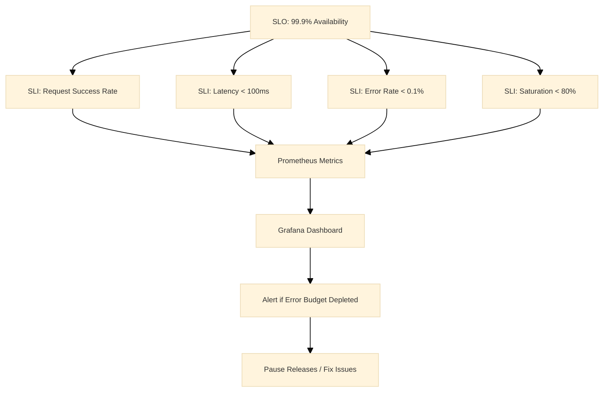
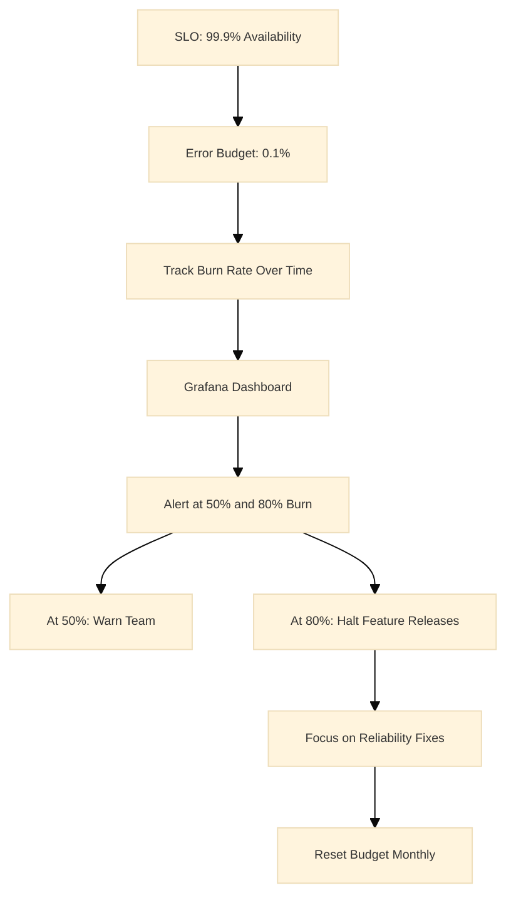
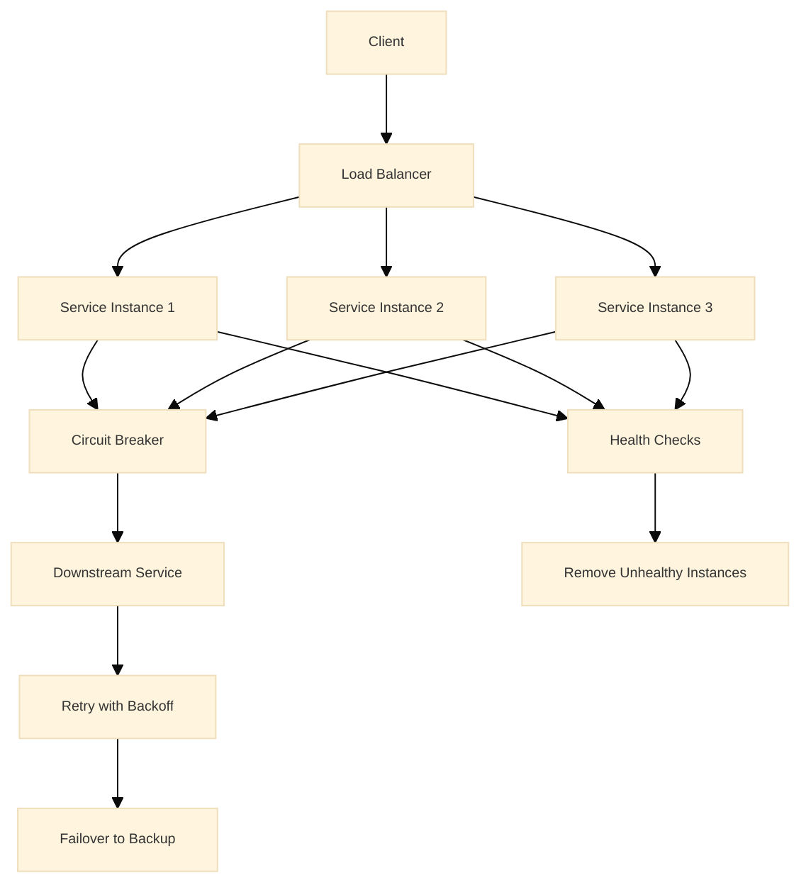
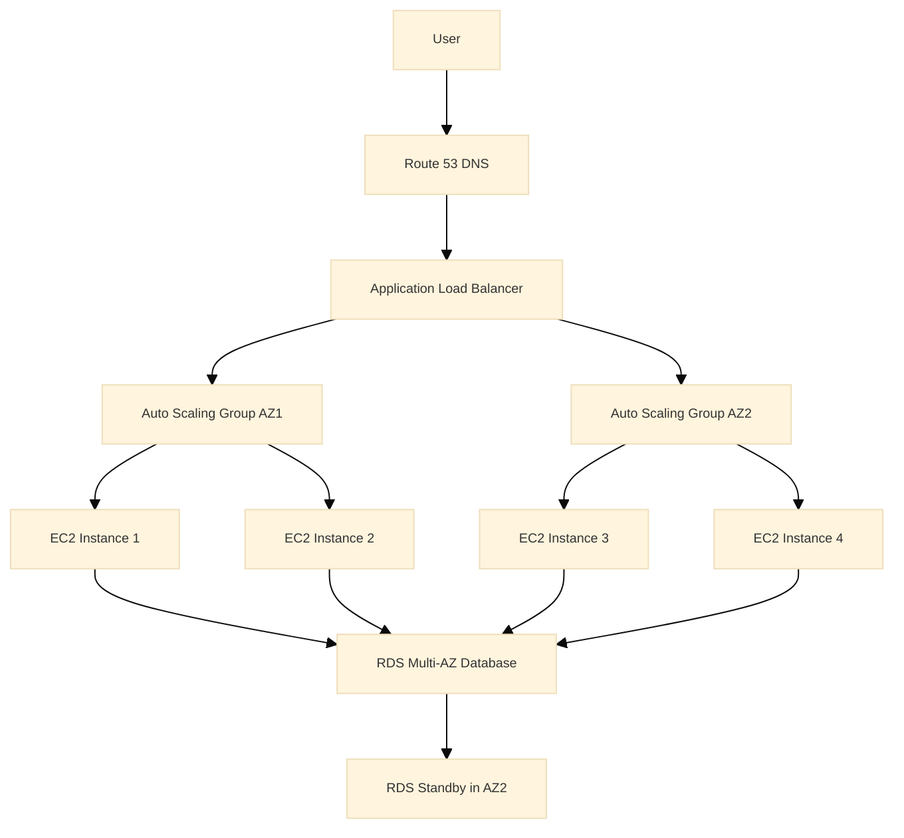
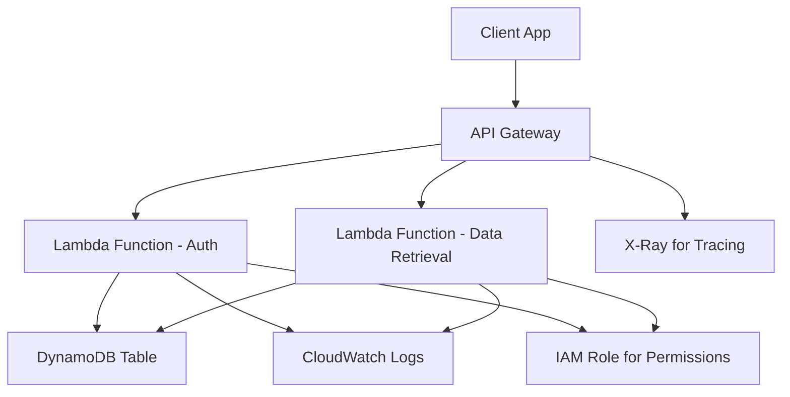
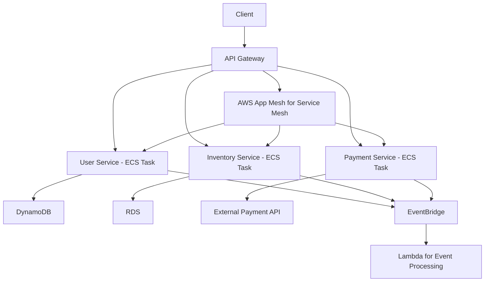
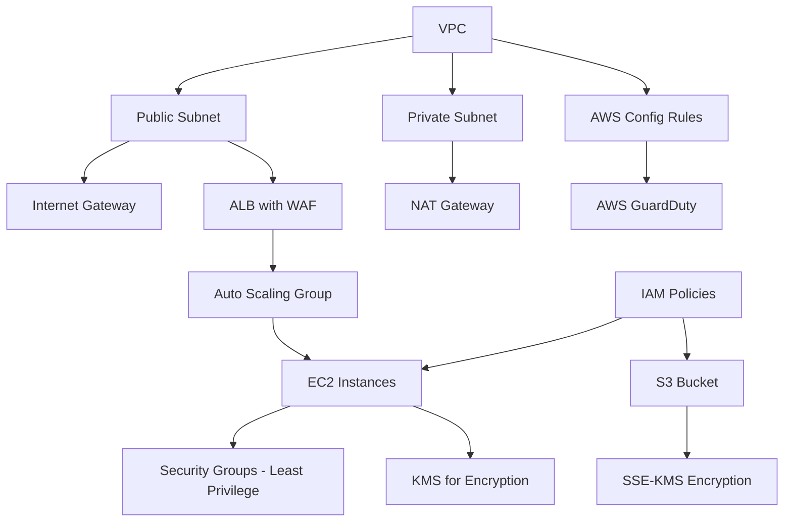
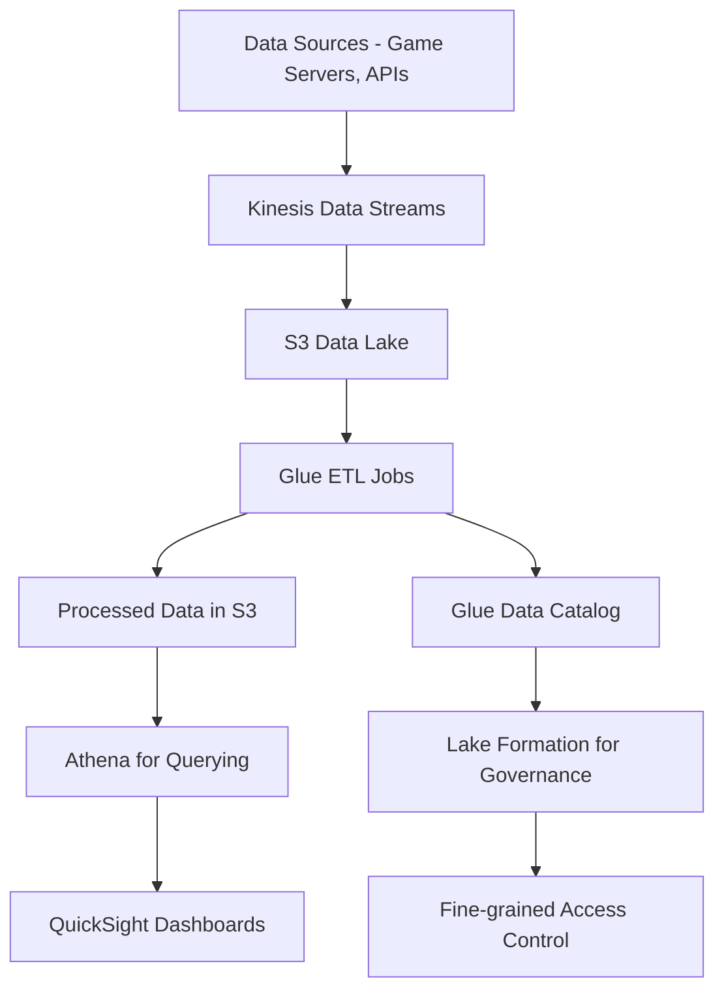

# EA SRE 3 Interview Preparation Guide

## Table of Contents

- [Introduction](#introduction)
- [Foundational SRE Concepts](#foundational-sre-concepts)
- [AWS Architecture](#aws-architecture)
- [Scalability](#scalability)
- [Observability](#observability)
- [Cost Optimization](#cost-optimization)
- [Multi-Cloud](#multi-cloud)
- [Advanced SRE](#advanced-sre)
- [Behavioral Questions](#behavioral-questions)
- [Scenario-Based Questions](#scenario-based-questions)

## Introduction

This guide prepares for **EA SRE 3** interviews, covering **AWS architecture**, multi-cloud, reliability, scalability, observability, and cost optimization. It includes 50+ scenario-based questions with detailed answers and examples.

**SREs** at this level design and maintain *highly reliable*, *scalable*, *cost-effective* systems, demonstrating expertise in cloud tech, automation, monitoring, and incident response.

**Think About:** What personal experiences from your SRE role align with these topics?

## Foundational SRE Concepts

### 1. How do you define and measure reliability in SRE?

**Answer:**
- Measured by **SLIs**: uptime, latency, error rates.
  - **Why:** Quantifies service performance objectively; enables data-driven decisions on reliability.
- **SLOs** set targets, e.g., 99.9% uptime.
  - **Why:** Defines acceptable reliability levels; guides engineering efforts and balances trade-offs.
- **SLAs** define consequences.
  - **Why:** Outlines penalties or actions for missing targets; aligns business and technical expectations.
  - **Why:** Outlines penalties or actions for missing targets; aligns business and tech.

**Special Notes:**
- SLIs: Service Level Indicators, metrics for measuring performance.
- SLOs: Service Level Objectives, targets for SLIs.
- SLAs: Service Level Agreements, contracts with consequences.

*Example:* For a game server, SLI is successful logins per minute; SLO is 99.95% success rate.

### 2. Explain implementing chaos engineering in AWS.

**Answer:**
1. Use AWS Fault Injection Simulator (FIS) to inject failures like instance terminations.
   - **Why:** Tests system under stress; identifies weaknesses proactively; benefits improved resilience and preparedness.
2. Monitor impact and improve resilience.
   - **Why:** Observes behavior during failures; leads to better design and fixes; benefits overall system stability.
  - **Why:** Observes behavior during failures; leads to better design.

**Service Explanations:**
- **AWS Fault Injection Simulator (FIS):** Service for running chaos experiments on AWS.

**Special Notes:**
- Chaos engineering: Practice of testing systems by introducing failures.
- Resilience: Ability to recover from disruptions.

*Example:* Simulating AZ failure to ensure auto-scaling kicks in within 5 minutes.

### 3. How do you handle incident response?

**Answer:**
1. Detect via monitoring
2. Assess impact
3. Contain the issue
4. Eradicate root cause
5. Recover service
6. Learn via post-mortems
- **Why:** Ensures systematic handling; reduces downtime and improves future responses.

**Special Notes:**
- Incident response: Steps to manage and resolve system disruptions.
- Post-mortems: Reviews after incidents to learn and prevent recurrence.

*Example:* During a DDoS attack, use Shield and WAF to mitigate, then analyze logs for prevention.

### 4. Describe building resilient microservices.

**Answer:**
- Implement retries, circuit breakers with Hystrix, and bulkheads to isolate failures.
  - **Why:** Retries handle transient errors; circuit breakers stop failing calls; bulkheads limit failure spread; benefits overall system stability and fault tolerance.
  - **Why:** Retries handle transient errors; circuit breakers stop failing calls; bulkheads limit failure spread; benefits overall system stability.

**Service Explanations:**
- **Hystrix:** Library for implementing circuit breakers.

**Special Notes:**
- Circuit breakers: Prevent calls to failing services.
- Bulkheads: Isolate components to contain failures.
- Retries: Re-attempt failed operations.

*Example:* If a downstream service fails, circuit breaker prevents cascading failures.

### 5. How do you ensure database reliability?

**Answer:**
- Use Multi-AZ RDS, backups, and read replicas.
  - **Why:** Multi-AZ provides failover; backups enable recovery; read replicas offload queries; benefits high availability, performance, and data safety.
- Monitor with CloudWatch.
  - **Why:** Tracks metrics and alerts on issues; enables proactive management; benefits quick issue detection.
  - **Why:** Tracks metrics and alerts on issues; proactive management.

**Service Explanations:**
- **RDS:** Relational Database Service with reliability features.
- **CloudWatch:** Monitoring service for metrics and logs.

**Special Notes:**
- Read replicas: Copies of database for read operations.
- Multi-AZ: Multi-Availability Zone deployment for redundancy.

*Example:* Automatic failover during maintenance minimizes downtime.

### 6. Explain error budgeting in SRE.

**Answer:**
- Error budget is the acceptable failure rate, e.g., 0.1% downtime.
  - **Why:** Defines how much unreliability is tolerable; allows calculated risk-taking for innovation.
- Track against SLOs to balance reliability and innovation.
  - **Why:** Ensures focus on stability when needed; promotes faster development otherwise.
  - **Why:** Ensures focus on stability when needed; promotes faster development otherwise.

**Special Notes:**
- Error budget: Portion of time service can be unreliable.
- SLOs: Targets that define the budget.

*Example:* If budget is exceeded, halt feature releases to focus on stability.

### 7. How do you automate reliability testing?

**Answer:**
- Use tools like Gremlin for chaos testing and Jenkins for CI/CD integrated reliability checks.
  - **Why:** Gremlin injects failures; Jenkins automates pipelines; ensures reliability is tested early; benefits proactive issue finding.
  - **Why:** Gremlin injects failures; Jenkins automates pipelines; ensures reliability is tested early.

**Service Explanations:**
- **Gremlin:** Chaos engineering platform.
- **Jenkins:** Automation server for CI/CD.

**Special Notes:**
- Chaos testing: Introducing failures to test resilience.
- CI/CD: Continuous Integration/Continuous Deployment.

*Example:* Automated tests simulate high load and failures before deployment.

### 8. Describe handling cascading failures.

**Answer:**
- Implement timeouts, rate limiting, and dependency isolation.
  - **Why:** Timeouts prevent hanging; rate limiting controls load; isolation contains failures; benefits system stability and prevents cascades.
  - **Why:** Timeouts prevent hanging; rate limiting controls load; isolation contains failures; benefits system stability.

**Special Notes:**
- Cascading failures: One failure triggering others in sequence.
- Dependency isolation: Preventing failures from spreading.

*Example:* In a service mesh, isolate failing pods to prevent cluster-wide outage.

### Key Takeaways
- Reliability is measured with SLIs, SLOs, and SLAs to quantify and target performance.
- Chaos engineering tests resilience by simulating failures.
- Incident response follows a structured process with post-mortems for learning.
- Resilient microservices use retries, circuit breakers, and bulkheads.
- Database reliability relies on Multi-AZ, backups, and read replicas.
- Error budgeting balances innovation and stability.
- Reliability testing automates chaos and load tests.

**Think About:** What reliability practices have you implemented in your teams?

## Service Level Management

### 9. How do you define and track SLOs and SLIs?

**Answer:**
- SLOs are reliability targets (e.g., 99.9% uptime)
- SLIs measure them (e.g., request success rate)
- Use error budgets to balance innovation and reliability

**Detailed Explanation:** Use the Four Golden Signals: Latency, Traffic, Errors, Saturation. Track with Prometheus and Grafana, alerting when budgets are depleted.

*Example:* For a game API, set SLO at 99.95%, monitored via success rate; when breached, paused features to fix issues.

**Diagram:**



### 10. Explain applying the Four Golden Signals.

**Answer:**
- Latency: Response time
- Traffic: Request volume
- Errors: Failure rate
- Saturation: Resource utilization
- Monitor these to ensure system health

**Detailed Explanation:** Use histograms for latency percentiles, counters for traffic, and gauges for saturation.

*Example:* Detected high saturation during peak load, auto-scaled instances to prevent errors.

## Reliability Deep Dive

### 11. What is an error budget, and how do you manage it?

**Answer:**
- Error budget is 100% - SLO (e.g., 0.1% for 99.9%).
- Track burn rate; if exceeded, halt features.

**Detailed Explanation:** Use dashboards to visualize, communicate to teams.

*Example:* Team paused releases when budget hit 80%, fixed issues to restore.

**Diagram:**



### 12. How do you design for fault tolerance in distributed systems?

**Answer:**
- Implement redundancy, circuit breakers, retries with exponential backoff.
- Use leader election for consistency.

**Detailed Explanation:** Follow CAP theorem trade-offs.

*Example:* In a microservice failure, circuit breaker prevented cascade, maintaining 99% uptime.

**Diagram:**



### 13. Explain the concept of toil and how to eliminate it.

**Answer:**
- Toil is manual, repetitive work.
- Automate with scripts, IaC, or tools like Ansible.

**Detailed Explanation:** Measure toil hours, prioritize automation.

*Example:* Automated certificate renewals, saving 10 hours/week.

## AWS Architecture

### 14. How would you design a highly available web application on AWS?

**Answer:**
- Use multi-AZ architecture with **Auto Scaling groups**, **Elastic Load Balancers (ELB)**, and **Amazon RDS** with Multi-AZ deployment.
  - **Why:** Ensures redundancy across isolated zones, preventing single points of failure and improving fault tolerance; benefits include higher availability and resilience against regional issues.
- Deploy **EC2 instances** in at least two **Availability Zones** behind an **Application Load Balancer (ALB)** to distribute traffic.
  - **Why:** Balances load evenly, handles traffic spikes, and routes around failed instances; rationale is to maintain performance and uptime during variable demand.
- Use **Auto Scaling** to adjust instance count based on CPU utilization or request count.
  - **Why:** Dynamically scales resources to match demand, optimizing costs and performance; prevents over-provisioning or under-provisioning.
- For the database, configure **Amazon RDS** with Multi-AZ for automatic failover.
  - **Why:** Provides synchronous replication and automatic failover, minimizing downtime; benefits database reliability and data consistency.
- Implement **Route 53** for DNS with health checks to route traffic away from unhealthy instances.
  - **Why:** Enables global DNS routing and failover, directing users to healthy endpoints; improves user experience by avoiding outages.

<details><summary>Service Explanations and Special Notes</summary>

**Service Explanations:**

| Service | Description |
|---------|-------------|
| [Auto Scaling groups](https://aws.amazon.com/autoscaling/) | Automatically adjusts the number of EC2 instances in response to demand. |
| [Elastic Load Balancers (ELB)](https://aws.amazon.com/elasticloadbalancing/) | Distributes incoming traffic across multiple targets. |
| [Amazon RDS](https://aws.amazon.com/rds/) | Managed relational database service for easy setup and scaling. |
| [EC2 instances](https://aws.amazon.com/ec2/) | Virtual servers in the cloud for running applications. |
| [Application Load Balancer (ALB)](https://aws.amazon.com/elasticloadbalancing/application-load-balancer/) | Layer 7 load balancer for HTTP/HTTPS traffic. |
| [Route 53](https://aws.amazon.com/route53/) | Scalable DNS web service. |

**Special Notes:**
- Multi-AZ: Deploy resources across multiple Availability Zones for high availability.
- Health checks: Periodic tests to verify resource health and trigger failovers.

</details>

<details><summary>Example and Diagram</summary>

*Example:* In a gaming application, if one AZ fails due to a power outage, the ALB automatically routes traffic to healthy instances in other AZs, and RDS fails over seamlessly, minimizing downtime.

**Diagram:**



</details>

### 2. Explain how to architect a serverless application using AWS Lambda and API Gateway.

**Answer:**
- Use **AWS Lambda** for compute, **API Gateway** for API management, and **DynamoDB** for storage.
  - **Why:** Leverages managed services to reduce operational overhead; benefits include automatic scaling, cost-efficiency (pay-per-use), and faster development.
- **API Gateway** acts as the entry point, triggering **Lambda functions** based on HTTP requests.
  - **Why:** Provides secure, scalable API management with features like throttling; rationale is to handle client requests efficiently and securely.
- **Lambda functions** are stateless and scale automatically.
  - **Why:** Ensures no server management and instant scaling; improves reliability and reduces costs during idle periods.
- Use **CloudWatch** for monitoring and **X-Ray** for tracing.
  - **Why:** Enables real-time insights and debugging; benefits proactive issue detection and performance optimization.
- Implement **IAM roles** for least-privilege access.
  - **Why:** Enhances security by granting only necessary permissions; prevents unauthorized access and complies with best practices.

<details><summary>Service Explanations and Special Notes</summary>

**Service Explanations:**
- **[AWS Lambda](https://aws.amazon.com/lambda/):** Serverless compute service running code in response to events.
- **[API Gateway](https://aws.amazon.com/api-gateway/):** Fully managed service for creating, publishing, and securing APIs.
- **[DynamoDB](https://aws.amazon.com/dynamodb/):** NoSQL database for high-performance, scalable applications.
- **[CloudWatch](https://aws.amazon.com/cloudwatch/):** Monitoring and observability service for AWS resources.
- **[X-Ray](https://aws.amazon.com/xray/):** Distributed tracing service for analyzing application performance.
- **[IAM roles](https://aws.amazon.com/iam/):** Identities with permissions for AWS services.

**Special Notes:**
- Serverless: No server management; scales automatically.
- Least-privilege: Grant minimal permissions to reduce security risks.

</details>

*Example:* A mobile app backend where user authentication triggers a Lambda function to query DynamoDB for user data. If traffic spikes during a game launch, Lambda scales to handle thousands of concurrent requests without manual intervention.

**Diagram:**



### 3. How do you handle data migration from on-premises to AWS?

**Answer:**
- Use **AWS Database Migration Service (DMS)** for homogeneous migrations or **AWS Snowball** for large datasets.
  - **Why:** DMS handles ongoing replication efficiently; Snowball speeds up large transfers; benefits include reduced downtime and secure data movement.
- Assess data dependencies, plan cutover windows, and perform dry runs.
  - **Why:** Identifies risks and ensures smooth transition; rationale is to avoid data loss or compatibility issues.
- For minimal downtime, use change data capture (CDC) in **DMS** to replicate ongoing changes.
  - **Why:** Captures real-time changes; minimizes service interruption during migration.

**Service Explanations:**
- **AWS Database Migration Service (DMS):** Managed service for migrating databases to AWS.
- **AWS Snowball:** Physical device for secure, high-speed data transfer.

**Special Notes:**
- Change Data Capture (CDC): Process to capture and replicate database changes in real-time.
- Dry runs: Test migrations without affecting production to validate processes.

*Example:* Migrating a 10TB database: Use Snowball to transfer initial data, then DMS with CDC to sync changes, ensuring the application switches to AWS with less than 1 hour downtime.

### 4. Describe architecting a microservices-based application on AWS.

**Answer:**
- Use **ECS** or **EKS** for container orchestration, **API Gateway** for service communication, and **EventBridge** for event-driven architecture.
  - **Why:** Orchestration manages scaling and deployment; API Gateway handles routing; EventBridge decouples services; benefits modularity, scalability, and fault isolation.
- Each microservice runs in its own container, with service discovery via **Cloud Map**.
  - **Why:** Isolates failures and enables independent scaling; Cloud Map automates discovery; improves maintainability and reliability.
- Implement circuit breakers with **AWS App Mesh** for resilience.
  - **Why:** Prevents cascading failures by stopping requests to failing services; enhances overall system stability.

**Service Explanations:**
- **ECS:** Container orchestration service for running Docker containers.
- **EKS:** Managed Kubernetes service for containerized applications.
- **API Gateway:** Manages APIs and routes requests to microservices.
- **EventBridge:** Serverless event bus for connecting applications.
- **Cloud Map:** Service discovery for microservices.
- **AWS App Mesh:** Service mesh for microservice communication and observability.

**Special Notes:**
- Circuit breakers: Pattern to stop failing service calls and allow recovery.
- Microservices: Architecture breaking apps into small, independent services.

*Example:* An e-commerce platform with separate services for user management, inventory, and payments. If the payment service fails, App Mesh routes traffic to a fallback, preventing full system outage.

**Diagram:**



### 5. How do you secure an AWS architecture?

**Answer:**
- Implement the principle of least privilege with **IAM**.
  - **Why:** Grants only necessary permissions; reduces breach impact and enforces security best practices.
- Use **VPC** with security groups and **NACLs**.
  - **Why:** Isolates resources and controls traffic; benefits network segmentation and protection against unauthorized access.
- Enable encryption with **KMS**.
  - **Why:** Protects data at rest and in transit; ensures compliance and prevents data exposure.
- Deploy **WAF** for web applications.
  - **Why:** Filters malicious web traffic; mitigates attacks like SQL injection and XSS.
- Use **AWS Config** and **GuardDuty** for compliance monitoring.
  - **Why:** Continuously audits configurations and detects threats; improves proactive security and compliance.

**Service Explanations:**
- **IAM:** Manages access to AWS services and resources.
- **VPC:** Virtual private cloud for network isolation.
- **NACLs:** Network Access Control Lists for subnet-level traffic control.
- **KMS:** Key Management Service for encryption keys.
- **WAF:** Web Application Firewall for protecting web apps.
- **AWS Config:** Service for compliance auditing and configuration tracking.
- **GuardDuty:** Threat detection service using ML.

**Special Notes:**
- Least privilege: Grant minimal access required for tasks.
- Encryption: Process of converting data to secure it from unauthorized access.

*Example:* For a financial app, restrict EC2 access to specific IP ranges via security groups, encrypt S3 buckets with SSE-KMS, and use WAF to block SQL injection attacks.

**Diagram:**



### 6. Explain designing for disaster recovery on AWS.

**Answer:**
- Use a multi-region strategy with pilot light or warm standby.
  - **Why:** Minimizes costs while ensuring quick recovery; pilot light keeps minimal resources running, warm standby has partial capacity.
- Replicate data with **Cross-Region Replication (CRR)** for **S3** and **Global Tables** for **DynamoDB**.
  - **Why:** Ensures data availability across regions; benefits low RTO and data durability.
- Automate recovery with **CloudFormation** and **Route 53** failover.
  - **Why:** Speeds up restoration and reduces manual errors; Route 53 routes traffic to healthy regions.

**Service Explanations:**
- **S3:** Object storage service with high durability.
- **DynamoDB:** NoSQL database with global tables for multi-region replication.
- **CloudFormation:** IaC service for provisioning AWS resources.
- **Route 53:** DNS service with failover capabilities.

**Special Notes:**
- Pilot light: Minimal resources running in backup region for quick scaling.
- Warm standby: Partial infrastructure ready in backup region.
- RTO: Recovery Time Objective, time to restore service.

*Example:* In a global outage, Route 53 switches DNS to a backup region, and EC2 instances launch from pre-configured AMIs, restoring service within 30 minutes.

**Diagram:**

```mermaid
graph TD
    PrimaryRegion[Primary Region] --> EC2_P[EC2 Instances]
    PrimaryRegion --> RDS_P[RDS Database]
    PrimaryRegion --> S3_P[S3 Bucket]
    BackupRegion[Backup Region] --> EC2_B[Pilot Light EC2]
    BackupRegion --> RDS_B[Warm Standby RDS]
    BackupRegion --> S3_B[S3 with CRR]
    Route53[Route 53] --> PrimaryRegion
    Route53 --> BackupRegion
    CloudFormation[CloudFormation] --> PrimaryRegion
    CloudFormation --> BackupRegion
    Note over Route53: Failover on Health Check Failure
```

### 7. How do you optimize network performance in AWS?

**Answer:**
- Use **CloudFront** for global distribution.
  - **Why:** Caches content at edge locations; reduces latency and bandwidth costs for global users.
- **VPC endpoints** for private access to AWS services.
  - **Why:** Avoids public internet routing; improves security and performance by reducing hops.
- **Transit Gateway** for multi-VPC connectivity.
  - **Why:** Simplifies network architecture; enables efficient routing between VPCs.
- Monitor with **VPC Flow Logs** and optimize instance types for network throughput.
  - **Why:** Provides visibility into traffic; allows tuning for better performance and cost.

**Service Explanations:**
- **CloudFront:** CDN for delivering content with low latency.
- **VPC endpoints:** Private connections to AWS services without internet.
- **Transit Gateway:** Network hub for connecting VPCs and on-premises networks.
- **VPC Flow Logs:** Captures IP traffic information for monitoring.

**Special Notes:**
- Network throughput: Amount of data transferred over a network in a given time.
- Edge locations: Points of presence for faster content delivery.

*Example:* A video streaming service uses CloudFront to cache content at edge locations, reducing latency from 500ms to 50ms for users worldwide.

### 8. Describe architecting a data lake on AWS.

**Answer:**
- Use **S3** as the storage layer, **Glue** for ETL, **Athena** for querying, and **Lake Formation** for governance.
  - **Why:** S3 provides scalable storage; Glue automates ETL; Athena enables SQL queries; Lake Formation secures and manages access; benefits cost-effective analytics and data processing.
- Ingest data via **Kinesis** or **DMS**, catalog with **Glue Catalog**.
  - **Why:** Kinesis streams real-time data; DMS migrates databases; Glue Catalog organizes metadata; improves data discoverability and integration.

**Service Explanations:**
- **S3:** Scalable object storage for data lakes.
- **Glue:** ETL service for data preparation.
- **Athena:** Serverless query service for data in S3.
- **Lake Formation:** Service for building and managing data lakes.
- **Kinesis:** Real-time data streaming service.
- **DMS:** Database migration service.
- **Glue Catalog:** Metadata repository for data assets.

**Special Notes:**
- ETL: Extract, Transform, Load process for data integration.
- Data lake: Centralized repository for storing structured and unstructured data.

*Example:* For analytics, raw game telemetry data is stored in S3, processed by Glue jobs into Parquet format, and queried via Athena for player behavior insights.

**Diagram:**



### Key Takeaways
- Designing highly available architectures with multi-AZ and auto-scaling is fundamental for reliability.
- Serverless architectures reduce operational overhead but require careful monitoring for cold starts.
- Data migration strategies must account for downtime and data integrity using tools like DMS.
- Microservices benefit from service meshes for resilience and observability.
- Security is layered, starting with IAM and VPC, and includes encryption and monitoring.
- Disaster recovery plans include pilot light and automated failover for quick restoration.
- Network optimization uses CDNs and VPC endpoints to reduce latency and costs.
- Data lakes leverage S3 and managed services for scalable analytics.

**Think About:** Which of these architectures have you implemented, and what challenges did you face?

## Scalability

### 22. How do you scale a web application horizontally on AWS?

**Answer:**
- Use Auto Scaling groups with ELB, triggered by CloudWatch metrics like CPU >70%.
  - **Why:** Auto Scaling adds/removes instances; ELB distributes load; CloudWatch monitors; benefits handling variable traffic, cost optimization, and performance.
  - **Why:** Auto Scaling adds/removes instances; ELB distributes load; CloudWatch monitors; benefits handling variable traffic.

**Service Explanations:**
- **Auto Scaling groups:** Automatically adjust instance count.
- **ELB:** Load balancer for distributing traffic.
- **CloudWatch:** Monitoring service for metrics.

**Special Notes:**
- Horizontal scaling: Adding more instances.
- CPU >70%: Threshold for scaling up.

*Example:* During peak gaming hours, scale from 10 to 100 instances automatically.

### 26. Explain vertical vs. horizontal scaling.

**Answer:**

| Scaling Type | Description | Advantages |
|--------------|-------------|------------|
| Vertical | Increases instance size | Simpler, no code changes |
| Horizontal | Adds more instances | Better fault tolerance, unlimited scale |

- Prefer horizontal for most cases.
  - **Why:** Better for distributed systems; allows unlimited growth and fault tolerance.
  - **Why:** Better for distributed systems; allows unlimited growth and fault tolerance.

**Special Notes:**
- Vertical scaling: Upgrading hardware of a single instance.
- Horizontal scaling: Adding more instances to distribute load.

*Example:* For a database, use read replicas (horizontal) over larger instances (vertical).

### 27. How do you handle stateful application scaling?

**Answer:**
- Use EFS for shared storage or DynamoDB for state.
  - **Why:** EFS provides shared file system; DynamoDB is scalable database; enables state persistence across instances.
- Avoid sticky sessions.
  - **Why:** Allows load balancer to distribute requests freely; improves scalability and fault tolerance.
  - **Why:** Allows load balancer to distribute requests freely; improves scalability.

**Service Explanations:**
- **EFS:** Elastic File System for shared storage.
- **DynamoDB:** NoSQL database for state management.

**Special Notes:**
- Stateful applications: Apps that maintain state between requests.
- Sticky sessions: Routing requests from same user to same instance.

**Special Notes:**
- Stateful applications: Applications that maintain state across requests.
- Sticky sessions: Keeping user requests to the same server instance.

*Example:* User sessions stored in ElastiCache, allowing seamless scaling.

### 28. Describe scaling databases on AWS.

**Answer:**
- Use Aurora Serverless for auto-scaling, or provisioned with read replicas.
  - **Why:** Aurora Serverless scales automatically; read replicas handle read load; benefits performance, cost, and scalability.
  - **Why:** Aurora Serverless scales automatically; read replicas handle read load; benefits performance and cost.

**Service Explanations:**
- **Aurora Serverless:** Serverless version of Aurora database.

**Special Notes:**
- Aurora: AWS's MySQL/PostgreSQL-compatible database.
- Read replicas: Copies for scaling reads.

**Special Notes:**
- Aurora: High-performance relational database.
- Read replicas: Database copies for scaling reads.

*Example:* During high traffic, Aurora scales storage and compute automatically.

### 29. How do you optimize for global scalability?

**Answer:**
- Use CloudFront, Route 53 latency-based routing, and multi-region deployments.
  - **Why:** CloudFront caches globally; Route 53 routes to low-latency regions; multi-region ensures availability; benefits worldwide performance and resilience.
  - **Why:** CloudFront caches globally; Route 53 routes to low-latency regions; multi-region ensures availability; benefits worldwide performance.

**Service Explanations:**
- **CloudFront:** CDN for global content delivery.
- **Route 53:** DNS with routing policies.

**Special Notes:**
- Latency-based routing: Directing traffic to closest or fastest region.
- Multi-region deployments: Running services in multiple regions.

**Special Notes:**
- Latency-based routing: Routing based on response time.
- Multi-region deployments: Services in multiple AWS regions.

*Example:* Global users access content from nearest edge location, reducing latency.

### 30. Explain load testing for scalability.

**Answer:**
- Use tools like JMeter or Artillery to simulate traffic, monitor with CloudWatch.
  - **Why:** Simulates real load; identifies limits; CloudWatch tracks performance; ensures scalability and prevents issues.
  - **Why:** Simulates real load; identifies limits; CloudWatch tracks performance; ensures scalability.

**Service Explanations:**
- **JMeter:** Open-source load testing tool.
- **Artillery:** Modern load testing framework.
- **CloudWatch:** Monitoring during tests.

**Special Notes:**
- Load testing: Simulating user load to test system capacity.
- Bottlenecks: Points where performance degrades.

**Special Notes:**
- Load testing: Testing system under simulated load.
- Bottlenecks: Points of congestion limiting performance.

*Example:* Test 10x traffic increase to ensure no bottlenecks.

### 31. How do you scale serverless applications?

**Answer:**
- Lambda scales automatically; use provisioned concurrency for cold starts.
  - **Why:** Automatic scaling handles demand; provisioned concurrency reduces latency; benefits ease, performance, and cost-efficiency.
  - **Why:** Automatic scaling handles demand; provisioned concurrency reduces latency; benefits ease and performance.

**Service Explanations:**
- **Lambda:** Serverless compute that scales per request.

**Special Notes:**
- Cold starts: Delay when function initializes.
- Provisioned concurrency: Keeps functions warm.

**Special Notes:**
- Cold starts: Delay when serverless function initializes.
- Provisioned concurrency: Pre-warms function instances.

*Example:* API Gateway routes to Lambda, handling millions of requests.

### 32. Describe caching strategies for scalability.

**Answer:**
- Use CloudFront for static content, ElastiCache for dynamic data.
  - **Why:** CloudFront speeds static delivery; ElastiCache caches dynamic data; reduces backend load and latency.
  - **Why:** CloudFront speeds static delivery; ElastiCache caches dynamic data; reduces backend load and latency.

**Service Explanations:**
- **CloudFront:** CDN for caching static assets.
- **ElastiCache:** In-memory caching service.

**Special Notes:**
- Caching: Storing data for faster access.
- Static content: Unchanging files like images.

**Special Notes:**
- Caching: Temporary storage of data for faster retrieval.
- Static content: Files that don't change frequently.

*Example:* Cache user profiles in Redis, reducing DB load by 50%.

### Key Takeaways
- Horizontal scaling uses auto-scaling and load balancers for handling traffic spikes.
- Vertical vs. horizontal scaling: Prefer horizontal for unlimited growth and fault tolerance.
- Stateful applications scale with shared storage and session management.
- Databases scale with read replicas and Aurora Serverless.
- Global scalability uses CDNs, Route 53, and multi-region deployments.
- Load testing identifies bottlenecks before production.
- Serverless scales automatically with provisioned concurrency for cold starts.
- Caching strategies include CloudFront and ElastiCache for performance.

**Think About:** What scaling challenges have you faced in high-traffic applications?

## 👁️ Observability

### 33. How do you implement observability in AWS?

**Answer:**
- Use CloudWatch for metrics, X-Ray for tracing, and CloudTrail for auditing.
  - **Why:** CloudWatch monitors performance; X-Ray traces requests; CloudTrail logs API calls; provides full visibility.
- Centralize logs with CloudWatch Logs.
  - **Why:** Aggregates logs for analysis; simplifies debugging and compliance.
  - **Why:** Aggregates logs for analysis; simplifies debugging.

**Service Explanations:**
- **CloudWatch:** Metrics, logs, and alarms.
- **X-Ray:** Distributed tracing.
- **CloudTrail:** Audit logs for AWS API calls.
- **CloudWatch Logs:** Centralized logging.

**Special Notes:**
- Observability: Ability to understand system state from outputs.
- Metrics: Quantitative measurements.

**Special Notes:**
- Observability: Measuring system internals via outputs.
- Metrics: Quantifiable data points.

*Example:* Trace a request from API Gateway through Lambda to DynamoDB.

### 34. Explain the three pillars of observability.

**Answer:**
- Logs: events
  - **Why:** Record discrete events for debugging and auditing.
- Metrics: quantitative data
  - **Why:** Measure performance over time for monitoring trends.
- Traces: request paths
  - **Why:** Follow requests through systems to identify bottlenecks.
  - **Why:** Follow requests through systems.

**Special Notes:**
- Pillars of observability: Logs, metrics, traces.
- Events: Specific occurrences in the system.

**Special Notes:**
- Pillars of observability: Logs, metrics, traces.
- Events: Discrete happenings in the system.

*Example:* Logs show errors, metrics track latency, traces identify bottlenecks.

### 35. How do you monitor microservices?

**Answer:**
- Use service mesh like App Mesh for metrics, and distributed tracing with X-Ray.
  - **Why:** App Mesh provides service-level insights; X-Ray traces across services; benefits understanding complex interactions and issues.
  - **Why:** App Mesh provides service-level insights; X-Ray traces across services; benefits understanding complex interactions.

**Service Explanations:**
- **App Mesh:** Service mesh for microservices.
- **X-Ray:** Tracing for distributed systems.

**Special Notes:**
- Service mesh: Infrastructure layer for service-to-service communication.
- Distributed tracing: Tracking requests across multiple services.

**Special Notes:**
- Service mesh: Infrastructure for service-to-service communication.
- Distributed tracing: Following requests across multiple services.

*Example:* Visualize service dependencies and latency in X-Ray.

### 36. Describe setting up alerts.

**Answer:**
- Define thresholds in CloudWatch, e.g., CPU >80% triggers scaling or alerts.
  - **Why:** Proactive notifications; prevents issues from escalating; enables timely responses.
  - **Why:** Proactive notifications; prevents issues from escalating.

**Service Explanations:**
- **CloudWatch:** For setting alarms.

**Special Notes:**
- Thresholds: Limits that trigger actions.
- Alerts: Notifications of issues.

**Special Notes:**
- Thresholds: Values that trigger responses.
- Alerts: Signals for attention.

*Example:* Alert on error rate >5% for immediate investigation.

### 37. How do you handle log aggregation?

**Answer:**
- Use CloudWatch Logs, Kinesis for streaming, and Elasticsearch for analysis.
  - **Why:** CloudWatch centralizes; Kinesis streams; Elasticsearch searches; enables comprehensive log management and insights.
  - **Why:** CloudWatch centralizes; Kinesis streams; Elasticsearch searches; enables comprehensive log management.

**Service Explanations:**
- **CloudWatch Logs:** Log aggregation service.
- **Kinesis:** Data streaming service.
- **Elasticsearch:** Search and analytics engine.

**Special Notes:**
- Log aggregation: Collecting logs from multiple sources.
- Anomaly detection: Identifying unusual patterns.

**Special Notes:**
- Log aggregation: Gathering logs from sources.
- Anomaly detection: Identifying unusual patterns.

*Example:* Aggregate logs from multiple EC2 instances for anomaly detection.

### 38. Explain distributed tracing.

**Answer:**
- Tools like X-Ray track requests across services, identifying latency sources.
  - **Why:** Provides end-to-end visibility; helps pinpoint bottlenecks and optimize performance.
  - **Why:** Provides end-to-end visibility; helps pinpoint bottlenecks.

**Service Explanations:**
- **X-Ray:** AWS distributed tracing service.

**Special Notes:**
- Distributed tracing: Following a request through multiple services.
- Latency sources: Components causing delays.

**Special Notes:**
- Distributed tracing: Tracing requests across systems.
- Latency sources: Components introducing delay.

*Example:* Trace shows 90% latency in DB query, prompting optimization.

### 39. How do you measure user experience?

**Answer:**
- Use Real User Monitoring (RUM) with CloudWatch Synthetics.
  - **Why:** Captures real user interactions; identifies performance issues from user perspective; benefits user experience improvement.
  - **Why:** Captures real user interactions; identifies performance issues from user perspective.

**Service Explanations:**
- **CloudWatch Synthetics:** For canary monitoring and RUM.

**Special Notes:**
- RUM: Monitoring actual user experiences.
- User journeys: Paths users take through the app.

**Special Notes:**
- RUM: Real User Monitoring.
- User journeys: Sequences of user actions.

*Example:* Simulate user journeys to detect frontend issues.

### 40. Describe anomaly detection.

**Answer:**
- Use CloudWatch Insights or ML-based tools to detect unusual patterns.
  - **Why:** Identifies deviations from normal; enables early issue detection and prevention.
  - **Why:** Identifies deviations from normal; enables early issue detection.

**Service Explanations:**
- **CloudWatch Insights:** For log and metric analysis.

**Special Notes:**
- Anomaly detection: Finding outliers in data.
- Unusual patterns: Deviations from expected behavior.

**Special Notes:**
- Anomaly detection: Identifying abnormal behavior.
- Unusual patterns: Patterns outside expected range.

*Example:* Alert on sudden traffic drop indicating outage.

### Key Takeaways
- Observability combines logs, metrics, and traces for full system insight.
- The three pillars: Logs for events, metrics for trends, traces for paths.
- Microservices monitoring uses service meshes and distributed tracing.
- Alerts are set with thresholds in CloudWatch for proactive response.
- Log aggregation centralizes data with tools like CloudWatch Logs.
- Distributed tracing identifies bottlenecks with X-Ray.
- User experience is measured with RUM and synthetics.
- Anomaly detection uses ML for unusual patterns.

**Think About:** How do you ensure observability in your current systems?

